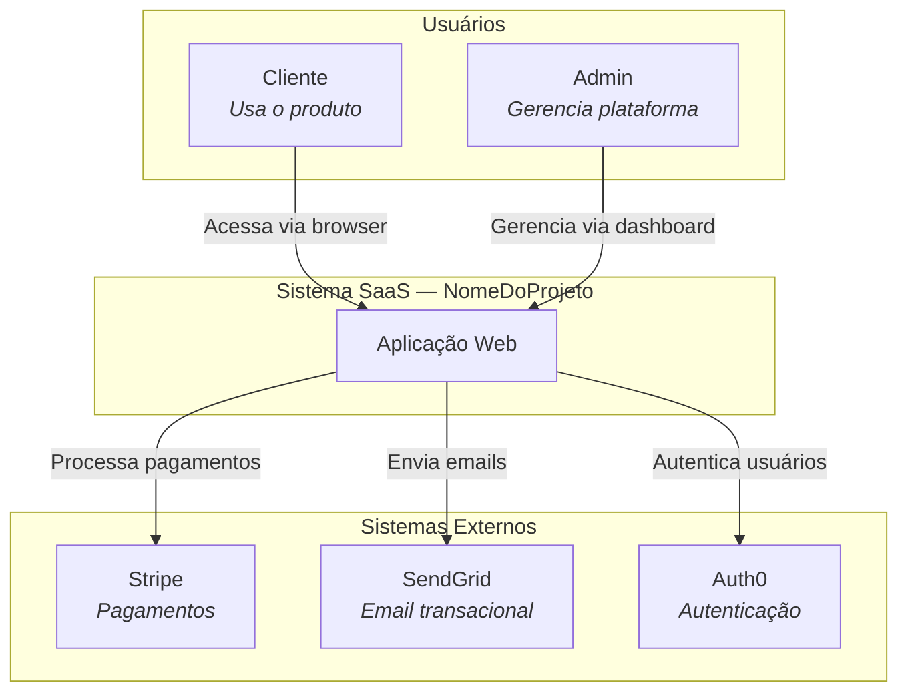
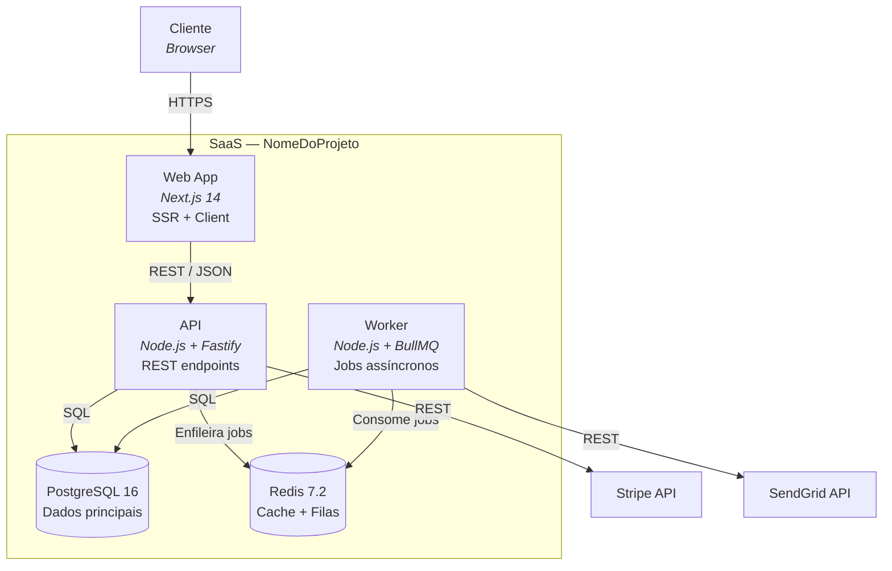
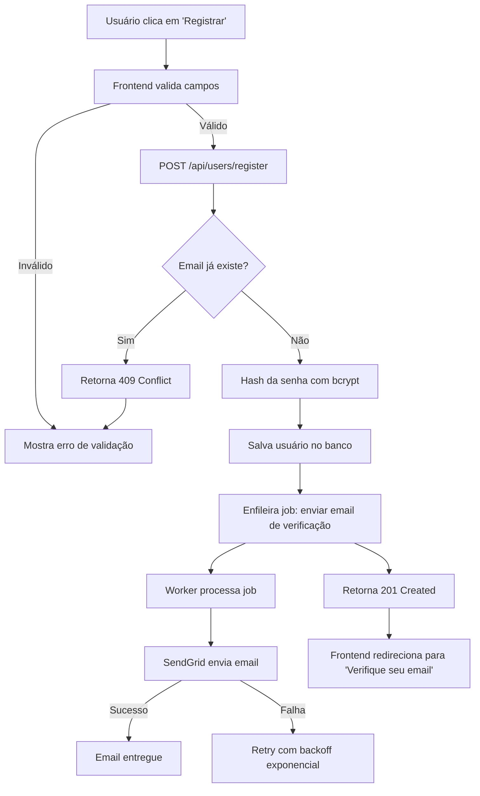
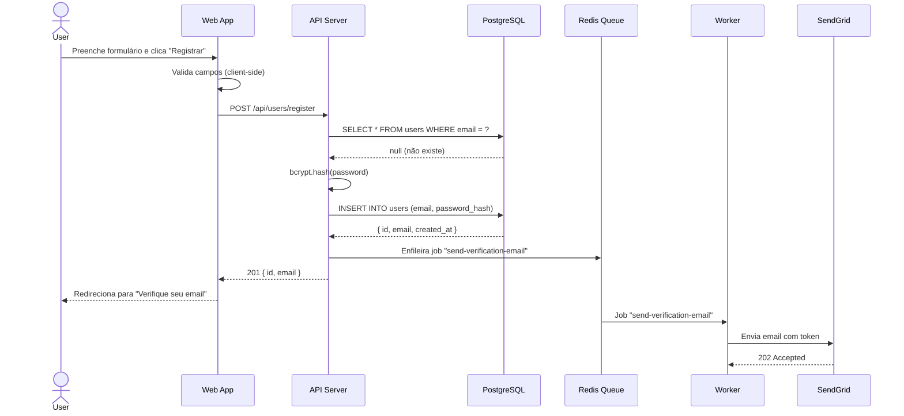
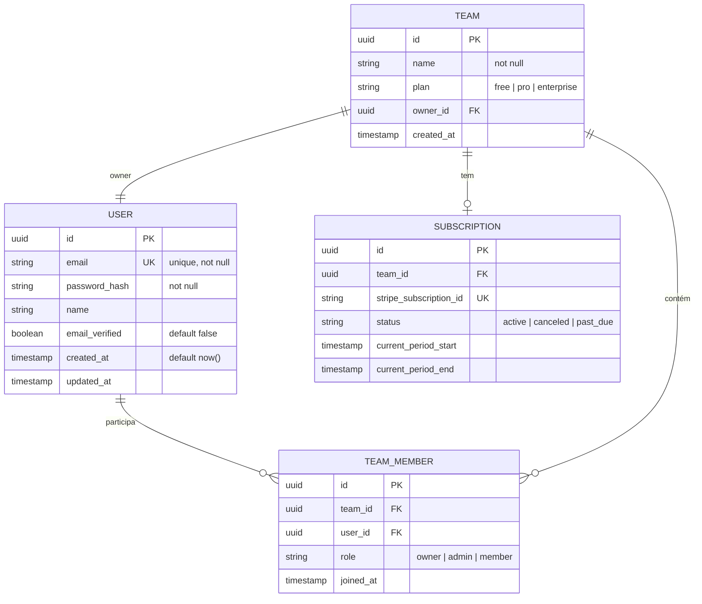

# Guia de Arquitetura para Projetos SaaS
## Como criar diagramas, fluxos e documentação que agentes de IA consomem

*Março 2026*
*Baseado no C4 Model (Simon Brown), ADRs (Michael Nygard), práticas de O'Reilly e Mermaid como linguagem de diagramação.*

---

## Por que Este Guia Existe

Diagramas de arquitetura em projetos com IA não são decoração. São a **fonte de verdade operacional** que os agentes leem para entender o sistema. Um fluxograma bem feito se transforma diretamente em testes. Um diagrama de arquitetura evita que o agente invente integrações que não existem. Um ADR impede que decisões sejam revertidas acidentalmente.

Tudo em Mermaid — versionável no Git, legível por humanos e agentes, renderizável em GitHub/GitLab/Notion sem ferramenta extra.

---

## Estrutura de Diretórios

Antes de qualquer diagrama, crie a estrutura onde tudo vai morar:

```
docs/
├── architecture/
│   ├── overview.mermaid          # Visão geral do sistema (C4 Nível 1)
│   ├── containers.mermaid        # Containers e tecnologias (C4 Nível 2)
│   ├── data-model.mermaid        # Modelo de dados (ER)
│   ├── flows/                    # Um diretório por fluxo
│   │   ├── user-registration/
│   │   │   ├── README.md         # Descrição + regras de negócio
│   │   │   └── diagram.mermaid   # Fluxograma
│   │   ├── payment-checkout/
│   │   │   ├── README.md
│   │   │   └── diagram.mermaid
│   │   └── auth-login/
│   │       ├── README.md
│   │       └── diagram.mermaid
│   └── decisions/                # ADRs
│       ├── README.md             # Índice de decisões
│       ├── 001-database-choice.md
│       ├── 002-auth-strategy.md
│       └── 003-monorepo-structure.md
└── api/
    └── endpoints.md              # Documentação de endpoints
```

Regra: cada diagrama .mermaid é Mermaid puro (sem fences markdown, sem headers). O README.md acompanhante contém a explicação em texto.

---

## Nível 1 — Visão Geral do Sistema (C4 Context)

### O que é

O mapa mais alto. Mostra o sistema como uma caixa única, quem interage com ele (usuários, sistemas externos) e quais são as relações. Qualquer pessoa — dev, PM, stakeholder — deve entender este diagrama em 30 segundos.

Simon Brown (criador do C4): "É como o Google Maps no zoom mais afastado. Você vê o país, não as ruas."

### O que incluir

- O sistema como um todo (uma caixa)
- Tipos de usuário que interagem com ele
- Sistemas externos (APIs de terceiros, serviços de pagamento, email, etc.)
- Direção do fluxo de dados (quem chama quem)

### O que NÃO incluir

- Tecnologias específicas (não é aqui que aparece "PostgreSQL" ou "React")
- Detalhes internos (serviços, módulos, componentes)
- Endpoints ou rotas

### Template Mermaid



### Checklist

- [ ] Todo ator externo está representado?
- [ ] Todo sistema externo com integração está presente?
- [ ] As setas indicam direção de comunicação?
- [ ] As labels das setas descrevem o que é trocado?
- [ ] Um não-técnico entenderia este diagrama?

---

## Nível 2 — Containers (C4 Container)

### O que é

Zoom in. Agora mostra os containers que compõem o sistema: aplicação web, API, banco de dados, worker de filas, etc. Cada container é uma unidade que roda separadamente (tem seu próprio processo, deploy, etc.).

Este é o diagrama que mais importa para agentes de IA. É aqui que eles entendem: "existem 3 serviços, este fala com aquele, ambos usam o mesmo banco."

### O que incluir

- Cada container com tecnologia e versão (Ex: "API — Go 1.22 + Gin")
- Bancos de dados com tipo (Ex: "PostgreSQL 16")
- Filas/workers com propósito
- Frontend com framework
- Direção e protocolo de comunicação (REST, gRPC, WebSocket, fila)

### Template Mermaid



### Checklist

- [ ] Cada container tem tecnologia e versão?
- [ ] O protocolo de comunicação está nas setas?
- [ ] Bancos de dados estão diferenciados visualmente (cilindro)?
- [ ] Workers/filas estão representados?
- [ ] Sistemas externos do Nível 1 estão conectados aos containers corretos?

---

## Nível 3 — Fluxos por Feature

### O que é

Este é o nível que transforma diagramas em testes. Para cada feature do MVP, um fluxograma mostrando o caminho completo da ação do usuário até a resposta final. O Test-Writer usa estes diagramas como guia para saber o que testar.

Inspirado no artigo da O'Reilly (Fev 2026) sobre reverse engineering de arquitetura: cada fluxo deve mapear o processo de ponta a ponta, do clique na UI até o evento final no backend.

### O que incluir no README.md

Para cada fluxo, o README.md acompanhante deve conter:

```markdown
# Fluxo: [Nome do Fluxo]

## Descrição
[O que este fluxo faz, em 1-2 frases]

## Trigger
[O que inicia o fluxo — clique em botão, evento de sistema, cron job]

## Atores
[Quem está envolvido — usuário, admin, sistema externo]

## Pré-condições
[O que precisa ser verdade para o fluxo começar]

## Caminho Principal (Happy Path)
1. [Passo 1]
2. [Passo 2]
3. [Passo N]

## Caminhos Alternativos
- [Se X acontecer, então Y]
- [Se Z falhar, então W]

## Regras de Negócio
- [Regra 1: ex. "Email deve ser único no sistema"]
- [Regra 2: ex. "Senha mínima de 8 caracteres"]

## Endpoints Envolvidos
- POST /api/users/register
- POST /api/auth/verify-email

## Cenários de Teste Derivados
- Happy path: registro com dados válidos → 201
- Email duplicado → 409
- Senha curta → 400
- Email inválido → 400
- Verificação de email → token válido → 200
- Verificação de email → token expirado → 401
```

A seção "Cenários de Teste Derivados" é a ponte direta entre arquitetura e TDD. O Test-Writer lê esta seção e gera os testes.

### Template Mermaid — Flowchart



### Template Mermaid — Sequence Diagram

Para fluxos com múltiplos serviços, use diagrama de sequência:



### Quando Usar Qual

| Tipo | Quando usar |
|---|---|
| Flowchart | Fluxos com decisões (if/else), caminhos alternativos, loops |
| Sequence | Comunicação entre múltiplos serviços em ordem temporal |
| Ambos | Fluxos complexos — flowchart para visão geral, sequence para detalhes |

### Checklist por Fluxo

- [ ] O fluxo começa com uma ação do usuário ou evento?
- [ ] Cada decisão (if/else) está representada como losango?
- [ ] Caminhos de erro estão mapeados (não só o happy path)?
- [ ] Endpoints estão visíveis no diagrama?
- [ ] Os cenários de teste estão derivados dos caminhos do diagrama?
- [ ] Sistemas externos (Stripe, SendGrid) aparecem quando envolvidos?

---

## Nível 4 — Modelo de Dados

### O que é

Diagrama ER (Entity Relationship) mostrando as entidades do sistema, seus campos e como se relacionam. O Implementer e o Test-Writer usam este diagrama para entender a estrutura de dados.

### Template Mermaid



### Checklist

- [ ] Toda entidade tem PK definido?
- [ ] FKs estão marcados e as relações estão desenhadas?
- [ ] Constraints importantes estão visíveis (unique, not null)?
- [ ] Tipos de dados estão definidos?
- [ ] Cardinalidade está correta (1:1, 1:N, N:N)?

---

## Nível 5 — Decisões de Arquitetura (ADRs)

### O que é

Architecture Decision Records documentam o PORQUÊ de cada decisão técnica significativa. Popularizado por Michael Nygard em 2011 e adotado por AWS, Google, GitHub e Microsoft Azure.

ADRs não são longos. São documentos curtos (1-2 páginas) que capturam: o contexto, as opções consideradas, a decisão tomada e suas consequências. Formato: Markdown, versionados no Git, append-only (decisões antigas são marcadas como "superseded", nunca deletadas).

### Quando Escrever um ADR

Escreva um ADR quando a decisão:
- Afeta a estrutura do sistema (escolha de banco, framework, protocolo)
- É difícil de reverter depois de implementada
- Será questionada por futuros membros da equipe ("por que usamos X?")
- Tem alternativas que foram consideradas e descartadas

Não escreva ADR para:
- Decisões triviais (nome de variável, estilo de código)
- Decisões temporárias que serão revisitadas na próxima sprint

### Template (baseado em Michael Nygard + MADR)

```markdown
# ADR-NNN: [Título com verbo no presente — Ex: "Usar PostgreSQL como banco principal"]

## Status
[Proposto | Aceito | Deprecado | Substituído por ADR-XXX]

## Data
[YYYY-MM-DD]

## Contexto
[Qual problema ou necessidade motivou esta decisão?
Qual é a situação atual? Quais forças estão em jogo?]

## Opções Consideradas

### Opção 1: [Nome]
- **Prós:** [lista]
- **Contras:** [lista]

### Opção 2: [Nome]
- **Prós:** [lista]
- **Contras:** [lista]

### Opção 3: [Nome] (se aplicável)
- **Prós:** [lista]
- **Contras:** [lista]

## Decisão
[Qual opção foi escolhida e por quê.
1-2 parágrafos no máximo.]

## Consequências
[O que muda por causa desta decisão.
Inclua consequências positivas, negativas e neutras.
Todas afetam o projeto no futuro.]

## Nível de Confiança
[Alto | Médio | Baixo — decisões com baixa confiança
devem ser revisitadas. Documentar isso é útil.]
```

### Exemplo Real

```markdown
# ADR-001: Usar PostgreSQL como banco de dados principal

## Status
Aceito

## Data
2026-03-19

## Contexto
O projeto é um SaaS multi-tenant que precisa de dados
relacionais (usuários, times, assinaturas), mas também
de flexibilidade para metadados customizáveis por tenant.
Dois bancos foram considerados seriamente.

## Opções Consideradas

### Opção 1: PostgreSQL 16
- **Prós:** ACID, JSONB para dados flexíveis, pgvector
  para futuras features de IA, ecossistema maduro,
  suportado por todos os provedores de hosting
- **Contras:** Mais complexo que SQLite para setup local

### Opção 2: MongoDB 7
- **Prós:** Schema flexível nativo, bom para prototipagem
- **Contras:** Sem transações ACID cross-collection por
  padrão, menos suportado em hosting barato, schema
  validation precisa ser configurada manualmente

## Decisão
PostgreSQL 16, usando JSONB para campos de metadados
flexíveis por tenant. Isso nos dá o melhor dos dois
mundos: estrutura relacional para dados core + flexibilidade
para dados customizáveis.

## Consequências
- Migrations versionadas são obrigatórias (já previsto no workflow)
- Setup local requer Docker (ou PostgreSQL instalado)
- JSONB queries precisam de índices GIN para performance
- pgvector disponível para features de IA no futuro

## Nível de Confiança
Alto — PostgreSQL é a escolha padrão para 99% dos SaaS
e não há requisito que justifique alternativa.
```

---

## Nível 6 — Documentação de API

### O que é

Documentação de cada endpoint que o sistema expõe. Não é Swagger/OpenAPI formal (embora possa evoluir para isso). É um documento prático que o Implementer e o Test-Writer consultam.

### Template por Endpoint

```markdown
## POST /api/users/register

**Descrição:** Registra um novo usuário no sistema.

**Autenticação:** Nenhuma (endpoint público)

**Rate Limit:** 5 requests/minuto por IP

**Headers:**
| Header | Valor | Obrigatório |
|---|---|---|
| Content-Type | application/json | Sim |

**Body (request):**
```json
{
  "email": "usuario@exemplo.com",
  "password": "minhasenha123",
  "name": "João Silva"
}
```

**Validações:**
- email: formato válido, único no sistema
- password: mínimo 8 caracteres
- name: opcional, máximo 100 caracteres

**Respostas:**

| Status | Quando | Body |
|---|---|---|
| 201 | Registro bem-sucedido | `{ "id": "uuid", "email": "...", "name": "..." }` |
| 400 | Dados inválidos | `{ "error": "Email inválido", "field": "email" }` |
| 409 | Email já existe | `{ "error": "Email já cadastrado" }` |
| 429 | Rate limit excedido | `{ "error": "Muitas tentativas. Tente novamente em X segundos" }` |

**Exemplo de chamada:**
```bash
curl -X POST http://localhost:3000/api/users/register \
  -H "Content-Type: application/json" \
  -d '{"email":"user@test.com","password":"senha12345","name":"Test"}'
```
```

---

## O Processo Completo

### Passo 1 — Entrevista (5-10 min)

Antes de desenhar qualquer diagrama, colete:

1. O que o sistema faz? (1 frase)
2. Quem são os tipos de usuário?
3. Quais as 3-5 features do MVP?
4. Quais sistemas externos são necessários? (pagamento, email, auth, etc.)
5. Qual o stack escolhido?
6. Quais são as regras de negócio mais importantes?

### Passo 2 — Visão Geral (Nível 1)

Crie `docs/architecture/overview.mermaid` mostrando o sistema, usuários e integrações externas. Valide com o dev: "Está faltando algum ator ou sistema externo?"

### Passo 3 — Containers (Nível 2)

Crie `docs/architecture/containers.mermaid` detalhando os containers internos. Valide: "Estes são todos os serviços? A comunicação entre eles está correta?"

### Passo 4 — Modelo de Dados (Nível 4)

Crie `docs/architecture/data-model.mermaid` com as entidades e relações. Valide: "Estes são todos os modelos? As relações estão corretas?"

### Passo 5 — ADRs das Decisões Maiores

Para cada decisão técnica significativa (banco, framework, auth, monorepo), crie um ADR em `docs/architecture/decisions/`.

### Passo 6 — Fluxos por Feature (Nível 3)

Para cada feature do MVP, crie um diretório em `docs/architecture/flows/` com README.md + diagram.mermaid. Este é o passo mais importante para os agentes — é daqui que saem os testes.

### Passo 7 — Documentação de API

Para cada endpoint identificado nos fluxos, documente em `docs/api/endpoints.md`.

### Passo 8 — Vincular ao CLAUDE.md

No CLAUDE.md do projeto, adicione:

```markdown
## Arquitetura

A documentação completa de arquitetura está em `docs/architecture/`.

- Visão geral: `docs/architecture/overview.mermaid`
- Containers: `docs/architecture/containers.mermaid`
- Modelo de dados: `docs/architecture/data-model.mermaid`
- Fluxos por feature: `docs/architecture/flows/`
- Decisões (ADRs): `docs/architecture/decisions/`
- API: `docs/api/endpoints.md`

Antes de implementar qualquer feature, leia o fluxo correspondente
em docs/architecture/flows/[nome-da-feature]/.
```

---

## Como Cada Agente Usa Estes Artefatos

| Agente | O que lê | Por quê |
|---|---|---|
| PM-Spec | Nível 1 + Nível 2 | Entender escopo e integrações antes de escrever spec |
| Architect | Tudo | Validar que nova feature respeita arquitetura existente |
| Test-Writer | Fluxos (Nível 3) + API docs | Derivar cenários de teste dos caminhos do diagrama |
| Implementer | Containers (Nível 2) + Data Model + API docs | Saber onde implementar e como os serviços se conectam |
| Reviewer | ADRs + Containers | Verificar se implementação segue decisões documentadas |
| Deployer | Containers (Nível 2) | Saber quais serviços fazer build e deploy |

---

## Erros Comuns a Evitar

**Diagramas sem labels nas setas.** Uma seta de A para B sem label não diz nada. Sempre indique o que é trocado (REST, SQL, Enfileira job, etc.).

**Misturar níveis de abstração.** Se o diagrama de Nível 1 mostra "PostgreSQL", está detalhado demais. Se o Nível 2 não mostra tecnologias, está vago demais.

**Criar diagramas e nunca atualizar.** Diagrama desatualizado é pior que nenhum diagrama — o agente vai seguir informação errada. Atualize quando a arquitetura mudar.

**Fluxos sem caminhos de erro.** Se o diagrama só mostra o happy path, os testes vão cobrir só o happy path. Mapeie erros, timeouts e edge cases no fluxo.

**ADRs sem opções descartadas.** Se o ADR diz "usamos PostgreSQL" mas não diz o que mais foi considerado, ele não serve para nada. O valor está nas alternativas e no porquê da escolha.

**Diagramas em ferramentas proprietárias.** Figma, Lucidchart, Draw.io — todos são ótimos para humanos, mas agentes não leem .fig ou .drawio. Mermaid é texto, vive no Git, e qualquer agente lê.

---

## Referências

1. Simon Brown — C4 Model (c4model.com)
2. Michael Nygard — "Documenting Architecture Decisions" (2011)
3. MADR — Markdown Architectural Decision Records (adr.github.io/madr)
4. O'Reilly — "Reverse Engineering Your Software Architecture with Claude Code" (2026)
5. Microsoft Azure — "Maintain an Architecture Decision Record" (Azure Well-Architected)
6. Mermaid.js — Documentação oficial (mermaid.js.org)
7. design-doc-mermaid — Skill de diagramação para Claude Code (GitHub)
