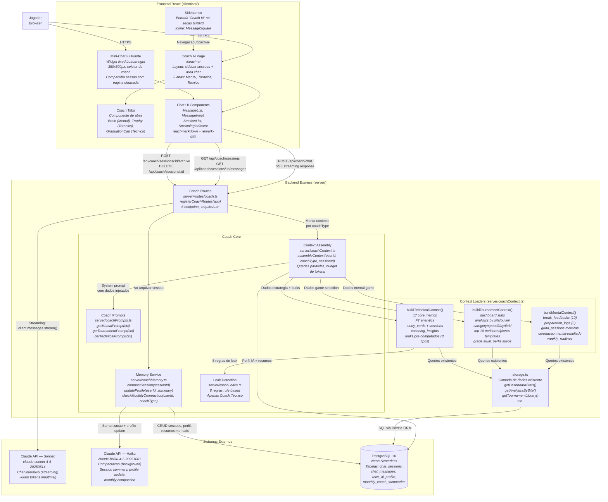

# AI Coach — C4 Component Diagram

Diagrama de componentes mostrando a arquitetura interna do AI Coach e como se integra ao sistema existente do Grindfy.

## Diagrama



## Componentes por Camada

### Frontend

| Componente | Arquivo | Responsabilidade |
|-----------|---------|-----------------|
| Coach AI Page | `client/src/pages/CoachAI.tsx` | Pagina dedicada com layout sidebar + chat, 3 abas |
| Mini-Chat | `client/src/components/MiniChat.tsx` | Widget flutuante, visivel em paginas protegidas exceto /coach-ai |
| Coach Tabs | `client/src/components/CoachTabs.tsx` | Abas de selecao de coach com icones |
| Chat UI | `client/src/components/chat/` | MessageList, MessageInput, SessionList, StreamingIndicator |
| Sidebar entry | `client/src/components/Sidebar.tsx` | Link "Coach IA" na secao GRIND |

### Backend

| Componente | Arquivo | Responsabilidade |
|-----------|---------|-----------------|
| Coach Routes | `server/routes/coach.ts` | 5 endpoints HTTP, rate limiting, validacao |
| Context Assembly | `server/coachContext.ts` | Orquestra queries paralelas, monta contexto Claude API |
| Coach Prompts | `server/coachPrompts.ts` | System prompts dos 3 coaches (constantes com template literals) |
| Memory Service | `server/coachMemory.ts` | Compactacao de sessoes, atualizacao de perfil, compactacao mensal |
| Leak Detection | `server/coachLeaks.ts` | 8 regras rule-based para Coach Tecnico |
| Context Loaders | Funcoes em `coachContext.ts` | buildMentalContext, buildTournamentContext, buildTechnicalContext |

### Externos

| Componente | Uso | Budget |
|-----------|-----|--------|
| Claude Sonnet | Chat interativo (streaming) | ~6600 tokens input, ~500 output / msg |
| Claude Haiku | Compactacao (background) | ~2000 tokens input / compactacao |
| PostgreSQL 16 (Neon) | 4 tabelas novas + leitura de ~15 tabelas existentes | Indices otimizados |

## Fluxo de Dados Resumido

```
Jogador → Chat UI → Coach Routes → Context Assembly → Claude Sonnet → SSE → Chat UI → Jogador
                                         ↓
                              Context Loaders (paralelo)
                              ├── Coach Prompts (system prompt)
                              ├── user_ai_profile (perfil IA)
                              ├── monthly_coach_summaries (resumos mensais)
                              ├── chat_sessions.summary (ultima sessao)
                              ├── chat_messages (historico 20 msgs)
                              └── Stats por coach type (DB queries)

Ao arquivar → Memory Service → Claude Haiku → session summary + profile update → DB
1x/mes      → Memory Service → Claude Haiku → monthly summary → DB → cleanup msgs >60d
```
