# AI Coach — Data Model

Diagrama ER das novas tabelas do AI Coach e suas relacoes com tabelas existentes do Grindfy.

## Tabelas Novas

- `chat_sessions` — Sessoes de chat por coach type
- `chat_messages` — Mensagens individuais (user/assistant)
- `user_ai_profile` — Perfil persistente do jogador (compartilhado entre coaches)
- `monthly_coach_summaries` — Resumos mensais compactados por coach

## Diagrama ER

```mermaid
erDiagram
    %% ===== TABELAS NOVAS: AI COACH =====

    chat_sessions {
        varchar id PK "nanoid"
        varchar user_id FK "references users.user_platform_id, not null, onDelete cascade"
        varchar coach_type "not null — mental | tournament | technical"
        varchar title "nullable — auto-gerado da 1a mensagem (50 chars)"
        varchar status "not null, default active — active | archived | deleted"
        text summary "nullable — resumo compactado (gerado por Haiku na compactacao)"
        integer token_count "default 0 — total tokens acumulados"
        integer message_count "default 0 — total mensagens"
        timestamp created_at "defaultNow"
        timestamp updated_at "defaultNow"
    }

    chat_messages {
        varchar id PK "nanoid"
        varchar session_id FK "references chat_sessions.id, not null, onDelete cascade"
        varchar role "not null — user | assistant"
        text content "not null — conteudo da mensagem"
        integer token_count "default 0 — tokens estimados (chars / 4)"
        jsonb metadata "nullable — model usado, latency_ms, error"
        timestamp created_at "defaultNow"
    }

    user_ai_profile {
        varchar id PK "nanoid"
        varchar user_id FK "references users.user_platform_id, unique, not null, onDelete cascade"
        text content "not null, default empty — perfil em bullet points por categoria"
        integer version "not null, default 1 — incrementado a cada atualizacao"
        integer token_count "default 0 — tokens estimados do perfil (max 500)"
        timestamp updated_at "defaultNow"
    }

    monthly_coach_summaries {
        varchar id PK "nanoid"
        varchar user_id FK "references users.user_platform_id, not null, onDelete cascade"
        varchar coach_type "not null — mental | tournament | technical"
        varchar month "not null — formato YYYY-MM (ex: 2026-04)"
        text summary "not null — resumo mensal compactado (max 300 palavras)"
        integer sessions_compacted "default 0 — quantas sessoes compactadas"
        integer token_count "default 0 — tokens do resumo"
        timestamp created_at "defaultNow"
    }

    %% ===== TABELAS EXISTENTES (referenciadas) =====

    users {
        varchar id PK "nanoid"
        varchar user_platform_id UK "USER-XXXX"
        varchar email UK "not null"
        varchar name "nullable"
        varchar role "user | admin"
        varchar subscription_plan "basico | premium | pro"
    }

    break_feedbacks {
        varchar id PK "nanoid"
        varchar session_id FK "nullable"
        integer foco "0-10"
        integer energia "0-10"
        integer confianca "0-10"
        integer inteligencia_emocional "0-10"
    }

    preparation_logs {
        varchar id PK "nanoid"
        varchar session_id FK "nullable"
        integer mental_state "not null"
        integer focus_level "not null"
        integer confidence_level "not null"
    }

    grind_sessions {
        varchar id PK "nanoid"
        varchar status "planned | active | completed"
        decimal energia_media "nullable"
        decimal foco_medio "nullable"
        decimal confianca_media "nullable"
        integer duration "minutos"
    }

    tournaments {
        varchar id PK "nanoid"
        decimal buy_in "not null"
        decimal prize "default 0"
        varchar site "not null"
        varchar category "Vanilla | PKO | Mystery"
        varchar speed "Regular | Turbo | Hyper"
        boolean final_table "default false"
        boolean big_hit "default false"
    }

    planned_tournaments {
        varchar id PK "nanoid"
        integer day_of_week "0-6"
        varchar profile "A | B | C"
        varchar site "not null"
        decimal buy_in "not null"
    }

    profile_states {
        varchar id PK "nanoid"
        integer day_of_week "0-6"
        varchar active_profile "A | B | C | OFF"
    }

    study_cards {
        varchar id PK "nanoid"
        varchar category "3bet | ICM | etc"
        integer knowledge_score "0-100"
        varchar status "active | completed | paused"
    }

    study_sessions {
        varchar id PK "nanoid"
        integer duration "minutos"
        integer focus_score "0-10"
    }

    coaching_insights {
        varchar id PK "nanoid"
        varchar type "suggestion | warning | opportunity"
        varchar category "roi_optimization | etc"
    }

    weekly_routines {
        varchar id PK "nanoid"
        jsonb blocks "not null"
    }

    tournament_templates {
        varchar id PK "nanoid"
        decimal avg_roi "default 0"
        integer total_played "default 0"
    }

    %% ===== RELACIONAMENTOS: TABELAS DO AI COACH =====

    users ||--o{ chat_sessions : "cria sessoes de chat"
    chat_sessions ||--o{ chat_messages : "contem mensagens"
    users ||--o| user_ai_profile : "perfil IA (1:1)"
    users ||--o{ monthly_coach_summaries : "resumos mensais por coach"

    %% ===== RELACIONAMENTOS: CONTEXT LOADERS (leitura) =====
    %% Coach Mental le:
    users ||--o{ break_feedbacks : "break feedbacks (Coach Mental)"
    users ||--o{ preparation_logs : "preparation logs (Coach Mental)"
    users ||--o{ grind_sessions : "sessoes de grind (Coach Mental + stats)"
    users ||--o{ weekly_routines : "rotina semanal (Coach Mental)"

    %% Coach de Torneios le:
    users ||--o{ tournaments : "torneios importados (Coach Torneios + Tecnico)"
    users ||--o{ planned_tournaments : "grade planejada (Coach Torneios)"
    users ||--o{ profile_states : "perfis por dia (Coach Torneios)"
    users ||--o{ tournament_templates : "templates (Coach Torneios)"

    %% Coach Tecnico le:
    users ||--o{ study_cards : "cards de estudo (Coach Tecnico)"
    users ||--o{ study_sessions : "sessoes de estudo (Coach Tecnico)"
    users ||--o{ coaching_insights : "insights existentes (Coach Tecnico)"
```

## Indices

| Tabela | Indice | Campos | Tipo |
|--------|--------|--------|------|
| `chat_sessions` | `idx_chat_sessions_user_coach` | (userId, coachType) | Composto |
| `chat_sessions` | `idx_chat_sessions_status` | (status) | Simples |
| `chat_messages` | `idx_chat_messages_session` | (sessionId) | Simples |
| `chat_messages` | `idx_chat_messages_created` | (createdAt) | Simples |
| `user_ai_profile` | `idx_ai_profile_user` | (userId) | Unique |
| `monthly_coach_summaries` | `idx_monthly_summary_user_coach_month` | (userId, coachType, month) | Unique composto |

## Notas

- Todas as PKs usam `nanoid()` seguindo o padrao do projeto
- FKs referenciam `users.userPlatformId` (formato USER-XXXX), nao `users.id`
- `onDelete cascade` em todas as FKs de usuario — deletar usuario remove todo historico de chat
- `chat_messages` tem cascade via `chat_sessions` — deletar sessao remove mensagens
- `user_ai_profile` e 1:1 com `users` (constraint unique em userId)
- `monthly_coach_summaries` tem unique em (userId, coachType, month) para idempotencia
- Tabelas existentes listadas com campos resumidos apenas para contexto dos context loaders
