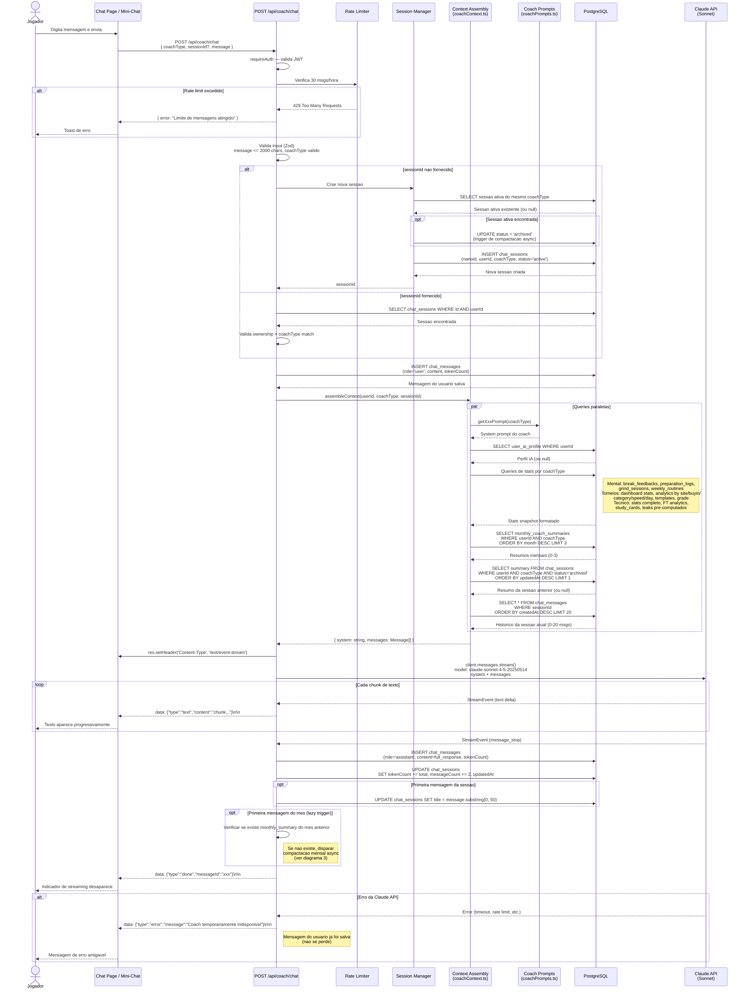
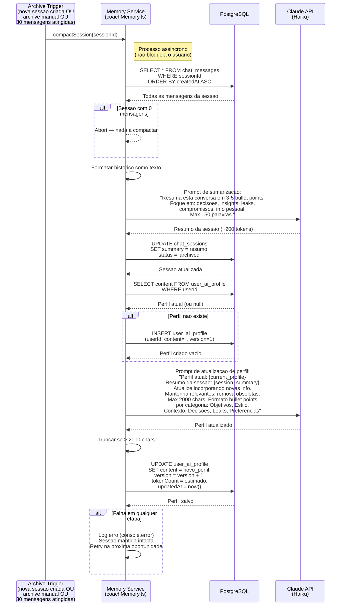
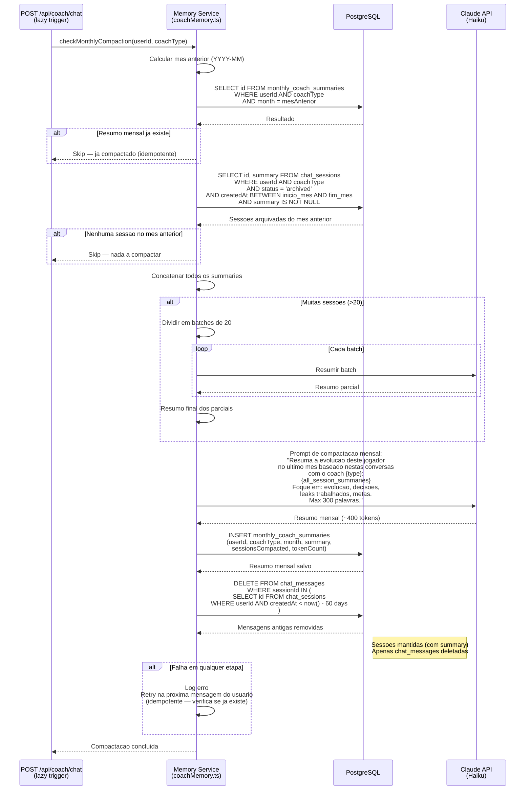

# AI Coach — Sequence Diagrams

Diagramas de sequencia dos 3 fluxos principais do sistema de AI Coach.

---

## 1. Envio de Mensagem (Chat Streaming)

Fluxo completo: usuario envia mensagem, backend monta contexto, chama Claude API via streaming, retorna resposta via SSE, salva no banco.

---

## 2. Compactacao de Sessao (Archive Trigger)

Fluxo executado em background quando uma sessao e arquivada. Gera resumo da sessao e atualiza o perfil IA do jogador.

---

## 3. Compactacao Mensal (Lazy Trigger)

Executado na primeira mensagem do mes. Agrega resumos de todas as sessoes do mes anterior em um unico resumo mensal, e limpa mensagens antigas.

---

## Notas

- **Modelos Claude usados:**
  - Chat (streaming): `claude-sonnet-4-5-20250514` — custo-beneficio para respostas interativas
  - Compactacao (background): `claude-haiku-4-5-20251001` — mais barato, suficiente para sumarizacao
- **Todos os processos de compactacao sao async** — nao bloqueiam a UX do usuario
- **Idempotencia:** Compactacao mensal verifica se ja existe antes de executar
- **Resiliencia:** Falhas nao perdem dados — sessoes e mensagens originais sao mantidas ate compactacao bem-sucedida
- **Limpeza:** Mensagens com mais de 60 dias sao deletadas apenas apos compactacao mensal bem-sucedida
