# C4 Component — Bankroll v2

**Sprint:** Bankroll-2 (Multi-Wallet Foundation)
**ADRs:** ADR-033, ADR-034, ADR-035
**Data:** 2026-04-25

Diagrama C4 nivel **Component** focando no boundary do modulo Bankroll v2 server-side. Mostra como `walletService`, `bankrollService` (legado), `currencyNormalizer` (refatorado pos-QW-1), caches e rotas se relacionam, e quem consome o modulo (Tournament Selector, Coach AI, BankrollWidget).

---

## Diagrama Component (Mermaid)

```mermaid
graph TB
    subgraph external["Consumidores externos"]
        TS["Tournament Selector<br/>server/scoring/tournamentScorer.ts<br/>(filter por bankroll consolidado)"]
        Coach["Coach AI<br/>server/coachTools/bankrollTools.ts<br/>(tool get_bankroll_status)"]
        BWidget["BankrollWidget<br/>(frontend Sprint 2 v1)<br/>renderiza /api/bankroll"]
        WalletUI["Wallet UI v2<br/>(frontend Sprint Bankroll-2)<br/>/bankroll page redesenhada"]
    end

    subgraph routes["HTTP Routes (server/routes/)"]
        RtBR["bankroll.ts (legado)<br/>GET /api/bankroll<br/>POST /api/bankroll/snapshot<br/>PUT /api/bankroll<br/>GET /api/bankroll/history<br/>GET /api/bankroll/consolidated (NOVO)"]
        RtWlt["wallets.ts (NOVO)<br/>GET POST /api/wallets<br/>GET PUT PATCH /api/wallets/:id<br/>DELETE /api/wallets/:id (405)<br/>GET POST /api/wallets/:id/transactions"]
    end

    subgraph mw["Middleware"]
        Auth["requireAuth<br/>(JWT)"]
        RL["express-rate-limit<br/>(10/min mutacoes)"]
    end

    subgraph services["Service Layer (server/services/)"]
        WSvc["walletService.ts (NOVO)<br/>createWallet, getWallet, listWallets,<br/>updateWallet, archiveWallet,<br/>recordWalletTransaction,<br/>listWalletTransactions,<br/>getConsolidatedBalance,<br/>migrateUserV1toV2"]
        BSvc["bankrollService.ts (refatorado)<br/>getBankrollState (wrapper sobre<br/>walletService.getConsolidatedBalance),<br/>updateBankroll (legado mantido),<br/>recordSnapshot (compat v1)"]
        CN["currencyNormalizer.ts (refatorado)<br/>normalizeBuyInToUSD<br/>(usd = native / rate, ADR-033)<br/>+ DEFAULT_EXCHANGE_RATES invertidos"]
    end

    subgraph cache["Caches (em memoria)"]
        WCache["walletCache<br/>TTL 30s por (userId)"]
        BCache["bankrollCache<br/>TTL 30s por (userId)<br/>+ history TTL 5min"]
        SCache["selectorCache<br/>TTL 30min<br/>(invalida em mutacao de wallet)"]
    end

    subgraph storage["Storage Layer (server/storage/)"]
        WStorage["wallets.ts<br/>insert, update,<br/>SELECT FOR UPDATE,<br/>queries paginadas"]
        WTxStorage["walletTransactions.ts<br/>insert (transacao),<br/>list paginado,<br/>summary por reason"]
        BSnapStorage["bankrollSnapshots.ts<br/>compat v1 + walletId"]
        UStorage["userSettings.ts<br/>+ bankrollV2Migrated,<br/>aggregationMode,<br/>displayCurrency"]
    end

    subgraph db["PostgreSQL 16"]
        TWallets[("wallets")]
        TWtx[("wallet_transactions")]
        TWpd[("wallet_pending<br/>(reservada)")]
        TBSnap[("bankroll_snapshots<br/>+ 4 colunas v2")]
        TUSet[("user_settings<br/>+ 3 colunas v2")]
        TGS[("grind_sessions")]
    end

    subgraph scripts["Scripts (server/scripts/)"]
        ScrMig["migrate-v2-multi-wallet.ts<br/>(idempotente, transacao por user,<br/>BANKROLL_V2_DRY_RUN)"]
        ScrFX["migrate-qw1-fx-convention.ts<br/>(QW-1, ADR-033)"]
        ScrRb["rollback-v2-multi-wallet.ts"]
    end

    subgraph tel["Telemetria"]
        Activity["user_activity<br/>(events: bankroll_wallet_created,<br/>bankroll_transaction_recorded,<br/>bankroll_v1_to_v2_migrated, ...)"]
    end

    %% Consumers -> Routes
    TS -->|"REST"| RtBR
    Coach -->|"REST via tool"| RtBR
    BWidget -->|"REST"| RtBR
    WalletUI -->|"REST"| RtWlt

    %% Routes -> Middleware
    RtBR --> Auth
    RtWlt --> Auth
    RtBR --> RL
    RtWlt --> RL

    %% Routes -> Services
    RtBR -->|"GET wrapper"| BSvc
    RtBR -->|"GET /consolidated"| WSvc
    RtWlt --> WSvc

    %% Services <-> Services
    BSvc -->|"getConsolidatedBalance"| WSvc
    WSvc -->|"FX corrente"| CN
    BSvc -->|"display BRL"| CN

    %% Services -> Cache
    WSvc -->|"read/write"| WCache
    BSvc -->|"read/write"| BCache
    WSvc -.->|"invalidateAllForUser"| SCache
    WSvc -.->|"invalidateAllForUser"| BCache
    BSvc -.->|"invalidateAllForUser"| SCache

    %% Services -> Storage
    WSvc --> WStorage
    WSvc --> WTxStorage
    WSvc --> BSnapStorage
    BSvc --> BSnapStorage
    WSvc --> UStorage
    BSvc --> UStorage

    %% Storage -> DB
    WStorage -->|"SQL"| TWallets
    WTxStorage -->|"SQL transacao"| TWtx
    WTxStorage -.->|"FK"| TWallets
    WTxStorage -.->|"FK opcional"| TGS
    BSnapStorage -->|"SQL"| TBSnap
    BSnapStorage -.->|"FK opcional walletId"| TWallets
    UStorage -->|"SQL"| TUSet

    %% Scripts -> Services / DB
    ScrMig -->|"migrateUserV1toV2"| WSvc
    ScrFX -->|"UPDATE jsonb"| TUSet
    ScrRb -->|"DROP wallets, UNSET walletId"| TWallets
    ScrRb -->|"compat"| TBSnap

    %% Telemetria
    WSvc -.->|"emit events"| Activity
    BSvc -.->|"emit events"| Activity
```

---

## Componentes em Detalhe

### Routes (server/routes/)

#### `bankroll.ts` (legado, expandido)
- `GET /api/bankroll` — wrapper sobre `walletService.getConsolidatedBalance`. Retorna shape v1 + `aggregationMode` e `walletCount`.
- `PUT /api/bankroll` — atualiza amount/rule (compat v1; em v2 atualiza default wallet single-wallet em modo global).
- `POST /api/bankroll/snapshot` — registra movimento manual (compat v1; cria wallet_tx na default wallet).
- `GET /api/bankroll/history` — historico de snapshots (snapshots v1 + espelhos v2).
- `GET /api/bankroll/consolidated` (NOVO) — moderno, expoe `byWallet[]`, `shotPockets[]`, totals em USD/displayCurrency.

#### `wallets.ts` (NOVO)
- `GET /api/wallets` — lista wallets do usuario + consolidated summary.
- `POST /api/wallets` — cria wallet (com `initialDeposit` opcional gerando wallet_tx).
- `GET /api/wallets/:id` — detalhe + `recentTransactions[5]`.
- `PUT /api/wallets/:id` — atualiza name, color, displayOrder, bankrollRule, isShotPocket.
- `PATCH /api/wallets/:id/archive` — seta `status='archived'`.
- `DELETE /api/wallets/:id` — sempre 405.
- `GET /api/wallets/:id/transactions` — lista paginada + summary.
- `POST /api/wallets/:id/transactions` — registra movimento (P0: deposit/withdrawal/session_result/manual_adjustment).

### Services (server/services/)

#### `walletService.ts` (NOVO)
Camada de orquestracao. Responsavel por:
- CRUD de wallets com validacoes (limite 50, nome unique, enums platform/currency).
- `recordWalletTransaction` em transacao com SELECT FOR UPDATE (atomicidade ADR-017).
- `getConsolidatedBalance` agregando `wallet.balance / FX(ccy)` para active && !isShotPocket.
- `migrateUserV1toV2` idempotente (ADR-035).
- Invalidacao de caches em qualquer mutacao.
- Emissao de eventos de telemetria.

#### `bankrollService.ts` (refatorado)
Mantido para compat v1. Em v2:
- `getBankrollState(userId)` -> wrapper sobre `walletService.getConsolidatedBalance` mapeando para shape v1.
- `updateBankroll(userId, input)` -> em modo global single-wallet, delega para `walletService.recordWalletTransaction` na default wallet.
- `recordSnapshot(userId, input)` -> idem.
- `buildStateFromSettings` -> ajustado por ADR-033 (formula `display.BRL = usdAmount * rate` ja correta).

#### `currencyNormalizer.ts` (refatorado QW-1)
- `normalizeBuyInToUSD(amount, ccy, rates)` agora `usd = native / rate` (ADR-033).
- `DEFAULT_EXCHANGE_RATES` invertidos: `BRL: 5.0`, `EUR: 0.92`, `BTC: 0.000015`.
- Comentario unico no header explicita convencao.

### Caches (em memoria)

| Cache | TTL | Invalidacao |
|---|---|---|
| `walletCache` | 30s por userId | mutacao em `wallets` ou `wallet_transactions` daquele user |
| `bankrollCache` | 30s estado, 5min history | mutacao de bankroll v1 OU mutacao de wallet em modo global single-wallet |
| `selectorCache` | 30min | qualquer mutacao de bankroll/wallet (cache do Tournament Selector) |

### Storage (server/storage/)

#### `wallets.ts` (NOVO)
- `insertWallet`, `updateWallet`, `archiveWallet`.
- `selectWalletForUpdate` (em transacao).
- `listWalletsByUser` paginado.
- `countActiveWalletsByUser` (para limite 50).

#### `walletTransactions.ts` (NOVO)
- `insertWalletTransaction` (parte de transacao maior em service).
- `listByWallet` paginado com filtros (from/to/reason).
- `summaryByReason` para `/transactions` summary.
- `getLastTransactionByWallet` para invariante.

#### `bankrollSnapshots.ts` (refatorado)
- Mantem queries v1.
- `insertSnapshotV2(walletId, nativeAmount, ...)` para espelho compat v1.
- `backfillWalletId(userId, walletId)` para migration.

#### `userSettings.ts` (refatorado)
- Adiciona campos: `bankrollV2Migrated`, `aggregationMode`, `displayCurrency`, `lastBankrollPageVisitV2`.

### Scripts (server/scripts/)

| Script | Acao | Idempotente | Dry-run |
|---|---|---|---|
| `migrate-qw1-fx-convention.ts` | Inverte rates fiat majors < 1 (QW-1, ADR-033) | Sim | Sim |
| `migrate-v2-multi-wallet.ts` | Cria default wallet + backfill `walletId` (ADR-035) | Sim | Sim |
| `rollback-qw1-fx.ts` | Restaura rates pre-QW-1 via logs | Sim | — |
| `rollback-v2-multi-wallet.ts` | Drop wallets criadas + UNSET walletId em snapshots | Sim | — |

### Telemetria

`user_activity` recebe eventos:
- `bankroll_wallet_created` `{walletId, platform, nativeCurrency}`
- `bankroll_wallet_archived` `{walletId, platform, balanceAtArchive}`
- `bankroll_wallet_edited` `{walletId, fieldsChanged}`
- `bankroll_transaction_recorded` `{walletId, reason, direction, nativeAmount, source}`
- `bankroll_consolidation_viewed` `{walletCount, totalUSD}` (1x/sessao)
- `bankroll_v1_to_v2_migrated` `{userId, walletId, originalAmountUSD}` (1x)

---

## Boundaries

| Boundary | Pertence ao Bankroll v2 | Justificativa |
|---|---|---|
| `walletService` | SIM | Core do modulo. |
| `bankrollService` | SIM (refatorado) | Compat v1; mantem funcionamento de Coach/Selector/Widget. |
| `currencyNormalizer` | SIM (refatorado QW-1) | Convencao FX consistente em todo lugar. |
| Tournament Selector (`tournamentScorer.ts`) | NAO | Consumidor externo; usa `getConsolidatedBalance` via `GET /api/bankroll`. |
| Coach AI tools | NAO | Consumidor externo; tool especifica le `GET /api/bankroll`. |
| BankrollWidget | NAO | UI consumidor externo. |
| Wallet UI v2 | NAO | UI nova; consumidor de `/api/wallets/*`. |

---

## Dependencias Externas

- **PostgreSQL 16** (Neon Serverless em prod).
- **Drizzle ORM 0.39** + `drizzle-zod` para validacao.
- **JWT auth** via `requireAuth` middleware.
- **express-rate-limit 7.5** para 10/min em mutacoes.
- **nanoid** para IDs.

---

## Decisoes Arquiteturais Aplicadas

| ADR | Onde aplica |
|---|---|
| ADR-017 | Invariante `[N+1].previousNativeBalance == [N].newNativeBalance` em `wallet_transactions`. |
| ADR-018 | Tolerancia 1.5x (softLimit -> hardLimit) preservada em modo global. |
| ADR-033 | `usd = native / rate` em `currencyNormalizer`; `fxRateUSDPerNative` em wallet_transactions segue mesma convencao. |
| ADR-034 | Modelo de 3 tabelas + FX historico imutavel + modos global/per_wallet/shot_pocket. |
| ADR-035 | `GET /api/bankroll` legado vira wrapper; migration cria default wallet sem wallet_tx duplicada. |

---

## Referencias

- ADRs: `Docs/architecture/decisions/{033,034,035}-*.md`.
- Spec: `Docs/specs/bankroll-v2-multi-wallet-foundation.md`.
- Spec QW-1: `Docs/specs/bankroll-v2-qw1-fix-exchange-rates.md`.
- Data model: `Docs/architecture/data-model/bankroll-v2.md`.
- Class diagram: `Docs/architecture/data-model/bankroll-v2-classes.md`.
- Fluxos: `Docs/architecture/flows/bankroll-multi-wallet.md`.
- API docs: `Docs/api/wallets.md`, `Docs/api/bankroll.md`.
