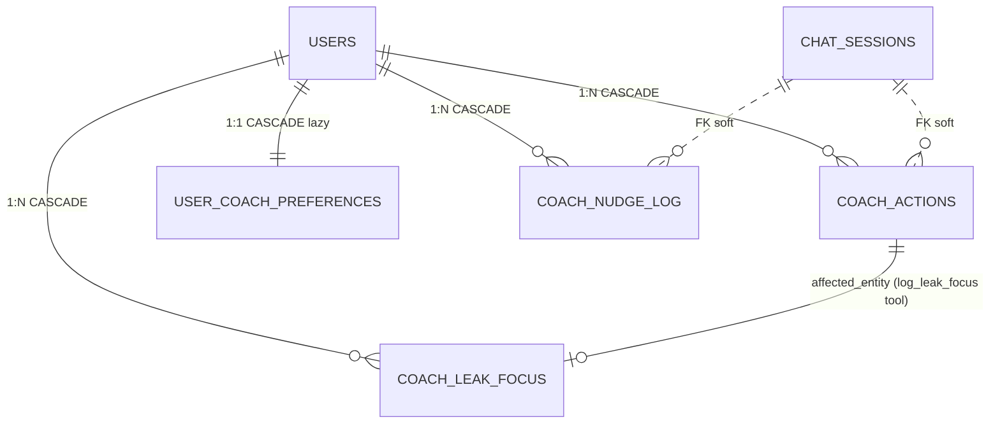

# Data Model — Indice de Tabelas

Schema completo em `shared/schema.ts` (~1300 linhas). Todas as tabelas usam `varchar` PK gerado via `nanoid`. FK na maioria via `userPlatformId` (formato `USER-XXXX`).

Para diagramas Mermaid: `Docs/architecture/data-model.mermaid`, `data-model-studies.mermaid`.

---

## Core (autenticacao, torneios, sessoes)

| Tabela | Descricao | Campos-chave |
|--------|-----------|--------------|
| `users` | Usuarios do sistema | id, userPlatformId (USER-XXXX), email, password, role, status, subscriptionPlan, emailVerified |
| `auth_tokens` | Tokens de verificacao/reset (substituiu Map em memoria) | userId, token, type, expiresAt |
| `sessions` | Sessoes Express (connect-pg-simple) | sid, sess (jsonb), expire |
| `tournaments` | Torneios importados do historico | userId, name, buyIn, prize, position, site, format, category, speed, fieldSize, datePlayed, **seriesId (NEW Flight-1, FK ON DELETE SET NULL)**, **baggedAt (NEW Flight-1, substitui flight_advanced legado)** |
| `tournament_templates` | Templates agrupados da biblioteca | userId, name, site, format, category, avgBuyIn, avgRoi, totalPlayed |
| `planned_tournaments` | Torneios planejados na grade | userId, dayOfWeek, profile (A/B/C), site, time, buyIn, type, speed, status, **seriesId (NEW Flight-1, FK ON DELETE SET NULL)** |
| `tournament_series` | **NEW Sprint Flight-1 (ADR-090).** Single source of truth para torneios multi-flight (Phased/Stage/Day 1 X). Substitui flags legados ADR-031 (`is_flight/flight_day/flight_parent_id/flight_advanced`) que serao removidos via migration 0030 MANUAL apos 7 dias de validacao. Campos: id (nanoid), userId, name (nome-base ex 'Sunday Million Phased'), network, totalDay1s, day2DateTime (UTC), day2Status enum (`pending`/`completed`/`cancelled`), stackMode enum (`single`/`combined` — best fora MVP, ADR-091), notes. Indices: `idx_series_user_status`, `idx_series_user_datetime`, `idx_series_user_name`. CASCADE em userId. SET NULL em tournaments.series_id e planned_tournaments.series_id. Auto-add Day 2 idempotente via (series_id, day_of_week). |
| `weekly_plans` | Planos semanais | userId, weekStart, targetBuyins, targetProfit, targetVolume |
| `grind_sessions` | Sessoes de grind | userId, date, status (planned/active/completed), profitLoss, duration, metricas mentais |
| `session_tournaments` | Torneios de uma sessao em tempo real | sessionId, site, buyIn, result, position, bounty, prize, status |
| `break_feedbacks` | Feedback durante breaks | sessionId, foco, energia, confianca, inteligenciaEmocional, interferencias |
| `preparation_logs` | Logs de preparacao mental (3 campos pos-sessao orfaos depreciados em Cooldown-3) | sessionId, mentalState, focusLevel, confidenceLevel, exercisesCompleted |
| `cooldown_logs` | Cool-down pos-sessao (1:1 com grind_sessions) — Sprint Cooldown-1 | userId, sessionId (UNIQUE), startedAt, completedAt, mode (full/quick), blocksCompleted (jsonb), abGameAnswers (jsonb), tiltSelfAssessment (jsonb, Sprint 2), sleepIntent (Sprint 2). Indices: `uq_cooldown_user_session`, `idx_cooldown_user_completed`. CASCADE em userId e sessionId. |
| `starred_hands` | Maos criticas estreladas durante cool-down — Sprint Cooldown-1 | userId, sessionId, sessionTournamentId, cooldownLogId (nullable, ON DELETE SET NULL), type (8 valores: tilt/leak/soulread/hero-call/cooler/mistake/sick/other), spot (8 valores: preflop/flop/turn/river/icm/final-table/bubble/other), notes (max 500). Indices: `idx_starred_user_session`, `idx_starred_user_type`. CASCADE em userId, sessionId, sessionTournamentId. |

## Bankroll (multi-wallet)

| Tabela | Descricao |
|--------|-----------|
| `wallets` | Carteiras multi-moeda (USD/BRL/EUR/CNY/USDT) com optimistic concurrency |
| `wallet_transactions` | Transacoes (deposit/withdrawal/session_result/manual_adjustment/rakeback/transfer_in/transfer_out/transfer_fee) |
| `wallet_transfers` | **NEW Bankroll-3 (RF-4 / ADR-059)**. Tabela mestra de transferencias cross-wallet. 1 row por transfer + 2-3 espelhos em `wallet_transactions` agrupados via `transfer_group_id`. FK `from_wallet_id`/`to_wallet_id`/`fee_wallet_id` ON DELETE RESTRICT (D1). CHECK `from != to` + amounts > 0. fxRate obrigatorio cross-currency (D4); diff > 5% vs market exige `?confirmFxDiff=true` (D11). |
| `wallet_pending` | **Reativada Bankroll-3 (RF-5 / D8)**. Pending types: `deposit_pending` / `withdrawal_pending`. Cap **10 pending por wallet** (count WHERE status='pending'). Coluna `external_reference` nova (RF-5). NAO afeta `wallets.balance` ate settle. |
| `bankroll_snapshots` | Snapshots multi-wallet com FX freezes. **Colunas novas Bankroll-3 (RF-2 + RF-8 / ADR-058)**: `origin` varchar(32) NOT NULL DEFAULT 'manual' (valores: `manual` / `auto-cooldown` / `transfer` / `import` / `migration_v1`); `source_ref_id` varchar(64) nullable (cooldown_log.id para auto-cooldown). Index `idx_bankroll_snapshots_origin` + unique parcial `uq_bankroll_snapshots_cooldown` (user_id, source_ref_id) WHERE origin='auto-cooldown' garante idempotencia. |

Detalhes: `Docs/architecture/bankroll-index.md`.

### Schema Delta — Sprint Bankroll-3

Migrations afetadas:
- `migrations/0017_wallet_transfers.sql` — tabela `wallet_transfers` + ALTER `wallet_pending` (external_reference + idx_active).
- `migrations/0018_auto_snapshot_meta.sql` — ALTER `bankroll_snapshots` (origin + source_ref_id + index + unique parcial) + ALTER `user_settings` (stops).

ADRs relevantes: 058 (auto-snapshot), 059 (wallet_transfers), 060 (stop-loss lock), 061 (fxResolver).

### Schema Delta — Sprint Flight-1 (Tournament Series + deprecacao flags ADR-031)

Migrations afetadas:
- `migrations/0029_add_tournament_series.sql` (AUTOMATICA) — cria tabela `tournament_series` + 2 ENUMs Postgres (`series_stack_mode`, `series_day2_status`) + ADD COLUMN `series_id` (FK SET NULL) em `tournaments` e `planned_tournaments` + ADD COLUMN `bagged_at TIMESTAMP NULL` em `tournaments` + back-fill de dados historicos via `flight_parent_id` ou `(name, site)`.
- `migrations/0030_drop_legacy_flight_flags.sql` (**MANUAL pos sign-off** apos 7 dias de validacao) — DROP COLUMN `is_flight`, `flight_day`, `flight_parent_id`, `flight_advanced` em `tournaments` e `planned_tournaments` + DROP indices parciais ADR-031 (`idx_tournaments_user_flight_parent`, `idx_tournaments_user_is_flight`).

ADRs relevantes: **ADR-090** (Tournament Series single source of truth — deprecar flags inline ADR-031), **ADR-091** (Stack mode enum: `single` | `combined`; best-stack fora MVP).

Diagramas Mermaid: `Docs/architecture/features/flight/`:
- `01-upload-detect-flight.mermaid` — parser detecta keywords + insere normalmente + auto-link Day1+Day2 (RF-05/06/08).
- `02-confirm-flight-modal.mermaid` — modal pos-upload descartavel + batch confirmation (RF-07/09).
- `03-mark-bagged-auto-add-day2.mermaid` — endpoint mark-bagged + auto-add planned Day 2 idempotente (RF-04/11).
- `04-backfill-manual.mermaid` — back-fill retroativo via UI (RF-13).
- `05-migration-deprecation.mermaid` — migration em 2 fases (auto + manual) com janela de validacao (RF-17).

## Coach AI

| Tabela | Descricao |
|--------|-----------|
| `coach_conversations` | Conversas do coach AI |
| `coach_messages` | Mensagens (role, content, tokens, model, latencyMs) |
| `coach_usage` | Tracking de tokens (input/output/cache_*) por conversation |
| `coach_feedback` | Thumbs up/down + comentarios |
| `coach_actions` | **NOVA Coach-2B (RF-01 / ADR-077 / ADR-083)**. Audit + state machine para tool calls (read + write). Status: `pending` → `executing` → `completed | failed | undone | expired`. Write tools (`requires_confirmation=true`) usam `payload_before` + `payload_after` + `undo_expires_at` (`confirmed_at + 5min`) para reversao. Read tools com `auditLevel='persist'` gravam apenas `result` wrapped (ADR-024). Indices: `idx_coach_actions_user_status`, `idx_coach_actions_session`, `idx_coach_actions_tool`, `idx_coach_actions_undo_window` (parcial WHERE status='completed'), `idx_coach_actions_pending_cleanup` (parcial WHERE status='pending'). FK CASCADE em userId; FK soft em chat_session_id + message_id. |
| `user_coach_preferences` | **NOVA Coach Sprint 0 (RF-01 / ADR-084)**. 1 row por usuario, lazy-create (defaults retornados se row ausente). 8 toggles por categoria de nudge (B-SNAPSHOT/B-LEAK/B-STUDY/B-VOLUME/B-GRADE/B-DOWNSWING ON; B-LIFE/B-MENTAL OFF). Quiet hours timezone-aware via `users.timezone`: `quiet_hours_start` + `quiet_hours_end` (0..23, wrap-around aceito). Frequency cap: `max_nudges_per_day=3`, `max_nudges_per_hour=1`. Channels: `channel_in_app`+`channel_email` ON, `channel_push` OFF. Tom: `coach_tone='balanced'` (gentle/balanced/direct, Coach-4 ativa LLM). UNIQUE em user_id. CASCADE em user. Cache memoria 30s (`prefsCache`) reusa logica de `resolveUserTier`. |
| `coach_nudge_log` | **NOVA Coach Sprint 0 (RF-03 / ADR-085)**. Audit + frequency cap + idempotencia per-cycle. Cada nudge enviado gera 1 row. `category` varchar(32) (B-SNAPSHOT/B-LEAK/B-STUDY/B-VOLUME/B-GRADE/B-DOWNSWING/B-LIFE/B-MENTAL). `cycle_key` varchar(16) nullable ('YYYY-MM' mensal | 'YYYY-WW' semanal | NULL). `status` varchar(16): sent/engaged/dismissed/snoozed/unsubscribed (snoozed NAO consume cap). `triggered_by_event` (cron_28th/csv_upload/session_complete/etc). Engine `shouldSendNudge` (ADR-085) consulta para frequency cap + idempotencia (`already_sent_this_cycle`). Indices: `idx_coach_nudge_log_user_sent`, `idx_coach_nudge_log_user_category_cycle`, `idx_coach_nudge_log_category_status_sent`. FK CASCADE em user; FK soft em chat_session_id (nudge cria sessao). |
| `coach_leak_focus` | **NOVA Coach-2B (RF-05 / ADR-077)**. Foco de leak escolhido pelo user (1 ou mais por mes). `leak_code` varchar(64) (ex 'low_itm_turbos'); `description` text max 200 pt-BR; `target_month` varchar(7) ('YYYY-MM'); `baseline_stat_key` + `baseline_value` + `baseline_sample_size` capturados no momento do log. `status`: active/resolved/abandoned. UNIQUE em (user_id, leak_code, target_month). FK CASCADE em user. Tool `verify_leak_progress` (RF-05) consulta para comparativo current vs baseline. |

Detalhes: `Docs/api/coach.md`, `Docs/api/coach-tools.md`.

**ADRs relevantes Coach Sprint 0 + Coach-2B (2026-05-02):**
- **ADR-077** (`coach-actions-migration-and-audit-log`) — schema final write-tool aware; migration unica `0024_coach_2b_actions_leak_focus.sql`; verifica que tabela documentada nos ADRs 023/024 NUNCA foi migrada (zero matches em codigo de producao).
- **ADR-083** (`coach-confirmation-undo-pattern`) — confirmation + undo 5min via state machine + `payload_before` snapshot dentro da tx (lesson #194); reverse-row em wallet (NAO hard-delete, ADR-058 ledger imutavel).
- **ADR-084** (`user-coach-preferences`) — tabela dedicada com lazy-create + cache 30s + Zod optional/default; defaults seguros (B-LIFE/B-MENTAL opt-in).
- **ADR-085** (`coach-nudge-engine`) — `shouldSendNudge` 5 checks sequenciais + safe-deny on error; cycleKey resolve idempotencia.
- **ADR-086** (`coach-citations-and-confidence-inline-rules`) — CITATIONS_RULES + CONFIDENCE_RULES em arquivo unico `coachSafetyPrompts.ts` (lesson #10 DRY); cache invalidation 1x apos deploy.
- **ADR-087** (`job-runner-timezone-aware`) — node-cron in-process para Sprint 2B; `iterateUsersWithTimezone` filtra por hora local; migration path para pg-boss em Coach-3.

> Nota numeracao: ADR-078 (design tokens UI-FND-1) foi reservado por sessao paralela em 2026-05-02. Os 6 ADRs Coach Sprint 0 + Coach-2B foram renumerados para 077 + 083-087 evitando colisao.

**Diagramas Mermaid:** ver `Docs/architecture/diagrams/coach-2b/`:
- `er-coach-2b.mermaid` — ER das 4 tabelas novas + relacionamentos com tabelas existentes.
- `seq-write-tool-confirm-undo.mermaid` — Sequencia confirmation + undo 5min + race condition + cleanup.
- `flow-nudge-engine.mermaid` — Flowchart shouldSendNudge (5 checks + safe-deny).
- `seq-nudge-b-snapshot.mermaid` — B-SNAPSHOT cron mensal dia 28 9h timezone-aware.
- `seq-nudge-b-leak.mermaid` — B-LEAK setImmediate pos-upload com gap-check + cycleKey semanal.
- `flow-citation-enrichment.mermaid` — System prompt rules + tool result wrapping + frontend parser.

**Migration prevista:** `migrations/0024_coach_2b_actions_leak_focus.sql` (cria 4 tabelas + indices em uma migration unica).

### Schema Delta — Sprint Coach Sprint 0 + Coach-2B



```sql
-- migrations/0024_coach_2b_actions_leak_focus.sql (preview)

CREATE TABLE coach_actions (
    id VARCHAR(21) PRIMARY KEY,
    user_id VARCHAR(21) NOT NULL REFERENCES users(user_platform_id) ON DELETE CASCADE,
    chat_session_id VARCHAR(21),
    message_id VARCHAR(21),
    tool_use_id VARCHAR(64),
    tool_name VARCHAR(64) NOT NULL,
    status VARCHAR(16) NOT NULL,
    input JSONB,
    result JSONB,
    error_message TEXT,
    payload_before JSONB,
    payload_after JSONB,
    affected_entity_type VARCHAR(32),
    affected_entity_id VARCHAR(21),
    requires_confirmation BOOLEAN NOT NULL DEFAULT FALSE,
    confirmed_at TIMESTAMP,
    undo_expires_at TIMESTAMP,
    undone_at TIMESTAMP,
    latency_ms INTEGER,
    executed_at TIMESTAMP,
    created_at TIMESTAMP NOT NULL DEFAULT NOW()
);
CREATE INDEX idx_coach_actions_user_status ON coach_actions(user_id, status, created_at);
CREATE INDEX idx_coach_actions_session ON coach_actions(chat_session_id);
CREATE INDEX idx_coach_actions_tool ON coach_actions(tool_name, status, created_at);
CREATE INDEX idx_coach_actions_undo_window ON coach_actions(user_id, undo_expires_at)
    WHERE status = 'completed' AND undo_expires_at IS NOT NULL;
CREATE INDEX idx_coach_actions_pending_cleanup ON coach_actions(status, created_at)
    WHERE status = 'pending';

CREATE TABLE user_coach_preferences (
    id VARCHAR(21) PRIMARY KEY,
    user_id VARCHAR(21) NOT NULL UNIQUE REFERENCES users(user_platform_id) ON DELETE CASCADE,
    nudge_b_snapshot BOOLEAN NOT NULL DEFAULT TRUE,
    nudge_b_leak BOOLEAN NOT NULL DEFAULT TRUE,
    nudge_b_study BOOLEAN NOT NULL DEFAULT TRUE,
    nudge_b_volume BOOLEAN NOT NULL DEFAULT TRUE,
    nudge_b_grade BOOLEAN NOT NULL DEFAULT TRUE,
    nudge_b_downswing BOOLEAN NOT NULL DEFAULT TRUE,
    nudge_b_life BOOLEAN NOT NULL DEFAULT FALSE,
    nudge_b_mental BOOLEAN NOT NULL DEFAULT FALSE,
    quiet_hours_start INTEGER NOT NULL DEFAULT 21,
    quiet_hours_end INTEGER NOT NULL DEFAULT 9,
    max_nudges_per_day INTEGER NOT NULL DEFAULT 3,
    max_nudges_per_hour INTEGER NOT NULL DEFAULT 1,
    channel_in_app BOOLEAN NOT NULL DEFAULT TRUE,
    channel_email BOOLEAN NOT NULL DEFAULT TRUE,
    channel_push BOOLEAN NOT NULL DEFAULT FALSE,
    coach_tone VARCHAR(20) NOT NULL DEFAULT 'balanced',
    created_at TIMESTAMP NOT NULL DEFAULT NOW(),
    updated_at TIMESTAMP NOT NULL DEFAULT NOW()
);

CREATE TABLE coach_nudge_log (
    id VARCHAR(21) PRIMARY KEY,
    user_id VARCHAR(21) NOT NULL REFERENCES users(user_platform_id) ON DELETE CASCADE,
    category VARCHAR(32) NOT NULL,
    cycle_key VARCHAR(16),
    status VARCHAR(16) NOT NULL,
    title_i18n VARCHAR(200),
    body_preview TEXT,
    channel VARCHAR(16) DEFAULT 'in_app',
    chat_session_id VARCHAR(21),
    triggered_by_event VARCHAR(64),
    sent_at TIMESTAMP DEFAULT NOW(),
    engaged_at TIMESTAMP,
    dismissed_at TIMESTAMP,
    snooze_until TIMESTAMP,
    created_at TIMESTAMP DEFAULT NOW()
);
CREATE INDEX idx_coach_nudge_log_user_sent ON coach_nudge_log(user_id, sent_at);
CREATE INDEX idx_coach_nudge_log_user_category_cycle ON coach_nudge_log(user_id, category, cycle_key);
CREATE INDEX idx_coach_nudge_log_category_status_sent ON coach_nudge_log(category, status, sent_at);

CREATE TABLE coach_leak_focus (
    id VARCHAR(21) PRIMARY KEY,
    user_id VARCHAR(21) NOT NULL REFERENCES users(user_platform_id) ON DELETE CASCADE,
    leak_code VARCHAR(64) NOT NULL,
    description TEXT NOT NULL,
    target_month VARCHAR(7) NOT NULL,
    baseline_stat_key VARCHAR(128) NOT NULL,
    baseline_value DECIMAL NOT NULL,
    baseline_sample_size INTEGER NOT NULL,
    study_plan_notes TEXT,
    status VARCHAR(16) DEFAULT 'active',
    resolved_at TIMESTAMP,
    created_at TIMESTAMP DEFAULT NOW(),
    updated_at TIMESTAMP DEFAULT NOW()
);
CREATE INDEX idx_coach_leak_focus_user_month ON coach_leak_focus(user_id, target_month);
CREATE UNIQUE INDEX uniq_coach_leak_focus_user_code_month
    ON coach_leak_focus(user_id, leak_code, target_month);
```

Drizzle (em `shared/schema.ts`): Zod `optional + default` em todas as colunas write-tool only de `coach_actions` (lesson #7 — deprecation gradual). Cache 30s em memoria para `getCoachPreferences` (analogo a `resolveUserTier`).

---

## Estudos

| Tabela | Descricao |
|--------|-----------|
| `study_cards` | Cards de estudo com topicos de poker (3bet, ICM, etc.) |
| `study_themes` | Temas (categorizacao). **Coluna nova Studies-Reform (RF-03 / ADR-067 / ADR-068)**: `attacks_leak_type` varchar(50) nullable — vincula tema a leak detectado em Stats Analyzer; alimenta filtro `?fromStats=leaks` (D11) e bonus de score em recomendacoes. |
| `study_tabs` | Abas dentro de tema (boards, ranges, hand_notes, tags). **Coluna opcional Studies-Reform (RF-02 / ADR-067)**: `last_visited_at` timestamp nullable — alimenta "Continue de onde parou" no Dashboard; fallback derivar de `study_sessions.tab_id` mais recente quando nao populada. |
| `study_materials` | Materiais (video, artigo, pdf) |
| `study_notes` | Notas de estudo |
| `study_sessions` | Sessoes de estudo com duracao e scores |
| `study_schedules` | Agendamentos de estudo |
| `study_theme_spot_links` | **NOVO Studies-Reform (RF-08 / ADR-068, opcional D10)**. Tabela N:N entre `study_themes` e `starred_hands`. 1 row por vinculo. Colunas: `id` (nanoid), `theme_id` (FK CASCADE), `spot_id` (FK CASCADE), `user_id` (FK CASCADE), `linked_at` timestamp default NOW. UNIQUE constraint em `(theme_id, spot_id)` para idempotencia. Indices: `idx_study_theme_spot_links_theme`, `idx_study_theme_spot_links_spot`, `idx_study_theme_spot_links_user`. Alimenta `storage.getLinkedSpots()` (compartilhado entre `studyRecommendationsService` RF-06 e Coach tool `read_theme_with_linked_spots` RF-07). Spec MVP: 1 spot pode ter multiplos themes (modelado N:N para futuro), mas UI atual sugere 1 tema por spot. |

## Calendario

| Tabela | Descricao |
|--------|-----------|
| `calendar_categories` | Categorias customizaveis de eventos |
| `calendar_events` | Eventos com recorrencia |
| `weekly_routines` | Rotinas semanais auto-geradas |
| `active_days` | Dias ativos na grade (por usuario) |
| `profile_states` | Perfil ativo por dia (A, B ou C) |

## Tickets de Satelite

| Tabela | Descricao |
|--------|-----------|
| `satellite_tickets` | Tickets ganhos em satelites |
| `ticket_uses` | Usos de tickets em torneios target |

## Admin / Sistema

| Tabela | Descricao |
|--------|-----------|
| `permissions` | Permissoes do sistema (admin_full, etc.) |
| `user_permissions` | Relacao usuario-permissao com expiracao |
| `subscriptions` | Assinaturas de usuarios |
| `subscription_plans` | Planos disponiveis |
| `user_subscriptions` | Assinaturas ativas |
| `notifications` | Notificacoes do sistema |
| `bug_reports` | Reports de bugs dos usuarios |
| `upload_history` | Historico de uploads CSV/XLSX |
| `access_logs` | Logs de acesso e tentativas negadas |
| `user_activity` | Tracking de atividade (consolidado em 2026-03-20, antes era `user_activities` + `user_activity`) |
| `analytics_daily` | Resumo diario de analytics |
| `engagement_metrics` | Metricas de engajamento |
| `user_settings` | Configuracoes do usuario (moeda, notificacoes, exchange rates, **`bankroll_management_enabled` boolean default true** — Sprint B2/M2). **Colunas novas Bankroll-3 (RF-6 / ADR-060)**: `stop_loss_usd` decimal nullable (limite perda diaria USD), `stop_win_usd` decimal nullable (meta ganho diaria USD), `stop_lock_until` timestamp nullable (lock ativo se > NOW), `stop_lock_duration_hours` integer NOT NULL DEFAULT 12 (range 1-72). Stop-win NAO bloqueia (D3, banner only). Stop-loss bloqueia 12h default. Reset 00:00 user TZ (`users.timezone`, fallback UTC). |
| `users` (delta) | **Colunas opcionais Studies-Reform (RF-08 / ADR-067 / ADR-068, D10)**: `study_streak_days` integer NOT NULL DEFAULT 0 — cache de streak diario; `last_study_activity_at` timestamp nullable — alimenta `bumpStudyStreak` para detectar dia consecutivo (D3). Indice parcial `idx_users_streak_active` em `study_streak_days WHERE study_streak_days > 0`. Se migration 0021 nao aplicada (D10 fallback), persistencia em `localStorage` (`grindfy:studies:streak`, shape `{ days: number, lastActivityAt: ISO8601 }`) — streak nao sobrevive multi-device nem limpeza de cache. |
| `custom_groups` | Grupos customizados de templates |
| `custom_group_templates` | Relacao grupo-template |
| `coaching_insights` | Insights de coaching |

## PrimeDope Simulation (Sprint F4)

| Tabela | Descricao |
|--------|-----------|
| `primedope_runs` | Cache + audit de simulacoes de variance MTT (Sprint F4, ADR-054). PK nanoid 21, FK `userId` ON DELETE CASCADE. Campos: `inputHash` sha256 deterministico pos-FX, `inputJson`/`resultJson` jsonb, `histogramPath`/`randomRunsPath` paths PNG re-hosted, `latencyMs`, `source` enum (primedope/cache/fallback-stale), `pinned` default false, `expiresAt` via trigger (NULL se pinned, +90d senao). Indices: `(user_id, profile_letter, day_of_week, created_at DESC)`, `(input_hash, created_at DESC)`, `(expires_at) WHERE pinned=false`. Migration `0027_primedope_runs.sql`. |

`tournaments` recebe **+3 colunas** via migration `0026_tournaments_simulation_fields.sql` (Sprint F4):
- `players_avg INTEGER` (CHECK 10..50000) — backfill cascata `tournament_templates.avg_field_size` > `field_size` > 1000.
- `places_paid_avg INTEGER` (CHECK 1..10000) — backfill `ROUND(players_avg * 0.15)`.
- `rake_pct DECIMAL(4,2)` (CHECK 0..30) — backfill heuristico per-`site` (GG=10, WPN=8, Stars=9, Suprema=10, etc.).

ADRs: 054 (provider externo PrimeDope vs engine nativo), 055 (`tracker.ts` stub vs `analytics_events`), 056 (onboarding dismiss localStorage vs `users.preferences`).

Diagramas Mermaid: `er-primedope.mermaid`, `c4-context-primedope.mermaid`, `sequence-primedope-simulation.mermaid`, `flow-primedope-wizard-prefill.mermaid`, `flow-day-detail-drawer.mermaid`.

## Convencoes

- IDs `varchar` via `nanoid()` — nunca auto-increment.
- `userPlatformId` formato `USER-XXXX` (sequencial, separado de `id` interno).
- Validacao Zod via `drizzle-zod` em `shared/schema.ts`.
- Snapshots para auditoria (bankroll); soft-delete raro (preferir hard-delete + tracking).
- ADRs relevantes: 014 (add-on/rea), 017 (snapshot vs derived), 028 (warmup_rituals dedicada), 031-032 (tournament types), 033 (FX rate), 038 (optimistic concurrency wallet), 039 (rakeback as wallet tx), 040 (session-end reconciliation), 041 (cooldown_logs + starred_hands dedicadas), 046 (session_wallet_snapshots), 047 (summary inline reconcile), 048 (wallets eligibility por plataformas jogadas), **058 (auto-snapshot pos-cooldown)**, **059 (cross-wallet transfer ledger)**, **060 (stop-loss/stop-win lock)**, **061 (fxResolver unificado)**, **067 (studies page IA — sub-paths)**, **068 (cross-feature recommendations engine)**.

---

## Schema Delta — Sprint Studies-Reform (Migration 0021, opcional D10)

ADR-067 (URL state pattern em studies) + ADR-068 (cross-feature recommendations engine) introduzem 1 tabela nova + 2 colunas em `users`. Migration **opcional** (D10): se test-writer red phase nao confirmar necessidade, fallback localStorage para streak; tabela `study_theme_spot_links` e pre-requisito de RF-05 e portanto **bloqueante** para o workflow spot↔tema funcionar end-to-end.

```sql
-- migrations/0021_studies_reform.sql

CREATE TABLE IF NOT EXISTS study_theme_spot_links (
    id VARCHAR(21) PRIMARY KEY,
    theme_id VARCHAR(21) NOT NULL REFERENCES study_themes(id) ON DELETE CASCADE,
    spot_id VARCHAR(21) NOT NULL REFERENCES starred_hands(id) ON DELETE CASCADE,
    user_id VARCHAR(21) NOT NULL REFERENCES users(id) ON DELETE CASCADE,
    linked_at TIMESTAMP NOT NULL DEFAULT NOW(),
    UNIQUE (theme_id, spot_id)
);
CREATE INDEX IF NOT EXISTS idx_study_theme_spot_links_theme ON study_theme_spot_links(theme_id);
CREATE INDEX IF NOT EXISTS idx_study_theme_spot_links_spot ON study_theme_spot_links(spot_id);
CREATE INDEX IF NOT EXISTS idx_study_theme_spot_links_user ON study_theme_spot_links(user_id);

ALTER TABLE users
    ADD COLUMN IF NOT EXISTS study_streak_days INTEGER NOT NULL DEFAULT 0,
    ADD COLUMN IF NOT EXISTS last_study_activity_at TIMESTAMP NULL;

CREATE INDEX IF NOT EXISTS idx_users_streak_active
    ON users(study_streak_days) WHERE study_streak_days > 0;
```

Diagrama ER atualizado em `Docs/architecture/data-model-studies.mermaid` (a atualizar quando migration aplicada). Colunas opcionais `study_themes.attacks_leak_type` e `study_tabs.last_visited_at` documentadas na tabela acima — adicao gradual seguindo lesson #7 (deprecation gradual: nullable + default).

Caminho com migration (preferido):
- `study_theme_spot_links` operacional, RF-05 + RF-06 + RF-07 funcionam end-to-end.
- Streak persiste em `users.study_streak_days` — sobrevive multi-device.
- `getLinkedSpots(themeId, userId)` query indexada.

Caminho fallback (sem migration, D10):
- `study_theme_spot_links` ausente → RF-05 erro 500 `migration_missing` no submit com `themeId`. Sem migration, RF-05 nao pode ser entregue.
- Streak em `localStorage` (`grindfy:studies:streak`) — perde em limpeza de cache, nao multi-device.
- `studyRecommendationsService` ainda funciona, mas sem source de "linked spots" para enriquecer dormant themes.

Decisao operacional: **migration 0021 e bloqueante para Sprint Studies-Reform fechar com RF-05 verde**. test-writer red phase de RF-05 produz tests que exigem a tabela; reviewer R3 rejeita merge sem migration aplicada em dev DB.

---

## Schema Delta — Sprint B2 (`bankroll_management_enabled`)

ADR-047 + ADR-048 adicionam coluna em `user_settings`:

```mermaid
erDiagram
    USERS ||--|| USER_SETTINGS : "1:1"
    USER_SETTINGS {
        varchar user_id PK_FK
        varchar default_currency "default 'USD'"
        boolean notifications_enabled "default true"
        jsonb exchange_rates "FX freezes (ADR-033)"
        boolean bankroll_management_enabled "NEW B2 — default true"
        timestamp created_at
        timestamp updated_at
    }
    USER_SETTINGS ||--o{ WALLETS : "guards-render"
    USER_SETTINGS ||--o{ SESSION_WALLET_SNAPSHOTS : "guards-write<br/>(skip se false)"
```

Migracao SQL (em `migrations/` quando implementer aplicar):

```sql
ALTER TABLE user_settings
  ADD COLUMN bankroll_management_enabled BOOLEAN NOT NULL DEFAULT TRUE;
```

Drizzle (em `shared/schema.ts`):

```ts
bankrollManagementEnabled: boolean('bankroll_management_enabled').notNull().default(true),
```

Zod schema (insert/update): `optional + default(true)` — lesson learned #7 (deprecation gradual).

**Comportamento por valor:**
- `true` (default): fluxo multi-wallet completo. Lista de wallets em `/settings`, secao "Bancas" no `SessionSummaryModal`, banner missing platforms (ADR-048), snapshot gravado.
- `false`: lista de wallets escondida em `/settings`, secao "Bancas" e banner missing NAO renderizados, snapshot NAO gravado server-side, telemetry `reconcile_skipped_setting_off`.

Banca legada (`bankroll_amount` + `bankroll_rule` em `user_settings`) **continua visivel** em ambos os modos.

---

## Schema Delta — Sprint F2 (`starred_hands` + spot screenshots)

ADR-051 + ADR-052 + ADR-053 (2026-04-27) estendem `starred_hands` para suportar prints
colados durante o grind live, com expiracao em 14 dias e cron diario de purge.
**Nenhuma tabela nova** — extensao de `starred_hands` com 8 colunas nullable + back-fill
de rows criadas pelo cooldown classico (Sprint Cooldown-1).

```mermaid
erDiagram
    GRIND_SESSIONS ||--o{ STARRED_HANDS : "1:N"
    SESSION_TOURNAMENTS ||--o{ STARRED_HANDS : "1:N"
    USERS ||--o{ STARRED_HANDS : "1:N (CASCADE)"
    COOLDOWN_LOGS ||--o{ STARRED_HANDS : "1:N (SET NULL)"

    STARRED_HANDS {
        varchar id PK
        varchar user_id FK
        varchar session_id FK
        varchar session_tournament_id FK
        varchar cooldown_log_id FK_NULL "ON DELETE SET NULL"
        varchar type "enum 9 valores (era 8 + 'spot_screenshot')"
        varchar spot "enum 9 valores (era 8 + 'screenshot_pending')"
        text notes "max 500"
        timestamp created_at
        text image_url "NEW F2 — relativo /uploads/spot-screenshots/&lt;file&gt;"
        text conclusion "NEW F2 — max 500"
        timestamp reviewed_at "NEW F2 — null = nao revisado"
        boolean review_later "NEW F2 — default false"
        timestamp expires_at "NEW F2 — pastedAt + 14d"
        timestamp pasted_at "NEW F2 — quando print foi colado"
        varchar source "NEW F2 — enum paste|upload|manual; default manual"
        varchar status "NEW F2 — enum pending|reviewed|discarded; default pending"
    }
```

Migration `migrations/0014_spot_screenshots.sql` (DDL preview):

```sql
ALTER TABLE starred_hands
  ADD COLUMN image_url     text,
  ADD COLUMN conclusion    text,
  ADD COLUMN reviewed_at   timestamp,
  ADD COLUMN review_later  boolean DEFAULT false NOT NULL,
  ADD COLUMN expires_at    timestamp,
  ADD COLUMN pasted_at     timestamp,
  ADD COLUMN source        varchar(20) DEFAULT 'manual' NOT NULL,
  ADD COLUMN status        varchar(20) DEFAULT 'pending' NOT NULL;

CREATE INDEX idx_starred_user_status    ON starred_hands (user_id, status);
CREATE INDEX idx_starred_expires        ON starred_hands (expires_at)
  WHERE status = 'pending';
CREATE INDEX idx_starred_session_source ON starred_hands (session_id, source);

-- Back-fill rows criadas pelo cooldown classico (sem print)
-- ja foram explicitamente starradas pelo jogador -> reviewed retroativamente.
UPDATE starred_hands
   SET status   = 'reviewed',
       source   = 'manual',
       pasted_at = created_at
 WHERE pasted_at IS NULL;
```

Drizzle (em `shared/schema.ts`):

```ts
imageUrl:     text('image_url'),
conclusion:   text('conclusion'),
reviewedAt:   timestamp('reviewed_at'),
reviewLater:  boolean('review_later').notNull().default(false),
expiresAt:    timestamp('expires_at'),
pastedAt:     timestamp('pasted_at'),
source:       varchar('source', { length: 20 }).notNull().default('manual'),
status:       varchar('status', { length: 20 }).notNull().default('pending'),
```

Zod schemas (insert/update): `optional + default` nas 8 colunas — lessons learned #7
(deprecation gradual). Enums novos:
- `STARRED_HAND_TYPES` += `'spot_screenshot'` (era 8 valores; agora 9).
- `STARRED_HAND_SPOTS` += `'screenshot_pending'`.
- `STARRED_HAND_SOURCES = ['paste', 'upload', 'manual'] as const` (novo).
- `STARRED_HAND_STATUSES = ['pending', 'reviewed', 'discarded'] as const` (novo).

**Lifecycle de uma row F2:**
- **paste** -> `status='pending'`, `source='paste'`, `pastedAt=NOW()`, `expiresAt=+14d`.
- **review (cooldown drag ou /studies)** -> `status='reviewed'`, `reviewedAt=NOW()`,
  `conclusion=...`, `type` e `spot` reclassificados.
- **review later** -> `reviewLater=true` (sem set `reviewedAt`); cron preserva.
- **discarded (DELETE soft)** -> `status='discarded'`, `reviewLater=false`. Cron purga.
- **expired (sem reviewLater + sem reviewedAt + > 14d)** -> cron purga (row + arquivo).

**ADRs relevantes:** 041 (cooldown_logs + starred_hands dedicadas, base), 051 (storage
local; S3 deferido para F3), 052 (ownership middleware em GET /image), 053 (node-cron
diario para purge). Detalhes completos em
[`cooldown-index.md`](cooldown-index.md#f2--spot-screenshots-sprint-f2-branch-featurespot-screenshots).
