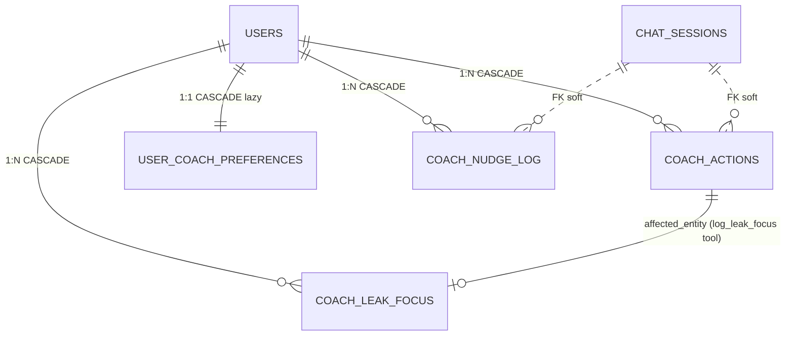

# Data Model — Indice de Tabelas

Schema completo em `shared/schema.ts` (~1300 linhas). Todas as tabelas usam `varchar` PK gerado via `nanoid`. FK na maioria via `userPlatformId` (formato `USER-XXXX`).

Para diagramas Mermaid: `Docs/architecture/data-model.mermaid`, `data-model-studies.mermaid`.

---

## Core (autenticacao, torneios, sessoes)

| Tabela | Descricao | Campos-chave |
|--------|-----------|--------------|
| `users` | Usuarios do sistema | id, userPlatformId (USER-XXXX), email, password, role, status, subscriptionPlan, emailVerified |
| `auth_tokens` | Tokens de verificacao/reset (substituiu Map em memoria) | userId, token, type, expiresAt |
| `sessions` | Sessoes Express (connect-pg-simple) | sid, sess (jsonb), expire |
| `tournaments` | Torneios importados do historico | userId, name, buyIn, prize, position, site, format, category, speed, fieldSize, datePlayed, **seriesId (NEW Flight-1, FK ON DELETE SET NULL)**, **baggedAt (NEW Flight-1, substitui flight_advanced legado)** |
| `tournament_templates` | Templates agrupados da biblioteca | userId, name, site, format, category, avgBuyIn, avgRoi, totalPlayed |
| `planned_tournaments` | Torneios planejados na grade | userId, dayOfWeek, profile (A/B/C), site, time, buyIn, type, speed, status, **seriesId (NEW Flight-1, FK ON DELETE SET NULL)** |
| `tournament_series` | **NEW Sprint Flight-1 (ADR-090).** Single source of truth para torneios multi-flight (Phased/Stage/Day 1 X). Substitui flags legados ADR-031 (`is_flight/flight_day/flight_parent_id/flight_advanced`) que serao removidos via migration 0030 MANUAL apos 7 dias de validacao. Campos: id (nanoid), userId, name (nome-base ex 'Sunday Million Phased'), network, totalDay1s, day2DateTime (UTC), day2Status enum (`pending`/`completed`/`cancelled`), stackMode enum (`single`/`combined` — best fora MVP, ADR-091), notes. Indices: `idx_series_user_status`, `idx_series_user_datetime`, `idx_series_user_name`. CASCADE em userId. SET NULL em tournaments.series_id e planned_tournaments.series_id. Auto-add Day 2 idempotente via (series_id, day_of_week). |
| `weekly_plans` | Planos semanais | userId, weekStart, targetBuyins, targetProfit, targetVolume |
| `grind_sessions` | Sessoes de grind | userId, date, status (planned/active/completed), profitLoss, duration, metricas mentais |
| `session_tournaments` | Torneios de uma sessao em tempo real | sessionId, site, buyIn, result, position, bounty, prize, status |
| `break_feedbacks` | Feedback durante breaks | sessionId, foco, energia, confianca, inteligenciaEmocional, interferencias |
| `preparation_logs` | Logs de preparacao mental (3 campos pos-sessao orfaos depreciados em Cooldown-3) | sessionId, mentalState, focusLevel, confidenceLevel, exercisesCompleted |
| `cooldown_logs` | Cool-down pos-sessao (1:1 com grind_sessions) — Sprint Cooldown-1 | userId, sessionId (UNIQUE), startedAt, completedAt, mode (full/quick), blocksCompleted (jsonb), abGameAnswers (jsonb), tiltSelfAssessment (jsonb, Sprint 2), sleepIntent (Sprint 2). Indices: `uq_cooldown_user_session`, `idx_cooldown_user_completed`. CASCADE em userId e sessionId. |
| `starred_hands` | Maos criticas estreladas durante cool-down — Sprint Cooldown-1 | userId, sessionId, sessionTournamentId, cooldownLogId (nullable, ON DELETE SET NULL), type (8 valores: tilt/leak/soulread/hero-call/cooler/mistake/sick/other), spot (8 valores: preflop/flop/turn/river/icm/final-table/bubble/other), notes (max 500). Indices: `idx_starred_user_session`, `idx_starred_user_type`. CASCADE em userId, sessionId, sessionTournamentId. |

## Bankroll (multi-wallet)

| Tabela | Descricao |
|--------|-----------|
| `wallets` | Carteiras multi-moeda (USD/BRL/EUR/CNY/USDT) com optimistic concurrency |
| `wallet_transactions` | Transacoes (deposit/withdrawal/session_result/manual_adjustment/rakeback/transfer_in/transfer_out/transfer_fee) |
| `wallet_transfers` | **NEW Bankroll-3 (RF-4 / ADR-059)**. Tabela mestra de transferencias cross-wallet. 1 row por transfer + 2-3 espelhos em `wallet_transactions` agrupados via `transfer_group_id`. FK `from_wallet_id`/`to_wallet_id`/`fee_wallet_id` ON DELETE RESTRICT (D1). CHECK `from != to` + amounts > 0. fxRate obrigatorio cross-currency (D4); diff > 5% vs market exige `?confirmFxDiff=true` (D11). |
| `wallet_pending` | **Reativada Bankroll-3 (RF-5 / D8)**. Pending types: `deposit_pending` / `withdrawal_pending`. Cap **10 pending por wallet** (count WHERE status='pending'). Coluna `external_reference` nova (RF-5). NAO afeta `wallets.balance` ate settle. |
| `bankroll_snapshots` | Snapshots multi-wallet com FX freezes. **Colunas novas Bankroll-3 (RF-2 + RF-8 / ADR-058)**: `origin` varchar(32) NOT NULL DEFAULT 'manual' (valores: `manual` / `auto-cooldown` / `transfer` / `import` / `migration_v1`); `source_ref_id` varchar(64) nullable (cooldown_log.id para auto-cooldown). Index `idx_bankroll_snapshots_origin` + unique parcial `uq_bankroll_snapshots_cooldown` (user_id, source_ref_id) WHERE origin='auto-cooldown' garante idempotencia. |

Detalhes: `Docs/architecture/bankroll-index.md`.

### Schema Delta — Sprint Bankroll-3

Migrations afetadas:
- `migrations/0017_wallet_transfers.sql` — tabela `wallet_transfers` + ALTER `wallet_pending` (external_reference + idx_active).
- `migrations/0018_auto_snapshot_meta.sql` — ALTER `bankroll_snapshots` (origin + source_ref_id + index + unique parcial) + ALTER `user_settings` (stops).

ADRs relevantes: 058 (auto-snapshot), 059 (wallet_transfers), 060 (stop-loss lock), 061 (fxResolver).

### Schema Delta — Sprint Flight-1 (Tournament Series + deprecacao flags ADR-031)

Migrations afetadas:
- `migrations/0029_add_tournament_series.sql` (AUTOMATICA) — cria tabela `tournament_series` + 2 ENUMs Postgres (`series_stack_mode`, `series_day2_status`) + ADD COLUMN `series_id` (FK SET NULL) em `tournaments` e `planned_tournaments` + ADD COLUMN `bagged_at TIMESTAMP NULL` em `tournaments` + back-fill de dados historicos via `flight_parent_id` ou `(name, site)`.
- `migrations/0030_drop_legacy_flight_flags.sql` (**MANUAL pos sign-off** apos 7 dias de validacao) — DROP COLUMN `is_flight`, `flight_day`, `flight_parent_id`, `flight_advanced` em `tournaments` e `planned_tournaments` + DROP indices parciais ADR-031 (`idx_tournaments_user_flight_parent`, `idx_tournaments_user_is_flight`).

ADRs relevantes: **ADR-090** (Tournament Series single source of truth — deprecar flags inline ADR-031), **ADR-091** (Stack mode enum: `single` | `combined`; best-stack fora MVP).

Diagramas Mermaid: `Docs/architecture/features/flight/`:
- `01-upload-detect-flight.mermaid` — parser detecta keywords + insere normalmente + auto-link Day1+Day2 (RF-05/06/08).
- `02-confirm-flight-modal.mermaid` — modal pos-upload descartavel + batch confirmation (RF-07/09).
- `03-mark-bagged-auto-add-day2.mermaid` — endpoint mark-bagged + auto-add planned Day 2 idempotente (RF-04/11).
- `04-backfill-manual.mermaid` — back-fill retroativo via UI (RF-13).
- `05-migration-deprecation.mermaid` — migration em 2 fases (auto + manual) com janela de validacao (RF-17).

## Coach AI

| Tabela | Descricao |
|--------|-----------|
| `coach_conversations` | Conversas do coach AI |
| `coach_messages` | Mensagens (role, content, tokens, model, latencyMs) |
| `coach_usage` | Tracking de tokens (input/output/cache_*) por conversation |
| `coach_feedback` | Thumbs up/down + comentarios |
| `coach_actions` | **NOVA Coach-2B (RF-01 / ADR-077 / ADR-083)**. Audit + state machine para tool calls (read + write). Status: `pending` → `executing` → `completed | failed | undone | expired`. Write tools (`requires_confirmation=true`) usam `payload_before` + `payload_after` + `undo_expires_at` (`confirmed_at + 5min`) para reversao. Read tools com `auditLevel='persist'` gravam apenas `result` wrapped (ADR-024). Indices: `idx_coach_actions_user_status`, `idx_coach_actions_session`, `idx_coach_actions_tool`, `idx_coach_actions_undo_window` (parcial WHERE status='completed'), `idx_coach_actions_pending_cleanup` (parcial WHERE status='pending'). FK CASCADE em userId; FK soft em chat_session_id + message_id. |
| `user_coach_preferences` | **NOVA Coach Sprint 0 (RF-01 / ADR-084)**. 1 row por usuario, lazy-create (defaults retornados se row ausente). 8 toggles por categoria de nudge (B-SNAPSHOT/B-LEAK/B-STUDY/B-VOLUME/B-GRADE/B-DOWNSWING ON; B-LIFE/B-MENTAL OFF). Quiet hours timezone-aware via `users.timezone`: `quiet_hours_start` + `quiet_hours_end` (0..23, wrap-around aceito). Frequency cap: `max_nudges_per_day=3`, `max_nudges_per_hour=1`. Channels: `channel_in_app`+`channel_email` ON, `channel_push` OFF. Tom: `coach_tone='balanced'` (gentle/balanced/direct, Coach-4 ativa LLM). UNIQUE em user_id. CASCADE em user. Cache memoria 30s (`prefsCache`) reusa logica de `resolveUserTier`. |
| `coach_nudge_log` | **NOVA Coach Sprint 0 (RF-03 / ADR-085)**. Audit + frequency cap + idempotencia per-cycle. Cada nudge enviado gera 1 row. `category` varchar(32) (B-SNAPSHOT/B-LEAK/B-STUDY/B-VOLUME/B-GRADE/B-DOWNSWING/B-LIFE/B-MENTAL). `cycle_key` varchar(16) nullable ('YYYY-MM' mensal | 'YYYY-WW' semanal | NULL). `status` varchar(16): sent/engaged/dismissed/snoozed/unsubscribed (snoozed NAO consume cap). `triggered_by_event` (cron_28th/csv_upload/session_complete/etc). Engine `shouldSendNudge` (ADR-085) consulta para frequency cap + idempotencia (`already_sent_this_cycle`). Indices: `idx_coach_nudge_log_user_sent`, `idx_coach_nudge_log_user_category_cycle`, `idx_coach_nudge_log_category_status_sent`. FK CASCADE em user; FK soft em chat_session_id (nudge cria sessao). |
| `coach_leak_focus` | **NOVA Coach-2B (RF-05 / ADR-077)**. Foco de leak escolhido pelo user (1 ou mais por mes). `leak_code` varchar(64) (ex 'low_itm_turbos'); `description` text max 200 pt-BR; `target_month` varchar(7) ('YYYY-MM'); `baseline_stat_key` + `baseline_value` + `baseline_sample_size` capturados no momento do log. `status`: active/resolved/abandoned. UNIQUE em (user_id, leak_code, target_month). FK CASCADE em user. Tool `verify_leak_progress` (RF-05) consulta para comparativo current vs baseline. |
| `coach_lesson_recommendations` | **NOVA home-reform-4 item 4 (RF-01 / ADRs 111-115)**. Recomendacao semanal de licao curada pelo Coach IA. 1 row por user por semana (UNIQUE `(user_id, week_start_date)`). `week_start_date` date (segunda-feira 00:00 BRT do ciclo). `reason` text 20-240 chars pt-BR. `source` varchar(20): `coach` (Anthropic respondeu) / `fallback_leak_tag` (mapping deterministico) / `fallback_popular` (popularidade + seed-randomizado) / `fallback_recent` (lessons mais novas) / `manual` (admin override). `input_summary` jsonb com snapshot de leaks/analytics/profile/sampleSize/catalogHash para auditoria + replay. `chat_session_id` varchar nullable reservado para feature futura "Discutir com Coach". `dismissed_at` + `consumed_at` timestamps mutuamente terminais (NULL = ativa). FK CASCADE em `users.user_platform_id` e `library_lessons.id`. Indices: `uq_coach_rec_user_week` (UNIQUE), `idx_coach_rec_user_active` (user_id + dismissed_at + consumed_at), `idx_coach_rec_lesson` (lesson_id). Cron `generateCoachRecommendations` (segunda 06:00 BRT, ADR-112) gera; endpoints `GET /api/home/coach-recommendation`, `POST /:id/dismiss`, `POST /:id/consume`, `POST /api/admin/coach/recommendations/regenerate`. |

Detalhes: `Docs/api/coach.md`, `Docs/api/coach-tools.md`.

**ADRs relevantes Coach Sprint 0 + Coach-2B (2026-05-02):**
- **ADR-077** (`coach-actions-migration-and-audit-log`) — schema final write-tool aware; migration unica `0024_coach_2b_actions_leak_focus.sql`; verifica que tabela documentada nos ADRs 023/024 NUNCA foi migrada (zero matches em codigo de producao).
- **ADR-083** (`coach-confirmation-undo-pattern`) — confirmation + undo 5min via state machine + `payload_before` snapshot dentro da tx (lesson #194); reverse-row em wallet (NAO hard-delete, ADR-058 ledger imutavel).
- **ADR-084** (`user-coach-preferences`) — tabela dedicada com lazy-create + cache 30s + Zod optional/default; defaults seguros (B-LIFE/B-MENTAL opt-in).
- **ADR-085** (`coach-nudge-engine`) — `shouldSendNudge` 5 checks sequenciais + safe-deny on error; cycleKey resolve idempotencia.
- **ADR-086** (`coach-citations-and-confidence-inline-rules`) — CITATIONS_RULES + CONFIDENCE_RULES em arquivo unico `coachSafetyPrompts.ts` (lesson #10 DRY); cache invalidation 1x apos deploy.
- **ADR-087** (`job-runner-timezone-aware`) — node-cron in-process para Sprint 2B; `iterateUsersWithTimezone` filtra por hora local; migration path para pg-boss em Coach-3.

**ADRs relevantes Coach Lesson Recommendation — home-reform-4 item 4 (2026-05-03):**
- **ADR-111** (`coach-lesson-recommendation-schema`) — tabela dedicada `coach_lesson_recommendations` com UNIQUE `(userId, weekStartDate)` + FK CASCADE em users e library_lessons; ciclo semanal previsivel; `source` enum logico (varchar) com 5 valores; `inputSummary` jsonb para auditoria. Migration `0042_coach_lesson_recommendations.sql`.
- **ADR-112** (`coach-recommendation-cron-strategy`) — node-cron in-process registrado em `cronRunner.ts` com expressao `0 6 * * 1` + tz `America/Sao_Paulo`. Activation guard reusa `COACH_CRON_ENABLED`. Idempotencia em 3 camadas (banco UNIQUE + cron early-skip + admin DELETE). Sequencial; endpoint admin `regenerate` para override manual.
- **ADR-113** (`coach-recommendation-fallback-tiers`) — algoritmo em 5 tiers: (0) short-circuit user sem dados, (1) Coach IA Anthropic, (2) leak->tag deterministico, (3) popular seed-randomizado por (userId+weekStart), (4) lessons recentes, (5) null. Garante resilience a outage Anthropic.
- **ADR-114** (`coach-recommendation-consume-tracking`) — query param `?source=home-coach-rec&recId=...` na URL da pagina lesson; player dispara consume apos 30s OR 80% playback; backend insere row em `library_events` com `event_type='coach_recommend'` (enum existente em schema:3582). Convencao `?source=...` reutilizavel para outros entry points.
- **ADR-115** (`coach-recommendation-prompt-cache`) — 2 blocos `cache_control: ephemeral` (system prompt + catalog markdown). Hit rate alvo > 90%. Catalog cap 200 lessons ordenadas deterministicamente (createdAt DESC, id). Logging de tokens cache_creation/cache_read para monitoramento.

> Nota numeracao: ADR-078 (design tokens UI-FND-1) foi reservado por sessao paralela em 2026-05-02. Os 6 ADRs Coach Sprint 0 + Coach-2B foram renumerados para 077 + 083-087 evitando colisao.

**Diagramas Mermaid:** ver `Docs/architecture/diagrams/coach-2b/`:
- `er-coach-2b.mermaid` — ER das 4 tabelas novas + relacionamentos com tabelas existentes.
- `seq-write-tool-confirm-undo.mermaid` — Sequencia confirmation + undo 5min + race condition + cleanup.
- `flow-nudge-engine.mermaid` — Flowchart shouldSendNudge (5 checks + safe-deny).
- `seq-nudge-b-snapshot.mermaid` — B-SNAPSHOT cron mensal dia 28 9h timezone-aware.
- `seq-nudge-b-leak.mermaid` — B-LEAK setImmediate pos-upload com gap-check + cycleKey semanal.
- `flow-citation-enrichment.mermaid` — System prompt rules + tool result wrapping + frontend parser.

**Diagramas Mermaid Coach Lesson Recommendation (home-reform-4 item 4):**
- `Docs/architecture/coach-recommendation-data.mermaid` — ER de `coach_lesson_recommendations` + FKs com `users`, `library_lessons`, `library_events`, `user_lesson_access`.
- `Docs/architecture/coach-recommendation-sequence.mermaid` — Sequencia ponta-a-ponta: cron weekly -> detectLeaks -> recommendLessonForUser -> Coach IA / fallback -> INSERT -> render Home -> consume tracking via library_events.
- `Docs/architecture/coach-recommendation-flow.mermaid` — Decision tree do fallback em 5 tiers (Tier 0 short-circuit -> Coach -> leak->tag -> popular -> recent -> null).

**Migration prevista:** `migrations/0024_coach_2b_actions_leak_focus.sql` (cria 4 tabelas + indices em uma migration unica).
**Migration prevista (home-reform-4 item 4):** `migrations/0042_coach_lesson_recommendations.sql` (cria 1 tabela + 3 indices).

### Schema Delta — Sprint Coach Sprint 0 + Coach-2B



```sql
-- migrations/0024_coach_2b_actions_leak_focus.sql (preview)

CREATE TABLE coach_actions (
    id VARCHAR(21) PRIMARY KEY,
    user_id VARCHAR(21) NOT NULL REFERENCES users(user_platform_id) ON DELETE CASCADE,
    chat_session_id VARCHAR(21),
    message_id VARCHAR(21),
    tool_use_id VARCHAR(64),
    tool_name VARCHAR(64) NOT NULL,
    status VARCHAR(16) NOT NULL,
    input JSONB,
    result JSONB,
    error_message TEXT,
    payload_before JSONB,
    payload_after JSONB,
    affected_entity_type VARCHAR(32),
    affected_entity_id VARCHAR(21),
    requires_confirmation BOOLEAN NOT NULL DEFAULT FALSE,
    confirmed_at TIMESTAMP,
    undo_expires_at TIMESTAMP,
    undone_at TIMESTAMP,
    latency_ms INTEGER,
    executed_at TIMESTAMP,
    created_at TIMESTAMP NOT NULL DEFAULT NOW()
);
CREATE INDEX idx_coach_actions_user_status ON coach_actions(user_id, status, created_at);
CREATE INDEX idx_coach_actions_session ON coach_actions(chat_session_id);
CREATE INDEX idx_coach_actions_tool ON coach_actions(tool_name, status, created_at);
CREATE INDEX idx_coach_actions_undo_window ON coach_actions(user_id, undo_expires_at)
    WHERE status = 'completed' AND undo_expires_at IS NOT NULL;
CREATE INDEX idx_coach_actions_pending_cleanup ON coach_actions(status, created_at)
    WHERE status = 'pending';

CREATE TABLE user_coach_preferences (
    id VARCHAR(21) PRIMARY KEY,
    user_id VARCHAR(21) NOT NULL UNIQUE REFERENCES users(user_platform_id) ON DELETE CASCADE,
    nudge_b_snapshot BOOLEAN NOT NULL DEFAULT TRUE,
    nudge_b_leak BOOLEAN NOT NULL DEFAULT TRUE,
    nudge_b_study BOOLEAN NOT NULL DEFAULT TRUE,
    nudge_b_volume BOOLEAN NOT NULL DEFAULT TRUE,
    nudge_b_grade BOOLEAN NOT NULL DEFAULT TRUE,
    nudge_b_downswing BOOLEAN NOT NULL DEFAULT TRUE,
    nudge_b_life BOOLEAN NOT NULL DEFAULT FALSE,
    nudge_b_mental BOOLEAN NOT NULL DEFAULT FALSE,
    quiet_hours_start INTEGER NOT NULL DEFAULT 21,
    quiet_hours_end INTEGER NOT NULL DEFAULT 9,
    max_nudges_per_day INTEGER NOT NULL DEFAULT 3,
    max_nudges_per_hour INTEGER NOT NULL DEFAULT 1,
    channel_in_app BOOLEAN NOT NULL DEFAULT TRUE,
    channel_email BOOLEAN NOT NULL DEFAULT TRUE,
    channel_push BOOLEAN NOT NULL DEFAULT FALSE,
    coach_tone VARCHAR(20) NOT NULL DEFAULT 'balanced',
    created_at TIMESTAMP NOT NULL DEFAULT NOW(),
    updated_at TIMESTAMP NOT NULL DEFAULT NOW()
);

CREATE TABLE coach_nudge_log (
    id VARCHAR(21) PRIMARY KEY,
    user_id VARCHAR(21) NOT NULL REFERENCES users(user_platform_id) ON DELETE CASCADE,
    category VARCHAR(32) NOT NULL,
    cycle_key VARCHAR(16),
    status VARCHAR(16) NOT NULL,
    title_i18n VARCHAR(200),
    body_preview TEXT,
    channel VARCHAR(16) DEFAULT 'in_app',
    chat_session_id VARCHAR(21),
    triggered_by_event VARCHAR(64),
    sent_at TIMESTAMP DEFAULT NOW(),
    engaged_at TIMESTAMP,
    dismissed_at TIMESTAMP,
    snooze_until TIMESTAMP,
    created_at TIMESTAMP DEFAULT NOW()
);
CREATE INDEX idx_coach_nudge_log_user_sent ON coach_nudge_log(user_id, sent_at);
CREATE INDEX idx_coach_nudge_log_user_category_cycle ON coach_nudge_log(user_id, category, cycle_key);
CREATE INDEX idx_coach_nudge_log_category_status_sent ON coach_nudge_log(category, status, sent_at);

CREATE TABLE coach_leak_focus (
    id VARCHAR(21) PRIMARY KEY,
    user_id VARCHAR(21) NOT NULL REFERENCES users(user_platform_id) ON DELETE CASCADE,
    leak_code VARCHAR(64) NOT NULL,
    description TEXT NOT NULL,
    target_month VARCHAR(7) NOT NULL,
    baseline_stat_key VARCHAR(128) NOT NULL,
    baseline_value DECIMAL NOT NULL,
    baseline_sample_size INTEGER NOT NULL,
    study_plan_notes TEXT,
    status VARCHAR(16) DEFAULT 'active',
    resolved_at TIMESTAMP,
    created_at TIMESTAMP DEFAULT NOW(),
    updated_at TIMESTAMP DEFAULT NOW()
);
CREATE INDEX idx_coach_leak_focus_user_month ON coach_leak_focus(user_id, target_month);
CREATE UNIQUE INDEX uniq_coach_leak_focus_user_code_month
    ON coach_leak_focus(user_id, leak_code, target_month);
```

Drizzle (em `shared/schema.ts`): Zod `optional + default` em todas as colunas write-tool only de `coach_actions` (lesson #7 — deprecation gradual). Cache 30s em memoria para `getCoachPreferences` (analogo a `resolveUserTier`).

---

## Estudos

| Tabela | Descricao |
|--------|-----------|
| `study_cards` | Cards de estudo com topicos de poker (3bet, ICM, etc.) |
| `study_themes` | Temas (categorizacao). **Coluna nova Studies-Reform (RF-03 / ADR-067 / ADR-068)**: `attacks_leak_type` varchar(50) nullable — vincula tema a leak detectado em Stats Analyzer; alimenta filtro `?fromStats=leaks` (D11) e bonus de score em recomendacoes. |
| `study_tabs` | Abas dentro de tema (boards, ranges, hand_notes, tags). **Coluna opcional Studies-Reform (RF-02 / ADR-067)**: `last_visited_at` timestamp nullable — alimenta "Continue de onde parou" no Dashboard; fallback derivar de `study_sessions.tab_id` mais recente quando nao populada. |
| `study_materials` | Materiais (video, artigo, pdf) |
| `study_notes` | Notas de estudo |
| `study_sessions` | **LEGADO read-only pos Sprint Estudos-Habito-1 (ADR-126).** Sessoes de estudo com duracao e scores. **Coluna nova home-reform-4 Item 7 (RF-08 / ADR-117)**: `theme_id` varchar(21) nullable, FK `study_themes(id)` ON DELETE SET NULL — alimenta `studyMinutesMonth` no `FocusStatsCard` da Home (continua sendo lida via UNION ALL com `study_sessions_v2` durante deprecation gradual — ADR-126 §2). SEM back-fill historico (sessoes pre-Item 7 ficam com `theme_id=NULL`). Indice parcial `idx_study_sessions_user_theme_date` em `(user_id, theme_id, date) WHERE theme_id IS NOT NULL`. Migration `0044_study_sessions_theme_id.sql`. |
| `study_sessions_v2` | **NOVO Sprint Estudos-Habito-1 (RF-1 / ADR-126).** Tabela nova com schema completo do log de estudo: 4 modos primarios + escape (`drill_gto`/`tournament_review`/`hand_review`/`lesson`/`other`) + 4 sources (`manual_post_hoc`/`manual_live`/`auto_lesson`/`auto_grind_finalize`) + status running/completed + audit (deleted_at 24h gate). Colunas: `id`, `user_id` (CASCADE), `mode`/`source`/`status` (CHECK enum), `theme_id`/`tournament_id`/`lesson_id` (FK SET NULL), `starred_hand_ids` jsonb, `drill_platform`/`drill_accuracy`/`difficult_spots`, `duration_minutes` (CHECK 1-1440), `started_at`/`ended_at`/`registered_at` (anchor do streak), `idle_periods` jsonb (auto-pause smart), `notes` (max 500), `attachments` jsonb, `was_productive`, `daily_goal_met` (calc handler RF-2), `xp_awarded` (reservado), `deleted_at`, timestamps. **CHECK discriminator-based:** `mode='drill_gto'/'other'` exige theme; `mode='lesson'` exige lesson_id (theme_id NULLABLE — errata ADR-135 Sprint 2); `mode='hand_review'` exige starred_hand_ids array nao vazio; `status='running'` exige started_at NOT NULL ended_at NULL. **Indices:** `idx_ssv2_user_started`, `idx_ssv2_user_mode_started`, `idx_ssv2_user_registered` (FAB lookup), `idx_ssv2_user_lesson_partial` (idempotency auto_lesson 24h ADR-130), `uq_ssv2_user_running` (UNIQUE parcial — enforce max 1 cronometro live por user), `idx_ssv2_user_theme_month` (FocusStatsCard). Trigger `set_updated_at`. Migration `0052_study_sessions_v2.sql`. |
| `study_themes` (delta Estudos-Habito-1) | **Colunas novas Sprint Estudos-Habito-1 (RF-1.1 + RF-3.3 / ADR-127):** `slug` varchar(60) nullable, `is_curated` boolean default false, `category` varchar(32) (CHECK enum `preflop`/`postflop`/`icm`/`mental`/`specific`/null), `linked_stats` jsonb default `'[]'` (array de stat_id do HUD_STAT_CATALOG — alimenta auto-suggest RF-3.3), `linked_lessons` jsonb default `'[]'` (array de library_lessons.id), `seeded_at` timestamp. **Indices:** UNIQUE parcial `uq_study_themes_user_slug_curated` em `(user_id, slug)` WHERE `is_curated=true AND slug IS NOT NULL`; GIN `idx_study_themes_curated_stats` em `linked_stats jsonb_path_ops` WHERE `is_curated=true`. Seed: 30 themes curated em 5 categorias (preflop=8, postflop=8, icm=6, mental=5, specific=3) em `server/seeds/study-themes-seed.ts`. Lazy seed per-user via `storage.ensureCuratedThemesForUser(userId)` no primeiro GET `/api/study-themes`. Migration `0052_study_sessions_v2.sql` (mesmo arquivo). |
| `user_focus_stats` (delta Estudos-Habito-1) | **Mudanca Sprint Estudos-Habito-1 (RF-3.1):** `study_theme_id` DROP NOT NULL — passa a aceitar foco sem tema linkado. Sem back-fill (rows existentes mantem theme). Indices preservados. Migration `0053_user_focus_stats_nullable_theme.sql`. |
| `users` (delta Estudos-Habito-1) | **Colunas novas Sprint Estudos-Habito-1 (RF-2.1 + RF-2.3 / ADR-128):** `daily_study_goal_minutes` integer NOT NULL DEFAULT 0 (CHECK enum 0/15/30/45/60/90/120 — 0=desligado), `study_streak_freezes_used_this_month` integer NOT NULL DEFAULT 0 (CHECK 0-2), `last_freeze_reset_month` varchar(7) nullable (CHECK regex `^[0-9]{4}-(0[1-9]|1[0-2])$`). Reset mensal via cron `resetStudyFreezesMonthly` em `server/jobs/index.ts` `5 0 * * *` UTC (todo dia 00:05 UTC) + lazy reset em `bumpStudyStreak` (defesa em profundidade). Migration `0054_users_habit_columns.sql`. **Extensao JSONB** (sem migration SQL — back-fill lazy via storage layer ADR-129): `home_layout_settings.focusStatsVisibility = { home, grindLive, coach, estudos, statsAnalyzer }` nested object com defaults true; legacy `showFocusStatsBar` mantido como mirror lazy. |
| `study_schedules` | Agendamentos de estudo |
| `user_focus_stats` | **NOVO home-reform-4 Item 7 (RF-01 / ADR-116)**. Persiste as marcacoes mensais de stats foco do user (max 3 por user/mes, enforcement em servico). 1 row por (user, stat_id, month). Colunas: `id` varchar(21) PK nanoid; `user_id` varchar(21) FK `users.user_platform_id` ON DELETE CASCADE; `stat_id` varchar(64) (id em `HUD_STAT_CATALOG`, sem FK — catalog estatico em codigo); `study_theme_id` varchar(21) FK `study_themes.id` ON DELETE CASCADE; `month` varchar(7) formato `YYYY-MM` UTC (validado por regex Zod); `created_at`/`updated_at` timestamp (trigger `set_updated_at`). UNIQUE constraint `(user_id, stat_id, month)` previne marcacao duplicada (race condition vira 409 STAT_ALREADY_FOCUSED). Indices: `uq_user_focus_stats_user_stat_month`, `idx_user_focus_stats_user_month`, `idx_user_focus_stats_theme`. **Reset implicito ao virar mes**: query muda mes → rows mudam, sem cron. Migration `0043_user_focus_stats.sql`. Alimenta `GET /api/home/focus-stats` (consumido pelo `FocusStatsCard` na zona "Estudos" da Home — ADR-118). |
| `study_theme_spot_links` | **NOVO Studies-Reform (RF-08 / ADR-068, opcional D10)**. Tabela N:N entre `study_themes` e `starred_hands`. 1 row por vinculo. Colunas: `id` (nanoid), `theme_id` (FK CASCADE), `spot_id` (FK CASCADE), `user_id` (FK CASCADE), `linked_at` timestamp default NOW. UNIQUE constraint em `(theme_id, spot_id)` para idempotencia. Indices: `idx_study_theme_spot_links_theme`, `idx_study_theme_spot_links_spot`, `idx_study_theme_spot_links_user`. Alimenta `storage.getLinkedSpots()` (compartilhado entre `studyRecommendationsService` RF-06 e Coach tool `read_theme_with_linked_spots` RF-07). Spec MVP: 1 spot pode ter multiplos themes (modelado N:N para futuro), mas UI atual sugere 1 tema por spot. |

## Calendario

| Tabela | Descricao |
|--------|-----------|
| `calendar_categories` | Categorias customizaveis de eventos |
| `calendar_events` | Eventos com recorrencia |
| `weekly_routines` | Rotinas semanais auto-geradas |
| `active_days` | Dias ativos na grade (por usuario) |
| `profile_states` | Perfil ativo por dia (A, B ou C) |

## Tickets de Satelite

| Tabela | Descricao |
|--------|-----------|
| `satellite_tickets` | Tickets ganhos em satelites |
| `ticket_uses` | Usos de tickets em torneios target |

## News Feed

| Tabela | Descricao |
|--------|-----------|
| `news_sources` | Catalogo de fontes (15 entries locked apos Sprint News-3). **Colunas pos-News-3 (ADR-107-news):** `id` varchar PK (slug ex `mundopoker`, `gto-wizard`); `category` enum (`gossip`/`sites`/`studies`/`tools`); `platform` varchar nullable (apenas para sources de redes especificas); `homepage_url` text nullable (URL canonica do blog); `rss_url` text nullable **(NOVA)** (URL feed RSS/Atom quando disponivel); `scrape_strategy` varchar(32) NOT NULL DEFAULT `'html'` **(NOVA)** com CHECK constraint para enum `('rss','html','x_only','rss_and_x','html_and_x','rss_or_html')`; `x_handle` varchar(64) nullable **(RENAMED de `live_search_handle`)** — handle X sem `@`; `enabled` boolean NOT NULL DEFAULT true. Sem timestamps explicitos (catalogo gerenciado via seed/UPSERT). Sources legacy deletadas em 2026-05-04 (cravadas-br, chico, ipoker, intuitive-table, holdem-manager, pokertracker) com CASCADE em `news_items`. Migration `0XXX_news_3_refactor.sql` (RF-01 + RF-08.1). |
| `news_items` | Items do feed indexados pelo cron weekly. Wipe total no flip Sprint News-3 (todos pre-Sprint News-3 eram fake — audit 2026-05-04). **Colunas:** `id` varchar PK (nanoid 21); `source_id` varchar FK `news_sources.id` ON DELETE CASCADE; `title` text NOT NULL; `url` text NOT NULL; `summary` text nullable (truncado 500 chars); `published_at` timestamp NOT NULL (data publicada na fonte); `content_hash` varchar(64) UNIQUE NOT NULL (sha256 derivado de `url_canonical + '\n' + title_fingerprint`; alimenta `ON CONFLICT DO NOTHING` idempotente); `fetched_at` timestamp NOT NULL DEFAULT NOW; `expires_at` timestamp NOT NULL (publishedAt + 30d); `category` enum espelha source.category; `platform` varchar espelha source.platform. **Colunas pos-News-3 (ADR-107-news):** `url_canonical` text NOT NULL DEFAULT `''` **(NOVA, indexada)** — URL normalizada para Layer 1 dedupe (lowercase host, strip utm_*, twitter→x, ordenar query, strip trailing slash); `title_fingerprint` varchar(64) NOT NULL DEFAULT `''` **(NOVA, indexada)** — sha256 hex do top-10 tokens normalizados (NFD, lowercase, strip stopwords PT+EN, sort) para Layer 2 dedupe. Indices novos: `idx_news_items_url_canonical_fetched (url_canonical, fetched_at DESC)` + `idx_news_items_title_fingerprint_fetched (title_fingerprint, fetched_at DESC)`. |

**ADRs relevantes News:**
- **ADR-100** (`news-feed-deferred-integration`) — base estrutura Onda 1 (catalogo + flag).
- **ADR-106-news** (`news-feed-grok-integration`) — **SUPERSEDED por ADR-107-news**. Provider Grok-LLM hallucinava conteudo (audit 73.6% URLs mortas, 100% datas Out/2024).
- **ADR-107-news** (`news-rss-x-search-refactor`) — Sprint News-3. Substitui Grok-LLM por arquitetura `BlogScraperProvider` (RSS+9 HTML adapters) + `XSearchProvider` (xAI Live Search com `sources[].type='x'`) + `OrchestratorService` (concurrency 3 + dispatch per strategy) + `DedupeService` 3-layer ordenado. Cron `0 15 * * 1` UTC. `XAI_API_KEY` ausente/invalida → cron skip total (decisao all-or-nothing).
- **ADR-110** (`news-feed-ranking-and-zoning`) — endpoint `/api/news/feed` ranqueado server-side + 4 zonas semanticas Home + read-state localStorage (Sprint home-reform-3).

**Diagramas Mermaid News-3:**
- `Docs/architecture/news-3-components.mermaid` — C4 component diagram (cron, orchestrator, providers, adapters, dedupe, repo, DB).
- `Docs/architecture/news-3-sequence.mermaid` — Sequencia ponta-a-ponta cron run com paths de erro (timeout, key missing, parse fail) + concurrency 3.
- `Docs/architecture/news-3-dedupe-flow.mermaid` — Decision tree do pipeline dedupe Layer 1 → 2 → 3 com logging em cada drop.

**Schema Delta — Sprint News-3:**

```sql
-- migrations/0XXX_news_3_refactor.sql (preview)

-- RF-01: news_sources schema
ALTER TABLE news_sources ADD COLUMN rss_url TEXT NULL;
ALTER TABLE news_sources ADD COLUMN scrape_strategy VARCHAR(32) NOT NULL DEFAULT 'html'
  CHECK (scrape_strategy IN ('rss','html','x_only','rss_and_x','html_and_x','rss_or_html'));
ALTER TABLE news_sources RENAME COLUMN live_search_handle TO x_handle;
DELETE FROM news_sources WHERE id IN
  ('cravadas-br','chico','ipoker','intuitive-table','holdem-manager','pokertracker');
-- UPSERT 15 sources finais via seed (mundopoker, superpoker, 888poker, bodog, coinpoker,
-- ggpoker, partypoker, pokerstars, wpn-acr, gto-wizard-studies, gto-wizard,
-- hand2note, hrc, jurojin, sharkscope).

-- RF-01 wipe: descartar todos items fake
DELETE FROM news_items;

-- RF-08.1: dedupe support columns + indices
ALTER TABLE news_items ADD COLUMN url_canonical TEXT NOT NULL DEFAULT '';
ALTER TABLE news_items ADD COLUMN title_fingerprint VARCHAR(64) NOT NULL DEFAULT '';
CREATE INDEX idx_news_items_url_canonical_fetched
  ON news_items (url_canonical, fetched_at DESC);
CREATE INDEX idx_news_items_title_fingerprint_fetched
  ON news_items (title_fingerprint, fetched_at DESC);
```

Drizzle (em `shared/schema.ts`):

```ts
// news_sources
rssUrl: text('rss_url'),
scrapeStrategy: varchar('scrape_strategy', { length: 32 }).notNull().default('html'),
xHandle: varchar('x_handle', { length: 64 }),  // RENAMED de liveSearchHandle

// news_items
urlCanonical: text('url_canonical').notNull().default(''),
titleFingerprint: varchar('title_fingerprint', { length: 64 }).notNull().default(''),
```

Type literal exportado: `type ScrapeStrategy = 'rss' | 'html' | 'x_only' | 'rss_and_x' | 'html_and_x' | 'rss_or_html'`.

---

## Admin / Sistema

| Tabela | Descricao |
|--------|-----------|
| `permissions` | Permissoes do sistema (admin_full, etc.) |
| `user_permissions` | Relacao usuario-permissao com expiracao |
| `subscriptions` | Assinaturas de usuarios |
| `subscription_plans` | Planos disponiveis |
| `user_subscriptions` | Assinaturas ativas |
| `notifications` | Notificacoes do sistema |
| `bug_reports` | Reports de bugs dos usuarios |
| `upload_history` | Historico de uploads CSV/XLSX |
| `access_logs` | Logs de acesso e tentativas negadas |
| `user_activity` | Tracking de atividade (consolidado em 2026-03-20, antes era `user_activities` + `user_activity`) |
| `analytics_daily` | Resumo diario de analytics |
| `engagement_metrics` | Metricas de engajamento |
| `user_settings` | Configuracoes do usuario (moeda, notificacoes, exchange rates, **`bankroll_management_enabled` boolean default true** — Sprint B2/M2). **Colunas novas Bankroll-3 (RF-6 / ADR-060)**: `stop_loss_usd` decimal nullable (limite perda diaria USD), `stop_win_usd` decimal nullable (meta ganho diaria USD), `stop_lock_until` timestamp nullable (lock ativo se > NOW), `stop_lock_duration_hours` integer NOT NULL DEFAULT 12 (range 1-72). Stop-win NAO bloqueia (D3, banner only). Stop-loss bloqueia 12h default. Reset 00:00 user TZ (`users.timezone`, fallback UTC). |
| `users` (delta) | **Colunas opcionais Studies-Reform (RF-08 / ADR-067 / ADR-068, D10)**: `study_streak_days` integer NOT NULL DEFAULT 0 — cache de streak diario; `last_study_activity_at` timestamp nullable — alimenta `bumpStudyStreak` para detectar dia consecutivo (D3). Indice parcial `idx_users_streak_active` em `study_streak_days WHERE study_streak_days > 0`. Se migration 0021 nao aplicada (D10 fallback), persistencia em `localStorage` (`grindfy:studies:streak`, shape `{ days: number, lastActivityAt: ISO8601 }`) — streak nao sobrevive multi-device nem limpeza de cache. |
| `custom_groups` | Grupos customizados de templates |
| `custom_group_templates` | Relacao grupo-template |
| `coaching_insights` | Insights de coaching |

## PrimeDope Simulation (Sprint F4)

| Tabela | Descricao |
|--------|-----------|
| `primedope_runs` | Cache + audit de simulacoes de variance MTT (Sprint F4, ADR-054). PK nanoid 21, FK `userId` ON DELETE CASCADE. Campos: `inputHash` sha256 deterministico pos-FX, `inputJson`/`resultJson` jsonb, `histogramPath`/`randomRunsPath` paths PNG re-hosted, `latencyMs`, `source` enum (primedope/cache/fallback-stale), `pinned` default false, `expiresAt` via trigger (NULL se pinned, +90d senao). Indices: `(user_id, profile_letter, day_of_week, created_at DESC)`, `(input_hash, created_at DESC)`, `(expires_at) WHERE pinned=false`. Migration `0027_primedope_runs.sql`. |

`tournaments` recebe **+3 colunas** via migration `0026_tournaments_simulation_fields.sql` (Sprint F4):
- `players_avg INTEGER` (CHECK 10..50000) — backfill cascata `tournament_templates.avg_field_size` > `field_size` > 1000.
- `places_paid_avg INTEGER` (CHECK 1..10000) — backfill `ROUND(players_avg * 0.15)`.
- `rake_pct DECIMAL(4,2)` (CHECK 0..30) — backfill heuristico per-`site` (GG=10, WPN=8, Stars=9, Suprema=10, etc.).

ADRs: 054 (provider externo PrimeDope vs engine nativo), 055 (`tracker.ts` stub vs `analytics_events`), 056 (onboarding dismiss localStorage vs `users.preferences`).

Diagramas Mermaid: `er-primedope.mermaid`, `c4-context-primedope.mermaid`, `sequence-primedope-simulation.mermaid`, `flow-primedope-wizard-prefill.mermaid`, `flow-day-detail-drawer.mermaid`.

## Convencoes

- IDs `varchar` via `nanoid()` — nunca auto-increment.
- `userPlatformId` formato `USER-XXXX` (sequencial, separado de `id` interno).
- Validacao Zod via `drizzle-zod` em `shared/schema.ts`.
- Snapshots para auditoria (bankroll); soft-delete raro (preferir hard-delete + tracking).
- ADRs relevantes: 014 (add-on/rea), 017 (snapshot vs derived), 028 (warmup_rituals dedicada), 031-032 (tournament types), 033 (FX rate), 038 (optimistic concurrency wallet), 039 (rakeback as wallet tx), 040 (session-end reconciliation), 041 (cooldown_logs + starred_hands dedicadas), 046 (session_wallet_snapshots), 047 (summary inline reconcile), 048 (wallets eligibility por plataformas jogadas), **058 (auto-snapshot pos-cooldown)**, **059 (cross-wallet transfer ledger)**, **060 (stop-loss/stop-win lock)**, **061 (fxResolver unificado)**, **067 (studies page IA — sub-paths)**, **068 (cross-feature recommendations engine)**.

---

## Schema Delta — Sprint Studies-Reform (Migration 0021, opcional D10)

ADR-067 (URL state pattern em studies) + ADR-068 (cross-feature recommendations engine) introduzem 1 tabela nova + 2 colunas em `users`. Migration **opcional** (D10): se test-writer red phase nao confirmar necessidade, fallback localStorage para streak; tabela `study_theme_spot_links` e pre-requisito de RF-05 e portanto **bloqueante** para o workflow spot↔tema funcionar end-to-end.

```sql
-- migrations/0021_studies_reform.sql

CREATE TABLE IF NOT EXISTS study_theme_spot_links (
    id VARCHAR(21) PRIMARY KEY,
    theme_id VARCHAR(21) NOT NULL REFERENCES study_themes(id) ON DELETE CASCADE,
    spot_id VARCHAR(21) NOT NULL REFERENCES starred_hands(id) ON DELETE CASCADE,
    user_id VARCHAR(21) NOT NULL REFERENCES users(id) ON DELETE CASCADE,
    linked_at TIMESTAMP NOT NULL DEFAULT NOW(),
    UNIQUE (theme_id, spot_id)
);
CREATE INDEX IF NOT EXISTS idx_study_theme_spot_links_theme ON study_theme_spot_links(theme_id);
CREATE INDEX IF NOT EXISTS idx_study_theme_spot_links_spot ON study_theme_spot_links(spot_id);
CREATE INDEX IF NOT EXISTS idx_study_theme_spot_links_user ON study_theme_spot_links(user_id);

ALTER TABLE users
    ADD COLUMN IF NOT EXISTS study_streak_days INTEGER NOT NULL DEFAULT 0,
    ADD COLUMN IF NOT EXISTS last_study_activity_at TIMESTAMP NULL;

CREATE INDEX IF NOT EXISTS idx_users_streak_active
    ON users(study_streak_days) WHERE study_streak_days > 0;
```

Diagrama ER atualizado em `Docs/architecture/data-model-studies.mermaid` (a atualizar quando migration aplicada). Colunas opcionais `study_themes.attacks_leak_type` e `study_tabs.last_visited_at` documentadas na tabela acima — adicao gradual seguindo lesson #7 (deprecation gradual: nullable + default).

Caminho com migration (preferido):
- `study_theme_spot_links` operacional, RF-05 + RF-06 + RF-07 funcionam end-to-end.
- Streak persiste em `users.study_streak_days` — sobrevive multi-device.
- `getLinkedSpots(themeId, userId)` query indexada.

Caminho fallback (sem migration, D10):
- `study_theme_spot_links` ausente → RF-05 erro 500 `migration_missing` no submit com `themeId`. Sem migration, RF-05 nao pode ser entregue.
- Streak em `localStorage` (`grindfy:studies:streak`) — perde em limpeza de cache, nao multi-device.
- `studyRecommendationsService` ainda funciona, mas sem source de "linked spots" para enriquecer dormant themes.

Decisao operacional: **migration 0021 e bloqueante para Sprint Studies-Reform fechar com RF-05 verde**. test-writer red phase de RF-05 produz tests que exigem a tabela; reviewer R3 rejeita merge sem migration aplicada em dev DB.

---

## Schema Delta — Sprint B2 (`bankroll_management_enabled`)

ADR-047 + ADR-048 adicionam coluna em `user_settings`:

```mermaid
erDiagram
    USERS ||--|| USER_SETTINGS : "1:1"
    USER_SETTINGS {
        varchar user_id PK_FK
        varchar default_currency "default 'USD'"
        boolean notifications_enabled "default true"
        jsonb exchange_rates "FX freezes (ADR-033)"
        boolean bankroll_management_enabled "NEW B2 — default true"
        timestamp created_at
        timestamp updated_at
    }
    USER_SETTINGS ||--o{ WALLETS : "guards-render"
    USER_SETTINGS ||--o{ SESSION_WALLET_SNAPSHOTS : "guards-write<br/>(skip se false)"
```

Migracao SQL (em `migrations/` quando implementer aplicar):

```sql
ALTER TABLE user_settings
  ADD COLUMN bankroll_management_enabled BOOLEAN NOT NULL DEFAULT TRUE;
```

Drizzle (em `shared/schema.ts`):

```ts
bankrollManagementEnabled: boolean('bankroll_management_enabled').notNull().default(true),
```

Zod schema (insert/update): `optional + default(true)` — lesson learned #7 (deprecation gradual).

**Comportamento por valor:**
- `true` (default): fluxo multi-wallet completo. Lista de wallets em `/settings`, secao "Bancas" no `SessionSummaryModal`, banner missing platforms (ADR-048), snapshot gravado.
- `false`: lista de wallets escondida em `/settings`, secao "Bancas" e banner missing NAO renderizados, snapshot NAO gravado server-side, telemetry `reconcile_skipped_setting_off`.

Banca legada (`bankroll_amount` + `bankroll_rule` em `user_settings`) **continua visivel** em ambos os modos.

---

## Schema Delta — Sprint F2 (`starred_hands` + spot screenshots)

ADR-051 + ADR-052 + ADR-053 (2026-04-27) estendem `starred_hands` para suportar prints
colados durante o grind live, com expiracao em 14 dias e cron diario de purge.
**Nenhuma tabela nova** — extensao de `starred_hands` com 8 colunas nullable + back-fill
de rows criadas pelo cooldown classico (Sprint Cooldown-1).

```mermaid
erDiagram
    GRIND_SESSIONS ||--o{ STARRED_HANDS : "1:N"
    SESSION_TOURNAMENTS ||--o{ STARRED_HANDS : "1:N"
    USERS ||--o{ STARRED_HANDS : "1:N (CASCADE)"
    COOLDOWN_LOGS ||--o{ STARRED_HANDS : "1:N (SET NULL)"

    STARRED_HANDS {
        varchar id PK
        varchar user_id FK
        varchar session_id FK
        varchar session_tournament_id FK
        varchar cooldown_log_id FK_NULL "ON DELETE SET NULL"
        varchar type "enum 9 valores (era 8 + 'spot_screenshot')"
        varchar spot "enum 9 valores (era 8 + 'screenshot_pending')"
        text notes "max 500"
        timestamp created_at
        text image_url "NEW F2 — relativo /uploads/spot-screenshots/&lt;file&gt;"
        text conclusion "NEW F2 — max 500"
        timestamp reviewed_at "NEW F2 — null = nao revisado"
        boolean review_later "NEW F2 — default false"
        timestamp expires_at "NEW F2 — pastedAt + 14d"
        timestamp pasted_at "NEW F2 — quando print foi colado"
        varchar source "NEW F2 — enum paste|upload|manual; default manual"
        varchar status "NEW F2 — enum pending|reviewed|discarded; default pending"
    }
```

Migration `migrations/0014_spot_screenshots.sql` (DDL preview):

```sql
ALTER TABLE starred_hands
  ADD COLUMN image_url     text,
  ADD COLUMN conclusion    text,
  ADD COLUMN reviewed_at   timestamp,
  ADD COLUMN review_later  boolean DEFAULT false NOT NULL,
  ADD COLUMN expires_at    timestamp,
  ADD COLUMN pasted_at     timestamp,
  ADD COLUMN source        varchar(20) DEFAULT 'manual' NOT NULL,
  ADD COLUMN status        varchar(20) DEFAULT 'pending' NOT NULL;

CREATE INDEX idx_starred_user_status    ON starred_hands (user_id, status);
CREATE INDEX idx_starred_expires        ON starred_hands (expires_at)
  WHERE status = 'pending';
CREATE INDEX idx_starred_session_source ON starred_hands (session_id, source);

-- Back-fill rows criadas pelo cooldown classico (sem print)
-- ja foram explicitamente starradas pelo jogador -> reviewed retroativamente.
UPDATE starred_hands
   SET status   = 'reviewed',
       source   = 'manual',
       pasted_at = created_at
 WHERE pasted_at IS NULL;
```

Drizzle (em `shared/schema.ts`):

```ts
imageUrl:     text('image_url'),
conclusion:   text('conclusion'),
reviewedAt:   timestamp('reviewed_at'),
reviewLater:  boolean('review_later').notNull().default(false),
expiresAt:    timestamp('expires_at'),
pastedAt:     timestamp('pasted_at'),
source:       varchar('source', { length: 20 }).notNull().default('manual'),
status:       varchar('status', { length: 20 }).notNull().default('pending'),
```

Zod schemas (insert/update): `optional + default` nas 8 colunas — lessons learned #7
(deprecation gradual). Enums novos:
- `STARRED_HAND_TYPES` += `'spot_screenshot'` (era 8 valores; agora 9).
- `STARRED_HAND_SPOTS` += `'screenshot_pending'`.
- `STARRED_HAND_SOURCES = ['paste', 'upload', 'manual'] as const` (novo).
- `STARRED_HAND_STATUSES = ['pending', 'reviewed', 'discarded'] as const` (novo).

**Lifecycle de uma row F2:**
- **paste** -> `status='pending'`, `source='paste'`, `pastedAt=NOW()`, `expiresAt=+14d`.
- **review (cooldown drag ou /studies)** -> `status='reviewed'`, `reviewedAt=NOW()`,
  `conclusion=...`, `type` e `spot` reclassificados.
- **review later** -> `reviewLater=true` (sem set `reviewedAt`); cron preserva.
- **discarded (DELETE soft)** -> `status='discarded'`, `reviewLater=false`. Cron purga.
- **expired (sem reviewLater + sem reviewedAt + > 14d)** -> cron purga (row + arquivo).

**ADRs relevantes:** 041 (cooldown_logs + starred_hands dedicadas, base), 051 (storage
local; S3 deferido para F3), 052 (ownership middleware em GET /image), 053 (node-cron
diario para purge). Detalhes completos em
[`cooldown-index.md`](cooldown-index.md#f2--spot-screenshots-sprint-f2-branch-featurespot-screenshots).

---

## Schema Delta — Sprint home-reform-4 Item 7 (Focus Stats)

ADR-116 (`user_focus_stats` schema mensal) + ADR-117 (`study_sessions.theme_id` Opcao C) +
ADR-118 (zona "Estudos" no Home) introduzem **1 tabela nova + 1 coluna em `study_sessions`**.
Item 7 do home-reform-4 permite o jogador marcar **3 stats HUD como foco do mes** (escopo
mensal `YYYY-MM` UTC), cada uma vinculada a um `study_themes.id`. Card `FocusStatsCard` na
Home consome via `GET /api/home/focus-stats` e renderiza valor atual + delta vs mes anterior +
tempo de estudo dedicado ao tema.

```mermaid
erDiagram
    USERS ||--o{ USER_FOCUS_STATS : "1:N CASCADE"
    STUDY_THEMES ||--o{ USER_FOCUS_STATS : "1:N CASCADE"
    STUDY_THEMES ||--o{ STUDY_SESSIONS : "1:N SET NULL (theme_id NOVA)"

    USER_FOCUS_STATS {
        varchar id PK "nanoid 21"
        varchar user_id FK
        varchar stat_id "len 64 — id em HUD_STAT_CATALOG (sem FK)"
        varchar study_theme_id FK
        varchar month "len 7 — formato YYYY-MM UTC"
        timestamp created_at
        timestamp updated_at "trigger set_updated_at"
    }

    STUDY_SESSIONS {
        varchar id PK
        varchar user_id FK
        varchar study_card_id "soft FK"
        varchar theme_id FK_NULL "NOVA — ON DELETE SET NULL"
        timestamp date
        integer duration "minutos"
    }
```

Migrations afetadas:
- `migrations/0043_user_focus_stats.sql` (NOVA tabela + 3 indices + trigger updated_at)
- `migrations/0044_study_sessions_theme_id.sql` (ALTER ADD COLUMN nullable + indice parcial)

Drizzle (em `shared/schema.ts`):

```ts
// NOVO — userFocusStats
export const userFocusStats = pgTable("user_focus_stats", {
  id: varchar("id", { length: 21 }).primaryKey().notNull(),
  userId: varchar("user_id", { length: 21 })
    .notNull()
    .references(() => users.userPlatformId, { onDelete: "cascade" }),
  statId: varchar("stat_id", { length: 64 }).notNull(),
  studyThemeId: varchar("study_theme_id", { length: 21 })
    .notNull()
    .references(() => studyThemes.id, { onDelete: "cascade" }),
  month: varchar("month", { length: 7 }).notNull(),
  createdAt: timestamp("created_at").notNull().defaultNow(),
  updatedAt: timestamp("updated_at").notNull().defaultNow(),
}, (table) => ({
  userStatMonthUnique: uniqueIndex("uq_user_focus_stats_user_stat_month")
    .on(table.userId, table.statId, table.month),
  userMonthIdx: index("idx_user_focus_stats_user_month")
    .on(table.userId, table.month),
  themeIdx: index("idx_user_focus_stats_theme").on(table.studyThemeId),
}));

// ALTERADO — studySessions ganha themeId opcional
themeId: varchar("theme_id", { length: 21 })
  .references(() => studyThemes.id, { onDelete: "set null" }),
```

SQL (preview):

```sql
-- migrations/0043_user_focus_stats.sql
CREATE TABLE IF NOT EXISTS user_focus_stats (
    id              VARCHAR(21) PRIMARY KEY,
    user_id         VARCHAR(21) NOT NULL REFERENCES users(user_platform_id) ON DELETE CASCADE,
    stat_id         VARCHAR(64) NOT NULL,
    study_theme_id  VARCHAR(21) NOT NULL REFERENCES study_themes(id) ON DELETE CASCADE,
    month           VARCHAR(7) NOT NULL,
    created_at      TIMESTAMP NOT NULL DEFAULT NOW(),
    updated_at      TIMESTAMP NOT NULL DEFAULT NOW()
);
CREATE UNIQUE INDEX IF NOT EXISTS uq_user_focus_stats_user_stat_month
    ON user_focus_stats (user_id, stat_id, month);
CREATE INDEX IF NOT EXISTS idx_user_focus_stats_user_month
    ON user_focus_stats (user_id, month);
CREATE INDEX IF NOT EXISTS idx_user_focus_stats_theme
    ON user_focus_stats (study_theme_id);
CREATE TRIGGER trg_user_focus_stats_updated_at
    BEFORE UPDATE ON user_focus_stats
    FOR EACH ROW
    EXECUTE FUNCTION set_updated_at();

-- migrations/0044_study_sessions_theme_id.sql
ALTER TABLE study_sessions
    ADD COLUMN IF NOT EXISTS theme_id VARCHAR(21)
        REFERENCES study_themes(id) ON DELETE SET NULL;
CREATE INDEX IF NOT EXISTS idx_study_sessions_user_theme_date
    ON study_sessions (user_id, theme_id, date)
    WHERE theme_id IS NOT NULL;
```

**Regras de negocio (resumo — detalhes em ADR-116):**
- Limite hard de **3 marcacoes por (user_id, month)**: enforcement em **servico** (transacao + re-check), NAO em CHECK constraint.
- UNIQUE `(user_id, stat_id, month)` previne duplicacao mesmo em race condition (PG 23505 → 409 STAT_ALREADY_FOCUSED).
- Validacoes Zod + servico: `month` formato YYYY-MM (regex), mes futuro/passado rejeitado, `statId` deve estar em `HUD_STAT_CATALOG`, `studyThemeId` ownership via JOIN com `study_themes.user_id`.
- **Reset implicito ao virar mes**: rows passadas continuam la (audit), apenas filtro `WHERE month = currentMonth` muda. Sem cron/cleanup.
- `study_sessions.theme_id` SEM back-fill: sessoes pre-Item 7 ficam com `NULL`. Card calcula `studyMinutesMonth = 0` se nenhuma sessao do tema no mes — UX accept ("0min — comece agora").
- `stat_id` SEM FK: catalogo HUD eh estatico em `shared/hud-stat-catalog.ts`. Stat removida do catalog → UI mostra warning + botao remover marcacao manual.

**Endpoints novos:**
- `GET /api/home/focus-stats?month=YYYY-MM` — lista 3 (ou menos) items com valor + delta + tema + studyMinutesMonth. Cache 30s in-memory per-userId (padrao ADR-102).
- `POST /api/focus-stats` — cria marcacao no mes corrente.
- `DELETE /api/focus-stats/:id` — remove marcacao (libera slot).

**Diagramas Mermaid:**
- `Docs/architecture/focus-stats-sequence.mermaid` — 3 fluxos (marcar → render Home → estudar agora).
- `Docs/architecture/focus-stats-data.mermaid` — ER com FKs + cardinalidade + referencia logica HUD_STAT_CATALOG.
- `Docs/architecture/focus-stats-flow.mermaid` — fluxograma decisao FocusStatsCard render tree.

ADRs relevantes: **ADR-116** (schema mensal), **ADR-117** (study_sessions.theme_id Opcao C),
**ADR-118** (FocusStatsCard zona "Estudos" no Home — nova Zona 4 entre Performance e Sinal Externo).

---

## Schema Delta — Sprint Estudos-Habito-1

ADR-126 (`study_sessions_v2` nova tabela) + ADR-127 (theme taxonomy hibrida — curated + custom + linked stats/lessons) + ADR-128 (streak algorithm + 2 freezes mensais) + ADR-129 (FocusStatsBar visibility granular per-placement em `homeLayoutSettings`) + ADR-130 (auto_lesson idempotency rolling 24h) introduzem **1 tabela nova + 9 colunas novas (3 em `users`, 6 em `study_themes`) + 1 ALTER em `user_focus_stats`**. Sprint cria a primeira metrica honesta de "tempo investido em estudo" + streak honesto com freezes + lente persistente cross-product.

```mermaid
erDiagram
    USERS ||--o{ STUDY_SESSIONS_V2 : "1:N CASCADE"
    USERS ||--o{ STUDY_THEMES : "1:N CASCADE (curated copies + user custom)"
    USERS ||--o{ USER_FOCUS_STATS : "1:N CASCADE"

    STUDY_THEMES ||--o{ STUDY_SESSIONS_V2 : "1:N SET NULL"
    LIBRARY_LESSONS ||--o{ STUDY_SESSIONS_V2 : "1:N SET NULL"
    TOURNAMENTS ||--o{ STUDY_SESSIONS_V2 : "1:N SET NULL"
    STARRED_HANDS }o--o{ STUDY_SESSIONS_V2 : "N:N via starred_hand_ids jsonb (sem FK)"

    STUDY_THEMES ||--o{ USER_FOCUS_STATS : "1:N CASCADE (study_theme_id NULLABLE pos RF-3.1)"

    STUDY_SESSIONS_V2 {
        varchar id PK "nanoid 21"
        varchar user_id FK "CASCADE"
        varchar mode "drill_gto/tournament_review/hand_review/lesson/other"
        varchar source "manual_post_hoc/manual_live/auto_lesson/auto_grind_finalize"
        varchar status "running/completed; UNIQUE parcial WHERE status=running"
        varchar theme_id FK_NULL
        varchar tournament_id FK_NULL
        varchar lesson_id FK_NULL "indice partial para idempotency auto_lesson 24h"
        jsonb starred_hand_ids
        varchar drill_platform
        integer drill_accuracy "CHECK 0-100"
        jsonb difficult_spots "max 5 itens"
        integer duration_minutes "NOT NULL CHECK 1-1440"
        timestamptz started_at "manual_live anchor"
        timestamptz ended_at "manual_live"
        timestamptz registered_at "NOT NULL DEFAULT NOW; anchor do streak"
        jsonb idle_periods "auto-pause smart"
        text notes "max 500"
        jsonb attachments "max 5"
        boolean was_productive
        boolean daily_goal_met "calc RF-2 handler"
        integer xp_awarded "default 0 reservado"
        timestamptz deleted_at "soft 24h gate"
        timestamptz created_at
        timestamptz updated_at
    }

    STUDY_THEMES_DELTA {
        varchar slug "NEW len 60 nullable; UNIQUE parcial WHERE is_curated=true"
        boolean is_curated "NEW default false"
        varchar category "NEW len 32 — preflop/postflop/icm/mental/specific"
        jsonb linked_stats "NEW default [] — array stat_id; GIN index"
        jsonb linked_lessons "NEW default [] — array lesson_id"
        timestamp seeded_at "NEW"
    }

    USERS_DELTA {
        integer daily_study_goal_minutes "NEW default 0; CHECK enum 0/15/30/45/60/90/120"
        integer study_streak_freezes_used_this_month "NEW default 0; CHECK 0-2"
        varchar last_freeze_reset_month "NEW len 7 'YYYY-MM'; CHECK regex"
        jsonb home_layout_settings "EXTENDED — focusStatsVisibility nested object lazy back-fill"
    }
```

Migrations afetadas:
- `migrations/0052_study_sessions_v2.sql` — CREATE TABLE study_sessions_v2 (24 cols + 11 CHECK constraints + 6 indices + trigger updated_at) + ALTER study_themes ADD 6 cols + 2 indices novos.
- `migrations/0053_user_focus_stats_nullable_theme.sql` — ALTER user_focus_stats DROP NOT NULL em study_theme_id.
- `migrations/0054_users_habit_columns.sql` — ALTER users ADD 3 cols + 3 CHECK constraints.

**ADRs relevantes Sprint Estudos-Habito-1 (2026-05-08):**
- **ADR-126** (`study-sessions-v2-new-table`) — tabela nova vs estender legado; FocusStatsCard composer UNION ALL durante deprecation gradual; CHECK constraints discriminator-based; indice UNIQUE parcial `uq_ssv2_user_running` enforce max 1 cronometro live.
- **ADR-127** (`study-themes-hybrid-taxonomy`) — 30 themes curated em 5 categorias seed via `server/seeds/study-themes-seed.ts`; lazy seed per-user via `storage.ensureCuratedThemesForUser`; linked_stats GIN index para auto-suggest RF-3.3 lookup.
- **ADR-128** (`study-streak-algorithm`) — state machine streak (idempotent/incremented/freeze_consumed/reset/goal_not_met) com 2 freezes/mes silenciosos; race-safe via SELECT users FOR UPDATE; lazy reset + cron 00:05 UTC; anchor "today" = `registered_at` UTC date (RF-2.5 explicito).
- **ADR-129** (`focus-stats-bar-visibility-granular`) — nested object `focusStatsVisibility` em `homeLayoutSettings` JSONB; lazy back-fill via storage; legacy `showFocusStatsBar` mantido como mirror para `home` placement.
- **ADR-130** (`auto-lesson-idempotency-window`) — Sprint 2 prep — janela rolling 24h via lookup em codigo + indice parcial `idx_ssv2_user_lesson_partial` + FOR UPDATE; sem UNIQUE constraint (permite re-watch dia seguinte como nova session).

**Diagramas Mermaid:**
- `Docs/architecture/data-model-estudos-habito-1.mermaid` — ER novas tabelas + relacionamentos com legados (study_sessions, study_themes, library_lessons, tournaments, starred_hands).
- `Docs/architecture/feature-flow-log-estudo.mermaid` — Sequence POST /api/study-sessions cobrindo 2 fluxos (post-hoc completed + live running/finalize) com bumpStreak inline.
- `Docs/architecture/feature-flow-streak.mermaid` — State machine streak (4 transitions + lazy reset mensal).
- `Docs/architecture/feature-flow-stats-foco.mermaid` — Flowchart auto-suggest + manual picker + render header card states (empty/partial/full).

**Seed file:** `server/seeds/study-themes-seed.ts` (30 themes curated; idempotente via UNIQUE parcial; INSERT ON CONFLICT DO NOTHING).

**Endpoints novos:**
- `POST /api/study-sessions` (cria post-hoc OR live) + `PATCH /:id` + `DELETE /:id` + `POST /:id/finalize` + `GET /api/study-sessions` (paginated).
- `GET /api/users/me/study-habit` (streak + goal + freezes status).
- `POST /api/stats/focus/auto-suggest` (top 3 leaks → 3 rows).

---

## Schema Delta — Sprint Estudos-Coach-Biblio-2

ADR-131 (auto-lesson trigger client-side + idempotency server-side) + ADR-132 (`study_weekly_plans` JSONB embarcado vs tabela child) + ADR-133 (cache `coach_session_insights` em tabela dedicada vs memoria/Redis) + ADR-134 (Coach tools `coachStudyPlan` + `coachSessionInsights` no registry modular) + ADR-135 (errata ADR-126 — `theme_id` nullable em `mode='lesson'`) introduzem **2 tabelas novas + 1 migration de errata + extensao JSONB em `users.home_layout_settings.studyHabit`**. Sprint fecha o loop Biblioteca→Coach→Estudos: aula assistida vira log automatico (RF-1), Biblioteca recomenda por leak (RF-2), Coach gera plano semanal (RF-3), Coach analisa sessao /grind-live pos-finalize (RF-4).

### Tabelas novas

| Tabela | Descricao |
|--------|-----------|
| `study_weekly_plans` | **NOVO Sprint Estudos-Coach-Biblio-2 (RF-3 / ADR-132)**. Plano semanal Coach gerado por cron segunda 9h UTC OU manual via `POST /api/study-weekly-plan/regenerate` (rate limit 1/dia). 1 row por (user, week_start_date) — UNIQUE composite garante idempotency cron+manual via UPSERT. Colunas: `id` varchar(21) PK nanoid; `user_id` FK CASCADE; `week_start_date` date NOT NULL (segunda da semana UTC); `plan_jsonb` jsonb NOT NULL (StudyWeeklyPlan shape: `{ days: [{ dayLabel, date, activities: [{itemId, type, title, description, estimatedMinutes, ctaTarget, themeId, lessonId, handIds, reasoning}] }] }`); `completed_items_jsonb` jsonb default `'[]'` (array de itemId estaveis dentro do plano); `source` varchar(16) CHECK `('coach_auto', 'coach_manual')`; `daily_target_minutes` integer NOT NULL CHECK 5-240 (clamp avg*0.95 do user); `cost_tokens_used` integer (tracking); `generated_at` timestamptz; `regenerated_at` timestamptz nullable; `regenerated_count` integer default 0; timestamps. Indices: `uq_swp_user_week` UNIQUE composite, `idx_swp_user_generated`. Trigger `set_updated_at`. Migration `0055_study_weekly_plans.sql`. Toggle de completed via `PATCH /api/study-weekly-plan/items/:itemId/toggle` (read-modify-write FOR UPDATE em `completed_items_jsonb`). |
| `coach_session_insights` | **NOVO Sprint Estudos-Coach-Biblio-2 (RF-4 / ADR-133)**. Cache 24h + auditoria de insights Coach pos-sessao /grind-live finalizada. 1 row por `grind_session_id` (UNIQUE — race-safe via INSERT ON CONFLICT DO UPDATE). Colunas: `id` varchar(21) PK nanoid; `user_id` FK CASCADE; `grind_session_id` varchar(21) UNIQUE FK `grind_sessions.id` ON DELETE CASCADE; `insights_jsonb` jsonb NOT NULL (SessionInsights shape: `{ summary, topHands: [{handId, title, rationale, action, ctaUrl, handBadge}], suggestedLessons: [{lessonId, title, courseSlug, lessonSlug, rationale, durationSeconds}], spotsToReview: [{spotId, label, suggestedAction}], focusStatsHighlight: [{statId, statName, occurredCount, rationale}] }`); `generated_at` timestamptz; `expires_at` timestamptz NOT NULL (`generated_at + 24h`); `cost_tokens_used` integer; `model` varchar(64) (ex `claude-opus-4-7`); `prompt_version` varchar(32) (rastreabilidade re-gerar antigos com prompt novo); `tokens_in`, `tokens_out` integer; `regenerated_count` integer default 0 (bumpa em UPSERT — signal qualidade); `created_at` timestamptz. Indices: `uq_csi_session` UNIQUE em `grind_session_id`, `idx_csi_user_generated`, `idx_csi_expires` (cleanup batch futuro). Migration `0056_coach_session_insights.sql`. |

### Tabelas afetadas (sem nova migration de schema)

| Tabela | Mudanca |
|--------|---------|
| `study_sessions_v2` | **Errata ADR-135**: clarificacao formal que `mode='lesson'` aceita `theme_id NULL` quando aula nao possui mapping em `study_themes.linked_lessons` curated. Schema real (migration 0052) ja permite — migration `0057_study_sessions_v2_lesson_theme_nullable.sql` apenas atualiza COMMENT da coluna + DROP CONSTRAINT IF EXISTS defensivo. **Zero downtime, zero modificacao de dados.** Storage layer (`server/storage.ts`) faz lookup server-side `SELECT id FROM study_themes WHERE jsonb_path_exists(linked_lessons, '$ ? (@ == $lessonId)') AND is_curated=true LIMIT 1` quando body sem `themeId`; se zero match, INSERT com `theme_id=NULL`. Sessions com `theme_id NULL` nao agregam para `studyMinutesByThemeAndMonth` (FocusStatsCard) — comportamento aceito. |
| `users` (extensao JSONB sem migration SQL) | **Sprint 2 (RF-1.5 + RF-4.6)**: estende `home_layout_settings.studyHabit` com 2 novos toggles: `autoLogLessons: boolean` (default `true`, opt-out RF-1) e `autoPromptCoachInsightsAfterLive: boolean` (default `false`, opt-in RF-4 modal pos-finalize quando session > 30min). Lazy back-fill via storage layer (lesson #7 — schema deprecation gradual). |
| `study_themes` | **Sem mudanca de schema.** `linked_lessons` jsonb (Sprint 1 ADR-127) usado por RF-2 (recommendation match) + RF-1.2 (`themeId` lookup server-side derivation). Founder seed manual de mappings continua sendo bloqueador soft (R7 spec). |

### ER delta

```mermaid
erDiagram
    USERS ||--o{ STUDY_WEEKLY_PLANS : "1:N CASCADE — UNIQUE (user_id, week_start_date)"
    USERS ||--o{ COACH_SESSION_INSIGHTS : "1:N CASCADE"
    GRIND_SESSIONS ||--|| COACH_SESSION_INSIGHTS : "1:1 CASCADE — UNIQUE grind_session_id"

    STUDY_WEEKLY_PLANS {
        varchar id PK
        varchar user_id FK
        date week_start_date "segunda UTC"
        jsonb plan_jsonb "5 dias x 3-4 atividades"
        jsonb completed_items_jsonb "default []"
        varchar source "coach_auto/coach_manual"
        integer daily_target_minutes "CHECK 5-240"
        integer cost_tokens_used
        timestamptz generated_at
        timestamptz regenerated_at
        integer regenerated_count
    }

    COACH_SESSION_INSIGHTS {
        varchar id PK
        varchar user_id FK
        varchar grind_session_id FK_UNIQUE
        jsonb insights_jsonb
        timestamptz expires_at "generated_at + 24h"
        varchar model
        varchar prompt_version
        integer tokens_in
        integer tokens_out
        integer regenerated_count
    }
```

### Migrations afetadas

- `migrations/0055_study_weekly_plans.sql` — CREATE TABLE study_weekly_plans (12 cols + 3 CHECK constraints + 2 indices + trigger updated_at).
- `migrations/0056_coach_session_insights.sql` — CREATE TABLE coach_session_insights (12 cols + 3 CHECK constraints + 3 indices).
- `migrations/0057_study_sessions_v2_lesson_theme_nullable.sql` — Errata ADR-135. NO-OP em ambientes ja consistentes (DROP CONSTRAINT IF EXISTS defensivo + COMMENT update). Zero downtime.

### ADRs relevantes Sprint Estudos-Coach-Biblio-2 (2026-05-08)

- **ADR-131** (`auto-lesson-trigger-client-side`) — trigger client-side via hook `useLessonStudyAutoLog` + cap/validacao/idempotency server-side. Webhook Mux descartado (custo Plus tier + cold start + map user complexa). Listener no handler `library_lesson_progress` descartado (acoplamento cross-feature). Cliente NAO trusted: server caps `durationMinutes`, deriva `themeId` via lookup, valida `lessonId`, enforce idempotency 24h (FOR UPDATE).
- **ADR-132** (`study-weekly-plans-jsonb`) — schema `study_weekly_plans` com `plan_jsonb` array de dias (vs tabela child `study_weekly_plan_activities`). Coach output JSON estruturado cabe direto em INSERT; UNIQUE composite enforce idempotency cron+manual; UPSERT atomico em regenerate; FK soft em lesson_id/theme_id (lesson deletada apos plano = hidratacao runtime); analytics granulares ja em `study_sessions_v2` (plano = intencao, nao fato).
- **ADR-133** (`coach-session-insights-table-vs-memory`) — cache em tabela PG dedicada (vs Map in-memory ou Redis). Sobrevive restart/deploy; auditoria completa para founder; analytics de custo Coach (`SUM(cost_tokens_used)`); race-safe via UNIQUE `grind_session_id` + INSERT ON CONFLICT DO UPDATE; `regenerated_count` da signal qualidade Coach.
- **ADR-134** (`coach-tools-study-plan-and-session-insights`) — adiciona 2 tools no registry existente (ADR-023): `coachStudyPlan` (page context `/estudos`) e `coachSessionInsights` (page context `/grind-live/:id/recap`). System prompts em arquivos dedicados (lesson #10 DRY). Servicos orquestradores separados das tools (`studyWeeklyPlanService`, `coachSessionInsightsService`) — tool define contrato + chamada + Zod retry; service collect context + cache + persist + side effects. Determinismo: app faz mapping leak→tema→lesson via whitelist (lesson #11 — Coach gera narrativa, nao decide IDs).
- **ADR-135** (`errata-adr-126-mode-lesson-theme-id-nullable`) — errata formaliza que `mode='lesson'` em `study_sessions_v2` aceita `theme_id NULL`. Schema real (migration 0052) ja permite — apenas ajuste documental + COMMENT update. Storage faz lookup server-side `study_themes.linked_lessons @> [lessonId]`; zero match = `theme_id NULL`. Backwards compatible, zero downtime.

### Diagramas Mermaid Sprint 2

- `Docs/architecture/data-model-estudos-coach-biblio-2.mermaid` — ER 2 tabelas novas + relacoes com `users`, `grind_sessions`, `study_themes`, `study_sessions_v2`, `library_lessons`, `library_lesson_progress`, `starred_hands`, `user_focus_stats`.
- `Docs/architecture/feature-flow-mux-auto-trigger.mermaid` — Sequence RF-1: timeupdate → 80% → POST → cap server-side → idempotency 24h → INSERT/UPDATE/no-op → toast variant.
- `Docs/architecture/feature-flow-weekly-plan.mermaid` — Flowchart RF-3: cron segunda 9h UTC + manual regenerate → collect context → daily_target_minutes calc → coachStudyPlan tool → Zod validate + retry + whitelist enforce → UPSERT (UNIQUE composite) → telemetria. Toggle de completed em fluxo separado com FOR UPDATE.
- `Docs/architecture/feature-flow-session-insights.mermaid` — Sequence RF-4: finalize → user opens recap → cache check (expires_at > now) → cache hit OR cache miss → collect context → coachSessionInsights tool → Zod + handIds whitelist → UPSERT ON CONFLICT (UNIQUE grind_session_id) → render 4 sections.

### Endpoints novos Sprint 2

- `GET /api/biblioteca/recommendations` — RF-2 leak-driven recommendations, cache 60min in-memory.
- `POST /api/biblioteca/recommendations/refresh` — invalida cache + re-fetch (rate limit 5/dia).
- `GET /api/study-weekly-plan?week=YYYY-MM-DD` — plano da semana (default current).
- `POST /api/study-weekly-plan/regenerate` — RF-3 forca regenerate (rate limit 1/dia + has_coach_access + quota).
- `PATCH /api/study-weekly-plan/items/:itemId/toggle` — toggle completed (FOR UPDATE).
- `GET /api/coach/session-insights/:sessionId` — RF-4 cache hit OR generate (5-12s miss).
- `POST /api/coach/session-insights/:sessionId/regenerate` — forca regenerate (rate limit 3/sessao).

### Coach tools novas (api/coach-tools.md)

- **`coachStudyPlan`** — input `{userContext, weekStartDate}`. Output `StudyWeeklyPlan` (5 dias × 3-4 atividades). Page context `/estudos`. Audit `persist`. System prompt cached (ephemeral). Whitelist de `lessonId`/`themeId` enforce anti-hallucinacao.
- **`coachSessionInsights`** — input `{sessionContext}`. Output `SessionInsights` (summary, topHands, suggestedLessons, spotsToReview, focusStatsHighlight). Page context `/grind-live/:id/recap`. Audit `persist`. Whitelist de `handId` ∈ spots da sessao.

---

## Schema Delta — Sprint coach-page-reform-1

**Sem mudancas de schema.** O sprint reorganiza UI da pagina `/coach` (4 abas peer + redirect `/flight -> /coach?tab=flights`) e adiciona quick filters na Biblioteca, mas nao altera tabelas, colunas, indices ou constraints.

Campos USADOS (nao alterados):
- `tournaments.dayOfWeek` (`shared/schema.ts:2262`, nullable integer 0-6) — RF-05.3 chips dia da semana.
- `tournaments.site` — RF-05.2 ordem de chips por popularidade. Query agregadora respeita regra de §6.1 (`grind_session_id IS NULL`).

ADR relevante: **ADR-125** (consolidacao de abas em /coach + redirect Wouter + alias testid legacy).
Diagramas: `Docs/architecture/sprint-coach-page-reform-1/components-after.mermaid`, `routes-migration.mermaid`, `tab-persistence-sequence.mermaid`, `x-delete-gate-flow.mermaid`.
