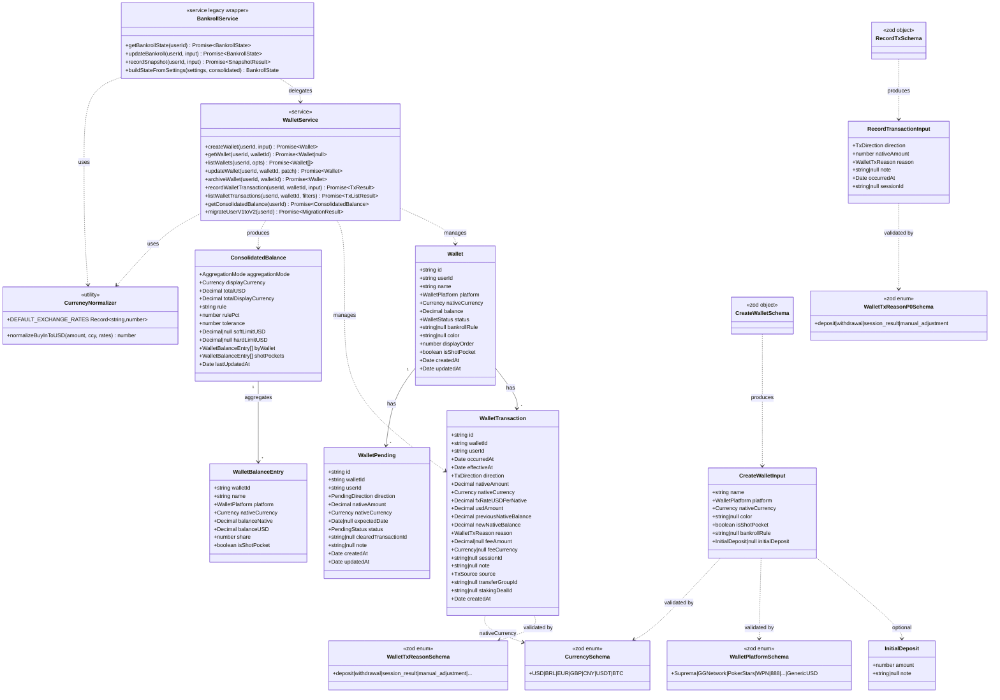

# Bankroll v2 — Class Diagram

**Sprint:** Bankroll-2 (Multi-Wallet Foundation)
**ADRs:** ADR-033, ADR-034, ADR-035
**Data:** 2026-04-25

Diagrama de classes Mermaid mostrando interfaces TypeScript principais, service classes e schemas Zod do Bankroll v2.

---

## Diagrama (Mermaid)



---

## Tipos TypeScript

### Wallet
```typescript
interface Wallet {
  id: string;
  userId: string;
  name: string;
  platform: WalletPlatform;
  nativeCurrency: Currency;
  balance: Decimal;            // moeda nativa
  status: 'active' | 'archived';
  bankrollRule: string | null;
  color: string | null;
  displayOrder: number;
  isShotPocket: boolean;
  createdAt: Date;
  updatedAt: Date;
}
```

### WalletTransaction
```typescript
interface WalletTransaction {
  id: string;
  walletId: string;
  userId: string;
  occurredAt: Date;
  effectiveAt: Date;           // = occurredAt em P0
  direction: 'in' | 'out';
  nativeAmount: Decimal;
  nativeCurrency: Currency;
  fxRateUSDPerNative: Decimal; // IMUTAVEL pos-insert
  usdAmount: Decimal;          // = nativeAmount / fxRateUSDPerNative
  previousNativeBalance: Decimal;
  newNativeBalance: Decimal;
  reason: WalletTxReason;
  feeAmount: Decimal | null;
  feeCurrency: Currency | null;
  sessionId: string | null;
  note: string | null;
  source: 'manual' | 'auto_session' | 'migration_v1' | 'auto_import_csv';
  transferGroupId: string | null;
  stakingDealId: string | null;
  createdAt: Date;
}
```

### WalletPending (reservada — sem comportamento P0)
```typescript
interface WalletPending {
  id: string;
  walletId: string;
  userId: string;
  direction: 'withdrawal_pending' | 'deposit_pending';
  nativeAmount: Decimal;
  nativeCurrency: Currency;
  expectedDate: Date | null;
  status: 'pending' | 'cleared' | 'cancelled';
  clearedTransactionId: string | null;
  note: string | null;
  createdAt: Date;
  updatedAt: Date;
}
```

### ConsolidatedBalance
```typescript
interface ConsolidatedBalance {
  aggregationMode: 'global' | 'per_wallet';
  displayCurrency: Currency;
  totalUSD: Decimal;
  totalDisplayCurrency: Decimal;
  rule: string;                // '1pct' | '2pct' | '5pct' | 'custom:X'
  rulePct: number;
  tolerance: number;           // 1.5 hardcoded ADR-018
  softLimitUSD: Decimal | null;  // null em mode per_wallet
  hardLimitUSD: Decimal | null;
  byWallet: WalletBalanceEntry[];
  shotPockets: WalletBalanceEntry[];
  lastUpdatedAt: Date;
}

interface WalletBalanceEntry {
  walletId: string;
  name: string;
  platform: WalletPlatform;
  nativeCurrency: Currency;
  balanceNative: Decimal;
  balanceUSD: Decimal;
  share: number;               // balanceUSD / totalUSD (4 casas)
  isShotPocket: boolean;
}
```

### Inputs
```typescript
interface CreateWalletInput {
  name: string;                // 1-80 chars trimmed
  platform: WalletPlatform;
  nativeCurrency: Currency;
  color: string | null;        // hex #RRGGBB
  isShotPocket: boolean;
  bankrollRule: string | null;
  initialDeposit: InitialDeposit | null;
}

interface InitialDeposit {
  amount: number;              // > 0
  note: string | null;
}

interface RecordTransactionInput {
  direction: 'in' | 'out';
  nativeAmount: number;        // > 0
  reason: WalletTxReasonP0;    // P0: 4 valores
  note: string | null;         // max 500 chars
  occurredAt: Date;
  sessionId: string | null;    // se reason='session_result', deve ser valido
}
```

---

## Schemas Zod (`shared/schemas/wallets.ts`)

```typescript
import { z } from 'zod';
import { WALLET_PLATFORMS, WALLET_TX_REASONS, WALLET_TX_REASONS_P0 } from './wallet-constants';

export const WalletPlatformSchema = z.enum(WALLET_PLATFORMS);
export const CurrencySchema = z.enum(['USD', 'BRL', 'EUR', 'GBP', 'CNY', 'USDT', 'BTC']);
export const WalletTxReasonSchema = z.enum(WALLET_TX_REASONS);
export const WalletTxReasonP0Schema = z.enum(WALLET_TX_REASONS_P0);
export const TxDirectionSchema = z.enum(['in', 'out']);
export const WalletStatusSchema = z.enum(['active', 'archived']);
export const AggregationModeSchema = z.enum(['global', 'per_wallet']);
export const TxSourceSchema = z.enum(['manual', 'auto_session', 'migration_v1', 'auto_import_csv']);

export const BankrollRuleSchema = z
  .string()
  .regex(/^(1pct|2pct|5pct|custom:\d+(\.\d+)?)$/)
  .nullable();

export const ColorHexSchema = z
  .string()
  .regex(/^#[0-9A-Fa-f]{6}$/)
  .nullable();

export const InitialDepositSchema = z.object({
  amount: z.number().positive(),
  note: z.string().max(500).nullable().optional(),
});

export const CreateWalletSchema = z.object({
  name: z.string().trim().min(1).max(80),
  platform: WalletPlatformSchema,
  nativeCurrency: CurrencySchema,
  color: ColorHexSchema.optional(),
  isShotPocket: z.boolean().default(false),
  bankrollRule: BankrollRuleSchema.optional(),
  initialDeposit: InitialDepositSchema.nullable().optional(),
});

export const UpdateWalletSchema = z.object({
  name: z.string().trim().min(1).max(80).optional(),
  color: ColorHexSchema.optional(),
  displayOrder: z.number().int().min(0).optional(),
  bankrollRule: BankrollRuleSchema.optional(),
  isShotPocket: z.boolean().optional(),
});

export const RecordTxSchema = z.object({
  direction: TxDirectionSchema,
  nativeAmount: z.number().positive(),
  reason: WalletTxReasonP0Schema,
  note: z.string().max(500).nullable().optional(),
  occurredAt: z.coerce.date(),
  sessionId: z.string().nullable().optional(),
});

export const ListTxQuerySchema = z.object({
  limit: z.coerce.number().int().min(1).max(200).default(50),
  offset: z.coerce.number().int().min(0).default(0),
  from: z.coerce.date().optional(),
  to: z.coerce.date().optional(),
  reason: z.string().optional(), // csv -> split(',') validado contra enum
});
```

---

## Constantes (`shared/wallet-platforms.ts`, `shared/wallet-reasons.ts`)

```typescript
// shared/wallet-platforms.ts
export const WALLET_PLATFORMS = [
  'Suprema', 'GGNetwork', 'PokerStars', 'WPN', '888', 'PartyPoker',
  'CoinPoker', 'Chico', 'Revolution', 'iPoker',
  'OffPlatform_Bank', 'OffPlatform_Crypto', 'OffPlatform_Staker', 'OffPlatform_Other',
  'GenericUSD',  // reservado para migration v1->v2
] as const;
export type WalletPlatform = typeof WALLET_PLATFORMS[number];

// shared/wallet-reasons.ts
export const WALLET_TX_REASONS = [
  'deposit', 'withdrawal', 'session_result', 'manual_adjustment',
  'transfer_in', 'transfer_out', 'fee', 'fx_adjustment',          // P1
  'staking_payout', 'staking_buyin', 'makeup_clear',              // Sprint Bankroll-3
] as const;
export type WalletTxReason = typeof WALLET_TX_REASONS[number];

export const WALLET_TX_REASONS_P0 = [
  'deposit', 'withdrawal', 'session_result', 'manual_adjustment',
] as const;
export type WalletTxReasonP0 = typeof WALLET_TX_REASONS_P0[number];
```

---

## Service Interfaces

```typescript
// server/services/walletService.ts
export interface WalletService {
  // CRUD
  createWallet(userId: string, input: CreateWalletInput): Promise<Wallet>;
  getWallet(userId: string, walletId: string): Promise<Wallet | null>;
  listWallets(userId: string, opts?: { includeArchived?: boolean }): Promise<Wallet[]>;
  updateWallet(userId: string, walletId: string, patch: UpdateWalletInput): Promise<Wallet>;
  archiveWallet(userId: string, walletId: string): Promise<{ wallet: Wallet; warning: string | null }>;

  // Transactions
  recordWalletTransaction(
    userId: string,
    walletId: string,
    input: RecordTransactionInput,
  ): Promise<{ transaction: WalletTransaction; wallet: Wallet; warning: string | null }>;

  listWalletTransactions(
    userId: string,
    walletId: string,
    filters: ListTxFilters,
  ): Promise<{ transactions: WalletTransaction[]; pagination: PaginationMeta; summary: TxSummary }>;

  // Aggregation
  getConsolidatedBalance(userId: string): Promise<ConsolidatedBalance>;

  // Migration
  migrateUserV1toV2(userId: string): Promise<{ created: boolean; walletId?: string; snapshotsBackfilled?: number }>;
}
```

---

## Invariantes (validados por testes)

1. **Espelho de balance:** `wallet.balance == wallet_transactions[ultima].newNativeBalance` por walletId.
2. **Ledger continuo:** `tx[N+1].previousNativeBalance == tx[N].newNativeBalance` por walletId ordenado por occurredAt.
3. **FX imutavel:** UPDATE em `wallet_transactions.fxRateUSDPerNative` sempre rejeitado.
4. **Atomicidade:** insert de tx + update de wallet sempre em mesma transacao.
5. **USD identidade:** `nativeCurrency='USD' => fxRateUSDPerNative=1.0`.
6. **Soma de share:** `sum(byWallet[].share) == 1.0` em mode global, exceto shot pockets.
7. **Idempotencia migration:** `migrateUserV1toV2` retorna `{created: false}` na 2a chamada.

---

## Referencias

- ADRs: `Docs/architecture/decisions/{033,034,035}-*.md`.
- Spec: `Docs/specs/bankroll-v2-multi-wallet-foundation.md`.
- Data model ER: `Docs/architecture/data-model/bankroll-v2.md`.
- C4 component: `Docs/architecture/c4/component-bankroll.md`.
- Fluxos: `Docs/architecture/flows/bankroll-multi-wallet.md`.
