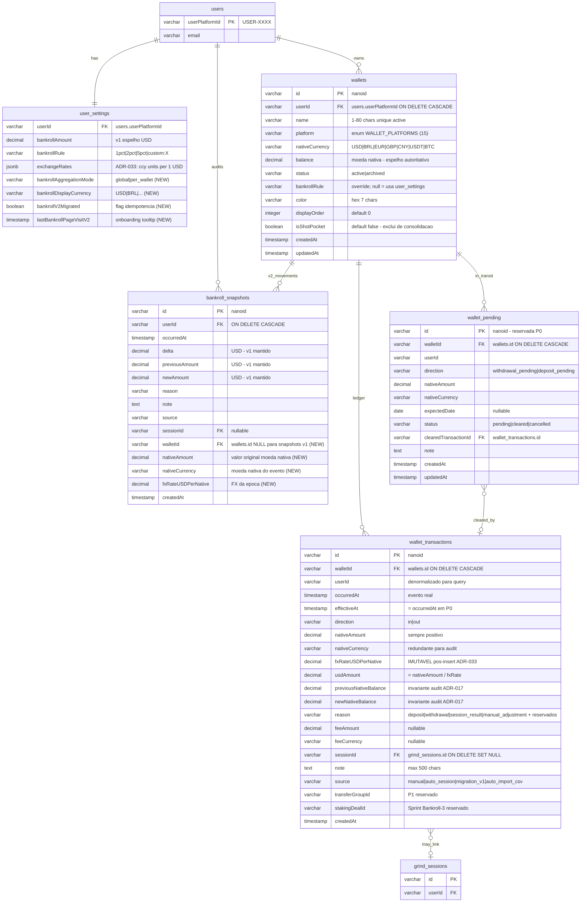

# Bankroll v2 — Modelo de Dados (ER)

**Sprint:** Bankroll-2 (Multi-Wallet Foundation)
**ADRs relacionados:** ADR-033, ADR-034, ADR-035
**Data:** 2026-04-25

Este documento descreve o modelo entidade-relacionamento do Bankroll v2: as 3 tabelas novas (`wallets`, `wallet_transactions`, `wallet_pending`) e as modificacoes em tabelas existentes (`bankroll_snapshots`, `user_settings`).

---

## Diagrama ER (Mermaid)



---

## Tabelas Novas

### `wallets`

Estado autoritativo de cada carteira do usuario.

| Coluna | Tipo | NULL | Default | Notas |
|---|---|---|---|---|
| `id` | varchar | NO | nanoid | PK |
| `userId` | varchar | NO | — | FK `users.userPlatformId` ON DELETE CASCADE |
| `name` | varchar(80) | NO | — | Trim; unique entre wallets ATIVAS por user |
| `platform` | varchar | NO | — | enum `WALLET_PLATFORMS` (15 valores) |
| `nativeCurrency` | varchar(8) | NO | — | `USD\|BRL\|EUR\|GBP\|CNY\|USDT\|BTC` |
| `balance` | decimal | NO | `0` | ESPELHO autoritativo do ultimo `wallet_transactions.newNativeBalance` |
| `status` | varchar | NO | `'active'` | `active\|archived` |
| `bankrollRule` | varchar | YES | NULL | Override do default global (`user_settings.bankrollRule`) |
| `color` | varchar(7) | YES | NULL | Hex (#RRGGBB) opcional UI |
| `displayOrder` | integer | NO | `0` | Posicao na lista UI |
| `isShotPocket` | boolean | NO | `false` | `true` exclui do calculo de banca core |
| `createdAt` | timestamp | NO | NOW() | |
| `updatedAt` | timestamp | NO | NOW() | |

**Indices:**
- `idx_wallets_user_status (userId, status)`
- `idx_wallets_user_platform (userId, platform)`
- `uq_wallets_user_name_active (userId, name) WHERE status='active'` (unique parcial)

**Regras de integridade:**
- `name` minimo 1 char, maximo 80; trim antes de salvar.
- `balance` nunca atualizado fora de uma transacao com `wallet_transactions`.
- `status='archived'` impede insert em `wallet_transactions` (recusa 409 no service).
- Hard limit 50 wallets por usuario (validacao no service); warning em 20.
- `platform='GenericUSD'` reservado para migration v1->v2 (ADR-035).

---

### `wallet_transactions`

Ledger imutavel por wallet. Cada movimento e linha; FX no momento da transacao e CONGELADO.

| Coluna | Tipo | NULL | Default | Notas |
|---|---|---|---|---|
| `id` | varchar | NO | nanoid | PK |
| `walletId` | varchar | NO | — | FK `wallets.id` ON DELETE CASCADE |
| `userId` | varchar | NO | — | denormalizado para query rapida |
| `occurredAt` | timestamp | NO | — | Quando o evento aconteceu na vida real |
| `effectiveAt` | timestamp | NO | — | = `occurredAt` no P0 (preparado para pending tx) |
| `direction` | varchar | NO | — | `in\|out` |
| `nativeAmount` | decimal | NO | — | Sempre positivo (`direction` define sinal) |
| `nativeCurrency` | varchar(8) | NO | — | Redundante com `wallets.nativeCurrency` (audit) |
| `fxRateUSDPerNative` | decimal | NO | — | IMUTAVEL pos-insert. ADR-033: ccy units per 1 USD |
| `usdAmount` | decimal | NO | — | = `nativeAmount / fxRateUSDPerNative` (cache) |
| `previousNativeBalance` | decimal | NO | — | Invariante ADR-017 |
| `newNativeBalance` | decimal | NO | — | Invariante ADR-017 |
| `reason` | varchar | NO | — | enum `WALLET_TX_REASONS` (P0 + reservados) |
| `feeAmount` | decimal | YES | NULL | Custo extra registrado junto |
| `feeCurrency` | varchar(8) | YES | NULL | Moeda do fee |
| `sessionId` | varchar | YES | NULL | FK `grind_sessions.id` ON DELETE SET NULL |
| `note` | text | YES | NULL | Max 500 chars |
| `source` | varchar | NO | `'manual'` | `manual\|auto_session\|migration_v1\|auto_import_csv` |
| `transferGroupId` | varchar | YES | NULL | P1 (transferencia cross-wallet) |
| `stakingDealId` | varchar | YES | NULL | Sprint Bankroll-3 |
| `createdAt` | timestamp | NO | NOW() | |

**Indices:**
- `idx_wtx_wallet_occurred (walletId, occurredAt)` — query de history paginada
- `idx_wtx_user_reason (userId, reason)` — summary por tipo
- `idx_wtx_user_occurred (userId, occurredAt)` — query global
- `idx_wtx_transfer_group (transferGroupId)` — junta transferencias

**Invariantes:**
1. `wallet_transactions[N+1].previousNativeBalance == wallet_transactions[N].newNativeBalance` por walletId ordenado por occurredAt (ADR-017 transposta).
2. `fxRateUSDPerNative` IMUTAVEL apos insert (validacao service-layer).
3. Para `nativeCurrency='USD'`, `fxRateUSDPerNative = 1.0`.
4. Insert SEMPRE em transacao com SELECT FOR UPDATE da wallet + UPDATE balance + INSERT tx.
5. Recusa em wallet `archived` (409 Conflict).
6. `occurredAt` nao no futuro; nao anterior ao `occurredAt` da ultima tx (proteger ordem temporal — MED-6 do plano).

**Reasons P0:** `deposit, withdrawal, session_result, manual_adjustment`.
**Reasons reservados (recusados em P0):** `transfer_in, transfer_out, fee, fx_adjustment, staking_payout, staking_buyin, makeup_clear`.

---

### `wallet_pending` (reservada — sem comportamento P0)

Modela dinheiro em transito. Tabela criada com estrutura final mas **insert/list bloqueados em P0** (rejeicao no service-layer). Spec futura ativa.

| Coluna | Tipo | NULL | Default | Notas |
|---|---|---|---|---|
| `id` | varchar | NO | nanoid | PK |
| `walletId` | varchar | NO | — | FK `wallets.id` ON DELETE CASCADE |
| `userId` | varchar | NO | — | denormalizado |
| `direction` | varchar | NO | — | `withdrawal_pending\|deposit_pending` |
| `nativeAmount` | decimal | NO | — | Sempre positivo |
| `nativeCurrency` | varchar(8) | NO | — | Moeda nativa |
| `expectedDate` | date | YES | NULL | "Deve cair ate dia X" |
| `status` | varchar | NO | `'pending'` | `pending\|cleared\|cancelled` |
| `clearedTransactionId` | varchar | YES | NULL | FK `wallet_transactions.id` quando cleared |
| `note` | text | YES | NULL | |
| `createdAt` | timestamp | NO | NOW() | |
| `updatedAt` | timestamp | NO | NOW() | |

**Indices (quando ativa em sprint futuro):**
- `idx_wpd_wallet_status (walletId, status)`
- `idx_wpd_user_status (userId, status)`

---

## Tabelas Modificadas

### `bankroll_snapshots` — 4 colunas adicionais (nullable)

| Coluna | Tipo | NULL | Notas |
|---|---|---|---|
| `walletId` | varchar | YES | NULL para snapshots pre-v2; backfilled pela migration (ADR-035) |
| `nativeAmount` | decimal | YES | Valor original na moeda nativa (NULL para snapshots v1) |
| `nativeCurrency` | varchar(8) | YES | Moeda nativa do evento |
| `fxRateUSDPerNative` | decimal | YES | FX da epoca (NULL para snapshots v1) |

**Indice adicional:** `idx_bankroll_snapshots_wallet (walletId)`.

**Comportamento:**
- Snapshots pre-v2 ficam com 4 colunas NULL (preservacao integral do audit trail v1).
- Snapshots criados pela migration (ADR-035) recebem `walletId` da default wallet via UPDATE retroativo.
- Snapshots criados em V2 a partir de `wallet_transactions` replicam os 4 campos para auditoria global.

---

### `user_settings` — 3 colunas adicionais

| Coluna | Tipo | NULL | Default | Notas |
|---|---|---|---|---|
| `bankrollAggregationMode` | varchar | NO | `'global'` | `global\|per_wallet` |
| `bankrollDisplayCurrency` | varchar(8) | NO | `'USD'` | `USD\|BRL\|...` (P0 suporta USD/BRL) |
| `bankrollV2Migrated` | boolean | NO | `false` | Flag idempotencia da migration (ADR-035) |
| `lastBankrollPageVisitV2` | timestamp | YES | NULL | Onboarding tooltip pos-migration |

**Comportamento:**
- Default `global` preserva mental model do v1 (banca consolidada em USD).
- Modo `per_wallet` aceita ser SETADO em P0, mas Tournament Selector continua filtrando por `consolidatedUSD` global (mode `per_wallet` no Selector vira spec separada).
- `bankrollAmount` v1 mantido como espelho autoritativo (atualizado pelo `walletService` em modo single-wallet).

---

## Constantes e Enums

### `WALLET_PLATFORMS` (15 valores)

```
"Suprema", "GGNetwork", "PokerStars", "WPN", "888", "PartyPoker",
"CoinPoker", "Chico", "Revolution", "iPoker",
"OffPlatform_Bank", "OffPlatform_Crypto", "OffPlatform_Staker", "OffPlatform_Other",
"GenericUSD"  // reservado para migration v1->v2
```

### `WALLET_TX_REASONS`

```
P0:        "deposit", "withdrawal", "session_result", "manual_adjustment"
P1:        "transfer_in", "transfer_out", "fee", "fx_adjustment"
Sprint-3:  "staking_payout", "staking_buyin", "makeup_clear"
```

### Moedas suportadas (alinhadas com `DEFAULT_EXCHANGE_RATES`)

```
USD: 1.0
BRL: 5.0
EUR: 0.92
GBP: 0.78
CNY: 7.20
USDT: 1.0
BTC: 0.000015
```

(Convencao ADR-033: rates[ccy] = ccy units per 1 USD)

---

## Cardinalidades

| Origem | Destino | Cardinalidade | Comportamento ON DELETE |
|---|---|---|---|
| `users` | `user_settings` | 1:1 | CASCADE |
| `users` | `wallets` | 1:N | CASCADE |
| `users` | `bankroll_snapshots` | 1:N | CASCADE |
| `wallets` | `wallet_transactions` | 1:N | CASCADE |
| `wallets` | `wallet_pending` | 1:N | CASCADE |
| `wallets` | `bankroll_snapshots` | 1:N (parcial) | nao define — `walletId` nullable |
| `wallet_transactions` | `grind_sessions` | N:0/1 | SET NULL |
| `wallet_pending` | `wallet_transactions` | 1:0/1 | nao define — `clearedTransactionId` nullable |

---

## Detector SQL de Inconsistencia

### Drift de espelho `wallet.balance`

```sql
SELECT w.id, w.balance, last_tx.newNativeBalance
FROM wallets w
LEFT JOIN LATERAL (
  SELECT newNativeBalance
  FROM wallet_transactions
  WHERE walletId = w.id
  ORDER BY occurredAt DESC
  LIMIT 1
) last_tx ON true
WHERE last_tx.newNativeBalance IS NOT NULL
  AND ABS(w.balance - last_tx.newNativeBalance) > 0.01;
```
Esperado: 0 rows. Se >0, drift entre espelho e ledger.

### Drift de invariante de ledger

```sql
SELECT walletId, occurredAt, previousNativeBalance, prev_newNativeBalance
FROM (
  SELECT walletId, occurredAt, previousNativeBalance,
         LAG(newNativeBalance) OVER (PARTITION BY walletId ORDER BY occurredAt) AS prev_newNativeBalance
  FROM wallet_transactions
) t
WHERE prev_newNativeBalance IS NOT NULL
  AND ABS(previousNativeBalance - prev_newNativeBalance) > 0.01;
```
Esperado: 0 rows. Se >0, ledger perdeu integridade.

### Drift `userSettings.bankrollAmount` vs sum(wallets.balance)

```sql
SELECT us.userId, us.bankrollAmount, COALESCE(SUM(w.balance), 0) AS sumWallets
FROM user_settings us
LEFT JOIN wallets w ON w.userId = us.userId AND w.status='active' AND w.isShotPocket=false
WHERE us.bankrollV2Migrated = true
GROUP BY us.userId, us.bankrollAmount
HAVING ABS(us.bankrollAmount - COALESCE(SUM(w.balance), 0)) > 0.01;
```
(Em modo `global`; em modo `per_wallet` o invariante e diferente.)

---

## Referencias

- ADR-033: convencao FX `units per 1 USD`.
- ADR-034: modelo multi-wallet com FX historico imutavel.
- ADR-035: compatibilidade v1->v2 e migracao de snapshots.
- Spec: `Docs/specs/bankroll-v2-multi-wallet-foundation.md`.
- Plano estrategico: `Docs/strategy/bankroll-v2-plan-2026-04-25.md`, secao 4.
- C4 component: `Docs/architecture/c4/component-bankroll.md`.
- Class diagram: `Docs/architecture/data-model/bankroll-v2-classes.md`.
- Fluxos: `Docs/architecture/flows/bankroll-multi-wallet.md`.
