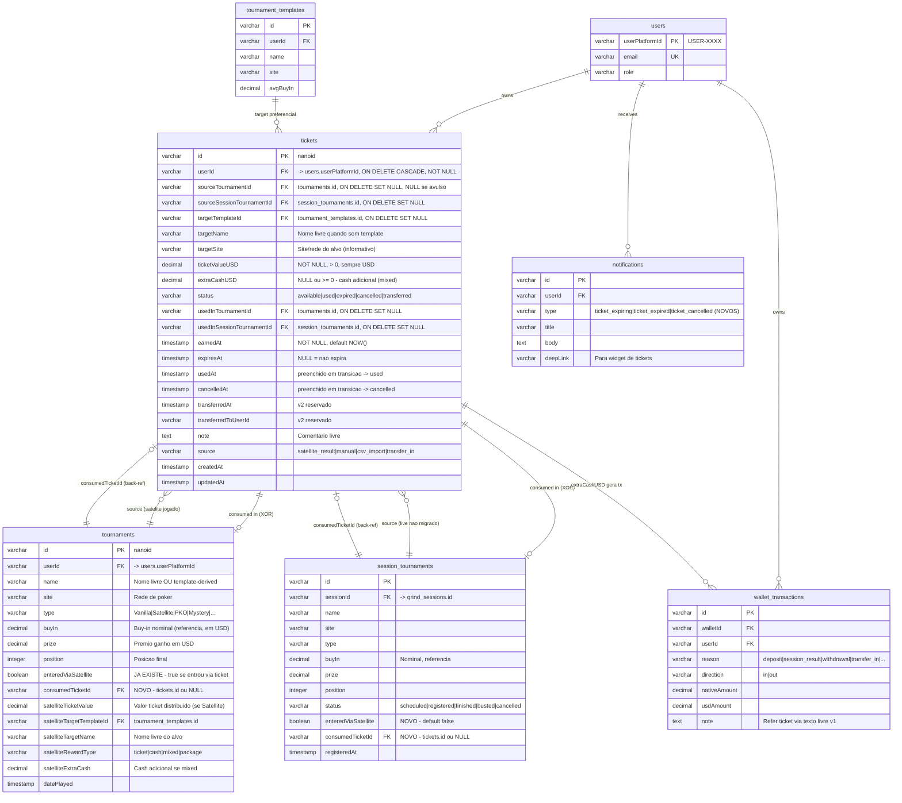

# Data Model: Tickets de Satelite

Documenta o modelo de dados da feature de Gestao de Tickets de Torneios Satelite (spec: `docs/specs/satellite-tickets-management.md`).

Inclui:
- Tabela nova `tickets` (RF-01).
- Alteracoes em `session_tournaments` e `tournaments` para suportar consumo de ticket.
- Indices criticos.
- Constraints (XOR, unicidade, integridade).

---

## Diagrama ER



---

## Tabela `tickets` — detalhamento

### Colunas

| Coluna | Tipo | Constraint | Default | Descricao |
|---|---|---|---|---|
| `id` | varchar(21) | PK, NOT NULL | `nanoid()` | ID unico do ticket |
| `userId` | varchar(20) | FK -> `users.userPlatformId`, NOT NULL, ON DELETE CASCADE | — | Dono do ticket |
| `sourceTournamentId` | varchar(21) | FK -> `tournaments.id`, ON DELETE SET NULL | NULL | Torneio satelite jogado que originou o ticket. NULL se ticket avulso (manual) |
| `sourceSessionTournamentId` | varchar(21) | FK -> `session_tournaments.id`, ON DELETE SET NULL | NULL | Source quando ticket nasce no live (antes de migrar para `tournaments`) |
| `targetTemplateId` | varchar(21) | FK -> `tournament_templates.id`, ON DELETE SET NULL | NULL | Torneio alvo (preferencial, permite agrupar e match forte) |
| `targetName` | varchar(255) | NULL | NULL | Nome livre do torneio alvo (quando sem template) |
| `targetSite` | varchar(64) | NULL | NULL | Site/rede do alvo (informativo, ajuda match medio) |
| `ticketValueUSD` | decimal(10,2) | NOT NULL, CHECK (`ticketValueUSD > 0`) | — | Sempre em USD. Conversao via `currencyNormalizer` na origem |
| `extraCashUSD` | decimal(10,2) | NULL, CHECK (`extraCashUSD >= 0`) | NULL | Cash adicional (rewardType=mixed). Gera `wallet_transactions` |
| `status` | varchar(16) | NOT NULL | `'available'` | `available` \| `used` \| `expired` \| `cancelled` \| `transferred` |
| `usedInTournamentId` | varchar(21) | FK -> `tournaments.id`, ON DELETE SET NULL | NULL | Onde foi consumido (caminho tournaments) |
| `usedInSessionTournamentId` | varchar(21) | FK -> `session_tournaments.id`, ON DELETE SET NULL | NULL | Onde foi consumido (caminho session_tournaments — live ainda nao migrado) |
| `earnedAt` | timestamp | NOT NULL | `NOW()` | Quando entrou no inventario |
| `expiresAt` | timestamp | NULL | NULL | NULL = nao expira |
| `usedAt` | timestamp | NULL | NULL | Preenchido em transicao -> `used` |
| `cancelledAt` | timestamp | NULL | NULL | Preenchido em transicao -> `cancelled` |
| `transferredAt` | timestamp | NULL | NULL | Reservado v2 |
| `transferredToUserId` | varchar(20) | NULL | NULL | Reservado v2 |
| `note` | text | NULL | NULL | Comentario livre. Em v1, package details vao aqui |
| `source` | varchar(24) | NOT NULL | `'manual'` | `satellite_result` \| `manual` \| `csv_import` (v2) \| `transfer_in` (v2) |
| `createdAt` | timestamp | NOT NULL | `NOW()` | Auditoria |
| `updatedAt` | timestamp | NOT NULL | `NOW()` | Auditoria |

### Indices propostos

| Indice | Colunas | Justificativa (query critica) |
|---|---|---|
| `idx_tickets_user_status` | `(userId, status)` | "Meus tickets ativos" — query mais frequente (RF-04 widget). Selectivity alta (status='available' costuma ser <10% da tabela total quando o sistema amadurecer). |
| `idx_tickets_user_target_template` | `(userId, targetTemplateId)` | Match forte no `RegisterPaymentDialog` (RF-05) e Tournament Selector boost (RF-07). Quase sempre filtra por status=available no plan, mas templateId discrimina mais — colocar como leading column. |
| `idx_tickets_user_target_name` | `(userId, lower(targetName), lower(targetSite))` | Match medio (RF-05) — case-insensitive, exige indice funcional ou colunas geradas. PostgreSQL aceita `CREATE INDEX ... ON tickets (userId, lower(targetName), lower(targetSite))`. |
| `idx_tickets_user_expires` | `(userId, expiresAt) WHERE status='available'` | Cron de expiracao (RF-09) e ordenacao do widget por expiresAt ASC NULLS LAST. Indice parcial reduz tamanho — so tickets ativos importam para expiracao. |
| `idx_tickets_source_tournament` | `(sourceTournamentId)` WHERE `sourceTournamentId IS NOT NULL` | Audit reverso: "que tickets este satelite gerou". Indice parcial pula avulsos. |
| `idx_tickets_used_in_tournament` | `(usedInTournamentId)` WHERE `usedInTournamentId IS NOT NULL` | Audit reverso: "que ticket foi usado neste torneio". |

### Constraints (Zod refinement + DB-level quando aplicavel)

#### Z1 — Pelo menos um target

```
targetTemplateId IS NOT NULL OR targetName IS NOT NULL
```

Validado em `insertTicketSchema.refine(...)`. **Nao** existe CHECK no DB porque torneio alvo deletado pode setar `targetTemplateId=NULL` legitimamente (deixando o ticket "orfao" mas com `targetName` ainda preservado se foi setado na criacao). DB-level constraint quebraria SET NULL flow.

#### Z2 — Status=used exige caminho de consumo (XOR)

```
status='used' IMPLIES (
  (usedInTournamentId IS NOT NULL AND usedInSessionTournamentId IS NULL)
  OR
  (usedInTournamentId IS NULL AND usedInSessionTournamentId IS NOT NULL)
)
AND usedAt IS NOT NULL
```

XOR estrito — nunca ambos preenchidos. Validado em Zod E em DB CHECK constraint:

```sql
CHECK (
  status <> 'used' OR (
    (usedInTournamentId IS NOT NULL)::int
    + (usedInSessionTournamentId IS NOT NULL)::int = 1
    AND usedAt IS NOT NULL
  )
)
```

Razao para enforcing tambem no DB: a transicao de live -> tournaments pode ser bug-prone. Se hook de migracao falhar e tentar deixar ambos preenchidos, DB rejeita.

#### Z3 — Status=cancelled exige cancelledAt

```
status='cancelled' IMPLIES cancelledAt IS NOT NULL
```

Validado em Zod e DB CHECK.

#### Z4 — ticketValueUSD positivo

```
ticketValueUSD > 0
```

DB CHECK + Zod `.positive()`.

#### Z5 — expiresAt logico

```
expiresAt IS NULL OR expiresAt > earnedAt
```

Zod refinement. DB CHECK opcional (postgres aceita comparacao entre colunas).

#### Z6 — Unicidade source -> ticket (RF-01 implicito)

> "1 ticket = 1 source_tournament_id quando vier de satelite jogado, NULL para manual"

```sql
CREATE UNIQUE INDEX idx_tickets_unique_source
  ON tickets (sourceTournamentId)
  WHERE sourceTournamentId IS NOT NULL AND source = 'satellite_result';
```

Indice unico parcial. Razao:
- Um satelite jogado no histórico (`tournaments` ja migrado) gera 1 ticket.
- Multiplos tickets manuais (avulsos) podem coexistir — `sourceTournamentId IS NULL`.
- `csv_import` (v2) tambem nao precisa de unicidade — pode importar 2x acidentalmente, e o sistema resolve por outro mecanismo.
- `source='satellite_result'` mais o source-id juntos garantem 1:1.

[SPEC GAP — validar com user]: **e quando o satelite distribui MULTIPLOS tickets para o mesmo player (ex.: top 3 leva package + ticket extra)?** A spec nao trata. Se isso for possivel, esse indice unico precisa ser relaxado. v1 assume 1 satelite -> 1 ticket distribuido por player.

A mesma regra para `sourceSessionTournamentId`:

```sql
CREATE UNIQUE INDEX idx_tickets_unique_source_session
  ON tickets (sourceSessionTournamentId)
  WHERE sourceSessionTournamentId IS NOT NULL AND source = 'satellite_result';
```

#### Z7 — Consistencia com source

```
source='manual' IMPLIES (sourceTournamentId IS NULL AND sourceSessionTournamentId IS NULL)
source='satellite_result' IMPLIES (sourceTournamentId IS NOT NULL OR sourceSessionTournamentId IS NOT NULL)
```

Validado em Zod. DB CHECK opcional.

---

## Alteracoes em `session_tournaments`

### Coluna nova: `enteredViaSatellite`

| Coluna | Tipo | Default | Notas |
|---|---|---|---|
| `enteredViaSatellite` | boolean | `false` | Espelha `tournaments.enteredViaSatellite`. Setado em `true` quando ticket consumido via `POST /api/tickets/:id/use` com `sessionTournamentId`. Quando `grind_sessions` finaliza e migra para `tournaments`, esse flag e copiado. |

### Coluna nova: `consumedTicketId`

| Coluna | Tipo | Default | Notas |
|---|---|---|---|
| `consumedTicketId` | varchar(21) | NULL | FK -> `tickets.id`, ON DELETE SET NULL. Permite navegar do session_tournament para o ticket consumido (audit). Se ticket for posteriormente cancelado/expired, FK preserva. |

### Migration SQL

```sql
ALTER TABLE session_tournaments
  ADD COLUMN entered_via_satellite boolean NOT NULL DEFAULT false,
  ADD COLUMN consumed_ticket_id varchar(21) REFERENCES tickets(id) ON DELETE SET NULL;

CREATE INDEX idx_session_tournaments_consumed_ticket
  ON session_tournaments (consumed_ticket_id)
  WHERE consumed_ticket_id IS NOT NULL;
```

---

## Alteracoes em `tournaments`

### Coluna ja existente: `enteredViaSatellite`

Sem mudanca de schema. Comportamento: setado em `true` quando ticket consumido via `POST /api/tickets/:id/use` com `tournamentId`.

### Coluna nova: `consumedTicketId`

| Coluna | Tipo | Default | Notas |
|---|---|---|---|
| `consumedTicketId` | varchar(21) | NULL | FK -> `tickets.id`, ON DELETE SET NULL. Mesma logica que session_tournaments. Quando session migra para tournaments, copia o valor. |

### Migration SQL

```sql
ALTER TABLE tournaments
  ADD COLUMN consumed_ticket_id varchar(21) REFERENCES tickets(id) ON DELETE SET NULL;

CREATE INDEX idx_tournaments_consumed_ticket
  ON tournaments (consumed_ticket_id)
  WHERE consumed_ticket_id IS NOT NULL;
```

---

## Alteracoes em `notifications`

Sem alteracao de schema. Apenas novos valores no campo `type`:

| `type` | Quando | Prioridade |
|---|---|---|
| `ticket_expiring` | Ticket expira em <= 48h (RF-10) | medium |
| `ticket_expired` | Ticket transitou para `expired` no cron (RF-09/RF-10) | low |
| `ticket_cancelled` | Ticket transitou para `cancelled` por torneio cancelado (RF-11) | medium |

Deep link: `/dashboard#tickets-widget` (ou rota especifica do historico).

---

## Inter-tabela: ciclo de vida de um ticket de satelite

```
1. Live: jogador joga satelite -> session_tournaments (status=registered)
2. Bust/finish do satelite: ResultDialog (RF-02) cria ticket (sourceSessionTournamentId=ST.id, status=available)
3. Eventualmente: jogador encerra grind_session -> migra session_tournaments -> tournaments
   3a. Hook de migracao: tickets.sourceSessionTournamentId -> tickets.sourceTournamentId, set sourceSessionTournamentId=NULL
   3b. Se ticket foi consumido durante a live: tickets.usedInSessionTournamentId -> tickets.usedInTournamentId, copia entered_via_satellite e consumed_ticket_id para tournaments
4. Mais tarde: jogador joga torneio alvo -> RegisterPaymentDialog (RF-05) -> POST /api/tickets/:id/use
5. Ticket vira used. Tournament/SessionTournament ganha enteredViaSatellite=true e consumedTicketId.
```

**Riscos do hook de migracao:**

- Se o hook falhar entre 3a e 3b, ticket pode ficar com `sourceSessionTournamentId` apontando para uma row deletada (ON DELETE SET NULL salva). Aceitavel — auditoria preserva targetName.
- Hook idealmente em transacao atomica com a migracao session->tournament.

---

## Constraint XOR detalhada — `usedInTournamentId` vs `usedInSessionTournamentId`

**Por que XOR e nao OR?**

Cada ticket consumido vai para EXATAMENTE UMA destas tabelas no momento do consumo. Logica:

- Se jogador consume o ticket no live (em um session_tournament que ainda nao terminou a session), gravar em `usedInSessionTournamentId`.
- Se jogador consume o ticket via tournament ja migrado (i.e., import via CSV ou edicao retroativa de historico), gravar em `usedInTournamentId`.

Quando a session termina e migra para tournaments, o hook **transfere** a referencia: `usedInSessionTournamentId -> usedInTournamentId`, **set sourceSessionTournamentId=NULL**. Logo, em qualquer momento, no maximo UM dos dois esta preenchido.

Sem XOR (i.e., aceitando ambos), surgiria ambiguidade: "este ticket foi usado 2x?" — proibido.

---

## Estado do indice unico (resumo)

| Tabela | Indice | Tipo | WHERE |
|---|---|---|---|
| tickets | idx_tickets_user_status | composto | — |
| tickets | idx_tickets_user_target_template | composto | — |
| tickets | idx_tickets_user_target_name | composto funcional | — |
| tickets | idx_tickets_user_expires | composto parcial | `status='available'` |
| tickets | idx_tickets_source_tournament | simples parcial | `sourceTournamentId IS NOT NULL` |
| tickets | idx_tickets_used_in_tournament | simples parcial | `usedInTournamentId IS NOT NULL` |
| tickets | idx_tickets_unique_source | UNIQUE parcial | `sourceTournamentId IS NOT NULL AND source='satellite_result'` |
| tickets | idx_tickets_unique_source_session | UNIQUE parcial | `sourceSessionTournamentId IS NOT NULL AND source='satellite_result'` |
| session_tournaments | idx_session_tournaments_consumed_ticket | simples parcial | `consumed_ticket_id IS NOT NULL` |
| tournaments | idx_tournaments_consumed_ticket | simples parcial | `consumed_ticket_id IS NOT NULL` |

---

## Spec gaps detectados

1. **[SPEC GAP] 1 satelite distribui multiplos tickets ao mesmo player?** Spec assume 1:1 (indice unico parcial reflete isso). Se for 1:N, relaxar `idx_tickets_unique_source*`.
2. **[SPEC GAP] Se ticket foi consumido em `usedInSessionTournamentId` e a session foi migrada, mas `consumedTicketId` em `session_tournaments` foi setado, o que acontece com esse FK quando a row de session_tournaments e deletada na migracao?** ON DELETE SET NULL seta para NULL — perde-se a referencia historica em tournaments. Solucao: hook de migracao deve copiar `consumedTicketId` para tournaments antes de deletar session_tournaments.

Ambos vao para o resumo final.
