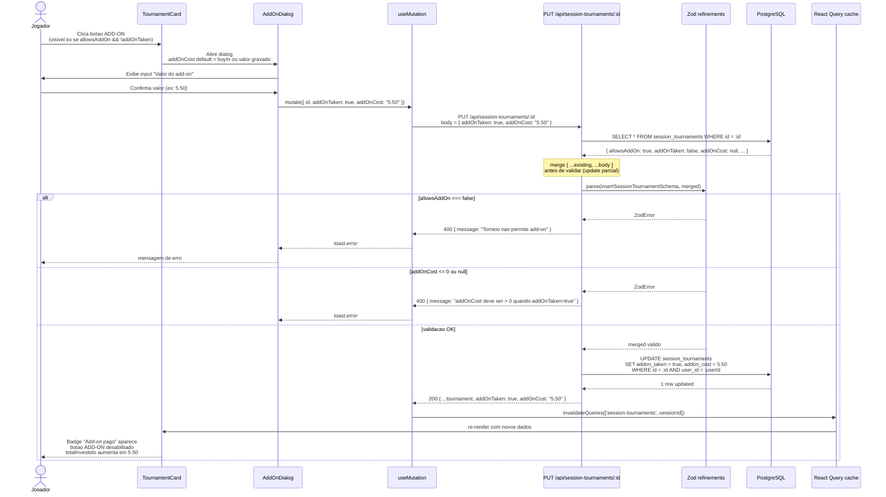
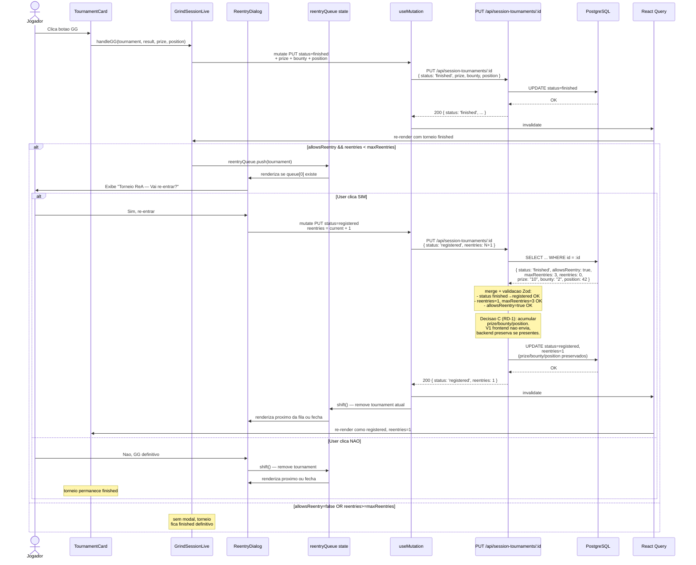
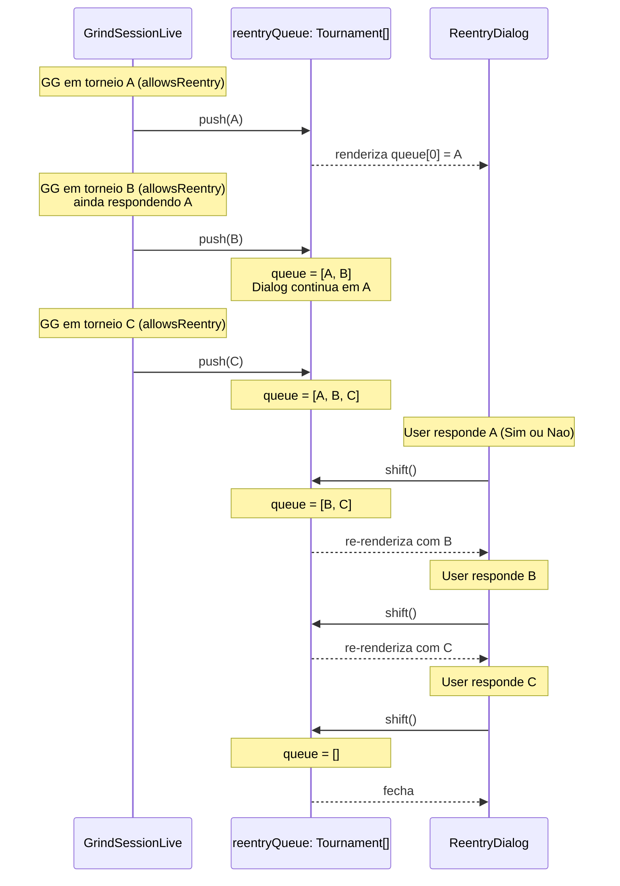
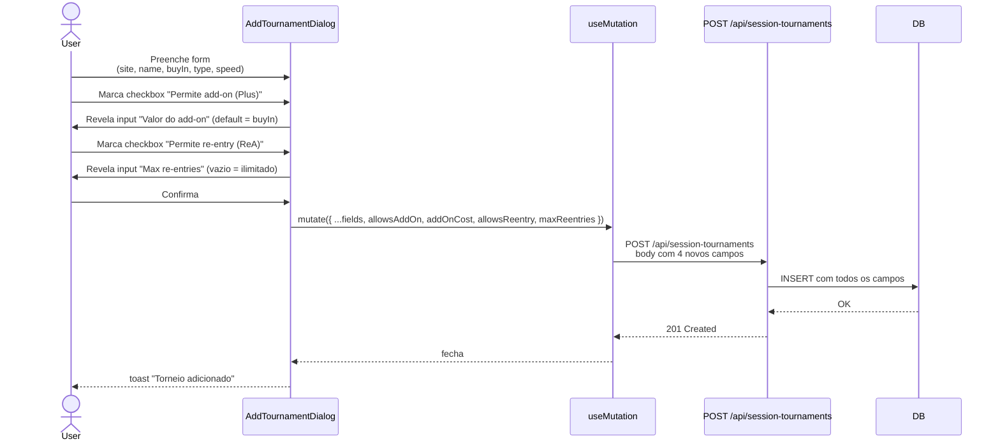

# Fluxo da feature Add-on + Re-entry (Grind Live)

Sequence diagrams dos dois fluxos de UX que a Spec 2 (add-on) e Spec 3 (re-entry) entregam. Baseados no schema do ADR-014.

Este documento e a fonte-de-verdade para o Test-Writer derivar testes de integracao (request/response, mutations, invalidation) e para o Implementer implementar handlers no `TournamentCard`, `AddTournamentDialog`, `GrindSessionLive` e rotas backend.

---

## Fluxo 1 — Add-on (Spec 2)

### Trigger

Jogador clica em **ADD-ON** no card de um torneio `registered` com `allowsAddOn=true && addOnTaken=false`.

### Pre-condicoes

- Torneio ja registrado na sessao (`status=registered`)
- `allowsAddOn == true` no torneio (via copy-on-promote do planned ou marcado direto via AddTournamentDialog)
- `addOnTaken == false` (add-on ainda nao pago)
- Usuario autenticado com JWT valido

### Diagrama de sequencia — Add-on

### Efeitos colaterais

- `calculateSessionStats` recalcula `totalInvestido` incluindo `addOnCost`
- Summary modal (ao encerrar sessao) reflete o add-on
- Snapshot da sessao ao final inclui `addOnTaken=true` para este torneio

---

## Fluxo 2 — Re-entry (Spec 3)

### Trigger

Jogador clica em **GG** no card de um torneio com `allowsReentry=true && reentries<maxReentries`.

### Pre-condicoes

- Torneio `status=registered`
- `allowsReentry == true` no torneio
- `reentries < maxReentries` (ou `maxReentries == null` = ilimitado)
- Usuario autenticado

### Diagrama de sequencia — Re-entry

### Multi-tabling — fila de modais (RD-2)

Quando multiplos GGs disparam em torneios ReA quase simultaneamente (jogador multi-tableando 4-8 mesas):

**Regra de ordenacao:** FIFO (primeiro que bustou, primeiro que aparece). Preserva decisao explicita em cada torneio.

---

## Fluxo 3 — Configuracao de flags no AddTournamentDialog (Spec 2 + 3)

Quando o jogador adiciona um torneio manualmente a sessao, o dialog permite marcar `allowsAddOn`, `allowsReentry`, `maxReentries` direto no formulario. Se vier da grade, copy-on-promote ja traz as flags.

---

## Endpoints envolvidos

| Metodo | Rota | Spec | Funcao |
|--------|------|------|--------|
| POST | `/api/session-tournaments` | 1, 2, 3 | Criar torneio na sessao (aceita 6 flags) |
| PUT | `/api/session-tournaments/:id` | 2 | Atualizar addOnTaken/addOnCost |
| PUT | `/api/session-tournaments/:id` | 3 | Mudar status finished→registered (re-entry) |
| GET | `/api/grind-sessions/:sessionId/tournaments` | 1, 2, 3 | Lista com 6 flags novas |

---

## Regras de negocio chave

1. **Copy-on-promote:** ao promover `planned_tournament` a `session_tournament` (quando jogador clica REGISTRAR vindo da grade), payload copia `allowsAddOn, addOnCost, allowsReentry, maxReentries` do planned.
2. **Add-on e 1x so:** `addOnTaken` e boolean; nunca volta a `false` depois de true (a nao ser por edicao manual no EditDialog).
3. **Re-entry cria nova "entrada" virtual:** `reentries++` e status volta a `registered`. Prize/bounty/position **acumulam** (ADR-014 RD-1). Na v1, frontend nao envia esses campos no re-entry; backend faz merge defensivo.
4. **Rebuy != Re-entry:** REBUY (stack adicional, mesma entrada) e independente. `allowsReentry=false` nao impede REBUY.
5. **Multi-tabling:** fila FIFO de modais ReA (RD-2). State `reentryQueue: Tournament[]` no GrindSessionLive.
6. **Validacao Zod cruzada:**
   - `addOnTaken=true` → `allowsAddOn=true` obrigatorio
   - `addOnTaken=true` → `addOnCost > 0` obrigatorio
   - `reentries > 0` → `allowsReentry=true` obrigatorio
   - `reentries <= maxReentries` (se maxReentries != null)
7. **Update parcial:** handler PUT faz merge `{ ...existing, ...body }` antes de validar (refinements cruzados assumem payload completo).

## Cenarios de teste derivados

### Fluxo 1 — Add-on

- [ ] Happy: clicar ADD-ON → dialog abre → confirmar valor → PUT 200 → card mostra "Add-on pago"
- [ ] Happy: totalInvestido da sessao aumenta em addOnCost apos PUT
- [ ] Happy: default addOnCost no dialog = buyIn do torneio
- [ ] Erro: PUT addOnTaken=true em torneio com allowsAddOn=false → 400
- [ ] Erro: PUT addOnTaken=true com addOnCost=null → 400
- [ ] Erro: PUT addOnTaken=true com addOnCost=0 → 400
- [ ] Edge: botao ADD-ON nao renderiza em torneio com allowsAddOn=false
- [ ] Edge: botao ADD-ON desabilitado em torneio com addOnTaken=true
- [ ] Edge: dialog aceita addOnCost > buyIn * 3 (mega add-on) sem rejeitar
- [ ] Integracao: apos add-on, summary modal no encerramento reflete o valor

### Fluxo 2 — Re-entry (single-table)

- [ ] Happy: GG em ReA com reentries=0,maxReentries=3 → modal abre
- [ ] Happy: Sim no modal → PUT status=registered, reentries=1 → card volta a registered
- [ ] Happy: Nao no modal → torneio permanece finished
- [ ] Happy: reentries=2,maxReentries=3, GG, Sim → reentries=3 (no limite)
- [ ] Happy: reentries=3,maxReentries=3 (no limite), GG → modal NAO abre (finished direto)
- [ ] Happy: maxReentries=null, reentries=10, GG → modal abre (ilimitado)
- [ ] Happy: prize da tentativa 1 = $10, apos re-entry sem prize → prize final = $10 (acumulacao)
- [ ] Happy: position tentativa 1 = 42, tentativa 2 = 3 → position final = 3 (min)
- [ ] Happy: position tentativa 1 = 42, tentativa 2 = null → position final = 42 (preserva)
- [ ] Erro: PUT status=registered em finished com allowsReentry=false → 400
- [ ] Erro: PUT reentries=5,maxReentries=3 → 400
- [ ] Erro: PUT reentries=1 em torneio allowsReentry=false → 400
- [ ] Edge: modal NAO abre para torneio com allowsReentry=false (GG vai direto para finished)
- [ ] Edge: REBUY continua funcionando independente de allowsReentry

### Fluxo 2 — Multi-tabling (fila de modais)

- [ ] Happy: 2 GGs em torneios ReA diferentes → 2 modais enfileirados (nao empilhados)
- [ ] Happy: responder modal 1 → modal 2 aparece com dados do 2o torneio
- [ ] Happy: 3 GGs seguidos → fila `[A, B, C]`, responder em ordem
- [ ] Edge: GG em torneio nao-ReA durante fila → nao adiciona a fila, torneio vai direto para finished
- [ ] Edge: fechar Live com fila pendente → torneios ficam finished (sem re-entry)

### Fluxo 3 — AddTournamentDialog

- [ ] Happy: marcar "Permite add-on" → input "Valor" aparece (default buyIn)
- [ ] Happy: marcar "Permite re-entry" → input "Max re-entries" aparece (vazio permitido)
- [ ] Happy: POST /api/session-tournaments com 6 flags → 201 Created
- [ ] Happy: vazio em "Max re-entries" → maxReentries=null no DB (ilimitado)
- [ ] Erro: addOnCost=0 com allowsAddOn=true → 400 no submit
- [ ] Erro: maxReentries negativo → 400

### Copy-on-promote

- [ ] Planned com allowsAddOn=true promove → session_tournament tem allowsAddOn=true
- [ ] Planned com maxReentries=3 promove → session_tournament tem maxReentries=3
- [ ] Planned sem flags promove → session_tournament com defaults (false/null/0)

## Referencias

- **ADR:** [014-addon-rea-modelagem](../../decisions/014-addon-rea-modelagem.md)
- **State machine:** [tournament-states.md](./tournament-states.md)
- **Specs:**
  - `docs/specs/addon-rea-schema-foundation.md` (schema + calculo)
  - `docs/specs/grind-live-addon-ux.md` (UX add-on)
  - `docs/specs/grind-live-reentry-flow.md` (UX re-entry)
- **Arquivos tocados:**
  - `client/src/components/grind-session-live/TournamentCard.tsx`
  - `client/src/components/grind-session-live/AddTournamentDialog.tsx`
  - `client/src/components/grind-session-live/AddOnDialog.tsx` (novo, Spec 2)
  - `client/src/components/grind-session-live/ReentryDialog.tsx` (novo, Spec 3)
  - `client/src/pages/GrindSessionLive.tsx` (handlers + reentryQueue state)
  - `server/routes/grind-sessions.ts:706-760` (PUT handler)
  - `shared/schema.ts` (Zod refinements)
