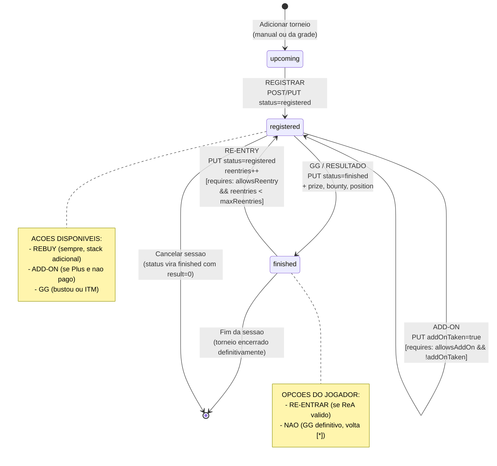

# State machine do torneio na sessao (Grind Live)

Maquina de estados de um `session_tournament` durante uma sessao ao vivo, considerando Add-on (Plus) e Re-entry (ReA) introduzidos pelo ADR-014.

Este diagrama e a fonte-de-verdade para o Test-Writer derivar testes de transicao e para o Implementer validar handlers no `GrindSessionLive.tsx` e `server/routes/grind-sessions.ts`.

## Estados

| Estado | Descricao | `status` no DB |
|--------|-----------|---------------|
| `upcoming` | Torneio planejado, ainda nao registrado. Vem da grade ou foi adicionado manualmente; jogador ainda nao clicou REGISTRAR. | `'upcoming'` |
| `registered` | Jogador inscrito, torneio ainda em jogo. Pode receber REBUY, ADD-ON, RE-ENTRY (se vier de `finished`) ou GG. | `'registered'` |
| `finished` | Torneio encerrado para este jogador (bustou ou bateu ITM). Resultado (prize, bounty, position) registrado. Pode voltar a `registered` via RE-ENTRY se `allowsReentry && reentries < maxReentries`. | `'finished'` |

> **Nota:** o status `active` existe no schema (`session_tournaments.status`) mas na implementacao atual do Live e praticamente sinonimo de `registered` (jogador registrado E jogando). Este diagrama modela como `registered` por simplicidade; o Implementer pode tratar ambos como equivalentes.

## Diagrama



## Invariantes (guardas obrigatorios)

### Add-on

```
pode_fazer_addon(t) :=
    t.status == 'registered'
    && t.allowsAddOn == true
    && t.addOnTaken == false
    && t.addOnCost != null && t.addOnCost > 0
```

- Se `allowsAddOn == false`: botao ADD-ON **nao aparece** no card.
- Se `allowsAddOn == true && addOnTaken == true`: botao aparece **desabilitado** com tooltip "Add-on ja registrado".
- Se `allowsAddOn == true && addOnCost == null`: modal abre pedindo o valor (default `buyIn`).
- Backend (Zod refinement): rejeita `addOnTaken=true` sem `allowsAddOn=true` com **400**.
- Backend (Zod refinement): rejeita `addOnTaken=true` com `addOnCost <= 0` com **400** (`addOnCost` deve ser > 0).

### Re-entry

```
pode_fazer_reentry(t) :=
    t.status == 'finished'
    && t.allowsReentry == true
    && (t.maxReentries == null || t.reentries < t.maxReentries)
```

- Se `allowsReentry == false`: ao clicar GG, o card vira `finished` direto (sem modal).
- Se `allowsReentry == true && reentries < maxReentries`: ao clicar GG, **modal de re-entry aparece** perguntando "Vai re-entrar?"
  - **Sim:** status volta a `registered`, `reentries++`. Prize/bounty/position acumulados preservados (ADR-014 RD-1).
  - **Nao:** torneio permanece `finished` definitivamente.
- Se `allowsReentry == true && reentries >= maxReentries`: ao clicar GG, card vira `finished` direto (sem modal — limite atingido).
- Backend (Zod refinement): rejeita `reentries > maxReentries` com **400**.
- Backend (Zod refinement): rejeita `reentries > 0` com `allowsReentry == false` com **400**.

### Rebuy (independente)

```
pode_fazer_rebuy(t) :=
    t.status == 'registered'
```

- Rebuy e **independente** de ReA: qualquer torneio registered aceita rebuy (stack adicional, mesma entrada). Nao incrementa `reentries`, incrementa `rebuys`.
- **Diferenca conceitual:** REBUY = mesma entrada com fichas extras; RE-ENTRY = entrada nova apos bust.
- Para torneios com `allowsReentry=true`: REBUY aparece no card (pode usar enquanto vivo); RE-ENTRY aparece so em modal apos GG.
- Para torneios com `allowsReentry=false`: apenas REBUY disponivel. Nao ha modal no GG.

## Transicoes proibidas

| De | Para | Motivo |
|----|------|--------|
| `upcoming` | `finished` diretamente | Jogador precisa passar por `registered` (ele tem que registrar antes de bustar) |
| `upcoming` | `upcoming` com `rebuys++` | Nao ha partida ainda |
| `upcoming` | `registered` com `reentries++` | Primeira entrada nao e re-entry |
| `finished` | `registered` com `reentries=0` | Transicao so permitida se reentries++ |
| `finished` | `finished` com `reentries++` | Re-entry precisa voltar para `registered` |

Todas as transicoes proibidas resultam em **400 Bad Request** no backend via refinements Zod ou lgica no handler.

## Acumulacao em re-entries (RD-1 do ADR-014)

Quando `finished → registered` via RE-ENTRY, os campos de resultado **acumulam**:

- `prize` (tentativa nova) += `prize` (tentativa anterior, ja gravado)
- `bounty` (tentativa nova) += `bounty` (tentativa anterior, ja gravado)
- `position` = `min(position_anterior, position_nova)` null-safe (melhor posicao entre todas)
- `rebuys` preservado (carrega da tentativa anterior, continua incrementando)

**V1:** frontend NAO envia prize/bounty/position no payload de re-entry. Backend e defensivo: se payload explicitamente enviar esses campos (futuro-proof), faz merge acumulativo. Ver `grind-live-reentry-flow.md` §4.3.

## Cenarios de teste derivados

### Happy paths

- [ ] `upcoming → registered` (REGISTRAR): status muda, flags Plus/ReA copiadas do planned se `fromPlannedTournament=true`
- [ ] `registered → registered` (REBUY): `rebuys++`, outras flags preservadas
- [ ] `registered → registered` (ADD-ON): `addOnTaken=true`, `addOnCost` fixado
- [ ] `registered → finished` (GG com prize): status muda, prize/position/bounty registrados
- [ ] `finished → registered` (RE-ENTRY): `reentries++`, status volta, flags preservadas, prize/bounty acumulados
- [ ] `finished → registered` (RE-ENTRY): `position = min(42, 3) = 3` apos tentativa 2 fazer melhor posicao
- [ ] `finished → [*]` (NAO RE-ENTRAR): torneio fica finished definitivo

### Guards bloqueando transicoes invalidas

- [ ] PUT `addOnTaken=true` em torneio com `allowsAddOn=false` → **400** "Torneio nao permite add-on"
- [ ] PUT `addOnTaken=true` em torneio com `allowsAddOn=true && addOnTaken=true` → **400** "Add-on ja registrado" (ou no-op 200)
- [ ] PUT `addOnTaken=true` com `addOnCost=null` → **400** "addOnCost deve ser > 0 quando addOnTaken=true"
- [ ] PUT `status=registered` vindo de `finished` em torneio com `allowsReentry=false` → **400** "Torneio nao permite re-entry"
- [ ] PUT com `reentries=3, maxReentries=2` → **400** "Excede limite de re-entradas (max 2)"
- [ ] PUT com `reentries > 0` em torneio com `allowsReentry=false` → **400**
- [ ] Transicao `upcoming → finished` pulando `registered` → **400**

### Estado UI coerente com state-machine

- [ ] Botao ADD-ON so aparece no card quando `status=registered && allowsAddOn`
- [ ] Botao ADD-ON desabilitado quando `addOnTaken=true`
- [ ] Modal RE-ENTRY so abre quando GG em `allowsReentry && reentries<maxReentries`
- [ ] Modal RE-ENTRY NAO abre quando `allowsReentry=false`
- [ ] Modal RE-ENTRY NAO abre quando `reentries >= maxReentries`
- [ ] Badge "Plus" aparece quando `allowsAddOn=true`
- [ ] Badge "ReA" aparece quando `allowsReentry=true`
- [ ] Contador "re-entry X/Y" aparece quando `allowsReentry=true`

### Multi-tabling (fila de modais — RD-2)

- [ ] Dois GGs simultaneos em torneios ReA → 2 modais enfileirados (FIFO), nao empilhados
- [ ] Responder modal 1 (Sim/Nao) dispara renderizacao do modal 2
- [ ] Refresh durante fila → fila se perde (state client-side); torneios permanecem `finished` ate jogador reagir manualmente

## Referencias

- **ADR:** [014-addon-rea-modelagem](../../decisions/014-addon-rea-modelagem.md)
- **Specs:** `docs/specs/addon-rea-schema-foundation.md`, `docs/specs/grind-live-addon-ux.md`, `docs/specs/grind-live-reentry-flow.md`
- **Arquivos tocados:** `client/src/components/grind-session-live/TournamentCard.tsx`, `client/src/pages/GrindSessionLive.tsx`, `server/routes/grind-sessions.ts:706-760`
