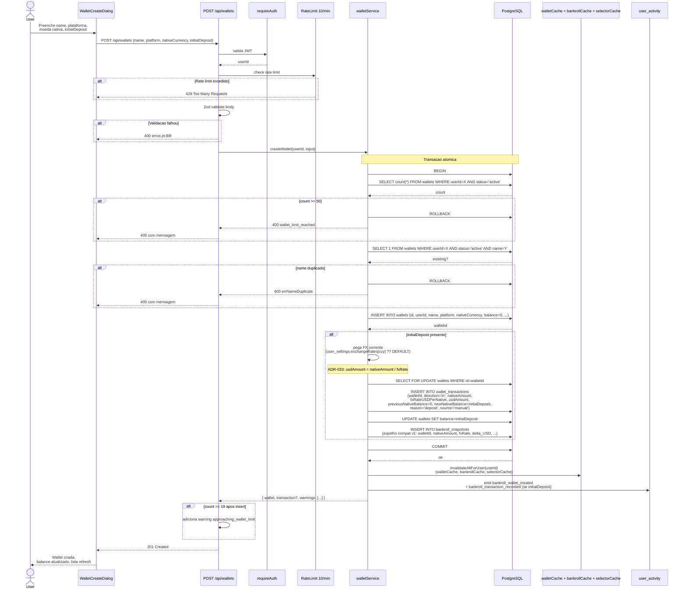
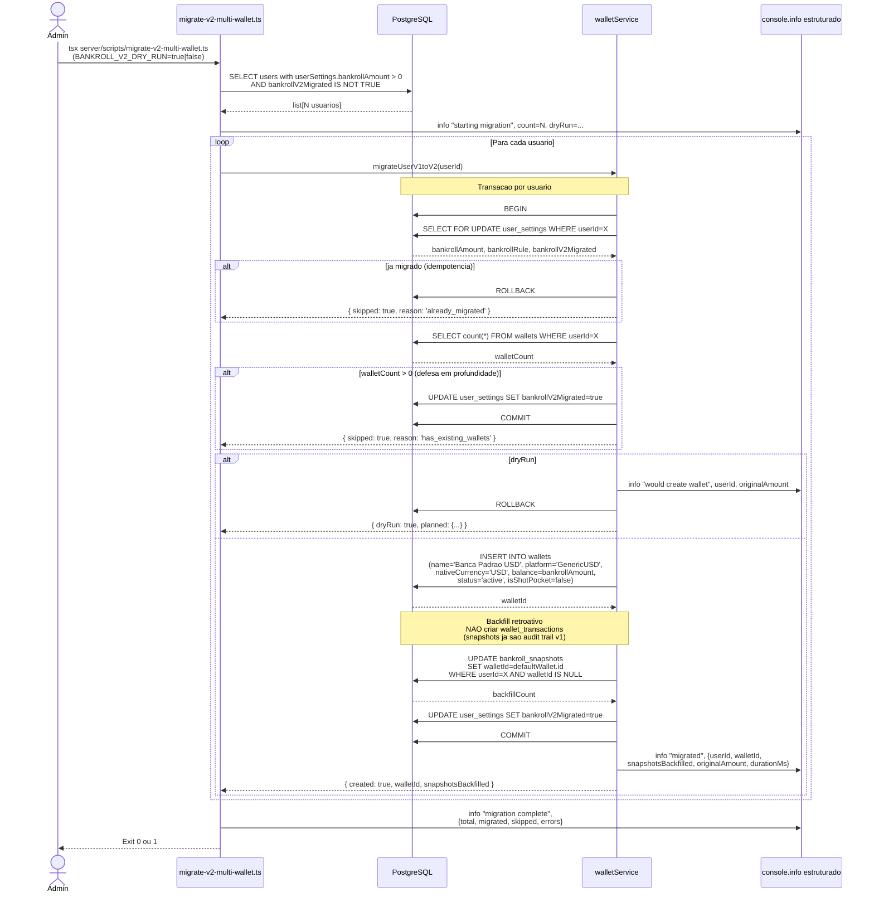
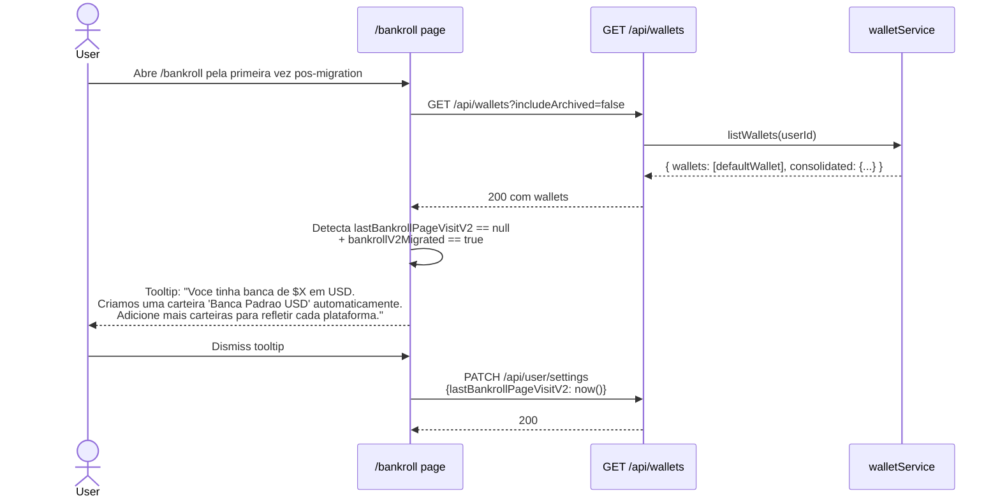
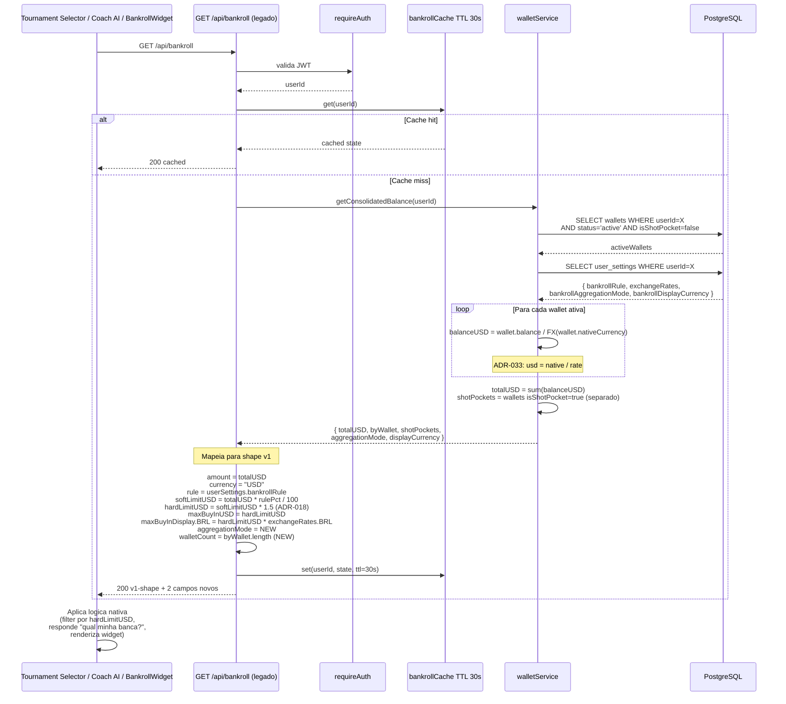

# Bankroll v2 — Fluxos Multi-Wallet

**Sprint:** Bankroll-2 (Multi-Wallet Foundation)
**ADRs:** ADR-033, ADR-034, ADR-035
**Data:** 2026-04-25

Tres fluxos sequence diagram cobrindo as interacoes criticas do Bankroll v2: criacao de wallet com primeiro deposito, migracao v1->v2 e consumo do endpoint legado por clientes existentes.

---

## Fluxo A — Criacao de wallet + primeiro deposito

**Trigger:** Usuario clica "Nova Carteira" em `/bankroll`.

**Atores:** UI → API → walletService → DB → caches → response.

**Pre-condicoes:**
- Usuario autenticado (JWT).
- Usuario tem < 50 wallets ativas (limite hard).
- Spec: RF-09 + RF-10 da `bankroll-v2-multi-wallet-foundation.md`.

**Cenarios de erro derivados:**
- Limite 50 wallets atingido → 400 `wallet_limit_reached`.
- Nome duplicado entre ativas → 400 `errNameDuplicate`.
- Plataforma invalida → 400.
- nativeCurrency invalida → 400.
- initialDeposit.amount <= 0 → 400.
- Falha em qualquer step da transacao → ROLLBACK (atomicidade).

---

## Fluxo B — Migracao v1->v2 ao primeiro acesso

**Trigger:** Script manual `tsx server/scripts/migrate-v2-multi-wallet.ts` rodado em deploy. (Alternativamente, lazy migration na primeira chamada de `GET /api/bankroll` foi REJEITADA — ver ADR-035 Opcao D.)

**Atores:** Admin → Script → walletService → DB.

**Pre-condicoes:**
- QW-1 (ADR-033) ja deployed (FX correto).
- Schema v2 ja aplicado (`db:push` rodado).
- Backup do DB feito.

**Cenarios de erro derivados:**
- Snapshots corrompidos pre-existentes → transacao rolla back para o usuario afetado; outros prosseguem; log + alerta admin.
- DB desconectado mid-run → script para; idempotencia permite re-execucao segura.
- BANKROLL_V2_DRY_RUN=true → 0 escritas; output mostra delta planejado.

**Pos-migration (UI):**

---

## Fluxo C — GET /api/bankroll legado servindo cliente v1

**Trigger:** Tournament Selector, Coach AI ou BankrollWidget chamam `GET /api/bankroll` para obter banca em USD.

**Atores:** Cliente legado (TS / Coach / Widget) → API → walletService → DB.

**Pre-condicoes:**
- Usuario migrado (`bankrollV2Migrated=true`) OU usuario novo sem wallets ainda.
- Spec: RF-11 da `bankroll-v2-multi-wallet-foundation.md`.

**Comportamento por consumidor:**

| Consumidor | Le | Comportamento |
|---|---|---|
| **Tournament Selector** | `hardLimitUSD`, `bankrollFilter` | Filtra torneios `buyInUSD > hardLimitUSD`. Cache do selector invalida em qualquer mutacao de wallet. |
| **Coach AI** | `amount`, `currency`, `rule`, `walletCount` | Tool `get_bankroll_status` responde "voce tem $X consolidados em N carteiras". |
| **BankrollWidget legado** | shape v1 completo + `walletCount` | Renderiza saldo consolidado; em v2 adiciona breakdown top 3 wallets como nota. |

**Cenarios derivados:**
- Usuario sem wallets (novo OU sem `bankrollAmount` v1) → `totalUSD=0, walletCount=0`, shape `{configured: false, ...}`.
- Usuario com 1 wallet (post-migration default) → totalUSD=balance daquela wallet.
- Usuario com 4 wallets multi-currency → totalUSD = soma convertida; byWallet com share de cada.
- Mode `per_wallet` setado → API ainda retorna `softLimitUSD`/`hardLimitUSD` em modo global (Tournament Selector P0 nao reage diferente).

---

## Cenarios de Teste Derivados (alto nivel)

### Fluxo A — Criacao + deposito
- [ ] Happy path: criar wallet com initialDeposit USD → wallet com balance, 1 wallet_tx, 1 snapshot espelho.
- [ ] Happy path: criar wallet sem initialDeposit → balance=0, sem wallet_tx.
- [ ] Limite: 50a wallet ativa rejeitada com 400.
- [ ] Warning: 20a wallet retorna `warnings: ['approaching_wallet_limit']`.
- [ ] Concorrencia: 2 POST simultaneos com mesmo nome → SELECT FOR UPDATE serializa, segundo retorna 400.
- [ ] FX historico: criar wallet BRL com initialDeposit, mudar `exchangeRates.BRL`, primeira tx mantem `fxRate` original.

### Fluxo B — Migracao v1->v2
- [ ] Usuario v1 com bankrollAmount > 0 → wallet default criada com balance correto.
- [ ] Snapshots existentes recebem walletId retroativo.
- [ ] Re-execucao: 0 wallets criadas (idempotencia).
- [ ] DRY_RUN=true: 0 escritas, log mostra delta planejado.
- [ ] Usuario sem bankrollAmount → pulado.
- [ ] Rollback: `rollback-v2-multi-wallet.ts` deleta wallet + restaura snapshots.walletId=NULL.

### Fluxo C — GET /api/bankroll legado
- [ ] Tournament Selector recebe `hardLimitUSD` consolidado em modo global.
- [ ] Coach AI recebe shape v1 + `walletCount`.
- [ ] Cache hit em request consecutivo (TTL 30s).
- [ ] Cache invalida em POST /api/wallets/:id/transactions.
- [ ] Usuario sem wallets → `configured: false`.
- [ ] Usuario com shot pocket → totalUSD nao soma; widget legado nao ve.

---

## Referencias

- ADR-033: convencao FX `units per 1 USD`.
- ADR-034: modelo multi-wallet com FX historico imutavel.
- ADR-035: compatibilidade v1->v2 e migracao.
- Spec: `Docs/specs/bankroll-v2-multi-wallet-foundation.md`.
- Data model ER: `Docs/architecture/data-model/bankroll-v2.md`.
- C4 component: `Docs/architecture/c4/component-bankroll.md`.
- API docs: `Docs/api/wallets.md`, `Docs/api/bankroll.md`.
