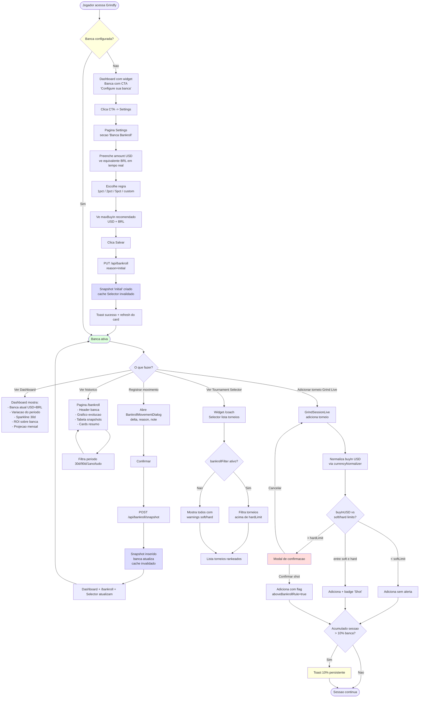

# Feature Flow: Bankroll Management — Jornada do Jogador

Mapa visual + cenarios de teste da perspectiva do jogador. Complementa `sequence-configure.md` (detalhes tecnicos de PUT) e `sequence-grind-alert.md` (detalhes tecnicos de alerta).

## Jornada Completa

## Estados por Tela

### Dashboard (widget Bankroll)

| Estado | Render |
|--------|--------|
| **Sem banca** | Card com CTA: "Configure sua banca para acompanhar evolucao" + botao "Ir para Settings" (Q9) |
| **Banca configurada, sem movimentos alem de initial** | Card com: banca atual USD+BRL, ROI=0%, projecao desabilitada, sparkline plana |
| **Banca com historico >=7 dias** | Card completo: atual + variacao % + sparkline + ROI30d + projecao "Se mantiver ROI X%, banca projetada em 30d: $Y" |
| **ROI30d negativo ou zero** | Projecao esconde valor, mostra "Foco em estabilizar variacao" |
| **Filtro de periodo do Dashboard mudou** | Widget refetch com novo `from/to`, atualiza variacao e ROI |

### Settings — Secao Banca

| Estado | Render |
|--------|--------|
| **Primeira visita** | Input amount vazio, select "1pct" default, display vazio, botao Salvar desabilitado |
| **Digitando amount** | Display derivado "Equivalente em BRL" e "Buy-in maximo recomendado" em tempo real (sem API) |
| **Banca ja configurada, muda `rule`** | Botao Salvar ativa; ao clicar, NAO abre dialog de reason (apenas rule mudou) |
| **Banca ja configurada, muda `amount`** | Botao Salvar ativa; ao clicar, abre dialog "Motivo da mudanca?" pedindo `reason` e `note` opcional |
| **`rule: "custom:X"` fora de range** | Input X marca erro vermelho "Entre 0.1 e 20" (Q2: 1 casa decimal) |
| **Apos salvar** | Toast verde "Banca configurada" + refresh do display |

### Pagina `/bankroll`

| Estado | Render |
|--------|--------|
| **Sem banca** | Empty state centralizado "Configure sua banca em Settings" + botao |
| **Banca sem historico** | Header com banca atual; grafico mostra ponto unico; tabela com linha `initial`; cards resumo zerados |
| **Banca com historico** | Header + grafico completo (line chart); tabela paginada; cards resumo (total aportado/sacado/P&L/variacao liquida) |
| **Filtro periodo** | `from/to` muda URL + refetch; granularity derivada (30d=day, 90d=day, 1ano=week, tudo=month) |
| **Jogador clica em snapshot na tabela** | (MVP) abre painel lateral com detalhes do snapshot; edit de `note` permitido; DELETE desabilitado (Q7 fora do MVP) |

### Grind Live — Adicionar Torneio

| Estado | Render |
|--------|--------|
| **Banca nao configurada** | Form normal, sem validacao de banca, sem modal, sem warnings |
| **Banca configurada, buyIn dentro da regra** | Adiciona direto, badge verde "ok" (opcional) |
| **Banca configurada, buyIn entre soft e hardLimit** | Adiciona direto, badge amarelo "Shot" no card |
| **Banca configurada, buyIn > hardLimit** | Modal de confirmacao bloqueante com display USD+BRL da banca atual vs buy-in |
| **Usuario cancela modal** | Torneio NAO persistido, form limpa |
| **Usuario confirma shot** | Persistido com flag, badge vermelho "Shot (acima da regra)" |
| **Acumulado sessao > 10% banca** | Toast amarelo persistente "Voce ja exposto X% da banca hoje" (Q5: por sessao, reseta ao encerrar) |
| **Jogador encerra sessao** | `sessionAccumulatorUSD = 0` |

### Tournament Selector Widget (integracao)

| Estado | Render |
|--------|--------|
| **Banca nao configurada** | Comportamento identico ao Sprint 1: chip "Bankroll Filter" desabilitado com tooltip "Configure sua banca em Settings" |
| **Banca configurada, bankrollFilter OFF** | Torneios acima de hardLimit mostram warning `out_of_bankroll` (icone vermelho); entre soft e hard mostram `out_of_bankroll_soft` (icone amarelo) |
| **Banca configurada, bankrollFilter ON** | Torneios > hardLimit sao filtrados da lista; entre soft e hard passam com badge `Shot` |
| **Linha de corte no grafico** | Response inclui `bankrollThresholdUSD` e `bankrollHardLimitUSD` para UI desenhar linha no grafico (opcional, backlog) |

## Cenarios de Teste Derivados (usar em tests/)

### Happy Path
- [ ] Usuario novo: configura banca $1000 rule 1pct -> snapshot initial criado, Dashboard widget atualiza, Selector passa a filtrar
- [ ] Registra aporte $500 -> banca sobe para $1500, snapshot deposit, historico mostra 2 rows
- [ ] Registra saque -$300 -> banca para $1200, snapshot withdrawal
- [ ] Filtra historico por reason="deposit" -> mostra apenas aportes
- [ ] Muda regra de 1pct para 2pct (sem mudar amount) -> NAO cria snapshot, Selector recalcula threshold

### Empty States
- [ ] Dashboard sem banca: widget com CTA leva para Settings
- [ ] /bankroll sem banca: empty state centralizado + CTA
- [ ] Tournament Selector sem banca: chip desabilitado, comportamento Sprint 1 preservado
- [ ] Grind Live sem banca: nenhum alerta, adicao normal

### Regras de Negocio
- [ ] `custom:3.5` aceito (1 casa decimal - Q2), calcula maxBuyIn = amount * 0.035 * 1.5
- [ ] `custom:3.55` rejeitado (2 casas - Q2)
- [ ] `custom:0.05` rejeitado (abaixo do min 0.1)
- [ ] `custom:25` rejeitado (acima do max 20)
- [ ] Saque que zera banca: aceito, widget exibe "Banca zerada"
- [ ] Saque que leva banca a negativo: aceito com warning toast (Q6), widget exibe valor negativo em vermelho

### Grind Live
- [ ] Torneio R$30 BRL com banca $1000 USD, rule 1pct: normaliza para ~$5.77 -> sem modal, sem warning
- [ ] Torneio $12 USD com banca $1000 USD, rule 1pct: entre soft (10) e hard (15) -> badge Shot
- [ ] Torneio R$100 BRL (~$19.23) com banca $1000 USD, rule 1pct: > hard (15) -> modal aparece
- [ ] Modal: cancelar -> torneio NAO vai para DB
- [ ] Modal: confirmar -> torneio vai com `aboveBankrollRule:true` em metadata
- [ ] Acumular 5 torneios = $105 em banca $1000: toast "10.5% exposto hoje"
- [ ] Encerrar sessao: proximo torneio reseta accumulator (Q5 por sessao)

### Regressao Sprint 1
- [ ] Teste `tests/integration/api/tournament-selector.test.ts:337` ("bankroll nao cadastrado") passa inalterado
- [ ] Response do Selector para usuario sem banca: `bankrollConfigured: false` (mantido)
- [ ] Response do Selector para usuario com banca: `bankrollConfigured: true`, `bankrollThresholdUSD: softLimit`, `bankrollHardLimitUSD: hardLimit`
- [ ] Todos os 3606 testes do Sprint 1 continuam verdes

### Edge Cases
- [ ] Usuario com `exchangeRates.BRL` ausente -> fallback para `DEFAULT_EXCHANGE_RATES.BRL`
- [ ] Request simultaneo de 2 `POST /snapshot` do mesmo usuario -> ambos completam em serie via FOR UPDATE, snapshots consecutivos com `previous_amount` correto
- [ ] 1000+ snapshots no historico -> paginacao funciona, query < 200ms p95 usando indice
- [ ] `preferredCurrency=BRL` nao afeta `bankrollAmount` (sempre USD)
- [ ] JWT invalido em todas as rotas -> 401
- [ ] Rate limit 10/min estourado -> 429 com mensagem amigavel

## Fluxos NAO Implementados (confirmar futuro)

| Fluxo | Status | Razao |
|-------|--------|-------|
| Auto-snapshot ao finalizar sessao de Grind | Fora do MVP (Q3) | Acoplamento com grind_sessions adiciona complexidade; reavaliar Sprint 2.5 |
| DELETE snapshot | Fora do MVP (Q7) | Hard delete com recompute e complexo; avaliacao em spec separada |
| Multi-bankroll | Fora do MVP | 1 banca USD por usuario |
| Moeda base alternativa (BRL) | Fora do MVP | USD fixado como base |
| Auto-derivar snapshots de uploads CSV | Fora do MVP | `source: auto_import` reservado mas nao implementado |
| AI Coach "Bankroll persona" | Backlog | Estrutura de dados suporta; persona virá depois |
| Metas/streaks | Cancelado (pivot 2026-04-24) | Sprints 3 e 4 cancelados |
