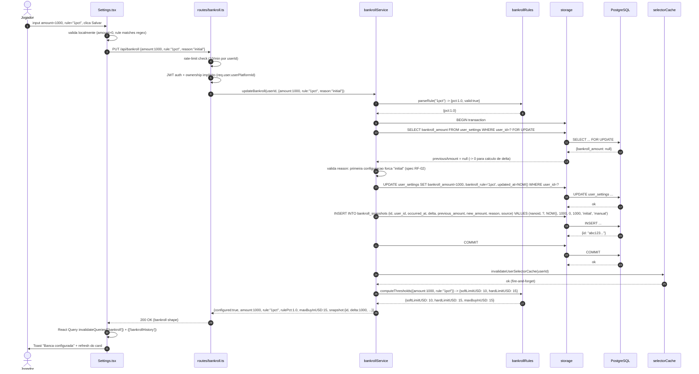
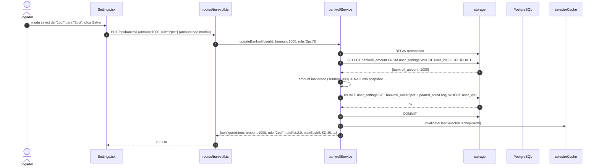
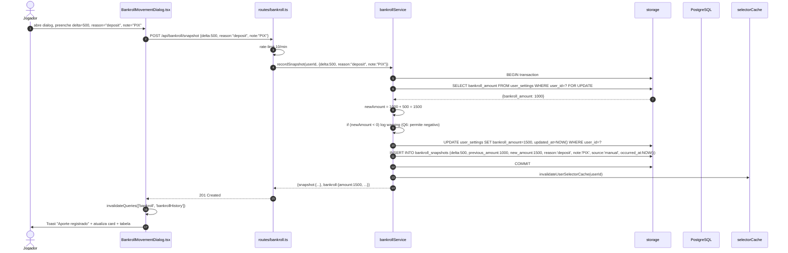

# Sequence: Configuracao de Banca (`PUT /api/bankroll`)

Fluxo atomico de atualizacao de banca (primeira configuracao ou mudanca de valor). Garante transacao + snapshot + invalidacao de cache.

## Atores
- **Jogador** (frontend)
- **Settings.tsx** (UI)
- **BankrollMovementDialog.tsx** (UI)
- **routes/bankroll.ts** (HTTP handler)
- **bankrollService** (dominio)
- **bankrollRules** (puro)
- **storage** (Drizzle + transacao)
- **selectorCache** (invalidacao)
- **PostgreSQL**

## Cenario A: Primeira configuracao

## Cenario B: Atualizar apenas `rule` (amount inalterado)

## Cenario C: Registrar aporte (`POST /api/bankroll/snapshot`)

## Invariantes garantidas pelo fluxo

1. **Atomicidade:** UPDATE + INSERT sempre na mesma transacao. Falha em uma aborta a outra. `user_settings.bankroll_amount` nunca fica dessincronizado com ultimo snapshot.
2. **Serializacao:** `SELECT ... FOR UPDATE` previne race em `previousAmount` (Q-Arch-3).
3. **Side-effects nao-transacionais apos commit:** cache invalidation acontece DEPOIS do commit. Se der erro na invalidacao (cache sem conexao), banca ja foi persistida — proximo request do Selector usa cache stale mas eventualmente expira (TTL 30min).
4. **Idempotencia do cache:** `invalidateUserSelectorCache` e idempotente — chamada 2x nao quebra.
5. **Ordem temporal:** `occurred_at` usa `NOW()` servidor, evitando clock skew do cliente. Usuario pode informar `occurredAt` no body (apenas para `POST /snapshot`, retroativo permitido, futuro proibido).

## Cenarios de erro

| Cenario | Resposta | Fluxo |
|---------|----------|-------|
| JWT invalido | 401 | middleware bloqueia |
| Rate limit (>10 req/min) | 429 | `rateLimiter` antes do handler |
| `amount < 0` | 400 `"bankrollAmount nao pode ser negativo"` | validacao Zod |
| `rule: "custom:0.05"` (< 0.1) | 400 `"Custom rule deve estar entre 0.1% e 20%"` | `parseRule` retorna invalid |
| `reason` obrigatorio nao fornecido em usuario ja configurado | 400 `"reason obrigatorio"` | service valida antes da transacao |
| Falha no INSERT do snapshot | 500 + rollback | transacao aborta, UPDATE nao persiste |
| Falha em `invalidateUserSelectorCache` | 200 OK + log warning | side-effect nao crítico |
| 2 requests simultaneos de POST /snapshot | ambos completam em serie via FOR UPDATE | segundo le `previousAmount` atualizado do primeiro |

## Dados Persistidos por Cenario

### Cenario A (primeira config)
- `user_settings.bankroll_amount`: null -> 1000
- `user_settings.bankroll_rule`: '1pct' (default) -> '1pct' (confirma)
- `bankroll_snapshots`: **1 row nova** `{delta:1000, previousAmount:0, newAmount:1000, reason:'initial', source:'manual'}`

### Cenario B (rule only)
- `user_settings.bankroll_rule`: '1pct' -> '2pct'
- `bankroll_snapshots`: **sem insert**

### Cenario C (aporte)
- `user_settings.bankroll_amount`: 1000 -> 1500
- `bankroll_snapshots`: **1 row nova** `{delta:500, previousAmount:1000, newAmount:1500, reason:'deposit', note:'PIX', source:'manual'}`
