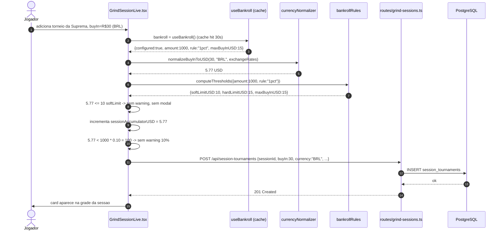
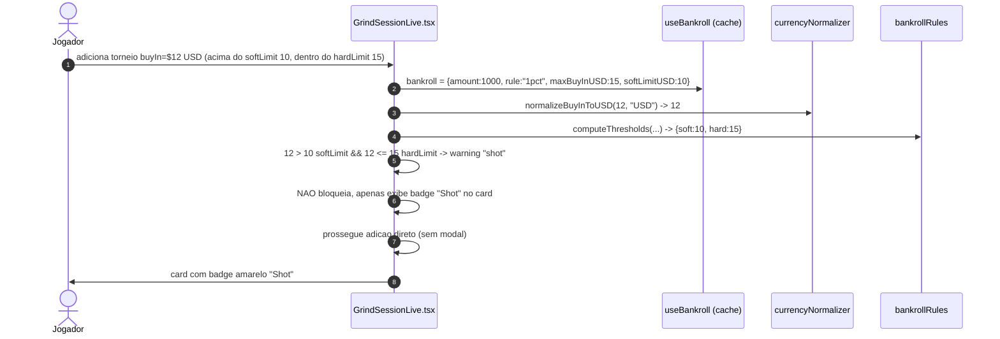
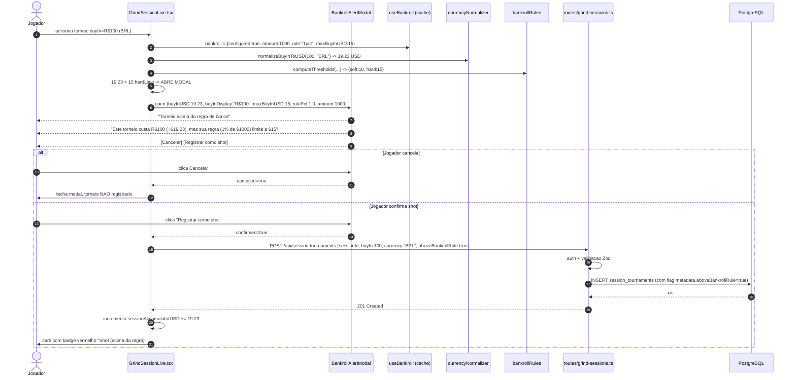
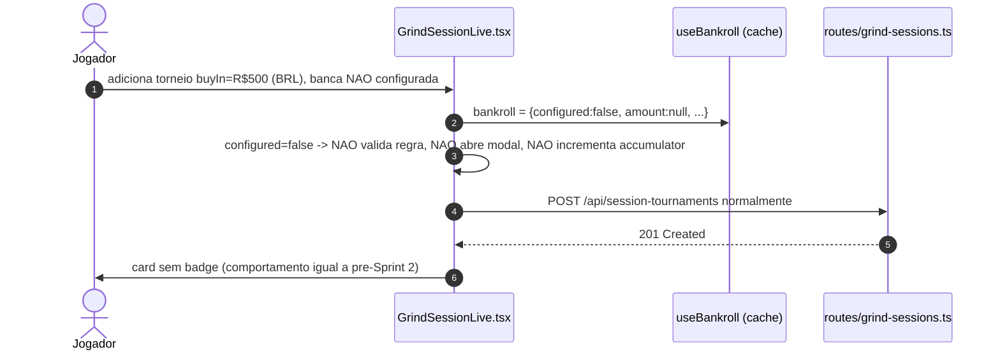

# Sequence: Alerta de Banca em Grind Live (`POST /api/session-tournaments`)

Fluxo de validacao quando jogador adiciona torneio na sessao. Compara `tournament.buyIn` (normalizado para USD) com `maxBuyInUSD` e dispara modal se exceder.

## Atores
- **Jogador** (frontend)
- **GrindSessionLive.tsx** (UI)
- **BankrollAlertModal.tsx** (UI — pode ser integrado no existente)
- **routes/grind-sessions.ts** (HTTP handler — modificacao leve)
- **currencyNormalizer** (reuso puro)
- **bankrollRules** (puro)
- **useBankroll** (React Query cache)
- **PostgreSQL**

## Cenario A: Torneio dentro da regra (sem modal)



## Cenario B: Torneio entre softLimit e hardLimit (shot — warning mas sem modal)



## Cenario C: Torneio acima do hardLimit (modal de confirmacao)



## Cenario D: Warning de 10% da banca por sessao (Q5)

```mermaid
sequenceDiagram
    autonumber
    actor J as Jogador
    participant UI as GrindSessionLive.tsx
    participant UB as useBankroll (cache)

    Note over UI: estado em memoria: sessionAccumulatorUSD (zera ao iniciar sessao, Q5)

    J->>UI: ja adicionou 5 torneios somando $80 USD na sessao
    Note over UI: sessionAccumulatorUSD = 80 (banca=1000, 10% threshold=100)

    J->>UI: adiciona 6o torneio, buyIn=$25 USD
    UI->>UI: novoAcumulado = 80 + 25 = 105 > 100 (10% de 1000)
    UI->>UI: dispara TOAST PERSISTENTE (warning, nao bloqueante) "Voce ja exposto 10.5% da banca hoje"
    UI->>J: Toast amarelo no topo da tela
    UI->>UI: prossegue com adicao normalmente (modal de hardLimit nao dispara se $25 <= $15 hardLimit ... espera, $25 > $15, entao TAMBEM abre modal de shot)

    Note over UI: Ambos alertas podem coexistir: modal de shot + toast de 10%.<br/>Modal eh bloqueante (precisa decisao do user); toast eh persistente mas nao bloqueia.

    alt Usuario encerra sessao
        J->>UI: clica "Encerrar sessao"
        UI->>UI: sessionAccumulatorUSD = 0 (reseta — Q5 "por sessao")
    end
```

## Cenario E: Banca nao configurada (feature transparente)



## Invariantes

1. **Fail-open:** Se `useBankroll` falhar (rede, cache miss, etc.), UI NAO bloqueia adicao. Assume `bankroll.configured=false` e prossegue sem validacao. Feature degrada mas nao impede o jogador de jogar.
2. **Estado de sessao em memoria:** `sessionAccumulatorUSD` eh `useState` em `GrindSessionLive.tsx`. Reseta quando sessao eh encerrada ou componente desmonta (Q5).
3. **Source of truth:** `bankrollRules.computeThresholds` eh a fonte unica. UI nao reimplementa formula — chama a funcao.
4. **Normalizacao sempre USD:** Compara `buyInUSD` vs `maxBuyInUSD`. Nunca BRL vs BRL.
5. **Flag `aboveBankrollRule` no backend:** Quando jogador confirma shot, payload tem `aboveBankrollRule:true` que vira metadata da `session_tournaments`. Util para analytics futuras ("quantos shots o jogador fez este mes?").
6. **Ordem: modal primeiro, toast depois:** Se torneio dispara ambos (shot + 10% sessao), modal aparece primeiro (bloqueante). Toast aparece apos confirmacao, se ainda ultrapassar 10%.

## Cenarios de erro

| Cenario | Resposta |
|---------|----------|
| `useBankroll` retorna erro de rede | UI assume `configured=false`, prossegue |
| `currencyNormalizer` retorna NaN (taxa de cambio faltando) | UI assume USD (pior caso: filtro falso-negativo para nao-USD) |
| Cache stale apos banca atualizada em outro tab | No pior caso, proximo request do GrindLive usa valor antigo por ate 30s (TTL do React Query). Apos, refetch automatico |
| Usuario muda banca durante sessao em outro tab | Proximo torneio adicionado ja usa nova `maxBuyInUSD` apos refetch. `sessionAccumulatorUSD` nao reseta (mantem historico da sessao) |

## Cenarios de Teste Derivados

- [ ] Banca $1000, rule 1pct, torneio $5 USD -> sem modal, sem warning
- [ ] Banca $1000, rule 1pct, torneio $12 USD -> badge "Shot" no card, sem modal
- [ ] Banca $1000, rule 1pct, torneio $20 USD -> modal "Torneio acima da regra"
- [ ] Banca $1000, rule 1pct, torneio R$100 BRL (~$19.23) -> modal aparece com display BRL + USD
- [ ] Modal: cancelar -> torneio NAO persistido no DB
- [ ] Modal: confirmar shot -> torneio persistido com `aboveBankrollRule:true`
- [ ] Acumulado sessao $105, banca $1000 -> toast "Voce ja exposto 10.5% da banca hoje"
- [ ] Encerrar sessao -> sessionAccumulatorUSD reseta para 0
- [ ] Banca nao configurada -> nunca abre modal nem toast (feature transparente)
- [ ] Cache de useBankroll invalida apos PUT /api/bankroll em outro tab (via React Query invalidation) - fora do escopo direto desta feature, mas observavel
- [ ] useBankroll com erro de rede -> UI nao quebra, assume configured=false
