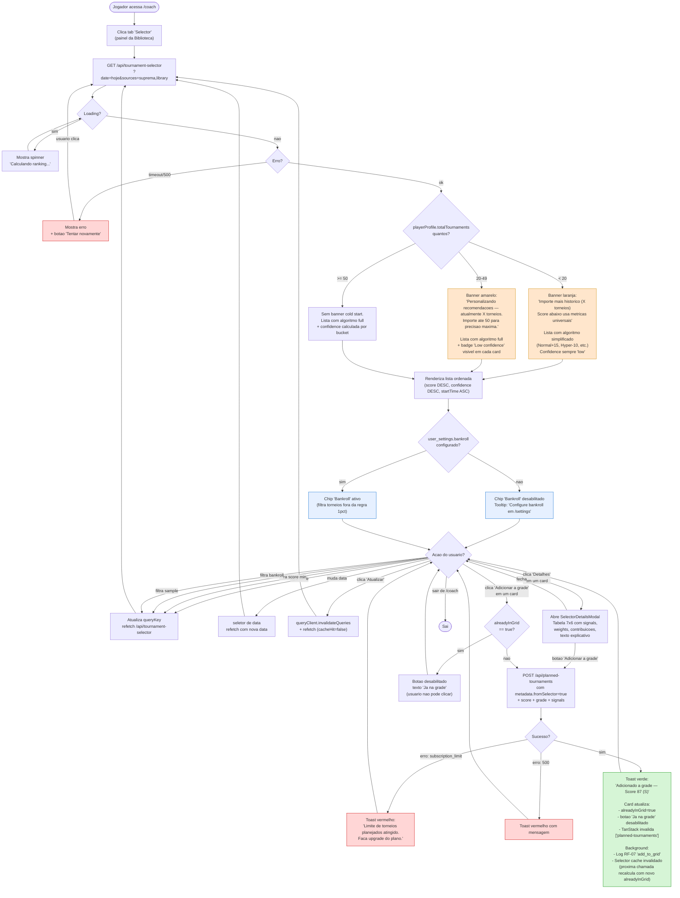
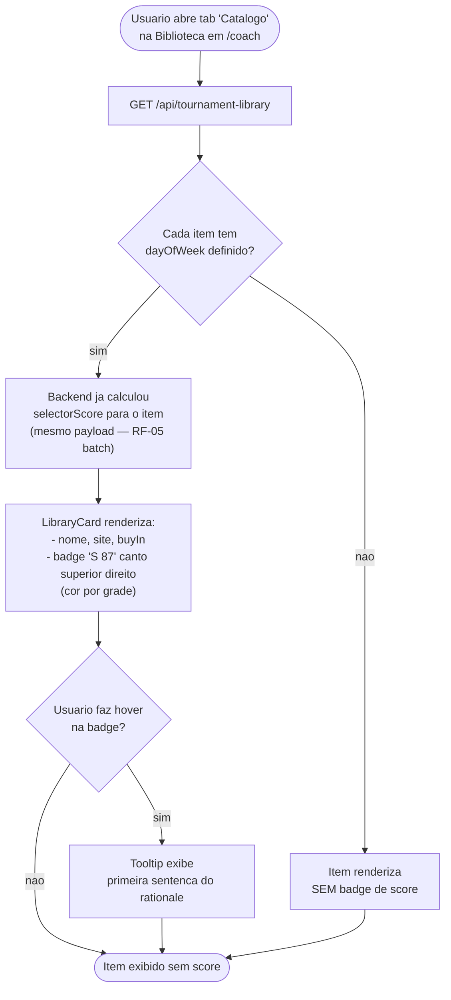
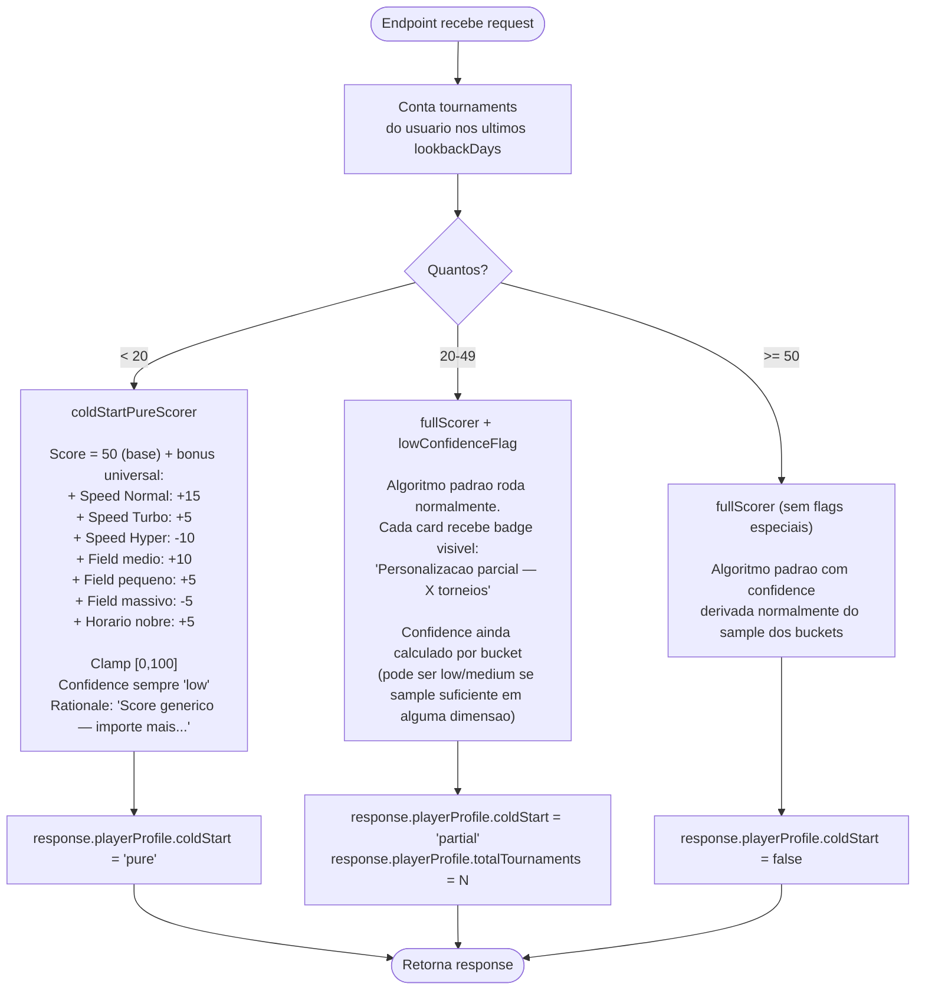

# Feature Flow — Tournament Selector (perspectiva do usuario)

## Contexto
Fluxograma do ponto de vista do jogador interagindo com o widget Selector dentro de `/coach` (Grade Planner). Cobre cold start granular, fluxo principal, filtros, bankroll desabilitado, add-to-grid e modal de detalhes.

---

## Diagrama Principal

---

## Sub-Fluxo: Library com Score (RF-05)

---

## Sub-Fluxo: Cold Start Granular

---

## Cenarios de Teste Derivados

### Happy Path
- [ ] Jogador com 1k+ torneios abre tab Selector → recebe lista ranqueada com scores 0-100
- [ ] Top torneio tem grade S, badge verde com trofeu, rationale destacando ROI alto
- [ ] Bottom torneio tem grade D, badge vermelho com X, rationale destacando warnings
- [ ] Lista esta ordenada por score DESC
- [ ] Card mostra: grade colorida, score grande, nome, horario, site (logo), buy-in, rationale, mini-grafico, warnings, botoes "Adicionar" e "Detalhes"

### Cold Start Granular
- [ ] Jogador com 0 torneios → response.playerProfile.coldStart = "pure", banner laranja, lista com algoritmo simplificado
- [ ] Jogador com 19 torneios → mesmo comportamento (pure)
- [ ] Jogador com 20 torneios → response.playerProfile.coldStart = "partial", banner amarelo, badge "low confidence" em cada card
- [ ] Jogador com 49 torneios → mesmo comportamento (partial)
- [ ] Jogador com 50 torneios → sem banner, scoring normal, confidence calculada por bucket
- [ ] Cold start "pure" com Speed=Normal + Field=medio + Horario=nobre → score 80 (50 + 15 + 10 + 5)
- [ ] Cold start "pure" com Speed=Hyper + Field=massivo + Horario=madrugada → score 35 (50 - 10 - 5 + 0, clampado)

### Filtros
- [ ] Filtro "Fonte: Suprema" → endpoint chamado com sources=suprema, lista so com source=suprema
- [ ] Filtro "Fonte: Biblioteca" → endpoint com sources=library, NAO chama Pokerbyte (verificar via mock)
- [ ] Filtro "Score >= 70" → lista esconde grades C/D
- [ ] Filtro "Score >= 85" → lista mostra so grades S
- [ ] Filtro "Sample >= 30" → torneios com bucket primario sample < 30 ocultos
- [ ] Filtro "Bankroll: dentro do limite" com bankroll cadastrado → oculta torneios > 1pct
- [ ] Filtro "Bankroll" sem bankroll cadastrado → chip desabilitado, tooltip "Configure em /settings"
- [ ] Mudar data → refetch com nova date, lista atualiza
- [ ] Botao "Atualizar" → invalida cache, refetch garantido (cacheHit=false)

### Add to Grid
- [ ] Clicar "Adicionar" cria planned_tournament, toast verde, botao vira "Ja na grade" desabilitado
- [ ] alreadyInGrid=true desde inicio → botao ja vem desabilitado
- [ ] Apos add, refresh do widget mostra alreadyInGrid=true persistente (cache invalidado corretamente)
- [ ] Erro 403 (subscription limit) → toast vermelho com mensagem clara
- [ ] Erro 500 generico → toast vermelho + botao continua habilitado para retry
- [ ] Background: log RF-07 "add_to_grid" inserido em tournament_selector_logs com snapshot de signals

### Modal de Detalhes
- [ ] Clicar "Detalhes" abre modal com tabela completa: Sinal | ROI bruto | Sample | bucketScore | shrunkScore | Peso | Contribuicao
- [ ] Total na ultima linha bate com score mostrado no card
- [ ] Modal tem botao "Adicionar a grade" replicado (mesma logica)
- [ ] Modal fecha sem afetar lista

### Edge Cases
- [ ] Suprema API offline → response.warnings inclui "suprema_unavailable", lista so com library
- [ ] Biblioteca vazia + Suprema offline → lista vazia, mensagem "Nenhum torneio para esta data"
- [ ] Filtros aplicados zeraram lista → mensagem "Nenhum torneio combina com seus filtros"
- [ ] Torneio Suprema sem `maxPlayers` → fieldRoi peso redistribuido (visivel no modal de detalhes)
- [ ] Torneio category desconhecida ("Bounty Hunter") → mapeado via constantes para PKO ou redistribuido
- [ ] Data no passado → request aceito, Suprema pode retornar vazio
- [ ] Cache hit (segunda chamada em <30min) → response.cacheHit=true, latencia <50ms
- [ ] Apos upload novo de CSV → bundle e selector cache invalidados, proxima chamada recalcula
- [ ] 31a request no minuto → 429 rate limit
- [ ] Sem auth → 401
- [ ] Date invalido (23-04-2026) → 400

### UI Responsividade
- [ ] Mobile: cards full-width, mini-grafico empilhado abaixo do rationale
- [ ] Desktop: cards compactos, mini-grafico ao lado do rationale
- [ ] Loading state com spinner centralizado
- [ ] Erro state com retry button
- [ ] Cores das grades sao acompanhadas de icone + texto (acessibilidade)

### Performance
- [ ] 200 torneios + 5k historico → endpoint p95 < 500ms
- [ ] computeTournamentScore < 2ms por torneio (benchmark unitario)
- [ ] /api/analytics/player-bundle p95 < 300ms
- [ ] Cache hit < 50ms
- [ ] /api/tournament-library com selectorScore p95 < 600ms (200 itens) — monitorar

### Telemetria (RF-07)
- [ ] Cada GET /api/tournament-selector insere row eventType="view"
- [ ] Cada add_to_grid via Selector insere row eventType="add_to_grid" com metadata
- [ ] Logs sao async — falha do INSERT NAO afeta response do endpoint
- [ ] Index (userId, createdAt DESC) presente para queries futuras de calibragem
