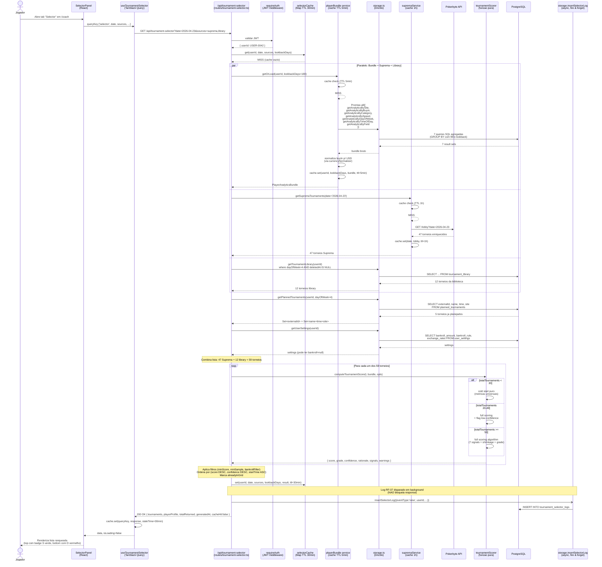
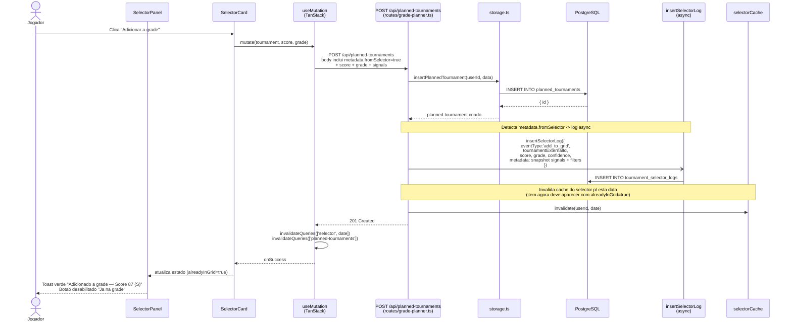
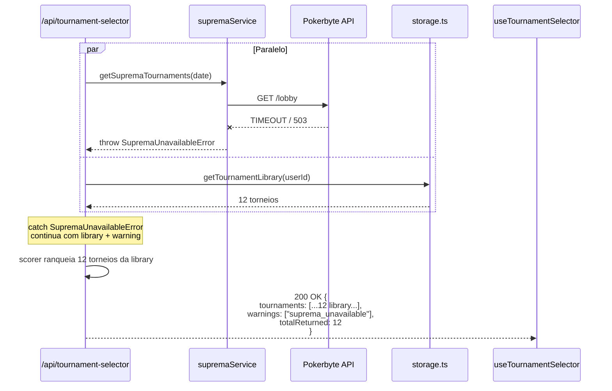
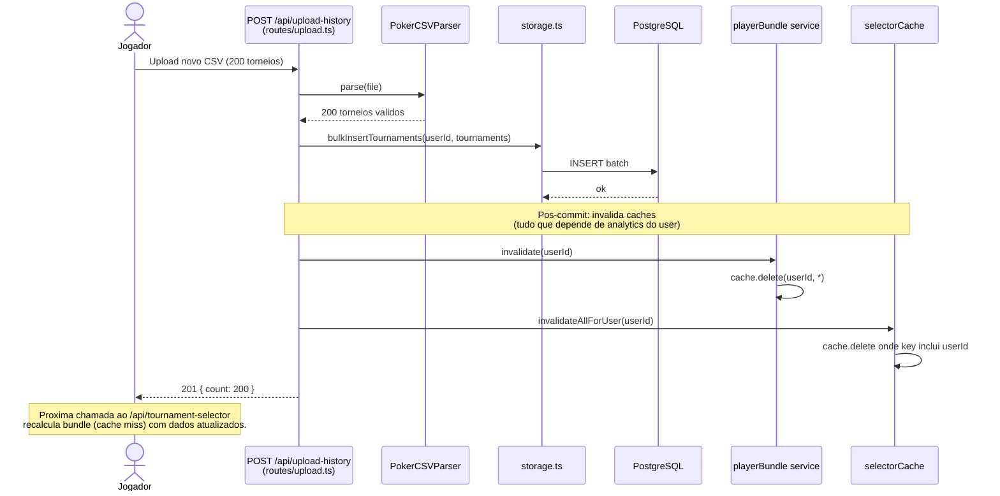

# Sequence Diagram — GET /api/tournament-selector

## Contexto
Diagrama de sequencia detalhado do fluxo principal: jogador abre o widget Selector em `/coach`, frontend dispara `GET /api/tournament-selector?date=YYYY-MM-DD&sources=suprema,library`, backend orquestra paralelismo entre bundle de analytics + lobby Suprema + library, scorer ranqueia, telemetria e gravada async, response retorna lista ranqueada.

## Diagrama Principal — Cache Miss (caminho mais longo)



## Diagrama — Cache Hit (caminho rapido)

```mermaid
sequenceDiagram
    actor User as Jogador
    participant SP as SelectorPanel
    participant Hook as useTournamentSelector
    participant Route as /api/tournament-selector
    participant Auth as requireAuth
    participant SCache as selectorCache

    User->>SP: Recarrega/reabre Selector (mesma data)
    SP->>Hook: queryKey identica
    alt TanStack Query staleTime nao expirou (5min default)
        Hook-->>SP: data cacheada (sem fetch)
    else staleTime expirou
        Hook->>Route: GET /api/tournament-selector?...
        Route->>Auth: JWT
        Auth-->>Route: ok
        Route->>SCache: get(userId, date, sources, lookbackDays)
        SCache-->>Route: HIT (response salva ha 8min)
        Route-->>Hook: 200 OK { ..., cacheHit: true }
        Note over Route: Tempo total &lt; 50ms
    end
    Hook-->>SP: data
    SP-->>User: Renderiza
```

## Diagrama — Add to Grid (com log RF-07)



## Diagrama — Suprema API offline (resiliencia)



## Diagrama — Cache Invalidation por Upload



## Notas de Implementacao

### Paralelismo
- O bloco `par Paralelo: Bundle + Suprema + Library` e CRITICO para atingir o p95 < 500ms.
- Implementar com `await Promise.all([bundlePromise, supremaPromise, libraryPromise])`.
- `bundlePromise` internamente ja usa `Promise.all` para as 7 queries de analytics.

### Resiliencia
- `supremaService` deve fazer wrap em try/catch dentro do `Promise.all` ou usar `Promise.allSettled`. Se falha, response inclui warning sem quebrar.
- `bundlePromise` NAO tem fallback — se falha, retorna 500. Bundle e dado obrigatorio para scoring.

### Telemetria (RF-07)
- Sempre fire-and-forget (`Promise.resolve().then(() => insertSelectorLog(...))` ou similar). NAO usar `await`.
- Log de erro do logger em `console.error` mas nunca propaga.

### Cache invalidacao
- `selectorCache.invalidateAllForUser(userId)` exige iterar Map e remover keys que comecam com `${userId}:`. Implementar com chave composta `${userId}:${date}:${sources}:${lookbackDays}`.
- Considerar mover para Redis se memory pressure aparecer (ADR-016 cita).

### Logs em paralelo com upload
- Upload ja tem batch de 500 torneios. Apos commit:
  - Invalida bundle cache do user.
  - Invalida selector cache do user (todas as datas).
- Sem afetar response do upload.
