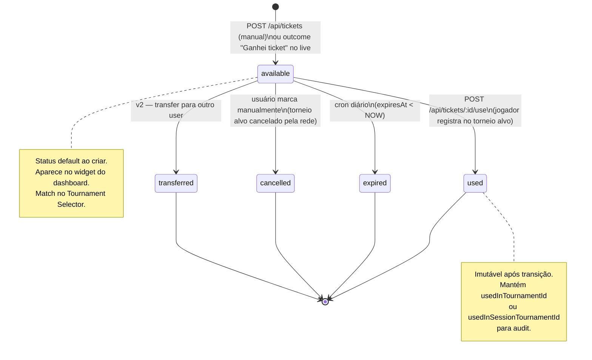

# Spec: Gestão de Tickets de Torneios Satélite

## Status
Proposta

## Resumo
Sistema de inventário de tickets ganhos em satélites: registro do resultado correto (ticket vs cash), inventário visível no Dashboard, e fluxo de "pagar com ticket vs pagar com cash" no momento de registrar/jogar o torneio alvo. Também permite registro manual de ticket (ex.: ticket comprado fora do app, ticket promocional, ticket transferido).

## Contexto
Hoje o schema tem campos preparados para satélite (`satelliteRewardType`, `satelliteTicketValue`, `satelliteTargetTemplateId`, `satelliteExtraCash`, `enteredViaSatellite`) mas não há tabela de inventário de tickets nem fluxo de UI. Quando o jogador ganha um satélite hoje, ele só consegue digitar o `prize` em dinheiro como aproximação — perde o conceito de "tenho um ticket de $215 para o WSOP Online ME do dia 28". Quando vai jogar o torneio alvo, o sistema não sabe que o buy-in foi via ticket — registra como buy-in pago em cash, distorcendo ROI e debitando wallet erroneamente.

Esta spec preenche a lacuna entre os campos satélite já existentes e a experiência real do jogador profissional, que típicamente carrega 5-30 tickets vivos a qualquer momento.

Prioridade: alta. É bloqueador para confiabilidade do dashboard de jogadores que jogam satélites com regularidade (i.e., qualquer profissional MTT acima de buy-in $50).

## Usuários
- **Jogador (free / pro / premium):** ganha tickets em satélites, registra tickets manuais, consome tickets ao jogar o torneio alvo, vê inventário no dashboard.
- **Admin:** sem fluxo dedicado nesta spec — admin já enxerga via tabelas de banco.

## Glossário
- **Ticket:** direito de inscrição em um torneio específico (ou em qualquer torneio dentro de um valor). No contexto desta spec, sempre vinculado a um torneio alvo (template ou nome livre) com valor declarado em USD.
- **Satélite:** torneio cujo prêmio é (parcial ou totalmente) tickets para outro torneio.
- **Torneio alvo (target):** torneio para o qual o ticket dá inscrição.
- **Inventário ativo:** conjunto de tickets do usuário com `status='available'` e (se houver) `expires_at > NOW()`.
- **Ticket avulso:** ticket criado via "Registrar manualmente" (sem `source_tournament_id`).

---

## Requisitos Funcionais

### RF-01: Tabela `tickets` (inventário)

**Descrição:** Criar nova tabela `tickets` que representa cada ticket individual do usuário (1 row = 1 ticket).

**Schema (Drizzle):**
| Campo | Tipo | Constraints | Notas |
|---|---|---|---|
| `id` | varchar | PK, nanoid | |
| `userId` | varchar | FK → `users.userPlatformId`, on delete cascade, NOT NULL | |
| `sourceTournamentId` | varchar | FK → `tournaments.id`, on delete SET NULL | NULL se ticket avulso |
| `sourceSessionTournamentId` | varchar | FK → `session_tournaments.id`, on delete SET NULL | usado quando o ticket vem do live (ainda não migrado para `tournaments`) |
| `targetTemplateId` | varchar | FK → `tournament_templates.id`, on delete SET NULL | preferencial; permite agrupar |
| `targetName` | varchar | NULL | usado quando não há template (ticket avulso ou target não cadastrado) |
| `targetSite` | varchar | NULL | site/rede do torneio alvo (informativo, ajuda matching) |
| `ticketValueUSD` | decimal | NOT NULL, > 0 | sempre em USD; conversão feita pelo `currencyNormalizer` quando origem é em outra moeda |
| `extraCashUSD` | decimal | NULL | usado quando `rewardType=mixed` no satélite — valor cash adicional já creditado em wallet (referência) |
| `status` | varchar | NOT NULL, default `'available'` | `'available'` \| `'used'` \| `'expired'` \| `'cancelled'` \| `'transferred'` |
| `usedInTournamentId` | varchar | FK → `tournaments.id`, on delete SET NULL | NULL até ser consumido |
| `usedInSessionTournamentId` | varchar | FK → `session_tournaments.id`, on delete SET NULL | NULL até ser consumido (no live) |
| `earnedAt` | timestamp | NOT NULL, default NOW() | quando o ticket entrou no inventário |
| `expiresAt` | timestamp | NULL | NULL = não expira |
| `usedAt` | timestamp | NULL | preenchido na transição → `'used'` |
| `cancelledAt` | timestamp | NULL | preenchido na transição → `'cancelled'` (ex.: torneio alvo cancelado pela rede) |
| `transferredAt` | timestamp | NULL | reservado v2 (transferência entre players) |
| `transferredToUserId` | varchar | NULL | reservado v2 |
| `note` | text | NULL | comentário livre (ex.: "ticket comprado no Discord do staking group") |
| `source` | varchar | NOT NULL, default `'manual'` | `'satellite_result'` \| `'manual'` \| `'csv_import'` (v2) \| `'transfer_in'` (v2) |
| `createdAt` | timestamp | default NOW() | |
| `updatedAt` | timestamp | default NOW() | |

**Índices:**
- `idx_tickets_user_status` em `(userId, status)` — query principal "meus tickets ativos"
- `idx_tickets_user_target_template` em `(userId, targetTemplateId)` — match no register dialog
- `idx_tickets_user_expires` em `(userId, expiresAt)` — cron de expiração
- `idx_tickets_source_tournament` em `(sourceTournamentId)`

**Regras de integridade (refinement Zod no `insertTicketSchema`):**
- Pelo menos um entre `targetTemplateId` e `targetName` deve estar preenchido. Se ambos NULL → reject.
- Se `status='used'`, então `usedInTournamentId` OU `usedInSessionTournamentId` deve estar preenchido (XOR — exclusivos), e `usedAt` deve estar preenchido.
- Se `status='cancelled'`, então `cancelledAt` deve estar preenchido.
- `ticketValueUSD > 0` (não aceitar 0; ticket de valor 0 não tem semântica útil).
- Se `expiresAt` preenchido, deve ser > `earnedAt`.

**Critério de aceitação:**
- [ ] Migration cria tabela `tickets` com todos os campos e índices acima.
- [ ] `insertTicketSchema` valida todas as regras de integridade.
- [ ] `storage.createTicket(data)`, `storage.updateTicket(id, patch)`, `storage.getTicketsByUser(userId, filter?)`, `storage.getActiveTicketsByUser(userId)` existem em `server/storage.ts`.
- [ ] FK on delete behavior é SET NULL (não CASCADE) — se o torneio alvo for deletado, o ticket vira "órfão" mas não some.

---

### RF-02: Resultado de satélite no Live Session — diferenciação por outcome

**Descrição:** Quando o usuário registra resultado de um torneio com `type='Satellite'` no `TournamentCard.tsx` (live session), o `ResultDialog` muda para oferecer 3 outcomes mutuamente exclusivos antes dos campos atuais.

**UI (mudança em `client/src/components/grind-session-live/TournamentCard.tsx` — bloco do `Dialog open={showResultDialog}`):**

Quando `tournament.type === 'Satellite'`, o dialog ganha um seletor no topo (RadioGroup ou 3 buttons):

1. **"Ganhei ticket"** (default se `satelliteRewardType ∈ {'ticket', 'mixed'}`)
   - Mostra: campo `Valor do ticket (USD)` (pré-preenchido com `tournament.satelliteTicketValue` se existir), campo opcional `Torneio alvo` (select de templates do usuário OU text livre, pré-preenchido com `satelliteTargetTemplateId`/`satelliteTargetName`), campo opcional `Cash extra (USD)`, campo `Posição`.
   - **Não mostra** campos `Premio` em cash genérico — o cash é entrado em "Cash extra".
   - Ao salvar: cria 1 row em `tickets` com `status='available'`, `source='satellite_result'`, `sourceSessionTournamentId=tournament.id`, valor e target conforme inputs. Se `extraCashUSD > 0`, gera transação `wallet_transactions` com `reason='session_result'` e direction='in' no valor do extra cash convertido para nativeCurrency da wallet de origem.

2. **"Ganhei cash"** (default se `satelliteRewardType='cash'`)
   - Mostra: campo `Premio (USD ou moeda da wallet)`, campo `Posição`.
   - Comportamento idêntico ao fluxo Vanilla atual — sem criação de ticket.

3. **"Não passei"** (sempre disponível)
   - Mostra: campo `Posição` (opcional). Sem prêmio. Sem ticket.
   - Salva `prize=0`, `status='finished'`. Sem efeito em wallet.

**Regras:**
- Se `tournament.satelliteRewardType='package'`, oferecer apenas "Ganhei ticket" ou "Não passei" (sem opção cash). O fluxo "Ganhei ticket" para `package` cria ticket com mesma estrutura; campos de package detalhados (`packageAccommodation`, `packageTravel`, etc.) ficam como **fora de escopo v1** — é registrado apenas como ticket com `note` livre no campo "Observações" do dialog.
- "Cash extra" só aparece quando outcome="Ganhei ticket" e `satelliteRewardType` é `'mixed'` (ou usuário marca explicitamente um checkbox "Tive cash extra além do ticket").
- O outcome "Ganhei ticket" exige pelo menos `ticketValueUSD > 0` — bloqueia salvar se vazio.
- A pré-seleção do outcome respeita `satelliteRewardType` quando existir; quando não existir (ex.: satélite registrado manualmente sem reward type definido), default é "Ganhei ticket".

**Critério de aceitação:**
- [ ] Ao abrir result dialog em torneio Satellite, os 3 botões/radios aparecem.
- [ ] Selecionar "Ganhei ticket" e salvar gera 1 row em `tickets` com `status='available'`, `source='satellite_result'`, e atualiza `session_tournaments.status='finished'`.
- [ ] Selecionar "Ganhei cash" comporta-se exatamente como Vanilla (sem criação de ticket, prize/wallet normais).
- [ ] Selecionar "Não passei" finaliza com `prize=0` sem criar ticket.
- [ ] `extraCashUSD` quando preenchido cria `wallet_transactions` com `reason='session_result'` e direction='in'.
- [ ] Se outcome="Ganhei ticket" e `ticketValueUSD` vazio → erro inline, não salva.

---

### RF-03: Registro manual de ticket no Dashboard

**Descrição:** Botão "Registrar novo ticket" abre modal que cria entrada em `tickets` sem origem em torneio jogado.

**UI (novo componente `TicketRegisterDialog.tsx` em `client/src/components/tickets/`):**

Campos:
- **Torneio alvo** (combobox): primeiro tenta autocomplete em `tournament_templates` do usuário; se não encontrar, permite digitar texto livre que vai em `targetName`.
- **Site/Rede** (select, opcional se template selecionado): herda do template; livre se nome digitado.
- **Valor do ticket (USD)** (input number, required, > 0).
- **Data de validade** (date picker, opcional, default = vazio = não expira).
- **Cash extra (USD)** (input number, opcional, default 0).
- **Wallet a creditar o cash extra** (select, só aparece se cash extra > 0; lista wallets ativas do usuário).
- **Origem** (select): "Comprado", "Promocional", "Transferido", "Outros" — vai em `note` formatado (ex.: `"origem: comprado"`). v1 não tem campo dedicado; v2 pode adicionar `acquisitionType`.
- **Observações** (textarea, opcional).

Regras:
- Cria row com `source='manual'`, `sourceTournamentId=NULL`, `sourceSessionTournamentId=NULL`, `status='available'`, `earnedAt=NOW()`.
- Se cash extra > 0, gera `wallet_transactions` na wallet selecionada com `reason='deposit'` (não `session_result` — cash extra de ticket avulso é tratado como aporte). `note` da tx: "Cash extra de ticket manual #ticketId".
- Validações de Zod: `ticketValueUSD > 0`, `extraCashUSD ≥ 0`, target template OU target name presente, expires (se setado) > NOW().

**Endpoint backend:**
| Método | Rota | Auth | Descrição |
|---|---|---|---|
| POST | `/api/tickets` | JWT | Cria ticket manual. Body: `insertTicketSchema`. Valida regras RF-01. Se `extraCashUSD > 0`, em transação atomica também insere `wallet_transactions`. |

**Critério de aceitação:**
- [ ] Modal abre ao clicar em "Registrar novo ticket" no widget do dashboard.
- [ ] Submeter cria row em `tickets` com campos corretos.
- [ ] Cash extra > 0 cria `wallet_transactions` com `reason='deposit'` em wallet selecionada, transação atomica (rollback ambos se falhar).
- [ ] Sem template e sem nome → erro 400 com mensagem clara.

---

### RF-04: Widget "Tickets disponíveis" no Dashboard

**Descrição:** Card no `Dashboard.tsx` listando inventário ativo do usuário, com ações.

**UI (novo componente `TicketsWidget.tsx` em `client/src/components/dashboard/`):**

Layout:
- Header: título "Tickets disponíveis" + badge com contagem ativa + botão "Registrar manualmente".
- Lista de tickets ativos (status='available'):
  - Cada item: nome do target (template name ou `targetName` livre), site (se houver), valor USD, data ganho ("ganho há 3 dias"), expiração se houver ("expira em 5 dias" ou "expira hoje" em vermelho).
  - Ações por item: menu kebab com "Marcar como expirado", "Marcar como cancelado", "Editar", "Detalhe" (modal com source link, note, etc.).
- Empty state: "Você não tem tickets ativos" + CTA "Registrar manualmente".
- Footer com link "Ver histórico" (todos os tickets, incluindo `used`/`expired`).

**Endpoint backend:**
| Método | Rota | Auth | Descrição |
|---|---|---|---|
| GET | `/api/tickets` | JWT | Lista tickets do usuário. Query params: `status` (default `'available'`), `targetTemplateId`, `limit`, `offset`. Retorna ticket + join leve com template (name, site). |
| PATCH | `/api/tickets/:id` | JWT | Atualiza ticket. Permite mudanças em `expiresAt`, `note`, `targetName`/`targetTemplateId` (só se `status='available'`), e transição manual de `status` para `'cancelled'` ou `'expired'`. |
| DELETE | `/api/tickets/:id` | JWT | Soft delete: muda `status` para `'cancelled'` se ainda `'available'`. Hard delete proibido (audit trail). |

**Regras:**
- Tickets com `status='used'` não aparecem no widget (apenas no histórico).
- Tickets com `expiresAt < NOW()` aparecem com warning visual mas com `status` ainda `'available'` até cron rodar (RF-09).
- Ordenação default: por `expiresAt ASC NULLS LAST` (mais perto de expirar primeiro), depois `earnedAt DESC`.

**Critério de aceitação:**
- [ ] Widget renderiza tickets ativos com nome do target, valor USD e data ganho.
- [ ] Botão "Registrar manualmente" abre modal RF-03.
- [ ] Empty state quando 0 tickets ativos.
- [ ] Tickets expirando em < 24h aparecem com cor de warning (amber).

---

### RF-05: Pagar torneio com ticket — Live Session e Grade

**Descrição:** Quando o usuário vai jogar o torneio alvo (registrar no live ou adicionar na grade) e tem ticket disponível para esse torneio, oferece toggle "Pagar com ticket" ou "Pagar com cash".

**Match logic:**
Um ticket é considerado match para um torneio quando:
1. **Match forte:** `ticket.targetTemplateId === tournament.templateId`. (Ambos não-null.)
2. **Match médio:** `ticket.targetName.toLowerCase().trim() === tournament.name.toLowerCase().trim()` E `ticket.targetSite === tournament.site` (ou ambos site null/iguais).
3. **Sem match fuzzy v1.** Levenshtein/heurísticas ficam para v2.

**UI live session — `TournamentCard` em estado `upcoming`:**

Hoje há botão "Registrar". Quando há ≥ 1 ticket match:
- Botão único "Registrar" abre `RegisterPaymentDialog` (novo componente) que pergunta: "Pagar com ticket ($215, expira em 3 dias) ou pagar com cash?".
- Selecionar ticket: marca `ticket.status='used'`, `ticket.usedInSessionTournamentId=tournament.id`, `ticket.usedAt=NOW()`. Marca `session_tournaments.enteredViaSatellite=true`. **Não dispara** débito de wallet. Define `session_tournaments.buyIn` permanece o valor original (referência) MAS para fins de cálculo de ROI/profit, é tratado como buy-in efetivo = 0 (ver RF-06).
- Selecionar cash: comportamento atual (chama `applyRegister`, debita wallet via fluxo existente).
- Se há > 1 ticket match: lista todos com radio, ordenados por `expiresAt ASC NULLS LAST`. Default selecionado: primeiro da lista (FIFO de expiração).

**UI grade planner / planejamento futuro:**
v1 escopo: planejamento (planned_tournaments) **NÃO** consome ticket — ticket só é consumido no momento da entrada real (live session) ou no upload de histórico (`tournaments`). Toggle em planejamento é **fora de escopo v1**.

**Endpoint backend:**
| Método | Rota | Auth | Descrição |
|---|---|---|---|
| POST | `/api/tickets/:id/use` | JWT | Marca ticket como usado. Body: `{ tournamentId? , sessionTournamentId? }` (XOR). Atomica: update ticket + update tournament (`enteredViaSatellite=true`). 409 se ticket já não está `available`. |
| GET | `/api/tickets/match` | JWT | Query params: `tournamentName`, `templateId?`, `site?`. Retorna lista de tickets match (status='available'). Usado pelo client para decidir se mostra dialog de payment. |

**Re-entry e re-buy em torneio entrado via ticket (RF-05.1):**
- Re-entry após bust em torneio entrado via ticket: por default usa cash (não outro ticket). Se houver ticket match adicional, oferecer toggle no `ReentryConfirmDialog` igual ao register. Decisão: spec v1 oferece toggle em re-entry SE houver tickets match disponíveis; não força.
- Re-buy: sempre cash (rebuy é gasto in-tournament, não tem semântica de ticket).
- Add-on: sempre cash.

**Critério de aceitação:**
- [ ] Endpoint `GET /api/tickets/match` retorna tickets match para um torneio dado (template ID ou name+site).
- [ ] Quando há ≥ 1 ticket match, click em "Registrar" abre dialog de pagamento.
- [ ] Selecionar ticket marca `ticket.status='used'` e `tournament.enteredViaSatellite=true` em transação atomica.
- [ ] Selecionar cash mantém comportamento atual.
- [ ] Se ticket consumido em paralelo (race condition), endpoint retorna 409 e UI re-busca match list.
- [ ] Re-entry oferece toggle se houver tickets match restantes.

---

### RF-06: Cálculo de ROI quando entrou via ticket

**Descrição:** Definir explicitamente como `buyIn` efetivo é tratado no cálculo de ROI/profit para torneios com `enteredViaSatellite=true`.

**Decisão (sem TBD):**
- **Buy-in efetivo (custo real):** 0 — o jogador não pagou cash naquele momento.
- **Buy-in nominal (referência):** mantido em `tournaments.buyIn` (valor que aparece em filtros, dashboard de field/buy-in).
- **Profit do torneio:** `prize - buyIn_efetivo - rake = prize - 0 - rake = prize - rake`.
- **ROI do torneio individual:** `(prize - 0) / 0 = infinito` — **não computar** ROI individual em torneios via ticket. No agregado, o ticket é considerado custo no torneio satélite que o originou.
- **ROI agregado (dashboard, library):** o gasto do satélite original já entra no agregado. O torneio entrado via ticket entra com `effectiveBuyIn=0`. Portanto, o ROI do conjunto (satélite + alvo) = `(prize_alvo - buyIn_satellite - rake_satellite - rake_alvo) / buyIn_satellite`.

**Implicações:**
- `server/scoring/*.ts`, `client/src/lib/*.ts` que calculam ROI/profit precisam tratar `enteredViaSatellite=true` como `effectiveBuyIn=0`.
- Dashboard "performance por buy-in": torneio via ticket aparece no bucket do `buyIn nominal` (não bucket "$0").
- Dashboard "performance por satélite": agregado compara `total_prize_dos_alvos - total_cost_dos_satellites` por target template ou agrupamento.

**Critério de aceitação:**
- [ ] Helper `getEffectiveBuyIn(tournament)` em `shared/scoring.ts` ou `shared/utils.ts` retorna 0 quando `enteredViaSatellite=true`, senão `buyIn`.
- [ ] Dashboard de profit usa `getEffectiveBuyIn` em todos os lugares onde calcula `profit = prize - buyIn`.
- [ ] Bucket de buy-in para distribuição de field/análise por buy-in usa `buyIn` nominal (não efetivo).
- [ ] ROI individual em torneio via ticket retorna `null` (não 0, não infinito) — UI mostra "—" em vez de número.

---

### RF-07: Tournament Selector — boost para torneios com ticket disponível

**Descrição:** No `tournament-selector.md` (Sprint 1), quando o usuário tem ≥ 1 ticket match para um torneio listado, esse torneio recebe boost no scoring.

**Regra:**
- Boost de **+10 pontos** no score final (clamp para 100).
- Adiciona badge visual "🎟️ Ticket disponível ($X)" no card do selector.
- O bankroll filter (que hoje filtra torneios com `effectiveBuyIn > maxBuyIn`) **não filtra** torneios com ticket disponível — ticket bypass do filter porque custo efetivo = 0.

**Critério de aceitação:**
- [ ] Backend `GET /api/tournament-selector` faz join com `tickets` (status='available') e adiciona campo `availableTicket: { id, valueUSD, expiresAt } | null` em cada item.
- [ ] Score final aplica `+10` quando `availableTicket != null`.
- [ ] Badge aparece no card do selector quando há ticket.
- [ ] Bankroll filter ignora torneios com `availableTicket`.

---

### RF-08: Coach AI — contexto sobre tickets

**Descrição:** Sistema do Coach AI ganha consciência de inventário de tickets quando o contexto é relevante.

**Regras:**
- `coachSystemBuilder.ts` ganha bloco opcional `TICKETS_CONTEXT` que injeta:
  ```
  Inventário ativo do usuário: 8 tickets (total $1,720 USD).
  Próximos a expirar: WSOP ME Online ($215) em 2 dias, Sunday Storm ($109) em 5 dias.
  ```
- Bloco só é injetado quando o contexto da conversa toca grade/seleção/bankroll (heurística: keywords "ticket", "satélite", "grade", "selecionar torneio" — ou prompt explícito do usuário). Em outras conversas, omitir (saving cache).
- Coach pode sugerir: "Você tem ticket de $215 expirando amanhã para o WSOP ME — considera incluir na grade?".

**Critério de aceitação:**
- [ ] Função `buildTicketsContext(userId)` em `server/coachSystemBuilder.ts` retorna bloco formatado ou string vazia.
- [ ] Bloco é injetado no system prompt apenas em conversations que matcham keywords (ou explicitamente pedidas).
- [ ] Cache key Anthropic respeita o conditional injection (não invalida cache desnecessariamente).

---

### RF-09: Cron de expiração

**Descrição:** Job recorrente que marca tickets vencidos como `expired`.

**Implementação:**
- Cron em `server/jobs/expireTickets.ts` (ou inline em service de scheduling). Frequência: 1x/dia (early UTC, ex.: 03:00 UTC).
- Query: `UPDATE tickets SET status='expired', updatedAt=NOW() WHERE status='available' AND expiresAt < NOW() AND userId IN (SELECT distinct userId FROM tickets WHERE status='available')`.
- Efeito em wallet: **nenhum** — perda de oportunidade não é write-off contábil. Apenas muda status.
- Notificação opcional ao usuário (in-app, RF-10): "Seu ticket de $215 (WSOP ME) expirou".

**Critério de aceitação:**
- [ ] Cron roda 1x/dia.
- [ ] Tickets com `expiresAt < NOW()` viram `status='expired'`.
- [ ] Idempotente (rodar duas vezes não causa side effects).
- [ ] Não toca wallet.

---

### RF-10: Notificações in-app

**Descrição:** Eventos de ticket geram notificações no sistema existente (`notifications` table).

**Eventos:**
- Ticket expirando em 48h: prioridade `medium`, título "Ticket expirando em breve".
- Ticket expirado: prioridade `low`, título "Ticket expirado".
- Ticket usado com sucesso: **não notifica** (ação direta do usuário).
- Ticket cancelado por torneio cancelado pela rede: prioridade `medium` (RF-11).

**Critério de aceitação:**
- [ ] Cron de expiração também cria notificação para tickets que expirarão em 48h (uma única vez).
- [ ] Cron de expiração cria notificação ao mover ticket para `expired`.
- [ ] Notificação tem deep link para o widget de tickets no dashboard.

---

### RF-11: Cancelamento de torneio alvo (manual)

**Descrição:** Quando o jogador descobre que o torneio alvo foi cancelado pela rede (ex.: rede teve outage, torneio adiado e ele perdeu), ele pode marcar o ticket como `cancelled` manualmente.

**UI:** ação "Marcar como cancelado" no menu kebab do ticket (RF-04). Abre confirm dialog.

**Comportamento:**
- Muda `status='cancelled'`, `cancelledAt=NOW()`, adiciona `note` "Torneio alvo cancelado".
- **Sem** efeito em wallet (não há reembolso automático — quem reembolsa é a rede de poker, manualmente, e o jogador vai registrar como deposit quando receber).
- v2: integração com import de CSV pode detectar refunds automaticamente.

**Critério de aceitação:**
- [ ] Menu kebab mostra "Marcar como cancelado".
- [ ] Confirm dialog explicita "Sem efeito em wallet — reembolso da rede deve ser registrado como depósito quando recebido".
- [ ] Status muda para `cancelled` e ticket some do widget ativo.

---

### RF-12: Múltiplos tickets para mesmo target — prioridade FIFO de expiração

**Descrição:** Quando o usuário tem N > 1 tickets match para o mesmo torneio, a lista oferecida no `RegisterPaymentDialog` é ordenada por:
1. `expiresAt ASC NULLS LAST` (mais perto de expirar primeiro).
2. `earnedAt ASC` como tiebreaker (FIFO — ganhou primeiro, usa primeiro).

Default selecionado é o primeiro da lista.

**Critério de aceitação:**
- [ ] Endpoint `GET /api/tickets/match` retorna lista ordenada conforme regra.
- [ ] UI seleciona primeiro por default mas usuário pode escolher outro.

---

### RF-13: Telemetria

**Descrição:** Eventos para tracking de uso da feature.

**Eventos (via `analyticsTracker` ou `notificationService` existente):**
| Evento | Quando | Payload |
|---|---|---|
| `ticket_won_logged` | RF-02 — outcome "Ganhei ticket" salvo | `{ticketId, sourceSessionTournamentId, valueUSD, hasTarget: bool, hasExtraCash: bool}` |
| `ticket_manually_registered` | RF-03 — POST /api/tickets manual | `{ticketId, valueUSD, hasExpires: bool, hasExtraCash: bool}` |
| `ticket_used` | RF-05 — POST /api/tickets/:id/use | `{ticketId, tournamentId\|sessionTournamentId, valueUSD, daysFromEarn}` |
| `ticket_expired` | RF-09 — cron move para expired | `{ticketId, valueUSD, daysFromEarn}` |
| `ticket_cancelled` | RF-11 — manual ou cron | `{ticketId, valueUSD, reason}` |
| `ticket_offered_in_register_dialog` | RF-05 — `RegisterPaymentDialog` abre com ≥ 1 match | `{matchCount, tournamentId}` |
| `ticket_widget_viewed` | RF-04 — widget montado no dashboard | `{activeCount, totalUSD}` |

**Critério de aceitação:**
- [ ] Cada evento é disparado no momento correto.
- [ ] Payloads contêm campos descritos.
- [ ] Eventos vão para `user_activity` (analytics existente).

---

## Requisitos Não-Funcionais

- **Performance:**
  - `GET /api/tickets` (lista do widget) deve responder em < 200ms p95 para usuário com até 200 tickets ativos.
  - `GET /api/tickets/match` deve responder em < 100ms p95 (índice em `userId, targetTemplateId`).
- **Atomicidade:**
  - `POST /api/tickets/:id/use` é transação atomica — update do ticket + update do tournament em mesma transação.
  - `POST /api/tickets` com `extraCashUSD > 0` é transação atomica — INSERT ticket + INSERT wallet_transaction.
- **Segurança:**
  - Todos endpoints requerem JWT.
  - Endpoints de mutation validam `ticket.userId === req.user.userPlatformId` antes de qualquer operação (403 se outro usuário).
- **Idempotência:**
  - Cron de expiração é idempotente (rodar 2x não causa duplicate side-effects).
  - Endpoint `/use` retorna 409 se ticket já não está `available` (não erra silenciosamente).
- **Auditabilidade:**
  - `cancelledAt`, `usedAt`, `transferredAt` preservam timestamps mesmo em soft delete.
  - DELETE physico proibido — usar `cancelled`.

---

## Endpoints Previstos

| Método | Rota | Descrição | Auth |
|---|---|---|---|
| GET | `/api/tickets` | Listar tickets do usuário (filtros: status, targetTemplateId, limit, offset) | JWT |
| GET | `/api/tickets/match` | Listar tickets match para um torneio (query: tournamentName, templateId?, site?) | JWT |
| GET | `/api/tickets/:id` | Detalhe de um ticket | JWT |
| POST | `/api/tickets` | Criar ticket manual (RF-03) | JWT |
| PATCH | `/api/tickets/:id` | Atualizar ticket (campos editáveis enquanto `available`) | JWT |
| POST | `/api/tickets/:id/use` | Marcar como usado (RF-05) | JWT |
| DELETE | `/api/tickets/:id` | Soft delete (cancela) | JWT |

Observação: o resultado do satélite no live (RF-02 outcome "Ganhei ticket") usa o endpoint existente `PUT /api/session-tournaments/:id` estendido para criar ticket inline, OU o frontend faz 2 chamadas (PUT session_tournament + POST ticket). **Decisão v1:** frontend faz 2 chamadas paralelas; backend não muda PUT existente. Race condition tratada pelo Zod validation do POST ticket.

---

## Modelos de Dados Afetados

### `tickets` (NOVA — vide RF-01)

### `tournaments` (alteração: nenhuma — campos `enteredViaSatellite` e `satelliteTicketValue` já existem)

### `session_tournaments` (alteração: adicionar campo `enteredViaSatellite boolean default false`)
| Campo | Tipo | Constraints | Notas |
|---|---|---|---|
| `enteredViaSatellite` | boolean | default false | NOVO — espelha o que `tournaments` já tem |

Justificativa: hoje só `tournaments` tem `enteredViaSatellite`. Como o ticket pode ser consumido durante uma live session (antes do session_tournament migrar para tournament), precisamos do flag em `session_tournaments` também. Quando session termina e migra para `tournaments`, o flag é copiado.

### `notifications` (sem alteração de schema — apenas novos `type` values: `ticket_expiring`, `ticket_expired`, `ticket_cancelled`)

---

## Integrações Externas

| Serviço | Propósito | Quando |
|---|---|---|
| Nenhuma em v1 | — | — |

v2 prevê:
- Integração com Suprema CSV import — detectar entrada via ticket pelo padrão de buy-in 0/cupom no CSV.
- Possível integração com PokerStars/GG para tickets automáticos (depende de API pública).

---

## Cenários de Teste Derivados

### Happy Path
- [ ] Usuário joga satélite Vanilla, abre result dialog, seleciona "Ganhei ticket", preenche valor $215 e target "WSOP ME Online", salva → cria 1 row em `tickets` com status='available'.
- [ ] Usuário joga satélite com `satelliteRewardType='cash'`, abre result dialog, seleciona "Ganhei cash", preenche $30 → comporta-se como Vanilla, sem criar ticket.
- [ ] Usuário registra ticket manual de $109 para "Sunday Storm", expira em 7 dias → POST /api/tickets cria row, widget mostra ticket.
- [ ] Usuário com ticket match clica "Registrar" no live, dialog oferece "ticket vs cash", seleciona ticket → ticket vira `used`, tournament vira `enteredViaSatellite=true`, wallet não é debitada.
- [ ] Cron diário roda, ticket com `expiresAt < NOW()` vira `expired`.
- [ ] Dashboard mostra widget com 5 tickets ativos ordenados por expiração.

### Validação de Input
- [ ] POST /api/tickets com `ticketValueUSD=0` → erro 400.
- [ ] POST /api/tickets com `ticketValueUSD<0` → erro 400.
- [ ] POST /api/tickets sem `targetTemplateId` E sem `targetName` → erro 400.
- [ ] POST /api/tickets com `expiresAt < earnedAt` → erro 400.
- [ ] POST /api/tickets/:id/use sem `tournamentId` E sem `sessionTournamentId` → erro 400.
- [ ] POST /api/tickets/:id/use com ambos `tournamentId` e `sessionTournamentId` → erro 400 (XOR).
- [ ] Outcome "Ganhei ticket" no result dialog com valor vazio → erro inline, não submete.

### Regras de Negócio
- [ ] POST /api/tickets/:id/use em ticket já `used` → 409.
- [ ] POST /api/tickets/:id/use em ticket `expired` → 409.
- [ ] POST /api/tickets/:id/use em ticket `cancelled` → 409.
- [ ] POST /api/tickets/:id/use em ticket de OUTRO usuário → 403.
- [ ] PATCH /api/tickets/:id em ticket com `status != 'available'` rejeita mudança de `targetName` (apenas `note` aceito).
- [ ] Tournament Selector com ticket disponível recebe +10 no score e aparece com badge mesmo se buy-in nominal > maxBuyIn (bypass bankroll filter).
- [ ] Lista de match em `RegisterPaymentDialog` ordenada por expiresAt ASC NULLS LAST, earnedAt ASC.
- [ ] Re-entry em torneio entrado via ticket: oferece toggle SE houver ticket match restante, default cash se não houver.

### Edge Cases
- [ ] Race condition: 2 requests paralelas tentam usar mesmo ticket → 1 sucesso, 1 retorna 409 (atomicidade do UPDATE).
- [ ] Torneio alvo deletado: ticket vira "órfão" (`targetTemplateId` SET NULL), `targetName` preservado, ticket continua `available`.
- [ ] Wallet origem do extra cash deletada/arquivada: POST /api/tickets retorna 400 antes de inserir ticket.
- [ ] `extraCashUSD` em ticket avulso vai para wallet selecionada como `deposit`; em ticket de satélite vai como `session_result`.
- [ ] Ticket com `expiresAt` no passado submetido manualmente → erro 400 (validação Zod).
- [ ] Marcar ticket como `cancelled` manualmente: status muda, sem efeito em wallet.
- [ ] Múltiplos tickets para mesmo target: usuário usa apenas 1, outros permanecem `available`.
- [ ] Cron roda 2x no mesmo dia: idempotente, sem duplicate notification.
- [ ] Cron roda em usuário sem tickets: zero queries não-trivais, zero side effects.
- [ ] Late-reg em torneio com ticket: comportamento idêntico ao register normal — dialog de payment aparece.
- [ ] Dashboard ROI por bucket: torneio entrado via ticket aparece no bucket do `buyIn nominal`, mas `effectiveBuyIn=0` no profit calc.
- [ ] ROI individual de torneio via ticket retorna `null` (UI exibe "—").
- [ ] Coach AI sem keyword de ticket: bloco TICKETS_CONTEXT não é injetado.
- [ ] Coach AI com pergunta sobre ticket: bloco é injetado, sugestão menciona inventário real.
- [ ] CSV import (Suprema/PokerStars): v1 NÃO detecta entrada via ticket. Torneios importados ficam com `enteredViaSatellite=false` (default). Documentar em release notes.

---

## Diagrama de Estados do Ticket



---

## Fora de Escopo

**v1 não inclui (fica para v2 ou futuro):**
- Transfer de ticket entre players (`transferred` é status preparado, mas sem fluxo de UI/API).
- Detecção automática de entrada via ticket no CSV import (Suprema, PokerStars, etc.).
- Tickets package detalhados (com `packageAccommodation`, `packageTravel`, etc. — usa-se apenas `note` em v1).
- Atualização de `ticketValueUSD` após criação (valor é imutável v1; correções via cancel + recreate).
- Refund automático ao marcar ticket como `cancelled` (jogador registra deposit manual quando rede reembolsa).
- Toggle "Pagar com ticket" em planejamento (planned_tournaments) — só no momento de registro real.
- Heurística fuzzy de match (Levenshtein, normalização de nomes) — v1 só match exato.
- Múltiplas moedas para ticketValue — sempre USD, conversão de origem feita pelo `currencyNormalizer`.
- Histórico/timeline visual de tickets (gráfico). v1 mostra apenas lista.
- Telemetria de "ticket-not-used" (ticket que expirou sem ser usado, com agregação semanal).
- Rebuy/add-on com ticket — sempre cash em v1.

---

## Dependências
- Schema multi-wallet (Sprint Bankroll-2) — já entregue. `wallet_transactions.reason='deposit'` e `'session_result'` são reusados.
- `currencyNormalizer` (Sprint Bankroll-1) — usado quando satélite tem `extraCashUSD` em moeda diferente da wallet.
- Tournament Selector (Sprint 1) — recebe boost com tickets (RF-07).
- Coach AI infrastructure — recebe context block opcional (RF-08).
- `tournament_templates` — usado como target preferencial (FK).
- `session_tournaments` — alteração: novo campo `enteredViaSatellite` (espelha `tournaments`).
- Notificações in-app — sistema existente, novos `type` values.

---

## Notas de Implementação

### Ordem sugerida de sprints
**Sprint Tickets-1 (foundation):**
- RF-01 (tabela + storage + Zod).
- RF-02 (result dialog satellite).
- RF-03 (registro manual + endpoint POST).
- RF-04 (widget dashboard + GET endpoint).
- Migração: alterar `session_tournaments` para adicionar `enteredViaSatellite`.

**Sprint Tickets-2 (consumption):**
- RF-05 (RegisterPaymentDialog + endpoint /use + match endpoint).
- RF-06 (helper `getEffectiveBuyIn` + ajuste em scoring/dashboard).
- RF-12 (FIFO de expiração nas queries de match).
- RF-09 + RF-10 (cron de expiração + notificações).
- RF-11 (cancelamento manual).

**Sprint Tickets-3 (integrations):**
- RF-07 (boost no Tournament Selector).
- RF-08 (Coach AI context).
- RF-13 (telemetria — pode ir distribuída entre os sprints anteriores).

### Decisões técnicas explícitas
- **Por que `tickets` é tabela separada e não JSON em `tournaments`?** Permite query eficiente "meus tickets ativos" e match por target sem scan da tabela tournaments. Permite ticket avulso (sem origem). Permite múltiplos tickets para mesmo target (1:N).
- **Por que ticket sempre USD?** Consistência com `bankrollAmount` (USD). Conversão na origem é responsabilidade do currencyNormalizer.
- **Por que XOR entre `usedInTournamentId` e `usedInSessionTournamentId`?** Dois caminhos: ticket consumido durante live (session_tournaments ainda não migrou) ou ticket consumido em torneio importado (já em tournaments). Quando live termina, hook de migração copia o ticket usado para apontar para o novo `tournaments.id`.
- **Por que `getEffectiveBuyIn` não muda `tournaments.buyIn`?** Audit + filtros de buy-in nominal precisam do valor original. Buy-in efetivo é decisão de cálculo, não de armazenamento.
- **Por que cron diário e não instantâneo (job ao agendar)?** Simples e idempotente. v2 pode evoluir para job individual por ticket se necessário.

### Riscos conhecidos
- **Match exato pode falhar com torneios renomeados:** ex.: ticket diz "WSOP Main Event" mas torneio na rede vem como "WSOP ME 2026". v1 documenta como limitação. v2 adiciona alias/fuzzy.
- **Cancelamento massivo pela rede:** se 100 tickets viram `cancelled` simultaneamente, notification spam. v2 pode agrupar.
- **Concorrência de re-entry com ticket:** se jogador busca em 2 dispositivos simultaneamente, é possível tentar usar 2 tickets para 1 evento. UPDATE atomico no /use cobre, mas UI precisa lidar com 409 graciosamente.
