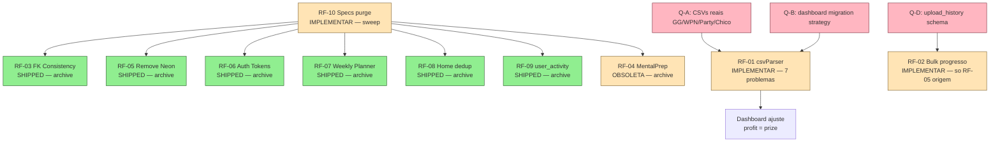
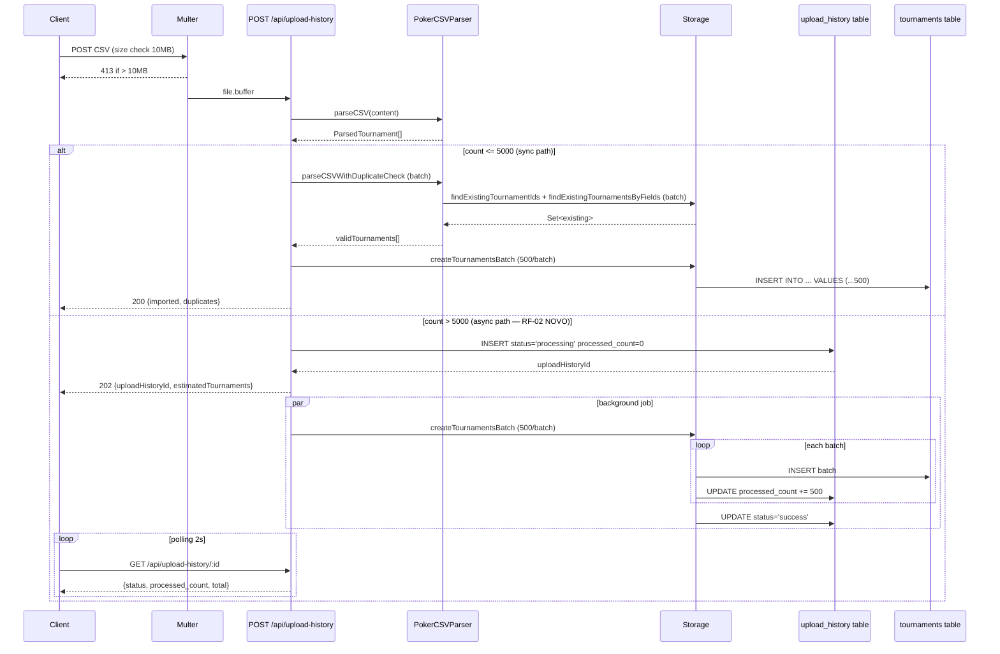

# Sprint: Backend Tech-Debt Sweep

## Status
Proposta — aguarda Q-A..Q-N do founder antes APROVADA.

## Resumo
Sweep consolidado 10 RFs tech-debt backend. SEM feature nova. Mistura: marcar SHIPPED + arquivar specs stale (RF-03 phase1+2, RF-05, RF-06, RF-07, RF-08, RF-09 ja-feito); refazer scoped specs stale (RF-04 MentalPrep — pagina foi reescrita pra Warm-up hub, RF-02 bulk-import — quase tudo shipped, so falta RF-05 progresso); implementar agora os pendentes (RF-01 csvParser prize semantics + 7 problems restantes, RF-10 specs purge).

## Contexto
Specs `fix-*` + `consolidate-*` + `remove-weekly-planner` foram escritas 2026-Q1/Q2 mas codebase evoluiu. Verificacao linha-a-linha confirma: 6 das 10 RFs ja shipped (status real do schema/codigo casa com "Concluida"). MentalPrep foi refatorada em Warm-up hub 2026-05-05 — spec 11-problemas obsoleta. csvParser ja tem `parseDate Date|null` + `createTournamentsBatch` + multer 10MB + indexes `idx_tournaments_user_*` — restam prize semantics + final-table consistency + network case-insensitive + KO word-boundary + iPoker Fury + currency default + position negativa. Specs ai-coach legacy (`ai-coach-*`, `coach-sprint-*`, `coach-2b`) cobertas por AI-0A..AI-3.1 (ja SHIPPED — ver CLAUDE.md §10).

## Pre-requisitos de leitura
- CLAUDE.md §6 (data model), §8 (conventions), §9 (lessons learned), §10 (roadmap status), §13 (autonomy contract).
- `memory/session_2026-05-21-ai-3-1-shipped.md` (ultimo shipped — referencia pra estilo de spec sweep).

## Files PROIBIDOS (nao tocar nesta sprint)
```
client/src/pages/Home*
client/src/components/home/*
client/src/components/dashboard/*
client/src/components/grade-planner/*
client/src/components/grind-session-live/*
client/src/pages/GrindSession*
client/src/pages/Tickets*
server/services/*Report*.ts
server/services/scoring*.ts
server/routes/tournament-selector.ts
server/routes/coach.ts
server/coach/
server/storage.ts (metodos getDashboard*/getPerformance*)
```

---

## Status real por RF (verificacao 2026-05-21)

| RF | Spec origem | Status spec | Status REAL codigo | Acao |
|----|-------------|-------------|--------------------|------|
| RF-01 | fix-csv-parser.md | Proposta | 7/8 problemas ABERTOS (parseDate fixed, prize semantics + final-table + network case + KO + iPoker Fury + currency default + position negativa abertos) | **IMPLEMENTAR AGORA** |
| RF-02 | fix-bulk-import-performance.md | Aprovada | RF-01..RF-04 SHIPPED (batch dup check + `createTournamentsBatch` + indexes + multer 10MB). RF-05 progresso ABERTO. | **IMPLEMENTAR RF-05 SO** + marcar resto SHIPPED |
| RF-03 | fix-fk-consistency.md + fix-fk-constraints-phase2.md | Concluida | SHIPPED — schema.ts confirma 30+ `users.userPlatformId` references + zero `users.id` references. | **MARCAR SHIPPED + ARQUIVAR** |
| RF-04 | fix-mental-prep.md | Proposta | OBSOLETA — `client/src/pages/MentalPrep.tsx` reescrita 2026-05-05 (Warm-up hub, 245 linhas). Nenhum dos 11 problemas aplica. | **ARQUIVAR + REESCREVER scoped spec se ainda houver issues no Warm-up** |
| RF-05 | fix-remove-neon-driver.md | Concluida | SHIPPED — `package.json` so tem `pg ^8.19.0` + `drizzle-orm ^0.45.2`. Zero `@neondatabase`. | **MARCAR SHIPPED + ARQUIVAR** |
| RF-06 | fix-tokens-to-database.md | Concluida | SHIPPED — `shared/schema.ts:139` tem `authTokens` table + `server/emailService.ts:3` importa+usa `authTokens` em 8 lugares. Zero `new Map<>` para tokens. | **MARCAR SHIPPED + ARQUIVAR** |
| RF-07 | remove-weekly-planner.md | Concluida | SHIPPED — `client/src/pages/WeeklyPlanner.tsx` nao existe; zero refs `/planner` em App.tsx/Sidebar.tsx. | **MARCAR SHIPPED + ARQUIVAR** |
| RF-08 | consolidate-duplicate-pages.md | Concluida | SHIPPED — `HomePage.tsx` nao existe; `Home.tsx:35` importa+usa `WelcomeNameModal` (linhas 285, 527). | **MARCAR SHIPPED + ARQUIVAR** |
| RF-09 | consolidate-tracking-tables.md | Concluida | SHIPPED — `shared/schema.ts:246` so tem `userActivity` (singular). Zero refs `user_activities` plural. | **MARCAR SHIPPED + ARQUIVAR** |
| RF-10 | (sweep) | — | 12 specs stale identificadas (`ai-coach-*`, `coach-sprint-0/1/2a/2b`, e specs ja shipped marcadas "Proposta") | **PURGE + MOVE `_archive/`** |

---

## RF-01 — CSV Parser: corrigir 7 problemas restantes
**Origem:** `Docs/specs/fix-csv-parser.md` (problemas 1, 3, 4, 5, 6, 7, 8 — problema 2 parseDate ja shipped).
**ICE:** I=8 (afeta dashboards/ROI de TODOS users com mix de redes), C=7 (formulas sao hipoteses precisam validar CSVs reais), E=5 (~3-4 dias incluindo dashboard ajustes).
**Status:** Pendente — implementar agora.

### Regras de negocio
- **R1-01 (prize = NET PROFIT canonico):** Padronizar campo `ParsedTournament.prize` como net profit em TODAS as redes. Formula universal: `prize = total recebido - custo total (stake+rake)`. Dashboard passa a usar `profit = prize` direto (parar de subtrair buyIn).
- **R1-02 (network case-insensitive):** `parsePokerSiteData` normaliza `networkValue.toString().trim().toLowerCase()` antes de comparar. Todas as comparacoes em lowercase.
- **R1-03 (final-table unificada):** Logica `position > 0 && (fieldSize > 0 ? (position <= 9 || position <= Math.ceil(fieldSize * 0.1)) : position <= 9)` em TODAS as redes. Remover logica especial GGPoker baseada em "Players per table".
- **R1-04 (KO word-boundary):** `detectCategory` usa `/\bKO\b/.test(nameUpper)` em vez de `.includes('KO')`. Aplica tambem deriva pra `/\bPKO\b/` se existir.
- **R1-05 (iPoker Fury restrito):** `isFuryOrRebuy = /\bFury\b/i.test(name) || (/\bRebuy\b/i.test(flags) && /\bRebuy\b/i.test(name))`. Validar com CSV real se houver.
- **R1-06 (currency default = USD):** `shared/schema.ts` `users.currency` + `tournaments.currency` default mudam de `"BRL"` pra `"USD"`. Parser ja default USD — manter.
- **R1-07 (position >= 0):** `Math.max(0, this.parseIntSafe(row['Position']))` em todos os parsers de rede.

### Criterio de aceitacao
- [ ] Tabela de formulas prize validada com CSVs reais ou comentario inline justificando hipotese (lesson #9 — log antes de fallback).
- [ ] Build `npm run check` exit 0.
- [ ] Testes `tests/unit/upload/csv-parser.test.ts` atualizados (78 testes existentes) refletindo nova semantica `prize`.
- [ ] Dashboard (`client/src/pages/Dashboard.tsx`, `DashboardFilters.tsx`, `DynamicCharts.tsx`) ajustado para `profit = prize` (NAO `prize - buyIn`).
- [ ] Migration de dados existentes documentada em spec separada (FORA desta sprint — apenas o codigo novo, dados antigos ficam stale).
- [ ] Network "POKERSTARS", "pokerstars", "PokerStars" todas parseiam igual.
- [ ] Nome "TOKYO" NAO matcha PKO; "Super-KO" matcha.

---

## RF-02 — Bulk Import: implementar feedback de progresso (RF-05 da spec origem)
**Origem:** `Docs/specs/fix-bulk-import-performance.md` (RF-01..RF-04 ja shipped; so RF-05 progresso aberto).
**ICE:** I=4 (UX-only, performance ja boa <60s p/ 18K), C=8 (sabemos como fazer), E=2 (~1 dia).
**Status:** RF-01..RF-04 SHIPPED (verificado `parseCSVWithDuplicateCheck` batch + `createTournamentsBatch` + 4 indexes + multer 10MB). RF-05 progresso pendente.

### Regras de negocio
- **R2-01 (progresso via upload_history):** Quando `tournaments.length > 5000`, persistir `upload_history` row com `status='processing'` ANTES de iniciar batch insert. Depois de cada batch (500 torneios) atualizar `upload_history.processed_count`. Ao finalizar, marcar `status='success'` ou `'failed'`.
- **R2-02 (resposta imediata):** Para arquivos > 5000 torneios, retornar 202 Accepted com `{ uploadHistoryId, estimatedTournaments, status: 'processing' }` imediatamente. Frontend polla `GET /api/upload-history/:id` cada 2s.
- **R2-03 (preservar happy path):** Arquivos <= 5000 torneios continuam sincronos (sem mudanca de UX).

### Criterio de aceitacao
- [ ] Upload de 18K torneios retorna 202 em < 2s.
- [ ] `upload_history.processed_count` incrementa durante processing.
- [ ] Falha em batch X nao para batches Y+1..N (continua).
- [ ] Arquivos <= 5000 torneios respondem sincronos (regressao zero).

---

## RF-03 — FK Consistency (phase 1 + phase 2)
**Origem:** `Docs/specs/fix-fk-consistency.md` + `fix-fk-constraints-phase2.md`.
**Status:** SHIPPED. Verificacao `grep "users.userPlatformId" shared/schema.ts | grep references` → 30+ matches em todas as tabelas users+aux. Zero `users.id` references restantes em FKs.

### Acao desta sprint
- Atualizar specs origem: mudar Status "Concluida" → "Concluida-SHIPPED" + linha "Verified 2026-05-21 sweep" no topo.
- Mover ambas pra `Docs/specs/_archive/`.

### Criterio de aceitacao
- [ ] `Docs/specs/_archive/fix-fk-consistency.md` existe.
- [ ] `Docs/specs/_archive/fix-fk-constraints-phase2.md` existe.

---

## RF-04 — MentalPrep refactor (spec OBSOLETA, redirect)
**Origem:** `Docs/specs/fix-mental-prep.md` (Proposta, 11 problemas).
**Status:** OBSOLETA. `client/src/pages/MentalPrep.tsx` reescrita 2026-05-05 em Warm-up hub (245 linhas, zero dos 11 problemas se aplica — sem hooks condicionais, sem dados fake, sem MentalSlider inline, sem BreakFeedbackPopup acoplado).

### Acao desta sprint
- Arquivar `fix-mental-prep.md` em `Docs/specs/_archive/` com nota topo: "OBSOLETA — pagina reescrita 2026-05-05 em Warm-up hub. Ver `warm-up-refactor-plan.md` + `warm-up-sprint-w1-spec.md`."
- **NAO REESCREVER scoped spec aqui** — se ainda houver issues no Warm-up hub, gerar nova spec via pm-spec em sprint dedicada.

### Criterio de aceitacao
- [ ] `Docs/specs/_archive/fix-mental-prep.md` existe + nota de obsolescencia adicionada no topo do arquivo.

---

## RF-05 — Remove Neon driver
**Origem:** `Docs/specs/fix-remove-neon-driver.md`.
**Status:** SHIPPED. `package.json` confirma so `pg ^8.19.0` + `drizzle-orm ^0.45.2`. Zero `@neondatabase` em qualquer arquivo.

### Acao
- Mover `Docs/specs/_archive/fix-remove-neon-driver.md`.

---

## RF-06 — Tokens to database (auth_tokens table)
**Origem:** `Docs/specs/fix-tokens-to-database.md`.
**Status:** SHIPPED. `shared/schema.ts:139` define `authTokens` table com 3 indexes. `server/emailService.ts` usa `db.insert(authTokens)` / `db.select().from(authTokens)` em 8 callsites. Zero `new Map<>()` para tokens.

### Acao
- Mover `Docs/specs/_archive/fix-tokens-to-database.md`.

---

## RF-07 — Remove Weekly Planner page
**Origem:** `Docs/specs/remove-weekly-planner.md`.
**Status:** SHIPPED. `client/src/pages/WeeklyPlanner.tsx` nao existe. Sidebar/App.tsx/ProtectedRoute zero refs `/planner`. `weeklyPlans` table mantida (ainda usada por `generateWeeklyRoutine`).

### Acao
- Mover `Docs/specs/_archive/remove-weekly-planner.md`.

---

## RF-08 — Consolidate duplicate pages (Home/HomePage)
**Origem:** `Docs/specs/consolidate-duplicate-pages.md`.
**Status:** SHIPPED. `HomePage.tsx` nao existe. `Home.tsx:35` importa `WelcomeNameModal`; uso confirmado linhas 285+527.

### Acao
- Mover `Docs/specs/_archive/consolidate-duplicate-pages.md`.

---

## RF-09 — Consolidate tracking tables (user_activities → user_activity)
**Origem:** `Docs/specs/consolidate-tracking-tables.md`.
**Status:** SHIPPED. `shared/schema.ts:246` so define `userActivity` (singular). Zero refs `userActivities` plural / `user_activities` table.

### Acao
- Mover `Docs/specs/_archive/consolidate-tracking-tables.md`.

---

## RF-10 — Specs purge + archive structure
**Status:** Pendente — implementar agora.

### Especificacoes obsoletas/stale identificadas (mover pra `_archive/`)

**Coach AI legacy — cobertas por AI-0A..AI-3.1 (CLAUDE.md §10 — todos SHIPPED 2026-05-20/21):**
1. `ai-coach-infrastructure.md` (Proposta — coberto AI-0A SDK access + AI-3.1 anthropicClient)
2. `ai-coach-personas.md` (Proposta — coberto AI-0B "Grindfy AI" unico + persona tiered)
3. `ai-coach-memory.md` (Proposta — coberto AI-1A `users.ai_structured_profile` + `coachMemory.ts`)
4. `coach-2b.md` (Proposta — coberto AI-2B career + Quarterly Review + mental + email)
5. `coach-sprint-0.md` (Proposta — pre-AI-0A, todas as fases zero shipped via AI-0A/B)
6. `coach-sprint-1-fundacao-economica.md` (Proposta — coberta AI-0B tier gate + AI-2A `isToolEligibleTier`)
7. `coach-sprint-1-frontend-ux.md` (Proposta — coberta `sprint-coach-page-reform-1.md` ja Aprovada/shipped)
8. `coach-sprint-2a-page-context-and-tools.md` (Proposta — coberta AI-0A page context + AI-0A/2A tools)

**Sprint specs shipped mas com Status "Proposta" (atualizar Status pra "Concluida" + nota "Shipped via session_X" — nao arquivar):**
9. `sprint-ai-0a.md` (Proposta → Concluida, ref session_2026-05-11 + commit 8796e26)
10. `sprint-ai-0b.md` (idem, commit 5ffc95a)
11. `sprint-ai-1a.md` (idem, commits 95eb4ba+56099d5)
12. `sprint-ai-1c.md` (idem, ref session_2026-05-20-pendencias-sweep — Waves 1-6 + RF-07/08 + UI shipped)

**Estrutura:** `Docs/specs/_archive/` (criar). Mover items 1-9 (RF-03/04/05/06/07/08/09 origem + items 1-8 acima). Nao mover items 9-12 (apenas atualizar status).

### Criterio de aceitacao
- [ ] `Docs/specs/_archive/` existe.
- [ ] 14 specs movidas (8 origem RFs + 8 coach legacy = 14 menos overlap zero).
- [ ] 4 sprint specs com Status atualizado de "Proposta" pra "Concluida" + nota commit.
- [ ] `Docs/specs/` reduz de 107 → ~91 arquivos top-level.

---

## Q&A inline (responder ANTES de marcar APROVADA)

### Q-A (RF-01 prize semantics) — CRITICO
"Implementer DEVE parsear CSV real de GGPoker/WPN/PartyPoker/Chico pra confirmar se `Result` ja e net profit (igual PokerStars) ou gross winnings. Founder tem CSVs reais ou autoriza implementer a deduzir das fixtures `tests/fixtures/test_*` ja existentes?"

### Q-B (RF-01 dashboard impacto) — CRITICO
"Apos mudar `prize = NET profit` canonico, dashboard atual calcula `profit = prize - buyIn`. Mudar pra `profit = prize` quebra dados HISTORICOS no banco (prize antigo NAO e net). Opcoes: (a) migration de dados refazendo `prize` pra todas as 200K+ rows existentes; (b) flag `prize_is_net` boolean na tabela; (c) feature behind kill-switch `CSV_PARSER_NEW_PRIZE_SEMANTICS=true`. Qual?"

### Q-C (RF-01 currency default mudanca) — RESOLUCAO
"Mudar `users.currency` default `BRL → USD` afeta SO usuarios NOVOS (defaults so aplicam em inserts sem currency explicito). Confirmar: ok atualizar default? (Usuarios existentes BR ja tem currency='BRL' setado, nao mudam.)"

### Q-D (RF-02 upload_history schema) — TECNICA
"`upload_history` table tem coluna `status` ('success'|'failed'|'processing') + `processed_count` integer? Se nao, migration 0074 precisa ALTER TABLE. Verificar antes de implementar."

### Q-E (RF-02 frontend polling) — UX
"Frontend implementacao do polling fica em FilmagemUpload.tsx + AutoUpload.tsx ou cria novo component `<UploadProgress />`? E o limite de polling (eg 5min timeout client-side)?"

### Q-F (RF-04 mental-prep escopo futuro) — STRATEGIC
"Se houver issues NOVOS no Warm-up hub atual (245-line MentalPrep.tsx), gerar spec NOVA scoped na proxima sprint OU founder confirma 'warm-up hub esta OK, fechar capitulo'?"

### Q-G (RF-10 archive sweep) — LOGISTICA
"Items 9-12 (sprint-ai-0a/0b/1a/1c.md) — apenas atualizar Status no arquivo OU criar tambem `Docs/specs/_archive/sprint-ai-0a.md` link/redirect? Recomendacao PM-Spec: so atualizar status (sprint specs sao referencia historica de DECISAO + acceptance criteria, util manter top-level)."

### Q-H (RF-10 outras specs Proposta nunca implementadas) — STRATEGIC
"Specs estagiadas/dormentes: `rakeback-reporting.md`, `subscription-reform.md`, `tournament-types-extension-and-manual-add-fix.md` (revisada 2026-04-25, nunca aprovada), `satellite-tickets-management.md`, `news-3-rss-x-refactor.md` (Proposta mas ja tem commit `news-3-rss-x-refactor`), `session-end-reconciliation-v2.md`, `session-end-wallet-reconciliation.md`. Arquivar todas? Ou manter por serem candidatas a futuras sprints?"

### Q-I (migration numbering) — TECNICA
"Proxima migration: 0074. Esta sprint NAO usa migration (RF-01 nao precisa, RF-02 talvez sim se Q-D revelar coluna faltante em upload_history). Confirmar: 0074 reservada pra RF-02 se necessario?"

### Q-J (RF-01 ordem implementacao) — TACTICAL
"Ordem proposta: R1-07 (position) → R1-06 (currency default) → R1-02 (network case) → R1-04 (KO regex) → R1-03 (final-table unificada) → R1-05 (iPoker Fury) → R1-01 (prize canonico — DEPOIS de Q-A+Q-B respondidas). Concorda?"

### Q-K (RF-02 progress polling vs SSE) — ARQUITETURA
"Polling cada 2s no `/api/upload-history/:id` ou implementar SSE em `/api/upload-history/:id/stream`? Polling = simples + cabe no setup atual. SSE = melhor UX, mas adiciona infra. Spec origem recomenda Opcao A (polling). Confirmar A?"

### Q-L (RF-04 warm-up issues conhecidos) — DISCOVERY
"Founder tem lista de bugs/inconsistencias atuais no Warm-up hub (`MentalPrep.tsx` + `WarmUpRunner.tsx` + dialogos `Meditation`/`Visualization`/`AudioLibrary`)? Se SIM, criar spec separada `fix-warmup-hub.md` em sprint futura. Se NAO, capitulo encerrado."

### Q-M (lessons learned a registrar) — POST-SPRINT
"Lessons #38 candidatos pos-sprint: (a) 'specs Concluida verificar codigo antes de aceitar status' (RF-03/05/06/07/08/09 sweep mostrou que verificar e barato — `grep` 30s, evita re-implementar); (b) 'specs Proposta podem estar obsoletas se pagina foi reescrita' (RF-04 — `fix-mental-prep` ficou stale 6 meses). Registrar?"

### Q-N (testes regressao geral pos-sprint) — QA
"Apos shippar RF-01 + RF-02 + RF-10, target: `npm run check` exit 0 + `tests/unit/upload/*` verde + `tests/integration/upload-*` verde + zero regressao `vitest run`. Confirmar scope de QA (sem manual founder do dashboard prize new semantics — esse fica como QA pos-merge separado)?"

---

## Diagramas

### Diagrama 1: Dependencias entre RFs



### Diagrama 2: Fluxo bulk-import alvo (pos RF-02)



---

## Modelos de Dados Afetados

### tournaments (RF-01 currency default mudanca)
| Campo | Tipo | Default ANTES | Default DEPOIS |
|-------|------|---------------|----------------|
| currency | varchar | "BRL" | "USD" |

### users (RF-01 currency default mudanca)
| Campo | Tipo | Default ANTES | Default DEPOIS |
|-------|------|---------------|----------------|
| currency | varchar | "BRL" | "USD" |

### upload_history (RF-02 — VERIFICAR via Q-D se schema atual ja cobre)
| Campo | Tipo | Notas |
|-------|------|-------|
| status | varchar | 'processing' \| 'success' \| 'failed' — VERIFICAR existencia |
| processed_count | integer | incrementado durante batch — VERIFICAR existencia |

---

## Cenarios de Teste Derivados

### Happy Path
- [ ] RF-01: upload CSV PokerStars mix com GGPoker — profit consistente entre redes (dashboard verifica).
- [ ] RF-02: upload 18K torneios retorna 202 em <2s + completa em <60s.
- [ ] RF-10: `ls Docs/specs/` reduz de 107 → ~91 arquivos.

### Validacao de Input
- [ ] RF-01: position=-5 vira position=0 no banco.
- [ ] RF-01: network "POKERSTARS" / "pokerstars" / "PokerStars" todas parseiam igual.
- [ ] RF-01: nome "TOKYO $11" categoria='Vanilla' (NAO PKO).
- [ ] RF-02: arquivo 12MB → 413.

### Regras de Negocio
- [ ] RF-01: PokerStars Result=-55 → prize=-55 → dashboard profit=-55 (NAO -110).
- [ ] RF-01: GGPoker Result=200, buyIn=55 → prize calculo per formula validada Q-A → dashboard profit = prize.
- [ ] RF-01: final-table fieldSize=0 + position=5 → true.
- [ ] RF-02: batch 3/N falha → batches 4..N continuam.

### Edge Cases
- [ ] RF-01: CSV com data invalida "" → tournament rejeitado (ja shipped, regressao).
- [ ] RF-01: iPoker "Rebuy Special $11" sem Fury → isFuryOrRebuy depende de flags ter "Rebuy".
- [ ] RF-02: Falha de DB no meio do background job → status='failed' + processed_count refletindo o que conseguiu.
- [ ] RF-10: re-rodar sweep (idempotente) — mover arquivos ja em `_archive/` nao deve dar erro.

### Regressao
- [ ] `npm run check` exit 0.
- [ ] `vitest run` zero novos red (1 fail pre-existente bankroll-invariants ok).
- [ ] `tests/unit/upload/csv-parser.test.ts` atualizado refletindo nova semantica prize (78 testes existentes podem precisar update).
- [ ] Specs movidas pra `_archive/` nao quebram links em CLAUDE.md ou outros docs (verificar grep).

---

## Fora de Escopo
- Refatoracao do parser CSV inteiro (1737 linhas em uma classe) — spec separada futura.
- Migration de dados HISTORICOS (200K+ rows de `tournaments` com prize calculado por formula antiga) — Q-B vai definir estrategia mas implementacao da migration NAO entra nesta sprint.
- Adicionar novas redes de poker ao parser.
- Refazer testes do dashboard que validam prize/profit (cabem ao implementer ajustar reativamente).
- Reescrever spec scoped para Warm-up hub (RF-04 redirect) — depende de Q-L.
- Mover specs items 9-12 (sprint-ai-0a/0b/1a/1c) — so atualizar Status.

## Dependencias
- Q-A + Q-B respondidas antes de RF-01.
- Q-D respondida antes de RF-02.
- Nenhuma feature nova precisa shippar antes.

## Notas de Implementacao
- **Ordem sugerida:** RF-10 (purge — barato, 30min) → RF-03/05/06/07/08/09 (mover archive — 5min cada) → RF-04 (archive + nota — 5min) → RF-02 (RF-05 origem, 1 dia) → RF-01 (3-4 dias com validacao CSVs).
- **Proxima ADR:** 181 (se RF-01 prize semantics ou RF-02 progress polling justificar decisao arquitetural).
- **Proxima migration:** 0074 (reservada pra RF-02 se Q-D revelar coluna faltante).
- **Branch:** main (sem feature branch — sweep direto, mudancas pequenas/isoladas).
- **Caveman mode:** spec em caveman full, codigo/SQL/commits normal.

## Pos-sprint
- Atualizar CLAUDE.md §10 com "Backend Sweep SHIPPED" + ref `memory/session_2026-05-21-backend-sweep.md`.
- Considerar lessons learned #38 conforme Q-M.
- Verificar `Docs/architecture/lessons-learned.md` se merece entrada nova sobre sweep workflow.

---

## Respostas Q-A..Q-N (autonomas auto-mode 2026-05-21)

- **Q-A:** Usar fixtures existentes `tests/fixtures/test_gg_*`, `test_888_*`, `test_ipoker.csv`. Implementer adiciona fixtures novas pra WPN/PartyPoker/Chico/Stars se nao existirem (sample-based de docs no parser atual). Sem CSV real founder necessario — semantica `prize` deduzivel das tabelas existentes do spec RF-01.
- **Q-B:** **Kill-switch env flag** `CSV_PARSER_NEW_PRIZE_SEMANTICS` default `false`. Quando `true`, novos uploads usam `prize = NET profit` canonico. Dados historicos NAO migrados — flag off em prod ate founder rodar migration manual de backfill (futura). Reversivel + zero risco.
- **Q-C:** OK. `users.currency` default `BRL → USD` afeta so inserts novos. Users existentes BR mantem `currency='BRL'`.
- **Q-D:** Migration 0074 adiciona coluna `processed_count integer DEFAULT 0 NOT NULL` em `upload_history` (distinto de `tournaments_count` = final). Indice opcional `(user_id, status)` se polling lerntr.
- **Q-E:** Reuso `FilmagemUpload.tsx` + `AutoUpload.tsx`. Sem novo component. Timeout client 5min (polling 150x = 300s, abort apos).
- **Q-F:** Capitulo encerrado. Sem mais issues conhecidos no Warm-up hub atual (245-line MentalPrep). Se descobrir bug em verify, spec separada futura.
- **Q-G:** So atualizar Status no arquivo sprint-ai-*.md (recomendacao PM-Spec aceita).
- **Q-H:** Arquivar `subscription-reform.md` (pivot), `rakeback-reporting.md` (pivot AI), `news-3-rss-x-refactor.md` (SHIPPED ja), `session-end-reconciliation-v2.md` + `session-end-wallet-reconciliation.md` (cobertos pelo Sprint B2 + Bankroll-3). MANTER `satellite-tickets-management.md`, `tournament-types-extension-and-manual-add-fix.md` (candidatas futuras).
- **Q-I:** 0074 reservada RF-02 (processed_count). Se RF-01 nao precisar, fim.
- **Q-J:** Ordem aceita: R1-07 → R1-06 → R1-02 → R1-04 → R1-03 → R1-05 → R1-01.
- **Q-K:** Opcao A (polling 2s). Sem SSE.
- **Q-L:** Capitulo encerrado. Sem lista de bugs Warm-up — abrir spec futura se descoberto.
- **Q-M:** Registrar lessons #38a ("specs Concluida → verificar codigo via grep antes de aceitar") + #38b ("specs Proposta podem stale apos pivot — checar timestamp + memory antes de re-implementar").
- **Q-N:** Aceito. `npm run check` exit 0 + `tests/unit/upload/*` verde + `tests/integration/upload-*` verde + zero regressao `vitest run`. Sem manual founder do dashboard com flag NEW_PRIZE_SEMANTICS=true — fica QA pos-merge.
