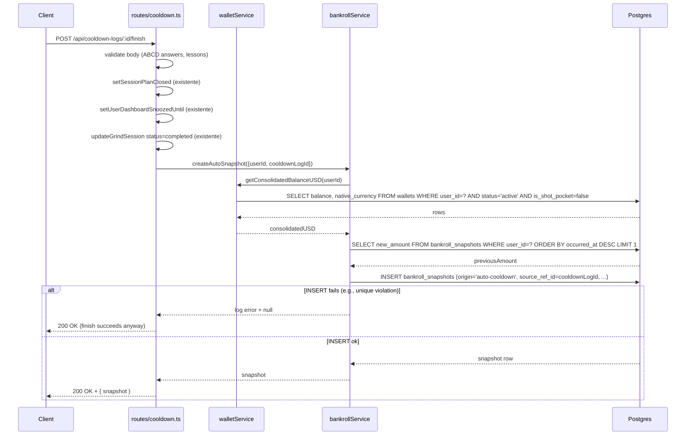
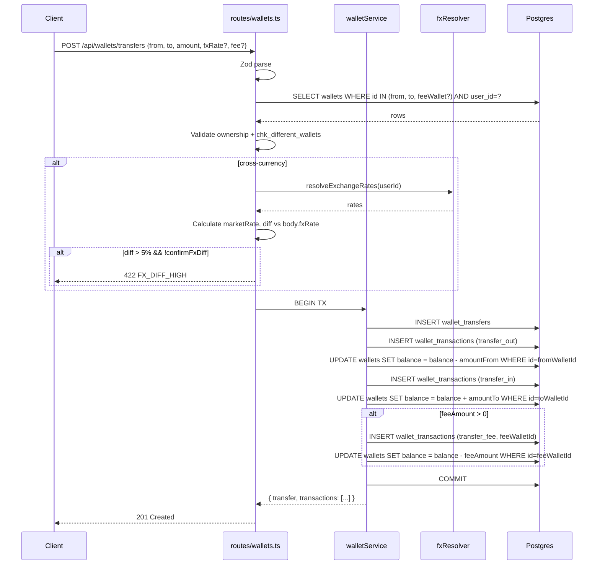
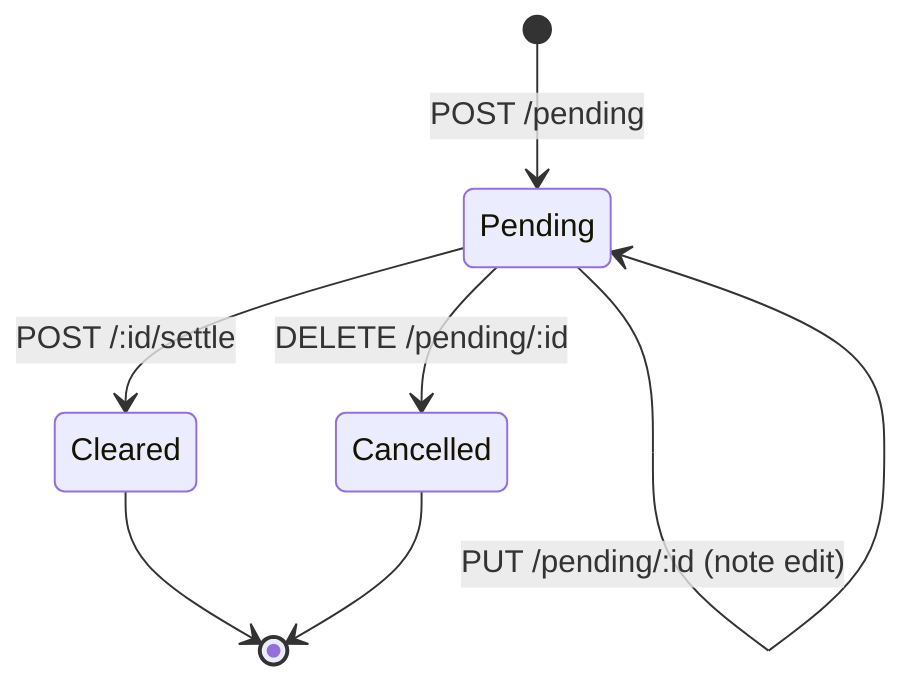
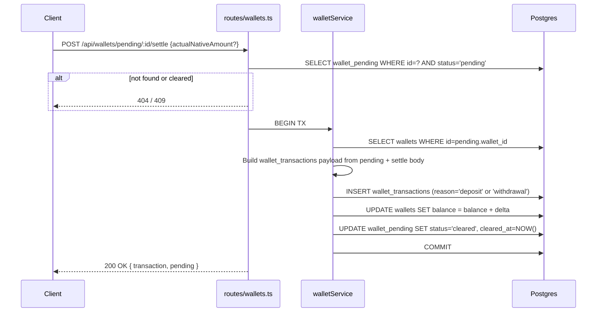
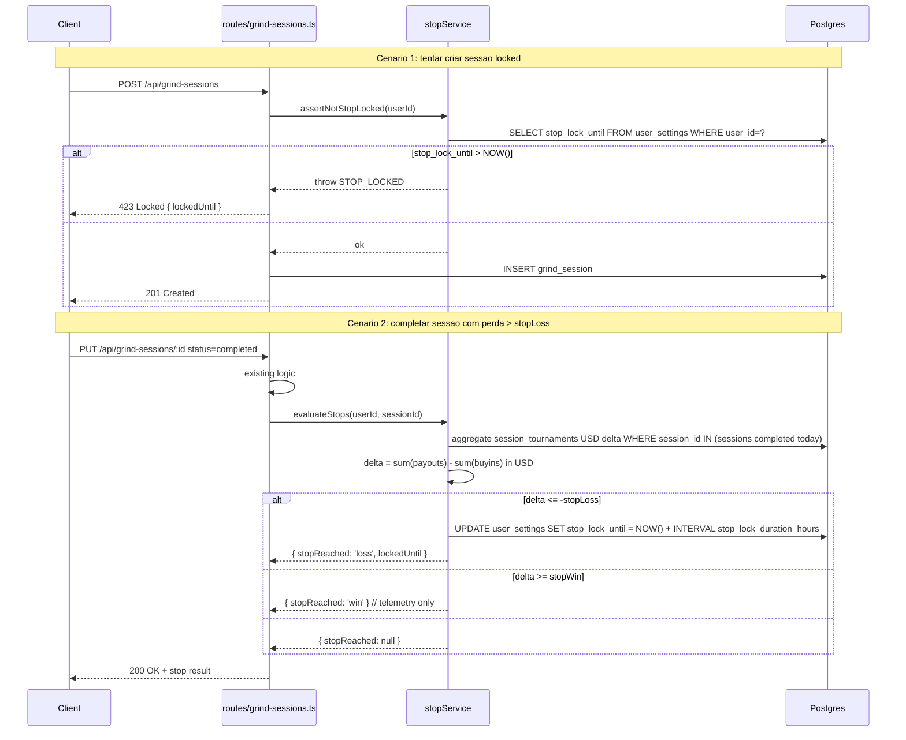
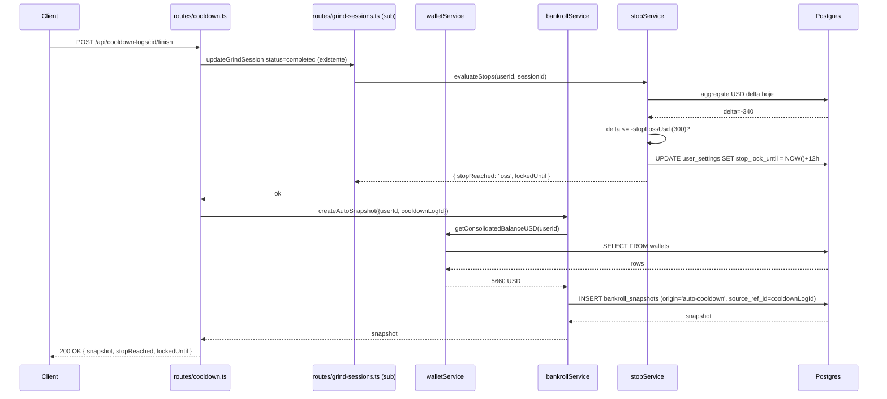
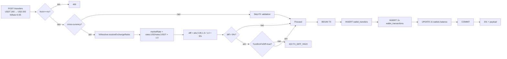

# Spec: Sprint Bankroll-3 — Auto-snapshot, Transferencias, Pending, Stops, ROI por plataforma + Debt B2/F4

## Status
Proposta — pronta para System-Architect (RF-4, RF-5, RF-8 exigem ADRs novos).

## Visao Geral

Sprint Bankroll-3 fecha o "loop financeiro" do multi-wallet: cada cooldown encerrado vira snapshot historico (RF-2), o jogador consegue mover dinheiro entre wallets sem hack manual (RF-4), declara depositos/saques pendentes (RF-5), define limites diarios de stop-loss e stop-win (RF-6) e enxerga ROI por plataforma no dashboard (RF-7). Tres melhorias de RF na cadeia de reconcile (RF-3 auto-bind torneio→wallet, RF-8 auto_snapshot_meta) completam o bloco MUST.

A sprint tambem paga divida tecnica acumulada nas Sprints B2 e F4: extracao de `BankrollReconcileSection` (RF-9), limpeza de CTAs legacy do summary (RF-10), unificacao do resolver de FX (RF-11) e correcao de cache vazado entre usuarios em hooks F4 (RF-12). Nada de staking, cripto live rate, CSV bancario ou rebalanceamento — esses ficam para sprints posteriores.

A spec parte de cinco invariantes nao negociaveis herdadas de B/B2:
1. Wallet ledger e imutavel (ADR-017). Toda mudanca de saldo passa por `wallet_transactions`.
2. Conversao FX usa convencao QW-1: `rates[ccy] = unidades de ccy por 1 USD` (ADR-033).
3. Optimistic concurrency em `wallet_transactions` via `expectedVersion` (ADR-038).
4. Reconcile pos-sessao acontece inline no `SessionSummaryModal` (ADR-047).
5. Cooldown `finish` ja chama `walletService.recordTransaction` para casar saldo final reportado (ADR-053).

Sprint roda em **branch `feature/bankroll-3`** (worktree `B:\grindfy-bankroll3`), criada de `main`. Modo auto, founder AFK ate amanha. Decisoes ambiguas resolvidas via defaults D1-D12 (secao dedicada).

---

## Goals / Non-Goals

### Goals
1. Toda finalizacao de cooldown gera snapshot consolidado automatico (RF-2).
2. Reconcile no summary deixa de "perder" plataformas jogadas sem wallet — sugere wallet candidata via heuristica (RF-3).
3. Transferencia cross-wallet com FX explicito virou primitive (RF-4), com tabela `wallet_transfers` rastreavel.
4. Depositos/saques em transito declarados sem inflar saldo (RF-5).
5. Stop-loss/stop-win em USD bloqueiam novas sessoes apos lock diario (RF-6).
6. Dashboard expoe ROI por plataforma (30d default, top 10) (RF-7).
7. `bankroll_snapshots.origin` permite filtrar manual vs automatico (RF-8).
8. `BankrollReconcileSection` extraido reduz `SessionSummaryModal` para < 200 linhas (RF-9).
9. `summary-modal-cta-*` legacy removidos, restando apenas CTAs B2 (RF-10).
10. Resolver de FX unificado em `fxResolver.ts`, 3 callsites convertidos (RF-11).
11. QueryKey das 3 hooks F4 inclui userId — sem cache cross-user (RF-12).

### Non-Goals (esta sprint)
- Staking / makeup ledger (sprint Bankroll-4 candidata).
- Cripto live rate (depende de provider externo, fora).
- CSV import bancario (escopo bankroll v3+).
- Rebalanceamento automatico entre wallets (depende de UX research).
- Export contabil (Q3 2026).
- Multi-currency display em todas as telas (ja resolvido por `bankrollDisplayCurrency` em B2).
- Refactor visual de cooldown / prints (Sprint F).

### Posicao no roadmap
- Predecessoras: Bankroll-2 (commit `69c03c7`), Bankroll-2.1 (commit `3c31b28`), B2 (commit `1dca493`), F3 stats analyzer (branch merged), F4 primedope (branch `feature/f4-primedope`, db:push pendente).
- Sucessoras candidatas: Bankroll-4 (staking), Sprint F (cooldown revamp + prints).

---

## Usuarios

- **Jogador multi-wallet (default):** termina cooldown e ve "Snapshot salvo as 03:14" no toast. Abre dashboard, ve card "ROI por plataforma" com Suprema 12% / GG 4% / iPoker -2% (30d).
- **Jogador BR multi-conta:** transfere R$5.000 da conta Itau (OffPlatform_Bank BRL) para Suprema (BRL) em um clique, com FX 1:1 e fee opcional. Sem ledger duplicado.
- **Jogador cross-currency:** moveu USDT 200 da Binance (OffPlatform_Crypto) para conta GG (USD). Sistema exige fxRate; se diff > 5% vs market (cascata users.exchangeRates), pede confirmacao.
- **Jogador disciplinado:** define stop-loss USD 300 / stop-win USD 800. Apos perder USD 320 num dia, sistema bloqueia `POST /api/grind-sessions` por 12h. Banner read-only em `/grind`.
- **Jogador deposito pendente:** declarou deposito de USDT 500 na CoinPoker as 14h. Wallet nao infla. Quando saldo materializa as 18h, clica "Settle" → vira `wallet_transactions` real, pending some.
- **Jogador casual:** `bankrollManagementEnabled=false` (B2). RF-2/3/4/5/6/7 todos no-op para ele. Banca legada continua funcionando.

### Glossario
- **Auto-snapshot:** snapshot gerado automaticamente apos cooldown finish, com `origin='auto-cooldown'`.
- **Transfer:** par de transactions `transfer_out` + `transfer_in` em duas wallets, agrupadas por `transfer_group_id` + linha em `wallet_transfers`.
- **Pending:** intencao registrada (deposit_pending / withdrawal_pending) sem afetar saldo. Materializada via "Settle" → vira tx real.
- **Stop lock:** janela temporal (`stop_lock_until`) durante a qual `POST /api/grind-sessions` retorna 423 Locked.
- **fxResolver:** servico unico que resolve `Record<currency, number>` (rates por USD) com cascata users > wallets > constants.
- **ROI por plataforma:** `(profitUSD / investedUSD) * 100`, agrupado por `tournaments.site`, somente sessoes `completed` e torneios com `total_invested > 0`.

---

## Defaults Autonomos D1-D12

Founder AFK; defaults aplicados sem perguntar:

| ID | Decisao | Justificativa |
|---|---|---|
| **D1** | `wallet_transfers.from_wallet_id` / `to_wallet_id` ON DELETE **RESTRICT** | Auditoria. Wallet com transfer historico nao pode ser deletada — usuario precisa archive primeiro. |
| **D2** | Auto-snapshot dentro da TX do cooldown finish; falha **logada** mas NAO bloqueia finish | Cooldown UX > consistencia historica. Retry async opcional via job futuro (out of scope). |
| **D3** | Stop-loss/stop-win em **USD consolidado**, reset diario **00:00 user TZ** (UTC fallback se TZ nao setada). Stop-win **nao bloqueia** (banner "Continuar mesmo assim"). Stop-loss bloqueia **12h default**. | USD eh fonte de verdade da banca. TZ do user evita reset confuso para BR. Stop-win nao bloqueia (jogador pode estar em rush legitimo). |
| **D4** | Cross-wallet transfer com moedas diferentes **exige fxRate explicito**. Fallback sugerido vem de `users.exchangeRates`. | Sem fallback automatico para evitar ledger errado. Sugestao OK. |
| **D5** | Dashboard ROI default **30d** + top **10 plataformas** | Janela analitica padrao do dashboard ja eh 30d. Top 10 evita poluicao visual. |
| **D6** | Migrations: `0017_wallet_transfers.sql`, `0018_auto_snapshot_meta.sql`, `0012_bankroll_management_enabled.sql` (rename ja feito) | Numeracao sequencial, sem gap. |
| **D7** | `BankrollReconcileSection` e **controlled** (sem state interno). Props minimas. | Reuso e testabilidade. State vive em `SessionSummaryModal`. |
| **D8** | Pending types: **`deposit_pending`** + **`withdrawal_pending`**. Cap **10 pending por wallet**. external_reference herdado de wallet_transactions. | Limita poluicao. Cap defensivo. |
| **D9** | fxResolver cascata: `users.exchangeRates` → `wallets.exchangeRates` → constants `{ BRL: 5.0, EUR: 0.93, CNY: 7.2, USDT: 1.0 }` | Mantem hierarquia Bankroll-2. Fallback robusto. |
| **D10** | Strategist sub-skill (se invocado) limita a **5 ideias top-ICE** | Evita scope creep do PM. |
| **D11** | Cross-wallet FX diff **> 5%** vs `fxResolver` resolved value exige confirmacao explicita | Captura erro de digitacao (ex: 50 BRL/USD em vez de 5.0). |
| **D12** | Subagente que falhar 3x consecutivas → fallback main thread, commit marcado `R<n>_FALLBACK` | Resiliencia. Loga em `memory/`. |

---

## Requisitos Funcionais

### RF-1: Rename Migration `0006` → `0012` (DONE)

#### Status
**Entregue antes desta spec.** Comitado em `feature/bankroll-3` HEAD.

#### Descricao
Migration `migrations/0006_bankroll_management_enabled.sql` colidia numericamente com `0006_bankroll_snapshots_wallet_columns.sql`. Renomeada para `0012_bankroll_management_enabled.sql` para sequencia limpa. Conteudo do arquivo (`ALTER TABLE user_settings ADD COLUMN bankroll_management_enabled BOOLEAN NOT NULL DEFAULT TRUE`) preservado.

#### Criterios de aceitacao
- [x] Arquivo `migrations/0012_bankroll_management_enabled.sql` existe.
- [x] Arquivo `migrations/0006_bankroll_management_enabled.sql` removido.
- [x] `migrations/0006_bankroll_snapshots_wallet_columns.sql` permanece intocado.
- [x] `npm run db:push` em ambiente clean nao falha por duplicidade de nome.
- [x] Drizzle journal (se aplicavel) atualizado para refletir novo nome.

#### Edge cases
- Branches paralelas (worktree A2, B2) que ainda referenciam `0006_bankroll_management_enabled.sql`: **nenhuma** referencia textual encontrada via grep no momento do rename.
- Producao: founder pode rodar `db:push` mais de uma vez; idempotente porque `IF NOT EXISTS` ja na migration original.

---

### RF-2: Auto-snapshot pos-cooldown

#### Descricao
Ao finalizar cooldown via `POST /api/cooldown-logs/:id/finish` (path real, ver `server/routes/cooldown.ts:175`), gerar `bankroll_snapshot` automatico refletindo saldos consolidados pos-reconcile. Snapshot tem `origin='auto-cooldown'`. Idempotente (1 snapshot por cooldown_log_id). Falha NAO bloqueia finish (D2).

#### Endpoints afetados
- `POST /api/cooldown-logs/:id/finish` — handler estendido para chamar `bankrollService.createAutoSnapshot(...)` apos `setSessionPlanClosed` e antes do response.

#### Schema / migrations

Reusa `bankroll_snapshots` (ja existe em schema, ver `shared/schema.ts:2295`). RF-8 adiciona coluna `origin` — RF-2 grava `auto-cooldown` nessa coluna. **Migration unica em RF-8.**

Idempotencia garantida via index unico parcial:

```sql
-- Parte da migration 0018_auto_snapshot_meta.sql (RF-8)
CREATE UNIQUE INDEX IF NOT EXISTS uq_bankroll_snapshots_cooldown
  ON bankroll_snapshots (user_id, source_ref_id)
  WHERE origin = 'auto-cooldown';
```

Coluna nova `source_ref_id varchar(64)` em `bankroll_snapshots` (parte da 0018). Para auto-cooldown, recebe `cooldown_log.id`.

#### Validacao Zod (snippet)

```ts
// server/services/bankrollService.ts — payload interno
const autoSnapshotInputSchema = z.object({
  userId: z.string().min(1),
  cooldownLogId: z.string().min(1),
  occurredAt: z.union([z.date(), z.string()]).optional(),
  // delta calculado server-side a partir do consolidado pre vs pos cooldown
});
```

#### Fluxo



#### Criterios de aceitacao
- [ ] Cooldown finish gera snapshot quando `bankrollManagementEnabled=true`.
- [ ] Cooldown finish **NAO** gera snapshot quando `bankrollManagementEnabled=false` (skip silencioso).
- [ ] Snapshot tem `origin='auto-cooldown'`, `source='auto_session'` (mantem semantica), `source_ref_id=cooldownLog.id`.
- [ ] Snapshot tem `delta = newAmount - previousAmount`. Se `delta=0`, snapshot ainda eh gravado (auditoria — registra "passou pelo cooldown sem mudanca").
- [ ] Idempotencia: 2 chamadas do mesmo `POST /finish` resultam em 1 snapshot (segunda viola unique index, log warn, nao quebra response).
- [ ] Falha de `INSERT` (DB indisponivel, unique violation, etc) **NAO** quebra finish: response continua 200 OK, erro logado via `console.error`.
- [ ] Telemetria emitida: `auto_snapshot_created` (sucesso) ou `auto_snapshot_failed` (catch).
- [ ] Response do `POST /finish` opcionalmente inclui `{ snapshot: {...} | null }` (additive).
- [ ] Snapshot delta consolidado em USD usa `walletService.getConsolidatedBalanceUSD` (helper existente — verificar se RF-7 reusa).

#### Casos de erro
- **previousAmount nao existe (primeiro snapshot do user):** previousAmount=0, delta=newAmount. Aceitavel.
- **wallets vazias (user fez archive de todas):** consolidatedUSD=0, delta=0-previousAmount. Snapshot grava com reason='manual_adjustment' (ja eh enum suportado).
- **Concorrencia (2 cooldowns finish quase simultaneos):** unique index garante 1 snapshot. Loser loga `auto_snapshot_duplicate_skipped`.

#### Edge cases
- Cooldown `mode='quick'` tambem dispara (mesmo handler).
- Cooldown finalizado de aba diferente: `cooldownLogId` no body identifica unicamente. Cliente pode estar stale; idempotency cobre.
- `bankrollManagementEnabled` mudou DURANTE o cooldown (off no comeco, on no fim): le no momento do finish (fonte de verdade atual).

---

### RF-3: Auto-bind torneio → wallet no reconcile

#### Descricao
Quando `GET /api/grind-sessions/:id/reconcilable-wallets` retornar `missingPlatforms.length > 0` (B2), o backend agora calcula tambem **`suggestedBindings: Array<{platform, suggestedCurrency}>`** usando `getCurrencyForSite` (`shared/wallet-reconciliation.ts` linhas 69-94, `SITE_DEFAULT_CURRENCY`). UI usa para pre-selecionar currency no `WalletCreateDialog` aberto inline pelo banner amber em `BankrollReconcileSection` / `SessionSummaryModal`.

Banner amber existente (B2) ganha:
- Linha por plataforma missing com dropdown "Wallet candidata: [nova com BRL]" pre-selecionado.
- Botao "Cadastrar com sugestao" reduz friccao em 1 clique.

#### Endpoints afetados
- `GET /api/grind-sessions/:id/reconcilable-wallets` — adiciona campo `suggestedBindings` no payload existente.

#### Schema / migrations
Nenhum DDL. Apenas evolucao do response shape.

#### Validacao Zod (snippet)

```ts
// server/routes/grind-sessions.ts (resposta)
const reconcilableResponseSchema = z.object({
  wallets: z.array(reconcilableWalletSchema), // existente B2
  playedPlatforms: z.array(z.string()),       // existente B2
  missingPlatforms: z.array(z.string()),      // existente B2
  suggestedBindings: z.array(z.object({       // NOVO RF-3
    platform: z.string(),
    suggestedCurrency: z.string().length(3).or(z.literal("USDT")),
    confidence: z.enum(["site_map", "alias_group", "fallback_usd"]),
  })),
});
```

`confidence`:
- `site_map` — match direto em `SITE_DEFAULT_CURRENCY`.
- `alias_group` — match via grupo (ex: 'Suprema' agrupa 'Suprema Poker', 'SupremaApp').
- `fallback_usd` — sem match, sugere USD.

#### Fluxo

```mermaid
flowchart TD
  A[GET reconcilable-wallets] --> B[getPlayedPlatforms B2]
  B --> C[findMissingPlatforms B2]
  C --> D{missingPlatforms<br>length > 0?}
  D -->|sim| E[map missing -> getCurrencyForSite]
  D -->|nao| F[suggestedBindings = []]
  E --> G[Build suggestedBindings array]
  F --> H[Response]
  G --> H
  H --> I[Cliente: BankrollReconcileSection]
  I --> J{tem suggestedBindings?}
  J -->|sim| K[Banner amber com dropdown pre-selecionado]
  J -->|nao| L[Banner amber generico]
  K --> M[Click 'Cadastrar com sugestao']
  M --> N[WalletCreateDialog defaultPlatform + defaultCurrency preenchidos]
```

#### Criterios de aceitacao
- [ ] `GET /reconcilable-wallets` resposta inclui `suggestedBindings` (array, possivelmente vazio).
- [ ] Para cada plataforma em `missingPlatforms`, existe entry correspondente em `suggestedBindings`.
- [ ] `confidence='site_map'` quando `SITE_DEFAULT_CURRENCY[platform]` direto.
- [ ] `confidence='fallback_usd'` quando nenhum match — sugere USD.
- [ ] Banner amber em `BankrollReconcileSection` mostra "Wallet candidata: [GG → USD]" pre-selecionado.
- [ ] Botao "Cadastrar com sugestao" abre `WalletCreateDialog` com `defaultPlatform` e `defaultCurrency` props passados.
- [ ] Apos criar wallet, `invalidateQueries(['/api/grind-sessions', sessionId, 'reconcilable-wallets'])` dispara — banner some, secao Bancas ganha a wallet recem-criada.
- [ ] `bankrollManagementEnabled=false` → suggestedBindings nao renderizado (M2 esconde toda a secao).
- [ ] Telemetria: `reconcile_suggestion_shown`, `reconcile_suggestion_accepted`, `reconcile_suggestion_overridden` (jogador escolheu currency diferente).

#### Casos de erro
- **getCurrencyForSite retorna fallback USD para plataforma BR (ex: 'PokerNoBrasil'):** OK; jogador pode override no dialog.
- **`SITE_DEFAULT_CURRENCY` nao tem entry para 'GenericUSD':** fallback_usd, ok (faz sentido).
- **Site name canonicalization divergente (B2 lesson learned):** garantir que `playedPlatforms` retornado eh o nome canonico que `SITE_DEFAULT_CURRENCY` espera. Adicionar `normalizeSiteName(site)` se ainda nao existe.

#### Edge cases
- Multiplas plataformas missing com mesma currency sugerida: cada uma vira entry separada (sem dedupe).
- Plataforma com 2 currencies historicamente (ex: GG suporta USD e EUR): sugere a default (USD), jogador pode override.
- Setting `bankrollManagementEnabled=false` server-side: skip o calculo de suggestedBindings tambem (early return); response retorna `suggestedBindings: []`.

---

### RF-4: Cross-wallet transfer

#### Descricao
Endpoint novo `POST /api/wallets/transfers` cria transferencia entre 2 wallets. Body: `{fromWalletId, toWalletId, amountFrom, amountTo?, fxRate?, fee?, feeWalletId?, reason, note?}`. Server:
1. Valida ownership de ambas wallets.
2. Se `from.nativeCurrency !== to.nativeCurrency`: `fxRate` obrigatorio (D4). `amountTo` calculado como `amountFrom * fxRate`. Se `amountTo` tambem fornecido e diff > 0.5%, retorna 400.
3. Se diff(`fxRate`, `fxResolver.resolveExchangeRates(userId)[toCurrency]/fxResolver.resolveExchangeRates(userId)[fromCurrency]`) > 5%, exige confirmacao via `?confirmFxDiff=true` query param (D11). Sem flag, retorna 422 com payload explicativo.
4. Cria 1 row em `wallet_transfers` + 2 rows em `wallet_transactions` (`transfer_out` na from, `transfer_in` na to), agrupadas por `transfer_group_id`.
5. Fee opcional: se `feeWalletId === fromWalletId`, fee debita da from no mesmo `transfer_out`. Se `feeWalletId !== fromWalletId`, fee vira tx separada na fee wallet (reason `'transfer_fee'`).
6. Retorna 201 com `{ transfer, transactions: [outTx, inTx, feeTx?] }`.

#### Endpoints afetados
- `POST /api/wallets/transfers` — novo.
- `GET /api/wallets/transfers?walletId=...&limit=...` — novo, lista historico de transfers de uma wallet.
- `GET /api/wallets/transfers/:transferId` — novo, detalhe.

#### Schema / migrations

Migration `migrations/0017_wallet_transfers.sql`:

```sql
-- 0017_wallet_transfers.sql
CREATE TABLE IF NOT EXISTS wallet_transfers (
  id VARCHAR PRIMARY KEY NOT NULL,
  user_id VARCHAR NOT NULL REFERENCES users(user_platform_id) ON DELETE CASCADE,
  transfer_group_id VARCHAR NOT NULL UNIQUE,
  from_wallet_id VARCHAR NOT NULL REFERENCES wallets(id) ON DELETE RESTRICT,
  to_wallet_id VARCHAR NOT NULL REFERENCES wallets(id) ON DELETE RESTRICT,
  amount_from DECIMAL NOT NULL,
  amount_to DECIMAL NOT NULL,
  from_currency VARCHAR(8) NOT NULL,
  to_currency VARCHAR(8) NOT NULL,
  fx_rate DECIMAL,
  fee_amount DECIMAL,
  fee_currency VARCHAR(8),
  fee_wallet_id VARCHAR REFERENCES wallets(id) ON DELETE RESTRICT,
  reason VARCHAR NOT NULL,
  note TEXT,
  occurred_at TIMESTAMP DEFAULT NOW() NOT NULL,
  created_at TIMESTAMP DEFAULT NOW(),
  CONSTRAINT chk_different_wallets CHECK (from_wallet_id <> to_wallet_id),
  CONSTRAINT chk_amounts_positive CHECK (amount_from > 0 AND amount_to > 0)
);

CREATE INDEX IF NOT EXISTS idx_wallet_transfers_user_occurred ON wallet_transfers (user_id, occurred_at DESC);
CREATE INDEX IF NOT EXISTS idx_wallet_transfers_from_wallet ON wallet_transfers (from_wallet_id);
CREATE INDEX IF NOT EXISTS idx_wallet_transfers_to_wallet ON wallet_transfers (to_wallet_id);
```

Drizzle (`shared/schema.ts`):

```ts
export const walletTransfers = pgTable("wallet_transfers", {
  id: varchar("id").primaryKey().notNull(),
  userId: varchar("user_id").notNull().references(() => users.userPlatformId, { onDelete: "cascade" }),
  transferGroupId: varchar("transfer_group_id").notNull().unique(),
  fromWalletId: varchar("from_wallet_id").notNull().references(() => wallets.id, { onDelete: "restrict" }),
  toWalletId: varchar("to_wallet_id").notNull().references(() => wallets.id, { onDelete: "restrict" }),
  amountFrom: decimal("amount_from").notNull(),
  amountTo: decimal("amount_to").notNull(),
  fromCurrency: varchar("from_currency", { length: 8 }).notNull(),
  toCurrency: varchar("to_currency", { length: 8 }).notNull(),
  fxRate: decimal("fx_rate"),
  feeAmount: decimal("fee_amount"),
  feeCurrency: varchar("fee_currency", { length: 8 }),
  feeWalletId: varchar("fee_wallet_id").references(() => wallets.id, { onDelete: "restrict" }),
  reason: varchar("reason").notNull(), // 'transfer' | 'rebalance' | 'cashout_to_bank' | etc
  note: text("note"),
  occurredAt: timestamp("occurred_at").defaultNow().notNull(),
  createdAt: timestamp("created_at").defaultNow(),
}, (table) => [
  index("idx_wallet_transfers_user_occurred").on(table.userId, table.occurredAt),
  index("idx_wallet_transfers_from_wallet").on(table.fromWalletId),
  index("idx_wallet_transfers_to_wallet").on(table.toWalletId),
]);
```

`wallet_transactions.reason` enum ja inclui `'transfer_in'`, `'transfer_out'`. Adicionar `'transfer_fee'` (refletir em `WALLET_TX_REASONS` em `shared/wallet-reasons.ts`).

#### Validacao Zod (snippet)

```ts
export const TRANSFER_REASONS = ['transfer', 'rebalance', 'cashout_to_bank', 'site_to_site'] as const;

export const insertWalletTransferSchema = z.object({
  fromWalletId: z.string().min(1),
  toWalletId: z.string().min(1),
  amountFrom: z.union([z.string(), z.number()]).refine((v) => {
    const n = typeof v === "string" ? parseFloat(v) : v;
    return Number.isFinite(n) && n > 0;
  }, { message: "amountFrom deve ser > 0" }),
  amountTo: z.union([z.string(), z.number()]).optional(),
  fxRate: z.union([z.string(), z.number()]).optional(),
  feeAmount: z.union([z.string(), z.number()]).optional(),
  feeCurrency: z.string().min(3).max(8).optional(),
  feeWalletId: z.string().min(1).optional(),
  reason: z.enum(TRANSFER_REASONS),
  note: z.string().max(500).nullable().optional(),
  occurredAt: z.union([z.date(), z.string()]).optional(),
}).refine((data) => data.fromWalletId !== data.toWalletId, {
  message: "fromWalletId e toWalletId devem ser diferentes",
  path: ["toWalletId"],
}).refine((data) => {
  // Fee: se um set, ambos set; feeWalletId required quando feeAmount > 0.
  const feeAmountSet = data.feeAmount != null;
  return !feeAmountSet || (data.feeCurrency != null && data.feeWalletId != null);
}, {
  message: "feeAmount exige feeCurrency e feeWalletId",
  path: ["feeAmount"],
});
```

Cross-currency validation roda **server-side** (precisa wallets carregadas):

```ts
// server/routes/wallets.ts (transfer handler)
if (fromWallet.nativeCurrency !== toWallet.nativeCurrency) {
  if (!body.fxRate) {
    return res.status(400).json({ message: "fxRate obrigatorio para transferencia entre moedas diferentes" });
  }
  const rates = await fxResolver.resolveExchangeRates(userId);
  const marketRate = rates[toWallet.nativeCurrency] / rates[fromWallet.nativeCurrency];
  const diff = Math.abs(body.fxRate - marketRate) / marketRate;
  if (diff > 0.05 && req.query.confirmFxDiff !== 'true') {
    return res.status(422).json({
      code: "FX_DIFF_HIGH",
      message: `fxRate divergente do mercado em ${(diff*100).toFixed(1)}%. Confirme via ?confirmFxDiff=true.`,
      providedRate: body.fxRate,
      marketRate,
      diffPct: diff,
    });
  }
}
```

#### Fluxo



#### Criterios de aceitacao
- [ ] `POST /api/wallets/transfers` cria 1 row em `wallet_transfers` + 2-3 rows em `wallet_transactions` (3 se houver fee em wallet diferente).
- [ ] Mesma moeda (USD→USD): fxRate ignorado se enviado, amountTo defaulta para amountFrom.
- [ ] Cross-currency sem fxRate: 400 Bad Request.
- [ ] Cross-currency com fxRate diff > 5% sem `?confirmFxDiff=true`: 422 com payload explicativo.
- [ ] Cross-currency com `?confirmFxDiff=true`: aceita sem reclamar.
- [ ] from === to: 400 (chk_different_wallets).
- [ ] amountFrom <= 0: 400.
- [ ] from saldo insuficiente: 422 `INSUFFICIENT_BALANCE` (mesmo padrao das demais transactions).
- [ ] Fee em wallet 3a (nem from nem to): cria tx separada com `reason='transfer_fee'`.
- [ ] Optimistic concurrency: usa `expectedVersion` em ambas wallets (ADR-038). Conflito retorna 409.
- [ ] `GET /api/wallets/transfers?walletId=X` retorna transfers onde `from_wallet_id=X OR to_wallet_id=X`, ordenado `occurred_at DESC`, limit default 50.
- [ ] `GET /api/wallets/transfers/:id` retorna transfer + 2-3 transactions associadas (JOIN via `transfer_group_id`).
- [ ] Wallet com transfer no historico nao pode ser deletada (ON DELETE RESTRICT). Tentativa retorna 409.
- [ ] Telemetria: `wallet_transfer_created`, `wallet_transfer_fx_confirmed`, `wallet_transfer_blocked_fx_diff`.

#### Casos de erro
- **fxRate negativo ou zero:** 400.
- **wallets archived:** 422 `WALLET_ARCHIVED`.
- **from is shotPocket, to is core:** permitido (jogador pode mover saldo de shot pocket para core).
- **DB falha em meio a TX:** rollback automatico via Drizzle transaction. Nenhum row residual.
- **fxResolver falha (DB down):** transferencia mesma moeda continua OK; cross-currency retorna 503.

#### Edge cases
- Transferencia com `occurredAt` no passado: aceita ate 30 dias atras (consistencia com wallet_transactions). Mais antigo que isso: 400.
- Transferencia para wallet recem-criada (saldo 0): OK.
- Mesmo `transfer_group_id` ja existe (replay): 409 (unique constraint).
- 2 transferencias simultaneas da mesma wallet: serializadas via row lock no UPDATE balance.

---

### RF-5: Pending transactions

#### Descricao
Tabela `wallet_pending` ja existe em `shared/schema.ts:2442` (reservada). RF-5 ativa via 4 endpoints CRUD + endpoint settle. Tipos: `deposit_pending`, `withdrawal_pending` (D8). Cap 10 pending por wallet (D8). Settle materializa em `wallet_transactions` real (reason `'deposit'` ou `'withdrawal'`) e remove pending.

#### Endpoints afetados
- `POST /api/wallets/:walletId/pending` — cria pending.
- `GET /api/wallets/:walletId/pending` — lista pending da wallet.
- `DELETE /api/wallets/pending/:id` — cancela (status `cancelled`).
- `POST /api/wallets/pending/:id/settle` — materializa em tx real.

#### Schema / migrations

Tabela `wallet_pending` ja existe. Adicionar coluna `external_reference` para herdar de wallet_transactions:

```sql
-- 0017_wallet_transfers.sql (mesmo arquivo, secao final)
ALTER TABLE wallet_pending
  ADD COLUMN IF NOT EXISTS external_reference VARCHAR(120);

-- Index para checagem de cap (10 pending por wallet)
CREATE INDEX IF NOT EXISTS idx_wallet_pending_active
  ON wallet_pending (wallet_id) WHERE status = 'pending';
```

(Ou em arquivo separado se preferir granularidade — implementer decide.)

Drizzle update:
```ts
export const walletPending = pgTable("wallet_pending", {
  // ... campos existentes
  externalReference: varchar("external_reference", { length: 120 }),
  // ...
});
```

#### Validacao Zod (snippet)

```ts
export const PENDING_DIRECTIONS = ['deposit_pending', 'withdrawal_pending'] as const;

export const insertWalletPendingSchema = z.object({
  walletId: z.string().min(1),
  direction: z.enum(PENDING_DIRECTIONS),
  nativeAmount: z.union([z.string(), z.number()]).refine((v) => {
    const n = typeof v === "string" ? parseFloat(v) : v;
    return Number.isFinite(n) && n > 0;
  }, { message: "nativeAmount deve ser > 0" }),
  nativeCurrency: z.enum(WALLET_NATIVE_CURRENCIES),
  reason: z.enum(WALLET_TX_REASONS), // reusa enum
  expectedClearAt: z.union([z.date(), z.string()]).optional(),
  note: z.string().max(500).nullable().optional(),
  externalReference: z.string().max(120).nullable().optional(),
});

export const settlePendingBodySchema = z.object({
  // Permite override do amount real (ex: deposito declarado 500 mas chegou 498 por taxa)
  actualNativeAmount: z.union([z.string(), z.number()]).optional(),
  actualOccurredAt: z.union([z.date(), z.string()]).optional(),
  fxRateUSDPerNative: z.union([z.string(), z.number()]).optional(),
  note: z.string().max(500).nullable().optional(),
});
```

#### Fluxo





#### Criterios de aceitacao
- [ ] `POST /api/wallets/:walletId/pending` cria row com `status='pending'`.
- [ ] Cap 10: 11a tentativa retorna 422 `PENDING_CAP_REACHED` (count WHERE status='pending').
- [ ] `direction` aceito apenas `deposit_pending` ou `withdrawal_pending`.
- [ ] `GET /api/wallets/:walletId/pending` retorna apenas `status='pending'` por default; `?includeAll=true` inclui cleared/cancelled.
- [ ] `DELETE /api/wallets/pending/:id` muda para `status='cancelled'`, popula `cancelled_at`. Idempotente: re-DELETE retorna 200 com warning.
- [ ] `POST /api/wallets/pending/:id/settle` cria tx real + atualiza wallet balance + marca `status='cleared'` + popula `cleared_at`. Tudo em 1 transaction.
- [ ] Settle retorna 409 se ja `cleared` ou `cancelled`.
- [ ] Settle com `actualNativeAmount` divergente do declarado (>1%): aceita, log warning telemetria `pending_settle_amount_diverged`.
- [ ] `withdrawal_pending` settle: tx tem `reason='withdrawal'`, `direction='out'`. Saldo da wallet decrementa.
- [ ] `deposit_pending` settle: tx tem `reason='deposit'`, `direction='in'`. Saldo incrementa.
- [ ] `external_reference` herdado para wallet_transactions ao settle (campo opcional).
- [ ] Pending NAO afeta `wallets.balance` (nem display, nem consolidatedUSD).
- [ ] Pending NAO afeta `bankroll_snapshots` (auto-cooldown nao soma pending no consolidado).
- [ ] UI badge "+1 pendente" no card da wallet quando count > 0.
- [ ] Telemetria: `wallet_pending_created`, `wallet_pending_settled`, `wallet_pending_cancelled`.

#### Casos de erro
- **Settle com saldo final negativo (withdrawal de wallet vazia):** 422 `INSUFFICIENT_BALANCE`.
- **Wallet archived:** novo pending bloqueado (422 `WALLET_ARCHIVED`). Settle de pending pre-existente: permitido.
- **expectedClearAt no passado:** aceito (jogador pode estar registrando retroativo).

#### Edge cases
- Pending criado, wallet deletada via cascade (user delete): `wallet_pending` cascata via FK existente.
- Settle com `fxRateUSDPerNative` ausente: usa `fxResolver.resolveExchangeRates(userId)[currency]` como fallback.
- 2 settles concorrentes do mesmo pending: 1 vence (UPDATE WHERE status='pending' lock), outro retorna 409.

---

### RF-6: Stop-loss / Stop-win

#### Descricao
3 colunas em `user_settings`: `stop_loss_usd`, `stop_win_usd`, `stop_lock_until`. Endpoints `GET/PUT /api/user-settings/stops` (sub-rota dedicada). UI Settings (`client/src/pages/Settings.tsx`) ganha card "Stops diarios".

Backend monitora **delta consolidado em USD** desde inicio do dia (00:00 user TZ ou UTC fallback — D3). Trigger: ao finalizar sessao (`PUT /api/grind-sessions/:id` com status=completed), backend recalcula delta USD do dia e:
- Se delta <= -`stop_loss_usd`: seta `stop_lock_until = now() + 12h`.
- Se delta >= `stop_win_usd`: emite telemetria `stop_win_reached` mas NAO bloqueia (D3, nao bloqueante).

`POST /api/grind-sessions` (criar nova sessao): valida `stop_lock_until` antes de criar. Se ainda dentro do lock, retorna 423 Locked com payload `{lockedUntil, reason}`.

UI `GrindSessionLive` / `GrindList` mostra banner read-only quando lock ativo.

#### Endpoints afetados
- `GET /api/user-settings/stops` — retorna `{stopLossUsd, stopWinUsd, stopLockUntil, currentDayDeltaUsd}`.
- `PUT /api/user-settings/stops` — atualiza valores. Validacao Zod.
- `POST /api/user-settings/stops/release` — admin/debug: limpa `stop_lock_until` manualmente. Disponivel apenas se config flag (decisao: implementer; padrao desabilitado).
- `POST /api/grind-sessions` — gate adicional: 423 se locked.
- `PUT /api/grind-sessions/:id` (status update) — calcula stops apos completed.

#### Schema / migrations

Adicionar em `migrations/0018_auto_snapshot_meta.sql` (mesmo arquivo, secao stops):

```sql
-- 0018_auto_snapshot_meta.sql (RF-6 + RF-8 combinados)

-- RF-6: stops em user_settings
ALTER TABLE user_settings
  ADD COLUMN IF NOT EXISTS stop_loss_usd DECIMAL,
  ADD COLUMN IF NOT EXISTS stop_win_usd DECIMAL,
  ADD COLUMN IF NOT EXISTS stop_lock_until TIMESTAMP,
  ADD COLUMN IF NOT EXISTS stop_lock_duration_hours INTEGER NOT NULL DEFAULT 12;

-- RF-8: origin em bankroll_snapshots
ALTER TABLE bankroll_snapshots
  ADD COLUMN IF NOT EXISTS origin VARCHAR(32) NOT NULL DEFAULT 'manual',
  ADD COLUMN IF NOT EXISTS source_ref_id VARCHAR(64);

CREATE INDEX IF NOT EXISTS idx_bankroll_snapshots_origin ON bankroll_snapshots (origin);

-- RF-2 idempotencia
CREATE UNIQUE INDEX IF NOT EXISTS uq_bankroll_snapshots_cooldown
  ON bankroll_snapshots (user_id, source_ref_id)
  WHERE origin = 'auto-cooldown';
```

Drizzle (`shared/schema.ts`):
```ts
// userSettings additions
stopLossUsd: decimal("stop_loss_usd"),
stopWinUsd: decimal("stop_win_usd"),
stopLockUntil: timestamp("stop_lock_until"),
stopLockDurationHours: integer("stop_lock_duration_hours").notNull().default(12),
```

#### Validacao Zod (snippet)

```ts
export const updateStopsSchema = z.object({
  stopLossUsd: z.union([z.number(), z.string(), z.null()])
    .refine((v) => v == null || (Number.isFinite(typeof v === 'string' ? parseFloat(v) : v) && (typeof v === 'string' ? parseFloat(v) : v) > 0),
      { message: "stopLossUsd deve ser > 0 ou null" }),
  stopWinUsd: z.union([z.number(), z.string(), z.null()])
    .refine((v) => v == null || (Number.isFinite(typeof v === 'string' ? parseFloat(v) : v) && (typeof v === 'string' ? parseFloat(v) : v) > 0),
      { message: "stopWinUsd deve ser > 0 ou null" }),
  stopLockDurationHours: z.number().int().min(1).max(72).optional(),
});
```

#### Fluxo



#### Criterios de aceitacao
- [ ] `GET /api/user-settings/stops` retorna estado atual incluindo `currentDayDeltaUsd` (calculado on-the-fly).
- [ ] `PUT /api/user-settings/stops` valida e persiste. `stopLossUsd=null` desativa stop-loss.
- [ ] `POST /api/grind-sessions` retorna 423 se `stop_lock_until > NOW()`. Payload tem `{lockedUntil, reason: 'stop_loss', remainingMs}`.
- [ ] Banner read-only em `/grind` quando lock ativo. Mostra countdown.
- [ ] Apos session completed, backend recalcula delta USD do dia e seta lock se aplicavel.
- [ ] Stop-loss bloqueia 12h por default (configuravel via `stop_lock_duration_hours`, range 1-72).
- [ ] Stop-win NAO bloqueia. Emite toast no cliente: "Voce atingiu seu objetivo do dia (USD ${stopWinUsd}). Continuar mesmo assim?". Botao "Encerrar dia" eh sugerido.
- [ ] Reset diario: as 00:00 user TZ (de `users.timezone` se setado, senao UTC), `currentDayDeltaUsd` reseta. `stop_lock_until` ja expirou naturalmente.
- [ ] Telemetria: `stop_loss_triggered`, `stop_win_reached`, `stop_locked_session_blocked`, `stop_lock_released_manual` (admin).
- [ ] Stops respeitam `bankrollManagementEnabled`: se off, stops nao avaliados (skip server-side).
- [ ] Conversao para USD via `fxResolver.resolveExchangeRates` + currency normalizer (RF-11 dependency).
- [ ] Apenas sessoes `completed` contam (rascunho/active nao).

#### Casos de erro
- **TZ invalida no users.timezone:** fallback UTC.
- **delta calculation falha (DB down):** log error, NAO bloqueia. Stop nao avaliado nessa sessao (proxima sera).
- **stop_lock_duration_hours = 0:** Zod min(1) rejeita.
- **PUT stops com valores negativos:** 400.

#### Edge cases
- Jogador completa sessao com perda alem stop, depois ganha grande (positive equity recoup): `stop_lock_until` ja foi setado, mantem ate expirar. Apenas avaliacao no momento de completed importa.
- Multiplas sessoes terminadas no mesmo dia: cada uma reavalia delta. Lock so seta se ainda nao estava setado.
- Lock manual via release endpoint: limpa `stop_lock_until` mas NAO altera delta acumulado. Proxima sessao completed pode re-trigger.
- Jogador altera `stopLossUsd` mid-day: nova value aplicada na proxima avaliacao. Lock atual persiste ate expirar.

---

### RF-7: Dashboard ROI por plataforma

#### Descricao
Card novo no `/dashboard` mostrando tabela `Plataforma | Sessoes | Profit USD | ROI %`. JOIN entre `grind_sessions` x `session_tournaments` x `tournaments` agrupado por `tournaments.site`. Reusa `getCurrencyForSite` (`shared/platform-currency.ts:32`) + currency normalizer (`server/scoring/currencyNormalizer.ts`) para conversao.

Filtro padrao: 30 dias (D5). Top 10 plataformas por `total_invested_usd` (D5). Apenas sessoes `completed` com torneios `total_invested > 0`.

#### Endpoints afetados
- `GET /api/dashboard/roi-by-platform?period=30d&limit=10` — novo.

#### Schema / migrations
Nenhum DDL.

#### Validacao Zod (snippet)

```ts
const roiByPlatformQuerySchema = z.object({
  period: z.enum(['7d', '30d', '90d', '180d', 'all']).default('30d'),
  limit: z.number().int().min(1).max(50).default(10),
});

const roiByPlatformResponseSchema = z.object({
  period: z.string(),
  generatedAt: z.string(), // ISO
  platforms: z.array(z.object({
    site: z.string(),
    sessionsCount: z.number().int(),
    tournamentsCount: z.number().int(),
    investedUSD: z.number(),
    profitUSD: z.number(),
    roiPct: z.number(), // (profitUSD / investedUSD) * 100, null-safe
  })),
});
```

#### Fluxo

Pseudocodigo da query:

```sql
SELECT
  t.site,
  COUNT(DISTINCT gs.id) AS sessions_count,
  COUNT(t.id) AS tournaments_count,
  SUM(t.total_invested * COALESCE(rates[currency_for_site(t.site)], 1)) AS invested_usd,
  SUM((t.payouts - t.total_invested) * COALESCE(rates[currency_for_site(t.site)], 1)) AS profit_usd
FROM grind_sessions gs
JOIN session_tournaments st ON st.session_id = gs.id
JOIN tournaments t ON t.id = st.tournament_id
WHERE gs.user_id = ?
  AND gs.status = 'completed'
  AND t.total_invested > 0
  AND gs.completed_at >= NOW() - INTERVAL ?
GROUP BY t.site
ORDER BY invested_usd DESC
LIMIT ?
```

Na pratica, conversao FX feita em JS apos fetch (porque rates dependem de `fxResolver`, complexo no SQL). Query simplificada:

```ts
// server/services/dashboardService.ts (pseudo)
const rows = await db.select({
  site: tournaments.site,
  sessionsCount: sql<number>`COUNT(DISTINCT ${grindSessions.id})`,
  tournamentsCount: sql<number>`COUNT(${tournaments.id})`,
  investedNative: sql<string>`SUM(${tournaments.totalInvested})`,
  profitNative: sql<string>`SUM(${tournaments.payouts} - ${tournaments.totalInvested})`,
}).from(grindSessions)
  .innerJoin(sessionTournaments, eq(sessionTournaments.sessionId, grindSessions.id))
  .innerJoin(tournaments, eq(tournaments.id, sessionTournaments.tournamentId))
  .where(and(
    eq(grindSessions.userId, userId),
    eq(grindSessions.status, 'completed'),
    gt(tournaments.totalInvested, '0'),
    gte(grindSessions.completedAt, sinceDate),
  ))
  .groupBy(tournaments.site);

const rates = await fxResolver.resolveExchangeRates(userId);
const platforms = rows.map(r => {
  const currency = getCurrencyForSite(r.site).code;
  const rate = rates[currency] ?? 1;
  const investedUSD = parseFloat(r.investedNative) / rate;
  const profitUSD = parseFloat(r.profitNative) / rate;
  return {
    ...r,
    investedUSD,
    profitUSD,
    roiPct: investedUSD > 0 ? (profitUSD / investedUSD) * 100 : 0,
  };
}).sort((a, b) => b.investedUSD - a.investedUSD).slice(0, limit);
```

#### Criterios de aceitacao
- [ ] `GET /api/dashboard/roi-by-platform?period=30d` retorna json valido com `platforms` array.
- [ ] Periodos suportados: `7d`, `30d`, `90d`, `180d`, `all`.
- [ ] Default `period=30d`, `limit=10`.
- [ ] Apenas `grind_sessions.status='completed'` contam.
- [ ] Apenas `tournaments.total_invested > 0` contam (exclui `not_played`, registered sem play).
- [ ] Conversao USD via `getCurrencyForSite(site).code` + `fxResolver.resolveExchangeRates(userId)`.
- [ ] `roiPct` = `(profitUSD / investedUSD) * 100`. Quando investedUSD=0, retorna 0 (nao NaN).
- [ ] Ordenado por `investedUSD DESC`, top N (default 10).
- [ ] UI: card novo em `Dashboard.tsx` com tabela responsiva. Mobile: cards stacked.
- [ ] Cores: profit > 0 verde, < 0 vermelho, = 0 cinza.
- [ ] Loading state via Skeleton.
- [ ] Empty state: "Nenhuma sessao no periodo. Importe historico ou inicie sessao."
- [ ] React Query: `useQuery({ queryKey: ['/api/dashboard/roi-by-platform', userId, period] })` (RF-12 lesson learned: incluir userId).
- [ ] Cache TTL 5min (staleTime).

#### Casos de erro
- **getCurrencyForSite retorna USD para site novo:** ROI calculado como se fosse USD (rate=1). Aceitavel.
- **fxResolver falha:** fallback `{ BRL: 5.0, EUR: 0.93, CNY: 7.2, USDT: 1.0 }` (D9).
- **0 sessoes no periodo:** array vazio, status 200.

#### Edge cases
- Sessao com torneios em multiplas plataformas: cada torneio agrega sob seu site.
- Bounty/rebuy/addon ja somados em `total_invested` (csvParser cuida).
- Periodo `all`: nao aplica filtro `gte(completedAt, ...)`.

---

### RF-8: Migration `0018_auto_snapshot_meta`

#### Descricao
Combinada com RF-6 (mesma migration). Adiciona `origin` + `source_ref_id` em `bankroll_snapshots` + index de origem + unique parcial para idempotencia auto-cooldown.

#### Schema / migrations
Ver SQL completo em RF-6.

Drizzle update:
```ts
// bankrollSnapshots additions
origin: varchar("origin", { length: 32 }).notNull().default("manual"),
sourceRefId: varchar("source_ref_id", { length: 64 }),
```

`origin` aceita: `manual` | `auto-cooldown` | `transfer` | `import` | `migration_v1`. (Enum nao SQL, validado em Drizzle/Zod.)

#### Validacao Zod (snippet)

```ts
export const SNAPSHOT_ORIGINS = ['manual', 'auto-cooldown', 'transfer', 'import', 'migration_v1'] as const;

// adicionar em insertBankrollSnapshotSchema
origin: z.enum(SNAPSHOT_ORIGINS).optional().default('manual'),
sourceRefId: z.string().max(64).nullable().optional(),
```

#### Criterios de aceitacao
- [ ] Migration `0018_auto_snapshot_meta.sql` aplica com sucesso em DB existente (snapshots pre-migration recebem `origin='manual'`, `source_ref_id=NULL`).
- [ ] Index `idx_bankroll_snapshots_origin` criado.
- [ ] Unique parcial `uq_bankroll_snapshots_cooldown` impede 2 snapshots auto-cooldown com mesmo `source_ref_id`.
- [ ] Drizzle types regenerados (sem erro `tsc`).
- [ ] `GET /api/bankroll-snapshots?origin=auto-cooldown` (filter param novo) funciona. Default sem filter retorna todos.
- [ ] Snapshots criados via `bankrollService.createAutoSnapshot` (RF-2) tem `origin='auto-cooldown'`.
- [ ] Snapshots criados via UI manual continuam `origin='manual'` (sem mudanca de comportamento existente).

#### Casos de erro
- Migration roda 2x: `IF NOT EXISTS` cobre.
- Valor de origin invalido em INSERT: Drizzle aceita string (DB nao enforce). Zod no insert schema enforça.

#### Edge cases
- Snapshots historicos pre-Bankroll-3 mantem `origin='manual'` (default da migration).
- Snapshot de transferencia (RF-4) opcional grava com `origin='transfer'`, `source_ref_id=transfer_group_id`. Implementer decide se vale a pena (default: NAO grava snapshot por transfer; transfers ja sao auditaveis via `wallet_transfers`).

---

### RF-9: Extrair `BankrollReconcileSection.tsx` (debt B2)

#### Descricao
`SessionSummaryModal.tsx` ultrapassou 300 linhas pos-B2 (ADR-047 alertou risco). RF-9 extrai a secao "Bancas" para componente dedicado `BankrollReconcileSection.tsx`. Componente eh **controlled** (D7): sem state interno, recebe props com dados + callbacks.

#### Endpoints afetados
Nenhum (refactor cliente).

#### Arquivos afetados
- `client/src/components/grind-session-live/SessionSummaryModal.tsx` — remover ~150 linhas, importar nova section.
- `client/src/components/grind-session-live/BankrollReconcileSection.tsx` — novo.
- `client/src/components/grind-session-live/__tests__/BankrollReconcileSection.test.tsx` — novo (testes movidos do SessionSummaryModal test).

#### Props (interface controlada)

```ts
export interface BankrollReconcileSectionProps {
  /** Wallets matched para a sessao + dados de reconcile (do GET reconcilable-wallets). */
  wallets: ReconcilableWallet[];
  /** Plataformas jogadas na sessao. */
  playedPlatforms: string[];
  /** Plataformas jogadas sem wallet ativa (banner amber). */
  missingPlatforms: string[];
  /** Sugestoes de currency por plataforma missing (RF-3). */
  suggestedBindings: SuggestedBinding[];
  /** Estado dos inputs reportedBalance, controlado pelo pai. */
  reportedBalances: Record<string, string>;
  /** Callback quando um input muda. */
  onReportedBalanceChange: (walletId: string, value: string) => void;
  /** Callback quando jogador clica "Cadastrar wallet" para uma plataforma missing. */
  onCreateWalletForPlatform: (platform: string, suggestedCurrency?: string) => void;
  /** Estado de loading durante reconcile mutation. */
  isReconciling: boolean;
  /** Bankroll setting do usuario. Se false, secao nao renderiza nada (early return null). */
  bankrollManagementEnabled: boolean;
}
```

#### Criterios de aceitacao
- [ ] `BankrollReconcileSection.tsx` exporta componente default + interface props.
- [ ] Componente eh **stateless** (sem `useState` interno). Use de hooks externos (toast, telemetria) permitido.
- [ ] `bankrollManagementEnabled=false` → retorna `null` (early return).
- [ ] `wallets.length === 0 && missingPlatforms.length === 0` → retorna `null`.
- [ ] Quando `missingPlatforms.length > 0`, renderiza banner amber com botao por plataforma.
- [ ] Cada wallet tem input controlado (`value={reportedBalances[walletId] ?? ''}`).
- [ ] `SessionSummaryModal.tsx` reduzido para < 250 linhas (target).
- [ ] Testes existentes do reconcile inline movidos para `BankrollReconcileSection.test.tsx` sem perda de cobertura.
- [ ] `data-testid` preservados (`bankroll-reconcile-section`, `wallet-reconcile-input-${walletId}`, `missing-platform-cta-${platform}`).

#### Casos de erro
N/A (refactor puro).

#### Edge cases
- A2 paralela ja merged em main (alertsSuspended consume): props `bankrollManagementEnabled` permite skip de calculo de telemetria quando off.
- Modal-em-modal (WalletCreateDialog aberto a partir do banner): `onCreateWalletForPlatform` apenas dispara callback; pai eh responsavel por abrir o dialog.

---

### RF-10: Limpar dual CTAs (debt B2)

#### Descricao
B2 deixou `data-testid="summary-modal-cta-*"` legacy convivendo com novos `cta-start-cooldown` e `cta-finalize-session`. RF-10 remove os legacy.

#### Endpoints afetados
Nenhum (cleanup cliente).

#### Arquivos afetados
- `client/src/components/grind-session-live/SessionSummaryModal.tsx` — remover testids legacy.
- Todos os testes que referenciam `summary-modal-cta-*` — atualizar para os novos.

#### Criterios de aceitacao
- [ ] Grep por `summary-modal-cta` em `client/` retorna **0 matches** apos RF-10.
- [ ] Apenas `data-testid="cta-start-cooldown"`, `cta-finalize-session` (e variantes B2 quick/full) permanecem.
- [ ] Testes verdes apos rename.
- [ ] `npm run check` (tsc) sem erro.

#### Casos de erro
N/A.

#### Edge cases
- Telemetria emitida com event names que referenciam testid antigo: atualizar (low risk; event names sao internos).

---

### RF-11: fxResolver unificado (debt F4)

#### Descricao
F3/F4 introduziram 3 callsites duplicados resolvendo exchange rates: `server/services/primedopeIntegration.ts`, `server/services/dayDetailService.ts`, `server/services/primedopeBucketsPrefill.ts`. RF-11 cria `server/services/fxResolver.ts` com API unica e migra os 3.

> **Nota:** essas callsites NAO existem ainda em `feature/bankroll-3` (criada de main, sem F4). Quando `feature/f4-primedope` for merged em main e depois em bankroll-3, os 3 arquivos surgirao. RF-11 deve ser implementado **apos** rebase de bankroll-3 com F4 merged. Caso F4 nao esteja merged ate implementacao, RF-11 vira no-op (criar fxResolver mas sem callsites para migrar) e issue tracked para PR followup.

#### Endpoints afetados
Nenhum direto. fxResolver usado por servicos.

#### Arquivos afetados
- `server/services/fxResolver.ts` — novo.
- `server/services/primedopeIntegration.ts` — refactor para usar fxResolver.
- `server/services/dayDetailService.ts` — refactor.
- `server/services/primedopeBucketsPrefill.ts` — refactor.
- `tests/unit/services/fxResolver.test.ts` — novo.

#### Interface

```ts
// server/services/fxResolver.ts
export interface FxRates {
  /** Map de currency code para taxa (unidades de currency por 1 USD). USD = 1. */
  rates: Record<string, number>;
  /** Origem dos rates: 'user' (users.exchangeRates), 'wallets' (merge), 'fallback'. */
  source: 'user' | 'wallets' | 'fallback';
  /** Timestamp da resolucao (cache hint). */
  resolvedAt: Date;
}

export const FALLBACK_FX_RATES: Readonly<Record<string, number>> = {
  USD: 1,
  BRL: 5.0,
  EUR: 0.93,
  CNY: 7.2,
  USDT: 1.0,
  GBP: 0.79,
  BTC: 0.000016, // approx 1 USD em BTC
};

/**
 * Resolve rates para o usuario.
 * Cascata: users.exchangeRates → wallets[*].exchangeRates merge → constants.
 * Cache em memoria por 5min por userId.
 */
export async function resolveExchangeRates(userId: string): Promise<FxRates> { /* ... */ }

/** Helper: converte amount em currency para USD. */
export function convertToUSD(amount: number, currency: string, rates: Record<string, number>): number {
  const rate = rates[currency] ?? FALLBACK_FX_RATES[currency] ?? 1;
  return amount / rate;
}

/** Helper: converte amount em USD para currency target. */
export function convertFromUSD(amountUsd: number, targetCurrency: string, rates: Record<string, number>): number {
  const rate = rates[targetCurrency] ?? FALLBACK_FX_RATES[targetCurrency] ?? 1;
  return amountUsd * rate;
}

/** Helper: converte entre 2 currencies (passa por USD). */
export function convertBetween(amount: number, from: string, to: string, rates: Record<string, number>): number {
  if (from === to) return amount;
  const usd = convertToUSD(amount, from, rates);
  return convertFromUSD(usd, to, rates);
}
```

#### Validacao Zod (snippet)

```ts
const fxRatesSchema = z.record(z.string().min(3).max(8), z.number().positive());
```

#### Criterios de aceitacao
- [ ] `server/services/fxResolver.ts` exporta `resolveExchangeRates`, `convertToUSD`, `convertFromUSD`, `convertBetween`, `FALLBACK_FX_RATES`.
- [ ] Cascata respeitada: rates do user (se existem) sobrepoem fallback; wallets.exchangeRates (se existem) preenchem currencies que user nao definiu.
- [ ] Cache em memoria 5min por userId (mapa simples; invalida em PUT /user-settings).
- [ ] Convencao QW-1 mantida: `usd = native / rate`.
- [ ] 3 callsites F4 migrados (assumindo F4 merged).
- [ ] Testes unitarios cobrem: cascata user/wallets/fallback, convert helpers, currency unknown (fallback to 1 ou raise — D9 fallback to 1).
- [ ] `tournament-selector.ts`, `bankrollService.ts`, `currencyNormalizer.ts` REUSAM mesmo resolver (refactor opcional, sinalizar como debt RF-11.5 se nao caber).
- [ ] Integracao com RF-4 (cross-wallet transfer FX validation) usa fxResolver.
- [ ] Integracao com RF-7 (dashboard ROI conversion) usa fxResolver.
- [ ] Integracao com RF-6 (stop USD calculation) usa fxResolver.

#### Casos de erro
- **users.exchangeRates contem currency invalida:** ignorar entry, log warning.
- **wallets.exchangeRates conflita com users (mesma currency):** users tem precedencia.
- **DB falha ao buscar rates:** retorna `{rates: FALLBACK_FX_RATES, source: 'fallback'}`.

#### Edge cases
- userId null (chamada anonima/test): retorna fallback direto.
- Cache invalidation: PUT /api/user-settings com `exchangeRates` chave dispara `fxResolver.invalidateCache(userId)`.

---

### RF-12: Fix queryKey ignora userId em hooks F4

#### Descricao
F4 introduziu hooks `useDayDetail`, `usePrimedopeRuns`, `usePrimedopeSimulation` em `client/src/hooks/`. QueryKey atual nao inclui userId, vazando cache entre logins (lesson learned recente). RF-12 inclui userId no queryKey.

> **Nota:** mesmo caveat de RF-11 — hooks ainda nao existem em bankroll-3. Implementer aguarda merge de F4 ou cria stubs.

#### Endpoints afetados
Nenhum (cliente puro).

#### Arquivos afetados
- `client/src/hooks/useDayDetail.ts`
- `client/src/hooks/usePrimedopeRuns.ts`
- `client/src/hooks/usePrimedopeSimulation.ts`
- Testes correspondentes.

#### Padrao corretivo

Antes (vazado):
```ts
const { data } = useQuery({
  queryKey: ['/api/day-detail', date],
  queryFn: () => fetchDayDetail(date),
});
```

Depois (RF-12):
```ts
const { data: user } = useQuery<{ userPlatformId: string }>({ queryKey: ['/api/auth/me'] });
const userId = user?.userPlatformId;

const { data } = useQuery({
  queryKey: ['/api/day-detail', userId, date], // userId no queryKey
  queryFn: () => fetchDayDetail(date),
  enabled: !!userId, // nao busca antes de ter userId
});
```

#### Criterios de aceitacao
- [ ] 3 hooks tem `userId` no queryKey, posicao 1 ou 2 (apos endpoint base).
- [ ] `enabled: !!userId` previne fetch sem userId.
- [ ] Logout via mutation que limpa `useQuery(['/api/auth/me'])` cache faz hooks ficarem `enabled=false`.
- [ ] Login subsequente com user diferente NAO vê data do user anterior (test cobre).
- [ ] `queryClient.invalidateQueries({ queryKey: [endpoint] })` continua funcionando (invalidacao por prefix tradicional).
- [ ] Telemetria nao afetada.

#### Casos de erro
- userId undefined no primeiro render: hook retorna `data=undefined`, `isLoading=true` (mas query nao roda). Aceitavel.

#### Edge cases
- User troca de plano premium → free durante sessao: queryKey igual, mas server pode 403. Cobertura via TanStack Query default error handling.
- Multi-tab com 2 users diferentes (desktop session swap): cada tab tem seu QueryClient → isolamento natural.

---

## Fluxos End-to-End

### Cenario: Cooldown finish completo (RF-2 + RF-6 interagindo)



### Cenario: Cross-wallet transfer com FX confirmacao (RF-4 + RF-11)



---

## Endpoints Resumidos

| Metodo | Rota | Descricao | RF | Auth |
|---|---|---|---|---|
| POST | `/api/cooldown-logs/:id/finish` | Finish + auto-snapshot | RF-2 (extend) | JWT |
| GET | `/api/grind-sessions/:id/reconcilable-wallets` | + suggestedBindings | RF-3 (extend) | JWT |
| POST | `/api/wallets/transfers` | Criar transferencia | RF-4 (novo) | JWT |
| GET | `/api/wallets/transfers?walletId=` | Listar transfers | RF-4 (novo) | JWT |
| GET | `/api/wallets/transfers/:id` | Detalhe transfer | RF-4 (novo) | JWT |
| POST | `/api/wallets/:walletId/pending` | Criar pending | RF-5 (novo) | JWT |
| GET | `/api/wallets/:walletId/pending` | Listar pending | RF-5 (novo) | JWT |
| DELETE | `/api/wallets/pending/:id` | Cancelar pending | RF-5 (novo) | JWT |
| POST | `/api/wallets/pending/:id/settle` | Materializar pending | RF-5 (novo) | JWT |
| GET | `/api/user-settings/stops` | Le config stops + delta | RF-6 (novo) | JWT |
| PUT | `/api/user-settings/stops` | Atualiza config stops | RF-6 (novo) | JWT |
| POST | `/api/user-settings/stops/release` | Release manual lock (debug) | RF-6 (opcional) | JWT |
| POST | `/api/grind-sessions` | Gate stop_lock_until | RF-6 (extend) | JWT |
| PUT | `/api/grind-sessions/:id` | Triggera evaluateStops | RF-6 (extend) | JWT |
| GET | `/api/dashboard/roi-by-platform` | ROI por plataforma | RF-7 (novo) | JWT |
| GET | `/api/bankroll-snapshots?origin=` | Filter por origin | RF-8 (extend) | JWT |

---

## Modelos de Dados Afetados

### `bankroll_snapshots` (alteracao via 0018)

| Campo | Tipo | Constraints | Notas |
|---|---|---|---|
| origin | varchar(32) | NOT NULL DEFAULT 'manual' | RF-8 |
| source_ref_id | varchar(64) | NULL | RF-8 / RF-2 |

### `user_settings` (alteracao via 0018)

| Campo | Tipo | Constraints | Notas |
|---|---|---|---|
| stop_loss_usd | decimal | NULL | RF-6 |
| stop_win_usd | decimal | NULL | RF-6 |
| stop_lock_until | timestamp | NULL | RF-6 |
| stop_lock_duration_hours | integer | NOT NULL DEFAULT 12 | RF-6 |

### `wallet_transfers` (nova via 0017)

| Campo | Tipo | Constraints | Notas |
|---|---|---|---|
| id | varchar | PK NOT NULL | nanoid |
| user_id | varchar | FK users(user_platform_id) ON DELETE CASCADE | |
| transfer_group_id | varchar | NOT NULL UNIQUE | nanoid; mesmo do par wallet_transactions |
| from_wallet_id | varchar | FK wallets(id) ON DELETE RESTRICT | D1 |
| to_wallet_id | varchar | FK wallets(id) ON DELETE RESTRICT | D1, chk_different_wallets |
| amount_from | decimal | NOT NULL chk > 0 | moeda nativa from |
| amount_to | decimal | NOT NULL chk > 0 | moeda nativa to |
| from_currency | varchar(8) | NOT NULL | snapshot |
| to_currency | varchar(8) | NOT NULL | snapshot |
| fx_rate | decimal | NULL | obrigatorio se cross-currency |
| fee_amount | decimal | NULL | |
| fee_currency | varchar(8) | NULL | |
| fee_wallet_id | varchar | FK wallets(id) ON DELETE RESTRICT | |
| reason | varchar | NOT NULL | enum TRANSFER_REASONS |
| note | text | NULL | |
| occurred_at | timestamp | DEFAULT NOW() NOT NULL | |
| created_at | timestamp | DEFAULT NOW() | |

### `wallet_pending` (alteracao via 0017)

| Campo | Tipo | Constraints | Notas |
|---|---|---|---|
| external_reference | varchar(120) | NULL | RF-5 |

### `wallet_transactions` (extensao enum reasons)

`WALLET_TX_REASONS` adiciona `'transfer_fee'` (alem dos `transfer_in`, `transfer_out` ja existentes).

---

## Telemetria — Resumo Consolidado

| Evento | RF | Payload |
|---|---|---|
| auto_snapshot_created | RF-2 | { sessionId, cooldownLogId, snapshotId, deltaUSD } |
| auto_snapshot_failed | RF-2 | { sessionId, cooldownLogId, errorCode, errorMessage } |
| auto_snapshot_duplicate_skipped | RF-2 | { cooldownLogId } |
| reconcile_suggestion_shown | RF-3 | { sessionId, missingPlatforms, suggestedBindings } |
| reconcile_suggestion_accepted | RF-3 | { sessionId, platform, currency } |
| reconcile_suggestion_overridden | RF-3 | { sessionId, platform, suggestedCurrency, chosenCurrency } |
| wallet_transfer_created | RF-4 | { transferId, fromWalletId, toWalletId, amountFrom, fromCurrency, toCurrency } |
| wallet_transfer_fx_confirmed | RF-4 | { transferId, providedRate, marketRate, diffPct } |
| wallet_transfer_blocked_fx_diff | RF-4 | { fromWalletId, toWalletId, providedRate, marketRate, diffPct } |
| wallet_pending_created | RF-5 | { pendingId, walletId, direction, nativeAmount, nativeCurrency } |
| wallet_pending_settled | RF-5 | { pendingId, txId, amountDeclared, amountActual } |
| wallet_pending_cancelled | RF-5 | { pendingId } |
| pending_settle_amount_diverged | RF-5 | { pendingId, declared, actual, diffPct } |
| stop_loss_triggered | RF-6 | { userId, sessionId, dayDeltaUsd, stopLossUsd, lockedUntil } |
| stop_win_reached | RF-6 | { userId, sessionId, dayDeltaUsd, stopWinUsd } |
| stop_locked_session_blocked | RF-6 | { userId, lockedUntil, remainingMs } |
| stop_lock_released_manual | RF-6 | { userId, releasedAt } |
| dashboard_roi_by_platform_loaded | RF-7 | { period, limit, platformsCount } |
| fx_resolver_cache_hit | RF-11 | { userId } |
| fx_resolver_fallback_used | RF-11 | { userId, reason: 'no_user_rates' \| 'db_error' } |

---

## Restricoes de Coordenacao

### Branch isolada
- Worktree: `B:\grindfy-bankroll3` (branch `feature/bankroll-3`).
- Criada de `main`. NAO inclui F4 ainda.
- RF-11 e RF-12 dependem de F4 merged. Implementer:
  - Se F4 merged em main no momento: rebase + implementa.
  - Se nao: cria fxResolver standalone, deixa migracao dos 3 callsites como TODO marker `// RF-11_PENDING_F4_MERGE`. Idem RF-12.

### NAO TOCAR (deferido para outras sprints)
- Nenhum codigo de A2 (TTS / alerts) — A2 ja merged em main, pode ser tocado se necessidade aparecer.
- F (cooldown revamp / prints / Bloco 4 changes) — Sprint F sera proxima.
- Rakeback semanal — sprint propria pendente.

### Migrations sequencia
- 0012 (rename) — ja entregue (RF-1).
- 0017 (wallet_transfers + wallet_pending.external_reference) — RF-4 + RF-5.
- 0018 (auto_snapshot_meta + stops em user_settings) — RF-6 + RF-8.

Aplicar via `npm run db:push` (D6). NAO rodar em prod sem confirmacao do founder (memory rule).

---

## Test Plan (target >= 150 testes)

### Distribuicao por RF

| RF | Testes esperados | Arquivos sugeridos |
|---|---|---|
| RF-1 (DONE) | 0 (smoke ja vista) | — |
| RF-2 auto-snapshot | 18 | `tests/unit/bankrollService/createAutoSnapshot.test.ts`, `tests/integration/cooldown-finish-snapshot.test.ts` |
| RF-3 auto-bind | 12 | `tests/unit/wallets/suggestedBindings.test.ts`, `tests/unit/components/BankrollReconcileSection.suggestion.test.tsx` |
| RF-4 transfers | 28 | `tests/unit/wallets/transfer-validation.test.ts`, `tests/integration/transfers.routes.test.ts`, `tests/unit/wallets/transfer-fx-confirmation.test.ts` |
| RF-5 pending | 22 | `tests/unit/wallets/pending-crud.test.ts`, `tests/integration/pending-settle.test.ts`, `tests/unit/wallets/pending-cap.test.ts` |
| RF-6 stops | 24 | `tests/unit/services/stopService.test.ts`, `tests/integration/grind-sessions-stop-gate.test.ts`, `tests/unit/components/StopBanner.test.tsx`, `tests/unit/services/stopService.tz-reset.test.ts` |
| RF-7 ROI | 14 | `tests/unit/dashboard/roi-by-platform.test.ts`, `tests/integration/dashboard-roi.routes.test.ts` |
| RF-8 origin | 8 | `tests/unit/bankrollSnapshots/origin-column.test.ts` |
| RF-9 extract | 10 | `tests/unit/components/BankrollReconcileSection.test.tsx` (ja existe parcial; expande) |
| RF-10 cleanup | 4 | grep-based test garantindo 0 matches do testid antigo |
| RF-11 fxResolver | 14 | `tests/unit/services/fxResolver.test.ts`, `tests/unit/services/fxResolver.cascade.test.ts` |
| RF-12 queryKey | 6 | `tests/unit/hooks/useDayDetail.userId-queryKey.test.tsx`, `tests/unit/hooks/usePrimedopeRuns.userId-queryKey.test.tsx`, `tests/unit/hooks/usePrimedopeSimulation.userId-queryKey.test.tsx` |
| **Total** | **160** | |

### Cenarios obrigatorios (resumo)

#### Happy path
- [ ] Cooldown finish gera snapshot auto-cooldown.
- [ ] Reconcile com missing platforms mostra suggestedBindings, jogador aceita, wallet criada, banner some.
- [ ] Transfer USD→USD sem fxRate funciona.
- [ ] Transfer BRL→USD com fxRate dentro de 5% market funciona sem confirm.
- [ ] Pending deposit criado, settled, vira tx real.
- [ ] Stop-loss configurado, sessao com perda > limite seta lock, proxima sessao bloqueada.
- [ ] Dashboard ROI 30d retorna top 10 plataformas.

#### Validacao Zod / 400s
- [ ] Transfer from===to → 400.
- [ ] Transfer cross-currency sem fxRate → 400.
- [ ] Transfer com diff > 5% sem confirmFxDiff → 422.
- [ ] Pending com direction invalida → 400.
- [ ] Settle de pending nao existente → 404.
- [ ] Settle de pending ja cleared → 409.
- [ ] PUT stops com valor negativo → 400.
- [ ] PUT stops com stopLockDurationHours > 72 → 400.
- [ ] POST grind-sessions com lock ativo → 423.

#### Regras de negocio
- [ ] `bankrollManagementEnabled=false` desliga RF-2/3/6/7 server-side.
- [ ] Idempotencia auto-snapshot via unique parcial.
- [ ] Cap 10 pending por wallet.
- [ ] Stop-win NAO bloqueia, apenas notifica.
- [ ] Reset diario stops as 00:00 user TZ.
- [ ] Wallet com transfer historico nao deletavel (RESTRICT).
- [ ] fxResolver cascata user → wallets → fallback.
- [ ] queryKey hooks F4 inclui userId.

#### Edge cases
- [ ] Auto-snapshot quando wallets vazias (delta=-balance).
- [ ] Transfer concorrente da mesma wallet (row lock).
- [ ] Pending settle com amount divergente (telemetria warn).
- [ ] Stop-loss + stop-win configurados, sessao termina alcancando ambos: stop-loss prevalece (lock seta).
- [ ] Dashboard ROI com 0 sessoes no periodo (empty state).
- [ ] fxResolver com user sem exchangeRates definido (fallback).
- [ ] queryKey trocando de user mid-session (cache nao vaza).

---

## Out of Scope (recap)

- Staking / makeup ledger.
- Cripto live rate (provider externo).
- CSV import bancario.
- Rebalanceamento automatico.
- Export contabil.
- Refactor visual de cooldown / prints (Sprint F).
- Server-side hook automatico cooldown→session status (B2 deixou client-side; F revisa).
- UI de transferencia (RF-4 entrega API + adoption inicial; UI dedicada vira em RF separado de UX-2 ou Bankroll-4).
- UI de pending (RF-5 entrega API; UI vira em sprint UX dedicada).

---

## Dependencias

- Bankroll-2 (commit `69c03c7`) — wallets + transactions.
- Bankroll-2.1 (commit `3c31b28`) — wallet balance mode + optimistic concurrency.
- B2 (commit `1dca493`) — summary inline reconcile + bankrollManagementEnabled.
- F3 (branch merged) — stats analyzer.
- F4 (branch `feature/f4-primedope`, db:push 0014+0015 pendente) — RF-11 e RF-12 dependem do merge.
- ADR-017 (ledger imutavel) — respeitado.
- ADR-033 (FX convention QW-1) — respeitado.
- ADR-038 (optimistic concurrency wallets) — respeitado e aplicado a transferencias.
- ADR-047 (summary inline reconcile) — respeitado, RF-9 reduz tamanho.
- ADR-053 (cooldown finish reconcile) — respeitado, RF-2 estende.

### ADRs novos esperados (system-architect)
- **ADR-058** Wallet transfers data model — RF-4.
- **ADR-059** Stop-loss/stop-win semantica e timezone — RF-6.
- **ADR-060** fxResolver unified service — RF-11.

---

## Notas de Implementacao

### Ordem sugerida
1. **Migrations primeiro:** 0017 + 0018 via `db:push` no DB local.
2. **RF-8 schema** (origin column) — desbloqueia RF-2.
3. **RF-2 auto-snapshot** — usa RF-8 origin.
4. **RF-11 fxResolver** (criar standalone) — desbloqueia RF-4, RF-6, RF-7. Migrar callsites F4 quando F4 estiver merged.
5. **RF-4 transfers** — usa fxResolver para FX validation.
6. **RF-5 pending** — independente, paralelo a RF-4.
7. **RF-6 stops** — usa fxResolver para conversao USD; integra com `routes/grind-sessions.ts`.
8. **RF-3 auto-bind** — extends `reconcilable-wallets` endpoint.
9. **RF-7 dashboard** — depende de fxResolver + getCurrencyForSite.
10. **RF-9 extract** — refactor cliente, post-RF-3 (props alinhadas).
11. **RF-10 cleanup** — ultimo, garantia de estabilidade.
12. **RF-12 queryKey** — quando F4 merged.

### Pattern reuso
- `walletService.recordTransaction` (ADR-038) reusado em RF-4 (par transactions) e RF-5 (settle).
- `bankrollService` ja existe (`server/services/bankrollService.ts`). Adicionar `createAutoSnapshot`.
- `fxResolver` extracted from existing logic em `server/scoring/currencyNormalizer.ts` + `bankrollService.ts`.

### Riscos identificados
- **RF-6 timezone:** `users.timezone` pode estar vazio para usuarios v1. Fallback UTC. Garantir teste cross-TZ (BR=UTC-3, US=UTC-5).
- **RF-4 deadlock:** transfer envolve UPDATE em 2 wallets. Sempre lock em ordem deterministica (e.g., walletId ASC) para evitar deadlock.
- **RF-7 query performance:** JOIN 3 tabelas + GROUP BY pode ser lento com >10k torneios. Adicionar index `idx_session_tournaments_session_id` se nao existir + `idx_grind_sessions_user_status_completed_at`.
- **RF-12 cache invalidation:** apos rename de queryKey, cache antigo pode ainda existir em browser. Documentar como "limpa no proximo F5". Aceitavel.
- **Modal-em-modal (RF-3):** WalletCreateDialog dentro de SessionSummaryModal — verificar focus trap + z-index Radix Portal.

### Coordenacao com strategist (D10)
Founder pode invocar `/strategist` durante a sprint para reordenar RFs. Limite 5 ideias top-ICE para evitar scope creep.

### Fallback de subagentes (D12)
Se test-writer ou implementer falharem 3x consecutivas em uma RF, fallback main thread. Marcar commit com sufixo `R<n>_FALLBACK` (ex: `feat(bankroll-3): RF-4 transfers R4_FALLBACK`). Logar em `memory/session_2026-05-XX-bankroll-3.md`.

---

## Pre-requisitos para Sprint F (futura)

A Bankroll-3 entrega como base para F:
1. **Auto-snapshot pos-cooldown (RF-2)** — F adiciona print final como side-effect.
2. **`origin` em snapshots (RF-8)** — F pode adicionar `origin='auto-cooldown-with-print'` ou similar.
3. **`BankrollReconcileSection` extraido (RF-9)** — F estende com secao "Prints" sem reabrir SessionSummaryModal.
4. **Stops bloqueando sessao (RF-6)** — F integra com Bloco 4 do cooldown ("Voce esta locked ate...").
5. **fxResolver unificado (RF-11)** — F pode reusar para conversoes em cards de cooldown.

---

## Checklist de Verificacao Final

- [ ] Cada RF tem criterios de aceitacao verificaveis (>= 6 por RF).
- [ ] Cenarios cobrem happy path + erros + edge cases.
- [ ] Endpoints listados com metodo, rota, descricao, auth.
- [ ] Schema/migrations com SQL preview.
- [ ] Validacoes Zod inline (snippets).
- [ ] Defaults D1-D12 documentados.
- [ ] Fluxos Mermaid em RFs complexas (RF-2, RF-4, cenarios end-to-end).
- [ ] Test plan com >= 150 testes distribuidos.
- [ ] Out of scope explicito.
- [ ] Dependencias listadas (ADRs + sprints predecessoras).
- [ ] Restricoes de coordenacao (branch, F4 merge dependency).
- [ ] Telemetria consolidada em tabela.
