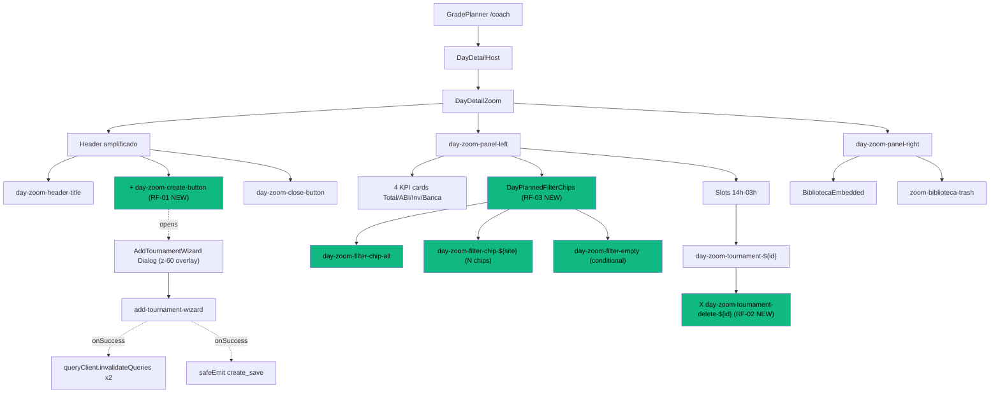
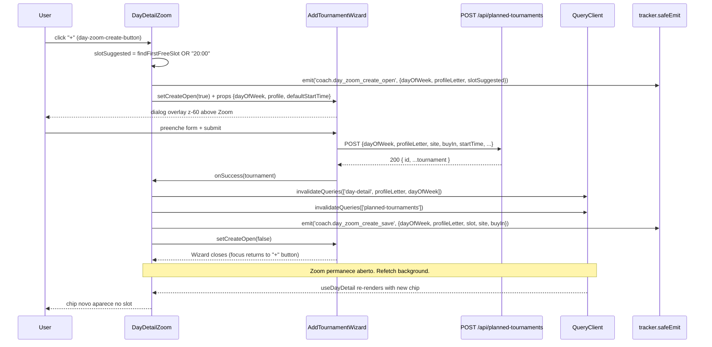

# Sprint day-detail-manage — Criar / Excluir inline / Filtro plataforma no DayDetailZoom

| Campo | Valor |
|---|---|
| Sprint ID | `day-detail-manage` |
| Owner | Docaari (Grindfy) |
| Data | 2026-05-28 |
| Status | **PROPOSTA** (aguarda system-architect → ADR + 2 diagramas) |
| Dependencias | Nenhuma. `DayDetailZoom` (Sprint day-detail-zoom-1, shipped) + `AddTournamentWizard` (`@/components/grade-planner/AddTournamentDialog`, shipped). |
| Pipeline alvo | `pm-spec → system-architect → test-writer → implementer → reviewer` |
| Estimativa | ~3 dias dev (3 RFs MUST, sem migration) |
| Sem migration | sim — zero schema change, zero endpoint novo |
| Tier impact | Free + Pro + Premium (puro UX no /coach) |

---

## 1. Contexto + Objetivo

`DayDetailZoom` (`client/src/components/grade/DayDetailZoom.tsx`, 643 LoC) e a superficie central de planejamento por dia no `/coach`. Hoje cobre **visualizacao + DnD bibliotec→slot / slot→slot / slot→trash + undo toast 5s + 8 eventos `coach.day_zoom_*`** (Sprint day-detail-zoom-1, shipped). Falta o **manejo direto a partir do modal central**: o jogador que esta "zoomado" no dia nao consegue (a) criar torneio novo sem fechar o modal e abrir o `AddTournamentWizard` do GradePlanner, (b) excluir um chip planejado sem usar DnD pra trash zone (UX confusa em mobile / trackpads imprecisos) e (c) filtrar a lista de torneios planejados do dia por plataforma quando a grade tem >10 chips empilhados.

Founder verbatim: "manejar, criar torneios, excluir torneios, filtrar torneios da lista de planejados por Plataforma, o maximo de ux para o usuario planejar e visualizar".

Escopo travado em AskUserQuestion (3 RFs MUST, **sem** Edit inline de torneios planejados):

1. **RF-01 Botao Criar torneio** — header do modal ganha `+` que abre `AddTournamentWizard` aninhado com defaults `dayOfWeek + profile + slot sugerido` ja preenchidos.
2. **RF-02 Delete inline X** — chip planejado ganha botao X hover-reveal que chama a `mutateRemove` ja existente (reusa undo toast 5s + telemetria, **adiciona** evento `delete_inline` alem do `dnd_remove`). DnD trash zone preservado (operacao redundante por preferencia UX).
3. **RF-03 Filtro plataforma** — chips horizontais acima dos slots no painel esquerdo, multi-select com chip "Todas" default, persistencia `localStorage` por (profile, day). Reusa evento `coach.day_zoom_filter_apply` existente.

Por que essas 3 e nao mais: Edit inline de torneio planejado exige bottom-sheet ou popover form + validacao + invalidate em cadeia (out-of-scope, defer). Reordenar slots manualmente exige `sequence` no schema `planned_tournaments` (TODO confirmar arch — Sprint day-detail-zoom-1 documentou no-op silencioso; mesma decisao aqui). Mobile breakpoint redesign fica como esta (Tabs em <1024px, fullscreen <768px — funcionalidades RFs cobrem em todos).

---

## 2. Escopo Sprint — IN (3 RFs MUST)

### RF-01 — Botao "+" para Criar torneio direto do Zoom

**Descricao:** header de `DayDetailZoom` (perto do `data-testid="day-zoom-header-title"`) ganha botao novo `+` (`data-testid="day-zoom-create-button"`, `aria-label="Criar torneio neste dia"`). Click abre `AddTournamentWizard` (`@/components/grade-planner/AddTournamentDialog` — re-export ja existente) **sobreposto** ao Zoom via `<DialogPrimitive.Root>` aninhado (Radix permite nesting sem stacking corrompido; ver lesson #29 acerca de provider — aqui Wizard usa proprio `QueryClientProvider` herdado da arvore raiz, NAO precisa ErrorBoundary local).

Props passadas ao Wizard:
- `dayOfWeek={dayOfWeek}` (int 0-6 do Zoom; 0=Dom segundo `getDayName` de `@/lib/dayName`).
- `profile={profileLetter}` ('A' | 'B' | 'C').
- `defaultStartTime={slotSugerido}` — calculado via `findFirstFreeSlot(plannedSlots, timeSlots) ?? "20:00"` (helper ja exportado de `@/components/grade/helpers`; Zoom ja usa o mesmo na linha 373 do componente atual).
- `onSuccess={handleWizardSuccess}` — callback do Zoom.

Fluxo `onSuccess`:
1. Fecha o Wizard (`setCreateOpen(false)`).
2. `queryClient.invalidateQueries({ queryKey: ['day-detail', profileLetter, dayOfWeek] })`.
3. `queryClient.invalidateQueries({ queryKey: ['planned-tournaments'] })` (mesma key usada pelo GradePlanner — recompoe WeekGrid em background quando Zoom fechar).
4. `safeEmit('coach.day_zoom_create_save', { dayOfWeek, profileLetter, slot: tournamentCriado.startTime, site: tournamentCriado.site, buyIn: tournamentCriado.buyIn })`.
5. NAO fecha o Zoom; usuario continua planejando no mesmo dia (intencional — fluxo "criar varios em sequencia").

Telemetria adicional:
- `safeEmit('coach.day_zoom_create_open', { dayOfWeek, profileLetter, slotSuggested })` ao abrir.

z-index ordering:
- Zoom usa Radix `<Dialog>` com z-50 nativo. Wizard aninhado precisa ficar **acima** — portal container = `document.body` (default Radix); Zoom usa container ref proprio. Em pratica: Wizard renderiza em portal raiz; Zoom em portal raiz; ultimo a montar fica visual no topo (DOM order). Garante via `<DialogPrimitive.Overlay>` do Wizard com `z-[60]` explicito + `<DialogPrimitive.Content>` `z-[61]`. Backdrop do Wizard cobre Zoom; ESC fecha Wizard (NAO o Zoom — Radix Dialog tem foco trap por instancia).

**Criterios de aceite:**
1. `data-testid="day-zoom-create-button"` renderiza no header do Zoom proximo ao titulo. Click abre Wizard com `data-testid="add-tournament-wizard"` (ja existe).
2. Wizard recebe `dayOfWeek` + `profile` pre-preenchidos (verificar via spy nas props ou via valor renderizado nos inputs do step 1).
3. Wizard recebe `defaultStartTime` = primeiro slot vago do dia OU "20:00" fallback (matchar `findFirstFreeSlot` output).
4. Apos `onSuccess`: `queryClient.invalidateQueries` chamado com `['day-detail', profileLetter, dayOfWeek]` E `['planned-tournaments']`; Wizard fecha; Zoom **permanece** aberto.
5. Evento `coach.day_zoom_create_open` emitido com `{ dayOfWeek, profileLetter, slotSuggested }`. Evento `coach.day_zoom_create_save` emitido com `{ dayOfWeek, profileLetter, slot, site, buyIn }`.
6. ESC com Wizard aberto fecha **Wizard apenas**; Zoom continua aberto. ESC com Wizard fechado fecha Zoom (paridade comportamento atual, ja testado em day-detail-zoom-1).
7. Wizard renderiza acima do Zoom (overlay Wizard z-[60] cobre Zoom z-50).

**Dependencias:** `AddTournamentWizard` (ja shipped), `findFirstFreeSlot` (ja exportado), `queryClient` (ja existe via TanStack). Zero refactor backend.

**Tests/data-testid esperados:**
- `day-zoom-create-button` (header trigger)
- `add-tournament-wizard` (ja existe — verificar abertura)
- Spy em `safeEmit` para os 2 eventos novos
- Spy em `queryClient.invalidateQueries` para validar 2 keys

**Lessons aplicaveis:**
- #14/#26 — testes `.tsx` carregam componente via `await import(...)`, NAO `require`
- #29 — Wizard usa `useQuery` interno? Sim — ja envolto em `QueryClientProvider` raiz; sem ErrorBoundary local necessario
- #18 — NAO usar `git stash` durante TDD

---

### RF-02 — Botao X inline em chip planejado (hover-reveal)

**Descricao:** cada `<div data-testid={`day-zoom-tournament-${item.id ?? idx}`}>` (atualmente linha 551 do `DayDetailZoom.tsx`) ganha botao X no canto superior direito, hover-reveal via Tailwind:

```tsx
<button
  data-testid={`day-zoom-tournament-delete-${item.id}`}
  aria-label={`Remover torneio ${item.name}`}
  onClick={(e) => {
    e.stopPropagation();
    handleDeleteInline(item.id, slot, item.name);
  }}
  className="absolute top-1 right-1 opacity-0 group-hover:opacity-100 focus:opacity-100 focus-visible:opacity-100 transition-opacity duration-150 ..."
>
  <X className="h-3 w-3" />
</button>
```

Container do chip ganha `group` + `relative` para o hover-reveal e o posicionamento absoluto funcionarem.

Handler `handleDeleteInline`:
1. Chama `mutateRemove(itemId, slot)` ja existente (linhas 228-273 do componente; preserva undo toast 5s, rollback otimistico em 4xx, evento `coach.day_zoom_dnd_remove`).
2. **Adiciona** `safeEmit('coach.day_zoom_delete_inline', { tournamentId: itemId, dayOfWeek, profileLetter, slot, source: 'inline_x' })` ANTES de chamar `mutateRemove`. Isso permite distinguir analytics "removido por X" vs "removido por DnD trash" (que continua emitindo `dnd_remove` apenas).
3. `mutateRemove` continua emitindo `coach.day_zoom_dnd_remove` no fluxo interno — duplicidade intencional para nao quebrar dashboards existentes que agregam `dnd_remove` como "total removidos". `delete_inline` e medida nova de adocao do botao X.

Acessibilidade:
- `aria-label="Remover torneio {name}"` no botao.
- `focus-visible:opacity-100` garante que keyboard nav (Tab) revela o X (nao depende de hover).
- `e.stopPropagation()` evita que click no X dispare eventos de drag/click do chip pai.

Trash zone DnD (linha 575 do componente — `data-testid="zoom-biblioteca-trash"`): **PRESERVADA**. Founder confirmou em AskUserQuestion: redundancia intencional ("usuario pode preferir um ou outro"). Trash zone continua emitindo `coach.day_zoom_dnd_remove` via fluxo DnD existente.

**Criterios de aceite:**
1. `data-testid="day-zoom-tournament-delete-${id}"` presente em cada chip planejado.
2. Botao X tem `aria-label="Remover torneio {name}"` (validavel via `getByLabelText`).
3. Botao X tem classes `opacity-0 group-hover:opacity-100 focus:opacity-100`; container do chip tem `group` + `relative`.
4. Click no X chama `mutateRemove(id, slot)` (verificavel via spy em `apiRequest('DELETE', '/api/planned-tournaments/:id')`).
5. Apos click: toast undo aparece (`data-testid="day-zoom-undo-toast"`, paridade comportamento atual); chip some otimistic; emit `coach.day_zoom_delete_inline` E `coach.day_zoom_dnd_remove` (2 eventos por click no X).
6. Click no X com mutation 4xx (mock reject): chip volta + toast erro `data-testid="day-zoom-error-toast"` (paridade atual).
7. DnD trash zone (`zoom-biblioteca-trash`) continua funcional — drag chip para trash emite `dnd_remove` SOMENTE (NAO emite `delete_inline`).
8. `e.stopPropagation()` no click do X previne drag accidental (testavel via spy em `onDragStart` do chip pai, que NAO deve disparar).

**Dependencias:** `mutateRemove` (ja existe). Icone `X` de `lucide-react` (ja importado).

**Tests/data-testid esperados:**
- `day-zoom-tournament-delete-${id}` (novo)
- `day-zoom-undo-toast` (ja existe, paridade)
- `day-zoom-error-toast` (ja existe, paridade)
- Spy `safeEmit` para `coach.day_zoom_delete_inline` + `coach.day_zoom_dnd_remove`

**Lessons aplicaveis:**
- #1 — early return ANTES de hooks viola Rules of Hooks; handler `handleDeleteInline` definido como `useCallback` antes de qualquer return
- #2 — `data-testid` estavel inclui `item.id`; fallback `idx` (ja usado no codigo atual) NAO ideal mas mantido por paridade

---

### RF-03 — Filtro plataforma (chips horizontais multi-select)

**Descricao:** componente novo `client/src/components/grade/DayPlannedFilterChips.tsx` (~150 LoC alvo). Renderizado **no painel esquerdo** do Zoom (`data-testid="day-zoom-panel-left"`), **abaixo dos 4 KPI cards** (Total/ABI/Investimento/Banca, linhas 488-528 atuais) e **acima dos slots de horario** (linha 537+).

Visual e comportamento:
- Linha horizontal de chips com gap-2, flex-wrap em viewport apertado.
- **Chip "Todas"** (sempre primeiro, default ativo) — `data-testid="day-zoom-filter-chip-all"`. Clicar desmarca todas as plataformas selecionadas (volta ao estado "mostrar tudo").
- **Chips por plataforma** — `data-testid="day-zoom-filter-chip-${site}"`. Derivados de `Set(data.volume[].site ∪ data.list[].site)` ordenados por count desc (plataforma com mais torneios primeiro). Multi-select: toggle por click.
- Visual ativo: `bg-emerald-600/30 border-emerald-500 text-emerald-200`.
- Visual inativo: `bg-gray-800 border-gray-700 text-gray-300`.
- Transition `transition-colors duration-150` (animacao curta, sem destaque pesado).

Logica multi-select:
- `selectedSites: string[]` (state). Inicial: `[]` (=> chip "Todas" visualmente ativo; nenhum chip de site ativo).
- Click em chip site: toggle (`selectedSites.includes(site) ? remove : add`).
- Click em "Todas": `setSelectedSites([])` (limpa tudo).
- "Todas" e visualmente ativo **SOMENTE quando `selectedSites.length === 0`**. Quando >=1 site selecionado, "Todas" fica inativo (mas continua clicavel para limpar).

Aplicacao do filtro:
- `plannedSlots` (derived state ja calculado nas linhas 109-127 do componente) e filtrado **antes** de renderizar:
  ```ts
  const filteredPlannedSlots = React.useMemo(() => {
    if (selectedSites.length === 0) return plannedSlots;
    const out: Record<string, any[]> = {};
    for (const [slot, items] of Object.entries(plannedSlots)) {
      const kept = items.filter(it => selectedSites.includes(it.site));
      if (kept.length > 0) out[slot] = kept;
    }
    return out;
  }, [plannedSlots, selectedSites]);
  ```
- Slots que ficam vazios apos filtro **continuam renderizando** (intencional — usuario ve que aquele horario existe mas sem torneios da plataforma escolhida).
- Se **TODOS** os slots ficam vazios apos filtro (cenario: filtrei "PokerStars" mas o dia so tem GG): renderiza mensagem `data-testid="day-zoom-filter-empty"` com texto "Nenhum torneio com esses filtros" + botao `data-testid="day-zoom-filter-empty-clear"` ("Limpar filtros") que faz `setSelectedSites([])`.

Persistencia localStorage:
- Key: `dayZoom.filter.${profileLetter}.${dayOfWeek}.platforms`.
- Value: JSON array de strings (sites selecionados).
- Lazy init via `useState(() => loadFromStorage())`.
- SSR guard: `typeof window !== "undefined"` antes de `localStorage.getItem`.
- Persist on change: `useEffect(() => { localStorage.setItem(key, JSON.stringify(selectedSites)) }, [selectedSites])`.
- Sites obsoletos: se `selectedSites` contem site que NAO esta mais na lista derivada (jogador removeu todos os PokerStars do dia), o filtro continua persistido mas nao tem efeito visivel. **NAO** limpar automatico — usuario ve estado dele preservado. Cleanup so quando ele clica "Todas" ou desmarca o chip.

Telemetria:
- Reusa evento existente `coach.day_zoom_filter_apply` (ja na tabela de 8 events do day-detail-zoom-1, RF-05). Payload: `{ dayOfWeek, profileLetter, filters: { platforms: selectedSites }, cleared: boolean, resultCount: number }`.
- `cleared: true` quando click foi em "Todas" OU em "Limpar filtros" do empty state. `cleared: false` quando toggle em chip site.
- `resultCount` = soma de `filteredPlannedSlots[s].length` para todos slots.
- Emit em cada interacao (NAO em mount inicial — ver Q-E).

**Criterios de aceite:**
1. `data-testid="day-zoom-filter-chips"` container renderiza abaixo dos KPI cards, acima dos slots.
2. Chip "Todas" (`day-zoom-filter-chip-all`) renderiza sempre, ativo quando `selectedSites.length === 0`.
3. Chips por site renderizados em ordem desc por count do `data.volume[].site ∪ data.list[].site`. Ex: data com `volume: [{site:'PokerStars', count:5}, {site:'GG', count:2}]` ⇒ ordem chips: Todas, PokerStars, GG.
4. Click em chip site adiciona/remove de `selectedSites`; visual atualiza (`bg-emerald-600/30` quando ativo).
5. Click em "Todas" zera `selectedSites`; visual de "Todas" volta a ativo.
6. Filtro com 1+ site: slots sem match daquele(s) site(s) renderizam vazios; slots com match renderizam apenas chips filtrados.
7. Filtro que zera TUDO: `data-testid="day-zoom-filter-empty"` aparece; botao `day-zoom-filter-empty-clear` reseta filtro.
8. localStorage `dayZoom.filter.A.2.platforms` salva `["PokerStars"]` apos click; refresh pagina + reabrir Zoom restaura selecao.
9. SSR guard: codigo nao quebra se `typeof window === "undefined"` (testavel via mock).
10. Evento `coach.day_zoom_filter_apply` emitido em cada toggle (chip site OU "Todas") com payload completo. **NAO** emite em mount inicial (ver Q-E — decisao: nao polui telemetria com state hidratado).
11. Sites obsoletos (em localStorage mas nao mais no data): nao quebram a UI; filtro fica "vazio efetivo" mas state preservado.

**Dependencias:** Hook `useDayDetail` (ja em uso pelo Zoom). Sem libs novas — `<button>` nativo com `onClick`.

**Tests/data-testid esperados:**
- `day-zoom-filter-chips` (container)
- `day-zoom-filter-chip-all`
- `day-zoom-filter-chip-${site}` (para cada site no data)
- `day-zoom-filter-empty` + `day-zoom-filter-empty-clear`
- Spy localStorage + `safeEmit`

**Lessons aplicaveis:**
- #15 — polyfill localStorage no `tests/setup.ts` (ja existe `MemoryStorage` desde Bloco-A-Polish; reuso direto)
- #21 — `vi.fn()` para mocks; reset em `beforeEach`
- #27 — `<button>` nativo com `onClick` aqui (NAO Radix); RTL `fireEvent.click` funciona puro
- #29 — componente `DayPlannedFilterChips` recebe `data` como prop (NAO faz `useQuery` interno) — sem ErrorBoundary local necessario

---

## 3. Escopo — OUT (Sprint 2/3)

Itens explicitamente fora deste sprint, com criterio de promocao:

| # | Item | Por que OUT | Criterio promocao |
|---|---|---|---|
| 1 | Edit inline de torneio planejado (popover/bottom-sheet com form de buy-in, name, startTime) | Requer form validation + invalidate em cascata; escopo maior que delete. Founder confirmou defer em AskUserQuestion. | Telemetria `delete_inline` >30% das remocoes em 14d + pedido founder |
| 2 | Reordenar slots manualmente (drag-handle pra mover horario) | Schema `planned_tournaments` precisa de `sequence` ou unique compound (dayOfWeek, profileLetter, sequence). Mesma decisao do day-detail-zoom-1 RF-02. | system-architect confirma schema + ADR migration |
| 3 | Filtros adicionais (buy-in range, formato, satellite) no painel esquerdo | RF-03 cobre plataforma (pedido explicito founder). Outros filtros ja existem na biblioteca embedded (BibliotecaEmbedded). | Telemetria `day_zoom_filter_apply` com `filters.platforms` >50% adocao + pedido founder |
| 4 | Bulk delete (Shift+click selecionar N chips, X global) | UX complexa, requer state machine selecao. | Telemetria delete_inline alta + pedido founder |
| 5 | Atalho teclado `c` (criar), `Del` (delete focado), `/` (filtro) | Sprint atual nao introduz atalhos novos alem do ESC ja existente. | Feedback founder + telemetria adocao base |
| 6 | Mobile breakpoint redesign | Mantem comportamento Tabs <1024px / fullscreen <768px do day-detail-zoom-1. | Sprint dedicado mobile UX |
| 7 | Animation/skeleton durante invalidate apos Create | Wizard fecha → invalidate dispara refetch silencioso; chip aparece quando query resolve. Sem skeleton intermediario. | Feedback "chip demora a aparecer" |
| 8 | Reset de filtro ao mudar de dia (navegar via deeplink) | Persistencia por (profile, day) — filtro de Ter NAO afeta Qua. Decisao explicita. | Mudanca de decisao founder |

---

## 4. Modelo de dados

**Zero migration. Zero schema change.**

- `useDayDetail` (`/api/grade/day-detail/:profile/:dayOfWeek`) — shape inalterado; usado para deriva da lista de sites (`data.volume[].site` + `data.list[].site`).
- `tournaments` table — `grind_session_id IS NULL` ja garantido em GET (CLAUDE.md §6.1). RF-03 filtra **no client** baseado em `site` ja presente no payload.
- `planned_tournaments` table — POST/DELETE inalterados; chamados via `apiRequest` ja existente.

localStorage (client-side state, NAO schema):
- Key `dayZoom.filter.${profileLetter}.${dayOfWeek}.platforms` (3 niveis: profile A/B/C, dayOfWeek 0-6).
- Value: `string[]` JSON.
- Tamanho maximo: ~21 keys (3 profiles * 7 days) — limite teorico negligenciavel.
- Sem TTL (ver Q-D — decisao: persistencia indefinida; user limpa explicitamente).

---

## 5. API endpoints

**Zero novos endpoints. Zero mudanca backend.**

| Metodo | Rota | Uso na sprint | Status |
|---|---|---|---|
| GET | `/api/grade/day-detail/:profile/:dayOfWeek` | RF-03 deriva lista de sites | Existente |
| POST | `/api/planned-tournaments` | RF-01 (via Wizard interno) | Existente |
| DELETE | `/api/planned-tournaments/:id` | RF-02 (via `mutateRemove`) | Existente |

Coach kill-switch `COACH_NUDGES_ENABLED` NAO afeta eventos UI (`coach.day_zoom_*` sao telemetria de UI, NAO nudges proativos). PII guard: nenhum dos eventos novos contem keys de `shared/pii-keys` (telemetry guard ja convention test desde MP-VALIDATION RF-01).

---

## 6. Telemetria — eventos novos + reuso

| # | Event | Trigger | Props obrigatorias | Status |
|---|---|---|---|---|
| 1 | `coach.day_zoom_create_open` | RF-01: click `+` no header | `dayOfWeek`, `profileLetter`, `slotSuggested` | **NOVO** |
| 2 | `coach.day_zoom_create_save` | RF-01: Wizard `onSuccess` | `dayOfWeek`, `profileLetter`, `slot`, `site`, `buyIn` | **NOVO** |
| 3 | `coach.day_zoom_delete_inline` | RF-02: click X em chip | `tournamentId`, `dayOfWeek`, `profileLetter`, `slot`, `source:'inline_x'` | **NOVO** |
| 4 | `coach.day_zoom_dnd_remove` | RF-02: ainda emitido pela `mutateRemove` (paridade) | `tournamentId`, `dayOfWeek`, `slot` | Reuso (existente) |
| 5 | `coach.day_zoom_filter_apply` | RF-03: toggle chip/Todas/Limpar | `dayOfWeek`, `profileLetter`, `filters:{platforms:string[]}`, `cleared:boolean`, `resultCount:number` | Reuso (existente) |

PII guard: `tournamentId` (nanoid opaco), `site` (enum nome), `buyIn` (numero), `slot` (HH:mm). Zero PII.

Cap delete: 3 meses pos-deploy. TODO grepavel: `// TODO(2026-08-28): cleanup coach.day_zoom_create_* + delete_inline apos analise adocao`.

---

## 7. Cenarios de Teste Derivados

### RF-01 (Criar)
- [ ] Botao `+` renderiza no header com `aria-label`.
- [ ] Click abre Wizard sobreposto (overlay z-[60] cobre Zoom).
- [ ] Wizard recebe `dayOfWeek`, `profile`, `defaultStartTime` (= primeiro slot vago OR "20:00").
- [ ] `onSuccess` chama `queryClient.invalidateQueries` com `['day-detail', profileLetter, dayOfWeek]` E `['planned-tournaments']`.
- [ ] `onSuccess` emite `coach.day_zoom_create_save`; Wizard fecha; Zoom permanece aberto.
- [ ] Abertura emite `coach.day_zoom_create_open`.
- [ ] ESC com Wizard aberto fecha Wizard apenas (foco trap por instancia Radix).
- [ ] Wizard com slot vazio (todos slots ocupados): `defaultStartTime = "20:00"`.

### RF-02 (Delete inline)
- [ ] `data-testid="day-zoom-tournament-delete-${id}"` em cada chip.
- [ ] Botao tem `aria-label="Remover torneio {name}"`.
- [ ] Classes hover/focus reveal: `opacity-0 group-hover:opacity-100 focus:opacity-100`.
- [ ] Click chama `mutateRemove(id, slot)` (DELETE `/api/planned-tournaments/:id`).
- [ ] Apos click: emit `delete_inline` + `dnd_remove` (2 eventos); toast undo aparece; chip otimistic some.
- [ ] Mock 4xx: chip volta + toast erro.
- [ ] DnD trash zone emite **apenas** `dnd_remove` (NAO `delete_inline`).
- [ ] `e.stopPropagation()` evita drag accidental quando click no X.

### RF-03 (Filtro plataforma)
- [ ] Container `day-zoom-filter-chips` renderiza entre KPIs e slots.
- [ ] Chip "Todas" sempre visivel; ativo quando `selectedSites=[]`.
- [ ] Chips por site em ordem desc por count (volume ∪ list).
- [ ] Toggle chip site adiciona/remove; visual atualiza.
- [ ] Click "Todas" zera filtro.
- [ ] Filtro 1 site: slots sem match continuam renderizando vazios; com match renderizam so chips do site.
- [ ] Filtro que zera tudo: `day-zoom-filter-empty` + botao "Limpar filtros".
- [ ] localStorage salva key correta por (profile, day) + restaura no reabrir.
- [ ] SSR guard nao quebra quando `window` undefined.
- [ ] Evento `filter_apply` emitido em toggle (NAO em mount inicial).
- [ ] Sites obsoletos em localStorage nao quebram render.

### Edge cases
- [ ] RF-01: Wizard rejeita save (4xx) → erro do Wizard mostrado; Zoom intocado; NAO emite `create_save`.
- [ ] RF-02: chip com `item.id` ausente cai em fallback `idx` (paridade comportamento atual).
- [ ] RF-03: `data.volume = []` e `data.list = []` → so renderiza chip "Todas" (lista sites vazia).
- [ ] RF-03: site com count 0 em volume mas presente em list (cenario: torneio planejado mas sem volume historico) → chip aparece (vem da uniao).
- [ ] RF-01+RF-02 combinados: criar → chip aparece via invalidate → hover mostra X → click X remove (fluxo completo).

---

## 8. Diagramas

### 8.1 Component tree (delta sobre day-detail-zoom-1)



### 8.2 Sequence — Create flow (RF-01)



---

## 9. Bordas / Decisoes (rapidas)

| # | Borda | Decisao |
|---|---|---|
| B1 | Wizard usa `useQuery` interno? | Sim — usa `tournament-library` cache. Arvore raiz ja tem `QueryClientProvider`; sem ErrorBoundary local. Lesson #29 nao se aplica aqui (provider existe). |
| B2 | Tests usam `await import()` ou `require()`? | `await import()` (lesson #14/#26 — `require` quebra com ESM deps em `.tsx`). |
| B3 | `git stash` durante TDD? | NAO (lesson #18). Branch dedicada `feature/day-detail-manage`. |
| B4 | Chips de filtro com Radix ou `<button>`? | `<button>` nativo (lesson #27 — `fireEvent.click` em Radix `TabsTrigger` precisa `mousedown`; aqui evitamos a complicacao). |
| B5 | Coach kill-switch afeta eventos? | NAO. `coach.day_zoom_*` sao UI telemetry, nao nudges proativos (CLAUDE.md §10 `COACH_NUDGES_ENABLED`). |
| B6 | PII guard? | Zero PII nos 3 eventos novos. Convention test de `shared/pii-keys` ja roda (MP-VALIDATION). |
| B7 | Wizard cancela (Esc/X) sem submit? | NAO emite `create_save`. NAO emite `create_open_cancel` (defer telemetria de abandono — out-of-scope). |
| B8 | Filtro persiste entre profiles? | NAO. Key `dayZoom.filter.${profile}.${day}` isola por (profile, day). |

---

## 10. Questoes abertas (Q-A..Q-N)

Pipeline (`system-architect` decide; defer ao implementer/reviewer quando indicado):

- **Q-A: Wizard validation errors UX defer?**
  Quando Wizard tem erro de validacao (zod), o erro aparece **dentro do Wizard** (comportamento atual). Sprint atual NAO adiciona toast global. Confirmar com architect que paridade comportamento existente cobre.

- **Q-B: Sites com count=0 no `volume` mas presentes em `list` (planejado sem historico) devem aparecer no chip?**
  Decisao spec: **SIM** (uniao). Architect confirma se isso polui demais a UI em dias com muitos sites planejados sem historico (ex: jogador novo).

- **Q-C: "Todas" e XOR logico ou desmarca explicito?**
  Decisao spec: **desmarca explicito** (click "Todas" → `setSelectedSites([])`). XOR (deselect outros chips quando clica em um especifico) NAO se aplica — multi-select puro. Architect confirma.

- **Q-D: localStorage TTL?**
  Decisao spec: **sem TTL**. Usuario limpa explicitamente via "Todas". Architect confirma; alternativa: TTL 30d com `__updatedAt` no JSON.

- **Q-E: Telemetria `filter_apply` tambem em mount inicial (state hidratado do localStorage)?**
  Decisao spec: **NAO** — emit so em interacao. Hidratacao silenciosa evita poluir analytics com state preservado. Architect confirma.

- **Q-F: Animacao chip transition-color duration?**
  Decisao spec: `transition-colors duration-150` (paridade outras chips do projeto). Architect/Reviewer confirma se 100ms ou 200ms fica melhor.

- **Q-G: Wizard com `onSuccess` que retorna multiplos torneios (Day 2 / Series)?**
  Wizard ja trata Series Day 2 (CLAUDE.md sprint biblioteca-enrich). Sprint atual NAO precisa tratar — invalidate cobre, chip(s) aparecem.

- **Q-H: Chip planejado sem `item.id` (fallback `idx`) — botao X funciona?**
  `mutateRemove` espera `id`. Sem id, fallback NAO tem como deletar. Decisao: NAO renderizar X quando `!item.id`. Architect confirma quao comum e o caso (paridade `day-zoom-tournament-${item.id ?? idx}` da linha 551 atual sugere que id sempre existe pos-fetch).

- **Q-I: localStorage key collision entre tabs/janelas?**
  Decisao spec: ultimo write ganha. Sem `storage` event listener pra cross-tab sync. Architect confirma se quer adicionar listener (out-of-scope sprint mas trivial).

- **Q-J: Filtro persistido em localStorage mas chip "Todas" inicial mostra ativo erroneo?**
  Logica: `selectedSites.length === 0` define visual "Todas" ativo. Hidratar de `["PokerStars"]` resulta em "Todas" inativo + "PokerStars" ativo (correto). Sem ambiguidade. Architect confirma cenario edge.

---

## 11. Verificacao Final (PM checklist)

- [x] RF-01/02/03 com criterios verificaveis (>=5 cada).
- [x] Cenarios de teste cobrem happy + erros + edge.
- [x] "Fora de Escopo" preenchido (8 itens).
- [x] Telemetria com props alinhada com ADR-207 (dot-namespace `coach.day_zoom_*`).
- [x] Dependencias listadas (Wizard + helpers + queryClient — todos existentes).
- [x] Modelos: zero migration, zero schema change.
- [x] Endpoints: zero novos.
- [x] PII guard explicito.
- [x] Decisoes Q-A..Q-J documentadas (10 questoes).
- [x] Lessons aplicaveis citadas (#1, #2, #14, #15, #18, #21, #26, #27, #29).
- [x] 2 diagramas Mermaid (component tree + sequence Create).
- [x] Cap de linhas: ~590 (cap 600 OK).

---

## 12. Proximo passo

Spec aprovada → `system-architect` para criar ADR (proximo numero apos ADR-210; sugestao **ADR-211**) + diagramas em `Docs/architecture/diagrams/day-detail-manage/` (component-tree.mermaid + sequence-create.mermaid + opcional sequence-delete-inline.mermaid). Architect deve resolver Q-A..Q-J e atualizar este spec com decisoes finais antes do `test-writer`.

**Comando recomendado:**
```
Use o agente system-architect para criar a arquitetura
baseada na spec em Docs/specs/sprint-day-detail-manage.md
```
