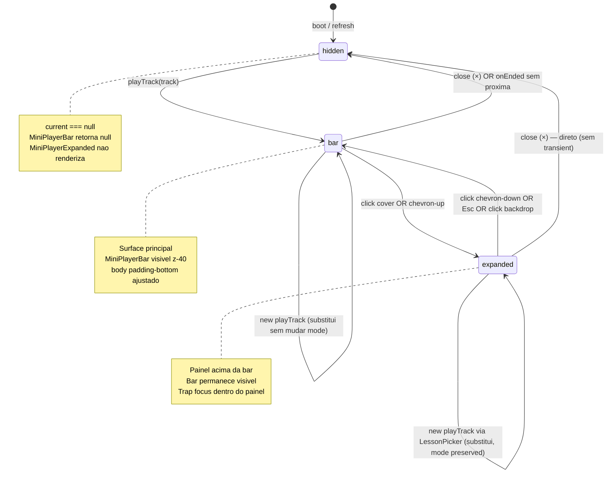

# Sprint Mini Player 1 — Persistente + Grind Live Bridge

## Status

**Proposta** — aguardando aprovacao founder. Fase 1 (Mini Player persistente substituindo StickyAudioBar) + Fase 2 (botao 🎧 no SessionHeader + LessonPickerDialog) unificadas numa sprint solo. Fase 3 (queue) e Fase 4 (Spotify) explicitamente fora.

## Decisoes congeladas Q1-Q5 (NAO reabrir)

| Q | Decisao | Origem |
|---|---------|--------|
| **Q1** | Botao 🎧 no `SessionHeader` (junto ao timer / pause / breaks), nao floating | Founder, briefing 2026-05-21 |
| **Q2** | Fase 1 + Fase 2 unificadas em uma sprint (compartilham refactor do `AudioPlayerContext`) | Founder |
| **Q3** | Queue de reproducao = Fase 3 (FORA do MVP) | Founder |
| **Q4** | `displayMode` MVP = `'hidden' \| 'bar' \| 'expanded'`. Floating icon = fase futura | Founder |
| **Q5** | Autoplay sequencial: toca proxima SE acessivel ao user; SE nao houver proxima ou sem acesso → `setIsPlaying(false)` (para silenciosamente) | Founder |

---

## 1. Sumario Executivo

**Objetivo.** Substituir a `StickyAudioBar` mobile-only atual (Biblioteca-1, 9 controles ausentes) por um **Mini Player persistente cross-page** com 9 controles de transporte, expandivel, com autoplay sequencial dentro do curso. Em paralelo, adicionar um botao 🎧 no `SessionHeader` do `/grind-live` que abre um `LessonPickerDialog` — fechando o loop "estudar enquanto faz grind" sem trocar de aba.

**Tese.** O grindeiro MTT roda 4-6h por sessao. Hoje ele abre o `LessonViewer` numa aba lateral e perde foco do `/grind-live` (timer, breaks, OCR de stats, notes). Com o Mini Player persistente + botao 🎧 no header, audio continua tocando em qualquer rota e a sessao de grind vira o "centro" da plataforma — biblioteca passa a ser consumida em **modo passivo audio** sem competir com o trabalho ativo. Cliente paga por **loop fechado tracker + biblioteca + grind**, ja que tracker (Stats), biblioteca (LMS embedded shipped Biblioteca-1) e grind (`/grind-live`) finalmente conversam via player compartilhado.

**Escopo.** 14 RFs + 7 RNFs entregaveis em uma sprint solo (~12-15d). Spec e **isoladora**: nao toca em backend (exceto reusar `GET /api/library/lessons/:id/progress` ja shipped Biblioteca-1) e nao mexe em `LessonViewer` / `PodcastPlayer` salvo backward compat (RF-14). O `AudioPlayerContext` ja vive acima do Router em `App.tsx` (Biblioteca-1, lesson #12) — basta estender, sem mover.

**14 RFs em 1 linha:**

- **RF-01** — `MiniPlayerBar` persistente substitui `StickyAudioBar` (fixed bottom-0, z-40, todos breakpoints)
- **RF-02** — 9 controles de transporte + keyboard shortcuts (Space, ←, →, M, Esc)
- **RF-03** — Volume tri-modo (click=mute toggle, scroll wheel=±5%, hover=slider 200ms fade) + 3 icones por nivel
- **RF-04** — `MiniPlayerExpanded` (cover 120×120, controles espacados, lista readonly de aulas)
- **RF-05** — Autoplay sequencial via lista do curso ja em cache `useQuery`
- **RF-06** — `AudioSourceEngine` (interface `IAudioSourceDriver` + `AudioTrack` com `source`) — Fase 1 so `LibraryAudioDriver`
- **RF-07** — Extensao do `AudioPlayerContext` (volume, isMuted, activeSource, playTrack/Next/Previous, courseContext, displayMode)
- **RF-08** — Botao 🎧 no `SessionHeader` (desktop + mobile Popover, pulsa quando playing)
- **RF-09** — `LessonPickerDialog` lazy-loaded (filtra `formats.includes('podcast')`, "Continuar de onde parou" via progress endpoint)
- **RF-10** — Responsividade 3 breakpoints (desktop ≥1024 / tablet 768-1023 / mobile <768)
- **RF-11** — Z-index vs MiniChat (MiniChat z-50 acima; padding-bottom condicional no body)
- **RF-12** — Glassmorphism premium (`backdrop-filter: blur(20px) saturate(180%)`, slide-up 300ms, cover rotate 1volta/8s, gradient progress)
- **RF-13** — Keyboard shortcuts globais com guards (input/textarea/contentEditable + displayMode ≠ hidden + sem conflito P/B do SessionHeader)
- **RF-14** — Backward compat (`play(lesson)` wrapper, `useOptionalAudioPlayer` retorna null sem Provider, deletar `StickyAudioBar.tsx`)

---

## 2. Contexto e Motivacao

### 2.1. Estado atual (verificado em codigo, 2026-05-21)

- **Biblioteca-1 (commit `ba74c917`) ja shipped.** `AudioPlayerContext` (`client/src/contexts/AudioPlayerContext.tsx`) tem surface minima: `play / pause / toggle / close / seek / setSpeed / skipBack / skipForward`. Speed persistida em `localStorage` key `library:audio:speed`. Provider mora **acima do Router** em `App.tsx` (lesson #12 — sobrevive a navegacao Wouter). `<audio>` real renderizado dentro do Provider (F0 critical).
- **`StickyAudioBar` (`client/src/components/biblioteca/StickyAudioBar.tsx`)** — barra mobile-only (`isMobileViewport`), apenas 4 botoes (skip-back, play/pause, close + cover/titulo). Sem volume, sem velocidade, sem skip-forward, sem proxima/anterior, sem expanded, sem autoplay, sem desktop. **A ser deletada** em RF-14.
- **`PodcastPlayer` (`client/src/components/podcast/PodcastPlayer.tsx`)** — tem logica de speed + volume implementada localmente (a reusar pra padronizar).
- **`SessionHeader` (`client/src/components/grind-session-live/SessionHeader.tsx`)** — header da pagina `/grind-live` com timer, pause, breaks, notes, finalizacao. Ja tem keyboard shortcuts P/B (linhas 38-61) + slot `autoBreakToggleSlot` entre `[Breaks]` e `[Pausar]`. Tooltips Radix com `delayDuration=300`. Mobile vira `Popover` com `MoreVertical`.
- **`GET /api/library/lessons/:id/progress`** ja existe (Biblioteca-1 RF-06).
- **Endpoint `/api/library/courses/:slug`** ja existe + cache `useQuery` no client.

### 2.2. Problema concreto

1. **Audio para quando user navega.** Hoje, dar play em podcast na Biblioteca e ir pro `/grind-live` faz audio continuar **mas a UI some** (StickyAudioBar so renderiza mobile). Desktop fica sem ANY surface — user perde o controle.
2. **9 controles ausentes.** Sem skip-forward, sem volume, sem velocidade na bar, sem proxima/anterior. Cada acao exige voltar pra `/biblioteca/curso/...`.
3. **`/grind-live` nao conhece a biblioteca.** Pra estudar durante grind, user precisa abrir tab nova, navegar manualmente, dar play, voltar. Friccao alta o suficiente pra ninguem fazer.
4. **Autoplay zero.** Termina podcast 1 do curso → silencio. Nao engata 2.
5. **Volume nao persiste.** Speed persiste (Biblioteca-1), mas volume nao — toda nova sessao volta a 100%.

### 2.3. Por que sprint solo, agora

- AudioPlayerContext ja existe e ja mora no lugar certo (lesson #12 ja resolvida).
- StickyAudioBar e isolada — substituir nao quebra Biblioteca-1.
- SessionHeader tem slot pronto (`autoBreakToggleSlot`) — padrao replicavel para 🎧.
- Sprint Biblioteca-2 (audit / polish) ja shipped — content stack estavel.
- Plano IA 7/7 + AI-3/AI-3.1 cleanup shipped — Coach AI estavel, nao concorre por surface.
- Custo de adiar: founder ja reportou ([followup_upload_500_pos_persist] nivel UX) que founder usa pessoalmente audio durante grind e abre 2 abas hoje. Anti-bug-fundador prioritario.

### 2.4. Riscos de adiar

- Cada sprint que passa sem autoplay → user **nao chega ao fim de curso nenhum** (lacuna funil retention).
- StickyAudioBar mobile-only fica como divida tecnica (componente "morto-vivo" que ja nao representa surface oficial).
- Quando AI-2A introduzir nudge B-VOLUME (terca 11h) recomendando estudar, vai direcionar pra Biblioteca — surface incompleta amplifica a friccao.

---

## 3. Defaults Ativos D1-D14

Decisoes ja tomadas. Test-writer e implementer assumem sem requestionar.

| ID | Default |
|---|---|
| **D1** | **`AudioPlayerContext` permanece em `client/src/contexts/AudioPlayerContext.tsx`**, mas internamente delega a um driver via `AudioSourceEngine` (RF-06). Provider continua no mesmo lugar acima do Router em `App.tsx`. Lesson #12 ja resolvida — nao mover. |
| **D2** | **`MiniPlayerBar` substitui `StickyAudioBar` em TODOS os breakpoints** (deletar arquivo antigo em RF-14). Nao manter ambos — risco de surface duplicada. |
| **D3** | **`MiniPlayerBar` renderizada dentro do Provider** (mesma arvore, abaixo do `{children}` e do `<audio>`). Visibilidade controlada por `displayMode !== 'hidden'`. Quando `current === null` → `displayMode = 'hidden'` automaticamente. |
| **D4** | **`displayMode` state machine canonica:** `hidden` ↔ `bar` ↔ `expanded`. Transicoes validas: `hidden → bar` (play nova faixa), `bar ↔ expanded` (click cover OU botao chevron), `bar → hidden` (close ou ended sem proxima), `expanded → bar` (botao minimizar OU click fora). `expanded → hidden` so via close explicito (direto, sem transient por bar — slide-down 200ms a partir do expanded). Persistido em memoria apenas (refresh = volta `hidden`). (Fix HIGH-1 Sprint Mini Player 1 — ver ADR-188.) |
| **D5** | **Volume persistido em `localStorage` key `library:audio:volume`** (paralelo a speed). Default `1.0` (100%). `isMuted` NAO persiste (volta `false` toda sessao). Mute = `audio.volume = 0` mantendo `volume` state interno; unmute = restaura. |
| **D6** | **Cover art rotation (RF-12)** pausa quando `prefers-reduced-motion: reduce` (CSS media query, sem JS extra). |
| **D7** | **`courseContext` armazenado em memoria no Provider** (nao localStorage). Refresh → courseContext perdido → autoplay desliga ate user voltar pra `/biblioteca/curso/...` e dar play de novo. Aceitavel pra MVP (custo lazy resolve > beneficio). Documentado como tradeoff. |
| **D8** | **Recovery pos-refresh:** se `current` (lessonId+audioUrl) for restaurado eventualmente via Biblioteca/LessonPicker, **lastPosition NAO restaura.** Volta do segundo 0. Persistir `lastPosition` no `localStorage` e fora do MVP (queue + restore session = Fase 3). |
| **D9** | **Substitui em vez de enfileirar.** Se user esta com track A tocando e da play em track B (via Biblioteca ou LessonPicker), B substitui A imediatamente (sem confirmacao). Queue out → sem prompt "Adicionar a fila ou tocar agora?". |
| **D10** | **`LessonPickerDialog` busca cursos via `GET /api/library/courses` (cached useQuery existente Biblioteca-1)** + filtra aulas com `formats.includes('podcast')`. Aulas sem acesso (`hasAccess === false`) renderizam disabled + tooltip "Acesso liberado manualmente pelo time Grindfy" (mesmo texto D7 Biblioteca-1). |
| **D11** | **"Continuar de onde parou"** = chamar `GET /api/library/lessons/:id/progress` ao abrir o picker SE houver 1+ aula com `lastPositionSeconds > 0`. Renderiza secao "Continuar de onde parou" acima da lista de cursos (max 3 aulas). Best-effort: se endpoint falhar, secao some silenciosamente (`<ErrorBoundary>`-style guard, sem toast). |
| **D12** | **Media Session API (`navigator.mediaSession`)** — registramos handlers `play / pause / previoustrack / nexttrack / seekbackward / seekforward` quando track ativa. Lockscreen art = `current.coverUrl`. **Faz parte do MVP** (custo ~20 linhas, valor alto pra mobile). Se browser nao suporta (`typeof navigator.mediaSession === 'undefined'`) → skip silencioso. |
| **D13** | **Telemetria reusa `library_events`** ja existente (Biblioteca-1 RF-06). Cliente envia `play / pause / seek / complete / next / previous / volume_change / speed_change / mute` via `navigator.sendBeacon` ou `fetch keepalive` (D11 Biblioteca-1). Eventos novos do Mini Player tem `source: 'mini_player'` no payload pra distinguir de `LessonViewer`. Backend nao muda no MVP — colunas ja existem. |
| **D14** | **Backward compat:** `useOptionalAudioPlayer()` continua existindo (Biblioteca-1) e retorna null sem Provider. `play(lesson: AudioPlayerLesson)` continua na surface publica como **wrapper** de `playTrack({ source: 'library', ... })`. `LessonViewer` + `PodcastPlayer` nao mudam (continuam chamando `play()` diretamente). Removido apenas `StickyAudioBar.tsx` + import em `App.tsx`. |

---

## 4. Usuarios e Personas

### 4.1. Personas

| Persona | O que faz | Trigger principal |
|---|---|---|
| **Grindeiro power (cohort 1, 5k+ historico)** | Roda 5h `/grind-live` ouvindo podcast Biblioteca em background, ajusta volume sem trocar de tab, autoplay engata aula seguinte sem intervencao | Botao 🎧 no SessionHeader → LessonPickerDialog → play |
| **Mid grinder (cohort 2)** | Estuda na rua pelo celular (podcast), abre app na bancada → continua de onde parou via "Continuar de onde parou" na bar | Mini Player ja visivel ao abrir Biblioteca; ou expanded view com cover grande pra "imersao" entre sessoes |
| **Cold start (<200 historico)** | Descobre que da pra estudar enquanto faz grind ao ver o 🎧 no header pulsar | Botao 🎧 onboarding implicito (tooltip "Estudar enquanto faz grind") |
| **Mobile-only consumer** | Player com Media Session API + lockscreen art controla audio do carro/fone bluetooth nativamente | Lockscreen / notificacoes do SO; sem precisar abrir o app |

### 4.2. User Stories

#### US-01 (grindeiro power, desktop)
> Como grindeiro rodando 6h, quero clicar 🎧 no header do `/grind-live`, escolher um podcast de "ICM bubble" e ouvir em background com volume ajustavel via scroll wheel no icone do volume, sem nunca sair do `/grind-live`.

#### US-02 (autoplay)
> Como user terminando podcast 1 de um curso de 8 aulas, quero que aula 2 toque automaticamente (se eu tenho acesso), pra eu nao precisar pausar o grind pra "passar a faixa".

#### US-03 (expanded view)
> Como user na Biblioteca, quero clicar no cover do Mini Player pra abrir um painel maior (expanded) com cover 120×120 e a lista de aulas do curso, pra entender o contexto sem deixar a pagina atual.

#### US-04 (mobile lockscreen)
> Como user no carro com fone bluetooth, quero que play/pause/next/previous funcionem nos controles do carro (Media Session API) sem precisar tirar o celular do bolso.

#### US-05 (keyboard shortcuts)
> Como user no desktop, quero apertar Space pra pausar, ← pra voltar 15s, → pra avancar 15s, M pra mute, Esc pra fechar — sem clicar em lugar nenhum.

#### US-06 (volume scroll wheel)
> Como user no desktop, quero passar o mouse no icone do volume e rolar o scroll wheel pra ajustar volume de 5 em 5, sem precisar abrir slider — interface "feel" de player desktop nativo.

#### US-07 (continuar de onde parou)
> Como user que ouviu 12min de um podcast ontem, quero abrir o LessonPickerDialog hoje e ver "Continuar de onde parou" em primeiro lugar com a aula que abandonei, pra reentrada zero-friccao.

#### US-08 (responsive mobile)
> Como user no celular (<768px), quero uma bar minima (cover + titulo + play/pause + close) sem controles supérfluos, pra economizar espaco vertical.

---

## 5. Requisitos Funcionais

### RF-01 — `MiniPlayerBar` persistente substitui `StickyAudioBar`

**O que faz.** Cria `client/src/components/audio-player/MiniPlayerBar.tsx`. Renderizada dentro do `AudioPlayerProvider`, abaixo de `{children}` (mesmo lugar do `<audio>` hoje). Fixed `bottom-0 inset-x-0`, `z-40` (abaixo do MiniChat z-50). Visivel em TODOS os breakpoints quando `displayMode !== 'hidden'`.

**Acceptance criteria:**
- [ ] `client/src/components/audio-player/MiniPlayerBar.tsx` criado.
- [ ] Renderizado dentro do `AudioPlayerProvider` (NAO em `App.tsx` diretamente — provider ja mora acima do Router).
- [ ] CSS: `fixed bottom-0 inset-x-0 z-40` + `data-testid="mini-player-bar"`.
- [ ] Visivel quando `displayMode === 'bar'`. Quando `displayMode === 'expanded'`, bar permanece + expanded paineia acima dela.
- [ ] Quando `current === null` → `displayMode = 'hidden'` → componente retorna `null`.
- [ ] Renderizado em todos breakpoints (NAO usa `isMobileViewport`; controles internos sao que mudam — ver RF-10).
- [ ] Acessibilidade: `role="complementary"`, `aria-label="Player de audio persistente"`.

**Estimate:** S (~3h).

**Dependencias:** RF-07 (extensao do contexto deve estar pronta primeiro pra `displayMode` existir).

**Riscos:** Layout shift no `<body>` se z-40 sobrepor conteudo. Mitigado por RF-11 (padding-bottom condicional).

---

### RF-02 — 9 controles de transporte + keyboard shortcuts

**O que faz.** Bar renderiza 9 controles em desktop: `[anterior] [-15s] [play/pause] [+15s] [proxima] [seek bar] [volume] [velocidade dropdown] [fechar]` + cover/titulo/curso a esquerda. Keyboard: `Space = toggle`, `← = -15s`, `→ = +15s`, `M = mute`, `Esc = fechar`.

**Acceptance criteria:**
- [ ] 9 botoes com `data-testid` (`mini-player-{prev,back15,toggle,forward15,next,seek,volume,speed,close}`).
- [ ] Cada botao tem `aria-label` PT-BR (RNF-07).
- [ ] Play/pause: invoca `ctx.toggle()`.
- [ ] -15s / +15s: invoca `ctx.skipBack(15)` / `ctx.skipForward(15)`.
- [ ] Anterior / Proxima: invocam `ctx.playPrevious()` / `ctx.playNext()` (RF-07). Disabled SE `courseContext` ausente OU sem proxima/anterior.
- [ ] Seek bar (`<input type="range">` estilizado): valor `currentSeconds` / max `durationSeconds`, `onChange` chama `ctx.seek()`.
- [ ] Velocidade: dropdown com `[0.75, 1, 1.25, 1.5, 1.75, 2]`x, valor inicial `ctx.speed`, onChange `ctx.setSpeed()`.
- [ ] Volume: ver RF-03.
- [ ] Fechar: `ctx.close()` → `displayMode = 'hidden'`.
- [ ] Keyboard shortcuts: ver RF-13 (registro global com guards).
- [ ] Tooltip Radix em cada botao com label completo + shortcut (ex: "Pausar (Space)").
- [ ] Teste RTL cobre cada controle individual + integracao keyboard.

**Estimate:** M (~1d).

**Dependencias:** RF-01, RF-07, RF-13.

**Riscos:** Conflito keyboard `P` (pause sessao) e `B` (break) ja registrados no `SessionHeader` — RF-13 documenta divisao de teclas (Space = audio, P/B = sessao).

---

### RF-03 — Volume tri-modo

**O que faz.** Botao volume com 3 modos de interacao: **click** = mute toggle, **scroll wheel** (hover sobre o icone) = ajuste ±5%, **hover sustentado 200ms** = aparece slider lateral horizontal pra ajuste fino. Icone varia: `Volume2` (>=66%), `Volume1` (1-65%), `VolumeX` (0% ou muted). Persistido em `localStorage` key `library:audio:volume`.

**Acceptance criteria:**
- [ ] Botao volume com `data-testid="mini-player-volume"` + `aria-label` dinamico ("Volume 80 por cento" ou "Mutado").
- [ ] Click: `ctx.toggleMute()`.
- [ ] `onWheel`: `e.preventDefault()` + `ctx.setVolume(clamp(volume + (e.deltaY < 0 ? +0.05 : -0.05), 0, 1))`.
- [ ] Hover 200ms (`setTimeout`): renderiza `<VolumeSlider>` adjacente (fade-in 200ms), `<input type="range" min=0 max=1 step=0.01>`.
- [ ] Slider some 500ms apos mouse leave (debounce, evita flickering ao mover entre slider e icone).
- [ ] Icone `Volume2` (lucide) quando `volume >= 0.66 && !isMuted`.
- [ ] Icone `Volume1` quando `0 < volume < 0.66 && !isMuted`.
- [ ] Icone `VolumeX` quando `volume === 0 || isMuted`.
- [ ] Persistencia: `setVolume(v)` grava `localStorage.setItem('library:audio:volume', String(v))`. Boot le do storage com fallback `1.0`.
- [ ] `isMuted` NAO persiste (D5).
- [ ] Tablet/mobile: hover slider NAO aparece (touch event nao tem hover); botao continua mute toggle no tap. Slider some no mobile (ver RF-10).
- [ ] Teste cobre: click → mute toggle, wheel +/-, hover slider aparece, persist volume, icones por nivel.

**Estimate:** M (~6h).

**Dependencias:** RF-07 (state `volume`, `isMuted`).

**Riscos:** `wheel` event passa por `passive: true` default em alguns browsers → `preventDefault()` falha → page scroll. Mitigar com `onWheelCapture` + listener manual `addEventListener('wheel', handler, { passive: false })`.

---

### RF-04 — `MiniPlayerExpanded`

**O que faz.** Painel maior renderizado **acima** da `MiniPlayerBar` quando `displayMode === 'expanded'`. Cover 120×120 a esquerda, controles centralizados (mesmos 9 da bar mas espacados), lista readonly das aulas do curso (highlight da atual) a direita. Click no cover OU titulo da bar → expande. Botao chevron-down OU Esc OU click fora → minimiza.

**Acceptance criteria:**
- [ ] `client/src/components/audio-player/MiniPlayerExpanded.tsx` criado.
- [ ] Renderizado SE `displayMode === 'expanded'`. `data-testid="mini-player-expanded"`.
- [ ] Layout: `fixed bottom-[bar-height] left-0 right-0 z-40`, max-height 60vh, overflow-y-auto.
- [ ] Cover 120×120 + rotation animation (RF-12).
- [ ] Lista de aulas: scrollable, item current com bg destacado + icone ▶ ao lado.
- [ ] Lista readonly: NAO permite click pra trocar aula (acao = abrir LessonPickerDialog via 1 botao "Trocar aula" no rodape).
- [ ] Click no cover/titulo da bar → `ctx.setDisplayMode('expanded')`.
- [ ] Chevron-down OU Esc → `ctx.setDisplayMode('bar')`.
- [ ] Click no backdrop (entre painel e bar) → `ctx.setDisplayMode('bar')`.
- [ ] Animacao slide-up 300ms ease-out na entrada, slide-down 200ms na saida (Framer Motion ou CSS transitions).
- [ ] Acessibilidade: `role="dialog"`, `aria-modal="false"` (nao bloqueia interacao com a bar), trap focus dentro do painel.
- [ ] `prefers-reduced-motion: reduce` desliga animacoes (CSS only).
- [ ] Teste cobre: open/close transitions, lista renderiza aulas do `courseContext`, click backdrop minimiza, Esc minimiza.

**Estimate:** M (~1d).

**Dependencias:** RF-01, RF-02, RF-07.

**Riscos:** Click fora vs click na bar — bar nao deve fechar expanded (so click no backdrop entre eles). Z-index e hit area cuidadosos.

---

### RF-05 — Autoplay sequencial

**O que faz.** Quando `<audio>` dispara `onEnded`, contexto resolve proxima aula via `courseContext.lessons` (lista ja em memoria do `useQuery` `/api/library/courses/:slug`). Se proxima existe E `hasAccess === true` → `playTrack(nextLesson)`. Senao → `setIsPlaying(false)` (para silenciosamente, RF MVP por Q5).

**Acceptance criteria:**
- [ ] `AudioPlayerContext` ganha estado `courseContext: { courseSlug: string, lessons: AudioPlayerLesson[], currentIndex: number } | null`.
- [ ] Setado quando `playTrack(track)` recebe `track.courseContext` ou quando user invoca via `LessonPickerDialog` (RF-09).
- [ ] Handler `onEnded` do `<audio>` invoca `tryAutoplayNext()` (nao mais `setIsPlaying(false)` puro).
- [ ] `tryAutoplayNext()` algoritmo:
  1. Se `courseContext === null` → `setIsPlaying(false)`. Fim.
  2. `nextIndex = currentIndex + 1`. Se `nextIndex >= lessons.length` → `setIsPlaying(false)`. Fim.
  3. `next = lessons[nextIndex]`. Se `next.hasAccess === false` → `setIsPlaying(false)`. Fim.
  4. `playTrack(next)` + `currentIndex = nextIndex`.
- [ ] Telemetria: emite evento `next` com `source: 'mini_player'` + `trigger: 'autoplay'` (D13).
- [ ] Backward compat: `play(lesson)` legado **nao** seta courseContext (mantem comportamento Biblioteca-1).
- [ ] Teste cobre: ended → autoplay proxima, ended sem proxima → stop, ended proxima sem acesso → stop, ended sem courseContext → stop.

**Estimate:** S (~4h).

**Dependencias:** RF-06 (driver), RF-07 (estado), RF-09 (picker seta courseContext).

**Riscos:** Race condition entre `onEnded` e troca manual de track — `current` muda no setState mas `tryAutoplayNext` le snapshot anterior. Mitigar com `useRef` pra `courseContext` atualizado.

---

### RF-06 — `AudioSourceEngine` (interface)

**O que faz.** Abstracao pra suportar Spotify (Fase 4) sem refactor: `IAudioSourceDriver` interface + `AudioTrack` discriminated union com `source: 'library' | 'spotify'`. Fase 1 implementa apenas `LibraryAudioDriver` (wrapper do `<audio>` HTML5 atual). Engine = singleton que delega ao driver baseado em `track.source`.

**Acceptance criteria:**
- [ ] `client/src/lib/audio-engine/types.ts`:
  ```typescript
  export type AudioTrackSource = 'library' | 'spotify';
  export interface AudioTrack {
    source: AudioTrackSource;
    trackId: string;       // lessonId pra library, spotify URI pra spotify
    title: string;
    coverUrl?: string | null;
    courseTitle?: string | null;
    durationSeconds?: number;
    audioUrl?: string;     // present quando source='library'
    // courseContext NAO faz parte do track — vive no AudioPlayerContext
  }
  export interface IAudioSourceDriver {
    readonly source: AudioTrackSource;
    load(track: AudioTrack): Promise<void>;
    play(): Promise<void>;
    pause(): void;
    seek(seconds: number): void;
    setVolume(v: number): void;
    setSpeed(rate: number): void;
    destroy(): void;
    on(event: 'timeupdate' | 'ended' | 'durationchange' | 'error', handler: (data?: any) => void): () => void;
  }
  ```
- [ ] `client/src/lib/audio-engine/LibraryAudioDriver.ts` implementa `IAudioSourceDriver` envolvendo `HTMLAudioElement`.
- [ ] `client/src/lib/audio-engine/AudioSourceEngine.ts` mantem `activeDriver: IAudioSourceDriver | null` + metodos `playTrack(track)` que troca driver SE `track.source !== activeDriver?.source`.
- [ ] `AudioPlayerContext` delega operacoes ao Engine (NAO mais ref direto ao `<audio>`).
- [ ] `<audio>` element continua renderizado no Provider mas controlado pelo `LibraryAudioDriver` via ref forwarded.
- [ ] Fase 4 placeholder: `SpotifyAudioDriver` NAO criado nesta sprint. Engine throws `Error('Spotify driver not implemented')` se receber `source: 'spotify'`.
- [ ] Teste unit cobre: LibraryAudioDriver wrapping de HTMLAudioElement (load, play, pause, seek, volume, speed, events).
- [ ] Teste Engine cobre: playTrack troca driver quando source muda, mesmo source reusa driver.

**Estimate:** L (~1.5d). Refactor crucial — toda surface do contexto roteia por aqui.

**Dependencias:** Nenhuma (refactor isolado, primeiro a fazer).

**Riscos:**
- Mock do `HTMLAudioElement` em testes (vitest jsdom) — ja existem polyfills em `tests/setup.ts` (lesson #15) mas validar.
- `play()` retornar Promise vs sync — Biblioteca-1 ja trata AbortError; manter pattern.

---

### RF-07 — Extensao do `AudioPlayerContext`

**O que faz.** Estende a surface do contexto com: `volume`, `isMuted`, `setVolume`, `toggleMute`, `activeSource`, `playTrack(AudioTrack)`, `playNext`, `playPrevious`, `courseContext`, `displayMode`, `setDisplayMode`. Mantem backward compat: `play(AudioPlayerLesson)` continua funcionando como wrapper.

**Acceptance criteria:**
- [ ] `AudioPlayerCtx` interface estendida:
  ```typescript
  interface AudioPlayerCtx {
    // === existente Biblioteca-1 ===
    current: AudioPlayerLesson | null;  // mantido pra back-compat
    isPlaying: boolean;
    currentSeconds: number;
    durationSeconds: number;
    speed: number;
    play: (lesson: AudioPlayerLesson) => void;       // wrapper
    pause: () => void;
    toggle: () => void;
    close: () => void;
    seek: (seconds: number) => void;
    setSpeed: (rate: number) => void;
    skipBack: (seconds?: number) => void;
    skipForward: (seconds?: number) => void;
    // === novo Mini Player ===
    volume: number;                                  // 0..1
    isMuted: boolean;
    setVolume: (v: number) => void;
    toggleMute: () => void;
    activeSource: AudioTrackSource | null;
    activeTrack: AudioTrack | null;
    playTrack: (track: AudioTrack, courseContext?: CourseContext) => void;
    playNext: () => void;
    playPrevious: () => void;
    courseContext: CourseContext | null;
    displayMode: 'hidden' | 'bar' | 'expanded';
    setDisplayMode: (m: 'hidden' | 'bar' | 'expanded') => void;
  }
  type CourseContext = { courseSlug: string; lessons: AudioTrack[]; currentIndex: number };
  ```
- [ ] `play(lesson)` legado mapeia internamente para `playTrack({ source: 'library', trackId: lesson.lessonId, title: lesson.title, coverUrl: lesson.coverUrl, courseTitle: lesson.courseTitle, durationSeconds: lesson.durationSeconds, audioUrl: lesson.audioUrl })`.
- [ ] `playTrack` seta `current` (back-compat) **e** `activeTrack` (novo). `current` = projecao quando `source === 'library'`; quando `source === 'spotify'` → `current = null` (back-compat soft).
- [ ] `setDisplayMode('expanded')` valido apenas se `current !== null`. Senao no-op + `console.warn`.
- [ ] `playTrack` automaticamente seta `displayMode = 'bar'` (se vinha de `'hidden'`).
- [ ] `close()` reseta tudo + `displayMode = 'hidden'`.
- [ ] `setVolume(v)` persiste `localStorage.setItem('library:audio:volume', String(clamp(v, 0, 1)))`.
- [ ] `toggleMute()` flipa `isMuted`; NAO altera `volume` state (so muta driver).
- [ ] Volume aplicado ao driver: `driver.setVolume(isMuted ? 0 : volume)` em useEffect.
- [ ] `useOptionalAudioPlayer()` continua retornando `null` sem Provider (RF-14).
- [ ] Performance (RNF-05): considerar split em 2 contexts (`AudioStateContext` pra current/isPlaying/displayMode + `AudioControlsContext` pra volume/speed/seek) **SE** profiling mostrar re-renders excessivos em paginas que so leem `displayMode`. Decisao deferida ao implementer durante /simplify — documentar trade-off.
- [ ] Testes unit ja existentes do contexto (Biblioteca-1) continuam verde.

**Estimate:** L (~1.5d). Surface grande, mas mecanicamente direto.

**Dependencias:** RF-06.

**Riscos:** Quebra de contrato com `LessonViewer` / `PodcastPlayer` se eles importam tipos especificos. Validar com `tsc` antes de testar.

---

### RF-08 — Botao 🎧 no `SessionHeader`

**O que faz.** Adiciona botao 🎧 ("Estudar") no `SessionHeader` do `/grind-live`. Desktop: entre `[Breaks]` e `autoBreakToggleSlot`. Mobile: dentro do Popover existente (`MoreVertical`). Pulsa quando `isAudioPlaying === true`. Click abre `LessonPickerDialog` (RF-09).

**Acceptance criteria:**
- [ ] `SessionHeader.tsx` ganha 2 props opcionais:
  ```typescript
  interface SessionHeaderProps {
    // ... existentes ...
    onOpenLessonPicker?: () => void;
    isAudioPlaying?: boolean;
  }
  ```
- [ ] SE `onOpenLessonPicker === undefined` → botao NAO renderiza (back-compat — outros consumers do header continuam funcionando).
- [ ] Desktop: botao `<Headphones />` (lucide) renderizado entre `[Breaks]` e `autoBreakToggleSlot`. `className="btn btn-study hidden md:inline-flex"`. Tooltip Radix "Estudar enquanto faz grind".
- [ ] Mobile: dentro do Popover existente, novo item "Estudar" com icone `Headphones`.
- [ ] Pulsa quando `isAudioPlaying === true`: CSS animation `pulse-audio 1.5s ease-in-out infinite` (verde claro/escuro alternando no border).
- [ ] `aria-label="Abrir biblioteca de podcasts"` + `data-testid="session-header-study-button"`.
- [ ] `GrindSessionLive.tsx` (parent) wira: `onOpenLessonPicker={() => setLessonPickerOpen(true)}` + `isAudioPlaying={ctx.isPlaying}` (le do `useAudioPlayer`).
- [ ] Teste integration cobre: botao aparece quando prop wirada, click chama callback, pulsa quando isAudioPlaying.

**Estimate:** S (~3h).

**Dependencias:** RF-09.

**Riscos:** Mobile Popover ja tem 5+ items — risco de overflow. Validar visualmente em viewport 320px.

---

### RF-09 — `LessonPickerDialog`

**O que faz.** Modal lazy-loaded que lista cursos da biblioteca → modulos → aulas (filtradas por `formats.includes('podcast')`). Aulas sem acesso disabled + tooltip. Seccao "Continuar de onde parou" no topo se houver progresso. Click em aula → `ctx.playTrack(track, courseContext)` + fecha dialog.

**Acceptance criteria:**
- [ ] `client/src/components/audio-player/LessonPickerDialog.tsx` criado.
- [ ] Lazy-loaded via `React.lazy(() => import(...))` + `<Suspense>` no parent (RNF-02).
- [ ] Radix Dialog (`@/components/ui/dialog`). `data-testid="lesson-picker-dialog"`.
- [ ] Layout: dropdown de cursos (Radix Select) → lista de modulos expansiveis (Accordion) → lista de aulas (cada uma renderiza title + duration + icone format).
- [ ] Filtra `lesson.formats.includes('podcast')` — aulas video-only nao aparecem.
- [ ] Aulas sem `hasAccess` renderizam disabled (opacity 0.5 + cursor not-allowed) + tooltip "Acesso liberado manualmente pelo time Grindfy" (mesmo texto D7 Biblioteca-1).
- [ ] Secao "Continuar de onde parou" (max 3 aulas): aparece no topo SE houver 1+ aula com `lastPositionSeconds > 0` (consultar `GET /api/library/lessons/:id/progress` em batch via Promise.all).
- [ ] Best-effort: se progress endpoint falhar, secao some silenciosamente (sem toast, sem error UI). `console.warn` apenas.
- [ ] Click em aula acessivel:
  1. `ctx.playTrack(lessonToTrack(lesson), { courseSlug: course.slug, lessons: courseLessons.map(lessonToTrack), currentIndex: lessonIndex })`.
  2. Telemetria evento `play` com `source: 'mini_player'` + `trigger: 'lesson_picker'`.
  3. `onOpenChange(false)` (fecha dialog).
- [ ] Acessibilidade: trap focus, Esc fecha, `aria-labelledby` no titulo, primeiro elemento focavel = busca.
- [ ] Busca (input no topo): filtra aulas por titulo (case-insensitive, contem).
- [ ] Teste cobre: lista cursos, filtra podcast-only, aulas disabled tem tooltip, click acessivel toca + fecha, "Continuar de onde parou" aparece com batch progress, busca filtra.

**Estimate:** L (~1.5d). Surface UI rica.

**Dependencias:** RF-07 (playTrack + courseContext), Biblioteca-1 endpoints (ja shipped).

**Riscos:**
- Batch de N requests pra `/progress` pode demorar — limitar a aulas visiveis (lazy via Intersection Observer) ou cachear via TanStack Query com 5min staleTime.
- Endpoint `/api/library/courses` retorna shape detalhado? Validar em Biblioteca-1 antes (`formats` field existe).

---

### RF-10 — Responsividade 3 breakpoints

**O que faz.** Layout adapta por viewport. Desktop ≥1024px = TODOS os 9 controles + seek bar grossa. Tablet 768-1023 = sem `[anterior]`, `[proxima]`, slider de volume (so click=mute). Mobile <768 = sem `[volume]`, `[velocidade]`, `[anterior]`, `[proxima]`, sem tempo elapsed; seek bar fina no topo da bar (igual StickyAudioBar atual).

**Acceptance criteria:**
- [ ] Tailwind responsive classes: `hidden md:inline-flex`, `lg:flex`, etc.
- [ ] Mobile (<768px): cover + titulo + play/pause + close + seek bar fina absoluta top-0.
- [ ] Tablet (768-1023px): + `[-15s]`, `[+15s]`, velocidade, volume click-only (sem slider hover).
- [ ] Desktop (≥1024px): + `[anterior]`, `[proxima]`, volume scroll wheel + hover slider, seek bar grossa inline.
- [ ] Keyboard shortcuts ativos em TODOS breakpoints (RF-13).
- [ ] Snapshot visual em 3 viewports (Vitest com jsdom — verificar testids presentes/ausentes).
- [ ] Teste cobre: mobile esconde controles X, tablet inclui Y, desktop inclui tudo.

**Estimate:** S (~4h).

**Dependencias:** RF-01, RF-02.

**Riscos:** `matchMedia` em jsdom retorna sempre `false` (lesson StickyAudioBar atual usa workaround com `innerWidth`). Reusar mesmo padrao.

---

### RF-11 — Z-index vs MiniChat + padding-bottom no body

**O que faz.** MiniChat (z-50) deve continuar acima do MiniPlayer (z-40). Adiciona `padding-bottom` condicional no `<body>` (ou wrapper) quando `displayMode !== 'hidden'` pra evitar que conteudo de pagina fique escondido atras da bar.

**Acceptance criteria:**
- [ ] MiniPlayerBar z-40 confirmado em CSS.
- [ ] MiniChat z-50 confirmado (sem mudanca).
- [ ] Wrapper logico em `App.tsx` (NAO no `<body>` global pra nao afetar outras paginas): div com `pb-[80px]` (desktop) ou `pb-[64px]` (mobile) quando `displayMode !== 'hidden'`. Implementado via hook `useMiniPlayerHeight()` que retorna 0 / 64 / 80 baseado em viewport + displayMode.
- [ ] Alternativa: CSS variable `--mini-player-height` settada no `:root` e consumida via `padding-bottom: var(--mini-player-height, 0px)` em layouts especificos (Dashboard, GradePlanner, GrindSessionLive, Biblioteca).
- [ ] Expanded mode (RF-04) NAO adiciona padding extra (renderiza acima da bar, nao desloca conteudo).
- [ ] Toasts/modals existentes nao quebram (Radix Dialog z-[100] continua acima).
- [ ] Teste visual smoke: scroll de Dashboard ate fim da pagina com player ativo nao corta UI.

**Estimate:** S (~3h).

**Dependencias:** RF-01, RF-07.

**Riscos:** Coexistencia com toasts (Sonner / Radix Toast) — testar empirico que toasts ficam acima da bar.

---

### RF-12 — Glassmorphism premium

**O que faz.** Visual premium na bar e expanded: `backdrop-filter: blur(20px) saturate(180%)` + `background: rgba(0, 0, 0, 0.6)` em dark mode. Slide-up 300ms ease-out na entrada. Cover art rotate 1volta/8s **so quando playing**. Progress bar com gradient (`linear-gradient(90deg, var(--accent-from), var(--accent-to))`).

**Acceptance criteria:**
- [ ] CSS classe `.mini-player-bar`:
  ```css
  background: rgba(17, 24, 39, 0.6);  /* gray-900 + 60% opacity */
  backdrop-filter: blur(20px) saturate(180%);
  -webkit-backdrop-filter: blur(20px) saturate(180%);  /* Safari */
  border-top: 1px solid rgba(255, 255, 255, 0.1);
  ```
- [ ] Slide-up entrada: `animation: mini-player-slide-up 300ms ease-out`.
- [ ] Cover rotation:
  ```css
  .mini-player-cover.playing {
    animation: cover-rotate 8s linear infinite;
  }
  @media (prefers-reduced-motion: reduce) {
    .mini-player-cover.playing { animation: none; }
  }
  ```
- [ ] Progress bar gradient: `bg-gradient-to-r from-green-400 to-emerald-500` (substitui `bg-green-400` solido atual da StickyAudioBar).
- [ ] Fallback graceful em browsers sem `backdrop-filter` (Firefox <103): `background: rgba(17, 24, 39, 0.95)` (mais opaco) via `@supports not (backdrop-filter: blur(20px))`.
- [ ] `prefers-reduced-motion: reduce` pausa rotacao + remove slide animation (CSS only).
- [ ] Teste visual snapshot (computed style) em jsdom verificando classes aplicadas — animacao real validada apenas em verify manual.

**Estimate:** S (~4h).

**Dependencias:** RF-01.

**Riscos:** `backdrop-filter` impacta perf em mobile low-end (Chrome Android <90). Mitigado por `@supports not` fallback. Custo aceitavel pro target audience (gaming setups).

---

### RF-13 — Keyboard shortcuts globais com guards

**O que faz.** Registra event listener global em `document` para `Space, ←, →, M, Esc`. Guards: nao dispara quando user esta em `<input>`, `<textarea>`, `contentEditable`, OU quando `displayMode === 'hidden'`. NAO conflita com `P` / `B` do SessionHeader (teclas diferentes).

**Acceptance criteria:**
- [ ] Implementado em `MiniPlayerBar` via `useEffect` (cleanup no unmount).
- [ ] Atalhos:
  - `Space` → `ctx.toggle()` (apenas se `displayMode !== 'hidden'`)
  - `←` → `ctx.skipBack(15)`
  - `→` → `ctx.skipForward(15)`
  - `M` (case-insensitive) → `ctx.toggleMute()`
  - `Esc` → `ctx.setDisplayMode(displayMode === 'expanded' ? 'bar' : 'hidden')` (expanded primeiro minimiza, depois fecha)
- [ ] Guard: `target.tagName === 'INPUT' || target.tagName === 'TEXTAREA' || target.isContentEditable` → return.
- [ ] Guard: `displayMode === 'hidden'` → return (evita atalhos com player invisivel).
- [ ] `e.preventDefault()` em todos para nao conflitar com page scroll (Space) ou navegacao (←/→).
- [ ] Coexistencia: SessionHeader continua com `P` (pause) e `B` (break) — sem overlap.
- [ ] Telemetria opcional: evento `keyboard_shortcut` com `key` + `action` (best-effort).
- [ ] Teste cobre: Space toggle, guards inputs, displayMode hidden guard, Esc expanded→bar→hidden, conflito P/B nao alterado.

**Estimate:** S (~3h).

**Dependencias:** RF-07.

**Riscos:** Conflito com atalhos do browser (Space rola pagina) — `preventDefault` cuida. Conflito com search global (`/`) se vier — nao registramos `/`, ok.

---

### RF-14 — Backward compat + cleanup `StickyAudioBar`

**O que faz.** Mantem `play(lesson)` na surface publica como wrapper. Mantem `useOptionalAudioPlayer` retornando null sem Provider. NAO altera `LessonViewer` / `PodcastPlayer`. Deleta `StickyAudioBar.tsx` + import em `App.tsx`. Migra qualquer outro consumer.

**Acceptance criteria:**
- [ ] `client/src/components/biblioteca/StickyAudioBar.tsx` deletado.
- [ ] Import em `App.tsx` removido + componente desmontado da arvore.
- [ ] `grep -rn "StickyAudioBar" client/src/` retorna 0 ocorrencias pos-cleanup.
- [ ] `play(lesson: AudioPlayerLesson)` continua na surface do contexto e funciona identicamente (delega ao `playTrack` internamente).
- [ ] `useOptionalAudioPlayer()` continua retornando null sem Provider (testes que mockam parcialmente nao quebram).
- [ ] `LessonViewer.tsx` + `PodcastPlayer.tsx` SEM MUDANCA — continuam invocando `play(lesson)`.
- [ ] Testes existentes Biblioteca-1 do contexto + LessonViewer + PodcastPlayer continuam verde sem alteracao.
- [ ] `tsc` exit 0 pos-deletes (zero referencia residual).
- [ ] Teste regressivo: invocar `play(lesson)` com lesson legado → state.current populado + isPlaying true + activeTrack `{ source: 'library', ... }` populado.

**Estimate:** S (~2h).

**Dependencias:** RF-01..RF-13 todos completos.

**Riscos:** Algum teste mock-a `StickyAudioBar` por nome (improvavel). Grep antes de deletar.

---

## 6. Requisitos Nao-Funcionais

| RNF | Spec | Validacao |
|---|---|---|
| **RNF-01** | Bundle `MiniPlayerBar` ≤ 8KB gzipped (always mounted, NAO lazy) | `vite build` + check chunk size; orcamento explicito em `vite.config.ts` warn |
| **RNF-02** | `LessonPickerDialog` lazy-loaded via `React.lazy` | Chunk separado visivel em `vite build --report`; bundle main NAO inclui o dialog |
| **RNF-03** | Volume persistido em `localStorage` key `library:audio:volume`, range `[0, 1]`, default `1.0` | Unit test do `setVolume` + leitura no boot |
| **RNF-04** | Speed continua persistida em `localStorage` key `library:audio:speed` (Biblioteca-1) | Sem regressao do teste existente |
| **RNF-05** | Zero re-render em paginas nao-relacionadas quando estado interno do player muda (volume, seek, currentSeconds tick) | Profiler React: nav em Dashboard / GradePlanner nao re-renderiza ao tick `currentSeconds`. Se necessario, split context em 2 (state vs controls). |
| **RNF-06** | `data-testid` em TODOS os controles interativos com prefix `mini-player-` | Grep regex em `MiniPlayerBar` + `MiniPlayerExpanded` |
| **RNF-07** | `aria-label` PT-BR em todos os botoes; valores dinamicos (volume, speed) refletem estado atual | Lighthouse accessibility audit + unit tests com `getByLabelText` |

---

## 7. Modelo de Dados

**Zero migration.** Mini Player e puramente frontend. Reusa:

- `library_events` (Biblioteca-1) — eventos novos do player tem `source: 'mini_player'` no payload (campo `metadata` JSONB ja existe).
- `library_progress` (Biblioteca-1) — leitura via `GET /api/library/lessons/:id/progress`.
- `library_courses` / `library_modules` / `library_lessons` — leitura via `GET /api/library/courses/:slug` (cached useQuery).
- `user_lesson_access` — read implicito via campo `hasAccess` no payload do curso.

Sem novas colunas, tabelas ou enums.

---

## 8. Endpoints (Sumario)

**Zero endpoint novo no backend.** Mini Player consome o que ja existe:

| Endpoint | Origem | Uso no Mini Player |
|---|---|---|
| `GET /api/library/courses` | Biblioteca-1 RF-05 | LessonPickerDialog lista cursos |
| `GET /api/library/courses/:slug` | Biblioteca-1 RF-05 | `courseContext` + autoplay sequencial |
| `GET /api/library/lessons/:id/progress` | Biblioteca-1 RF-06 | "Continuar de onde parou" no LessonPickerDialog |
| `PATCH /api/library/lessons/:id/progress` | Biblioteca-1 RF-06 | Throttle 15s + onPause/onEnded (D12 Biblioteca-1) |
| `POST /api/library/events` | Biblioteca-1 RF-06 | Eventos via sendBeacon com `source: 'mini_player'` |

---

## 9. Wireframes Textuais

### 9.1. `MiniPlayerBar` desktop (≥1024px)

```
┌─────────────────────────────────────────────────────────────────────────────┐
│ [progress bar gradiente — 4px altura, top:0 absolute]                       │
│                                                                              │
│ [cover 48×48]  Titulo da aula                                                │
│                Nome do curso                                                 │
│                                                                              │
│           [⏮] [-15s] [▶/⏸] [+15s] [⏭]  ──────●────── 12:34/45:00            │
│                                                                              │
│                                          [🔊] [1.25x▾]                  [×] │
└─────────────────────────────────────────────────────────────────────────────┘
```

### 9.2. `MiniPlayerBar` mobile (<768px)

```
┌─────────────────────────────────────────────────────┐
│ [progress fina — 2px]                                │
│ [cover 40] Titulo curto                  [▶/⏸] [×] │
└─────────────────────────────────────────────────────┘
```

### 9.3. `MiniPlayerExpanded`

```
┌─────────────────────────────────────────────────────────────────┐
│                                       [chevron-down] [×]        │
│                                                                  │
│  ┌────────────┐   Titulo grande da aula                          │
│  │            │   Nome do curso                                  │
│  │   cover    │                                                  │
│  │  120×120   │   ────────●─────────────────  12:34/45:00        │
│  │ (rotating) │                                                  │
│  │            │   [⏮]  [-15s]  [▶/⏸]  [+15s]  [⏭]                │
│  └────────────┘                                                  │
│                  [🔊 ────●────]  [Velocidade: 1.25x▾]            │
│                                                                  │
│  ┌─────────────────────────────────────────────────────────┐    │
│  │ Aulas do curso                          [Trocar aula]   │    │
│  │   1. Intro ao curso                          12:00      │    │
│  │ ▶ 2. Aula atual (highlight)                  45:00      │    │
│  │   3. Proxima aula                            38:00      │    │
│  │   4. ICM bubble fundamentals (disabled 🔒)   52:00      │    │
│  └─────────────────────────────────────────────────────────┘    │
└──────────────────────────────────────────────────────────────────┘
                              ▲
                              │ slide-up 300ms
[MiniPlayerBar permanece visivel abaixo]
```

### 9.4. `LessonPickerDialog`

```
┌─────────────────────────────────────────────────────────────────┐
│ Escolha uma aula                                          [×]   │
│                                                                  │
│ [🔍 Buscar aulas...]                                            │
│                                                                  │
│ ▼ Continuar de onde parou                                       │
│   ┌─────────────────────────────────────────────────────────┐   │
│   │ [cover] Aula X — Curso Y     12:00 / 45:00       [▶]    │   │
│   │ [cover] Aula Z — Curso W      5:30 / 38:00       [▶]    │   │
│   └─────────────────────────────────────────────────────────┘   │
│                                                                  │
│ Cursos                                                          │
│ ▼ Curso Fundamentos MTT                                         │
│    ▼ Modulo 1: Mentalidade                                      │
│       • Aula 1 — Mindset do grinder       12:00       [▶]      │
│       • Aula 2 — Tilt control             18:00       [▶]      │
│    ▶ Modulo 2: Preflop                                          │
│ ▼ Curso ICM Mastery                                             │
│    ▶ Modulo 1: Bubble fundamentals                              │
│      🔒 Acesso liberado manualmente pelo time Grindfy           │
└──────────────────────────────────────────────────────────────────┘
```

### 9.5. Botao 🎧 no `SessionHeader` desktop

```
┌─────────────────────────────────────────────────────────────────────────┐
│  ← Dashboard                                                             │
│  Sessao Ativa                                                            │
│  3h 42m                            [Nota Rapida] [Feedback Break]        │
│  ● em andamento                    [🎧 Estudar▸] [auto-break] [⏸ Pausar]│
└─────────────────────────────────────────────────────────────────────────┘
                                       ↑
                                       └─ pulsa quando isAudioPlaying
```

---

## 10. Priorizacao ICE

Score = (Impact × Confidence) / Effort. Effort: S=2, M=5, L=10. Order = ordem sugerida de implementacao (dependencia + impacto).

| RF | Impact | Confidence | Effort | ICE Score | Ordem |
|---|---|---|---|---|---|
| **RF-06** AudioSourceEngine | 7 | 8 | 10 | **5.6** | 1 (fundacao — refactor primeiro) |
| **RF-07** Context extension | 10 | 9 | 10 | **9.0** | 2 (surface canonica) |
| **RF-01** MiniPlayerBar persistente | 10 | 9 | 2 | **45.0** | 3 (skeleton + smoke visual) |
| **RF-02** 9 controles | 9 | 9 | 5 | **16.2** | 4 (corpo da feature) |
| **RF-11** Z-index + padding-bottom | 7 | 9 | 2 | **31.5** | 5 (layout estavel antes de polish) |
| **RF-10** Responsividade | 8 | 9 | 2 | **36.0** | 6 (validar 3 viewports antes de RF-04) |
| **RF-03** Volume tri-modo | 7 | 8 | 5 | **11.2** | 7 (polish premium) |
| **RF-13** Keyboard shortcuts | 7 | 9 | 2 | **31.5** | 8 (rapido + alto valor) |
| **RF-04** MiniPlayerExpanded | 8 | 8 | 5 | **12.8** | 9 (segunda surface) |
| **RF-09** LessonPickerDialog | 10 | 8 | 10 | **8.0** | 10 (bridge crucial pro RF-08) |
| **RF-08** Botao 🎧 SessionHeader | 9 | 9 | 2 | **40.5** | 11 (wiring depois do picker) |
| **RF-05** Autoplay sequencial | 9 | 8 | 2 | **36.0** | 12 (rapido, depois de courseContext setado pelo picker) |
| **RF-12** Glassmorphism | 5 | 7 | 2 | **17.5** | 13 (polish visual) |
| **RF-14** Backward compat + cleanup | 6 | 9 | 2 | **27.0** | 14 (ultimo — depois de tudo verde) |

**Insights:**
- 4 RFs com ICE > 30 sao "rapidos + alto valor" — devem ser priorizados logo apos a fundacao (RF-06/07).
- RF-09 LessonPickerDialog tem Effort alto (L) mas Impact maximo — gate critico do MVP. Nao pode ser cortado.
- RF-12 Glassmorphism tem ICE mais baixo (17.5) — primeiro candidato a cortar se a sprint estourar.

---

## 11. Q&A Resolvidas (founder 2026-05-21)

**Todas Q-A..Q-J respondidas com default recomendado.** Promovidas a defaults D15-D24 (test-writer/implementer assumem sem requestionar).

| ID original | Default promovido | Resolucao |
|---|---|---|
| Q-A | **D15** | **Fase 3 — sem local persist de seek.** lastPosition restaura via `GET /api/library/lessons/:id/progress` quando user da play de novo (server ja persiste throttle 15s — Biblioteca-1 D12). MVP zero local persistence. |
| Q-B | **D16** | **Minimizar=`bar`, X explicito=`hidden`, reload sempre=`hidden`.** D4 vale. RF-07 reseta `courseContext` no mount. |
| Q-C | **D17** | **Media Session API entra MVP.** ~20 linhas, valor alto mobile (lockscreen art + bluetooth + iOS/Android notif). Skip silencioso se browser nao suporta. Cobre tradeoff "iOS Safari pause em background" da secao 12.1. |
| Q-D | **D18** | **Substitui track sem confirmacao.** D9 vale. Queue out → consistente. Confirmacao = friccao desnecessaria. |
| Q-E | **D19** | **Audio fail load → toast Sonner `aria-live=assertive` + `setIsPlaying(false)`.** NAO tenta proxima (user acharia que pulou de proposito). Sem retry exponencial no MVP. |
| Q-F | **D20** | **Spotify Free user → fora Sprint Mini Player 1.** Decisao deferida a Sprint Mini Player 2 (Spotify dedicado). Esta sprint so abstracao `IAudioSourceDriver` — `SpotifyAudioDriver` fica stub. |
| Q-G | **D21** | **Mini Player registra events com `source: 'mini_player'`.** Backend distingue de `source: 'lesson_viewer'` (validar shape em Biblioteca-1 antes de wirar). Eventos cobertos: `play / pause / seek / complete / next / previous / volume_change / speed_change / mute`. Analytics futuro dedup por `(userId, lessonId, eventType, timestamp ±1s)`. |
| Q-H | **D22** | **Fullscreen LessonViewer esconde MiniPlayerBar.** `useEffect` ouve `fullscreenchange`; `document.fullscreenElement !== null` → `setDisplayMode('hidden')` temporariamente. Sair fullscreen → restora `'bar'`. |
| Q-I | **D23** | **Volume scroll wheel = cap ±5% por event + throttle 50ms.** Util local ou `lodash.throttle` (verificar se ja esta no bundle antes de adicionar dep). Smooth + previsivel pra trackpad continuo. |
| Q-J | **D24** | **`prefers-reduced-motion: reduce` desliga slide-up E cover rotation.** Bar aparece via `opacity 0 → 1` 100ms (transicao minima nao-vestibular). A11y > polish (WCAG 2.3.3). |

---

## 12. Riscos e Tradeoffs

### 12.1. Riscos tecnicos

| Risco | Impact | Mitigation |
|---|---|---|
| **HTML5 `<audio>` vs Web Audio API** | Sem EQ, sem crossfade, sem analyser node. Crossfade entre tracks (autoplay) impossivel. | Aceitar limitacao MVP. Driver abstraction (RF-06) permite migrar pra Web Audio em Fase 3 sem mudar surface. |
| **Mobile Safari pause em background** | iOS Safari pausa `<audio>` quando tab vai pra background ou screen lock | Media Session API (D12) cobre o caso comum (controles funcionam mesmo com tab inativa). Documentar limitacao residual em `Docs/architecture/lessons-learned.md`. |
| **Spotify Web Playback SDK = Premium only** | Free user nao pode usar Spotify (Fase 4) | Fora desta sprint. Sprint Mini Player 2 decide bloqueio vs onboarding. |
| **`backdrop-filter` perf em mobile low-end** | Chrome Android <90 / iOS Safari <14 sem suporte ou laggy | `@supports not (backdrop-filter: blur)` fallback com `rgba(0,0,0,0.95)` opaco. Lighthouse perf score validar. |
| **Z-index battle com toasts / Sonner / Radix Dialog** | Toasts podem ficar atras da bar | Radix Dialog z-[100] ja > MiniPlayer z-40. Sonner default z-[9999]. Validar empirico em verify manual. |
| **TanStack Query stale cache de `/api/library/courses/:slug`** | courseContext usa cache; se ficou stale e curso mudou, autoplay vai pra aula errada | TTL 5min default ja seguro. Edge case: founder atualiza curso → user com sessao ativa ve lista antiga ate refetch. Aceitavel. |
| **Race condition `onEnded` vs troca manual de track** | `tryAutoplayNext` le snapshot stale do `courseContext` | `useRef` pra `courseContext` atualizado dentro do handler. |
| **Bundle bloat** | Mini Player always-mounted + Framer Motion + Radix Dialog/Tooltip + DOMPurify (se reusado) | RNF-01 limite 8KB. Lazy-load LessonPickerDialog (RNF-02). Framer Motion ja no bundle (Biblioteca-1). |

### 12.2. Tradeoffs deliberados

- **Sem queue:** consistencia "1 track por vez". Sprint Mini Player 3 (Queue) endereca quando demanda for clara.
- **Sem persist lastPosition local:** simplifica MVP. Servidor ja persiste via throttle 15s.
- **Floating icon fora:** evita 2 surfaces concorrentes (bar + floating). MVP single-surface.
- **Spotify fora:** infra (driver abstraction) preparada mas implementacao deferida.

---

## 13. Verification Plan

### 13.1. Manual (founder QA, pos-implementer + /simplify)

| # | Cenario | Esperado |
|---|---|---|
| 1 | Play aula na Biblioteca → navega pra `/dashboard` | Bar continua visivel, audio nao pausa |
| 2 | Play aula → navega pra `/grind-live` → clica `[🎧 Estudar]` no header | LessonPickerDialog abre, lista cursos |
| 3 | LessonPicker → seleciona aula B (diferente da que toca) | Aula B substitui A sem confirmacao, courseContext atualizado |
| 4 | Aula chega ao fim em curso de 8 aulas com user tendo acesso a todas | Autoplay engata aula seguinte automaticamente |
| 5 | Aula chega ao fim em curso onde proxima aula = sem acesso | `setIsPlaying(false)`, bar mostra estado pausado |
| 6 | Desktop: scroll wheel sobre icone volume | Volume ajusta ±5% por wheel event, suave |
| 7 | Desktop: hover 200ms sobre icone volume | Slider lateral aparece com fade-in 200ms |
| 8 | Aperta Space (foco em qualquer lugar fora de input) | Toggle play/pause |
| 9 | Aperta Space com foco em `<input>` de busca | Nao toggla (guard funciona) |
| 10 | Mobile (320×640): bar tem cover + titulo + play + close + seek thin top | Sem volume/velocidade/anterior/proxima/tempo |
| 11 | Click no cover (qualquer breakpoint) | `displayMode = 'expanded'` abre painel acima |
| 12 | Esc com expanded aberto | Volta pra `'bar'` |
| 13 | Esc com bar (nao expanded) | Bar fecha (`displayMode = 'hidden'`) |
| 14 | MiniChat aberto + Mini Player ativo | MiniChat acima (z-50), Mini Player abaixo (z-40) |
| 15 | iOS Safari: lockscreen ao tocar | Lockscreen mostra title + cover, botoes play/pause/next funcionam (Media Session) |
| 16 | Refresh durante audio tocando | Player some (state perdido — comportamento esperado MVP) |
| 17 | Bluetooth fone com botoes next/prev | Avanca/volta no curso via Media Session API |
| 18 | `prefers-reduced-motion: reduce` ativo (DevTools) | Cover NAO roda, slide-up some |
| 19 | Mobile: entra fullscreen no `LessonViewer` | Mini Player some temporariamente; sai fullscreen → bar reaparece |
| 20 | Conexao offline durante load de aula nova | Toast erro, `setIsPlaying(false)`, bar permanece visivel com track anterior |

### 13.2. Automated (Vitest)

**Unit tests:**
- `tests/unit/audio-engine/LibraryAudioDriver.test.ts` — load/play/pause/seek/volume/speed/events do driver
- `tests/unit/audio-engine/AudioSourceEngine.test.ts` — playTrack troca driver por source
- `tests/unit/contexts/AudioPlayerContext.test.tsx` — surface estendida (volume, isMuted, playTrack, courseContext, displayMode, playNext/Previous)
- `tests/unit/components/audio-player/MiniPlayerBar.test.tsx` — render por breakpoint, 9 controles, keyboard shortcuts
- `tests/unit/components/audio-player/MiniPlayerExpanded.test.tsx` — open/close, lista de aulas, click backdrop minimiza, Esc minimiza
- `tests/unit/components/audio-player/LessonPickerDialog.test.tsx` — lista cursos, filtra podcast-only, "Continuar de onde parou", aulas disabled, click toca + fecha, busca
- `tests/unit/hooks/useMiniPlayerHeight.test.ts` — retorna 0/64/80 por breakpoint + displayMode

**Integration tests:**
- `tests/integration/audio-player/playback-survives-navigation.test.tsx` — play → navigate → audio continua + bar visivel
- `tests/integration/audio-player/autoplay-sequencial.test.tsx` — ended → playTrack proxima + telemetria
- `tests/integration/audio-player/session-header-bridge.test.tsx` — click 🎧 → LessonPickerDialog opens → select → playTrack + courseContext setado
- `tests/integration/audio-player/keyboard-shortcuts.test.tsx` — Space/←/→/M/Esc com guards
- `tests/integration/audio-player/media-session.test.tsx` — `navigator.mediaSession` handlers registrados quando track ativa

**Smoke regressivo:**
- Tests Biblioteca-1 existentes (`tests/unit/contexts/AudioPlayerContext.test.tsx`, `tests/unit/components/biblioteca/StickyAudioBar.test.tsx`) — `StickyAudioBar.test.tsx` deletado em RF-14; `AudioPlayerContext.test.tsx` mantem assertions originais + cresce com novos casos.
- Tests LessonViewer + PodcastPlayer — devem passar SEM mudanca (back-compat RF-14).

**Critério de merge:** todos verdes + `tsc` exit 0 + bundle size check + Lighthouse a11y >= 90.

---

## 14. Mermaid

### 14.1. State machine de `displayMode`



### 14.2. Sequence diagram autoplay sequencial

```mermaid
sequenceDiagram
    participant U as User
    participant A as &lt;audio&gt; element
    participant C as AudioPlayerContext
    participant E as AudioSourceEngine
    participant LP as LessonPickerDialog (cache)
    participant Q as TanStack Query cache

    Note over U,Q: User ja tocando aula 1 do curso X (courseContext setado)

    A->>C: onEnded
    C->>C: tryAutoplayNext()
    alt courseContext === null
        C->>C: setIsPlaying(false)
        Note right of C: Stop silencioso<br/>(Q5 decisao)
    else nextIndex >= lessons.length
        C->>C: setIsPlaying(false)
        Note right of C: Fim do curso
    else next.hasAccess === false
        C->>C: setIsPlaying(false)
        Note right of C: Sem acesso<br/>(Q5 decisao)
    else success path
        C->>Q: read courseContext.lessons[nextIndex]
        Q-->>C: next AudioTrack
        C->>E: playTrack(next)
        E->>A: load(next.audioUrl) + play()
        C->>C: currentIndex = nextIndex
        C->>C: emit telemetry 'next' source='mini_player' trigger='autoplay'
    end
```

---

## 15. Out of Scope (explicito)

- **Queue de reproducao** (Fase 3, Sprint Mini Player 3). Substituicao imediata por enquanto (D9).
- **Spotify Web Playback SDK** (Fase 4, Sprint Mini Player 2). Driver abstraction (RF-06) prepara mas nao implementa.
- **Floating icon mode** (Fase futura). MVP so `bar` e `expanded` (Q4).
- **Persistencia local de `lastPosition`** (Fase 3). Servidor ja persiste via Biblioteca-1 throttle 15s.
- **Crossfade / EQ / equalizer / visualizer** (Web Audio API, Fase 3+).
- **Botao "Adicionar a fila"** (depende de queue, Fase 3).
- **Volume slider em mobile/tablet** (RF-10 explicito — mobile so click=mute).
- **Sharing / streaks / goals integration** (cancelados pelo pivot 2026-04-24).
- **Mudancas no `LessonViewer` ou `PodcastPlayer`** (RF-14: zero mudanca obrigatoria, back-compat preservada).
- **Endpoints backend novos** (zero — reusa Biblioteca-1 inteiro).
- **Migrations / schema changes** (zero).
- **Lockscreen art em desktop** (Media Session API — so faz sentido mobile; desktop nao tem lockscreen integration).

---

## 16. Dependencias

| Depende de | Estado | Bloqueia |
|---|---|---|
| Biblioteca-1 endpoints (`/api/library/courses`, `/lessons/:id/progress`, `/events`) | ✅ Shipped commit `ba74c917` | LessonPickerDialog (RF-09), Autoplay (RF-05), Telemetria (D13) |
| `AudioPlayerContext` + Provider em `App.tsx` acima do Router | ✅ Shipped Biblioteca-1 | RF-07 (estender, nao recriar) |
| `SessionHeader` slot pattern (`autoBreakToggleSlot`) | ✅ Shipped Sprint Grind-Live Break Auto-Open | RF-08 (replicar padrao) |
| Framer Motion no bundle | ✅ Ja no `package.json` (Biblioteca-1) | RF-04 animations |
| Radix Dialog / Tooltip / Popover | ✅ Shadcn standard | RF-04, RF-09 |
| TanStack Query cache | ✅ Standard | courseContext via cache (RF-05, RF-09) |

**Sem dependencias bloqueantes externas.** Sprint pode rodar imediatamente apos aprovacao.

---

## 17. Notas de Implementacao (sugestoes pro implementer)

1. **Ordem TDD sugerida:** RF-06 → RF-07 → RF-01 → RF-13 → RF-02 → RF-11 → RF-10 → RF-08 → RF-09 → RF-05 → RF-04 → RF-03 → RF-12 → RF-14. Reordenado de ICE: comeca fundacao, fecha cleanup.

2. **Lesson #12 vale.** Provider ja mora acima do Router em `App.tsx`. NAO mover.

3. **Lesson #14 / #15 / #26 (testes):** test-writer DEVE usar `await import(...)` em vez de `require()` em testes `.tsx` que carregam componentes React. Polyfill `localStorage` ja em `tests/setup.ts`. `vi.mock` por path exato — re-export shim se caminho diverge.

4. **Lesson #27 (Radix Tabs onMouseDown vs onClick):** se RF-04 expanded usar Tabs, atentar.

5. **Padrao apiRequest (lesson #13):** se LessonPickerDialog usar `apiRequest`, lembra que retorna JSON parseado.

6. **Context split (RNF-05):** considerar split em 2 contexts SE profiler React mostrar re-renders excessivos em paginas que so leem `displayMode`. Decisao na fase /simplify pos-impl. NAO premature optimization.

7. **`backdrop-filter` Safari:** sempre prefixar `-webkit-backdrop-filter` (RF-12).

8. **`navigator.sendBeacon` cleanup:** Biblioteca-1 D11 ja documenta. Reusar utility se existir.

9. **`useRef` pra `courseContext` no `tryAutoplayNext`:** evita stale closure no handler do `onEnded`.

10. **Bundle audit (RNF-01):** rodar `vite build --report` e validar chunk size do MiniPlayerBar always-mounted.

---

## 18. Status Tracker

Linha por RF. Status valido: PENDENTE | EM DESENVOLVIMENTO | SHIPPED | BLOQUEADO.

| RF | Descricao curta | Status | Notas implementer |
|---|---|---|---|
| **RF-01** | MiniPlayerBar persistente substitui StickyAudioBar | PENDENTE | — |
| **RF-02** | 9 controles + keyboard shortcuts | PENDENTE | — |
| **RF-03** | Volume tri-modo (click/wheel/hover slider) | PENDENTE | — |
| **RF-04** | MiniPlayerExpanded (cover 120 + lista aulas) | PENDENTE | — |
| **RF-05** | Autoplay sequencial via courseContext | PENDENTE | — |
| **RF-06** | AudioSourceEngine + IAudioSourceDriver | PENDENTE | — |
| **RF-07** | Context extension (volume/displayMode/playTrack/...) | PENDENTE | — |
| **RF-08** | Botao 🎧 no SessionHeader desktop+mobile | PENDENTE | — |
| **RF-09** | LessonPickerDialog lazy-loaded | PENDENTE | — |
| **RF-10** | Responsividade 3 breakpoints | PENDENTE | — |
| **RF-11** | Z-index vs MiniChat + padding-bottom body | PENDENTE | — |
| **RF-12** | Glassmorphism + slide-up + cover rotate | PENDENTE | — |
| **RF-13** | Keyboard shortcuts globais com guards | PENDENTE | — |
| **RF-14** | Backward compat + delete StickyAudioBar | PENDENTE | — |

---

## 19. Proximos Passos

1. ~~Founder aprova/refuta esta spec~~ — **APROVADA 2026-05-21.** Q-A..Q-J resolvidas como defaults D15-D24 (secao 11).
2. **system-architect** gera 2 ADRs alvo:
   - `ADR-187` — AudioSourceEngine abstraction + driver pattern (RF-06).
   - `ADR-188` — Mini Player displayMode state machine + z-index hierarchy (RF-04, RF-11).
   - 2 diagramas Mermaid em `Docs/architecture/diagrams/mini-player-1/` (state-machine + autoplay-sequence — reusa secao 14 desta spec).
3. **test-writer** escreve red phase TDD por ordem ICE.
4. **implementer** executa green phase.
5. **/simplify** + **reviewer** + **commit + push main**.

**Sem migration. Sem endpoint backend. Sem dependencia externa.** Sprint puramente frontend, isolada e reversivel.
