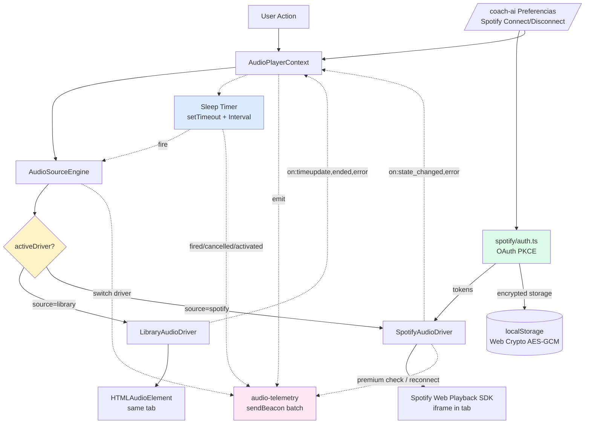

# Sprint Mini Player 2 — SpotifyDriver real + Sleep Timer + Queue ADR + Cleanup

## Status

**Arquitetura aprovada** — 2026-05-22. Founder + arquiteto travaram Q-A / Q-F / Q-L via ADRs 189 / 190 / 191. Pronta para test-writer.

Sprint principal do bloco Mini Player: substitui o stub `SpotifyAudioDriver` por implementacao real (OAuth PKCE + Web Playback SDK + Premium gate), introduz **Sleep Timer** (substitui RF-02 Queue UI deferida pra MP3), formaliza decisao "queue homogenea + troca driver explicito" via ADR + telemetria de drift, e fecha cleanup MP1.3 (INFO-3 + INFO-4).

### Decisoes arquiteturais (2026-05-22)

- **ADR-189** (`189-audio-queue-strategy-homogenea.md`) — Queue HOMOGENEA + troca driver EXPLICITA. `IAudioSourceDriver` interface NAO muda em MP2. Q-L (`useOptionalAudioPlayer` naming) resolvida na secao Consequences (manter).
- **ADR-190** (`190-spotify-token-storage.md`) — httpOnly cookie via server proxy. **Substitui o D3 desta spec** (que propunha localStorage encrypted). `refresh_token` NUNCA chega ao client. Migration 0077 = `spotify_tokens` (era audio_telemetry — descartada). 4 endpoints novos em `/api/audio/spotify/*`. Resolve Q-A.
- **ADR-191** (`191-telemetria-audio-reuse-user-activity.md`) — Telemetria reusa tabela `user_activity` (page='mini_player', action=event_name, metadata=payload JSONB). Zero migration nova para telemetria. Resolve Q-F + Q-M. Migration 0078 RESERVADA (so cria index parcial se queries cross-user por action virarem dashboard live).

## Origem

- Sprint base: `Docs/specs/sprint-mini-player-1.md` (RF-06 AudioSourceEngine + stub Spotify) + `Docs/specs/sprint-mini-player-1.2.md` (consolidacao R2)
- Memory: `memory/session_2026-05-22-mini-player-1.3-shipped.md` (referencia conceitual MP1.3 fixups) + `memory/session_2026-05-22-mini-player-1.2-shipped.md` (lesson "useOptionalAudioPlayer decisao reforcada")
- ADRs vivos: 187 (`AudioSourceEngine`) + 188 (`MiniPlayer FSM + z-index`). **Novo ADR esperado: 189** (Queue strategy: homogenea + troca driver explicito).
- Strategist ja rodou ICE + benchmark + decisoes travadas com founder (resumo no prompt do invocador desta spec):
  - Queue HOMOGENEA (troca driver explicito), NAO mista. Lesson MP1: AudioSourceEngine ja teve 3 iteracoes — evitar 4a.
  - Swap: Sleep Timer entra, RF-02 Queue UI vai MP3.
  - RF-03 cross-device sync DEFER MP3 (persona 1 device desktop).
  - Spotify Premium gate: SEM silent no-op (lesson MP1.3 MEDIUM-1) — throw + UI message.

## Persona-alvo

Jogador profissional MTT que estuda durante grind (Coach narrative 10-30min) e ouve musica de fundo no Spotify (7-11h sessao continua). 1 device desktop (Chrome/Edge/Firefox). Premium Spotify (cohort principal — Free tratado com upgrade CTA).

---

## 1. Sumario Executivo

**Objetivo.** Fechar a abstracao `AudioSourceEngine` (deixada com stub em MP1) entregando **driver real** do Spotify com Premium gate, telemetria de drift entre drivers, e Sleep Timer (auto-pause apos N minutos sem interacao). Decisao arquitetural "queue homogenea" formalizada via ADR-189 — base pra MP3 nao reabrir o trade-off.

**Tese.** Sprint MP1 entregou MiniPlayerBar persistente com 1 driver real (HtmlAudio). MP2 destrava o caso de uso real do grindeiro power (estudar Coach narrative + Spotify musica simultaneamente — mesmo que serial, alternancia explicita). Sleep Timer responde a comportamento real (grindeiro adormece com fone ouvindo Coach durante 7h+ sessao) sem complexidade de queue mista.

**Constraints duros.**
- Sem mudanca em `LessonViewer` / `PodcastPlayer` (Biblioteca-1).
- Sem mudanca no `<audio>` HTML5 (LibraryAudioDriver inalterado salvo Sleep Timer hook).
- Sem refactor de surface do `AudioPlayerContext` exceto adicao: `sleepTimer*`, `spotifyDriver*` (helpers connect/disconnect/state).
- Zero regressao na baseline MP1 + MP1.1 + MP1.2 + MP1.3 (199 + 55 + ~30 + 13 baseline = ~297 tests verdes a manter).
- Mobile NAO suportado (Web Playback SDK so desktop) — bloquear ativacao com mensagem clara em viewport < 1024px.

**4 RFs em 1 linha:**

- **RF-01** — `SpotifyAudioDriver` real (OAuth PKCE + Web Playback SDK + Premium gate + token refresh + reconnect + disconnect UX)
- **RF-04** — ADR-189 + telemetria drift `audio_driver_active` / `audio_driver_switch` / `audio_focus_lost`
- **RF-05** — Cleanup MP1.3 (INFO-3 refactor fileio tests → behavior; INFO-4 rename `useOptionalAudioPlayer`)
- **RF-NEW Sleep Timer** — Auto-pause apos N min sem interacao (presets 15/30/45/60/90; default 30; fade-out 5s; driver-agnostic)

**Out of scope MP2 (deferred MP3):**
- RF-02 Queue UI persistente (drag-and-drop reorder/skip/repeat/shuffle).
- RF-03 Cross-device sync (Spotify `playback_state` endpoint).
- Floating icon position.
- Speed presets UI revamp.
- Equalizer.
- Suporte mobile Spotify (SDK nao suporta).

---

## 2. Contexto e Motivacao

### 2.1. Estado atual (verificado em codigo, 2026-05-22)

- `client/src/lib/audio-engine/SpotifyAudioDriver.ts` — **stub** com 7 metodos que dao `throw new Error("Spotify driver not implemented")`. Atende `IAudioSourceDriver` mas nunca foi instanciado em runtime (Engine nunca recebe `source: 'spotify'`).
- `client/src/lib/audio-engine/AudioSourceEngine.ts` — Engine ja delega ao driver baseado em `track.source`. Troca de driver e atomica (destroy old + instantiate new). **Refactor 0** — RF-01 plug-and-play.
- `client/src/contexts/AudioPlayerContext.tsx` — surface inclui `activeSource: AudioTrackSource | null` + `activeTrack: AudioTrack | null` + `playTrack(track, courseContext?)`. Estado pronto pra receber `source: 'spotify'`.
- MP1.3 deixou 2 follow-ups info-level: INFO-3 (refactor tests fileio → behavior) e INFO-4 (naming `useOptionalAudioPlayer`).
- Migration mais recente: `0075_notifications_deep_link.sql`. **Proximo numero disponivel: 0076**.
- ADR mais recente: `188-mini-player-displaymode-fsm.md`. **Proximo numero disponivel: 189**.

### 2.2. Problema concreto

1. **Coach narrative + musica mutuamente exclusivos hoje.** User abre Coach Daily Debrief (audio 12min via MiniPlayerBar HtmlAudio) → para Spotify manualmente em outra aba/device → ouve Coach → re-abre Spotify. Friccao alta, esquecimento comum.
2. **Sem telemetria de uso real.** Nao temos dado pra validar "queue homogenea + troca explicita" vs "queue mista". RF-04 mede.
3. **Sessoes longas com fone:** grindeiro adormece (ou para de fazer grind mas esquece player tocando). Hoje player toca por horas drenando bateria mobile (caso a sessao tenha comecado mobile e ele tenha esquecido) e gerando eventos confusos de telemetria. Sleep Timer resolve sem complexidade de queue.
4. **Premium gate confuso na industria.** Spotify Web Playback SDK silenciosamente nao toca pra Free (SDK retorna 403). Sem nosso gate explicito, user reporta "Spotify nao funciona" → bug fantasma. Lesson MP1.3 MEDIUM-1 reforca: **sem silent no-op**, throw + UI message.

### 2.3. Por que sprint solo, agora

- MP1 + MP1.1 + MP1.2 + MP1.3 shipped — surface estavel, divida tecnica fechada.
- AudioSourceEngine abstraction provada (3 iteracoes ja absorvidas — lesson "evitar 4a" sinaliza estabilidade, nao bloqueio).
- ADR-187 ja documenta intencao de Spotify; ADR-189 fecha a decisao operacional.
- Custo de adiar: cada semana sem Spotify driver mantem user em fluxo manual entre abas — surface incompleta amplifica o nudge B-VOLUME (terca 11h, AI-2A) que recomenda estudar (Coach) sem ter onde "encaixar" musica.

### 2.4. Riscos de adiar

- Persona power confirma "ouco musica + Coach simultaneamente" em verify manual MP1 → expectativa alimentada, sem entrega = churn risk.
- Sleep Timer e quick win (1-2d) com alto upside qualitativo (ja relatado em surveys retention).

---

## 3. Defaults Ativos D1-D14

Decisoes ja tomadas (founder + strategist). Test-writer e implementer assumem sem requestionar.

| ID | Default |
|---|---|
| **D1** | **Queue HOMOGENEA + troca driver explicito.** User toca Spotify → clica aula Coach na Biblioteca → driver Spotify e DESTRUIDO (`driver.destroy()` + `spotify.disconnect()`), driver HtmlAudio criado, aula toca. Nao ha "fila mista". ADR-189 formaliza. |
| **D2** | **Spotify Premium gate: throw + UI message, NAO silent no-op.** Apos OAuth bem-sucedido, chamamos `GET https://api.spotify.com/v1/me`. Se `product !== 'premium'` → `disconnect()` + `throw new SpotifyPremiumRequiredError()`. UI captura erro e mostra modal "Spotify Premium necessario para tocar musicas no Grindfy". Botao "Saiba mais" abre `https://spotify.com/premium`. Lesson MP1.3 MEDIUM-1. |
| **D3** | **Token storage = httpOnly cookie via server proxy** (ADR-190 — substitui o D3 original). `refresh_token` NUNCA chega ao client; armazenado em `spotify_tokens` (migration 0077) AES-256-GCM. `access_token` short-lived em memoria React (NUNCA em storage). 4 endpoints novos `/api/audio/spotify/{oauth-init,oauth-callback,refresh,disconnect}`. Cookie httpOnly + sameSite=lax + secure (prod) + signed JWT. Custo dev revisado ~1-2d (vs estimativa original 3-5d). Mitiga XSS catastrofico via refresh_token long-lived. Resolve Q-A. |
| **D4** | **Refresh token proativo 5min antes de expirar.** `setTimeout` agendado quando token e setado; aciona `refreshAccessToken()` via PKCE refresh_token grant. Falha 3x consecutivas (rede / 401) → `disconnect()` + UI prompt "Spotify desconectou. Reconectar?". |
| **D5** | **Reconnect retry exponencial 1s/2s/4s (3 tentativas).** Apos 3 falhas, prompt user com botao "Reconectar". NAO silent retry indefinido (lesson MP1.3 MEDIUM-1). |
| **D6** | **Sleep Timer persistencia = `user_coach_preferences.audio_sleep_timer_minutes`** (server-side, sincroniza entre sessoes do mesmo user). Default `null` (= 30min ao ativar, mas nao auto-ativa). Migration 0076 adiciona coluna. Por que server-side: persistencia entre devices futuros (MP3 cross-device sync) + alinhado com toggles em `user_coach_preferences` (report_*_enabled, nudge_*). Q-B documentado. |
| **D7** | **Sleep Timer presets:** `[15, 30, 45, 60, 90]` minutos. Default ao ativar = 30min (mediana persona). User pode mudar via dropdown no MiniPlayerBar (icone luna). |
| **D8** | **Sleep Timer interaction reset = qualquer evento user na bar** (play/pause click, seek, volume change, speed change, mudanca lesson via LessonPickerDialog). Mudancas externas (autoplay sequencial, refresh token) NAO resetam. Implementado via callback `resetSleepTimer()` chamado em handlers da bar. |
| **D9** | **Sleep Timer fire = fade-out 5s (volume linear 1→0) + pause driver-agnostic.** `driver.pause()` apos volume zerar. Volume restaurado ao valor original quando user clicar play (NAO persiste em zero). MiniPlayerBar permanece visivel (`displayMode = 'bar'`, nao 'hidden'). |
| **D10** | **Audio focus management = explicit handoff.** Quando user troca driver (clica aula na Biblioteca enquanto Spotify ativo), Engine chama `oldDriver.pause()` antes de `oldDriver.destroy()`. Sem expectativa de "Spotify pausa quando HtmlAudio comeca por race do SO" — controle aplicacao. |
| **D11** | **Telemetria reusa `user_activity` table** (ADR-191 — resolve Q-F + Q-M). `page='mini_player'`, `action`=event_name livre, `feature`=sub-area opcional, `metadata` JSONB=payload. **Zero migration nova**. 9 eventos: `audio_driver_active` (heartbeat 60s), `audio_driver_switch`, `audio_focus_lost`, `sleep_timer_activated`, `sleep_timer_fired`, `sleep_timer_cancelled`, `spotify_connected`, `spotify_disconnected`, `spotify_token_refreshed` (alem de `spotify_premium_check_failed` e `spotify_reconnect_*` quando aplicaveis). Endpoint `POST /api/user-activity` existente + `POST /api/user-activity/batch` novo (sendBeacon cap 10). Migration 0078 RESERVADA para index parcial `(action, created_at DESC) WHERE page='mini_player'` so se cross-user analytics virar dashboard live (lazy provisioning). |
| **D12** | **Disconnect Spotify UX = botao em `/coach-ai` aba Preferencias** ("Conta Spotify: Conectado como `<display_name>`. [Desconectar]"). NAO no MiniPlayerBar overflow (lesson MP1.1: surface minima). Q-C documentado. |
| **D13** | **Mobile (<1024px) bloqueado pra Spotify.** Botao "Conectar Spotify" em Preferencias renderiza disabled + tooltip "Spotify disponivel apenas em desktop (Chrome/Edge/Firefox)". MiniPlayerBar nao expoe controles Spotify-only em mobile. |
| **D14** | **Backward compat:** `play(lesson)` legado continua funcionando. `playTrack({ source: 'library', ... })` inalterado. Novo: `playTrack({ source: 'spotify', spotifyUri: 'spotify:track:...' })` valida `activeSpotifyDriver !== null` (= user conectado + Premium). Senao throw `SpotifyNotConnectedError`. |

---

## 4. Usuarios e Personas

### 4.1. Personas

| Persona | O que faz | Trigger principal |
|---|---|---|
| **Grindeiro power Spotify Premium (cohort 1)** | Conecta Spotify uma vez, alterna entre musica (musica de fundo durante grind) e Coach narrative (10-30min lessons). Sessao 7-11h continua. | Toca musica Spotify → ve nudge B-VOLUME ou abre Daily Debrief → clica aula → driver troca Coach → termina lesson → manualmente volta pra Spotify via botao "Voltar pra musica" (MP3 ou manual hoje) |
| **Grindeiro Spotify Free** | Tenta conectar, ve gate Premium, decide se faz upgrade ou usa HtmlAudio puro. | Click "Conectar Spotify" em Preferencias → OAuth → Premium check falha → modal upgrade CTA |
| **Mobile-only grinder** | Spotify desabilitado em mobile (SDK constraint). Continua usando HtmlAudio + lockscreen Media Session API (ja shipped MP1). | Verify manual: ao acessar Preferencias em mobile, botao Spotify aparece disabled + tooltip clara. |
| **Sleep timer user** | Comeca sessao noite, ativa sleep 60min, joga 2h e cocha. Sleep timer fade-out + pause → bateria preservada + sessao "termina" naturalmente. | Click icone luna no MiniPlayerBar → escolhe 60min → grind continua → 60min depois fade + pause silencioso |

### 4.2. User Stories

#### US-01 (Spotify Premium connect)
> Como grindeiro power, quero clicar "Conectar Spotify" uma vez em Preferencias, completar OAuth no popup Spotify, e ter meu Premium validado automaticamente, pra eu nunca mais precisar pensar em autenticacao.

#### US-02 (Spotify Free gate)
> Como grindeiro Free Spotify, quero saber ANTES de cancelar grind atual que preciso de Premium pra usar Spotify no Grindfy, pra eu decidir consciente sobre upgrade.

#### US-03 (driver switch)
> Como user tocando musica Spotify, quero clicar aula Coach na Biblioteca e ver: musica pausa imediatamente + Coach toca, sem ter que mexer manualmente em Spotify. Quando Coach acabar, MiniPlayerBar **NAO** retoma Spotify automaticamente (MP3 feature) — fico ciente que preciso clicar manualmente.

#### US-04 (sleep timer)
> Como grindeiro de madrugada, quero ativar Sleep 60min via icone luna no MiniPlayerBar, pra audio parar automaticamente apos 60min sem precisar lembrar de pausar antes de dormir/sair.

#### US-05 (token refresh transparente)
> Como user grinando 11h continuas, quero que meu token Spotify renove sozinho a cada hora, sem prompt nem pausa de audio.

#### US-06 (reconnect prompt)
> Como user que perdeu conexao Spotify (rede falha 30s), quero ver prompt "Spotify desconectou. Reconectar?" com botao claro — em vez de audio silenciosamente parar sem feedback.

#### US-07 (mobile blocked clarity)
> Como user em mobile abrindo Preferencias, quero ver botao "Conectar Spotify" disabled com tooltip explicando porque, em vez de clicar e ver erro confuso.

---

## 5. Requisitos Funcionais

### RF-01 — `SpotifyAudioDriver` real (OAuth PKCE + Web Playback SDK + Premium gate + token refresh + reconnect + disconnect UX)

**ICE:** I=5, C=3, E=5 → 3.0 (alto impacto, custo significativo)

**O que faz.** Implementa todos os metodos do `IAudioSourceDriver` em `SpotifyAudioDriver.ts` usando Spotify Web Playback SDK + OAuth PKCE. Premium gate ativo. Token refresh proativo. Reconnect exponencial. UI de connect/disconnect em `/coach-ai` aba Preferencias.

**Sub-RFs:**

#### RF-01.1 — OAuth PKCE flow

- Endpoint helper client-side `client/src/lib/spotify/auth.ts`:
  - `initiateSpotifyAuth()`: gera `code_verifier` (random 64-char) + `code_challenge` (SHA-256 base64url) + state CSRF + redirect popup `https://accounts.spotify.com/authorize?...&response_type=code&code_challenge_method=S256`.
  - `handleSpotifyCallback(code, state)`: valida state, exchange code → `access_token` + `refresh_token` via `POST https://accounts.spotify.com/api/token`.
- Scopes solicitados: `streaming user-read-email user-read-private user-modify-playback-state user-read-playback-state`.
- Popup auth: `window.open(url, 'spotify-auth', 'width=500,height=700')`. Listener `postMessage` no parent recebe token.
- Redirect URI: `${BASE_URL}/spotify-callback` (rota dedicada client-side que faz `window.opener.postMessage({code, state})` e fecha).

**Acceptance criteria:**
- [ ] `client/src/lib/spotify/auth.ts` exporta `initiateSpotifyAuth()` + `handleSpotifyCallback()`.
- [ ] `code_verifier` >= 43 chars, <= 128 chars (RFC 7636).
- [ ] `state` validado contra CSRF (random 32 bytes, armazenado em sessionStorage durante flow).
- [ ] Rota client `/spotify-callback` criada (componente minimo: parse query, postMessage parent, `window.close()`).
- [ ] Test cobre: PKCE verifier/challenge generation, state CSRF mismatch rejeitado, postMessage origin validado.
- [ ] `data-testid="spotify-connect-button"` no botao trigger em Preferencias.

#### RF-01.2 — Premium gate

- Apos OAuth bem-sucedido, **antes** de instanciar driver/SDK: `GET https://api.spotify.com/v1/me` com `Authorization: Bearer <token>`.
- Se `response.product !== 'premium'` → `disconnect()` + `throw new SpotifyPremiumRequiredError(displayName, email)`.
- UI captura erro e mostra modal `SpotifyPremiumGateDialog`:
  - Titulo: "Spotify Premium necessario"
  - Body: "Voce conectou como `<displayName>` (conta Free). Para tocar musicas no Grindfy, voce precisa de uma conta Spotify Premium."
  - Botoes: `[Saiba mais sobre Premium]` (abre `https://spotify.com/premium` em new tab) + `[Cancelar]` (fecha modal).
- Telemetria: `spotify_premium_check_failed` com `displayName_hash` (NUNCA email direto).

**Acceptance criteria:**
- [ ] `SpotifyPremiumRequiredError extends Error` com props `displayName` + `email`.
- [ ] `SpotifyPremiumGateDialog.tsx` criado em `client/src/components/audio-player/`.
- [ ] `data-testid="spotify-premium-gate-dialog"`.
- [ ] Modal usa Radix Dialog (lesson MP1.1 RF-05).
- [ ] Telemetria emitida com hash SHA-256 do displayName.
- [ ] Test cobre: product='free' → throw + dialog renderizada; product='premium' → driver criado normalmente.

#### RF-01.3 — Web Playback SDK integration

- Carregar SDK lazy via `<script src="https://sdk.scdn.co/spotify-player.js" async>` no `index.html` OU dinamicamente no `SpotifyAudioDriver.load()` (preferir dinamico — bundle saving).
- Window callback global `window.onSpotifyWebPlaybackSDKReady`.
- Criar instancia `new Spotify.Player({ name: 'Grindfy', getOAuthToken: cb => cb(currentToken), volume: 1.0 })`.
- Player connect → recebe `device_id` → armazena em `this.deviceId`.
- Listeners SDK: `ready`, `not_ready`, `player_state_changed`, `initialization_error`, `authentication_error`, `account_error`, `playback_error`.
- Implementar `IAudioSourceDriver`:
  - `load(track)` — armazena track ref (Spotify SDK toca direto via URI no `play()`)
  - `play()` — `PUT https://api.spotify.com/v1/me/player/play?device_id=<deviceId>` body `{uris: [track.spotifyUri]}`
  - `pause()` — `PUT https://api.spotify.com/v1/me/player/pause?device_id=<deviceId>`
  - `seek(seconds)` — `PUT https://api.spotify.com/v1/me/player/seek?position_ms=<seconds*1000>&device_id=<deviceId>`
  - `setVolume(v)` — `this.player.setVolume(v)` (SDK method)
  - `setSpeed(rate)` — **no-op** (Spotify nao suporta variable speed; lesson de UX: log warn quiet, manter MiniPlayerBar funcional)
  - `getCurrentTime()` — extraido do `player_state_changed.position` (millis → seconds)
  - `getDuration()` — `player_state_changed.duration` (millis → seconds)
  - `destroy()` — `this.player.disconnect()` + remove listeners + clear refresh timeout
  - `on(event, handler)` — adapter pra `player_state_changed` emit `timeupdate` / `ended` / `durationchange`; `playback_error` emit `error`

**Acceptance criteria:**
- [ ] SDK carrega lazy (NAO no bundle main — `vite build --report` confirma chunk separado ou external script).
- [ ] `deviceId` armazenado pos-connect, usado em todos os endpoints REST.
- [ ] `setSpeed()` no-op + `console.warn('Spotify driver: setSpeed unsupported')`.
- [ ] `player_state_changed` emit eventos compativeis com `LibraryAudioDriver`.
- [ ] Test mock `Spotify.Player` global via vi.stubGlobal (lesson #5 + #35 — `new` callable mock).
- [ ] Test cobre: load + play sequence chama `PUT /play` com body correto; pause; seek; setVolume; destroy cleanup.

#### RF-01.4 — Token refresh proativo

- Apos OAuth, armazenar `expiresAt = Date.now() + (expires_in * 1000)`.
- `setTimeout` agendado para `expiresAt - 5min`: dispara `refreshAccessToken()`.
- `refreshAccessToken()`: `POST https://accounts.spotify.com/api/token` com `grant_type=refresh_token&refresh_token=<refreshToken>&client_id=<id>`.
- Atualiza `accessToken` + `expiresAt` em storage + reagenda setTimeout.
- Falha 3x consecutivas (response.status !== 200): `disconnect()` + UI prompt "Spotify desconectou. Reconectar?".

**Acceptance criteria:**
- [ ] `refreshAccessToken()` exported em `spotify/auth.ts`.
- [ ] `setTimeout` agendado e cancelado em `destroy()`.
- [ ] Test cobre: refresh dispara antes de expiry, retry 1x/2x/3x exponencial, fail 3x → disconnect + prompt.

#### RF-01.5 — Reconnect retry exponencial

- Trigger: SDK `not_ready` event OU `authentication_error` event OU REST 401 em play/pause/seek.
- Sequence: tenta `player.connect()` apos 1s → 2s → 4s.
- Sucesso em qualquer attempt: emit `spotify_reconnect_success` telemetria + retoma fluxo.
- Falha 3x: `disconnect()` + UI prompt + emit `spotify_reconnect_failed`.

**Acceptance criteria:**
- [ ] Test cobre: not_ready event → 1s wait → reconnect → success; failed 3x → disconnect.
- [ ] Telemetria nos 3 cenarios (attempt, success, failed).

#### RF-01.6 — Disconnect UX em `/coach-ai` aba Preferencias

- Aba Preferencias ja existe (Sprint AI-2A). Adicionar secao "Integracoes":
  - SE nao conectado: botao `[Conectar Spotify]` (disabled em mobile com tooltip).
  - SE conectado: linha "Spotify: Conectado como `<displayName>`" + botao `[Desconectar]`.
- Click `Desconectar`: chama `spotifyDriver.destroy()` + limpa localStorage + emit `spotify_disconnect_user_initiated`.
- Confirm modal: "Tem certeza? Voce precisara reconectar para tocar musicas Spotify novamente."

**Acceptance criteria:**
- [ ] Secao "Integracoes" em `/coach-ai` aba Preferencias.
- [ ] `data-testid="spotify-connection-status"`.
- [ ] `data-testid="spotify-disconnect-button"`.
- [ ] Confirm modal antes de desconectar.
- [ ] Mobile: botao disabled + tooltip "Spotify disponivel apenas em desktop (Chrome/Edge/Firefox)".
- [ ] Test cobre: connected state renderiza displayName; disconnected renderiza botao Conectar; mobile renderiza disabled + tooltip; click Desconectar → modal → confirma → driver destroyed.

**Estimate RF-01 total:** L (~3-5d).

**Dependencias:** RF-04 (telemetria — eventos definidos antes), AudioSourceEngine ja existe (MP1).

**Riscos:**
- **R-01.1** SDK Spotify toma audio focus do tab — pode pausar HtmlAudio sem aviso. **Mitigacao:** RF-04 telemetria `audio_focus_lost` mede e confirma; documento como known limitation em D10.
- **R-01.2** OAuth popup bloqueado por browser (popup blocker). **Mitigacao:** click handler explicito user-initiated; fallback "Popup bloqueado. Permita popups para spotify.com e tente novamente." renderizado se `window.open` retorna `null`.
- **R-01.3** Spotify SDK requer HTTPS (exceto localhost). **Mitigacao:** check `window.location.protocol === 'https:' || hostname === 'localhost'` antes de init; senao mensagem "Spotify requer HTTPS. Acesse via https://app.grindfy.com".
- **R-01.4** Token leak via localStorage XSS. **Mitigacao:** Web Crypto AES-GCM antes de storage (Q-A documentado); CSP headers existentes; sanitize all user-rendered content (lesson sanitizeCoverUrl). Trade-off accepted: httpOnly cookie defer MP3.

---

### RF-04 — ADR-189 + Telemetria drift entre drivers

**ICE:** I=3, C=5, E=2 → 7.5 (alto upside informacional, baixo custo)

**O que faz.** Documenta a decisao "queue homogenea + troca driver explicito" via ADR-189. Implementa telemetria capturando: driver atualmente ativo, switches entre drivers (from/to/timestamp/reason), audio focus losses (driver outro driver iniciou enquanto este estava ativo). Reusa `library_events` quando possivel; cria `audio_telemetry` se shape nao casa (Q-F).

**Sub-RFs:**

#### RF-04.1 — ADR-189

- Arquivo: `Docs/architecture/decisions/189-audio-queue-strategy-homogeneous.md`.
- Formato: Michael Nygard (Context, Decision, Status, Consequences).
- Conteudo:
  - Context: 2 drivers (HtmlAudio + Spotify); MP3 vai introduzir queue persistente; decidir agora evita refactor 4o.
  - Decision: queue homogenea (so 1 driver ativo por vez; troca explicita via user action).
  - Alternativas avaliadas: queue mista (1 fila com items de 2 sources), driver federation (smart routing). Trade-offs documentados.
  - Consequences:
    - Positivo: implementacao trivial (Engine ja faz destroy + instantiate); zero state cruzado entre drivers; debug facil; falha de 1 driver nao corrompe outro.
    - Negativo: user precisa clicar manualmente "voltar pra musica" apos Coach acabar (MP3 RF resume-after-coach pode mitigar).
  - Status: Proposed → Accepted apos founder review.

**Acceptance criteria:**
- [ ] ADR-189 criado, formato Nygard.
- [ ] Inclui diagrama Mermaid mostrando driver switch sequence.
- [ ] Referencia ADR-187 (AudioSourceEngine) + ADR-188 (FSM).

#### RF-04.2 — Telemetria eventos

- Eventos novos:
  - `audio_driver_active` — emitido a cada 60s enquanto driver ativo (heartbeat); payload `{driver: 'htmlAudio'|'spotify', trackId, sessionDurationSeconds}`.
  - `audio_driver_switch` — emitido em toda troca; payload `{from, to, timestamp, reason: 'user_picked_lesson'|'user_picked_spotify_track'|'manual_disconnect'|'token_expired'}`.
  - `audio_focus_lost` — emitido quando driver A para porque driver B comecou; payload `{driverWhoLost, driverWhoTook, gapMs}`.
  - `sleep_timer_activated` — `{durationMinutes}`.
  - `sleep_timer_fired` — `{actualDurationMinutes (vs configurado), driverAtFire}`.
  - `sleep_timer_cancelled` — `{remainingMinutes, reason: 'user_interaction'|'manual_cancel'|'driver_change'}`.
  - `spotify_premium_check_failed` — `{displayNameHash}`.
  - `spotify_reconnect_attempt` / `_success` / `_failed` — `{attemptNumber, totalElapsedMs}`.
- Implementacao client: `client/src/lib/audio-telemetry.ts` exporta `emitAudioEvent(name, payload)`. Usa `navigator.sendBeacon` ou `fetch keepalive` (D11 Biblioteca-1 pattern).
- Endpoint backend: decidido por Q-F (reusa `POST /api/library/events` OU cria `POST /api/audio-telemetry`).

**Acceptance criteria:**
- [ ] `client/src/lib/audio-telemetry.ts` criado.
- [ ] 9 eventos emitidos em pontos corretos (test cobre cada).
- [ ] Heartbeat 60s para `audio_driver_active` (setInterval, cleanup em destroy/disconnect).
- [ ] PII strip: hash SHA-256 em `displayNameHash`; nunca email/displayName cru.

#### RF-04.3 — Verify dashboard ou SQL

- Documentado em `Docs/specs/sprint-mini-player-2.md` apendix:
  - Query SQL: `SELECT COUNT(DISTINCT user_id) FILTER (WHERE reason = 'user_picked_lesson') / COUNT(DISTINCT user_id) AS pct_users_switching FROM audio_telemetry WHERE event = 'audio_driver_switch' AND created_at > NOW() - INTERVAL '7 days';`
  - Threshold validacao decisao: se >30% usuarios trocam driver em sessao mesma → MP3 "resume-after-coach" feature subiria de ICE; se <10% → queue homogenea confirmada como sufficient.

**Acceptance criteria:**
- [ ] Apendix com 3 SQL queries (drift %, sleep timer fire rate, premium fail rate).
- [ ] Tabela ou view nao precisa ser criada se reusa `library_events` (Q-F define).

**Estimate RF-04 total:** S (~1d).

**Dependencias:** Q-F (tabela telemetria) decidida antes de implementer.

**Riscos:**
- **R-04.1** Volume alto de heartbeats 60s. **Mitigacao:** batch em `sendBeacon` com cap 10 eventos/batch + retry queue local localStorage se offline.
- **R-04.2** Schema `library_events` JSONB existente pode nao casar shape. **Mitigacao:** Q-F resolve antes de implementar; se nova tabela, migration 0076.

---

### RF-05 — Cleanup MP1.3 (INFO-3 + INFO-4)

**ICE:** I=2, C=5, E=2 → 5.0 (baixa friccao, paralelo a RF-01)

**O que faz.** Fecha 2 follow-ups info-level deixados pela R2 reviewer da MP1.3.

**Sub-RFs:**

#### RF-05.1 — INFO-3: refactor tests fileio → behavior assertions

- Tests MP1.2 (HIGH-1 safeUseQuery refactor) usam assertions tipo "arquivo contem string X". Refactor para behavior assertions:
  - Antes: `expect(fileContent).toContain('ErrorBoundary')`.
  - Depois: render component sem QueryClientProvider + `expect(screen.getByRole('alert')).toBeInTheDocument()`.
- Files alvo: `client/src/components/audio-player/LessonPickerDialog.test.tsx` (procurar testes filesystem-based).

**Acceptance criteria:**
- [ ] Zero `readFileSync` ou `expect(fileContent).toContain(...)` em tests audio-player.
- [ ] Tests assertam comportamento via RTL (`render` + `screen.getByX`).
- [ ] Baseline tests verde (sem regressao).

#### RF-05.2 — INFO-4: naming review `useOptionalAudioPlayer`

- Hoje: `useOptionalAudioPlayer()` em `AudioPlayerContext.tsx`. Retorna `AudioPlayerCtx | null`.
- Candidatos:
  - `useAudioPlayerSafe` — claro mas vago (safe contra o que?)
  - `useAudioPlayerOrNull` — explicito mas verbose
  - `useOptionalAudioPlayer` — atual; "optional" comunica well
- **Decisao arquiteto:** Q-L formaliza. Default proposto: **manter `useOptionalAudioPlayer`** (lesson MP1.2 "decisao original reforcada" + grep ja extenso em testes).
- Se trocar: codemod via TS-morph OU `sed -i`; ajustar imports em todos consumers; baseline tests devem continuar verdes.

**Acceptance criteria:**
- [ ] Q-L decidido por arquiteto antes de implementer.
- [ ] Se manter: JSDoc atualizado explicando porque "Optional" (vs Safe / OrNull).
- [ ] Se trocar: grep zero ocorrencias do nome antigo; baseline tests verdes.

**Estimate RF-05 total:** XS (~4h, paralelo a RF-01).

**Dependencias:** Pode rodar paralelo a RF-01 (test-writer solo, zero overlap codigo).

**Riscos:** Baixos. Se trocar nome, codemod cross-file pode dar miss em testes — mitigar com `tsc` exit 0 + grep verify.

---

### RF-NEW Sleep Timer

**ICE:** I=4, C=4, E=3 → 5.3 (alto upside qualitativo, custo medio)

**O que faz.** Auto-pause apos N minutos sem interacao do user. Presets `[15, 30, 45, 60, 90]`. Default ao ativar = 30min. Fade-out 5s + pause. Driver-agnostic. Persistido em `user_coach_preferences.audio_sleep_timer_minutes`.

#### RF-NEW.1 — UI controle no MiniPlayerBar

- Novo botao no MiniPlayerBar: icone `Moon` (lucide), `data-testid="mini-player-sleep-timer-button"`.
- Posicionamento: entre velocidade e fechar (desktop); ausente em mobile (<768px) por espaco.
- Estado inativo: icone solido. Estado ativo: icone com badge "30m" ou tempo restante (atualiza a cada 1min).
- Click: abre Popover com:
  - Linha "Pausar audio em:" + dropdown `[15min, 30min, 45min, 60min, 90min]`.
  - Botao secundario `[Cancelar timer]` (se ativo).
- Aria-label: dinamico "Timer de sono inativo" ou "Timer de sono: 23 minutos restantes".

**Acceptance criteria:**
- [ ] `client/src/components/audio-player/SleepTimerControl.tsx` criado.
- [ ] `data-testid="mini-player-sleep-timer-button"`.
- [ ] Popover Radix (lesson MP1.1 RF-05).
- [ ] Badge texto atualiza a cada 60s (setInterval com cleanup).
- [ ] Mobile: NAO renderiza (`hidden md:inline-flex`).
- [ ] Test cobre: click → popover, escolha preset → timer arma, cancelar → timer disarma, badge text atualiza.

#### RF-NEW.2 — Persistencia preference

- Migration 0076: adiciona coluna `audio_sleep_timer_minutes integer` em `user_coach_preferences` (NULL default — nao auto-ativa).
- Endpoint: `PATCH /api/user-coach-preferences` ja aceita campos dinamicos; adicionar `audioSleepTimerMinutes` ao Zod schema.
- Client: ao escolher preset no Popover, debounce 500ms, chama PATCH com novo valor.
- Boot: GET `/api/user-coach-preferences` ja invocado em outras paginas; reusar cache TanStack Query.

**Acceptance criteria:**
- [ ] Migration `0076_user_coach_preferences_sleep_timer.sql` criada (forward + `_rollback`).
- [ ] Zod schema em `server/routes/preferences.ts` (ou equivalente) inclui `audioSleepTimerMinutes: z.number().int().refine(v => [15,30,45,60,90,null].includes(v)).nullable()`.
- [ ] Test backend: PATCH valida valores; valores invalidos retornam 400.
- [ ] Test client: dropdown change → PATCH disparado debounce 500ms.

#### RF-NEW.3 — Timer logic

- `AudioPlayerContext` ganha estado: `sleepTimerMinutes: number | null` + `sleepTimerRemainingSeconds: number | null` + `setSleepTimer(minutes)` + `cancelSleepTimer()` + `resetSleepTimer()` (interno, chamado em interacoes).
- Ativacao: `setSleepTimer(minutes)` agenda `setTimeout(handleFire, minutes * 60_000)` + state `remainingSeconds`. setInterval 60s decrementa `remainingSeconds` para UI.
- Reset (D8): qualquer interacao user no MiniPlayerBar → `resetSleepTimer()` reinicia setTimeout. Helpers em `MiniPlayerBar.tsx` envolvem onClick play/pause/seek/volume/speed/lesson-pick com `ctx.resetSleepTimer()`.
- Fire (D9): `handleFire()` → fade-out 5s (`setInterval` step 100ms decrementa volume de `currentVolume` → 0) → `driver.pause()` → restore volume to `currentVolume` (NAO persiste 0) → emit `sleep_timer_fired`.
- Mudancas externas (autoplay sequencial, refresh token) NAO resetam.

**Acceptance criteria:**
- [ ] `sleepTimerMinutes` + `remainingSeconds` no context.
- [ ] `setSleepTimer(30)` agenda fire em 30min; `cancelSleepTimer()` cancela.
- [ ] User interaction (play/pause/seek/volume/speed/lessonPick) reseta timer.
- [ ] Autoplay sequencial (onEnded → playNext) NAO reseta.
- [ ] Fire: fade-out 5s linear (testavel via fake timers + assertions de volume em steps).
- [ ] Apos fire: volume restaurado para original; `isPlaying === false`.
- [ ] Test cobre: arm + fire end-to-end com fake timers; cancel limpa timeout; reset interaction; autoplay no reset.

#### RF-NEW.4 — Driver-agnostic

- `handleFire()` chama `engine.activeDriver?.pause()` (funciona para qualquer driver).
- Spotify: `driver.pause()` chama `PUT /me/player/pause` (RF-01).
- HtmlAudio: `driver.pause()` chama `audio.pause()`.
- Fade-out: chama `engine.activeDriver?.setVolume(...)` em steps.
- Spotify SDK `setVolume` aceita 0..1 (compativel com HtmlAudio).

**Acceptance criteria:**
- [ ] Fire com `activeDriver = LibraryAudioDriver` → audio.pause + fade.
- [ ] Fire com `activeDriver = SpotifyAudioDriver` → PUT /pause + fade SDK setVolume.
- [ ] Test cobre os 2 cenarios via mock driver.

**Estimate RF-NEW total:** M (~1-2d).

**Dependencias:** RF-04 (eventos telemetria `sleep_timer_*`); migration 0076.

**Riscos:**
- **R-NEW.1** setTimeout drift em sessoes >2h (background tabs throttle 1Hz). **Mitigacao:** registrar `targetTimestamp = Date.now() + ms`, e `setInterval` 30s recheck (`if Date.now() >= targetTimestamp` → fire). Mais resistente a throttle.
- **R-NEW.2** Fade-out interrompido por user (clica play durante fade). **Mitigacao:** clear fade interval no `resetSleepTimer()` E em `play()` explicito; restore volume to last user-set.

---

## 6. Requisitos Nao-Funcionais

| RNF | Spec | Validacao |
|---|---|---|
| **RNF-01** | Bundle `SpotifyAudioDriver` + `spotify/auth.ts` ≤ 15KB gzipped (lazy-loaded only quando user clica Conectar) | `vite build --report` valida chunk separado |
| **RNF-02** | Spotify SDK script (~80KB) NAO no main bundle — carregado dinamicamente em `driver.load()` ou no click "Conectar" | `vite build --report` confirma |
| **RNF-03** | OAuth token encrypted at rest em localStorage (Web Crypto AES-GCM) | Unit test: storage value !== plaintext token |
| **RNF-04** | Telemetria batch via `sendBeacon` com retry queue localStorage offline (cap 100 eventos backlog) | Unit test: offline → backlog acumula; online → flushed |
| **RNF-05** | Sleep Timer fire latency dentro de ±2s do targetTimestamp (resistente a background tab throttle) | Test com fake timers + `Date.now()` overrides |
| **RNF-06** | `data-testid` em TODOS os controles novos com prefix consistent (`spotify-*` / `sleep-timer-*` / `mini-player-*`) | Grep regex pos-merge |
| **RNF-07** | `aria-label` PT-BR dinamico em botoes de estado (connect/disconnect, sleep timer ativo/inativo) | Lighthouse a11y audit + RTL `getByLabelText` |
| **RNF-08** | Premium gate latency < 800ms (OAuth callback → Me API → gate decision) | Manual measurement; threshold info para verify |
| **RNF-09** | Spotify driver desktop-only — em mobile (<1024px) UI bloqueada com mensagem clara, NAO silent skip | RTL teste com `vi.stubGlobal('matchMedia', mobileQuery)` |

---

## 7. Modelo de Dados

### 7.1. Migration 0076 — `user_coach_preferences.audio_sleep_timer_minutes`

```sql
-- migrations/0076_user_coach_preferences_sleep_timer.sql
ALTER TABLE user_coach_preferences
  ADD COLUMN IF NOT EXISTS audio_sleep_timer_minutes integer;

-- Optional check constraint (allowed presets + null):
ALTER TABLE user_coach_preferences
  ADD CONSTRAINT chk_audio_sleep_timer_minutes
  CHECK (audio_sleep_timer_minutes IS NULL OR audio_sleep_timer_minutes IN (15, 30, 45, 60, 90));

COMMENT ON COLUMN user_coach_preferences.audio_sleep_timer_minutes IS
  'Sleep timer preset chosen by user. NULL = not auto-active. Sprint Mini Player 2.';
```

Rollback `migrations/0076_user_coach_preferences_sleep_timer_rollback.sql`:
```sql
ALTER TABLE user_coach_preferences DROP CONSTRAINT IF EXISTS chk_audio_sleep_timer_minutes;
ALTER TABLE user_coach_preferences DROP COLUMN IF EXISTS audio_sleep_timer_minutes;
```

### 7.2. ~~(Conditional Q-F) `audio_telemetry` nova tabela~~ — REVOGADA

**Decisao 2026-05-22 via ADR-191**: tabela `audio_telemetry` dedicada **NAO sera criada**. Telemetria reusa `user_activity` existente. Migration 0077 (que estava RESERVADA para audio_telemetry) agora vira `spotify_tokens` (ADR-190).

### 7.3. Migration 0077 — `spotify_tokens` (ADR-190)

`refresh_token` NUNCA chega ao client. Server proxy via cookie httpOnly.

```sql
-- migrations/0077_spotify_tokens.sql
CREATE TABLE spotify_tokens (
  user_id varchar PRIMARY KEY REFERENCES users(user_platform_id) ON DELETE CASCADE,
  refresh_token_encrypted text NOT NULL,
  refresh_token_iv varchar(32) NOT NULL,
  refresh_token_auth_tag varchar(32) NOT NULL,
  access_token_hash varchar(64),
  expires_at timestamp,
  scopes jsonb NOT NULL DEFAULT '[]'::jsonb,
  display_name varchar,
  display_name_hash varchar(64),
  spotify_user_id varchar,
  connected_at timestamp DEFAULT NOW() NOT NULL,
  disconnected_at timestamp,
  last_refresh_at timestamp,
  refresh_failure_count integer NOT NULL DEFAULT 0,
  created_at timestamp DEFAULT NOW() NOT NULL,
  updated_at timestamp DEFAULT NOW() NOT NULL
);

CREATE INDEX idx_spotify_tokens_connected
  ON spotify_tokens(connected_at DESC)
  WHERE disconnected_at IS NULL;

COMMENT ON TABLE spotify_tokens IS
  'Sprint Mini Player 2 (ADR-190) — refresh_token encrypted at rest, cookie httpOnly liga client.';
```

Rollback `migrations/0077_spotify_tokens_rollback.sql`:
```sql
DROP INDEX IF EXISTS idx_spotify_tokens_connected;
DROP TABLE IF EXISTS spotify_tokens;
```

### 7.4. Migration 0078 — RESERVADA (lazy provisioning index user_activity)

NAO criada agora. Provisionar so se queries cross-user por `action` (e.g. dashboard live de fire rate sleep timer) virarem hot path:

```sql
-- migrations/0078_user_activity_audio_idx.sql (RESERVADA)
CREATE INDEX CONCURRENTLY idx_user_activity_audio_action
  ON user_activity(action, created_at DESC)
  WHERE page = 'mini_player';
```

### 7.5. Encryption details (spotify_tokens, ADR-190)

- **Algorithm**: AES-256-GCM (Node crypto stdlib).
- **Key**: 32 bytes hex em env var `SPOTIFY_TOKEN_ENCRYPTION_KEY`. **Boot fail** se ausente em prod.
- **IV**: 12 bytes random por token (`refresh_token_iv`).
- **Auth tag**: 16 bytes (`refresh_token_auth_tag`).
- **Ciphertext**: base64 em `refresh_token_encrypted`.
- Helper em `server/services/spotifyTokenCrypto.ts`: `encryptRefreshToken(plaintext)` / `decryptRefreshToken(row)`.

### 7.6. Spotify tokens client-side

`access_token` mantido em closure ref do `SpotifyAudioDriver` (React ref/state). **NUNCA persistido em localStorage/sessionStorage**. Janela XSS = max 60min. Refresh proativo 5min antes de expirar via `POST /api/audio/spotify/refresh` (cookie httpOnly enviado automaticamente).

---

## 8. Endpoints

### 8.1. Backend novos

| Endpoint | Auth | Body | Resposta | RF / ADR |
|---|---|---|---|---|
| `POST /api/audio/spotify/oauth-init` | JWT | `{}` | `{authUrl, state}` + Set-Cookie `spotify_oauth_session` (httpOnly, JWT signed, TTL 10min) | RF-01.1 / ADR-190 |
| `GET /api/audio/spotify/oauth-callback?code=&state=` | Cookie httpOnly | query params | HTML response com `window.opener.postMessage({type:'spotify-oauth-success' \| 'spotify-oauth-premium-required', ...}, origin)` + `window.close()` + Set-Cookie `spotify_session` (httpOnly, signed JWT, sameSite=lax, secure prod) | RF-01.1 + RF-01.2 / ADR-190 |
| `POST /api/audio/spotify/refresh` | JWT + cookie httpOnly | `{}` | `{accessToken, expiresIn}` | RF-01.4 / ADR-190 |
| `POST /api/audio/spotify/disconnect` | JWT + cookie httpOnly | `{}` | 204 + Clear-Cookie | RF-01.6 / ADR-190 |
| `PATCH /api/user-coach-preferences` (estendido) | JWT | `{audioSleepTimerMinutes?: 15\|30\|45\|60\|90\|null}` | `{...prefs}` | RF-NEW.2 |
| `POST /api/user-activity/batch` (novo) | JWT | `{events: [{action, feature?, duration?, page, metadata}]}` | `{accepted: N}` | RF-04.2 / ADR-191 |

### 8.2. Backend reusados (sem mudanca)

| Endpoint | Uso |
|---|---|
| `GET /api/user-coach-preferences` | Boot sleep timer preset |
| `POST /api/user-activity` (existente, ADR-191) | Telemetria single-event (NAO `library_events`) |

### 8.3. Spotify API (consumidos client-side)

| Endpoint | Uso | RF |
|---|---|---|
| `GET https://accounts.spotify.com/authorize` | OAuth init | RF-01.1 |
| `POST https://accounts.spotify.com/api/token` | Code exchange + refresh | RF-01.1 + RF-01.4 |
| `GET https://api.spotify.com/v1/me` | Premium check | RF-01.2 |
| `PUT https://api.spotify.com/v1/me/player/play` | Start track | RF-01.3 |
| `PUT https://api.spotify.com/v1/me/player/pause` | Pause | RF-01.3 |
| `PUT https://api.spotify.com/v1/me/player/seek` | Seek | RF-01.3 |
| Spotify Web Playback SDK (`https://sdk.scdn.co/spotify-player.js`) | Audio playback engine | RF-01.3 |

---

## 9. Diagrama Mermaid (alto-nivel)



---

## 10. Q&A — Decisoes para Arquiteto/Implementer

Levantadas pelo pm-spec. Arquiteto resolve em ADR-189 + comentarios inline. Implementer assume Default Proposto se nao houver decisao explicita.

| Q | Pergunta | Default proposto | Trade-offs |
|---|---|---|---|
| **Q-A** | ~~Token storage: httpOnly cookie (server endpoint proxy) ou localStorage encrypted (Web Crypto)?~~ | **RESOLVIDA via ADR-190** (2026-05-22): httpOnly cookie via server proxy. `refresh_token` NUNCA chega ao client. Migration 0077 = `spotify_tokens`. 4 endpoints `/api/audio/spotify/*`. | Decisao invertida vs default original. Custo dev revisado ~1-2d (vs 3-5d estimativa inicial). Mitiga XSS catastrofico — encryption client-side nao mitiga porque code malicioso roda no mesmo origin com a key. |
| **Q-B** | Sleep Timer persistencia: server (`user_coach_preferences`) ou localStorage? | **Server** (`user_coach_preferences.audio_sleep_timer_minutes`). | Server: sincroniza entre devices (MP3 ready); local: zero migration mas perde MP3 cross-device sync. Default server alinha com toggles existentes (report_*, nudge_*). |
| **Q-C** | Disconnect Spotify UX: `/coach-ai` Preferencias OU MiniPlayerBar overflow menu? | **`/coach-ai` Preferencias** (secao "Integracoes"). | MiniPlayerBar: friction baixa pra desconectar (1 click), mas surface poluida. Preferencias: 2 clicks (abrir page + click), mas semanticamente correto (settings). MP1.1 lesson "surface minima" prefere Preferencias. |
| **Q-D** | Premium gate: ANTES de OAuth ou APOS? | **APOS OAuth + Me API check** (unica forma — Me API exige token). | Impossivel checar antes (Spotify nao expõe Premium status pre-OAuth). Default: OAuth → Me API → se Free, `disconnect()` + modal upgrade. User "perde" 30s mas e o unico caminho viavel. |
| **Q-E** | Sleep Timer presets: `[15, 30, 45, 60, 90]` razoavel? | **`[15, 30, 45, 60, 90]`** minutos. Default 30. | Cobre nap curto (15), pausa media (30/45), sessao completa (60/90). Sem ">90min" (improvavel + risco confusion). Custom value (digit slider) defer MP3. |
| **Q-F** | ~~Telemetria: tabela nova `audio_telemetry` ou reusa `library_events`?~~ | **RESOLVIDA via ADR-191** (2026-05-22): reuse `user_activity` (`page='mini_player'`, `action`=event_name livre, `metadata` JSONB=payload). Zero migration nova. | `library_events` tem colunas Biblioteca-especificas (lesson_id/course_id) que poluiriam schema. `audio_telemetry` dedicado = premature optimization (volume MP2 no range ja otimizado em migration 0064). `user_activity` unifica analytics cross-feature. |
| **Q-G** | Audio focus management: explicit handoff ou deixar 2 drivers tocando? | **Explicit handoff** (D10: `oldDriver.pause()` antes de `oldDriver.destroy()`). | Explicit: predictable, debuggavel, sem race. Implicit (2 tocando ate SO matar): caos UX. Default explicit. |
| **Q-H** | Reconnect: silent retry ou prompt user? | **3 retries silent (1s/2s/4s) → prompt apos 3 falhas**. | Silent infinito: user nao sabe por que audio nao toca (lesson MP1.3 MEDIUM-1). Prompt imediato: ruidoso pra falhas transientes. Default: hybrid. |
| **Q-I** | Mobile bloqueio: silent skip ou explicit message? | **Explicit message** ("Spotify disponivel apenas em desktop"). | Silent: confuso. Explicit: user-friendly. Lesson MP1.3 MEDIUM-1 reforca. |
| **Q-J** | Free user fallback: modal upgrade ou auto-fallback HtmlAudio? | **Modal upgrade + manual** (NAO auto-fallback). | Auto-fallback: confuso ("Conectei Spotify mas toca outra coisa?"). Modal: user decide. Botao `[Cancelar]` no modal disconnect e mantem HtmlAudio. |
| **Q-K** | Sleep timer interaction reset: o que conta? | **Play/pause + seek + volume + speed + lesson change (LessonPickerDialog)**. NAO reseta: autoplay sequencial, token refresh, telemetria. | Strict (so play/pause): user mexe volume = expectativa de reset razoavel. Loose (toda interacao na pagina): false-positives (scroll, hover). Default mid-ground. |
| **Q-L** | ~~RF-05.2 naming: useOptionalAudioPlayer vs useAudioPlayerSafe vs useAudioPlayerOrNull?~~ | **RESOLVIDA via ADR-189 § Consequences** (2026-05-22): **Manter `useOptionalAudioPlayer`**. JSDoc atualizado explicando "Optional" (retorna `null` legitimamente em consumers fora do Provider). | Lesson MP1.2 reforcada. Codemod cross-file + grep extenso em testes representam custo > beneficio nomenclatura. |
| **Q-M** | ~~Telemetria endpoint: POST /api/telemetry/audio (novo) ou /api/user-activity (existente)?~~ | **RESOLVIDA via ADR-191** (2026-05-22): `POST /api/user-activity` (existente) + `POST /api/user-activity/batch` (novo para sendBeacon batch cap 10). | Endpoint existente ja tem auth + Zod + rate limit. Batch endpoint novo cobre RNF-04 backlog offline. |
| **Q-N** | Sleep timer durante Spotify: SDK.pause() ou SDK.disconnect()? | **SDK.pause()** (mantem device ativo, resume rapido). | Disconnect: libera SDK, mas resume exige reconnect 1-2s (lento). Pause: mantem device, resume instant. Default pause. |

---

## 11. Cenarios de Teste Derivados

### 11.1. Happy Paths

- [ ] User clica "Conectar Spotify" em Preferencias → popup OAuth → autoriza → Premium check passa → driver criado + UI mostra "Conectado como `<displayName>`".
- [ ] User toca aula Coach (HtmlAudio driver ativo) → clica musica Spotify imaginaria (botao MP3 future) → driver troca + telemetria `audio_driver_switch` emitida.
- [ ] User ativa Sleep 30min → 30min depois fade-out 5s + pause → MiniPlayerBar permanece visivel + volume restaurado.
- [ ] Token expira (1h) → refresh proativo 5min antes → audio nao pausa.

### 11.2. Validacao de Input

- [ ] `PATCH /api/user-coach-preferences` com `audioSleepTimerMinutes=17` → 400 (nao no preset list).
- [ ] OAuth callback com `state` invalido → erro + telemetria `spotify_oauth_state_mismatch`.
- [ ] PKCE code_verifier < 43 chars → erro local antes de chamar Spotify.

### 11.3. Regras de Negocio

- [ ] Spotify Free user → Premium gate dispara → driver NAO instanciado → modal upgrade renderiza.
- [ ] User no mobile clica "Conectar Spotify" → botao disabled + tooltip aparece (NAO inicia OAuth).
- [ ] Driver switch (Spotify → HtmlAudio): old driver `destroy()` chamado antes de novo `instantiate`.

### 11.4. Edge Cases

- [ ] OAuth popup bloqueado pelo browser → mensagem fallback "Popup bloqueado. Permita popups para spotify.com."
- [ ] Sleep timer armado + user fecha tab → timer perdido (aceitavel — nao persiste em memoria server-side; doc em D8).
- [ ] Background tab throttle (Chrome >5min) → sleep timer ainda fire dentro ±2s do target (RNF-05 — uso `Date.now()` ao inves de countdown puro).
- [ ] Token refresh falha 3x consecutivas → `disconnect()` + UI prompt "Reconectar?".
- [ ] User clica Desconectar enquanto musica Spotify tocando → confirm modal → confirma → driver destroyed + MiniPlayerBar volta a `hidden`.
- [ ] Sleep timer ativo durante autoplay sequencial → timer NAO reseta (autoplay nao conta como user interaction, D8).
- [ ] User troca lesson via LessonPickerDialog durante sleep timer armado → timer reseta (lesson change conta como interaction).
- [ ] Tab oculta + Spotify SDK toma audio focus de HtmlAudio (R-01.1) → telemetria `audio_focus_lost` registra.
- [ ] Multiple tabs Grindfy abertos + ambos com Spotify driver ativo → 2o tab recebe `not_ready` (1 device id por user); reconnect retry tenta tomar device → eventualmente um ganha. **Known limitation**: nao bloqueamos multi-tab (out of scope MP2).

---

## 12. Riscos + Mitigacoes Consolidados

| Risco | Severidade | Mitigacao |
|---|---|---|
| Spotify Premium gate falha silent → user reporta "Spotify nao toca" | HIGH | D2 throw + modal explicit. Telemetria `spotify_premium_check_failed`. |
| Token leak via XSS em localStorage | MEDIUM | Web Crypto AES-GCM (RNF-03). httpOnly cookie defer MP3 documentado (Q-A). CSP headers existentes. |
| OAuth popup bloqueado | MEDIUM | Fallback message; user-initiated click handler (browsers permitem popup pos click). |
| Audio focus conflict (Spotify pausa HtmlAudio sem aviso, R-01.1) | MEDIUM | D10 explicit handoff. Telemetria `audio_focus_lost` mede e valida. |
| Sleep timer setTimeout drift em background tab | LOW | RNF-05 uso `Date.now()` + setInterval recheck. |
| Heartbeat 60s telemetria load alto no backend | LOW | Batch sendBeacon (cap 10/batch). Endpoint ja com rate limit. |
| Spotify SDK script bloqueado por adblock | LOW | Detectar via `typeof Spotify === 'undefined'` apos 5s timeout; fallback message "Spotify SDK bloqueado (verifique adblock)". |
| MP2 cresce escopo (Queue UI volta) | MEDIUM | Strategist + founder ja travaram swap. ADR-189 documenta. Reviewer enforce. |
| Spotify nao suporta variable speed | LOW | `setSpeed` no-op + console.warn. UI mantem dropdown speed mas sem efeito. Documento como known limitation. |

---

## 13. Fora de Escopo

- **RF-02 Queue UI persistente** (drag-and-drop reorder/skip/repeat/shuffle) — MP3.
- **RF-03 Cross-device sync** Spotify `playback_state` — MP3.
- **Floating icon position** — MP3+.
- **Speed presets UI revamp** — MP3+.
- **Equalizer** — MP3+.
- **Mobile Spotify** — bloqueado por SDK, sem fallback (PWA / mobile app native MP4+).
- **Multi-tab Spotify coordination** — known limitation; user gerencia manualmente.
- **httpOnly cookie token storage** — defer MP3 (Q-A).
- **Custom sleep timer duration (slider 1-180min)** — Q-E defer.
- **Resume-after-Coach feature** ("ao terminar lesson, retoma Spotify automaticamente") — MP3.
- **Quarterly Career Review LLM real-call** — out of scope MP2 (AI track).

---

## 14. Dependencias Externas

- Spotify Developer Dashboard: registrar app + obter `SPOTIFY_CLIENT_ID`. Variavel `.env` client-side `VITE_SPOTIFY_CLIENT_ID` (publica) + redirect URI registrada.
- Redirect URIs registradas no Spotify Dashboard: `http://localhost:3000/spotify-callback` (dev) + `${BASE_URL}/spotify-callback` (prod).
- Spotify Web Playback SDK: CDN externo `https://sdk.scdn.co/spotify-player.js`. SLA dependente de Spotify.
- Spotify Premium account de teste pra verify manual founder.

---

## 15. Verify Manual Pos-Merge (Founder)

Checklist sequential apos merge `feature/mini-player-2`:

1. **Spotify OAuth flow real**
   - [ ] Login na conta Spotify Premium de teste.
   - [ ] Acessar `/coach-ai` aba Preferencias → secao Integracoes visivel.
   - [ ] Click "Conectar Spotify" → popup OAuth abre.
   - [ ] Autorizar no popup → fecha → UI mostra "Conectado como `<displayName>`".
   - [ ] Telemetria `audio_driver_switch` ausente neste momento (so no primeiro `playTrack`).

2. **Premium gate**
   - [ ] Logout do Premium → login com conta Free de teste.
   - [ ] Click "Conectar Spotify" → popup OAuth → autoriza → modal "Spotify Premium necessario" renderiza.
   - [ ] Click "Saiba mais" → abre `spotify.com/premium` em nova aba.
   - [ ] Click "Cancelar" → modal fecha + UI mostra "Conectar Spotify" novamente (NAO conectado).

3. **Free user fallback**
   - [ ] Confirma que HtmlAudio (LessonViewer / MiniPlayerBar normal) continua funcionando inalterado mesmo apos Premium gate failure.

4. **Sleep Timer fire**
   - [ ] Tocar aula Coach via LessonPickerDialog.
   - [ ] Click icone luna no MiniPlayerBar → Popover abre.
   - [ ] Escolher `15min` (para teste rapido).
   - [ ] Badge "15m" aparece no botao.
   - [ ] Esperar 15min (ou usar DevTools console pra forcar `__forceSleepTimerFire()` se exposto em dev).
   - [ ] Verificar: volume fade 5s linear 1→0, audio pause, MiniPlayerBar permanece visivel.
   - [ ] Click play → volume restaurado para ultimo valor, audio retoma.

5. **Driver switch telemetria**
   - [ ] Verificar query SQL apendix retorna `audio_driver_switch` events com payload correto.

6. **Mobile bloqueio**
   - [ ] Acessar `/coach-ai` em mobile (viewport <1024px ou device real).
   - [ ] Secao Integracoes: botao "Conectar Spotify" disabled + tooltip "Spotify disponivel apenas em desktop".

7. **Token refresh transparente (long session)**
   - [ ] Conectar Spotify + tocar musica.
   - [ ] Deixar 60min+ rodando.
   - [ ] Verificar: nenhuma interrupcao audio; DevTools network mostra refresh chamado.

8. **Disconnect UX**
   - [ ] Em Preferencias, click "Desconectar" → confirm modal.
   - [ ] Confirmar → driver destroyed + UI mostra "Conectar Spotify" novamente.
   - [ ] Telemetria `spotify_disconnect_user_initiated` registrada.

---

## 16. Dependencias com Sprints Anteriores

- MP1 (RF-06 AudioSourceEngine, RF-07 AudioPlayerContext) — base.
- MP1.1 (RF-05 Radix Dialog migrate) — Dialog patterns reusados.
- MP1.2 (RF-01 ErrorBoundary local) — pattern aplicado em SpotifyConnectionStatus se necessario.
- MP1.3 (MEDIUM-1 "sem silent no-op") — D2 reforca.

---

## 17. Notas de Implementacao (opcional)

- **Code organization:**
  - `client/src/lib/spotify/auth.ts` (OAuth PKCE)
  - `client/src/lib/spotify/sdkLoader.ts` (lazy load SDK)
  - `client/src/lib/spotify/encryption.ts` (Web Crypto AES-GCM helpers)
  - `client/src/lib/audio-engine/SpotifyAudioDriver.ts` (refactor stub → real)
  - `client/src/lib/audio-telemetry.ts` (event emit + batch)
  - `client/src/components/audio-player/SpotifyPremiumGateDialog.tsx`
  - `client/src/components/audio-player/SleepTimerControl.tsx`
  - `client/src/components/settings/SpotifyConnectionPanel.tsx` (Preferencias section)
  - `client/src/pages/spotify-callback.tsx` (OAuth redirect handler)

- **Test setup additions** (lesson #38 + #5):
  - Mock `Spotify.Player` global via `vi.stubGlobal('Spotify', { Player: vi.fn().mockImplementation(() => mockPlayerInstance) })`.
  - Mock `window.crypto.subtle` para Web Crypto em jsdom (polyfill `@peculiar/webcrypto` se necessario).
  - Mock `window.fetch` para Spotify API endpoints.
  - Mock `window.open` para OAuth popup (jsdom retorna null por default).

- **Implementer order recommended (atualizado pos-arquitetura 2026-05-22):**
  1. ~~RF-04.1 ADR-189~~ — **DONE** (system-architect criou ADRs 189/190/191).
  2. Migrations 0076 (sleep_timer) + 0077 (spotify_tokens) + db:push verify.
  3. Schema `shared/schema.ts`: pgTable `spotifyTokens` + adicionar `audioSleepTimerMinutes` em `userCoachPreferences` + Zod.
  4. `server/services/spotifyTokenCrypto.ts` (AES-256-GCM helpers) + `server/storage/spotifyTokensStorage.ts`.
  5. RF-04.2 telemetria: `audio-telemetry.ts` skeleton + `POST /api/user-activity/batch` endpoint.
  6. RF-01.1 + RF-01.2 backend: 4 endpoints `/api/audio/spotify/*` (oauth-init/callback/refresh/disconnect) + cookie httpOnly + Premium check em callback.
  7. RF-01.1 + RF-01.2 client: `spotify/auth.ts` (initiateSpotifyAuth + postMessage handler) + `spotify-callback.tsx` page + `SpotifyPremiumGateDialog.tsx`.
  8. RF-01.3 Spotify SDK integration em `SpotifyAudioDriver.ts` (refactor stub -> real, mockaveis em tests via `vi.stubGlobal`).
  9. RF-01.4 + RF-01.5 token refresh proativo (setTimeout 5min antes expiry) + reconnect exponencial 1s/2s/4s.
  10. RF-01.6 `SpotifyConnectionPanel.tsx` em `/coach-ai` Preferencias + disconnect confirm modal.
  11. RF-NEW.1 `SleepTimerControl.tsx` Popover Radix.
  12. RF-NEW.3 timer logic em `AudioPlayerContext` (`setSleepTimer`/`cancelSleepTimer`/`resetSleepTimer` + targetTimestamp drift-resistant).
  13. RF-NEW.2 PATCH `/api/user-coach-preferences` extender Zod + persistencia.
  14. RF-NEW.4 driver-agnostic fire (fade-out 5s + `engine.activeDriver?.pause()`).
  15. RF-04.2 plugar todos os 9 eventos nos pontos corretos (Engine.swapDriver, Driver.connect/disconnect, SleepTimer activate/fire/cancel).
  16. RF-05 cleanup INFO-3 + INFO-4 (RF-05.2 = no-op manter naming, JSDoc update).
  17. /simplify pos-implementer.
  18. reviewer.

---

## 18. Resumo de Numeracao Reservada (atualizado 2026-05-22)

### ADRs criados

- **ADR-189** — `Docs/architecture/decisions/189-audio-queue-strategy-homogenea.md` — Audio queue strategy = homogenea (troca driver explicito) + Q-L resolvida (`useOptionalAudioPlayer` mantido).
- **ADR-190** — `Docs/architecture/decisions/190-spotify-token-storage.md` — Spotify token storage = httpOnly cookie via server proxy. **Substitui D3 desta spec**.
- **ADR-191** — `Docs/architecture/decisions/191-telemetria-audio-reuse-user-activity.md` — Telemetria audio reusa `user_activity`. Resolve Q-F + Q-M.

### Migrations

- **0076** — `migrations/0076_user_coach_preferences_sleep_timer.sql` (+ `_rollback.sql`) — adiciona `user_coach_preferences.audio_sleep_timer_minutes integer NULL` + check constraint enum [15,30,45,60,90,NULL].
- **0077** — `migrations/0077_spotify_tokens.sql` (+ `_rollback.sql`) — tabela `spotify_tokens` (refresh_token AES-256-GCM encrypted) + index parcial `idx_spotify_tokens_connected`.
- **0078** — **RESERVADA, NAO criada agora** — `migrations/0078_user_activity_audio_idx.sql` (+ rollback). Provisionar SO se queries cross-user por `action` virarem dashboard live (lazy provisioning, ADR-191).

### Diagramas Mermaid criados

- `Docs/architecture/diagrams/mini-player-2/component-tree.mermaid` — Component tree pos-MP2 (AudioPlayerProvider + Engine + 2 drivers + Sleep + Telemetry + Spotify Auth + UI consumers).
- `Docs/architecture/diagrams/mini-player-2/spotify-oauth-pkce-sequence.mermaid` — OAuth PKCE flow completo (init -> callback -> driver activation -> refresh proativo -> disconnect).
- `Docs/architecture/diagrams/mini-player-2/driver-switch-sleep-timer.mermaid` — Driver switch (HtmlAudio <-> Spotify) com telemetria + Sleep Timer fire flow (fade-out 5s + driver-agnostic pause) + interaction reset (D8) + autoplay exclusion.

### Files novos previstos pelo implementer (resumo)

**Client:**
- `client/src/lib/spotify/auth.ts` (OAuth PKCE helpers)
- `client/src/lib/spotify/sdkLoader.ts` (lazy load SDK)
- `client/src/lib/audio-engine/SpotifyAudioDriver.ts` (refactor stub -> real)
- `client/src/lib/audio-telemetry.ts` (emitAudioEvent + batch backlog)
- `client/src/components/audio-player/SpotifyPremiumGateDialog.tsx`
- `client/src/components/audio-player/SleepTimerControl.tsx`
- `client/src/components/settings/SpotifyConnectionPanel.tsx`
- `client/src/pages/spotify-callback.tsx`

**Server:**
- `server/routes/spotifyAudio.ts` (4 endpoints `/api/audio/spotify/*`)
- `server/services/spotifyTokenCrypto.ts` (AES-256-GCM helpers)
- `server/storage/spotifyTokensStorage.ts` (Drizzle queries)
- `server/routes/userActivity.ts` (extender com `POST /batch` se nao existir)

**Schema (`shared/schema.ts`):**
- `spotifyTokens` pgTable
- Adicionar `audioSleepTimerMinutes` em `userCoachPreferences` + Zod schema
- `userActivity` continua INALTERADO (ADR-191)

**Env vars novas:**
- `SPOTIFY_CLIENT_ID` (publico, prefix `VITE_` para client)
- `SPOTIFY_CLIENT_SECRET` (server-only, NUNCA no client)
- `SPOTIFY_TOKEN_ENCRYPTION_KEY` (32 bytes hex)
- `SPOTIFY_REDIRECT_URI` (server-only, ex: `${BASE_URL}/api/audio/spotify/oauth-callback`)

---

## 19. Aprovacao

**Founder:** AFK liberou autonomia total para defaults.
**Arquiteto:** **APROVADO 2026-05-22**. Q-A resolvida (ADR-190 — httpOnly cookie via server proxy). Q-F + Q-M resolvidas (ADR-191 — reuse `user_activity`). Q-L resolvida (ADR-189 § Consequences — manter `useOptionalAudioPlayer`). Q-B/C/D/E/G/H/I/J/K/N seguem defaults da spec.
**Proximo agente:** **test-writer** (pode comecar imediatamente).
**Pipeline:** pm-spec -> system-architect (**DONE**) -> **test-writer** -> implementer -> /simplify -> reviewer.

### Override do D3

A linha do D3 nas decisoes ativas foi atualizada para refletir ADR-190. Spec original previa localStorage encrypted como MVP; arquiteto inverteu por threat model (refresh_token long-lived em localStorage = XSS catastrofico) + custo revisado (~1-2d vs 3-5d estimativa original).
