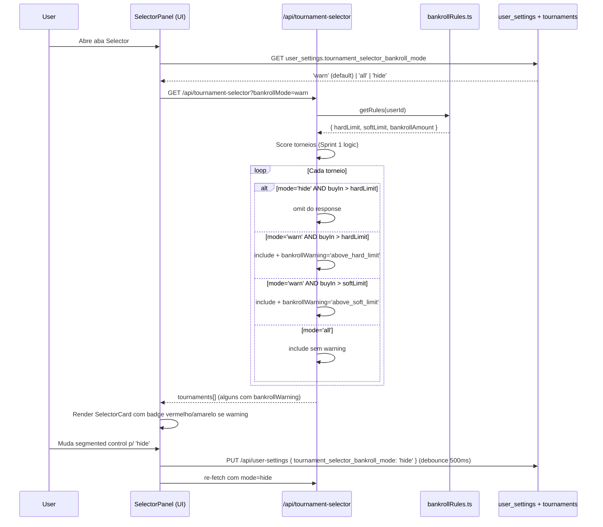
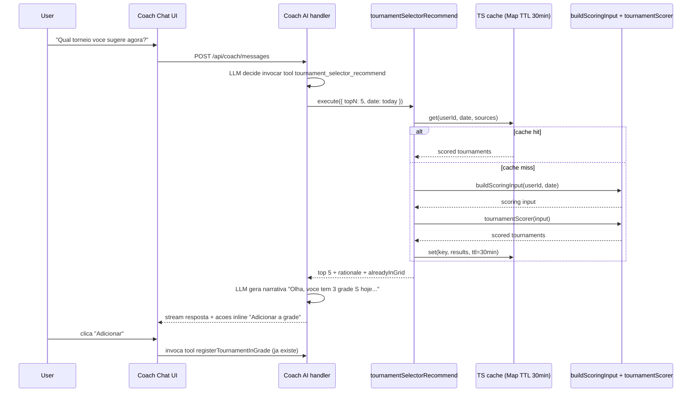

# Sprint Tournament Selector 3

## Status
Proposta — pendente alinhamento founder (decisoes Q-A..Q-J em aberto antes de seguir pra System-Architect)

---

## Resumo

Sprint 3 do Tournament Selector eh **profundidade, nao largura**. Apos Sprint 1 (scoring + endpoint + widget) e Sprint 2 (Bankroll Management + 2 ressalvas fechadas em UX-2), restam: divida tecnica recorrente (ressalva 5 supremaSync rate-limit + ressalva 2 drift de grade na library), uma feature de cross-feature de alto valor (filtro tristate bankroll), uma surface de calibragem coletiva (dashboard admin score-vs-ROI) e uma integracao "quase free" com infra ja shipped (tool no Coach AI consumindo `buildScoringInput.ts`). Mais um polish UX que expoe dados ja presentes no payload (comparativo ROI proprio vs similares).

O "ah-ha" do Sprint nao eh uma killer feature — eh **fechar o loop de feedback**: telemetria que prova ou refuta a tese do scoring linear (ADR-015 deixou esse gatilho previsto), conectar o Bankroll Sprint 2 ao filtro do TS conforme pivot 2026-04-24, e plugar o TS como tool no Coach (Plano IA 7/7 shipped + `buildScoringInput.ts` ja extraido pro AI-0A). Nada disso e disruptivo isolado, mas a soma converte TS de "feature legal" em "infraestrutura central de decisao do produto".

Sprint 3 NAO inclui: Auto-Build Grade (killer feature, propor sprint dedicado), pesos por usuario (#2 ICE), calibragem coletiva automatica (#4), notificacao push, multi-data semana, sharing/streaks/goals (cancelados pelo pivot).

---

## Contexto

**Estado pos Sprints 1+2 (verificado 2026-05-21):**

- Sprint 1 shipped 2026-04-23 — `server/scoring/tournamentScorer.ts` + `scoringConstants.ts` + endpoint `/api/tournament-selector` + widget na aba Selector do GradePlanner + `tournament_selector_logs` (RF-07).
- Sprint 2 Bankroll shipped 2026-04-24 — `bankrollRules.ts` com hard/soft limit + `walletService.ts` multi-wallet + integracao parcial com filtro `bankrollFilter` boolean no TS.
- UX-2 polish absorveu ressalvas 3 (lookbackTournaments) e 4 (DEFAULT_LOOKBACK_DAYS=90 unificado).
- AI-0A shipped 2026-05-20 — `buildScoringInput.ts` ja existe e expoe a interface canonica para o `tournamentScoringService` consumido pelo Coach.
- Plano IA 7/7 shipped (AI-0A..AI-2B + cleanup AI-3) — Coach AI nao tem mais sprint planejado. Tool nova nao colide com escopo concorrente.
- **`server/coachTools/handlers/`** ja tem 30+ tools, incluindo `getTournamentSuggestions.ts` e `explainTournamentScore.ts` que precedem o RF-02 — confirmar overlap durante system-architect.

**Sinais hipoteticos** (sem queries SQL rodadas ate este pm-spec — strategist deixou Q1-Q5 prontas e Q-D abaixo decide se rodam pre-arquitetura):

- View→add conversion provavel <30% (alta paralisia de escolha em cards densos).
- D7 retention de quem abriu Selector — desconhecido, primeira medida sai com RF-05.
- Distribuicao S/A/B/C/D nas adds — desconhecida, vital pra RF-05 ser util.

**Bugs vivos confirmados via grep (nao perder no escopo):**

1. `server/routes/suprema.ts:8` — `keyGenerator: (req: any) => req.user?.id || req.ip` (deveria ser `req.user?.userPlatformId`). Sprint 1 corrigiu so no `tournament-selector.ts:409`. RF-01 cobre.
2. `client/src/components/tournament-selector/LibraryCardScoreBadge.tsx:13-19` — `inferGradeFromScore` local fallback ainda existe. Server nem sempre manda `selectorGrade` no payload da library. RF-06 cobre.

**Pivot vigente (`memory/roadmap_pivot_2026-04-24.md`):** dobrar em TS+Bankroll, nao espalhar superficie. Sprint 3 e a primeira oportunidade de validar o pivot na pratica — se RF-04 (cross-feature) e RF-05 (calibragem) virarem destrava reais, o pivot foi acertado.

---

## Objetivos do Sprint

1. **Fechar 2 dividas tecnicas residuais** (ressalva 5 + ressalva 2) que custam <2h juntas mas tem ICE 40/18.
2. **Conectar Bankroll Sprint 2 ao TS** via filtro tristate, materializando o §4d do pivot (cross-feature explicito).
3. **Plugar TS no Coach AI** como tool consumindo `buildScoringInput.ts` ja shipped — diferencial silencioso (Coach passa a sugerir torneios com edge proprio).
4. **Criar surface de calibragem** (dashboard admin score-vs-ROI realizado) que destrava decisao futura sobre pesos por user (#2) ou calibragem coletiva (#4) — sem essa surface, ADR-015 §165 nao consegue acionar gatilho de migracao ML.
5. **Polish UX de alto sinal** — comparativo "seu ROI vs torneios similares" no card (expoe dados ja no payload, refina rationale com numero proprio).

**Outcomes mensuraveis (pos-Sprint 3, janela 30d):**

- 100% das chamadas `/api/suprema/tournaments` rate-limited por `userPlatformId` (zero por IP em logs).
- 100% dos LibraryCard com `selectorScore` recebem `selectorGrade` + `rationale` do server (zero fallback local).
- Coach AI invoca `tournament_selector_recommend` em >5% das mensagens de usuarios Pro+ que perguntam sobre selecao de torneios (medivel via `coach_tool_invocations`).
- Dashboard admin populado com >=200 eventos `add_to_grid` cohort 30d e expoe correlacao `grade → ROI realizado`.
- view→add conversion sobe >=5 p.p. vs baseline pre-Sprint 3 (atribuicao parcial ao RF-03 comparativo).
- Adds com `bankrollOk=false` caem com filtro tristate em `mode=warn` ou `hide` (>=70% dos users em `warn` por default — hipotese a validar).

---

## Usuarios

- **Grindeiro power (cohort 1, 5k+ historico, multi-rede):** Mais sensivel a precisao. Vai abrir dashboard admin via convite especifico (acesso restrito) ou via /stats se a UI for liberada. Vai usar RF-04 tristate em `hide` (disciplina bankroll alta). Vai NOTAR o RF-03 comparativo e validar com proprio gut.
- **Mid grinder (cohort 2, 500-1500 historico):** Beneficiario principal do RF-04 default `warn` (ve oportunidades mas com sinal vermelho) e do RF-03 comparativo (mais legivel que 7 sinais densos). RF-02 Coach tool ajuda mais aqui — "Coach, qual torneio agora?" e onboarding natural.
- **Cold start (<200 historico):** Sem benefit direto Sprint 3. Coach AI continua cobrindo via fallback heuristico. RF-04 tristate em `all` por default pra cold start (sem prior pra filtrar com confianca).
- **Coach AI (consumidor secundario, RF-02):** Persona "Tournament Selection" + chat geral. Tool retorna top N + rationale + acao inline "Adicionar a grade". Reusa `buildScoringInput.ts` (AI-0A) — zero duplicacao.
- **Admin/Founder (consumidor de RF-05):** Acesso restrito (`requirePermission('admin')`). Le tabela `score-vs-ROI realizado` agregada, identifica buckets com discrepancia (ex: grade S sub-performando), aciona ajuste de pesos manual na proxima sprint (ainda nao automatico).

---

## RFs

### RF-01: Fix `supremaSyncRateLimit.keyGenerator` por `userPlatformId`

**Descricao:** Corrigir `server/routes/suprema.ts:8` para usar `req.user?.userPlatformId || req.ip` em vez de `req.user?.id || req.ip`. Aplicar mesmo patch a qualquer outro rate-limiter do dominio suprema (`suprema*.ts`). Adicionar teste regressivo.

**User story:** Como jogador na mesma rede corporativa que outro jogador Grindfy, quero que meu rate-limit de sync Suprema NAO seja compartilhado com ele, pra eu nao receber 429 injusto.

**Acceptance criteria:**
- [ ] `keyGenerator` em todos os limiters do dominio suprema retorna `req.user?.userPlatformId || req.ip`.
- [ ] Teste unitario novo `tests/unit/suprema/rateLimit.test.ts` cobre: (a) dois `userPlatformId` diferentes consomem buckets diferentes; (b) sem auth cai pro `req.ip`; (c) mesmo `userPlatformId` em IPs diferentes compartilha bucket.
- [ ] `grep -rn "req.user?.id || req.ip" server/routes/suprema*.ts` retorna 0 ocorrencias pos-fix.
- [ ] Smoke manual: 30 chamadas como user A nao limitam user B (mesmo IP).
- [ ] Nenhuma regressao em testes existentes do dominio (`tests/**/*suprema*.test.ts`).

**Estimate:** S (~1h). 1 linha + 1 arquivo de teste + grep guard.

**Dependencias:** Nenhuma. Pode rodar isolado.

**Riscos:** Quase zero. Risco unico: outro endpoint do mesmo dominio (nao suprema) seguindo o mesmo anti-pattern. Mitigar com grep guard global no review.

---

### RF-02: Coach AI tool `tournament_selector_recommend`

**Descricao:** Nova tool no Coach AI (registrada em `server/coachTools/index.ts`) que invoca internamente `buildScoringInput.ts` + `tournamentScorer.ts` e devolve top N torneios scored com rationale. Permite acao inline "Adicionar a grade" via tool ja existente `registerTournamentInGrade`. Tier-gated via `isToolEligibleTier` (mesma logica AI-2A).

**User story:** Como usuario Pro+ no chat do Coach AI, quero perguntar "qual torneio voce me sugere agora?" e receber uma lista top 5 scored com 1 clique pra adicionar na grade, sem precisar abrir o GradePlanner.

**Acceptance criteria:**
- [ ] Tool `tournament_selector_recommend` registrada em `server/coachTools/index.ts` + handler em `server/coachTools/handlers/tournamentSelectorRecommend.ts`.
- [ ] Input schema Zod: `{ date?: string, topN?: number (default 5, max 10), source?: 'suprema'|'library'|'both' (default 'both'), minScore?: number, bankrollMode?: 'all'|'hide'|'warn' (default herda RF-04 default do user) }`.
- [ ] Output: array de `{ tournamentExternalId, source, name, site, buyIn, startTime, score, grade, confidence, rationale, alreadyInGrid }`.
- [ ] Reusa `buildScoringInput.ts` (zero duplicacao do scoring core).
- [ ] Tier gate: `isToolEligibleTier(user)` — trial passa, free nega com mensagem "Recurso Pro+".
- [ ] Cache compartilhado com `/api/tournament-selector` (mesma chave `(userId, date, sources)` TTL 30min) — tool nao recomputa se widget acabou de calcular.
- [ ] Telemetria: cada invocacao loga em `coach_tool_invocations` (ja existente) E em `tournament_selector_logs` com `eventType='view'` + `metadata.invokedBy='coach_tool'`.
- [ ] Conflito potencial: ja existem `getTournamentSuggestions.ts` e `explainTournamentScore.ts` nos handlers. **System-architect deve confirmar** se sao consolidaveis ou ortogonais — ver Q-G.
- [ ] System prompt do Coach (`coachSystemBuilder.ts`) ganha 1 linha mencionando a tool nova.
- [ ] Teste de integracao em `tests/integration/coach/toolTournamentSelectorRecommend.test.ts`: invocacao, cache hit, tier gate, format do output.

**Estimate:** M (1.5-2d). Handler + schema + cache wire + telemetria + tests + system prompt update.

**Dependencias:**
- `buildScoringInput.ts` ✅ (shipped AI-0A).
- `tournamentScorer.ts` ✅ (Sprint 1).
- `isToolEligibleTier` ✅ (AI-2A, em `server/coach/toolEligibility.ts`).
- `coach_tool_invocations` ✅ (AI-1B).
- RF-04 (precisa ler `bankrollMode` default do user) — soft dependency, fallback `all` se RF-04 atrasar.

**Riscos:**
- **Overlap com `getTournamentSuggestions.ts`** — pode ser que ja faca o mesmo. Resolver no system-architect (Q-G).
- **Cache miss** se widget e tool usarem keys diferentes — testar explicitamente.
- **Custo de tokens no Coach** — output de 5 torneios + rationale pode adicionar ~800 tokens. Aceitavel; rate-limit do Coach ja vigente.

---

### RF-03: Comparativo "seu ROI vs torneios similares" no `SelectorCard`

**Descricao:** Refactor de `SelectorCard.tsx` (e do payload do endpoint se necessario) para expor uma linha extra com numero proprio: `"Seu ROI em PKO Suprema $11-$25: +18% (87 amostras) — vs media nesse buy-in: +3%"`. Os dados ja estao no `signals` do payload (`signals.categoryRoi.value` + `signals.buyInRoi.value`). UI so expoe melhor.

**User story:** Como grindeiro que duvida do score "87/S" no card, quero ver na mesma linha o ROI bruto proprio do bucket dominante + sample, pra eu validar se o score faz sentido sem abrir o modal de detalhes.

**Acceptance criteria:**
- [ ] `SelectorCard.tsx` ganha 1-2 linhas (abaixo da rationale, antes do mini-grafico) com formato: `Seu ROI em [bucket dominante]: +X% ([sample] torneios) · Sample size: [confidence label]`.
- [ ] "Bucket dominante" = sinal com maior `(shrunkScore * weight)` que NAO seja `siteRoi` (mesmo criterio da rationale, ja em `tournamentScorer.ts`).
- [ ] Quando sample < 15 no bucket dominante, linha vira: `Sample baixo — Score baseado em poucos dados` (sem ROI exibido).
- [ ] Cold start: linha omitida (rationale fixo ja explica).
- [ ] Acessibilidade: `aria-label` na linha completa formato "Seu ROI em PKO Suprema $11-$25: mais 18 porcento, 87 amostras".
- [ ] Mobile: linha quebra em 2 (bucket + ROI numero acima, sample/confidence abaixo).
- [ ] Teste RTL em `tests/unit/tournament-selector/SelectorCard.test.tsx` cobrindo: (a) bucket dominante exibido, (b) sample baixo oculta numero, (c) cold start omite linha, (d) aria-label correto.
- [ ] Payload do endpoint **nao muda** (dados ja estao em `signals`).
- [ ] Snapshot visual atualizado.

**Estimate:** S (~6h). Component refactor + tests + design tweak.

**Dependencias:** Nenhuma — dados ja no payload Sprint 1.

**Riscos:**
- Card pode ficar mais alto verticalmente — confirmar com design (Q-H).
- "media nesse buy-in" (parte comparativa do strategist) NAO entra Sprint 3 porque exige novo dado agregado (media de mercado por bucket) que nao temos. So expomos o **proprio** ROI. Strategist ICE 20 sobreestimava — escopo reduzido honestamente.

---

### RF-04: Filtro Bankroll tristate (`all` / `hide` / `warn`)

**Descricao:** Substituir o filtro `bankrollFilter` booleano atual por tristate `bankrollMode: 'all' | 'hide' | 'warn'`. `'all'` = comportamento Sprint 1 sem filtro. `'hide'` = comportamento `bankrollFilter=true` atual (oculta). `'warn'` = NOVO: mostra mas marca card com badge vermelho + linha "Acima do bankroll: buy-in $X vs hardLimit $Y". Persistencia em `user_settings.tournament_selector_bankroll_mode` com default `'warn'`.

**User story:** Como jogador que quer ver oportunidades fora do bankroll mas com sinal claro (e nao perder pra "nao deveria estar jogando isso de qualquer jeito"), quero um modo intermediario entre "esconde tudo" e "mostra como se fosse normal".

**Acceptance criteria:**
- [ ] Endpoint `/api/tournament-selector` aceita query param `bankrollMode` (string enum `all`/`hide`/`warn`). Default herda de `user_settings.tournament_selector_bankroll_mode`; se coluna nao existe ainda, fallback `'warn'`.
- [ ] Param antigo `bankrollFilter` (boolean) continua funcionando como alias: `true` → `mode='hide'`, `false` → `mode='all'`. Marcado deprecated em comentario JSDoc.
- [ ] Schema migration: nova coluna `user_settings.tournament_selector_bankroll_mode VARCHAR(8) NOT NULL DEFAULT 'warn'` com CHECK `IN ('all','hide','warn')`.
- [ ] Quando `mode='warn'`: torneio acima do `bankrollRules.hardLimit` recebe campo `bankrollWarning: { reason: 'above_hard_limit', limit: X, buyIn: Y }` no payload. NAO e omitido. Score nao muda.
- [ ] Quando `mode='warn'` e acima do `softLimit` (mas dentro do hard): `bankrollWarning: { reason: 'above_soft_limit', ... }` com tom mais leve (amarelo na UI).
- [ ] Quando `mode='hide'`: torneio acima do hard e omitido (igual hoje).
- [ ] Quando `mode='all'`: nenhum filtro nem warning aplicado (full transparencia).
- [ ] Frontend (`SelectorFilters.tsx`): chip vira segmented control 3-way `Todos | Avisar | Esconder fora` com tooltip explicando cada modo.
- [ ] Frontend (`SelectorCard.tsx`): quando `bankrollWarning` presente, renderiza badge vermelho/amarelo no header + linha de texto "Acima do bankroll: buy-in $X (limite $Y)".
- [ ] Mudanca de modo na UI persiste em `user_settings` via debounce 500ms PUT `/api/user-settings`.
- [ ] Telemetria: `tournament_selector_logs.metadata.bankrollMode` ganha o valor selecionado em cada `view`.
- [ ] Testes:
  - `tests/unit/tournament-selector/bankrollMode.test.ts` (server) — 3 modos × com/sem bankroll cadastrado.
  - `tests/unit/tournament-selector/BankrollModeSegmentedControl.test.tsx` (client) — switch entre 3 modos.
- [ ] Bankroll nao cadastrado: param ignorado (igual hoje), payload nunca tem `bankrollWarning`.

**Estimate:** M (2-3d). Migration + endpoint changes + UI 3-state + persistencia + testes + integracao `bankrollRules.ts`.

**Dependencias:**
- `bankrollRules.ts` ✅ (Sprint 2 Bankroll, ja com hard/soft).
- `user_settings` table — adicionar coluna (migration nova).
- Coordenacao com RF-02: Coach tool herda mesmo default.

**Riscos:**
- **Migration backwards compat** — se Sprint 2 Bankroll fez ALTER em `user_settings` recente, conflito de migration. Coordenar numero (proxima migration livre).
- **Sprint 2 Bankroll-3 (ja shipped) tem outras regras (kelly, BB%)?** Verificar `bankrollRules.ts` atual; se ja tem mais que hard/soft, RF-04 precisa contemplar. Q-I.
- UX: tooltip dos 3 modos precisa ser clara — testar com copy de design.

---

### RF-05: Dashboard admin "Score vs ROI realizado"

**Descricao:** Endpoint admin + pagina admin (`/admin/tournament-selector-calibration`) que mostra agregacoes da query Q5 do strategist (correlacao `grade → ROI realizado` cohort 30/90 dias). Tabela com colunas `grade | adds | adds_realized | realized_roi_pct | expected_roi_pct (heuristica) | discrepancy`. Acesso restrito (`requirePermission('admin')`).

**User story:** Como founder/admin, quero ver semanalmente se o scoring esta calibrado (grade S realmente tem ROI maior que C?) pra eu decidir ajustar pesos do `scoringConstants.ts` no proximo sprint.

**Acceptance criteria:**
- [ ] Endpoint `GET /api/admin/tournament-selector/calibration?lookbackDays=90` — JWT + `requirePermission('admin')`.
- [ ] Response:
  ```
  {
    "lookbackDays": 90,
    "totalAdds": 247,
    "realizedAdds": 189,
    "buckets": [
      { "grade": "S", "adds": 87, "realized": 71, "realizedRoiPct": 14.2, "expectedRoiPct": 18.5, "discrepancyPct": -4.3 },
      { "grade": "A", "adds": 95, "realized": 78, "realizedRoiPct": 8.1, "expectedRoiPct": 12.0, "discrepancyPct": -3.9 },
      ...
    ],
    "generatedAt": "2026-05-21T12:00:00Z",
    "warnings": ["sample_low_in_grade_D"]
  }
  ```
- [ ] Query SQL: variante de Q5 do strategist (linha 132-159 de `strategist_2026-05-21.md`) — JOIN entre `tournament_selector_logs` (event_type='add_to_grid') e `tournaments` (`grind_session_id IS NULL` — §6.1 da CLAUDE.md) com matching por `external_id` OU `(date_played BETWEEN add_time AND add_time+14d AND ABS hours < 48)`.
- [ ] `expectedRoiPct` derivado heuristicamente do mid-point de cada grade band (S=92.5 → 21.25%, A=77 → 13.5%, B=62 → 6%, C=47 → -1.5%, D=20 → -15%). Apenas referencia visual, nao usado em logica.
- [ ] `discrepancyPct = realizedRoiPct - expectedRoiPct`. Quando `|discrepancy| > 5pp` E `adds >= 20`, warning `bucket_off_calibration_<grade>`.
- [ ] Pagina admin `/admin/tournament-selector-calibration`:
  - Tabela das 5 grades com cor por `discrepancy` (verde proximo zero, vermelho se >5pp off).
  - Toggle lookback 30/90/180 dias.
  - Linha de rodape: "Sample agregado: X adds em N usuarios".
  - Nota de cautela: "Dados sao **realized** (post-hoc); causalidade vs preditividade nao confirmada — use como sinal, nao como verdade absoluta."
- [ ] Cache server-side 1h (query e pesada).
- [ ] Acesso restrito: rota frontend gated por `useUserRole().isAdmin`.
- [ ] Telemetria minima: cada acesso loga em `admin_access_log` (se ja existe; senao skip).
- [ ] Testes:
  - `tests/unit/admin/tournamentSelectorCalibration.test.ts` (server) — 3 cenarios: zero adds, S sub-performando C, calibracao boa.
  - `tests/unit/admin/CalibrationDashboard.test.tsx` (client) — render + admin gate.
- [ ] **Skip render se volume insuficiente** — se `totalAdds < 50` no lookback escolhido, response retorna `{ insufficientData: true, currentVolume: N, requiredVolume: 50 }` e UI mostra "Aguardando volume telemetria — atual N de 50 minimo".

**Estimate:** M (2-3d). Endpoint + query SQL + UI tabela + admin gate + testes + cache.

**Dependencias:**
- `tournament_selector_logs` ✅ (Sprint 1 RF-07).
- `tournaments` ✅.
- `requirePermission('admin')` ✅ (auth.ts).

**Riscos:**
- **Volume insuficiente para dashboard ser legivel** — Q-B aborda essa decisao (rodar Q1-Q5 antes ou implementar mesmo "vazio" com mensagem).
- **Matching tournament externalId pode ter ruidos** — torneios da library com `external_id=null` so entram via heuristica de datetime. Documentar limitacao na nota de cautela.
- **Causalidade vs preditividade** — dashboard mostra ROI realizado de torneios que JOGADOR ADICIONOU. Vies de selecao (jogador so adiciona o que ja confia). NAO eh prova causal. Nota explicita na UI.

---

### RF-06: `selectorGrade` + `rationale` no payload `/api/tournament-library`

**Descricao:** Refactor do payload da `tournament-library.ts` para SEMPRE incluir `selectorGrade` e `rationale` quando `selectorScore` esta presente. Remover `inferGradeFromScore` local em `LibraryCardScoreBadge.tsx`. Fecha drift risk (ressalva 2 original).

**User story:** Como dev que muda o threshold de grade no `scoringConstants.ts` (ex: S de >=85 pra >=88), quero que TODOS os badges de grade do produto refletam a mudanca imediatamente, sem precisar lembrar de editar duplicacao client-side.

**Acceptance criteria:**
- [ ] Endpoint `/api/tournament-library` (GET) — para CADA torneio que ja tem `selectorScore`, payload ganha `selectorGrade: 'S'|'A'|'B'|'C'|'D'` E `selectorRationale: string`.
- [ ] Computado server-side reusando `tournamentScorer.ts` (deriveGradeFromScore + cached rationale ja calculado quando o score foi computado, ou recomputado on-the-fly via mesma `computeTournamentScore`).
- [ ] Cache: `selectorScore` ja vive em cache (Sprint 1); estender pra incluir `grade`+`rationale` na mesma entry. Sem nova invalidacao.
- [ ] `client/src/components/tournament-selector/LibraryCardScoreBadge.tsx` — remover `inferGradeFromScore` local (linhas 13-19); usar `selectorGrade` do prop direto. Throw em dev mode se `selectorScore != null && selectorGrade == null` (defensivo durante migracao).
- [ ] Em prod, fallback silencioso (return null em vez de crash) com `console.warn`.
- [ ] Mesma garantia em `LibraryCard.tsx` consumer — passar `selectorGrade` no prop.
- [ ] Teste de regressao em `tests/unit/tournament-library/payloadGrade.test.ts`: payload sempre tem `selectorGrade` quando score presente.
- [ ] Teste RTL `tests/unit/tournament-selector/LibraryCardScoreBadge.test.tsx` ja existente atualizado para esperar grade do prop, nao inferida.

**Estimate:** S (~4h). Backend route adjust + 1 import lib + frontend cleanup + 2 testes.

**Dependencias:**
- `tournamentScorer.ts` ✅.
- Pode rodar paralelo com RF-04 (sem conflito de arquivo significativo).

**Riscos:**
- **Migracao silenciosa** — algum consumer client pode estar reusando `inferGradeFromScore` em outro lugar. `grep` global obrigatorio na implementacao.
- **Performance** — recomputar rationale por torneio na lista da library pode adicionar latencia. Mitigar: persistir `rationale_cached` no proprio registro da library quando `score` for computado (extension barata da migration Sprint 1) OU manter em cache de memoria. **System-architect decide qual approach** (Q-J).

---

## Decisoes Pendentes

**Q-A: Sprint 3 = 100% TS deep ou 50/50 com Bankroll polish?**
Roadmap_pivot diz "aprofundar TS + Bankroll". RF-04 ja e cross-feature. Se 50/50, adicionar 1-2 RFs de Bankroll polish (ex: wallet staleness UI, FX cascade Wave 3 — verificar pendencias UX-QW). Se 100% TS, RF-04 cobre o cross-feature exigido e Bankroll fica pra Sprint 4 dedicado. **Recomendacao pm-spec:** 100% TS com RF-04 como ponte; Bankroll proximo sprint dedicado.

**Q-B: RF-05 dashboard admin AGORA ou esperar volume telemetria?**
Strategist deixou Q1-Q5 SQL prontas (linhas 76-159 de `strategist_2026-05-21.md`). Rodar antes do system-architect:
- Se `total_adds_30d < 50` → adiar RF-05 pra Sprint 4 (sem volume, dashboard vazio nao destrava decisao).
- Se >=50 → implementar com `insufficientData` flag mas UI ja pronta.
- Se >=200 → implementar full + chamar founder pra analise pos-merge.
**Recomendacao pm-spec:** rodar queries SQL em <30min antes do system-architect; decisao binaria.

**Q-C: RF-07 Auto-Build Grade junto Sprint 3 ou sprint dedicado?**
Strategist ICE 11.7 (killer feature). Esforco 6 sozinho. Sprint 3 ja tem 6 RFs (~10-12 dias-pessoa cumulados). Adicionar Auto-Build estoura pra 3 semanas. **Recomendacao pm-spec:** Sprint dedicado proprio (Sprint TS-4 ou TS-Auto-Build) com pipeline TDD completo + tratamento de conflitos horario + bulk endpoint + UI preview. NAO juntar.

**Q-D: Rodar Q1-Q5 SQL pre-system-architect?**
Atrelado a Q-B. Founder decide se autoriza rodar queries no DB local antes do pipeline avancar. Custo: 5-15min de DBA-light. Beneficio: RF-05 vira binaria Y/N e RF-03 ganha calibragem de copy ("media ROI dos seus PKO $22: ..." pode citar numero real). **Recomendacao pm-spec:** rodar.

**Q-E: Persistencia do `bankrollMode` (RF-04) — coluna em `user_settings` ou em `user_coach_preferences`?**
`user_coach_preferences` ja virou home de toggles novos (AI-1C/2B). `user_settings` e antigo + mais legado. RF-04 e do TS, nao do Coach — semanticamente `user_settings`. Mas se `user_coach_preferences` virar "preferencias globais" no futuro, talvez consolidar agora. **Recomendacao pm-spec:** `user_settings.tournament_selector_bankroll_mode` (escopo claro, sem expansao prematura).

**Q-F: Filtro janela horaria (strategist alternativa RF-08, ICE 17.5) entra no Sprint 3?**
Quase free (effort 2). Cobre gap competitivo com Sharkscope/Lobbyze/PT4. Mas Sprint 3 ja tem 6 RFs. Se RF-05 cair em Q-B, RF-08 pode tomar a vaga. **Recomendacao pm-spec:** **alternativa** — se Q-B adiar RF-05, promover RF-08 a RF-05 (renumera). Se Q-B mantiver RF-05, RF-08 vira Sprint 4.

**Q-G: Tool `tournament_selector_recommend` (RF-02) vs `getTournamentSuggestions.ts` ja existente — consolidar?**
`server/coachTools/handlers/getTournamentSuggestions.ts` existe. Investigar overlap durante system-architect:
- Se ja faz exatamente o que RF-02 propoe → RF-02 vira "estender com cache compartilhado + bankrollMode + telemetria adicional".
- Se faz outra coisa (ex: sugestao gen erica sem `buildScoringInput`) → RF-02 e tool nova; renomear `getTournamentSuggestions` se ambiguo OU deprecar.
- `explainTournamentScore.ts` parece ortogonal (explica score de um torneio especifico, nao recomenda). Confirmar.
**Recomendacao pm-spec:** task #1 do system-architect — ler 3 handlers + decidir consolidacao antes de escrever ADR.

**Q-H: RF-03 layout do card — quanto crescer verticalmente?**
Adicionar linha "Seu ROI..." aumenta altura. Em grids com 20+ cards, scroll fica mais longo. Alternativas:
- (a) Linha sempre visivel (aceita altura +20px).
- (b) Linha so em hover/expand (mantem density, esconde valor).
- (c) Linha so para cards grade S/A (top picks merecem destaque); B/C/D mantem density.
**Recomendacao pm-spec:** (a) sempre visivel — a tese e justamente "validar score com numero proprio"; esconder mata o valor.

**Q-I: RF-04 — Bankroll Sprint 2 + 3 adicionou regras alem hard/soft (kelly, BB%)?**
Verificar `bankrollRules.ts` atual antes do system-architect. Se ja tem >2 regras, payload `bankrollWarning.reason` precisa expandir enum. Se so hard/soft, schema enum atual ja cobre. **Recomendacao pm-spec:** system-architect le `bankrollRules.ts` na primeira hora de trabalho.

**Q-J: RF-06 — recomputar rationale on-the-fly vs persistir `selector_rationale_cached`?**
Trade-off:
- On-the-fly: simples, sem migration. Custo ~2ms × N torneios na library (pode ser 50-200). Lib endpoint ja eh GET cacheado, aceita custo.
- Persistir: 1 coluna nova em `tournament_library` JSONB cached. Performance constante, mas invalidacao explicita quando pesos mudam.
**Recomendacao pm-spec:** on-the-fly + reusar mesmo cache de memoria do Sprint 1 (chave por torneio+player). Se p95 estourar 50ms, partir pra persistir como follow-up.

**Q-K: Migration numero para RF-04 + (potencial) RF-05 admin log?**
Ultima migration confirmada: 0071 (AI-2B). Proxima livre: **0072**. Se RF-05 precisar de `admin_access_log` (so se nao existir), pode ser 0073. **Recomendacao pm-spec:** system-architect aloca numeracao firme.

**Q-L: Telemetria adicional — `tournament_selector_logs.metadata.invokedBy` enum?**
Hoje aceita qualquer string. RF-02 (Coach tool) introduz valores novos (`'coach_tool'`). Definir agora o enum: `['widget', 'coach_tool', 'admin_dashboard']`. Documentar em comentario do schema, sem CHECK (mantem flexivel). **Recomendacao pm-spec:** documentar; nao forcar CHECK.

**Q-M: Coach AI tool RF-02 — qual modelo usar?**
Tool nao chama LLM diretamente (so retorna dados estruturados). LLM gera a frase de apresentacao. Confirmacao: tool e "data retrieval", nao "narrative generation". Sem custo LLM extra alem do turno normal do chat. **Recomendacao pm-spec:** confirmar no system-architect e na ADR.

**Q-N: Acessibilidade do dashboard admin RF-05 — escopo?**
Pagina admin nao tem mesmo SLA de acessibilidade que pagina publica (uso restrito). Pular WCAG AA detalhado, manter so basico (semantic table, sr-only label). **Recomendacao pm-spec:** basico apenas; documentar exception.

---

## Riscos & Mitigacao

| Risco | Severidade | Mitigacao | Owner |
|---|---|---|---|
| RF-05 sem volume telemetria | Media | Q-B + Q-D — rodar SQL pre-pipeline; UI handle `insufficientData` | pm-spec |
| RF-04 conflito de migration com Sprint Bankroll | Media | Confirmar proximo numero (0072) com migrations/ folder | system-architect |
| RF-02 overlap com tools existentes do Coach | Alta | Q-G — system-architect le 3 handlers antes de ADR | system-architect |
| RF-06 recompute rationale custa latencia | Baixa | Q-J — fallback persistir se p95 > 50ms | implementer |
| RF-04 UX confusa (3 modos sem copy clara) | Media | Design review do copy + teste com founder antes de merge | reviewer |
| Cache key drift entre widget e tool RF-02 | Media | Mesma key shape; teste explicito de cache hit cross-surface | test-writer |
| RF-01 anti-pattern em outros routes nao-suprema | Baixa | Grep guard global no pre-commit do reviewer | reviewer |
| Sprint estoura 2.5 semanas se Q-C (Auto-Build) for in | Alta | Recomendacao firme: Auto-Build = Sprint dedicado | founder decision |
| LGPD em RF-05 dashboard admin (agregacao cross-user) | Baixa | Agregacao por grade nao expoe userId; dashboard nunca lista users | system-architect |
| Mudanca em scoringConstants.ts quebra calibracao RF-05 | Baixa | Documentar em ADR-015 update: alteracao de pesos exige re-baseline do dashboard | system-architect |

---

## Metricas de Sucesso

> Baselines a coletar no inicio do Sprint via queries Q1-Q5 (Q-D). Targets sao hipoteticos — ajustar pos-baseline.

| Metrica | Baseline (hipotetico) | Target Sprint 3 | Como medir |
|---|---|---|---|
| Activation D7 widget Selector | 35-50% | +5pp | cohort users que abrem /grade-planner aba Selector dentro de 7d do signup |
| view→add conversion (mesma sessao) | 20-30% | +5pp (atribuicao RF-03+RF-04) | `tournament_selector_logs` Q1 do strategist |
| % adds com grade S/A | 60-75% | manter/subir | Q2 strategist |
| % adds com bankrollOk=false | 10-20% | cair com `mode=warn`/`hide` default | Q3 strategist; comparativo pre/pos Sprint 3 |
| Tool Coach `tournament_selector_recommend` adoption | 0 (n existe) | >=5% das mensagens elegiveis Pro+ | `coach_tool_invocations` |
| Dashboard admin acesso semanal | 0 | >=1x/semana founder | `admin_access_log` |
| `inferGradeFromScore` invocacoes client (RF-06) | N (atual) | 0 pos-merge | grep + telemetria warning |
| supremaSyncRateLimit hits por IP (RF-01) | nao medido | 0 pos-fix | log analise rate-limiter |
| p95 latencia `/api/tournament-selector` | <500ms (Sprint 1 target) | manter <500ms | NewRelic ou load test |
| p95 latencia `/api/tournament-library` (RF-06 risco) | nao medido | <300ms | mesmo |
| NPS feature (subjetivo, 1-5) | N/A | medir via micro-survey in-app pos-Sprint 3 (opt-in) | feature_survey nova ou postponed |

**Auditoria pos-Sprint 3 (30 dias):**
- Rodar Q5 strategist novamente; comparar `realizedRoiPct` por grade vs baseline. Se discrepancia caiu (RF-04 + RF-03 estao melhorando selecao), atribui valor ao Sprint. Se igual ou piorou, gatilho de revisao ADR-015.

---

## Dependencias

### Tabelas existentes a tocar
- `user_settings` — adicionar coluna `tournament_selector_bankroll_mode` (RF-04, migration 0072).
- `tournament_selector_logs` — campo `metadata.bankrollMode` + `metadata.invokedBy` (sem ALTER, JSONB ja flex).
- `tournament_library` — payload extension (RF-06), sem ALTER se Q-J optar por on-the-fly.
- `tournaments` — read-only (RF-05 query JOIN).

### Endpoints/services existentes a tocar
- `server/routes/suprema.ts` (RF-01).
- `server/routes/tournament-selector.ts` (RF-04 — adicionar `bankrollMode` param + `bankrollWarning` no response).
- `server/routes/tournament-library.ts` (RF-06 — payload extension).
- `server/scoring/buildScoringInput.ts` (RF-02 — consumido pela tool nova; sem alteracao).
- `server/scoring/tournamentScorer.ts` (RF-06 — usado pra derivar grade no payload library).
- `server/scoring/bankrollRules.ts` (RF-04 — leitura hard/soft).
- `server/coachTools/index.ts` (RF-02 — registro da tool).
- `client/src/components/tournament-selector/SelectorCard.tsx` (RF-03 + RF-04 badge).
- `client/src/components/tournament-selector/SelectorFilters.tsx` (RF-04 segmented control).
- `client/src/components/tournament-selector/LibraryCardScoreBadge.tsx` (RF-06 cleanup).

### Novos
- `server/coachTools/handlers/tournamentSelectorRecommend.ts` (RF-02 — pendente decisao Q-G).
- `server/routes/admin.ts` (ou novo `admin/tournament-selector.ts`) — endpoint `/api/admin/tournament-selector/calibration` (RF-05).
- `client/src/pages/admin/CalibrationDashboard.tsx` (RF-05).
- Migration 0072 (RF-04).

---

## Fora de Escopo

Explicito para evitar scope creep:

- **Auto-Build Grade** — Sprint dedicado (recomendacao Q-C).
- **Pesos por usuario** (#2 strategist) — esperar dados RF-05 + decisao founder pos-baseline.
- **Calibragem coletiva automatica** (#4 strategist) — mesmo motivo.
- **Notificacao push/email "grade S hoje"** — Sprint 4 ou pos-Sprint 4 (depende AI-2B email pipeline ja shipped + opt-in).
- **Multi-data semana inteira** — Sprint 4+.
- **Bulk add (checkbox multi)** — Sprint 4+; pode vir junto Auto-Build.
- **Sharing/streaks/goals** — cancelados pelo pivot 2026-04-24.
- **Multi-rede aggregator (Lobbyze-like)** — descartado (ICE 5.7).
- **G1-G10 do strategist Modo 5** (Reverse Selector, Leak detector schedule, Field dinamico, Heatmap, Preference elicitation, Buzz community, Variancia, Time-of-day fix via registrationTime, Mudou regra alerta, Modo agressivo) — todas pos-Sprint 3; algumas viraram Sprint 4+ candidates.
- **39 `it.todo()` em SelectorCard.test.ts** (ressalva original 1) — continuous improvement do test-writer.
- **e2e supertest rate-limiter** (ressalva original 6) — backlog.
- **Mudar algoritmo de scoring para LR/XGBoost** — gatilho ADR-015 nao acionado (volume telemetria + variancia + concorrente).

---

## Diagrama de Fluxo

Fluxo do RF-04 Bankroll Filter Tristate (decisao arquitetural nova):



Fluxo do RF-02 Coach Tool (cache compartilhado):



---

## Anexos

- Strategist memory: `C:\Users\ricar\.claude\projects\B--grindfy\memory\strategist_2026-05-21.md`
- Spec original Sprint 1: `B:\grindfy\Docs\specs\tournament-selector.md`
- ADR-015 scoring linear vs ML: `B:\grindfy\Docs\architecture\decisions\015-scoring-linear-vs-ml.md`
- Pivot estrategico: `C:\Users\ricar\.claude\projects\B--grindfy\memory\roadmap_pivot_2026-04-24.md`
- Plano IA (referencia AI-0A/2A/2B shipped): `C:\Users\ricar\.claude\projects\B--grindfy\memory\ai_agents_improvement_plan_2026-05-11.md`
- Lessons learned (consultar antes implementer): `B:\grindfy\Docs\architecture\lessons-learned.md` — especialmente lessons #3 (mocks idealizados), #6 (conversao moeda), #14 (`require()` em testes ESM), #34 (storage injetado em handlers).
- CLAUDE.md §6.1 (regra fonte historico vs session_tournaments) — RF-05 query depende disso.

---

## Verificacao Final pm-spec

- [x] Cada RF tem criterios de aceitacao verificaveis (5-10 por RF).
- [x] Cenarios cobrem happy path, erros, edge cases (cold start, sem bankroll, sem volume telemetria).
- [x] "Fora de Escopo" explicito (12 items).
- [x] Decisoes pendentes numeradas Q-A..Q-N (14 questoes).
- [x] Endpoints listados (4 novos/alterados) + permissoes.
- [x] Modelos afetados documentados.
- [x] Dependencias internas/externas mapeadas.
- [x] Riscos com mitigacao + owner.
- [x] Metricas mensuraveis com baseline + target.
- [x] Diagrama Mermaid para 2 decisoes arquiteturais novas (tristate + tool cache).
- [x] PT-BR conforme convencao UI.
- [x] Zero codigo, zero migration SQL escrita (so estrutura), zero ADR novo escrito.

**Proximo passo recomendado:**
- Founder responde Q-A..Q-D (criticas para escopo final).
- Idealmente rodar Q1-Q5 SQL do strategist em <30min (Q-D).
- Depois invocar `system-architect` com `Docs/specs/sprint-tournament-selector-3.md` pra criar ADRs (provavel: 175 RF-04 tristate semantics, 176 RF-05 calibration query + admin gate, 177 RF-02 tool consolidation Q-G decision) e diagramas Mermaid C4 + sequence detalhados.
