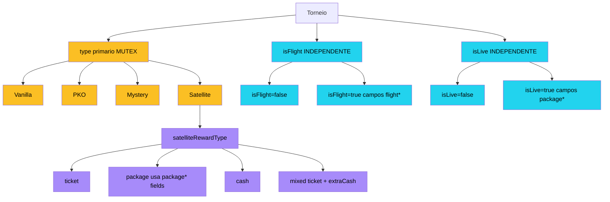

# Spec: Extensao de Tipos de Torneio (Ortogonal: Type + Modificadores) + Conserto do "Adicionar Torneio"

## Status
Proposta — REVISADA em 2026-04-25 com decisoes do founder. Aguardando aprovacao final antes de invocar `system-architect`.

## Changelog

### 2026-04-25 — Revisao 2 (founder feedback)
Mudancas estruturais importantes incorporadas das respostas do founder:

1. **MODELO ORTOGONAL (D14 nova):** `type` deixa de ser unico e passa a coexistir com modificadores booleanos:
   - `type` (mutex, enum 4 valores): `Vanilla` | `PKO` | `Mystery` | `Satellite`. **Flight saiu do enum primario.**
   - `isFlight` (boolean): modificador "multi-dia agrupado", combinavel com qualquer `type`.
   - `isLive` (boolean): modificador "presencial/fisico", combinavel com qualquer `type`.
   - 16 combinacoes validas (4 types × 2 isFlight × 2 isLive).
2. **PACOTES (RF-11 nova):** Suporte a torneios live com componentes opcionais de pacote (buy-in separado, hospedagem, voo, alimentacao, outros). Aplicavel em duas situacoes:
   - (A) Satelite que paga pacote como premio (`rewardType='package'`).
   - (B) Torneio live em si com custos de pacote (afeta ROI).
3. **D2 ATUALIZADA — Estrategia de migracao em 3 fases para `category`:**
   - Sprint 1: storage espelha `category = type` automatico.
   - Sprint 2: migrar queries de `category` → `type`.
   - Sprint 3 (e Sprint 5 final): drop coluna `category` (ADR-028).
4. **D7 ATUALIZADA — `flightDay`:** regex validado + autocomplete UI (nao enum estrito).
   - Regex: `^(Final|Day\s?\d+|\d+[A-Z]?)$`.
   - Helper `parseFlightDay()` para ordenacao/agrupamento.
5. **RF-04 expandida:** `satelliteRewardType` ganha 4 opcoes: `'ticket' | 'package' | 'cash' | 'mixed'`.
   - Quando `package`, reusa os campos `package*` para descrever o pacote ganho.
6. **RF-05 atualizada:** Flight como modificador (nao tipo primario). Combina com Vanilla/PKO/Mystery/Satellite. Re-entry entre Day 1A e Day 1B suportado (cada Flight e uma row separada).
7. **RF-06 (Form) virou wizard 4 steps:** tipo primario → modificadores → campos condicionais → campos comuns.
8. **RF-08 (Analytics) expandido:** novos graficos `by-modifier` (Live vs Online, Flight vs Single-day) + matriz cruzada futura.
9. **RF-09 (CSV parser) expandido:** funcoes separadas `detectIsFlight()` e `detectIsLive()` com heuristicas documentadas.
10. **Phasing reorganizado em 5 sprints (~19 dias mantido):** Sprint 1 inclui SSoT + bug fix + schema delta vazio; Sprint 2 inclui Satelite + modificadores + wizard; etc.
11. **ADR-028 nova:** "Deprecation gradual da coluna `category`".
12. **Testes (RF-10) ganharam matriz 16 combinacoes** tipo×isFlight×isLive para schema + helpers.

### 2026-04-24 — Revisao 1 (versao inicial)
Spec criada com 13 decisoes (D1-D13), 5 tipos no enum (incluindo Flight como tipo primario), satelite + flight isolados.

## Resumo
Esta spec ataca tres problemas correlatos no Grindfy:

1. **Bug P0:** "Erro ao adicionar torneio" no `GradePlanner` (toast generico, root cause oculta) — refatoracao nao-commitada do `EditDialog` provavelmente desalinhou o payload com `insertPlannedTournamentSchema`.
2. **Divida estrutural P0:** Tipos de torneio (`PKO`, `Vanilla`, `Mystery`) hardcoded em 6+ pontos da codebase (frontend + backend + parser CSV) sem fonte unica de verdade. Backend nao valida enum (qualquer string passa). Frontend ora manda `type`, ora `category`, criando inconsistencia que esconde torneios dos analytics que agrupam por `category`.
3. **Feature P0:** Adicionar tipo **Satelite** (premio em ticket/pacote/cash/hibrido + ROI agregado com torneio destino) e dois modificadores ortogonais — **isFlight** (multi-dia com Day 1A/1B → Day 2 → Final, prize compartilhado) e **isLive** (torneio presencial com custos de pacote). Hoje esses formatos sao registrados como "Vanilla" perdendo informacao economica essencial.

Como bonus de robustez (P1), inclui:
- UI nova para registrar torneios passados manualmente (hoje so via CSV).
- Erros Zod estruturados no backend + erros inline no formulario (RHF `setError`).
- Migracao idempotente de torneios existentes para novos tipos (auto-deteccao por nome).
- Coach Tournament Selector + Dashboard adaptados aos novos tipos e modificadores.
- Wizard de form em 4 steps para reduzir ruido visual.

## Contexto

### Bug-fix (P0-1): "Erro ao adicionar torneio"

**Sintoma:** Ao clicar em "Adicionar torneio" na grade, o toast generico aparece e o dialog NAO fecha. O usuario nao sabe qual campo falhou.

**Path do erro:**
- `client/src/pages/GradePlanner.tsx:175-181` (`addPlannedMutation.onError`) lanca toast com `error.message` ou fallback "Não foi possível adicionar".
- O servidor (`server/routes/grade-planner.ts:140-146`) retorna `400 { message, error: error.message }` em caso de exception. A mensagem real do Zod (lista de issues) nao chega estruturada — apenas a string serializada do `ZodError`.
- O `lib/queryClient.ts` (apiRequest) propaga apenas `error.message` que vira o `description` do toast. ZodError tem stringificacao verbosa que polui o toast.

**Root cause provavel:**
- Refatoracao nao-commitada deletou `client/src/components/grade-planner/PlanningDialog.tsx` (-698 linhas) e expandiu `EditDialog.tsx` (909 linhas, +1116 vs anterior). Agora o mesmo dialog atende edit + novo torneio.
- O `handleFormSubmit` em `GradePlanner.tsx:477-521` monta o payload com fallbacks estaticos: `type: String(data.type || "Vanilla")`, `speed: String(data.speed || "Normal")`. Se o form submit acontece com `data.type` vazio, o fallback "Vanilla" passa — mas SE o fluxo de `data.dayOfWeek` (novo dialog precisa do `showDayPicker`) nao popular `dayOfWeek` no payload, o backend rejeita (`dayOfWeek` e `notNull`).
- Refinements de `addOnReaFields` (6 regras em `shared/schema.ts:908-933`) sao aplicados ao `insertPlannedTournamentSchema` via `insertPlannedTournamentSchema.refine(...)` (linha 987). Apenas `maxReentries >= 0` no `planned_tournaments` — nao aplica os 6 refinements completos. Logo, a regra que provavelmente esta falhando NAO sao os refinements de add-on/re-entry. Suspeita primaria: **shape mismatch** entre o que `EditDialog` produz e o que `insertPlannedTournamentSchema` exige.
- Campos a auditar no payload: `dayOfWeek` (number, notNull), `name` (text, notNull), `buyIn` (decimal as string, notNull), `time` (varchar, notNull), `site/type/speed/profile` (varchar, notNull). Campos nullable `gameType: 'NLH'|'PLO'` — se o form deixa `gameType: ''` (string vazia), o `z.enum(...).nullable().optional()` REJEITA (string vazia nao bate enum).

**Plano de mitigacao:**
- Backend retorna `error.issues` (array Zod) em vez de `error.message`. Em producao, sanitizar para nao vazar paths internos.
- Frontend recebe `issues[]`, mapeia paths → campos do form, chama `form.setError(field, message)` para destacar inline. Toast vira generico "Verifique os campos destacados".
- Auditar payload do `EditDialog` vs `insertPlannedTournamentSchema` e alinhar (lista exaustiva no RF-01).

### Divida estrutural (P0-2): Tipos hardcoded em 6+ lugares

| Arquivo | Linhas | Tipo de hardcode |
|---|---|---|
| `client/src/components/grade-planner/types.ts:50` | array `["PKO", "Vanilla", "Mystery"]` | Form options |
| `client/src/components/grind-session-live/AddTournamentDialog.tsx:131-134` | 3 `<option>` literais | Form options |
| `client/src/components/grind-session-live/EditTournamentDialog.tsx:112-115` | 3 `<SelectItem>` literais | Form options |
| `client/src/components/grind-session-live/helpers.ts:64-71` | `getCategoryColor(category)` switch | Cores |
| `shared/schema.ts:1557` (tournamentTemplate) | `z.enum(['PKO','Vanilla','Mystery'])` | Validacao parcial |
| `server/csvParser.ts:1725-1746` | `detectCategory()` heuristica | Auto-deteccao |
| `shared/schema.ts:187-225` (tournaments) | `category: varchar` (sem enum) | Sem validacao backend |
| `shared/schema.ts:263-300` (planned_tournaments) | `type: varchar` (sem enum) | Sem validacao backend |

**Consequencia:** Frontend (`grind-session-live/GrindSessionLive.tsx:1006`) cria `session_tournaments` com `type` mas nao com `category`. Drizzle preenche `category: "Vanilla"` (default). Resultado: torneio do tipo certo via UI vira "Vanilla" no banco, somindo dos analytics que agrupam `by-category` (rota `/api/analytics/by-category`).

### Feature P0-3: Modelo ortogonal (Type + Modificadores)

Founder confirmou semantica em 2026-04-25:

**Modelagem ortogonal:**
- **Type primario (mutex):** define a estrutura de prize. Valores: `Vanilla` | `PKO` | `Mystery` | `Satellite`.
- **Modificadores (booleanos independentes):**
  - `isFlight`: torneio multi-dia agrupado (Day 1A/1B → Day 2 → Final).
  - `isLive`: torneio presencial/fisico (com custos de pacote opcionais).
- **Combinacoes validas:** todas as 16 (4 types × 2 isFlight × 2 isLive).
- **Exemplos reais:**
  - PKO + Flight (PKO multi-dia online tipo PartyPoker WPT)
  - Vanilla + Live (live tradicional, ex: cash de casino)
  - Satellite + Live (satelite ao vivo para WSOP)
  - PKO + Flight + Live (Main Event do BSOP — PKO multi-dia presencial)
  - Mystery + Online (default Mystery atual)

**Satelite (semantica detalhada):**
- Premio normal: ticket (nao cash). Tickets podem ser usados em torneio destino especifico.
- Premio em pacote: para satelites que pagam viagem completa (ex: WSOP package = ticket buy-in + hospedagem + voo).
- Premio cash: alguns satelites pagam cash em vez de ticket (raros mas existem).
- Premio hibrido: top N ganha ticket + cash extra (bounty/jackpot).
- ROI integrado: somar buy-ins de satelites + buy-ins do destino (quando entrou via ticket) - prize do destino + valor do ticket/pacote ganho.

**isFlight (semantica detalhada):**
- Estrutura multi-dia: Day 1A, Day 1B, Day 1C, ..., Day 2, Day Final.
- Prize pool compartilhado entre Flights. Jogador pode entrar em multiplos Day 1.
- Day 1 termina em "advanced" (passou pro Day 2) ou "eliminated" (saiu sem premio).
- Prize so e registrado quando alcanca Day final.
- Re-entry entre Day 1A e Day 1B do mesmo evento e POSSIVEL e suportado: cada Flight e uma row separada em `tournaments`, com `flightParentId` apontando ao primeiro Day 1.
- ROI agregado por evento = soma de buy-ins de todos os Flights jogados - prize do Day final.

**isLive (semantica detalhada):**
- Torneio presencial: WSOP, BSOP, PCA, EPT, etc.
- Custos opcionais de pacote (todos opcionais — usuario registra apenas o que quiser):
  - `packageBuyIn` (componente "buy-in" do pacote)
  - `packageAccommodation` (hospedagem)
  - `packageTravel` (voo/transporte)
  - `packageMeals` (alimentacao)
  - `packageOther` (outras despesas)
  - `packageNotes` (observacoes livres)
- ROI live = `(prize - (buyIn + sum(package*))) / (buyIn + sum(package*))`.

## Usuarios

- **Player (todos os planos):** Criar/editar/deletar torneios planejados na grade; registrar torneios passados manualmente; enxergar ROI agregado por satelite/flight/live no analytics.
- **Coach AI (Premium):** Le os novos campos via `playerBundle` para sugerir satelites como porta de entrada para torneios maiores; nao recomenda Flights Day 1 isolados (recomenda o evento); considera custos live no scoring.
- **Admin:** Sem mudancas operacionais.

## Decisoes Tomadas (sem ambiguidade)

| # | Decisao | Justificativa |
|---|---|---|
| D1 | **4 types primarios + 2 modificadores:** type ∈ `{Vanilla, PKO, Mystery, Satellite}`; modifiers `isFlight: boolean`, `isLive: boolean`. | Cobertura completa do que o founder citou. Ortogonalidade permite combinacoes reais (PKO + Flight + Live). Espaco para extensao futura (ex: HU, SnG) sem migration. |
| D2 | **Estrategia em 3 fases para `type` vs `category`:** | Refatoracao gradual evita risco de quebrar queries em producao. |
|    | • Sprint 1: SSoT do enum. Storage layer GARANTE espelhamento automatico (`category = type` em todos os writes). Validacao Zod so em `type`. Frontend sempre le `type`. | Bug raiz (frontend nao envia `category`) e eliminado no storage. |
|    | • Sprint 2: Migrar todas as queries de `category` (analytics, library, etc.) para usar `type`. | Reduz divida tecnica. |
|    | • Sprint 5: Drop coluna `category` (ADR-028). | Schema final limpo. |
| D3 | **Cores fixas SSoT:** Vanilla=zinc, PKO=violet, Mystery=fuchsia, Satellite=amber. Modifiers tem badge separada: Flight=cyan, Live=emerald. | Acessibilidade: 6 cores distinguiveis em dark/light theme. Type e modifier podem ser exibidos juntos (ex: badge "PKO" + badge "Flight" + badge "Live"). |
| D4 | **Schema migration via `db:push`**: campos novos todos `nullable` + default `null/false`. Indexes em `(userId, type)`, `(userId, satelliteTargetTemplateId)`, `(userId, flightParentId)`, `(userId, isLive)`, `(userId, isFlight)`. | Backwards-compat. `db:push` resolve sem migration manual. Indexes para queries `getSatelliteROI`, `getFlightAggregateROI`, e analytics filtradas por modifier. |
| D5 | **Validacao Zod cross-field:** se `type === 'Satellite'` E `position <= satellitePayoutThreshold`, `satelliteTicketValue` (ou `package*` se rewardType='package') e obrigatorio. Threshold default = todos com `prize > 0`. | Permite registrar satelite "perdi" sem ticket. |
| D6 | **Flight Day 1 sem prize:** `prize: 0`, `position: null`, `flightAdvanced: true|false` obrigatorio. Day Final: `position` e `prize` obrigatorios. | Usuario nao precisa "inventar" position no Day 1. |
| D7 | **`flightDay`** e string validada por regex + autocomplete UI (NAO enum estrito). | Eventos reais variam: PokerStars usa "Day 1A", BSOP usa "Flight A", WSOP as vezes so "Day 1". Enum rigido obriga atualizar mapping. Regex + autocomplete da flexibilidade + validacao. |
|    | • Regex: `^(Final\|Day\s?\d+\|\d+[A-Z]?)$` (aceita "1A", "1B", "1C", "Day 1", "Day 2", "2", "3", "Final"). | |
|    | • UI: input com autocomplete soft sugerindo `1A, 1B, 1C, 1D, 1E, 2, 3, Final`. | |
|    | • Helper: `parseFlightDay(input): { day: number, group: string \| null, isFinal: boolean }` para ordenacao e agrupamento. | |
| D8 | **Erros Zod estruturados:** dev retorna `{ field, code, message }[]`; producao retorna a mesma estrutura mas filtra `ctx.code === 'invalid_type'` para nao vazar internals. | Equilibra DX (dev sabe o que falhou) e seguranca (prod nao vaza). |
| D9 | **UI form em wizard 4 steps:** | Reduz ruido visual + valida apenas o pertinente. |
|    | • Step 1: tipo primario (4 botoes radio: Vanilla, PKO, Mystery, Satellite). | |
|    | • Step 2: modificadores (2 checkboxes: "É Flight (multi-dia)", "É Live (presencial)"). | |
|    | • Step 3 condicional: campos especificos por type/modifier. | |
|    | • Step 4: campos comuns (site, time, buyIn, name, add-on/re-entry). | |
| D10 | **Adicionar ao historico:** modal global acessivel via botao em `pages/TournamentLibraryNew.tsx`. Reusa o wizard `EditDialog` em modo `historical=true` (campos `datePlayed`, `position`, `prize` obrigatorios). | Evita criar modal novo. Reuso dos campos condicionais. |
| D11 | **Coach Tournament Selector:** trata Satelite com scoring derivado do TARGET. Trata Flight com `multiShotEquityBonus = +5 se field >= massivo`. Trata Live com `liveCostPenalty` proporcional aos custos de pacote registrados. | Evita reescrever scoring; aplica mods sobre as 7 dimensions existentes. |
| D12 | **Migracao de dados:** script idempotente em `server/scripts/migrate-tournament-types.ts` que roda `detectTournamentTypeV2(name, flags)` + `detectIsFlight(name)` + `detectIsLive(name, site)` em todos torneios com `category IN (NULL, 'Vanilla')` e atualiza apenas se a heuristica retornar valores novos com confianca alta. Dry-run obrigatorio. | Nao toca em torneios ja categorizados como PKO/Mystery (heuristica antiga ja acertou). |
| D13 | **Campo `addedManually`** em `tournaments` para distinguir registros manuais vs CSV. | Heuristica `templateId IS NULL` nao basta (CSV tambem pode criar sem template). |
| D14 | **ORTOGONALIDADE:** type primario e modificadores sao independentes no schema, no Zod, na UI e nos analytics. | Cobre cenarios reais (PKO + Flight + Live). Permite filtrar/agregar por dimensao independente. |

## Requisitos Funcionais

### RF-01: Bug-fix do "Adicionar Torneio" + Erros Zod estruturados (P0)

**Descricao:** Conserto do fluxo "Adicionar torneio" no GradePlanner para mostrar exatamente qual campo falhou e por que.

**Regras de negocio:**
1. Backend (`server/routes/grade-planner.ts`) deve capturar `ZodError` separadamente e retornar `400 { error: 'validation', issues: ZodIssue[] }`. Outros erros retornam `500 { error: 'internal' }`. (Em producao, `issues[].path` e mantido, mas `code` interno e generalizado.)
2. Helper `lib/zodErrorMapper.ts` (novo) converte `ZodIssue[]` em `{ field: string, message: string }[]` mapeando `path` para o nome do campo do form RHF.
3. Frontend (`addPlannedMutation.onError`) verifica se `error.cause?.issues` existe; se sim, chama `form.setError(field, { type: 'validation', message })` para cada issue. Toast generico: "Verifique os campos destacados em vermelho".
4. Audit do payload do `EditDialog` vs `insertPlannedTournamentSchema`:
   - `dayOfWeek` (notNull, integer): garantir que o form sempre envia como `Number`.
   - `gameType` (`'NLH'|'PLO'|null`): se form retorna `''`, normalizar para `null` antes do mutate.
   - `lateRegMinutes`, `startingStack`, `maxPlayers`, `blindLevelMinutes`, `alertMinutesBefore`, `maxReentries`: se string vazia ou `'0'` invalido, normalizar para `null`.
   - `addOnCost`: se `allowsAddOn=false` e `addOnCost` truthy, zerar `addOnCost` para `null` antes do mutate.
   - `name`: backend exige notNull, frontend ja autogera (linha 493). Manter.
5. Reproducao do bug deve estar documentada em comentario no PR + screenshot do toast antes/depois.

**Given/When/Then:**
- **Given** form valido com payload minimo, **When** submeter, **Then** 200 OK + dialog fecha.
- **Given** `time = "99:99"`, **When** submeter, **Then** 400 + campo `time` destacado em vermelho com mensagem "Horario invalido (use HH:MM)".
- **Given** `gameType = ""` (string vazia), **When** submeter, **Then** 200 OK (backend trata como null).
- **Given** `dayOfWeek = undefined`, **When** submeter, **Then** 400 com path `['dayOfWeek']` e erro exibido no SelectField correspondente.

**Criterios de aceitacao:**
- [ ] Submit de torneio com payload minimo valido (`site, time, type, speed, buyIn`) resulta em 200 OK e dialog fecha.
- [ ] Submit com `time` invalido resulta em 400 + campo destacado.
- [ ] Submit com `gameType: ""` NAO retorna 400.
- [ ] Submit com `addOnTaken: true, allowsAddOn: false` (forcado via curl/devtools no endpoint `POST /api/tournaments`) retorna 400 com path `['addOnTaken']`.
- [ ] Submit com `dayOfWeek: undefined` retorna 400 com path `['dayOfWeek']`.

### RF-02: Fonte unica de verdade — `shared/tournamentTypes.ts` (P0)

**Descricao:** Criar o modulo SSoT que exporta enum, schemas, helpers, cores, labels, modificadores.

**Regras de negocio:**
1. Arquivo novo `shared/tournamentTypes.ts` exporta:
   ```ts
   // Type primario (mutex)
   export const TOURNAMENT_PRIMARY_TYPES = ['Vanilla', 'PKO', 'Mystery', 'Satellite'] as const;
   export type TournamentPrimaryType = typeof TOURNAMENT_PRIMARY_TYPES[number];
   export const TournamentPrimaryTypeSchema = z.enum(TOURNAMENT_PRIMARY_TYPES);

   // Modificadores ortogonais (booleanos)
   export const TOURNAMENT_MODIFIERS = ['isFlight', 'isLive'] as const;
   export type TournamentModifier = typeof TOURNAMENT_MODIFIERS[number];

   // Reward type para Satelite
   export const SATELLITE_REWARD_TYPES = ['ticket', 'package', 'cash', 'mixed'] as const;
   export type SatelliteRewardType = typeof SATELLITE_REWARD_TYPES[number];

   // Labels PT-BR
   export const TYPE_LABELS_PT_BR: Record<TournamentPrimaryType, string> = {
     Vanilla: 'Vanilla',
     PKO: 'PKO (Bounty)',
     Mystery: 'Mystery Bounty',
     Satellite: 'Satélite',
   };
   export const MODIFIER_LABELS_PT_BR: Record<TournamentModifier, string> = {
     isFlight: 'Flight (Multi-dia)',
     isLive: 'Live (Presencial)',
   };

   // Cores
   export const TYPE_COLORS: Record<TournamentPrimaryType, { bg: string; text: string; ring: string; hex: string }> = {
     Vanilla:  { bg: 'bg-zinc-500/10',   text: 'text-zinc-300',   ring: 'ring-zinc-500/30',   hex: '#71717a' },
     PKO:      { bg: 'bg-violet-500/10', text: 'text-violet-300', ring: 'ring-violet-500/30', hex: '#a78bfa' },
     Mystery:  { bg: 'bg-fuchsia-500/10',text: 'text-fuchsia-300',ring: 'ring-fuchsia-500/30',hex: '#e879f9' },
     Satellite:{ bg: 'bg-amber-500/10',  text: 'text-amber-300',  ring: 'ring-amber-500/30',  hex: '#fbbf24' },
   };
   export const MODIFIER_COLORS: Record<TournamentModifier, { bg: string; text: string; hex: string }> = {
     isFlight: { bg: 'bg-cyan-500/10',    text: 'text-cyan-300',    hex: '#22d3ee' },
     isLive:   { bg: 'bg-emerald-500/10', text: 'text-emerald-300', hex: '#34d399' },
   };

   // Helpers
   export function getTypeColor(t: TournamentPrimaryType) { return TYPE_COLORS[t]; }
   export function getTypeLabel(t: TournamentPrimaryType) { return TYPE_LABELS_PT_BR[t]; }
   export function getModifierColor(m: TournamentModifier) { return MODIFIER_COLORS[m]; }
   export function getModifierLabel(m: TournamentModifier) { return MODIFIER_LABELS_PT_BR[m]; }
   export function isSatellite(t: TournamentPrimaryType): boolean { return t === 'Satellite'; }
   export function isPKO(t: TournamentPrimaryType): boolean { return t === 'PKO'; }

   // Retorna array de badges para um torneio (type + modificadores ativos)
   export function getTypeBadges(tournament: { type: TournamentPrimaryType; isFlight?: boolean | null; isLive?: boolean | null }): Array<{ label: string; color: { bg: string; text: string } }> {
     const badges = [{ label: getTypeLabel(tournament.type), color: getTypeColor(tournament.type) }];
     if (tournament.isFlight) badges.push({ label: getModifierLabel('isFlight'), color: getModifierColor('isFlight') });
     if (tournament.isLive)   badges.push({ label: getModifierLabel('isLive'),   color: getModifierColor('isLive') });
     return badges;
   }

   // Helper para parsear flightDay
   export function parseFlightDay(input: string | null): { day: number; group: string | null; isFinal: boolean } | null {
     if (!input) return null;
     if (input === 'Final') return { day: Infinity, group: null, isFinal: true };
     const dayMatch = input.match(/^Day\s?(\d+)$/i);
     if (dayMatch) return { day: Number(dayMatch[1]), group: null, isFinal: false };
     const groupMatch = input.match(/^(\d+)([A-Z])$/);
     if (groupMatch) return { day: Number(groupMatch[1]), group: groupMatch[2], isFinal: false };
     const numMatch = input.match(/^(\d+)$/);
     if (numMatch) return { day: Number(numMatch[1]), group: null, isFinal: false };
     return null;
   }

   // Sugestoes para autocomplete UI
   export const FLIGHT_DAY_SUGGESTIONS = ['1A', '1B', '1C', '1D', '1E', '2', '3', 'Final'] as const;
   ```
2. Refactor obrigatorio dos 8 pontos hardcoded listados em "Contexto / Divida estrutural":
   - Substituir `["PKO", "Vanilla", "Mystery"]` por `import { TOURNAMENT_PRIMARY_TYPES } from '@shared/tournamentTypes'`.
   - Substituir `getCategoryColor` por `getTypeColor` (ou wrapper de compatibilidade).
   - `shared/schema.ts:1557` reusa `TournamentPrimaryTypeSchema`.
   - `shared/schema.ts` em `insertTournamentSchemaBase` e `insertPlannedTournamentSchemaBase`: usar `TournamentPrimaryTypeSchema`.
   - `server/csvParser.ts:1725-1746` reescrito como `detectTournamentTypeV2` com 4 valores + funcoes auxiliares `detectIsFlight`, `detectIsLive` (RF-09).
3. Backend continua aceitando strings legadas (Vanilla/PKO/Mystery) sem mudanca; nova string (Satellite) so passa apos refactor estar deployed. Strings invalidas (`Flight` como type) sao rejeitadas com mensagem clara.
4. **Regra de coerencia type↔category (storage layer):** quando o backend faz INSERT em `tournaments` ou `planned_tournaments`, sempre copia `type → category` automaticamente (mesmo que cliente nao envie `category`). Se cliente enviar ambos e divergirem, log warning e respeitar `type`. Documentar esta heuristica em ADR-027 + ADR-028 (deprecation roadmap).

**Given/When/Then:**
- **Given** import `TOURNAMENT_PRIMARY_TYPES`, **When** acessar em client e server, **Then** funciona em ambos.
- **Given** payload com `type: 'InvalidType'`, **When** POST `/api/tournaments`, **Then** 400 com erro do enum Zod.
- **Given** payload com `type: 'Satellite'` sem `category`, **When** POST, **Then** registro criado com `category: 'Satellite'` automatico.
- **Given** payload com `type: 'Flight'` (string nao mais no enum), **When** POST, **Then** 400 com mensagem "Flight nao e tipo primario; use isFlight=true".

**Criterios de aceitacao:**
- [ ] `import { TOURNAMENT_PRIMARY_TYPES } from '@shared/tournamentTypes'` funciona em codigo client e server.
- [ ] `grep -r "'PKO'\|'Vanilla'\|'Mystery'" client/ server/ shared/ --include="*.ts" --include="*.tsx"` retorna 0 ocorrencias fora de `shared/tournamentTypes.ts`, testes, e migrations historicas.
- [ ] `grep -r "getCategoryColor" client/` retorna 0 ocorrencias (substituido por `getTypeColor`).
- [ ] Tests unit cobrem helpers `getTypeColor`, `getTypeLabel`, `getModifierColor`, `getModifierLabel`, `isSatellite`, `getTypeBadges`, `parseFlightDay` para todos os valores.
- [ ] POST `/api/tournaments` com `type: 'InvalidType'` retorna 400.
- [ ] POST `/api/tournaments` com `type: 'Satellite'` (sem `category`) cria registro com `category: 'Satellite'` automatico no storage.
- [ ] POST `/api/tournaments` com `type: 'Flight'` retorna 400 (Flight nao e mais tipo primario).

### RF-03: Schema delta — campos novos para Satelite, Flight, Live (P0)

**Descricao:** Adicionar campos novos em `tournaments` e `planned_tournaments`. Todos nullable + default null/false. Migration via `db:push`.

**Regras de negocio:**
1. Tabela `tournaments` ganha (~18 colunas novas):
   ```sql
   -- Modificadores ortogonais
   is_flight                    boolean DEFAULT false NOT NULL,
   is_live                      boolean DEFAULT false NOT NULL,

   -- Satelite
   satellite_reward_type        varchar NULL,           -- 'ticket' | 'package' | 'cash' | 'mixed'
   satellite_ticket_value       decimal NULL,            -- USD (quando reward='ticket' ou 'mixed')
   satellite_target_template_id varchar NULL,            -- FK soft → tournament_templates.id
   satellite_target_name        varchar NULL,            -- fallback texto livre
   satellite_extra_cash         decimal NULL,            -- premio cash extra (caso hibrido)
   entered_via_satellite        boolean DEFAULT false NOT NULL,  -- flag para ROI agregado

   -- Flight
   flight_day                   varchar NULL,            -- "1A", "1B", "Final", "Day 2", etc
   flight_parent_id             varchar NULL,            -- FK soft → tournaments.id (Day 1 ancora)
   flight_advanced              boolean NULL,            -- true=passou pro Day 2, false=eliminado

   -- Live (pacote — todos opcionais)
   package_buy_in               decimal NULL,            -- USD
   package_accommodation        decimal NULL,            -- USD
   package_travel               decimal NULL,            -- USD
   package_meals                decimal NULL,            -- USD
   package_other                decimal NULL,            -- USD
   package_notes                text NULL,

   -- Bookkeeping
   added_manually               boolean DEFAULT false NOT NULL  -- distingue registro manual vs CSV (D13)
   ```
2. Tabela `planned_tournaments` ganha (subset, sem campos de resultado):
   ```sql
   is_flight                    boolean DEFAULT false NOT NULL,
   is_live                      boolean DEFAULT false NOT NULL,
   satellite_reward_type        varchar NULL,
   satellite_target_template_id varchar NULL,
   satellite_target_name        varchar NULL,
   flight_day                   varchar NULL,
   flight_parent_id             varchar NULL
   -- (sem campos package_*, sem entered_via_satellite, sem flight_advanced — sao resultados)
   ```
3. Indexes a criar:
   - `idx_tournaments_user_satellite_target` ON `(user_id, satellite_target_template_id)` partial WHERE `satellite_target_template_id IS NOT NULL`.
   - `idx_tournaments_user_flight_parent` ON `(user_id, flight_parent_id)` partial WHERE `flight_parent_id IS NOT NULL`.
   - `idx_tournaments_user_type_date` ON `(user_id, category, date_played)` (substitui escaneamentos full table em `getSatelliteROI`/`getFlightAggregateROI`).
   - `idx_tournaments_user_is_live` ON `(user_id, is_live)` partial WHERE `is_live = true`.
   - `idx_tournaments_user_is_flight` ON `(user_id, is_flight)` partial WHERE `is_flight = true`.
4. Tipos Drizzle e Zod schemas regerados (createInsertSchema). Refinements novos em RF-04, RF-05, RF-11.
5. Backwards-compat: torneios existentes ficam com `is_flight=false, is_live=false`, todos os campos satelite/package `null`. Nada quebra.
6. **`flight_parent_id` e self-FK soft** (sem constraint REFERENCES no Drizzle para evitar circular dep no migration). Validacao de integridade em storage layer + Zod refinement.
7. **`category` continua existindo no Sprint 1** (storage espelha de `type` automaticamente). Drop programado para Sprint 5 (ADR-028).

**Given/When/Then:**
- **Given** schema atualizado, **When** rodar `npm run db:push`, **Then** colunas adicionadas sem prompt destrutivo.
- **Given** torneio Vanilla existente sem campos novos, **When** SELECT, **Then** retorna `is_flight=false, is_live=false, satellite_*=null, package_*=null`.
- **Given** insert de torneio Vanilla pre-existente sem campos novos, **When** POST, **Then** continua funcionando.

**Criterios de aceitacao:**
- [ ] `npm run db:push` aplica os campos sem prompt destrutivo.
- [ ] `SELECT * FROM tournaments LIMIT 1` retorna os campos novos com defaults corretos.
- [ ] Indexes criados (validar via `\di` no psql).
- [ ] Drizzle types contem `satelliteTicketValue: string | null`, `isFlight: boolean`, `isLive: boolean`, `packageAccommodation: string | null` (decimal vira string em pg-node).
- [ ] Insert de torneio Vanilla pre-existente continua funcionando.

### RF-04: Semantica de Satelite (P0)

**Descricao:** Suportar registro de torneios `type='Satellite'` com reward type variavel (ticket/package/cash/mixed), torneio destino, e ROI agregado.

**Regras de negocio:**
1. Quando `type === 'Satellite'`:
   - `satelliteRewardType` e obrigatorio (enum: 'ticket' | 'package' | 'cash' | 'mixed').
   - **Se `satelliteRewardType === 'ticket'`:** `satelliteTicketValue` (decimal, USD) obrigatorio quando `prize > 0`.
   - **Se `satelliteRewardType === 'package'`:** ao menos UM dos campos `package*` (excluindo `packageNotes`) deve ser preenchido quando `prize > 0`. Esses campos descrevem o pacote ganho.
   - **Se `satelliteRewardType === 'cash'`:** `prize` (cash ganho) substitui ticket. `satelliteTicketValue` deve ser null.
   - **Se `satelliteRewardType === 'mixed'`:** `satelliteTicketValue` E `satelliteExtraCash` ambos > 0.
   - `satelliteTargetTemplateId` ou `satelliteTargetName` deve ser preenchido (pelo menos um). Se ambos null, validacao falha com mensagem "Indique o torneio destino do satelite".
2. Quando `type !== 'Satellite'`, todos os campos `satellite*` devem ser `null`. Refinement Zod rejeita.
3. Helper de storage `getSatelliteROI(userId, targetTemplateId, dateRange?)`:
   - **Input:** `userId` (string), `targetTemplateId` (string), `dateRange` (`{from, to}` opcional).
   - **Output:**
     ```ts
     {
       totalInvestedSatellites: number;       // sum(buy_in) de tournaments WHERE type=Satellite AND target_template_id=X
       totalWonInTickets: number;             // sum(satellite_ticket_value) WHERE prize > 0 AND reward_type IN ('ticket','mixed')
       totalWonInPackages: number;            // sum(package_buy_in + package_accommodation + package_travel + package_meals + package_other) WHERE prize > 0 AND reward_type IN ('package','mixed')
       totalExtraCash: number;                // sum(satellite_extra_cash + (prize WHERE reward_type='cash'))
       totalInvestedTarget: number;           // sum(buy_in) de tournaments WHERE template_id=X AND entered_via_satellite=true
       totalWonInTarget: number;              // sum(prize) de tournaments WHERE template_id=X AND entered_via_satellite=true
       roi: number;                           // (totalWonInTarget + totalExtraCash + totalWonInTickets + totalWonInPackages - totalInvestedSatellites - totalInvestedTarget) / (totalInvestedSatellites + totalInvestedTarget)
       sampleSize: { satellites: number; targetEntries: number };
     }
     ```
4. Quando o usuario joga o torneio destino apos ganhar ticket via satelite, marca `enteredViaSatellite: true` no registro do torneio destino. UI tem checkbox no form "Entrou via satelite" (visivel apenas se ja existe satelite registrado para esse template no historico).
5. Endpoint novo: `GET /api/satellites/roi/:targetTemplateId?from=...&to=...` retorna o resultado de `getSatelliteROI`. Auth obrigatorio.
6. UI condicional no `EditDialog` Step 3 (modo `type === 'Satellite'`):
   - Campo `satelliteRewardType` (radio: Ticket / Pacote / Cash / Hibrido).
   - **Ticket:** input `satelliteTicketValue` (number, sufixo "USD", obrigatorio quando `prize > 0`).
   - **Pacote:** secao expansivel com 5 inputs (buy-in, hospedagem, voo, alimentacao, outros) + textarea notes. Todos opcionais (mas pelo menos um obrigatorio quando `prize > 0`).
   - **Cash:** sem campos extras.
   - **Hibrido:** ticket + extra cash.
   - Campo `satelliteTargetTemplateId` (combobox/autocomplete buscando em `tournament_templates` do usuario, com opcao "Outro" → libera `satelliteTargetName` text input).
   - Card informativo: "ROI integrado deste satelite + destino sera calculado em /analytics/satellites".

**Given/When/Then:**
- **Given** payload `{type:'Satellite', rewardType:'ticket', prize:50, satelliteTicketValue:109, satelliteTargetTemplateId:'tpl_1'}`, **When** POST, **Then** 200 OK.
- **Given** payload `{type:'Satellite', rewardType:'package', prize:5000, packageBuyIn:10000, packageAccommodation:3000, satelliteTargetName:'WSOP Main Event'}`, **When** POST, **Then** 200 OK.
- **Given** payload `{type:'Satellite', rewardType:'package', prize:5000}` (sem nenhum campo package), **When** POST, **Then** 400 com mensagem "Indique pelo menos um componente do pacote ganho".
- **Given** payload `{type:'Satellite', rewardType:'ticket', prize:50, satelliteTicketValue:null}`, **When** POST, **Then** 400 com path `['satelliteTicketValue']`.
- **Given** payload `{type:'Vanilla', satelliteTicketValue:109}`, **When** POST, **Then** 400 com mensagem "Campos satellite_* so para type=Satellite".
- **Given** GET `/api/satellites/roi/:templateId`, **When** user sem satelites, **Then** retorna shape com zeros e `roi: 0`.

**Criterios de aceitacao:**
- [ ] Inserir satelite ticket-reward valido: 200 OK.
- [ ] Inserir satelite package-reward com componentes: 200 OK.
- [ ] Inserir satelite cash-reward com `prize > 0`: 200 OK (sem ticket value).
- [ ] Inserir satelite mixed-reward com ticket + extra: 200 OK.
- [ ] Inserir Vanilla com `satelliteTicketValue=109`: 400.
- [ ] Inserir satelite sem `satelliteTargetTemplateId` E sem `satelliteTargetName`: 400.
- [ ] `GET /api/satellites/roi/:templateId` retorna shape correto com sampleSize correto.
- [ ] Helper `getSatelliteROI` retorna ROI = 0 quando totais sao 0 (sem div/0).
- [ ] UI mostra/esconde secao Satelite condicionalmente. UI muda inputs conforme `rewardType` selecionado.

### RF-05: Modificador isFlight (P0)

**Descricao:** Suportar torneios multi-dia (Day 1A/1B/1C → Day 2 → Final) com prize compartilhado. **Flight e modificador, nao tipo primario.** Combinavel com qualquer `type` (mais comum: PKO+Flight, Vanilla+Flight, Satellite+Flight).

**Regras de negocio:**
1. Quando `isFlight === true`:
   - `flightDay` (string) obrigatorio. Validacao regex `^(Final|Day\s?\d+|\d+[A-Z]?)$` (aceita "1A", "1B", "Day 1", "Day 2", "2", "3", "Final").
   - Se `flightDay` matcha `\d+[A-Z]` (Day 1 multipla porta — ex: 1A, 1B):
     - `flightAdvanced` (boolean) obrigatorio.
     - `prize` deve ser 0 (Day 1 nao tem premio direto).
     - `position` deve ser null.
   - Se `flightDay === 'Final'` ou `flightDay` matcha `^\d+$` E nao e "1":
     - `position` (integer) obrigatorio.
     - `prize` (decimal) obrigatorio (pode ser 0 se eliminado no Day Final fora do dinheiro).
     - `flightAdvanced` deve ser null (irrelevante).
   - `flightParentId` (varchar) opcional. Se preenchido, deve apontar para um `tournament.id` do mesmo `userId` E mesmo `name` (ou similar — heuristica) E `isFlight === true`. Validacao em storage layer.
   - **Re-entry entre Day 1A e Day 1B do mesmo evento:** suportado. Cada Flight e uma row separada. `flightParentId` aponta ao Day 1A. Ex: paguei $100 no 1A (eliminei) + $100 no 1B (sobrevivi) = 2 rows com mesmo `flightParentId`.
2. Quando `isFlight === false`, todos campos `flight*` devem ser null. Refinement Zod rejeita.
3. Helper de storage `getFlightAggregateROI(userId, parentId)`:
   - **Input:** `userId`, `parentId` (varchar — id do Flight Day 1 escolhido como ancora).
   - **Output:**
     ```ts
     {
       parentId: string;
       eventName: string;                    // tournaments[parentId].name
       day1Entries: Array<{ id, flightDay, buyIn, advanced }>;   // todos Day 1 do evento
       finalDay: { id, flightDay, position, prize } | null;       // Day Final, se existe
       totalInvested: number;                // sum(buy_in) de todos Day 1 + Day Final
       totalWon: number;                     // prize do Day Final (0 se eliminado ou nao existe)
       roi: number;                          // (totalWon - totalInvested) / totalInvested
       advancedCount: number;                // numero de Day 1 que avancaram
     }
     ```
4. UI condicional no `EditDialog` Step 3 (quando `isFlight=true`):
   - Campo `flightDay` (input text com sugestoes via datalist: `FLIGHT_DAY_SUGGESTIONS`).
   - Campo `flightParentId` (autocomplete dos torneios Flight Day 1 do usuario nas ultimas 14 dias com mesmo nome similar).
   - Se `flightDay` e Day 1: checkbox "Avancei pro proximo dia" (binding `flightAdvanced`). Esconde `position`/`prize` no form (Step 4).
   - Se `flightDay` e Day 2+/Final: mostra `position` e `prize` no Step 4. Esconde `flightAdvanced`.
5. **Tournament Library:** quando agrupando torneios para a biblioteca, Flights do mesmo evento (mesmo `flightParentId` ou mesmo `name + datePlayed.getWeek()`) sao agregados em um card unico mostrando "X Flights → Day 2 → Final" com totalInvested + totalWon + ROI agregado.
6. Endpoint novo: `GET /api/flights/aggregate/:parentId` retorna o resultado de `getFlightAggregateROI`. Auth obrigatorio.

**Given/When/Then:**
- **Given** payload `{type:'PKO', isFlight:true, flightDay:'1A', flightAdvanced:true, prize:0}`, **When** POST, **Then** 200 OK.
- **Given** payload `{type:'PKO', isFlight:true, flightDay:'1A', flightAdvanced:null}`, **When** POST, **Then** 400 com path `['flightAdvanced']`.
- **Given** payload `{type:'Vanilla', isFlight:true, flightDay:'Final', position:5, prize:1500}`, **When** POST, **Then** 200 OK (Flight + Vanilla valido).
- **Given** payload `{type:'Vanilla', isFlight:false, flightDay:'1A'}`, **When** POST, **Then** 400 com mensagem "flightDay so quando isFlight=true".
- **Given** payload `{type:'PKO', isFlight:true, flightDay:'random'}`, **When** POST, **Then** 400 (regex falhou).
- **Given** 3 Day 1 + 1 Day Final no banco, **When** GET `/api/flights/aggregate/:parentId`, **Then** retorna agregado correto.
- **Given** parent invalido, **When** GET, **Then** 404 (nao throw).

**Criterios de aceitacao:**
- [ ] Inserir Flight Day 1A (com qualquer type) e advanced=true: 200 OK.
- [ ] Inserir Flight Day 1A sem advanced: 400.
- [ ] Inserir Flight Day Final sem position: 400.
- [ ] Inserir torneio com `isFlight:false, flightDay:'1A'`: 400.
- [ ] `getFlightAggregateROI` calcula ROI correto com 3 Day 1 + 1 Day Final.
- [ ] `getFlightAggregateROI` com parent invalido retorna `null`.
- [ ] Re-entry entre 1A e 1B funciona (2 rows com mesmo flightParentId).
- [ ] UI esconde/mostra campos condicionais conforme `flightDay`.
- [ ] Tournament Library agrupa Flights do mesmo evento.

### RF-06: Form wizard 4 steps (P0)

**Descricao:** O `EditDialog` (usado tanto para grade quanto para historico) e refatorado em wizard de 4 etapas para cobrir o modelo ortogonal sem ruido visual.

**Regras de negocio:**
1. **Step 1 — Tipo primario:** 4 botoes radio em grid 2x2. Default selecionado: Vanilla (em modo "criar"). Mudar resetta campos do step 3 do tipo anterior.
2. **Step 2 — Modificadores:** 2 checkboxes ("É Flight (multi-dia)", "É Live (presencial)"). Default unchecked. Cada um pode ser ativado independentemente.
3. **Step 3 — Campos condicionais:** renderiza apenas o que for relevante:
   - Se `type === 'Satellite'`: secao Satelite (RF-04).
   - Se `isFlight === true`: secao Flight (RF-05).
   - Se `isLive === true`: secao Live/Pacote (RF-11).
   - Multiplas secoes podem aparecer (ex: Satellite + Live = 2 secoes).
   - Se `type !== 'Satellite' && !isFlight && !isLive`: step 3 e skipado (mostra mensagem "Sem campos especiais — proximo step").
4. **Step 4 — Campos comuns:** site, time, buyIn, name (auto-gerado), gameType, speed, profile, late reg, starting stack, etc. + add-on/re-entry.
5. **Modo `historical=true`:** Step 4 inclui adicionalmente `datePlayed` (obrigatorio, max=hoje), `position` (opcional, exceto Flight Final), `prize` (opcional).
6. **Navegacao:** botoes "Voltar"/"Avancar" entre steps. Botao "Submeter" so aparece no Step 4. Submit valida tudo (nao apenas o step atual).
7. **Badges visuais ativos:** no header do dialog, exibir badges de type + modificadores ativos (usar `getTypeBadges`). Badges sao atualizadas em tempo real conforme user muda steps 1/2.
8. **Reset entre tipos:** quando user muda `type` no step 1, campos `satellite*` sao resetados. Quando user toggla `isFlight`, campos `flight*` sao resetados. Quando user toggla `isLive`, campos `package*` sao resetados.

**Given/When/Then:**
- **Given** Step 1 selecionado Vanilla, **When** clicar "Avancar", **Then** Step 2 visivel com checkboxes default unchecked.
- **Given** Step 2 com `isFlight=true`, **When** Avancar, **Then** Step 3 mostra secao Flight (sem secao Satelite/Live).
- **Given** Step 1 = Satellite + Step 2 isLive=true, **When** Avancar, **Then** Step 3 mostra secao Satellite + secao Live.
- **Given** user no Step 3 mudou tipo no Step 1 para Vanilla, **When** Voltar/Avancar, **Then** campos `satellite*` foram resetados.
- **Given** Step 4 com payload invalido, **When** Submit, **Then** mostra erros inline E NAO fecha dialog.

**Criterios de aceitacao:**
- [ ] Wizard renderiza 4 steps com navegacao Voltar/Avancar.
- [ ] Submit so disponivel no Step 4.
- [ ] Mudar tipo no Step 1 reseta campos do Step 3 anterior.
- [ ] Step 3 skipado quando type=Vanilla e ambos modificadores false.
- [ ] Badges no header refletem selecoes em tempo real.
- [ ] Validacao Zod cobre todos os steps (nao so o atual).

### RF-07: Re-deteccao automatica + UI nova "Adicionar Torneio ao Historico" (P1)

**Descricao:** Permitir registrar manualmente torneios passados (que nao vieram via CSV) usando o wizard.

**Regras de negocio:**
1. Botao "Adicionar manualmente" no header de `pages/TournamentLibraryNew.tsx`.
2. Click abre o wizard em modo `historical={true}`:
   - Mesmos 4 steps do RF-06.
   - Step 4 inclui `datePlayed` (obrigatorio, max=hoje), `position`, `prize`.
3. Submit chama `POST /api/tournaments` com `addedManually=true`.
4. Success: invalidate `/api/tournaments`, `/api/tournament-library`, `/api/dashboard/stats`. Toast "Torneio registrado".
5. UI tem aviso visual "Adicionado manualmente — nao veio de CSV" (badge cinza no card).

**Given/When/Then:**
- **Given** TournamentLibraryNew aberto, **When** clicar "Adicionar manualmente", **Then** wizard abre em modo historical.
- **Given** wizard preenchido com Vanilla + datePlayed + position + prize, **When** Submit, **Then** torneio criado com `addedManually=true`.
- **Given** torneio criado manualmente, **When** ver na library, **Then** badge "Manual" visivel.

**Criterios de aceitacao:**
- [ ] Click no botao abre wizard.
- [ ] Submit com type=Vanilla cria torneio com `addedManually=true`.
- [ ] Submit com type=Satellite + ticket + target template valida OK.
- [ ] Submit com type=PKO + isFlight=true Day 1A + advanced=true valida OK.
- [ ] Submit com type=Vanilla + isLive=true + packageBuyIn valida OK.
- [ ] Tournament Library mostra o novo torneio com badge "Manual".
- [ ] Dashboard reflete o novo torneio na categoria correta.

### RF-08: Coach Tournament Selector adapta-se aos novos tipos e modificadores (P1)

**Descricao:** O scoring do Tournament Selector (P/E/RoI) deve considerar Satelite, Flight e Live com regras especificas. Novos graficos analytics.

**Regras de negocio:**
1. **Satelite:** scoring NAO usa metricas do satelite em si (sample size geralmente baixo). Usa scoring do TARGET:
   - Se `satelliteTargetTemplateId` existe E ha 20+ entries do template no historico: scoring derivado do target (mesmas dimensoes).
   - Sem target ou sample baixo: scoring neutral (50) com tag `coldStart=true, reason='satelliteUnknownTarget'`.
2. **isFlight:** scoring tradicional + bonus:
   - Se `field >= massivo`: `multiShotEquityBonus = +5` (jogador pode entrar em multiplos Day 1).
   - Se `field < massivo`: bonus = 0 (sem reentry equity relevante).
3. **isLive:** scoring tradicional + penalty proporcional:
   - `liveCostPenalty = -clamp((sumPackage / buyIn) * 5, 0, 15)` — quanto maior o custo de pacote relativo ao buy-in, maior a penalty.
   - Razao: torneios live caros tem ROI menor por unidade de tempo investido (deslocamento, dias de jogo, etc.).
4. **Display:**
   - Card do satelite mostra "Porta de entrada para [TARGET NAME]" no header.
   - Card do flight mostra "Multi-shot ({N} Day 1 disponiveis)" no header.
   - Card do live mostra "Presencial" badge + custos estimados de pacote (se template tem dados).
5. **Analytics novos:**
   - Endpoint `GET /api/analytics/by-modifier` retorna agregados separados por `isLive`, `isFlight`.
   - Dashboard ganha cards "Live vs Online" (ROI comparativo) e "Flight vs Single-day" (volume + ROI).
   - **Matriz cruzada futura:** `GET /api/analytics/by-type-modifier` retorna 16 buckets (4 types × 2 isFlight × 2 isLive). Documentado como Sprint futuro.
6. ADR-027 documenta o algoritmo.

**Given/When/Then:**
- **Given** satelite com target tendo 20+ entries, **When** Coach scoring, **Then** scoring derivado do target.
- **Given** satelite com target sem historico, **When** scoring, **Then** neutral (50) + tag `coldStart`.
- **Given** flight com field=massivo, **When** scoring, **Then** bonus +5.
- **Given** live com sumPackage=$5000 e buyIn=$1000, **When** scoring, **Then** penalty = -clamp(5*5,0,15) = -15.
- **Given** GET `/api/analytics/by-modifier`, **When** response, **Then** dois arrays: `byIsLive` e `byIsFlight`.

**Criterios de aceitacao:**
- [ ] Tournament Selector retorna satelite com scoring derivado do target quando target tem 20+ entries.
- [ ] Tournament Selector retorna satelite com `coldStart=true` quando target sem historico.
- [ ] Tournament Selector retorna flight com bonus +5 quando field=massivo.
- [ ] Tournament Selector retorna live com penalty proporcional quando packages preenchidos.
- [ ] UI renderiza header especifico para Satellite/Flight/Live.
- [ ] Endpoint `/api/analytics/by-modifier` retorna shape correto.

### RF-09: CSV Parser detecta tipo + modificadores automaticamente (P1)

**Descricao:** `server/csvParser.ts` ganha 3 funcoes: `detectTournamentTypeV2(name, flags)`, `detectIsFlight(name)`, `detectIsLive(name, site)`.

**Regras de negocio:**
1. **`detectTournamentTypeV2(name, flags): TournamentPrimaryType`** — heuristicas:
   - **Satellite:** nome contem `"Satellite"`, `"Sat:"`, `"Sat -"`, `" SAT "`, ou flags contem `"SATELLITE"`.
   - **Mystery:** nome contem `"MYSTERY"`.
   - **PKO:** flags `"BOUNTY"`, ou nome contem `"PROGRESSIVE"`, `"KNOCKOUT"`, `"\bKO\b"`, `"BOUNTY"`, `"PKO"`.
   - **Vanilla:** default.
2. **`detectIsFlight(name): boolean`** — heuristicas:
   - True se nome contem `"Day 1"`, `"Day 1A"`, `"Day 1B"`, `"Flight"`, `"Phase"`, `"Heat"`, ou regex `/\bDay \d/i`.
   - False default.
   - Helper `extractFlightDay(name): string | null` retorna `"1A"`, `"Final"`, etc.
3. **`detectIsLive(name, site): boolean`** — heuristicas:
   - True se nome contem `"WSOP"`, `"BSOP"`, `"PCA"`, `"EPT"`, `"WPT"`, `"Live"`, ou site for de cassino fisico (sites com flag `isLive=true` no enum de sites).
   - False default (online por padrao).
4. **Auto-populacao de campos no parser:**
   - Quando detecta Flight: extrai `"Day 1A"` → `flightDay = "1A"`, marca `isFlight=true`. Tentativa de matching de `flightParentId`: agrupa torneios do mesmo nome + mesmo dia (`datePlayed.toDateString()`) e atribui ao primeiro Day 1A o role de "parent" (com `flightParentId=null`); os outros recebem `flightParentId=<parent.id>`.
   - Quando detecta Live: marca `isLive=true`. NAO tenta extrair custos de pacote (manual).
   - Quando detecta Satellite: tenta extrair target via regex `/Sat(?:ellite)?\s*(?:to|para)\s+([^,]+)/i` → `satelliteTargetName`. Se nao matcha, `satelliteTargetName=null` (usuario edita depois). `satelliteRewardType` default = `'ticket'`.
5. Logs do parser DEVEM incluir contagem por tipo + modificador (ex: "Detectados 12 Satellites, 3 Flights, 2 Live, 45 Vanillas").

**Given/When/Then:**
- **Given** torneio "Satellite to Sunday Million $11", **When** detect, **Then** type=Satellite, isLive=false, isFlight=false, satelliteTargetName="Sunday Million".
- **Given** torneio "Day 1A - Mystery Sunday", **When** detect, **Then** type=Mystery, isFlight=true, flightDay="1A".
- **Given** torneio "WSOP Main Event Day 1B", **When** detect, **Then** type=Vanilla, isFlight=true, isLive=true, flightDay="1B".
- **Given** torneio "Mystery Bounty $11" (online), **When** detect, **Then** type=Mystery, isFlight=false, isLive=false (NAO Flight, mesmo se nome ambiguo).
- **Given** 3 torneios "Day 1A", "Day 1B", "Day 1C" no mesmo dia + nome base, **When** parse, **Then** primeiro vira parent, os outros recebem flightParentId.

**Criterios de aceitacao:**
- [ ] CSV com torneio Satellite + target detectado corretamente.
- [ ] CSV com Flight Day 1A detecta isFlight=true + flightDay="1A".
- [ ] CSV com WSOP detecta isLive=true.
- [ ] PKO + Flight + Live (ex: "WSOP Main Event Day 1A PKO") detecta type=PKO, isFlight=true, isLive=true.
- [ ] 3 Day 1 do mesmo evento agrupados via flightParentId.
- [ ] Mystery Bounty continua Mystery (nao Flight nem Satellite).
- [ ] Tests cobrem cada heuristica isolada (positivos e negativos).

### RF-10: Erros estruturados no backend (P1)

**Descricao:** Padronizar resposta de erro em todos os endpoints de torneio para retornar `issues[]` Zod estruturado.

**Regras de negocio:**
1. Helper novo `server/lib/zodErrorResponse.ts`:
   ```ts
   export function zodErrorResponse(error: unknown, isProd: boolean) {
     if (error instanceof ZodError) {
       return {
         status: 400,
         body: {
           error: 'validation',
           issues: error.issues.map(i => ({
             field: i.path.join('.'),
             message: i.message,
             code: isProd ? 'invalid' : i.code,
           })),
         },
       };
     }
     return null;
   }
   ```
2. Aplicar em:
   - `POST /api/planned-tournaments` (`server/routes/grade-planner.ts:126`)
   - `PUT /api/planned-tournaments/:id`
   - `POST /api/tournaments`
   - `PUT /api/tournaments/:id`
   - `POST /api/grind-sessions/:id/tournaments`
3. Frontend (`lib/queryClient.ts`): `apiRequest` deve preservar `error.cause = response.body.issues` para que mutations possam mapear.

**Given/When/Then:**
- **Given** payload invalido em qualquer endpoint, **When** POST, **Then** response shape = `{ error: 'validation', issues: [{field, message, code}] }`.
- **Given** error.cause em apiRequest, **When** mutation onError, **Then** form.setError(field, message) por issue.

**Criterios de aceitacao:**
- [ ] Erro Zod retorna shape padronizado em todos os 5 endpoints listados.
- [ ] `apiRequest` propaga `issues` em `error.cause`.
- [ ] Mutation no frontend usa `form.setError(field, message)` por issue.

### RF-11: Modificador isLive + custos de pacote (P0)

**Descricao:** Suportar torneios presenciais com custos opcionais de pacote (buy-in separado, hospedagem, voo, alimentacao, outros).

**Regras de negocio:**
1. Quando `isLive === true`: TODOS os campos `package*` sao opcionais (default null/undefined). Usuario registra apenas o que quiser.
2. Quando `isLive === false`: TODOS os campos `package*` devem ser null. Refinement Zod rejeita.
3. Helper `getLiveTournamentTotalCost(tournament): number`:
   - Retorna `Number(buyIn) + Number(packageBuyIn ?? 0) + Number(packageAccommodation ?? 0) + Number(packageTravel ?? 0) + Number(packageMeals ?? 0) + Number(packageOther ?? 0)`.
   - Quando `isLive === false`, retorna apenas `Number(buyIn)`.
4. Helper `getLiveROI(tournament): number`:
   - Retorna `(Number(prize ?? 0) - getLiveTournamentTotalCost(tournament)) / getLiveTournamentTotalCost(tournament)`.
   - Retorna 0 se total cost = 0 (evita div/0).
5. UI condicional no `EditDialog` Step 3 (quando `isLive=true`):
   - Secao "Custos de pacote (opcional)" com 5 inputs decimais (USD) + textarea notes.
   - Cada input com label clara: "Buy-in (separado da hospedagem)", "Hospedagem", "Voo / transporte", "Alimentacao", "Outras despesas".
   - Card informativo: "Esses custos entram no calculo de ROI do torneio. Todos opcionais — registre o que quiser."
6. **Combinacao Satelite + isLive:** quando `type='Satellite'` E `isLive=true` (satelite presencial para evento live), os campos `package*` referem-se ao custo de JOGAR o satelite (raro mas possivel). Quando `type='Satellite'` E `satelliteRewardType='package'`, os campos `package*` referem-se ao PACOTE GANHO. Esses dois casos sao mutuamente exclusivos: se `rewardType='package'`, `isLive` deve ser false (satelite e online geralmente). Refinement Zod valida.
7. Analytics: agregados de Live ROI sao calculados usando `getLiveTournamentTotalCost` (nao apenas `buyIn`).

**Given/When/Then:**
- **Given** payload `{type:'Vanilla', isLive:true, buyIn:1000, packageAccommodation:500, packageTravel:300, prize:5000}`, **When** POST, **Then** 200 OK; ROI calculado considera custos.
- **Given** payload `{type:'Vanilla', isLive:false, packageAccommodation:500}`, **When** POST, **Then** 400 com mensagem "Campos package_* so quando isLive=true".
- **Given** payload `{type:'Satellite', satelliteRewardType:'package', isLive:true}`, **When** POST, **Then** 400 com mensagem "Satelite com reward=package nao deve ter isLive=true (sao casos mutuamente exclusivos)".
- **Given** torneio live com custos registrados, **When** chamar `getLiveROI`, **Then** retorna ROI considerando todos os custos.

**Criterios de aceitacao:**
- [ ] Inserir Vanilla + isLive=true + custos opcionais: 200 OK.
- [ ] Inserir torneio com `isLive:false, packageAccommodation:500`: 400.
- [ ] Inserir torneio Satellite + rewardType=package + isLive=true: 400 (mutuamente exclusivos).
- [ ] `getLiveTournamentTotalCost` soma corretamente todos os componentes.
- [ ] `getLiveROI` retorna 0 quando total cost = 0.
- [ ] UI mostra/esconde secao Live conforme checkbox isLive.

### RF-12: Migracao de dados existentes (P1)

**Descricao:** Re-detectar tipos para torneios existentes que estao categorizados como "Vanilla" mas podem ser Satelite, ou que faltam modificadores Flight/Live.

**Regras de negocio:**
1. Script `server/scripts/migrate-tournament-types.ts`:
   - Modo `--dry-run` (default): lista mudancas sem aplicar.
   - Modo `--execute`: aplica mudancas.
   - Idempotente: roda multiplas vezes sem efeito colateral.
2. Algoritmo:
   - SELECT torneios WHERE `category = 'Vanilla'` OU (`is_flight = false` E `is_live = false` AND nome bate heuristica).
   - Aplica `detectTournamentTypeV2(name, flags)`, `detectIsFlight(name)`, `detectIsLive(name, site)`.
   - Para cada torneio, propor mudancas de `type`, `is_flight`, `is_live` se diferentes do atual.
   - Para Flights: tenta matching de parent (mesmo nome + mesma data) entre torneios marcados.
3. Output JSON:
   ```json
   {
     "examined": 12345,
     "wouldChange": {
       "toSatellite": 88,
       "toMystery": 0,
       "toPKO": 0,
       "toIsFlight": 23,
       "toIsLive": 5
     },
     "flightParentMatches": 7,
     "errors": []
   }
   ```
4. Documentado em `Docs/migrations/2026-04-XX-tournament-types-redetection.md`.

**Given/When/Then:**
- **Given** banco com 100 torneios mistos, **When** rodar `--dry-run`, **Then** report sem mudar dados.
- **Given** apos `--execute`, **When** rodar de novo, **Then** 0 mudancas (idempotente).
- **Given** torneios PKO/Mystery existentes, **When** migrar, **Then** nao reclassificados.

**Criterios de aceitacao:**
- [ ] `npm run migrate-tournament-types -- --dry-run` retorna report sem mudar dados.
- [ ] `npm run migrate-tournament-types -- --execute` aplica mudancas.
- [ ] Rodar `--execute` 2x consecutivas: 2a vez retorna 0 mudancas.
- [ ] Torneios "Mystery Bounty" nao sao reclassificados.

## Requisitos Nao-Funcionais

- **Performance:**
  - `getSatelliteROI` deve responder em < 100ms p95 com indexes adequados.
  - `getFlightAggregateROI` deve responder em < 100ms p95.
  - `getLiveROI` e helper local (O(1)) — sem query.
  - `detectTournamentTypeV2` + `detectIsFlight` + `detectIsLive` (CSV parser) nao devem aumentar tempo de import em mais de 5%.
- **Seguranca:**
  - Erros Zod em producao filtrados (RF-10) — nao vazar `code` interno.
  - Endpoints novos (`/api/satellites/roi`, `/api/flights/aggregate`, `/api/analytics/by-modifier`) sob `requireAuth`.
- **Backwards-compat:**
  - Torneios pre-existentes (sem campos novos) continuam funcionando.
  - Storage layer copia `type → category` automatico (D2/RF-02 item 4).
  - 4138 testes existentes nao podem regredir.
- **Observabilidade:**
  - Logs estruturados quando refinements falham (path + value redacted).
  - Counter de torneios criados por type+modificador (Prometheus-style — futuro).

## Endpoints Previstos

| Metodo | Rota | Descricao | Auth | Novo/Existente |
|---|---|---|---|---|
| POST | `/api/planned-tournaments` | Criar torneio planejado | JWT | **Modificado** (RF-01, RF-10) |
| PUT | `/api/planned-tournaments/:id` | Atualizar torneio planejado | JWT | **Modificado** (RF-10) |
| POST | `/api/tournaments` | Criar torneio (historico passado) | JWT | **Modificado** (RF-07, RF-10) |
| PUT | `/api/tournaments/:id` | Atualizar torneio | JWT | **Modificado** (RF-10) |
| GET | `/api/satellites/roi/:targetTemplateId` | ROI agregado de um target | JWT | **NOVO** (RF-04) |
| GET | `/api/flights/aggregate/:parentId` | Agregado de Flights de um evento | JWT | **NOVO** (RF-05) |
| GET | `/api/tournament-library` | Library com agrupamento de Flights | JWT | **Modificado** (RF-05 item 5) |
| GET | `/api/analytics/by-modifier` | Agregados por isLive/isFlight | JWT | **NOVO** (RF-08 item 5) |

## Modelos de Dados Afetados

### `tournaments` (alteracao — ~18 colunas novas)
| Campo | Tipo | Constraints | Notas |
|---|---|---|---|
| `is_flight` | boolean | DEFAULT false NOT NULL | Modificador |
| `is_live` | boolean | DEFAULT false NOT NULL | Modificador |
| `satellite_reward_type` | varchar | NULL | 'ticket'\|'package'\|'cash'\|'mixed' |
| `satellite_ticket_value` | decimal | NULL | USD |
| `satellite_target_template_id` | varchar | NULL | FK soft → tournament_templates.id |
| `satellite_target_name` | varchar | NULL | Fallback texto livre |
| `satellite_extra_cash` | decimal | NULL | Cash extra (hibrido) |
| `entered_via_satellite` | boolean | DEFAULT false NOT NULL | Flag para ROI agregado |
| `flight_day` | varchar | NULL | "1A", "Final", etc |
| `flight_parent_id` | varchar | NULL | FK soft self-ref |
| `flight_advanced` | boolean | NULL | true=avancou, false=eliminado |
| `package_buy_in` | decimal | NULL | USD |
| `package_accommodation` | decimal | NULL | USD |
| `package_travel` | decimal | NULL | USD |
| `package_meals` | decimal | NULL | USD |
| `package_other` | decimal | NULL | USD |
| `package_notes` | text | NULL | Observacoes livres |
| `added_manually` | boolean | DEFAULT false NOT NULL | Distingue manual vs CSV (D13) |

### `planned_tournaments` (alteracao — 7 colunas novas)
| Campo | Tipo | Constraints | Notas |
|---|---|---|---|
| `is_flight` | boolean | DEFAULT false NOT NULL | Modificador |
| `is_live` | boolean | DEFAULT false NOT NULL | Modificador |
| `satellite_reward_type` | varchar | NULL | |
| `satellite_target_template_id` | varchar | NULL | FK soft |
| `satellite_target_name` | varchar | NULL | Fallback |
| `flight_day` | varchar | NULL | |
| `flight_parent_id` | varchar | NULL | FK soft |

### Indexes novos
- `idx_tournaments_user_satellite_target` ON `tournaments(user_id, satellite_target_template_id)` partial WHERE `satellite_target_template_id IS NOT NULL`.
- `idx_tournaments_user_flight_parent` ON `tournaments(user_id, flight_parent_id)` partial WHERE `flight_parent_id IS NOT NULL`.
- `idx_tournaments_user_type_date` ON `tournaments(user_id, category, date_played)`.
- `idx_tournaments_user_is_live` ON `tournaments(user_id, is_live)` partial WHERE `is_live = true`.
- `idx_tournaments_user_is_flight` ON `tournaments(user_id, is_flight)` partial WHERE `is_flight = true`.

## Diagrama de Ortogonalidade (Mermaid)



## Pseudocodigo dos Helpers de ROI Agregado

```ts
// server/storage/satelliteROI.ts
export async function getSatelliteROI(
  userId: string,
  targetTemplateId: string,
  range?: { from: Date; to: Date }
): Promise<SatelliteROI> {
  const dateFilter = range
    ? and(gte(tournaments.datePlayed, range.from), lte(tournaments.datePlayed, range.to))
    : undefined;

  // Query 1: agregados de satelites
  const satelliteAgg = await db
    .select({
      totalInvested: sql<number>`COALESCE(SUM(${tournaments.buyIn}), 0)`,
      totalWonInTickets: sql<number>`COALESCE(SUM(CASE WHEN ${tournaments.prize} > 0 AND ${tournaments.satelliteRewardType} IN ('ticket','mixed') THEN ${tournaments.satelliteTicketValue} ELSE 0 END), 0)`,
      totalWonInPackages: sql<number>`COALESCE(SUM(CASE WHEN ${tournaments.prize} > 0 AND ${tournaments.satelliteRewardType} IN ('package','mixed') THEN (COALESCE(${tournaments.packageBuyIn},0) + COALESCE(${tournaments.packageAccommodation},0) + COALESCE(${tournaments.packageTravel},0) + COALESCE(${tournaments.packageMeals},0) + COALESCE(${tournaments.packageOther},0)) ELSE 0 END), 0)`,
      totalExtraCash: sql<number>`COALESCE(SUM(${tournaments.satelliteExtraCash}) + SUM(CASE WHEN ${tournaments.satelliteRewardType} = 'cash' THEN ${tournaments.prize} ELSE 0 END), 0)`,
      sampleSize: sql<number>`COUNT(*)`,
    })
    .from(tournaments)
    .where(
      and(
        eq(tournaments.userId, userId),
        eq(tournaments.type, 'Satellite'),
        eq(tournaments.satelliteTargetTemplateId, targetTemplateId),
        dateFilter
      )
    );

  // Query 2: agregados do target via satelite
  const targetAgg = await db
    .select({
      totalInvested: sql<number>`COALESCE(SUM(${tournaments.buyIn}), 0)`,
      totalWon: sql<number>`COALESCE(SUM(${tournaments.prize}), 0)`,
      sampleSize: sql<number>`COUNT(*)`,
    })
    .from(tournaments)
    .where(
      and(
        eq(tournaments.userId, userId),
        eq(tournaments.templateId, targetTemplateId),
        eq(tournaments.enteredViaSatellite, true),
        dateFilter
      )
    );

  const totalInvested = satelliteAgg[0].totalInvested + targetAgg[0].totalInvested;
  const totalWon = satelliteAgg[0].totalWonInTickets + satelliteAgg[0].totalWonInPackages + satelliteAgg[0].totalExtraCash + targetAgg[0].totalWon;
  const roi = totalInvested === 0 ? 0 : (totalWon - totalInvested) / totalInvested;

  return {
    totalInvestedSatellites: satelliteAgg[0].totalInvested,
    totalWonInTickets: satelliteAgg[0].totalWonInTickets,
    totalWonInPackages: satelliteAgg[0].totalWonInPackages,
    totalExtraCash: satelliteAgg[0].totalExtraCash,
    totalInvestedTarget: targetAgg[0].totalInvested,
    totalWonInTarget: targetAgg[0].totalWon,
    roi,
    sampleSize: { satellites: satelliteAgg[0].sampleSize, targetEntries: targetAgg[0].sampleSize },
  };
}
```

```ts
// server/storage/flightROI.ts
export async function getFlightAggregateROI(
  userId: string,
  parentId: string
): Promise<FlightAggregateROI | null> {
  const parent = await db.select().from(tournaments).where(eq(tournaments.id, parentId)).limit(1);
  if (!parent[0]) return null;
  if (!parent[0].isFlight) return null;

  // Pega o parent + todos com flight_parent_id = parentId
  const allFlights = await db
    .select()
    .from(tournaments)
    .where(
      and(
        eq(tournaments.userId, userId),
        or(eq(tournaments.id, parentId), eq(tournaments.flightParentId, parentId))
      )
    );

  const day1Entries = allFlights.filter((f) => /^\d+[A-Z]$/.test(f.flightDay ?? ''));
  const finalDay = allFlights.find((f) => f.flightDay === 'Final' || /^\d+$/.test(f.flightDay ?? '')) ?? null;

  const totalInvested = allFlights.reduce((s, f) => s + Number(f.buyIn || 0), 0);
  const totalWon = finalDay ? Number(finalDay.prize || 0) : 0;
  const roi = totalInvested === 0 ? 0 : (totalWon - totalInvested) / totalInvested;
  const advancedCount = day1Entries.filter((d) => d.flightAdvanced === true).length;

  return {
    parentId,
    eventName: parent[0].name,
    day1Entries: day1Entries.map((d) => ({
      id: d.id, flightDay: d.flightDay!, buyIn: Number(d.buyIn), advanced: d.flightAdvanced ?? false,
    })),
    finalDay: finalDay ? {
      id: finalDay.id, flightDay: finalDay.flightDay!, position: finalDay.position,
      prize: Number(finalDay.prize || 0),
    } : null,
    totalInvested, totalWon, roi, advancedCount,
  };
}
```

```ts
// shared/liveROI.ts (helper local — sem query)
export function getLiveTournamentTotalCost(t: {
  buyIn: string | number;
  isLive?: boolean | null;
  packageBuyIn?: string | number | null;
  packageAccommodation?: string | number | null;
  packageTravel?: string | number | null;
  packageMeals?: string | number | null;
  packageOther?: string | number | null;
}): number {
  const buyIn = Number(t.buyIn ?? 0);
  if (!t.isLive) return buyIn;
  return (
    buyIn +
    Number(t.packageBuyIn ?? 0) +
    Number(t.packageAccommodation ?? 0) +
    Number(t.packageTravel ?? 0) +
    Number(t.packageMeals ?? 0) +
    Number(t.packageOther ?? 0)
  );
}

export function getLiveROI(t: {
  buyIn: string | number;
  prize?: string | number | null;
  isLive?: boolean | null;
  packageBuyIn?: string | number | null;
  packageAccommodation?: string | number | null;
  packageTravel?: string | number | null;
  packageMeals?: string | number | null;
  packageOther?: string | number | null;
}): number {
  const cost = getLiveTournamentTotalCost(t);
  if (cost === 0) return 0;
  const prize = Number(t.prize ?? 0);
  return (prize - cost) / cost;
}
```

## Cenarios de Teste Derivados (red phase para `test-writer`)

### Unit — `shared/tournamentTypes.ts`
- [ ] `TOURNAMENT_PRIMARY_TYPES` contem 4 valores na ordem `[Vanilla, PKO, Mystery, Satellite]`.
- [ ] `TournamentPrimaryTypeSchema.parse('Satellite')` retorna `'Satellite'`.
- [ ] `TournamentPrimaryTypeSchema.parse('Flight')` lanca ZodError (Flight nao e mais tipo primario).
- [ ] `TournamentPrimaryTypeSchema.parse('InvalidType')` lanca ZodError.
- [ ] `getTypeColor('Satellite').hex === '#fbbf24'`.
- [ ] `getTypeLabel('Satellite') === 'Satélite'`.
- [ ] `getModifierColor('isFlight').hex === '#22d3ee'`.
- [ ] `getModifierLabel('isLive') === 'Live (Presencial)'`.
- [ ] `isSatellite('Satellite') === true`; `isSatellite('PKO') === false`.
- [ ] `getTypeBadges({type:'PKO', isFlight:true, isLive:true})` retorna 3 badges.
- [ ] `getTypeBadges({type:'Vanilla'})` retorna 1 badge.
- [ ] `parseFlightDay('1A')` retorna `{day:1, group:'A', isFinal:false}`.
- [ ] `parseFlightDay('Final')` retorna `{day:Infinity, group:null, isFinal:true}`.
- [ ] `parseFlightDay('Day 2')` retorna `{day:2, group:null, isFinal:false}`.
- [ ] `parseFlightDay('random')` retorna null.

### Unit — Schemas Zod (refinements novos com matriz ortogonal)
- [ ] **Type primario valido sem modificadores:** `{type:'Vanilla', isFlight:false, isLive:false}` → OK.
- [ ] **Combinacoes 16 (matriz):** para cada permutacao de (type × isFlight × isLive), payload base + campos minimos do modificador → OK ou erro estruturado.
- [ ] **Satellite happy path ticket:** `{type:'Satellite', satelliteRewardType:'ticket', prize:100, satelliteTicketValue:109, satelliteTargetTemplateId:'tpl_1'}` → OK.
- [ ] **Satellite happy path package:** `{type:'Satellite', satelliteRewardType:'package', prize:5000, packageBuyIn:10000, packageAccommodation:3000, satelliteTargetName:'WSOP'}` → OK.
- [ ] **Satellite happy path cash:** `{type:'Satellite', satelliteRewardType:'cash', prize:100, satelliteTargetName:'X'}` → OK.
- [ ] **Satellite happy path mixed:** `{type:'Satellite', satelliteRewardType:'mixed', prize:100, satelliteTicketValue:109, satelliteExtraCash:50, satelliteTargetName:'X'}` → OK.
- [ ] **Satellite ticket sem ticket value vencedor:** `{type:'Satellite', rewardType:'ticket', prize:100, satelliteTicketValue:null}` → falha em `['satelliteTicketValue']`.
- [ ] **Satellite package sem componentes:** `{type:'Satellite', rewardType:'package', prize:5000}` (sem package*) → falha.
- [ ] **Satellite sem target:** `{type:'Satellite', satelliteTargetTemplateId:null, satelliteTargetName:null}` → falha em `['satelliteTargetTemplateId']`.
- [ ] **Vanilla com campo satellite:** `{type:'Vanilla', satelliteTicketValue:109}` → falha em `['satelliteTicketValue']`.
- [ ] **isFlight=true Day 1A happy path:** `{type:'PKO', isFlight:true, flightDay:'1A', flightAdvanced:true, prize:0}` → OK.
- [ ] **isFlight=true Day 1 sem advanced:** `{type:'PKO', isFlight:true, flightDay:'1A', flightAdvanced:null}` → falha em `['flightAdvanced']`.
- [ ] **isFlight=true Day Final happy path:** `{type:'Vanilla', isFlight:true, flightDay:'Final', position:5, prize:1500}` → OK.
- [ ] **isFlight=true Day Final sem position:** `{type:'Vanilla', isFlight:true, flightDay:'Final', position:null}` → falha em `['position']`.
- [ ] **isFlight=true com flightDay invalido:** `{type:'PKO', isFlight:true, flightDay:'random'}` → falha em `['flightDay']`.
- [ ] **isFlight=false com campo flight:** `{type:'Vanilla', isFlight:false, flightDay:'1A'}` → falha.
- [ ] **isLive=true happy path com pacote:** `{type:'Vanilla', isLive:true, buyIn:1000, packageAccommodation:500, prize:5000}` → OK.
- [ ] **isLive=true sem custos:** `{type:'Vanilla', isLive:true, buyIn:1000, prize:0}` → OK (custos sao opcionais).
- [ ] **isLive=false com package:** `{type:'Vanilla', isLive:false, packageAccommodation:500}` → falha.
- [ ] **Satellite reward=package + isLive=true:** falha (mutuamente exclusivos).
- [ ] **Combinacao multipla:** `{type:'PKO', isFlight:true, isLive:true, flightDay:'1A', flightAdvanced:true, prize:0, buyIn:1000, packageTravel:300}` → OK.

### Unit — `getSatelliteROI`
- [ ] User com 0 satelites + 0 target entries: `{ roi: 0, sampleSize: { satellites: 0, targetEntries: 0 } }`.
- [ ] User com 5 satelites perdidos (`prize: 0`) + 0 target: `roi = -1`.
- [ ] User com 5 satelites ganhos (ticket reward) + 0 target: ROI calculado corretamente.
- [ ] User com 3 satelites ganhos package + 0 target: `totalWonInPackages` soma componentes.
- [ ] User com 3 satelites ganhos + 3 entries no target (1 win 5000): ROI integrado correto.
- [ ] DateRange filtra corretamente.
- [ ] User outro nao retorna dados (RLS).

### Unit — `getFlightAggregateROI`
- [ ] Parent invalido: retorna null.
- [ ] Parent existe mas isFlight=false: retorna null.
- [ ] 3 Day 1 (1A, 1B, 1C) sem Day Final: `totalWon = 0, roi = -1`.
- [ ] 3 Day 1 + 1 Day Final (prize 5000): ROI correto.
- [ ] `advancedCount` retorna 2 quando 2 dos 3 Day 1 tem `flightAdvanced=true`.
- [ ] Re-entry 1A→1B mesmo evento: 2 rows com mesmo flightParentId, agregadas corretamente.

### Unit — `getLiveTournamentTotalCost` e `getLiveROI`
- [ ] `isLive=false`: retorna apenas buyIn.
- [ ] `isLive=true` sem packages: retorna buyIn.
- [ ] `isLive=true` com 3 packages preenchidos: soma corretamente.
- [ ] `getLiveROI` com cost=0: retorna 0 (sem div/0).
- [ ] `getLiveROI` com prize > cost: retorna positivo.
- [ ] `getLiveROI` com prize < cost: retorna negativo.

### Unit — CSV parser `detectTournamentTypeV2`, `detectIsFlight`, `detectIsLive`
- [ ] "Satellite to Sunday Million" → type=Satellite.
- [ ] "Sat: $5 to $109 NLHE" → type=Satellite.
- [ ] "Sunday Million Day 1A" → type=Vanilla, isFlight=true, flightDay='1A'.
- [ ] "Mystery Bounty $11" → type=Mystery, isFlight=false, isLive=false.
- [ ] "PKO Sunday $55" → type=PKO.
- [ ] "WSOP Main Event Day 1A" → type=Vanilla, isFlight=true, isLive=true, flightDay='1A'.
- [ ] "BSOP Million Day 2 PKO" → type=PKO, isFlight=true, isLive=true.
- [ ] "Friday $11 NLHE" → type=Vanilla, isFlight=false, isLive=false.
- [ ] Heuristica de Flight nao matcha "Day Off" (palavras isoladas).
- [ ] 3 torneios "Day 1A", "Day 1B", "Day 1C" no mesmo dia + nome base sao agrupados via `flightParentId`.

### Integration — `POST /api/planned-tournaments`
- [ ] Payload minimo valido: 200 OK.
- [ ] Payload sem `dayOfWeek`: 400.
- [ ] Payload com `time: '99:99'`: 400.
- [ ] Payload com `gameType: ''`: 200 OK (normalizado para null).
- [ ] Payload Satellite com target template valido: 200 OK.
- [ ] Payload Satellite sem target: 400.
- [ ] Payload PKO + isFlight=true Day 1A: 200 OK.
- [ ] Payload Vanilla + isLive=true (sem packages): 200 OK.
- [ ] Resposta de erro tem shape `{ error: 'validation', issues: [...] }`.

### Integration — `POST /api/tournaments` (historico passado)
- [ ] Payload Vanilla com `addedManually: true`: 200 OK.
- [ ] Payload Satellite ticket reward com target + prize: 200 OK; storage tem `category='Satellite'` (espelhado de `type`).
- [ ] Payload Satellite package reward com componentes: 200 OK.
- [ ] Payload com `enteredViaSatellite: true` + `templateId`: 200 OK; somavel em `getSatelliteROI`.
- [ ] Payload Flight Day 1A com `flightParentId` apontando para id valido do mesmo user: 200 OK.
- [ ] Payload Flight Day 1A com `flightParentId` apontando para id de outro user: 400.
- [ ] Payload PKO + isFlight=true + isLive=true (combinacao tripla): 200 OK.
- [ ] Payload com `type:'Flight'` (string nao mais permitida): 400.

### Integration — `GET /api/satellites/roi/:templateId`
- [ ] User sem satelites: shape com zeros.
- [ ] User com 3 satelites ticket + 1 target win: ROI correto.
- [ ] User com 2 satelites package: `totalWonInPackages > 0`.
- [ ] User outro: 401 ou dados vazios.

### Integration — `GET /api/flights/aggregate/:parentId`
- [ ] Parent valido: shape correto.
- [ ] Parent invalido: 404.

### Integration — `GET /api/analytics/by-modifier`
- [ ] User com torneios mistos (Live+Online, Flight+Single): retorna agregados separados.
- [ ] Shape: `{ byIsLive: {live: {...}, online: {...}}, byIsFlight: {flight: {...}, single: {...}} }`.

### Component — `EditDialog` wizard (4 steps)
- [ ] Step 1 com 4 botoes radio. Default Vanilla.
- [ ] Step 2 com 2 checkboxes default unchecked.
- [ ] Step 3 condicional: Vanilla + ambos modifs false → skipa step 3.
- [ ] Step 3: type=Satellite renderiza secao Satelite com radios reward type.
- [ ] Step 3: isFlight=true renderiza secao Flight.
- [ ] Step 3: isLive=true renderiza secao Live com 5 inputs package.
- [ ] Step 3: type=Satellite + isLive=true renderiza AMBAS secoes.
- [ ] Mudar tipo no Step 1 reseta campos do step 3.
- [ ] Step 4 mostra campos comuns + (em modo historical) datePlayed/position/prize.
- [ ] Submit so disponivel no Step 4.
- [ ] Submit invalido renderiza erros inline (FormMessage) E nao fecha.
- [ ] Header mostra badges em tempo real.

### Component — `TournamentLibraryNew` botao "Adicionar manualmente"
- [ ] Botao visivel no header.
- [ ] Click abre wizard com `historical=true`.
- [ ] Wizard em modo historical exige datePlayed.

### Migration — script de re-deteccao
- [ ] Dry-run em fixture com 100 torneios mistos: report `{ examined: 100, wouldChange: { toSatellite: N, toIsFlight: M, toIsLive: K } }`.
- [ ] Execute aplica mudancas; segunda execucao retorna 0 mudancas.
- [ ] Torneios PKO/Mystery nao sao tocados.

### E2E (manual ou MSW) — fluxo Satellite ROI integrado com pacote
- [ ] User adiciona Satellite reward=package "Sat to WSOP Main Event" + ganhou pacote → `prize=5000, packageBuyIn=10000, packageAccommodation=3000, packageTravel=1500`.
- [ ] User adiciona WSOP Main Event Day 1A com `enteredViaSatellite=true, templateId=X, isFlight=true, isLive=true`.
- [ ] `GET /api/satellites/roi/X` retorna ROI com `totalWonInPackages > 0`.
- [ ] UI `/analytics/satellites/X` renderiza card com ROI integrado mostrando componentes do pacote.

## Fora de Escopo

- **NAO** sera implementado nesta spec:
  - Drop da coluna `category` no Sprint 1 (programado para Sprint 5 final, ADR-028).
  - Ticket value em moeda diferente de USD (assume normalizacao via `currencyNormalizer`).
  - Bounty/Mystery hibrido com Satelite (Sprint futuro).
  - Importacao automatica de eventos multi-dia inteiros via API.
  - Deteccao automatica de "satellite virou ticket que foi usado em X" sem o user marcar.
  - Notificacoes push quando satelite ganha (gamificacao).
  - Tipos primarios novos (Heads-up, SnG) — nao foram pedidos.
  - Cadeia de satelites (satelite que paga ticket para outro satelite). Edge case documentado: pode ser modelado com `satelliteTargetTemplateId` apontando a outro Satellite, mas analytics nao otimizado.
  - Matriz cruzada de analytics (4×2×2 = 16 buckets) — Sprint futuro.

## Dependencias

- `currencyNormalizer` (Sprint 1 Bankroll) ja em producao — usado para converter `ticketValue`/`packageBuyIn` BRL → USD se necessario.
- `tournamentScorer` em `server/scoring/` — modificacoes em RF-08 dependem da estrutura atual (nao quebra contrato).
- Tournament Library V2 — agregacao de Flights em RF-05 deve respeitar contrato existente.

## Riscos e Mitigacoes

| Risco | Severidade | Mitigacao |
|---|---|---|
| Refatoracao nao-commitada do `EditDialog` ja tem mudancas que entram em conflito com esta spec | Alta | Commit/stash das mudancas pendentes ANTES de iniciar implementacao. Spec assume `EditDialog.tsx` em estado pos-refactor (909 linhas). |
| Wizard 4-steps adiciona complexidade visual | Media | Skip de Step 3 quando sem campos especiais. Animacao suave entre steps. Tests cobrem todas as combinacoes. |
| Migracao de dados aplica-se a milhares de torneios em prod | Media | Dry-run obrigatorio. Idempotencia testada. Backup do DB antes. |
| Frontend-backend desync no refactor da SSoT | Media | Implementar SSoT primeiro (RF-02), depois mudancas dependentes. |
| Combinacao type+modifiers gera ~16 cenarios — explosao de testes | Media | Test matrix-driven com helpers `testEachCombination(callback)`. |
| Drop de `category` no Sprint 5 pode quebrar queries esquecidas | Alta | Sprint 2 explicito para migrar todas as queries; Sprint 5 so executa drop apos audit completo. |
| `flight_parent_id` self-FK pode causar ciclo | Baixa | Validacao em storage layer rejeita parent que aponte para si mesmo ou para um filho ja existente. |
| Tests com 4 tipos quebram fixtures existentes (que assumem 3 tipos) | Media | Atualizar fixtures incrementalmente; manter campos `category` legados em fixtures antigas. |
| Satelite + pacote pode confundir users (3 cenarios distintos) | Media | UI clara: tooltip explicando "ticket = ingresso digital", "pacote = pacote completo de viagem", "cash = premio em dinheiro", "hibrido = ticket + cash extra". |

## Phasing Sugerido (em sprints — ~19 dias mantidos)

### Sprint 1 — Bug-fix + SSoT + Schema delta vazio (P0, ~5 dias)
- RF-01: Bug-fix do "Adicionar Torneio" + erros estruturados.
- RF-02: SSoT `shared/tournamentTypes.ts` + refactor dos 8 pontos hardcoded + storage espelhamento `type → category`.
- RF-03: Schema delta — adicionar TODAS as colunas novas (em uso ou nao). `db:push`.
- RF-10: Helper `zodErrorResponse`.
- Tests: SSoT helpers, schemas Zod base (Vanilla/PKO/Mystery/Satellite), fluxo bug-fix, espelhamento storage, schema delta inserts.
- **Entregavel:** Bug fechado. SSoT em producao. Schema preparado. Storage espelha automaticamente. Zero regressoes.

### Sprint 2 — Satelite + Modificadores Flight/Live + Wizard 4-steps (P0, ~6 dias)
- RF-04: Semantica de Satelite com 4 reward types (storage, refinements, endpoint).
- RF-05: Modificador isFlight (storage, refinements, endpoint).
- RF-11: Modificador isLive + custos de pacote.
- RF-06: Form wizard 4 steps (UI condicional para Satelite/Flight/Live).
- Tests: 16-combination matrix, refinements, helpers ROI, component tests wizard.
- **Entregavel:** Tipos novos + modificadores funcionais. UI wizard livre de bugs.

### Sprint 3 — Helpers de ROI agregado + Library agregacao + UI manual (P1, ~4 dias)
- Helpers `getSatelliteROI`, `getFlightAggregateROI`, `getLiveROI` em uso.
- Tournament Library agrega Flights do mesmo evento.
- RF-07: UI "Adicionar manualmente" no Tournament Library (wizard reutilizado).
- Tests: integration helpers, library agregada, UI manual.
- **Entregavel:** Analytics de ROI integrado funcionais.

### Sprint 4 — CSV Parser + Migracao + Coach Selector + Analytics (P1, ~3 dias)
- RF-09: CSV parser detecta type + isFlight + isLive.
- RF-12: Script de migracao de dados existentes.
- RF-08: Coach Tournament Selector adapta-se aos novos tipos. Endpoint `/api/analytics/by-modifier`.
- Sprint 2 tarefa: migrar queries de `category` → `type` em analytics, library, etc.
- **Entregavel:** CSVs novos detectam tipos. Coach AI considera satelites. Queries migradas.

### Sprint 5 — Drop de `category` + ADR-028 + Polish (P2, ~1 dia)
- ADR-028: deprecation gradual de `category` finalizada.
- Migration drop `category` (apos audit).
- Polish UI (animacoes wizard, tooltips de pacote).
- ADR-027 publicado.
- **Entregavel:** Schema limpo. Documentacao completa.

**Estimativa total:** ~19 dias / ~5 sprints. Founder pode pausar entre sprints sem bloqueio (Sprints 3+ sao independentes apos Sprint 2).

## Mudancas por Arquivo (paths absolutos)

### Sprint 1
- **NOVO:** `B:\grindfy\shared\tournamentTypes.ts`
- **NOVO:** `B:\grindfy\server\lib\zodErrorResponse.ts`
- **NOVO:** `B:\grindfy\client\src\lib\zodErrorMapper.ts`
- **MODIFICAR:** `B:\grindfy\client\src\components\grade-planner\types.ts` — importar `TOURNAMENT_PRIMARY_TYPES`.
- **MODIFICAR:** `B:\grindfy\client\src\components\grind-session-live\AddTournamentDialog.tsx` (linhas 131-134).
- **MODIFICAR:** `B:\grindfy\client\src\components\grind-session-live\EditTournamentDialog.tsx` (linhas 112-115).
- **MODIFICAR:** `B:\grindfy\client\src\components\grind-session-live\helpers.ts` (linhas 64-71 → wrapper de `getTypeColor`).
- **MODIFICAR:** `B:\grindfy\shared\schema.ts` (linha 1557 e usos em insertTournamentSchemaBase, insertPlannedTournamentSchemaBase — usar `TournamentPrimaryTypeSchema`; adicionar TODAS as colunas novas + indexes).
- **MODIFICAR:** `B:\grindfy\client\src\pages\GradePlanner.tsx` (linhas 175-181 e 477-521 — onError + payload normalization).
- **MODIFICAR:** `B:\grindfy\server\routes\grade-planner.ts` (linhas 126-147, 149+ — usar `zodErrorResponse`).
- **MODIFICAR:** `B:\grindfy\client\src\components\grade-planner\EditDialog.tsx` (validacao client-side com Zod resolver, RHF `setError` em onError).
- **MODIFICAR:** `B:\grindfy\server\storage\tournaments.ts` (helper `normalizeTournamentTypePayload` que copia `type → category` antes de insert).

### Sprint 2
- **MODIFICAR:** `B:\grindfy\shared\schema.ts` (refinements para Satelite/Flight/Live cross-field).
- **NOVO:** `B:\grindfy\server\storage\satelliteROI.ts`
- **NOVO:** `B:\grindfy\server\routes\satellites.ts`
- **NOVO:** `B:\grindfy\server\storage\flightROI.ts`
- **NOVO:** `B:\grindfy\server\routes\flights.ts`
- **NOVO:** `B:\grindfy\shared\liveROI.ts` (helper local).
- **MODIFICAR:** `B:\grindfy\server\routes\index.ts` (registrar novas routes).
- **REFATORAR:** `B:\grindfy\client\src\components\grade-planner\EditDialog.tsx` (wizard 4 steps).
- **NOVO:** `B:\grindfy\client\src\components\tournament-form\Step1PrimaryType.tsx`.
- **NOVO:** `B:\grindfy\client\src\components\tournament-form\Step2Modifiers.tsx`.
- **NOVO:** `B:\grindfy\client\src\components\tournament-form\Step3Conditional.tsx`.
- **NOVO:** `B:\grindfy\client\src\components\tournament-form\Step4Common.tsx`.
- **NOVO:** `B:\grindfy\client\src\components\tournament-form\sections\SatelliteSection.tsx`.
- **NOVO:** `B:\grindfy\client\src\components\tournament-form\sections\FlightSection.tsx`.
- **NOVO:** `B:\grindfy\client\src\components\tournament-form\sections\LiveSection.tsx`.
- **NOVO:** `B:\grindfy\client\src\components\tournament-form\TournamentBadges.tsx` (header com badges em tempo real).

### Sprint 3
- **MODIFICAR:** `B:\grindfy\server\storage\tournamentLibrary.ts` (agregacao de Flights na library).
- **MODIFICAR:** `B:\grindfy\client\src\pages\TournamentLibraryNew.tsx` (botao "Adicionar manualmente").

### Sprint 4
- **MODIFICAR:** `B:\grindfy\server\csvParser.ts` (linhas 1725-1746 — `detectTournamentTypeV2` v2 + `detectIsFlight` + `detectIsLive`).
- **NOVO:** `B:\grindfy\server\scripts\migrate-tournament-types.ts`.
- **NOVO:** `B:\grindfy\Docs\migrations\2026-04-XX-tournament-types-redetection.md`.
- **MODIFICAR:** `B:\grindfy\server\scoring\tournamentScorer.ts` (logic Satellite/Flight/Live).
- **NOVO:** `B:\grindfy\server\routes\analytics.ts` ou similar (endpoint `/api/analytics/by-modifier`).
- **MODIFICAR:** queries em analytics/library para usar `type` em vez de `category`.

### Sprint 5
- **REMOVER:** coluna `category` (migration final).
- **NOVO:** `B:\grindfy\Docs\architecture\decisions\027-tournament-types-extension.md`.
- **NOVO:** `B:\grindfy\Docs\architecture\decisions\028-deprecation-tournament-category.md`.
- **NOVO:** `B:\grindfy\Docs\architecture\sequence-satellite-roi-flow.mermaid`.
- **NOVO:** `B:\grindfy\Docs\architecture\sequence-flight-aggregate-flow.mermaid`.
- **NOVO:** `B:\grindfy\Docs\architecture\sequence-live-roi-flow.mermaid`.
- **NOVO:** `B:\grindfy\Docs\api\satellites.md`.
- **NOVO:** `B:\grindfy\Docs\api\flights.md`.
- **NOVO:** `B:\grindfy\Docs\api\analytics-by-modifier.md`.
- **MODIFICAR:** `B:\grindfy\CLAUDE.md` (lista de tipos: 4 valores; modificadores; novos endpoints).

## Notas de Implementacao (sugestoes para `system-architect` e `implementer`)

- **Storage layer copia type→category:** centralizar em `server/storage/tournaments.ts` (e equivalente para `planned_tournaments`). Helper `normalizeTournamentTypePayload(input)` antes de `db.insert`. **Sprint 1 — fundamental para evitar bug raiz.**
- **Frontend RHF defaultValues:** quando `type` muda, resetar campos do tipo anterior via `form.reset()` PRESERVANDO campos comuns. Usar `useEffect` ouvindo `form.watch('type')`. Idem para `isFlight` e `isLive`.
- **Zod refinement de tipo cruzado:** usar `.superRefine((data, ctx) => {...})` no insertSchema para validar campos `satellite*`/`flight*`/`package*` baseado em `data.type`, `data.isFlight`, `data.isLive` — `superRefine` permite multiplas issues por validacao.
- **Performance dos endpoints novos:** `getSatelliteROI` faz 2 queries em paralelo (`Promise.all`). Cache de 5 min em `/api/satellites/roi/:id` (TanStack Query `staleTime: 5*60*1000`).
- **Tests:** seguir padrao do projeto (vitest 4 com `test.projects` server/client). Fixtures novas em `tests/fixtures/tournaments-types.json` (4 types × 2 isFlight × 2 isLive = 16 fixtures basicas + variantes Satellite com 4 reward types).
- **Migration script:** usa `db.transaction` para rollback em caso de erro parcial.
- **ADR-027:** documentar decisao de modelo ortogonal type+modificadores.
- **ADR-028:** documentar deprecation gradual de `category` em 5 sprints.
- **Wizard step transitions:** usar Framer Motion para animacao suave entre steps. Manter scroll position.
- **Badges no header:** componente `<TournamentBadges>` usa `getTypeBadges` e atualiza em tempo real via `form.watch(['type', 'isFlight', 'isLive'])`.

## Verificacao Final (checklist)

- [x] Cada requisito tem criterios de aceitacao verificaveis E Given/When/Then.
- [x] Cenarios de teste cobrem matriz 4×2×2 = 16 combinacoes ortogonais + 4 reward types.
- [x] Secao "Fora de Escopo" preenchida (incluindo Sprint 5 drop, cadeia de satelites, matriz cruzada futura).
- [x] Decisoes ambiguas resolvidas (D1-D14).
- [x] Spec independente — Test-Writer pode gerar testes red phase.
- [x] Endpoints listados (8 endpoints, 3 novos + 5 modificados).
- [x] Modelos de dados documentados (~25 colunas novas total entre 2 tabelas).
- [x] Pseudocodigo dos helpers de ROI presente (3 helpers).
- [x] Phasing por sprint definido (5 sprints, 19 dias).
- [x] Riscos identificados com mitigacao (10 riscos).
- [x] Mudancas por arquivo listadas por sprint.
- [x] Diagrama Mermaid da ortogonalidade incluido.
- [x] Changelog 2026-04-25 documentando revisao.

---

## Proximo passo recomendado

Apos aprovacao desta spec pelo founder:

1. **`system-architect`**: criar arquitetura completa:
   - Diagrama de dados (delta `tournaments`/`planned_tournaments` com ~25 colunas novas).
   - Sequence diagram do fluxo "Satellite reward=package → Target → ROI agregado com pacote".
   - Sequence diagram do "Flight Day 1 → Day Final → ROI agregado".
   - Sequence diagram do "Live + Pacote → ROI calculation".
   - ADR-027 (modelo ortogonal type+modificadores + sinonimia type/category transitoria).
   - ADR-028 (deprecation gradual de `category` em 5 sprints).
   - Atualizar `Docs/architecture/data-model.mermaid`.
   - Diagrama de fluxo do wizard 4 steps com brancos condicionais.

2. **`test-writer`** (apos arquitetura): escrever red phase tests cobrindo todos os "Cenarios de Teste Derivados" desta spec. Prioridade: schemas Zod com matriz 16 + helpers SSoT primeiro (Sprint 1), depois `getSatelliteROI`/`getFlightAggregateROI`/`getLiveROI` (Sprint 2/3).

3. **`implementer`** (apos red phase): implementar Sprint 1 → 5 incrementalmente. Cada sprint termina green + 0 regressoes em todos os 4138 testes existentes.

4. **`reviewer`** (entre sprints): revisar cada sprint antes do merge.
