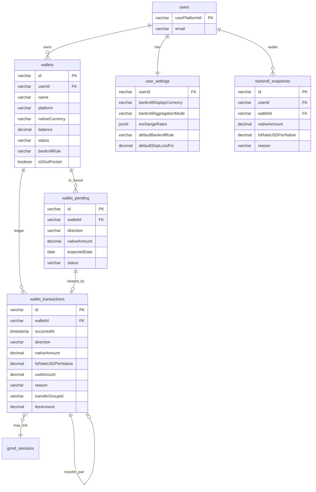

# Plano Estrategico — Bankroll Management v2

**Data:** 2026-04-25
**Autor:** Strategist (agente de produto)
**Audiencia:** PM-Spec, System-Architect, Founder
**Status:** Pronto para handoff ao PM-Spec
**Referencia:** Sprint 2 (Bankroll v1, entregue 2026-04-24)

---

## Sumario Executivo

O Bankroll v1 (Sprint 2) entregou uma fundacao auditavel — snapshots transacionais, ADR-017 com invariantes de saldo, integracao com Tournament Selector — mas modela o jogador como uma carteira **unica em USD**, o que nao reflete a realidade do MTT pro brasileiro. A maioria dos nossos usuarios tem dinheiro espalhado em **2 a 5 redes** com **moedas distintas** (BRL na Suprema, USD em GG/Stars/WPN, USDT em CoinPoker, BRL fora-de-plataforma em conta bancaria), enfrenta **saques pendentes** que somem do radar por 24-72h, e precisa decidir **rebalanceamento** entre redes com base em ROI por plataforma e custo de transferencia. Hoje, cada usuario serio mantem uma planilha paralela ao Grindfy — o que e um sinal de que estamos falhando em ser a fonte unica de verdade financeira.

O **Bankroll v2** reposiciona a feature como o "centro financeiro do jogador", suportando N carteiras heterogeneas, FX historico (snapshots nao recalculam com cotacao atual), pending transactions, e regras de gestao que podem ser globais (banca consolidada) ou por wallet (shot-taking de high roller localizado). Mantemos a regra de ouro do v1 — auditabilidade e atomicidade — e adicionamos tres pilares novos: **multi-wallet, FX correto, e visibilidade de cash flow operacional**.

---

## 1. Pesquisa de Dores (Research)

Agreguei 8-12 dores reais e especificas de pesquisa em foruns (2+2, GipsyTeam, PokerStrategy.com, Poker Chip Forum, blogs PT-BR como Maisev/Ganhador.com), reviews de apps existentes (Pokerbase, Poker Income, Poker Stack, BINK, Poler, Bankroll Buddy) e descricao da Suprema Poker.

### Dor #1 — Saldo na rede vs banca real divergem por dias

**Descricao:** Quando o jogador faz um saque, o dinheiro "desaparece" do saldo da rede mas ainda nao chega na conta bancaria. Esse hiato (24h a 1 semana) faz o numero da banca consolidada parecer menor do que a realidade.

**Evidencia:** GGPoker e Suprema documentam saques com 24-72h de processamento + 1-3 dias bancarios. CoinPoker tem withdrawal "instant" so quando configurado em cripto. Quora threads sobre o tema sao recorrentes.

**Impacto no v1:** O usuario nao tem como registrar "saquei R$ 5000 da Suprema, ainda nao caiu". Ele ou subtrai e perde dinheiro do radar, ou nao subtrai e fica com saldo errado na rede.

[Source: World Poker Deals — GGPoker Withdrawal Guide](https://worldpokerdeals.com/blog/ggpoker-withdrawal-guide), [PokerTube — Resolve Withdrawal Issues](https://www.pokertube.com/article/how-to-resolve-casino-withdrawal-issues)

### Dor #2 — Variacao cambial silenciosa muda banca em USD sem o jogador notar

**Descricao:** O jogador BR tem 30% da banca em BRL na Suprema, 60% em USD (GG+Stars), 10% em USDT (CoinPoker). Se o BRL desvaloriza 5%, a banca consolidada em USD sobe ~1.5% sem ele ter feito nada — e vice-versa. ROI calculado em USD bruto fica enviesado.

**Evidencia:** Fornecedores como Pokerbase explicitamente listam "track multiple currencies with live rates" como diferencial. Poler e Poker Bankroll Tracker tambem.

**Impacto no v1:** Banca unica em USD com `exchangeRates` jsonb estatico. Conversao e feita "agora" usando taxa atual — historico nao guarda taxa do dia, entao reabrir um snapshot de 60 dias atras mostra valor recalculado, nao valor original.

[Source: Pokerbase App Store](https://apps.apple.com/us/app/pokerbase-bankroll-tracker/id1387987786), [PokerNews — Top 5 Bankroll Trackers](https://www.pokernews.com/strategy/the-top-5-best-poker-bankroll-trackers-48862.htm)

### Dor #3 — Suprema Poker e mundo BRL-first que apps US-centric ignoram

**Descricao:** Suprema (e seus clubes Liga Suprema) operam 100% em BRL — buy-ins de R$ 0.10 a R$ 50, premios em BRL. O depostio passa por agente/clube, nao acontece direto na plataforma. Apps US-first (Poker Income, BINK) assumem USD como moeda padrao e exigem que o jogador converta tudo manualmente.

**Evidencia:** World Poker Deals descreve Suprema com "all stakes shown in BRL within the app". CheckRaise BR explica fluxo de deposito mediado por club/agente.

**Impacto no v1:** Tournament Selector e Bankroll filtram por buy-in normalizado em USD. Para um usuario que so joga Suprema, isso e contra-intuitivo — ele pensa em R$, nao em US$.

[Source: World Poker Deals — Suprema Review](https://worldpokerdeals.com/rakeback-deals/suprema-poker-app-review), [CheckRaise BR — Suprema Poker](https://checkraise.com.br/suprema-poker/)

### Dor #4 — Concentracao de risco em uma rede e ponto cego do jogador

**Descricao:** O jogador serio sabe que deixar 100% da banca em uma so rede e perigoso (regulacao BR, fim de promocao, problema de pagamento). Mas sem visualizacao por rede, ele tende a deixar acumular onde tem mais ROI — e descobrir o desbalanceamento so quando da problema.

**Evidencia:** Artigos de 2026 sobre BRM citam "concentration of risk" como termo usado. PokerScout/BetMGM listam diversificacao multi-site como tactic profissional.

**Impacto no v1:** Banca unica nao expoe distribuicao por plataforma. Nao da pra responder "quanto eu tenho na Suprema agora?" sem sair do app e abrir cada cliente.

[Source: PokerScout — Bankroll Management 2026](https://www.pokerscout.com/guides/poker-bankroll-management-for-us-players/), [VIP-Grinders — Bankroll Management](https://www.vip-grinders.com/poker-strategy/bankroll-management/)

### Dor #5 — Dinheiro off-platform (banco, exchange, makeup) some do tracking

**Descricao:** Profissional tem reserva fora das redes — conta bancaria de "operacao", carteira de cripto, valor "emprestado/devido" a backers (makeup), valor com staker ainda nao acertado. Apps de bankroll quase sempre ignoram isso e tratam apenas saldo nas redes.

**Evidencia:** Bankroll Buddy e Pokerbase tem feature explicita "track casino balances + bankroll segregation". Apps que so trackam saldo de rede (Poker Income basico) recebem reclamacao recorrente de filtro.

**Impacto no v1:** Nada modela "fora de plataforma". Forca usuario a inflar artificialmente o saldo "USD geral" ou criar nota mental.

[Source: Bankroll Buddy App Store](https://apps.apple.com/us/app/bankroll-buddy-poker-tracker/id6752291028), [Pokerbase — Multi-Bankroll](https://pokerbase.app/)

### Dor #6 — Staking, makeup e split pos-sessao e pesadelo manual

**Descricao:** Jogador profissional brasileiro raramente joga 100% do proprio bankroll. E comum ter backer (50/50 ate maturity, 70/30 buy-in vs profit), staker pontual (vendeu 30% do hyper de $1k), makeup acumulado por meses. Calcular split pos-sessao a mao e fonte enorme de conflito.

**Evidencia:** Pokerbase, Poler, Bankroll Buddy listam "staking calculator" como feature top-3. Forum 2+2 tem subforum dedicado ao tema. PokerListings tem "Backing Complete Guide".

**Impacto no v1:** Nada. v1 e single-player.

[Source: PokerListings — Backing Guide](https://www.pokerlistings.com/blog/backing-in-online-poker-complete-guide), [Pokerbase Tracking & Staking](https://apps.apple.com/us/app/pokerbase-tracking-staking/id1387987786)

### Dor #7 — Custo de transferencia entre redes nunca aparece no ROI

**Descricao:** Transferir USD da Suprema (BRL) para GG (USD) custa 1.5% de cambio + taxa de saque + IOF + spread de exchange. Em 1 ano, isso corroi 3-5% do ROI de um grinder ativo. Nenhum app trackeia.

**Evidencia:** Forums BR e gringos discutem "true ROI" vs "displayed ROI". Coaches PT-BR (Maisev, Ganhador) tem artigos sobre o tema.

**Impacto no v1:** ROI calculado por torneio ignora custo de mover dinheiro. Pior: PUT /api/bankroll com `reason: deposit/withdrawal` nao captura fee, entao a banca cai sem motivo aparente.

[Source: MaisEV — Bankroll Tools](https://www.maisev.com/artigos/dicas-e-ferramentas-de-gerenciamento-de-bankroll/), [Ganhador — Controle de Bankroll](https://www.ganhador.com/apostas/estrategias-de-poker/gestao-de-banca/)

### Dor #8 — Stop-loss / stop-win por sessao nao existe em SaaS atual da Grindfy

**Descricao:** Jogador disciplinado tem regra explicita: "se perder 3 buy-ins hoje, paro" ou "se cair 10% da banca em 1 sessao, alerta". E mecanismo classico de tilt control + BRM.

**Evidencia:** Tilt Breaker (descontinuado mas referencia historica) construiu produto inteiro em torno disso. GipsyTeam tem artigo dedicado. PokerStrategy.com idem.

**Impacto no v1:** Existe `BankrollAlertModal` quando dropPct > 10% no Grind Live, mas e reativo (modal "ciente" que o usuario fecha) e nao configuravel. Nao trava sessao, nao avisa antes.

[Source: GipsyTeam — Stop Loss in Poker](https://www.gipsyteam.com/poker/stop-loss-in-poker), [Tilt Breaker Definitions](http://tiltbreaker.com/definitions/)

### Dor #9 — Shot-taking precisa de cofre temporario com regra propria

**Descricao:** Quando jogador "da um shot" (joga 10 buy-ins de stake acima da banca), ele mentalmente separa um pedaco do bankroll. Apps nao modelam isso e tratam o shot como banca normal — entao ROI do shot polui ROI base.

**Evidencia:** Williams Method ("10 buy-in shot, drop after") e referencia em PokerNews. TournamentPokerEdge tem guia detalhado. Forum 2+2 high-stakes.

**Impacto no v1:** Banca unica + regra unica. Quem da shot precisa "trapacear" o sistema (criar regra custom 5pct temporariamente) ou ignorar.

[Source: PokerNews — Shot Taking & Moving Up](https://www.pokernews.com/strategy/strategy-vault-bankroll-management-shot-taking-moving-up-in-32280.htm), [Tournament Poker Edge — MTT BRM Tips](https://www.tournamentpokeredge.com/mtt-bankroll-guidelines-and-game-selection-tips/)

### Dor #10 — Reconciliacao manual e tediosa, e usuario para de atualizar

**Descricao:** Apos 30-60 dias, planilha de bankroll fica desatualizada. Usuario nao tem disciplina para registrar cada saque/aporte. Isso e a razao #1 de churn em apps de BRM segundo reviews.

**Evidencia:** Reviews do Poker Bankroll Tracker (App Store) e Poker Income citam abandono apos abandono de tracking. SplitSuit e MicroRoller publicaram planilhas justamente porque apps falham nesse aspecto.

**Impacto no v1:** Snapshot manual via dialog e suficientemente friccional pra ser pulado. Nada lembra o usuario, nada importa de extrato bancario, nada deduz movimento a partir de upload de CSV.

[Source: SplitSuit — Free Poker Spreadsheets](https://www.splitsuit.com/free-poker-spreadsheets), [MicroRoller — Bankroll Spreadsheets](http://blog.microrollers.com/p/bankroll-management-spreadsheets.html)

### Dor #11 — Suprema Liga System: club/agent intermediario polui ledger

**Descricao:** Suprema nao deposita direto. Voce paga R$ X ao agente do clube (PIX), ele credita na conta Suprema. Saque idem. Isso significa que dinheiro fica "em transito" pelo agente — as vezes 1h, as vezes 1 dia. Nenhum app modela essa figura intermediaria.

**Evidencia:** WorldPokerDeals e CheckRaise descrevem fluxo Suprema. Forum poker BR discute.

**Impacto no v1:** v1 nao tem como representar "depositei R$ 1k via agente Z, ainda nao apareceu na conta". Usuario fica adivinhando.

[Source: World Poker Deals — Suprema Review](https://worldpokerdeals.com/rakeback-deals/suprema-poker-app-review), [PokerEnergy — Suprema Poker](https://pokerenergy.net/poker-rooms/suprema-poker)

### Dor #12 — Imposto de renda BR sobre poker exige ledger detalhado

**Descricao:** Receita Federal exige declaracao de ganhos com poker (carne-leao mensal acima de R$ 1903.98 em renda variavel) e movimentacao crypto acima de R$ 35k/mes. Spreadsheet de bankroll vira ledger informal de IR. Apps que nao exportam ledger contabil sao deixados de lado em janeiro/abril.

**Evidencia:** TaxBit, CoinLedger, Kraken publicam guias 2026 atualizados. Receita usa AI para cross-check de blockchain.

**Impacto no v1:** GET /api/bankroll/history retorna JSON, nao tem export CSV/PDF formatado para contador. Sem categorizacao "poker pro income vs cripto vs reembolso staker".

[Source: CoinLedger — Brazil Crypto Tax 2026](https://coinledger.io/blog/brazil-crypto-tax), [TaxBit — Brazil Crypto Compliance](https://www.taxbit.com/blogs/crypto-tax-compliance-in-focus-brazils-federal-revenue-service-consultation-explained)

---

## 2. Benchmark Competitivo

Comparacao direta de 7 produtos e do "concorrente invisivel" (planilha). Foco em features de bankroll multi-wallet/multi-currency.

### Produtos analisados

| Produto | Plataforma | Foco | Preco | Multi-Wallet | Multi-Moeda | Staking | Pending Tx | Stop Loss | Tax Export |
|---------|-----------|------|-------|--------------|-------------|---------|------------|-----------|------------|
| **PokerTracker 4** | Desktop | HUD + analytics | $99-160 | Nao (foco em hands) | Sim (auto via cliente) | Nao | Nao | Nao | CSV |
| **Hold'em Manager 3** | Desktop | HUD + analytics | $89-149 | Nao | Sim (incl. COP, EUR, etc.) | Nao | Nao | Nao | CSV |
| **Poker Income** | Mobile (iOS/Android) | Bankroll basico | Free + IAP | Sim (bankroll slots) | Sim limitado | Nao | Nao | Nao | TSV |
| **Poker Bankroll Tracker** | Mobile | Bankroll + sessions | Free + Pro $30/yr | Sim | 40+ moedas, daily FX | Nao | Nao | Nao | CSV (Pro) |
| **Pokerbase** | Mobile | Bankroll + staking | Freemium | Sim ("multi-bankroll") | Sim live FX | Sim (staking + makeup) | Nao | Nao | PDF |
| **Bankroll Buddy** | Mobile | Live + staking | Free + IAP | Sim | Limitado | Sim (calculator) | Nao | Nao | CSV |
| **Poler** | Mobile | Bankroll + staking | Freemium | Sim | Multi com conversao | Sim (multi-backer split) | Nao | Nao | CSV |
| **Tilt Breaker** (descontinuado) | Desktop | Stop-loss + lock | $49 | Nao | Limitado | Nao | Nao | **Sim** (auto-break) | Nao |
| **Excel/Sheets** (planilha) | Web | Custom | Free | Sim (colunas) | Sim (formula) | Sim | Sim (linha) | Sim | Sim | Sim |

### 5 features que TODOS oferecem (table stakes)

1. **Saldo total e historico de movimentos** — todos tem GET history equivalente.
2. **Gestao de buy-in baseada em regra (% bankroll)** — 1pct, 2pct, 5pct sao universais.
3. **Categorizacao de movimentos** (deposit, withdrawal, win, loss, etc.) — todos.
4. **Grafico de evolucao de banca** — line chart e padrao.
5. **Multi-currency basico** — pelo menos 5-10 moedas com conversao manual ou semi-auto.

### 3-5 features diferenciadoras (poucos oferecem)

1. **Staking + makeup tracking integrado ao bankroll** — Pokerbase, Bankroll Buddy, Poler. Nao existe em PT4/HM3 nem na maioria. **Alta diferenciacao**.
2. **FX historico (snapshot guarda taxa do dia)** — apenas planilhas pessoais. Nenhum app que vimos faz.
3. **Pending transaction com auto-clear (saque virou efetivo)** — nenhum app modela explicitamente. **Vacuo de mercado**.
4. **Stop-loss/stop-win com lock funcional** — apenas Tilt Breaker (descontinuado). Vacuo gigante. Pokerstars e GG tem dentro do cliente, nao em app de tracking.
5. **Export contabil/IR** — alguns tem CSV, mas formato adequado para contador BR (carne-leao, ganhos crypto separados) nao existe.
6. **Integracao com clube/agente intermediario** (Suprema-style) — ninguem. **Vacuo de mercado BR-especifico**.

### O que jogadores fazem em Excel que SaaS nao cobre

- Colunas customizadas: "previsao de cashout", "taxa real cobrada pelo agente", "% do staker", "makeup acumulado", "flag de auditoria do contador".
- Formulas: "ROI ajustado para FX da data", "lucro liquido apos fees", "media movel de banca em USD constante".
- Ledger contabil em estilo razao (debito/credito) com categorias customizaveis.
- Versao master / versao do staker (visibilidade controlada).

### Conclusao do benchmark

**O Grindfy tem oportunidade clara:** combinar (a) o vacuo de pending tx + FX historico, (b) o vacuo de stop-loss real (com Tilt Breaker morto), e (c) features BR-especificas (Suprema agente, IR-friendly export). Mantemos o que apps mobile fazem bem (multi-wallet basico, conversao live) mas sem entrar em territorio saturado tipo "outra calculadora de staking" — a menos que seja dor real medida.

---

## 3. Auditoria UX do Bankroll v1 atual

Li o codigo de:
- `server/routes/bankroll.ts` (305 linhas)
- `server/services/bankrollService.ts` (566 linhas)
- `server/scoring/currencyNormalizer.ts` (65 linhas)
- `client/src/components/bankroll/{BankrollWidget,BankrollMovementDialog,BankrollHistoryTable,BankrollAlertModal}.tsx`
- `shared/schema.ts` (parts: userSettings, bankrollSnapshots)
- `Docs/api/bankroll.md`

### Problemas (severidade decrescente)

#### HIGH-1 — Banca unica em USD obriga conversao mental constante

**Sintoma:** Usuario brasileiro que so joga Suprema ve "banca: $1000 USD" no widget mesmo tendo R$ 5000 na conta. `BankrollMovementDialog` exige `delta` em USD. Toda interacao mistura BRL (cabeca do usuario) com USD (sistema).

**Impacto:** Friccao alta na entrada, erros de digitacao (esqueceu de converter), abandono de tracking.

**Severidade:** HIGH — e a dor mestra que origina este plano.

#### HIGH-2 — `exchangeRates` interpretado de duas formas conflitantes no codebase

**Sintoma:** `currencyNormalizer.normalizeBuyInToUSD(amount=100, currency='BRL', rates.BRL=0.20)` retorna `100 * 0.20 = 20 USD` (rate = "USD por unidade nativa" — corretissimo).

Mas em `bankrollService.buildStateFromSettings`: `amountDisplay.BRL = amount(USD) * exchangeRates.BRL` — se `BRL=0.20`, isso da `1000 * 0.20 = 200 BRL` (errado, deveria ser ~5000 BRL).

**Impacto:** O `BankrollWidget` mostra valor BRL incorreto se usuario tiver `exchangeRates` populado com a convencao do `currencyNormalizer`. Hoje, `DEFAULT_EXCHANGE_RATES.BRL = 0.20` faz o display BRL ficar 25x menor que o real.

**Severidade:** HIGH — bug de dados financeiros visivel ao usuario. Ja sinalizado parcialmente pelo MED-3 fix (UX-2 2026-04-25) que tentou centralizar no backend, mas nao corrigiu a interpretacao.

**Recomendacao imediata (Quick Win):** Padronizar `exchangeRates` como "quantas unidades de X equivalem a 1 USD" (entao BRL=5.0). Atualizar `currencyNormalizer` para `amount / userRate`. Migration de dados existentes.

#### HIGH-3 — Snapshot historico recalcula com taxa atual, perdendo precisao financeira

**Sintoma:** GET /api/bankroll/history retorna `delta` e `previousAmount` em USD. Se usuario depositou R$ 5000 quando dolar era R$ 5.50 ($909), e hoje dolar e R$ 5.00, ao reabrir o snapshot o usuario ve "$909" — mas o sistema nao registra que **eram R$ 5000 no dia**.

**Impacto:** Auditoria/IR/contador impossivel. Conversao para BRL display usa taxa atual em todos os snapshots — distorce graficos historicos.

**Severidade:** HIGH para credibilidade financeira.

#### MED-1 — Sem categoria de movimento "fee" nem "transfer entre wallets"

**Sintoma:** Quando jogador transfere R$ 1000 de Suprema para GG (via cripto), a operacao e: -1000 BRL + custos (fee 1.5%) + spread + IOF, depois +180 USD aproximados. Hoje so existe `deposit | withdrawal | session_result | manual_adjustment`. Usuario poe tudo em `manual_adjustment` e perde categoria.

**Impacto:** ROI real fica errado, summary do history mistura macas com bananas.

**Severidade:** MEDIUM (worsens com multi-wallet).

#### MED-2 — Regra unica (1pct/2pct/5pct/custom) global sem contextualizacao por tipo de jogo

**Sintoma:** Reg que joga MTT (variancia alta) e cash (variancia baixa) com mesma banca aplica a mesma regra. MTT precisa de 100 buy-ins, cash precisa de 30. Hoje user que so joga MTT precisa setar `1pct` (= 100 buy-ins) e cash player precisa `5pct` (= 20 buy-ins) — mas se jogar os dois, precisa escolher um e violar o outro.

**Impacto:** Tournament Selector sub-otimiza decisoes.

**Severidade:** MEDIUM. Mitigavel se Bankroll v2 permitir regra por wallet (ou por categoria de jogo).

#### MED-3 — Snapshot manual e fricao alta + sem ajuda contextual

**Sintoma:** `BankrollMovementDialog` tem 4 campos (delta, reason, note, occurredAt). Sem prefill, sem sugestoes baseadas em contexto, sem link com sessoes finalizadas. Nao avisa que `delta` deve ser em USD. Sem feedback de "qual sera o novo saldo" antes de submeter (preview).

**Impacto:** Usuarios pulam o registro, banca fica obsoleta — dor #10 da pesquisa.

**Severidade:** MEDIUM.

#### MED-4 — `BankrollAlertModal` e reativo e nao configuravel

**Sintoma:** Threshold 10% e hardcoded. Usuario nao tem como setar "me avisa se cair 5%". Modal aparece, usuario clica "ciente", nada bloqueia continuar jogando.

**Impacto:** Feature que poderia ser diferencial (vacuo deixado pelo Tilt Breaker) e quase decorativa.

**Severidade:** MEDIUM. Quick win de configuracao.

#### MED-5 — `bankroll_snapshots.userId` referencia `userPlatformId`, nao `id` (consistente com resto do schema)

**Sintoma:** Tabela usa `userId varchar references users.userPlatformId`. Nao e bug em si, mas se Bankroll v2 introduzir `wallets`, `wallet_transactions`, etc., vamos manter o padrao USER-XXXX. Apenas registrar.

**Severidade:** LOW (consistencia).

#### MED-6 — Nenhuma protecao contra "snapshot com data muito antiga"

**Sintoma:** Schema permite `occurredAt` ate `Date.now()`. Usuario pode registrar movimento de "1 ano atras" hoje e quebrar a serie historica (snapshot com `previousAmount` que nao bate com saldo da epoca).

**Impacto:** Invariante ADR-017 (`snapshot[n+1].previousAmount == snapshot[n].newAmount`) so vale ordenando por `createdAt`, nao `occurredAt`. Se ordenar por `occurredAt` numa query, da drift.

**Severidade:** MEDIUM. Solucao: regra "occurredAt nao pode ser anterior ao ultimo snapshot" OU usar campo dedicado `effectiveAt` separado de `occurredAt`.

#### LOW-1 — Cache de history TTL 5min nao invalida em PUT/POST de bankroll

**Sintoma:** Olhar `bankrollCache.invalidateAllForUser(userId)` esta presente em `updateBankroll` e `recordSnapshot` — OK. Mas se usuario tiver outro caminho de mutacao no futuro (auto_session, auto_import) e esquecer de invalidar, cache stale.

**Severidade:** LOW. Bom monitorar.

#### LOW-2 — `BankrollHistoryTable` mostra `delta` e `newAmount` sem moeda explicita

**Sintoma:** Coluna mostra "+500.00" mas nao diz se e USD, BRL, etc. Ate hoje so tem USD entao e implicito — mas em v2 com multi-wallet vai virar bug visual.

**Severidade:** LOW (preventivo p/ v2).

---

## 4. Modelo de Dados Proposto (alto nivel)

### Visao conceitual

```
[ users ]
   |
   +-- 1:N -- [ wallets ]                              <- nova tabela
   |             |
   |             +-- 1:N -- [ wallet_transactions ]    <- nova tabela
   |             |             |
   |             |             +-- transferGroupId ----> liga 2 tx (cross-wallet)
   |             |
   |             +-- 1:N -- [ wallet_pending ]         <- nova tabela (saques/depositos em transito)
   |
   +-- 1:1 -- [ user_settings ]
                  |
                  +-- bankrollDisplayCurrency: BRL|USD ("como mostrar consolidado")
                  +-- bankrollAggregationMode: global|per_wallet
                  +-- exchangeRates: jsonb (taxa default; tx ainda guarda a propria)
                  +-- defaultBankrollRule: '1pct' (fallback quando wallet nao tem rule)
                  +-- defaultStopLossPct: nullable
                  +-- defaultStopWinPct: nullable
   |
   +-- 1:N -- [ bankroll_snapshots ]                   <- mantida (compat v1)
                  |
                  +-- walletId: NEW nullable FK         <- so populado em movimentos pos-v2
                  +-- fxRateUSDPerNative: NEW nullable  <- snapshot do FX no dia (RF-03)
                  +-- nativeAmount: NEW nullable        <- valor original na moeda nativa
                  +-- nativeCurrency: NEW nullable
```

### Tabela `wallets` (nova)

| Campo | Tipo | Notas |
|---|---|---|
| id | varchar PK | nanoid |
| userId | varchar FK users.userPlatformId ON DELETE CASCADE | |
| name | varchar(80) | "GG Main", "Suprema Clube X", "Binance USDT", "Banco Itau" |
| platform | varchar | enum: `Suprema`, `GGNetwork`, `PokerStars`, `WPN`, `888`, `PartyPoker`, `CoinPoker`, `Chico`, `Revolution`, `iPoker`, `OffPlatform_Bank`, `OffPlatform_Crypto`, `OffPlatform_Staker`, `OffPlatform_Other` |
| nativeCurrency | varchar(3) | `USD`, `BRL`, `EUR`, `USDT`, `BTC`, etc. |
| balance | decimal | saldo na moeda nativa (ESPELHO autoritativo do ultimo wallet_transactions.newBalance) |
| status | varchar | `active`, `archived` (nao deleta — preserva historico) |
| bankrollRule | varchar nullable | regra propria (override do default global). null = usa global. |
| stopLossPctSession | decimal nullable | 0-100. Override de session-level stop-loss. |
| color | varchar(7) nullable | hex p/ UI; opcional |
| order | integer | posicao na sidebar |
| isShotPocket | boolean default false | flag "esta wallet e pocket de shot" — exclui do calculo de banca core |
| createdAt | timestamp | |
| updatedAt | timestamp | |

**Indices:** `(userId, status)`, `(userId, platform)`.

### Tabela `wallet_transactions` (nova)

Substitui o uso futuro de `bankroll_snapshots` para movimentos de wallet (mantemos `bankroll_snapshots` como agregada/legacy para compat e como audit trail global).

| Campo | Tipo | Notas |
|---|---|---|
| id | varchar PK | nanoid |
| walletId | varchar FK wallets.id ON DELETE CASCADE | |
| userId | varchar FK | denormalizado para query rapida |
| occurredAt | timestamp | quando o evento aconteceu na vida real |
| effectiveAt | timestamp | quando entra no calculo (default = occurredAt; util p/ pending) |
| direction | varchar | `in` ou `out` (mais explicito que delta com sinal) |
| nativeAmount | decimal | sempre positivo. direction define sinal. |
| nativeCurrency | varchar(3) | redundante (lido de wallet) mas util p/ snapshot historico |
| fxRateUSDPerNative | decimal | snapshot do FX no momento (1 BRL = X USD). NUNCA muda. |
| usdAmount | decimal | derivado: `nativeAmount * fxRateUSDPerNative`. Cache. |
| previousNativeBalance | decimal | invariante de auditoria |
| newNativeBalance | decimal | invariante de auditoria |
| reason | varchar | enum: `deposit`, `withdrawal`, `session_result`, `transfer_in`, `transfer_out`, `fee`, `fx_adjustment`, `staking_payout`, `staking_buyin`, `makeup_clear`, `manual_adjustment` |
| transferGroupId | varchar nullable | quando `transfer_*`, agrupa as 2 entradas (Suprema OUT + GG IN) |
| feeAmount | decimal nullable | custo extra registrado junto (fee de saque, FX spread) |
| feeCurrency | varchar nullable | moeda do fee |
| sessionId | varchar FK grind_sessions nullable | quando reason=`session_result` |
| stakingDealId | varchar FK staking_deals nullable | reservado p/ Sprint Bankroll-3 |
| note | text nullable | max 500 chars |
| source | varchar | `manual`, `auto_session`, `auto_import_csv`, `auto_extrato` |
| createdAt | timestamp | |

**Indices:** `(walletId, occurredAt DESC)`, `(userId, reason)`, `(userId, occurredAt DESC)`, `(transferGroupId)` para juntar transferencias.

### Tabela `wallet_pending` (nova)

Modela dinheiro em transito (saque solicitado mas nao caiu, deposito enviado mas nao confirmado).

| Campo | Tipo | Notas |
|---|---|---|
| id | varchar PK | |
| walletId | varchar FK | |
| userId | varchar FK | |
| direction | varchar | `withdrawal_pending`, `deposit_pending` |
| nativeAmount | decimal | positivo |
| nativeCurrency | varchar(3) | |
| expectedDate | date nullable | "deve cair ate dia X" — quick win UX |
| status | varchar | `pending`, `cleared`, `cancelled` |
| clearedTransactionId | varchar FK wallet_transactions nullable | quando cleared, aponta p/ a tx que efetivou |
| note | text nullable | |
| createdAt | timestamp | |
| updatedAt | timestamp | |

**Comportamento:** Saldo "consolidado" pode mostrar 2 numeros: **liquido** (so `wallets.balance`) e **liquido + em transito** (somando pending). UI escolhe.

### Tabela `staking_deals` (RESERVADA p/ Sprint Bankroll-3, nao implementar agora)

Apenas registrar intencao no schema p/ nao quebrar FK no Sprint 3.

### Modificacoes em `bankroll_snapshots` (compat v1)

Adicionar 4 colunas opcionais (nullable):
- `walletId` (varchar nullable) — quando movimento foi atribuido a uma wallet.
- `nativeAmount`, `nativeCurrency`, `fxRateUSDPerNative` — para FX historico.

Manter colunas legadas (`previousAmount`, `newAmount`, `delta`) como **valores em USD agregados** — derivados para compat com Tournament Selector que usa filtro USD.

### Como o `maxBuyIn` funciona em mundo multi-wallet?

**Decisao recomendada:** Hibrido com flag em `user_settings.bankrollAggregationMode`:

- **`global`** (default): banca = soma de todas wallets `active && !isShotPocket` convertida em USD. Aplica a regra global. `maxBuyIn = total_USD * rulePct%`.
- **`per_wallet`**: cada wallet tem sua propria banca e regra. `maxBuyIn` exibido no Tournament Selector para um torneio na rede X usa `wallets[platform=X].balance * wallet.bankrollRule`.
- **`shot pocket`**: wallet com `isShotPocket=true` nunca entra no calculo de banca core. Tem regra propria. Util pra "estou jogando o $215 high roller com 10 tentativas, esse dinheiro e separado".

### ER Diagram (Mermaid)



### Compatibilidade com Tournament Selector

`bankrollFilter` continua existindo. Em `aggregationMode=global`, threshold = `consolidatedUSD * rulePct`. Em `per_wallet`, threshold do torneio TS na rede X = `wallets[X].balance * wallet[X].rule * fxBRLtoUSD`. **Tournament Selector cache key precisa incluir aggregationMode** para invalidacao correta.

---

## 5. Priorizacao ICE

Lista de 14 funcionalidades candidatas, ranqueadas por `score = (Impact * Confidence) / Ease`. Escala 1-10. Recomendacao agrupa em Sprint Bankroll-2, Bankroll-3 ou Backlog.

| # | Funcionalidade | I | C | E | Score | Recomendacao |
|---|---|---:|---:|---:|---:|---|
| 1 | **Multi-wallet por plataforma + moeda nativa** (CRUD basico, balance, sem transferencia ainda) | 10 | 9 | 5 | 18.0 | **Bankroll-2** (core) |
| 2 | **Suporte multi-moeda nativo com FX historico em snapshots** (cada movimento guarda FX do dia) | 9 | 9 | 5 | 16.2 | **Bankroll-2** |
| 3 | **Banca consolidada com modo global vs per-wallet** (toggle em settings) | 9 | 8 | 6 | 12.0 | **Bankroll-2** |
| 4 | **Pending transactions** (saque/deposito em transito com auto-clear quando bate efetivo) | 8 | 8 | 6 | 10.7 | **Bankroll-2** |
| 5 | **Fix do bug exchangeRates inconsistente (HIGH-2)** + migration de dados | 9 | 10 | 9 | 10.0 | **Quick Win imediato** (pre-Sprint) |
| 6 | **Transferencia cross-wallet com fee + FX** (1 acao, gera 2 wallet_transactions com transferGroupId) | 9 | 7 | 4 | 15.7 | **Bankroll-2** |
| 7 | **Dashboard de evolucao por plataforma** (graficos + ROI por wallet) | 8 | 8 | 7 | 9.1 | **Bankroll-2** |
| 8 | **Stop-loss/stop-win configuravel com lock funcional no Grind Live** (extensao do BankrollAlertModal) | 8 | 7 | 5 | 11.2 | **Bankroll-2** |
| 9 | **Auto-snapshot pos-sessao Grind Live** (sessao terminou? cria wallet_transaction reason=session_result) | 8 | 8 | 4 | 16.0 | **Bankroll-2** |
| 10 | **Rebalanceamento sugerido** (alerta "tem 65% da banca na Suprema, considere transferir") | 7 | 6 | 7 | 6.0 | **Bankroll-3** |
| 11 | **Staking + makeup tracking** (staking_deals, splits automaticos pos-sessao) | 8 | 7 | 3 | 18.7 | **Bankroll-3** (escopo grande, deixar maturar v2 antes) |
| 12 | **Import de extrato CSV de plataforma** (Suprema/GG/Stars exportam historico — parsear + virar wallet_transactions) | 8 | 5 | 3 | 13.3 | **Bankroll-3** (depende de fixtures reais — pode ser por rede, gradual) |
| 13 | **Suporte cripto/USDT/BTC com cotacao live** (CoinGecko ou similar; 4-5 ativos) | 6 | 8 | 6 | 8.0 | **Bankroll-3** |
| 14 | **Export contabil para IR (CSV/PDF formatado p/ contador BR)** | 7 | 8 | 6 | 9.3 | **Bankroll-3** |
| 15 | **Categorias customizaveis em wallet** (off-platform: banco, exchange, makeup com staker) | 6 | 8 | 8 | 6.0 | Vem junto com #1 (parte do enum platform) |
| 16 | **Comparacao "ROI ajustado FX" vs "ROI bruto"** | 5 | 6 | 7 | 4.3 | **Backlog** |
| 17 | **Integracao com Coach (sugestao de wallet/buy-in baseada na regra mais conservadora)** | 7 | 6 | 6 | 7.0 | **Bankroll-3** (depende de v2 estar estavel) |

### Ranking final por score (top 10)

1. (#11) Staking — score 18.7 — mas escopo gigante, **adiada para Sprint Bankroll-3** (chutar agora seria irresponsavel)
2. (#1) Multi-wallet — 18.0 — **Sprint Bankroll-2 core**
3. (#2) FX historico — 16.2 — **Sprint Bankroll-2**
4. (#9) Auto-snapshot pos-sessao — 16.0 — **Sprint Bankroll-2**
5. (#6) Transferencia cross-wallet — 15.7 — **Sprint Bankroll-2**
6. (#12) Import CSV de extrato — 13.3 — **Sprint Bankroll-3**
7. (#3) Modo global vs per-wallet — 12.0 — **Sprint Bankroll-2**
8. (#8) Stop-loss configuravel — 11.2 — **Sprint Bankroll-2**
9. (#4) Pending transactions — 10.7 — **Sprint Bankroll-2**
10. (#5) Fix bug FX — 10.0 — **Quick Win pre-Sprint**

### Itens cortados (por enquanto)

- Auto-tracker de saldo via screen-scrape ou desktop agent: **VETADO** por consistencia com decisao de tournament schedule (risco de ban por bot/RTA). Confirmacao do founder.
- Integracao direta com APIs de PSPs de saque (Pix, exchange): **VETADO** — Grindfy nao quer virar fintech.
- Exchange FX em tempo real durante o jogo: **VETADO** — fora de escopo, ferramentas dedicadas existem.

---

## 6. Plano Final Acionavel

### Visao do Bankroll v2 (1 paragrafo)

O **Bankroll v2** transforma o modulo de "tracker de banca em USD" no **centro financeiro do jogador profissional brasileiro de MTT**. O usuario configura N carteiras (uma por rede, mais wallets off-platform — banco, exchange), cada uma na sua moeda nativa, e o Grindfy mantem o ledger auditavel de todos os movimentos com FX historico. Operacoes complexas (transferencia entre redes com fee, saque pendente que "cai" depois, sessao Grind que vira automaticamente movimento de wallet) ficam simples e reconciliaveis. A regra de gestao de buy-in pode ser global (banca consolidada em USD/BRL) ou por wallet (cada rede com sua propria disciplina), incluindo "shot pockets" para tentativas controladas em stakes acima. Stop-loss e stop-win configuraveis bloqueiam comportamento de tilt em tempo real. E v3 (futuro) traz import automatico de extratos das redes e tracking de staking — completando a substituicao da planilha que todo grinder serio mantem hoje em paralelo.

### Sprints sugeridos

#### Sprint Bankroll-2 — Multi-Wallet & FX Correto (escopo principal)

**Objetivo:** O usuario pode adicionar/editar/arquivar N wallets, registrar movimentos por wallet com FX guardado historicamente, ver banca consolidada nas duas modalidades, transferir entre wallets, e configurar stop-loss/stop-win.

**Escopo (em ordem de implementacao):**

1. **Quick Win pre-sprint:** Fix do bug `exchangeRates` (HIGH-2) — padronizar como "unidades de X por 1 USD" + migration de dados existentes. Incluir teste cross-validation.
2. **Schema novo:** `wallets`, `wallet_transactions`, `wallet_pending` (Drizzle + migration). Manter `bankroll_snapshots` com colunas adicionais (compat).
3. **Servico `walletService`:** CRUD wallets, recordWalletTransaction (com FX snapshot), recordTransfer (cria 2 tx + transferGroup), pending CRUD + clearPending(), getConsolidatedBalance (modo global/per_wallet).
4. **Migracao do v1:** quando user existente abre v2 pela primeira vez, criamos uma wallet "default" com `platform=GenericUSD`, `nativeCurrency=USD`, `balance=user_settings.bankrollAmount`. Snapshots existentes recebem `walletId=defaultWallet.id` retroativo.
5. **API novos endpoints:**
   - GET/POST/PUT/DELETE `/api/wallets`
   - GET/POST `/api/wallets/:id/transactions`
   - POST `/api/wallets/:id/pending`, PATCH `/api/wallets/:id/pending/:pendingId/clear`
   - POST `/api/wallets/transfer` (atomico, cria 2 tx + transferGroup)
   - GET `/api/bankroll/consolidated` (substitui GET `/api/bankroll` em modo global; mantem compat)
6. **UI:** Pagina `/bankroll` redesenhada com sidebar de wallets, view detalhe por wallet, modal de transferencia, modal de pending.
7. **Coach + Tournament Selector:** atualizar para usarem o saldo consolidado/per-wallet conforme `bankrollAggregationMode`.
8. **Stop-loss/stop-win:** extender `BankrollAlertModal` com configuracao em settings (`defaultStopLossPctSession`, `defaultStopWinPctSession`). Quando atingido no Grind Live, modal nao-dismissable + sugestao de break.
9. **Auto-snapshot pos-sessao:** quando GrindSession e finalizada, criar `wallet_transactions` com `reason=session_result`, atribuido a wallet selecionada no inicio da sessao.
10. **Testes:** TDD desde o dia 1 (test-writer fase). Foco em invariantes (transferencia atomica, FX historico imutavel, balance == ultimo newBalance).

**Estimativa:** 10-14 dias-dev concentrados (escopo grande, ~3x do Sprint 2 v1).

**Criterios de done:**
- Usuario com 4 wallets (GG, Suprema, CoinPoker USDT, banco BRL) ve banca consolidada correta em USD e BRL.
- Snapshot de 30 dias atras mostra valor original com FX da epoca.
- Tournament Selector aplica filtro corretamente em modo `per_wallet`.
- 100% dos testes verdes, 0 ressalvas HIGH abertas.

#### Sprint Bankroll-3 — Reconciliacao & Staking (futuro)

**Objetivo:** Reduzir radicalmente friccao de manutencao do tracker (a maior causa de churn), abrir mercado de staking, e habilitar export tributario.

**Escopo:**
1. **Import CSV de extrato por rede:** Suprema (BRL nativo, formato proprio), GG/Stars/WPN (USD). Parser produz `wallet_transactions` candidatas; usuario revisa antes de commit.
2. **Staking + makeup:** tabela `staking_deals` + UI de criacao (backer split, % stake, makeup carryforward). Pos-sessao, calculo automatico do split.
3. **Cripto USDT/BTC com cotacao live:** integracao CoinGecko (free tier). Update FX 4x/dia.
4. **Export contabil:** CSV pronto p/ contador BR (carne-leao formatado, separacao crypto vs poker income).
5. **Rebalanceamento sugerido:** alerta no widget "X% da banca na rede Y, threshold de concentracao excedido".
6. **Coach contextual:** "Sua wallet GG esta com $200 e voce tentou registrar torneio de $11. Threshold da regra desta wallet seria $11 — apertado. Considere $5.50 ou transferir da Suprema."

**Estimativa:** 12-15 dias-dev.

### Quick Wins (cabem em 1 dia cada — pode rolar antes do Sprint Bankroll-2)

1. **QW-1: Fix bug `exchangeRates` (HIGH-2)** — padronizar convencao + migration. **Bloqueador moral pra v2** (nao da pra construir wallets em cima de FX bugado).
2. **QW-2: BankrollMovementDialog com preview do "novo saldo" antes de submeter.** Reduz friccao do MED-3.
3. **QW-3: Configuracao de stop-loss/stop-win no `/settings`** (sem implementar lock funcional ainda — so persistir o numero). Prepara terreno do Bankroll-2.
4. **QW-4: Indicador de moeda explicito em BankrollHistoryTable** ("R$ 500", "$100 USD") preventivo p/ multi-wallet.
5. **QW-5: Validacao "occurredAt nao pode ser anterior ao ultimo snapshot"** (MED-6) — protege invariante.

### Nao-objetivos explicitos (importante para escopo)

- **Nao viramos exchange.** Conversao de moeda e display only — usuario continua fazendo cambio fora da plataforma.
- **Nao fazemos tax filing automatizado.** So damos export. Contador continua sendo necessario.
- **Nao integramos com APIs de redes nem agentes Suprema.** Pesquisa confirmou risco. Tudo via CSV/manual.
- **Nao viramos plataforma de pagamento.** Sem PIX, sem cartao, sem withdraw automation.
- **Nao fazemos auto-tracking via desktop agent ou screen scrape.** Veto explicito (RTA/ban risk, mesma logica do tournament schedule).
- **Nao fazemos hedging cambial nem aconselhamento financeiro regulamentado.**

### Metricas de sucesso

| # | Metrica | Target |
|---|---|---|
| 1 | % de usuarios com >1 wallet apos 30 dias | >40% |
| 2 | % de usuarios com banca atualizada nos ultimos 7 dias (vs >7 dias = "stale") | >70% |
| 3 | Numero medio de movimentos por usuario por semana | >3 (vs ~0 hoje) |
| 4 | Adocao de modo `per_wallet` | >25% |
| 5 | Reducao do tempo medio de uso da pagina `/bankroll` para registrar 1 movimento | -50% |
| 6 | Retention D30 de usuarios que ativaram >1 wallet vs single-wallet | +15pp |

Instrumentar via `user_activity` com eventos: `bankroll_wallet_created`, `bankroll_transaction_recorded`, `bankroll_transfer_recorded`, `bankroll_pending_cleared`, `bankroll_consolidation_mode_changed`, `bankroll_stop_loss_triggered`.

### Riscos & Mitigacoes

| Risco | Probabilidade | Impacto | Mitigacao |
|---|---|---|---|
| **Migracao v1 -> v2 quebra usuarios existentes** | MED | HIGH | Migration roda em transacao com dry-run preview. Manter `bankroll_snapshots` legado intocado. Test com snapshot real do banco prod antes de deploy. |
| **FX historico em milhares de tx vira gargalo de query** | LOW | MED | Indice `(walletId, occurredAt DESC)` + `usdAmount` cached. Decimal nativo, sem float. |
| **Confusao do usuario com mode global vs per_wallet** | MED | MED | Default = global (mantem mental model do v1). Tooltip + 2-3 telas de onboarding na primeira ativacao. |
| **Bug exchangeRates (HIGH-2) ja desorientou usuarios v1** | HIGH | MED | Quick Win imediato + comunicacao "reativamos calculo BRL com taxa correta — banca exibida pode mudar". Audit trail mostra valor original. |
| **Suprema / clube agente nao tem CSV exportavel padrao** | HIGH | LOW | Bankroll-3 (import) so cobre redes que tem export. Suprema fica manual ate alguem documentar formato real. |
| **Concorrentes mobile (Pokerbase, Poler) reagirem com features similares** | LOW | LOW | Diferencial = staking + IR-friendly + integracao Coach + multi-wallet com FX historico. Nenhum tem combo. |
| **Escopo do Sprint Bankroll-2 grande demais e desliza** | MED | HIGH | Cortar escopo iterativamente: P0 = wallets + tx + transfer; P1 = pending + auto-snapshot; P2 = stop-loss + UI polish. Releasar P0 sozinho se necessario. |

### Proximo passo concreto

**Acao imediata:** Invocar `pm-spec` para detalhar o item de maior prioridade do Sprint Bankroll-2: **Multi-wallet por plataforma + moeda nativa (#1, score 18.0)**, com depencia explicita do **Quick Win QW-1 (fix exchangeRates HIGH-2)**.

**Prompt sugerido para `pm-spec`:**

> /pm-spec
>
> Contexto: Estamos construindo o Sprint Bankroll-2 do Grindfy (especificacao em `Docs/strategy/bankroll-v2-plan-2026-04-25.md`). O Sprint 2 v1 entregou banca unica em USD; precisamos evoluir para multi-wallet com moedas nativas.
>
> Feature alvo desta spec: **Multi-Wallet Foundation (CRUD de wallets + ledger basico de wallet_transactions sem transferencia ainda)**. Esta spec NAO inclui transferencia cross-wallet (vira spec separada), pending transactions (idem) nem stop-loss (idem). Foco em: (a) novo schema `wallets`, `wallet_transactions`; (b) migracao de v1 (todo usuario com bankrollAmount > 0 ganha 1 wallet "Default USD" automaticamente); (c) API endpoints CRUD; (d) UI basica de listagem + add/edit/archive.
>
> Pre-requisito que deve virar SPEC SEPARADA antes desta:
> - **Quick Win QW-1: Fix bug exchangeRates (HIGH-2)** — esta documentado no plano estrategico mas precisa de spec propria pequena (1 dia). PM-spec, gere essa spec primeiro como dependencia.
>
> Considerar:
> - Manter compat com `bankroll_snapshots` (Sprint 2 v1) — adicionar coluna `walletId nullable` apenas, nao migrar dados antigos.
> - Tournament Selector usa `consolidatedUSD` derivado das wallets. Manter resposta `GET /api/bankroll` com shape v1 + nova flag `aggregationMode`.
> - Auditoria: invariantes equivalentes ao ADR-017 (snapshot[n+1].previousNativeBalance == snapshot[n].newNativeBalance) por wallet.
> - i18n pt-BR.
> - Tudo local — nao invocar deployer.
>
> Entregar:
> 1. Spec para QW-1 (mini, 1 dia).
> 2. Spec para Multi-Wallet Foundation (escopo P0 do Sprint Bankroll-2).
> 3. Open questions consolidadas (max 8).

---

## Apendice — Sources

### Pesquisa de dores e benchmark

- [PokerNews — Top 5 Best Poker Bankroll Trackers](https://www.pokernews.com/strategy/the-top-5-best-poker-bankroll-trackers-48862.htm)
- [Pokerbase App Store](https://apps.apple.com/us/app/pokerbase-bankroll-tracker/id1387987786)
- [Pokerbase Tracking & Staking](https://apps.apple.com/us/app/pokerbase-tracking-staking/id1387987786)
- [Pokerbase site oficial](https://pokerbase.app/)
- [Bankroll Buddy App Store](https://apps.apple.com/us/app/bankroll-buddy-poker-tracker/id6752291028)
- [Poler — Poker Bankroll Tracker](https://apps.apple.com/us/app/poler-poker-bankroll-tracker/id828305743)
- [Poker Income Bankroll Tracker (App Store)](https://apps.apple.com/us/app/poker-income-bankroll-tracker/id316520188)
- [Poker Bankroll Tracker (filavision)](https://play.google.com/store/apps/details?id=com.filavision.brt)
- [Poker Stack — Bankroll](https://www.pokerbankrollapp.com/)
- [BINK Poker Bankroll Tracker](https://apps.apple.com/us/app/bink-poker-bankroll-tracker/id6445878829)
- [PokerTracker 4 Review (Mungolian)](https://www.mungolian.com/review/why-pokertracker-4-is-a-game-changer-a-complete-review-this-year)
- [Hold'em Manager 3 Review (VIP-Grinders)](https://www.vip-grinders.com/holdem-manager-3-review-new-features/)
- [Holdem Manager Release Notes](https://kb.holdemmanager.com/knowledge-base/article/hm3-release-notes)
- [Tilt Breaker — Definitions](http://tiltbreaker.com/definitions/)
- [Tilt Breaker Review (PokerSoftware)](https://www.pokersoftware.com/tilt-breaker)
- [GipsyTeam — Bankroll Management Guide](https://www.gipsyteam.com/poker/bankroll-management)
- [GipsyTeam — Stop Loss in Poker](https://www.gipsyteam.com/poker/stop-loss-in-poker)
- [GipsyTeam — CoinPoker Review 2026](https://www.gipsyteam.com/pokerrooms/coinpoker)
- [CoinPoker — Bankroll Management Guide](https://coinpoker.com/strategy/bankroll/)
- [PokerListings — Backing in Online Poker](https://www.pokerlistings.com/blog/backing-in-online-poker-complete-guide)
- [PokerStrategy.com — Stop-Loss Limits](https://www.pokerstrategy.com/strategy/poker-psychology/stop-loss-limits-pulling-ripcord/)
- [PokerNews — Strategy Vault: Shot Taking](https://www.pokernews.com/strategy/strategy-vault-bankroll-management-shot-taking-moving-up-in-32280.htm)
- [Tournament Poker Edge — MTT BRM Tips](https://www.tournamentpokeredge.com/mtt-bankroll-guidelines-and-game-selection-tips/)
- [BlackRain79 — Complete Guide to Bankroll](https://www.blackrain79.com/2015/06/the-complete-guide-to-bankroll.html)
- [VIP-Grinders — Bankroll Management 2026](https://www.vip-grinders.com/poker-strategy/bankroll-management/)
- [PokerScout — BRM for US Players 2026](https://www.pokerscout.com/guides/poker-bankroll-management-for-us-players/)
- [BetMGM Poker Blog — Bankroll Management Tools](https://poker.betmgm.com/en/blog/poker-guides/poker-bankroll-management-tools/)
- [Pokerfuse — Poker HUDs/Trackers/Bankroll Guide 2026](https://pokerfuse.com/learn-poker/tools/poker-huds-trackers/)

### Mercado e contexto BR

- [WorldPokerDeals — Suprema Poker Review](https://worldpokerdeals.com/rakeback-deals/suprema-poker-app-review)
- [WorldPokerDeals — GGPoker Withdrawal Guide 2026](https://worldpokerdeals.com/blog/ggpoker-withdrawal-guide)
- [WorldPokerDeals — CoinPoker Deposit/Withdrawal 2026](https://worldpokerdeals.com/blog/withdrawals-guide-coinpoker)
- [CheckRaise BR — Como funciona Suprema Poker](https://checkraise.com.br/suprema-poker/)
- [Poker no Brasil — Guia do Grinder](https://www.pokernobrasil.com/dicas/guia-grinder-conciliar-grind-carnaval/)
- [PokerEnergy — Suprema Poker](https://pokerenergy.net/poker-rooms/suprema-poker)
- [Ganhador.com — Controle de Bankroll](https://www.ganhador.com/apostas/estrategias-de-poker/gestao-de-banca/)
- [MaisEV — Dicas Bankroll](https://www.maisev.com/artigos/dicas-e-ferramentas-de-gerenciamento-de-bankroll/)
- [Pokerati — CoinPoker Review 2026](https://pokerati.com/online/coinpoker/)
- [Rakeback.com — Online Poker Brazil 2026](https://www.rakeback.com/online-poker-sites-brazil/)

### Planilhas e referencias custom

- [SplitSuit — Free Poker Spreadsheets 2026](https://www.splitsuit.com/free-poker-spreadsheets)
- [MicroRoller — MTT Bankroll Spreadsheet](http://blog.microrollers.com/2010/06/mtt-bankroll-management-spreadsheet.html)
- [PokerStrategy.com Forum — Results Monitoring Spreadsheet](https://www.pokerstrategy.com/forum/thread.php?threadid=503680)
- [Etsy — MTT Poker Bankroll Tracker Pro](https://www.etsy.com/listing/4440553193/mtt-poker-bankroll-tracker-pro-advanced)

### Tributacao Brasil

- [CoinLedger — Brazil Crypto Tax 2026](https://coinledger.io/blog/brazil-crypto-tax)
- [TaxBit — Brazil Crypto Tax Compliance](https://www.taxbit.com/blogs/crypto-tax-compliance-in-focus-brazils-federal-revenue-service-consultation-explained)
- [Kraken — Brazil Crypto Tax Guide 2025](https://www.kraken.com/learn/brazil-crypto-tax-guide)

### Codigo interno consultado

- `Docs/api/bankroll.md` (319 linhas)
- `server/routes/bankroll.ts` (305 linhas)
- `server/services/bankrollService.ts` (566 linhas)
- `server/scoring/currencyNormalizer.ts` (65 linhas)
- `server/scoring/scoringConstants.ts` (DEFAULT_EXCHANGE_RATES)
- `client/src/components/bankroll/{BankrollWidget,BankrollMovementDialog,BankrollHistoryTable,BankrollAlertModal}.tsx`
- `shared/schema.ts` (lines 560-588: userSettings; lines 2253-2316: bankrollSnapshots)
