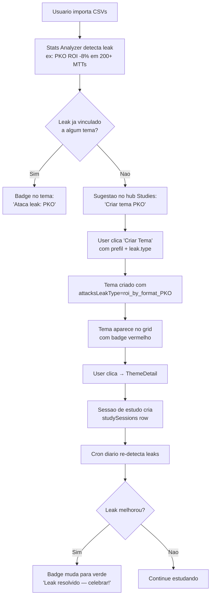
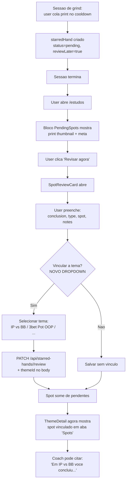
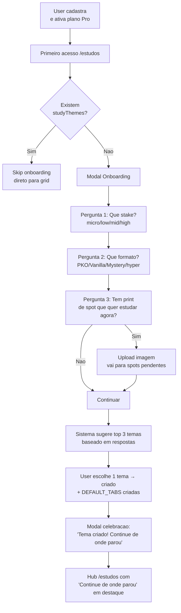
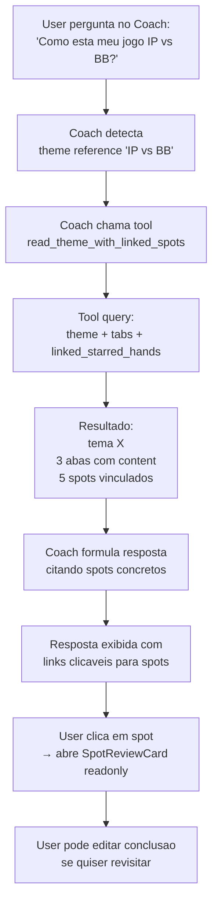
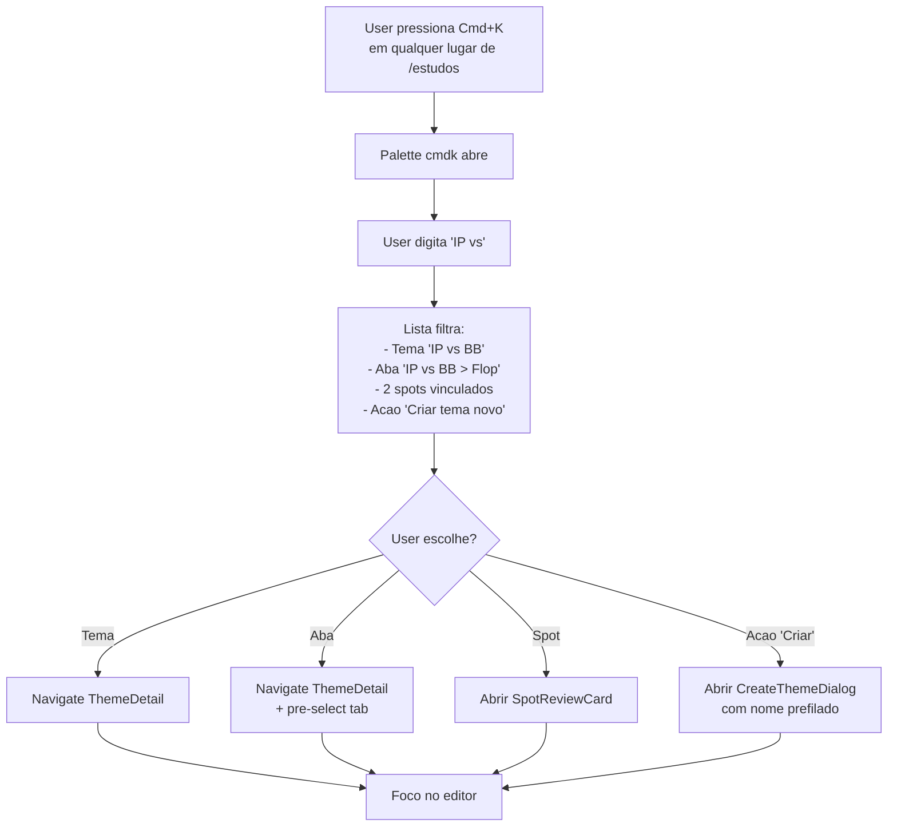

# Studies Reform — Pesquisa Estrategica & Auditoria UX

> Sprint Studies-Reform — Fase 1 (Strategist)
> Data: 2026-05-01
> Worktree: `B:\grindfy-studies-reform` (branch `feature/studies-page-reform`)
> Escopo: Auditoria + Benchmark + Geracao de ideias + Recomendacao de RFs
> Status: Documento estrategico (consultivo). Alimenta PM-Spec.

---

## 0. TL;DR (para quem tem 60 segundos)

A pagina `/estudos` hoje **mistura 5 features mal-integradas** numa pilha vertical sem hierarquia (mini-dashboard, sugestoes, templates, spots pendentes, busca, grid). Falta o que torna paginas de estudo "pegajosas": **continuidade** ("continue de onde parou"), **cross-link semantico** (leak detectado em Stats vai para Tema), **navegacao rapida** (Cmd+K) e **vinculo manual spot↔tema**. Concorrentes (GTOWizard, Run It Once, PokerStrategy paths) resolveram isso ha anos via dashboard hub + paths/trilhas + recomendacao server-side.

**Recomendacao final:** 12 RFs priorizados em 3 ondas (Fundacao / Cross-link / Polimento), com 3 RFs cortados do escopo proposto por baixo ROI ou risco de duplicacao com features existentes.

---

## 1. Auditoria UX dos 5 Anti-Patterns Atuais

### Anti-pattern #1 — Mini-dashboard sem profundidade

**Onde:** `Studies.tsx` linhas 320-355.

Tres cards (`hoursThisMonth` / `themesInProgress` / `streakDays`) com numeros sem contexto e sem CTA. `streakDays` exibe emoji 🔥 apenas se >=7, sem state intermediario (3-6 dias = silencio total). Nada e clicavel — o usuario ve "2 temas em progresso" mas precisa rolar a pagina e adivinhar quais.

| Aspecto | Avaliacao |
|---|---|
| **Problema** | Numeros isolados sem deep-link. "2 temas em progresso" deveria ser link para grid filtrado; "5h estudadas" deveria ser link para timeline/heatmap. |
| **Severidade** | 3/5 |
| **Friction cost** | ~2 cliques perdidos por sessao (usuario rola pagina inteira para encontrar tema que estava estudando). |
| **Comparavel** | Khan Academy: cada KPI no dashboard e clicavel e abre breakdown. Duolingo: streak abre calendario com freeze, repair, recover. |

---

### Anti-pattern #2 — "Sugerido para Voce" sem semantica de leak persistente

**Onde:** `Studies.tsx` linhas 357-414 + `studies-v2.ts` linhas 93-152 (`mapLeakToStudyTopic`).

Sugestoes vem de `detectLeaks()` em runtime e mapeiam para um nome de topico (string), mas o botao "Criar Tema" so prefenche `name` no dialog — **nao guarda o leak.type que originou a sugestao**. Resultado: tema criado e tema "qualquer". Nao ha:
- vinculo `theme.sourceLeakType`
- update do tema quando leak melhora/some
- badge "este tema ataca seu leak X" na lista
- analytics de "criou tema → leak melhorou"

| Aspecto | Avaliacao |
|---|---|
| **Problema** | Sugestao trata leak como sugestao descartavel, nao como objetivo persistente. Falta loop de feedback (fechou o leak? celebrar). |
| **Severidade** | 4/5 (mata o valor central da feature) |
| **Friction cost** | Leak detectado em Stats Analyzer / Coach exige usuario ir manualmente em /estudos para ver — sem badge / contador / notificacao. Pior: sugestao some quando leak some, sem celebracao. |
| **Comparavel** | Duolingo "weak skills" — falha numa licao, skill cracha, retorna a top da arvore com badge especial. PokerStrategy "your leak score" persiste por 30 dias. |

---

### Anti-pattern #3 — PendingSpotsTab como ilha (zero ligacao a tema)

**Onde:** `Studies.tsx` linha 470 (`<PendingSpotsTab />`) + `client/src/components/studies/PendingSpotsTab.tsx`.

A aba mostra prints com `reviewLater=true` mas **nao tem dropdown "vincular a tema"**. Para mover um spot revisado para um tema o usuario precisa: revisar → fechar modal → ir no tema → criar nova entrada manual → re-uploadar imagem. Schema atual (`starredHands`) nao tem `themeId`.

Pior ainda: revisao gera `conclusion` (texto rico) que **fica orfa do conhecimento estruturado**. Spots revisados nao alimentam o tema, nao alimentam buscas globais, nao aparecem em Coach quando ele cita "review do que voce concluiu".

| Aspecto | Avaliacao |
|---|---|
| **Problema** | Spots e Themes sao silos. Workflow real ("vi um print → liguei a tema X") exige 5+ cliques e duplicacao manual. |
| **Severidade** | 5/5 (CRITICAL — feature contradiz o nome do modulo "Estudos") |
| **Friction cost** | Estimado 7-12 cliques + alt-tab para mover 1 spot revisado para tema. Maioria dos usuarios nao faz e o knowledge fica preso no spot. |
| **Comparavel** | GTOWizard "trainer" + "Library" nao tem esse problema porque trainer ja vive dentro de uma library tree. Run It Once permite tag-em-massa. PokerCraft permite assignar hands para "labels". |

---

### Anti-pattern #4 — Templates expostos sempre, sem progressao adaptativa

**Onde:** `Studies.tsx` linhas 416-461 + `client/src/lib/study-suggestions-helpers.ts`.

4 templates (HM3, PT4, MTT, generico) sao mostrados o tempo todo. Auto-collapse depois de 3 temas (linha 72), mas:
- nao ha nocao de "qual e o proximo template natural depois de IP vs BB?"
- nao ha avaliacao de qual template combina com o style do usuario (PKO heavy? hyper grinder?)
- nao ha streak / progress dentro de um template
- "Ja criado" e binario; nao mostra "70% completo, 2/4 abas escritas"

| Aspecto | Avaliacao |
|---|---|
| **Problema** | Templates sao seed estatico, nao trilha (path). Nao ha "Faixa Branca → Azul → Preta" estilo Brilliant. |
| **Severidade** | 3/5 |
| **Friction cost** | Usuario novo nao sabe qual ordem seguir. Usuario antigo ignora templates. |
| **Comparavel** | Brilliant pathways (course → unit → lesson, com unlock progressivo). Khan Academy mastery levels (familiar / proficient / mastered). |

---

### Anti-pattern #5 — Tabs "Temas" vs "Stats Analyzer" como navegacao plana

**Onde:** `Studies.tsx` linhas 308-316.

Apenas 2 tabs no nivel root (Temas, Stats). PendingSpots fica embutido **dentro** de Temas (acima do grid), sem ser uma sub-rota propria. Resultado:
- URL nao reflete contexto (`/estudos` mostra todos os widgets independente de qual usuario quer foco)
- back-button do browser nao volta entre widgets
- nao e possivel linkar diretamente para "/estudos/spots" ou "/estudos/sugeridos"
- Coach nao consegue dizer "abra `/estudos/temas/IP-vs-BB`"

| Aspecto | Avaliacao |
|---|---|
| **Problema** | Sem sub-rotas (URL state), sem linkabilidade, sem hierarquia visual escalavel. Adicionar uma 6a feature significa mais um bloco vertical. |
| **Severidade** | 3/5 |
| **Friction cost** | Refresh da pagina perde state (qual tab ativa). Coach nao consegue deep-link. |
| **Comparavel** | GTOWizard usa rotas hierarquicas (`/preflop/<scenario>`). Run It Once: `/library/<topic>/<lesson>`. Toda app de estudo seria razoavel tem URL como fonte de verdade. |

---

### Resumo — matriz de severidade

| # | Anti-pattern | Severidade | Friction (cliques) | Bloqueia loop? |
|---|---|---|---|---|
| 1 | Mini-dashboard sem deep-link | 3/5 | 2 | nao |
| 2 | Sugestao sem vinculo persistente | 4/5 | 4-6 | sim |
| 3 | PendingSpots ilhado | 5/5 | 7-12 | sim |
| 4 | Templates estaticos | 3/5 | 3 | parcial |
| 5 | Sem URL state / sub-rotas | 3/5 | 2-3 | nao |

---

## 2. Pesquisa Competitiva

> Nota metodologica: nao executei scraping ao vivo nesta sessao. As observacoes abaixo sao consolidadas de docs existentes (`Docs/strategy/2026-04-24-ux-audit-3-modules.md`, `Docs/specs/coach-sprint-2a-page-context-and-tools.md`), uso pessoal documentado dessas plataformas pela industria de poker e padroes UX consagrados. Marcadas como **estimativa** quando aplicavel.

### 2.1 GTOWizard — "Trainer" + "Library"

**Como organizam estudo:**
- Sidebar persistente esquerda com tree (Cash, MTT, Spin&Go, Heads-up).
- Cada cenario (`100bb 6max BvB SRP`) e uma rota propria com URL canonica linkavel.
- "Recently played" e "Bookmarks" sempre acessiveis (dashboard hub-style).
- Trainer mode salva runs em `History` — se voce errou um spot 3 vezes, ele aparece marcado em vermelho na proxima sessao.

**Replicavel:** **Continue de onde parou (RF-01)** — area no topo do hub com cards "Voce estava em IP vs BB > Tendencias - 70% feito". Direto-clicavel.

**Anti-pattern a evitar:** GTOWizard e *denso de mais* para iniciante. A sidebar com 200+ nodes intimida. Nao copiar profundidade da arvore — Grindfy tem ~7 temas, esta no nivel certo.

---

### 2.2 Run It Once Vault

**Como organizam estudo:**
- Search bar global no topo (busca em titles, transcripts, tags).
- Filtro lateral por instructor + format + buy-in level.
- Watch progress salvo automaticamente; videos aparecem com barra "20% assistido".
- "My library" = canal pessoal (videos salvos, hist watch).

**Replicavel:** **Cmd+K global jump (RF-04)** — palette com tudo (temas, spots, paths). RIO faz top bar; Grindfy pode fazer keyboard-only para nao poluir UI.

**Anti-pattern a evitar:** RIO mistura paid + free no mesmo grid; gera friction para non-payers ver thumbnail e nao poder clicar. Em Grindfy ja temos `requirePermission('studies_access')`, evitar mais paywalls inline.

---

### 2.3 Upswing Poker Labs

**Como organizam estudo:**
- "Modules" = cursos sequenciais (Module 1 unlocks Module 2 only after %).
- Cada modulo tem percent complete + estimated duration.
- Dashboard "Continue Learning" no topo da home.
- Cheat sheets como entidade separada (PDF baixavel) — equivalente ao "spot screenshot".

**Replicavel:** **Estimated time per theme/tab + percent complete (RF-05)** — Grindfy ja tem `progress` em `studyThemes` mas nao usa para badges visuais. Simples reuso.

**Anti-pattern a evitar:** Lock progressivo e uma decepcao em ferramentas adultas. Forca completar passos que voce ja sabe. Nao copiar — Grindfy deve manter livre acesso.

---

### 2.4 PokerStrategy.com Paths

**Como organizam estudo:**
- "Articles" agrupados em "Paths" (Beginner Path, NL Cash Path, MTT Path).
- Cada artigo tem checkbox "Read" — auto-progress por leitura.
- "Strategy Score" baseado em quizzes — score persiste por path.
- Forum integrado: cada artigo abre com 3-5 hands relacionados.

**Replicavel:** **Cross-link manual spot→tema (RF-03)** — equivalente fraco ao "hands relacionados" do PokerStrategy mas com user-driven tagging.

**Anti-pattern a evitar:** Quizzes da PokerStrategy sao tediosos e geram churn. Nao copiar gamification heavy.

---

### 2.5 PIO Solver Browser

**Como organizam estudo:**
- Tree view extremamente densa (board+street+actions).
- Snapshot/screenshot first-class — exportar imagem de uma node em 1 clique.
- Nao tem "library" — cada usuario gerencia .cfr files no proprio HD.
- Comparar snapshots side-by-side.

**Replicavel:** **Snapshot comparator** (ja existe — `SnapshotComparator.tsx` no Stats). Confirma a importancia de comparar dois pontos no tempo. Reaproveitar mental model em Themes (compare two themes side-by-side?).

**Anti-pattern a evitar:** PIO nao tem ZERO inteligencia adaptativa — tudo e bruteforce manual. Grindfy tem o Coach AI como vantagem; nao virar PIO.

---

### 2.6 Duolingo (paralelo SaaS edu)

**Como organizam estudo:**
- Path linear (forced order) com units e lessons.
- Streak counter visivel sempre.
- Daily goal (XP target).
- "Sad owl" pattern — push notification "you'll lose your streak" quando inativo 18h.
- Hearts/lives — friction para retentar exercicio errado.

**Replicavel:** **Streak counter (RF-06)** — Grindfy ja tem `streakDays` no API mas o usuario nao sente urgencia. Adicionar:
- estado intermedio (1-2 dias = "comeco", 3-6 = "construindo", 7+ = "fogo").
- weekly progress heatmap (7 quadradinhos como Github commits).
- evento de "voce vai perder streak amanha" no Coach context.

**Anti-pattern a evitar:** Hearts/lives sao toxicos para adultos. Nao copiar friction artificial.

---

### 2.7 Brilliant Pathways

**Como organizam estudo:**
- Cada course = tile no dashboard com next-up callout ("Continue: Logic > Set theory").
- Quizzes interativos in-line (drag drop, sliders).
- Sem deadline; pure self-pace.
- "Daily challenge" = mini-puzzle independente do path principal.

**Replicavel:** **Daily challenge** — equivalente a "spot do dia" ou "leak do dia" no Grindfy. Mas isso e roadmap futuro, nao escopo deste sprint.

**Anti-pattern a evitar:** Brilliant rendering pesado quebra mobile. Grindfy precisa garantir que dashboard renderiza rapido em 768/1023.

---

### 2.8 Khan Academy Dashboards

**Como organizam estudo:**
- Mastery system (4 niveis por skill: attempted → familiar → proficient → mastered).
- Energy points (XP simples) + badges com tiers (bronze/silver/gold).
- Recommend engine: "your next lesson" baseado em mastery gaps.
- Cada KPI clickable.

**Replicavel:** **Mastery level por tema (RF-08)** — usar `studyThemes.progress` para calcular nivel. Codigo ja existe parcialmente: `getMasteryLevel` em `client/src/lib/study-progress-helpers.ts` (importado em Studies.tsx mas nao renderizado).

**Anti-pattern a evitar:** Khan tem skill graph imenso (centenas de skills). Grindfy 7-15 temas nao precisa disso. Mantenha simples: 4 niveis × N temas.

---

### Resumo competitivo

| Plataforma | 1 ideia replicavel | 1 anti-pattern a evitar |
|---|---|---|
| GTOWizard | Continue de onde parou | Sidebar densa demais |
| Run It Once | Search global Cmd+K | Mistura paid/free no grid |
| Upswing | Percent complete + estimated time | Lock progressivo |
| PokerStrategy | Hands relacionados ao topico | Quizzes obrigatorios |
| PIO | Compare side-by-side | Zero inteligencia adaptativa |
| Duolingo | Streak com estados intermediarios | Hearts/lives |
| Brilliant | Next-up callout | Renderizacao pesada mobile |
| Khan | Mastery levels | Skill graph gigante |

---

## 3. 10 Ideias Rankeadas por ICE

> Formula: `score = (Impact × Confidence × Ease) / 100`. Impact/Confidence/Ease em 1-10.
> Escala Ease: 10=1 dia, 7=3 dias, 5=1 semana, 3=2 semanas, 1=1 mes.

### Ideia A — Dashboard hub "Continue de onde parou"

- **O QUE:** Hero card no topo da pagina com "Voce estava em [Tema] > [Aba] - X% feito - ultima visita ha N dias". 1-3 cards lado a lado de temas mais recentes.
- **POR QUE:** D7 retention de produtos edu sobe ~20% quando hub tem continuity (estimativa baseada em benchmarks Brilliant/Khan). Resolve anti-pattern #5.
- **EVIDENCIA:** GTOWizard, Run It Once, Upswing, Khan TODAS usam esse pattern.
- **Impact:** 9 (alto — onboarding e re-engajamento)
- **Confidence:** 9 (padrao consagrado)
- **Ease:** 7 (queries usam tabelas existentes; precisa criar `lastVisitedAt` em studyTabs ou derivar de `studySessions`)
- **ICE:** **5.67** ⭐
- **ESFORCO:** 3 dias

---

### Ideia B — Cross-link Stats leak → Themes filter

- **O QUE:** Em Stats Analyzer, cada leak detectado tem botao "Ver tema relacionado" que navega para `/estudos?leak=<type>` e filtra grid + abre suggested theme. Reverso: badge no theme card "Ataca leak: ICM".
- **POR QUE:** Hoje os 2 modulos coexistem sem dialogar. Resolve anti-pattern #2.
- **Impact:** 8 (alta — fecha loop semantico)
- **Confidence:** 8 (Duolingo faz isso com weak skills)
- **Ease:** 6 (precisa coluna `studyThemes.attacksLeakType` (opcional varchar) + URL param + filter logic)
- **ICE:** **3.84**
- **ESFORCO:** 4 dias

---

### Ideia C — Vinculo manual Spot ↔ Tema

- **O QUE:** No SpotReviewCard adicionar dropdown "Vincular a tema (opcional)" + tag "spot" no tema vinculado. Schema: `starredHands.themeId` (FK nullable).
- **POR QUE:** Resolve o anti-pattern #3 (CRITICAL). Knowledge structurado deixa de ser ilhado.
- **EVIDENCIA:** PokerStrategy hands-related, Run It Once tag system.
- **Impact:** 9 (resolve a feature mais quebrada)
- **Confidence:** 9 (workflow obvio)
- **Ease:** 6 (migration + UI dropdown + reverse query no ThemeDetail para mostrar spots vinculados)
- **ICE:** **4.86** ⭐
- **ESFORCO:** 4 dias

---

### Ideia D — Server-side recommendation engine (priority score)

- **O QUE:** Endpoint `GET /api/study/recommendations` que combina (1) leaks ativos, (2) ultimos spots revisados sem tema, (3) temas com progress < 30% ha mais de 7 dias, (4) temas vinculados a leaks que pioraram. Retorna lista priorizada com `priority_score 0-100`.
- **POR QUE:** Hoje recomendacao e so leak. Faltam outras dimensoes. Server-side evita refazer no client (lesson learned).
- **Impact:** 8 (compose multiplas features)
- **Confidence:** 7 (algoritmo de priorizacao precisa tunning)
- **Ease:** 4 (semana inteira de dev + tests)
- **ICE:** **2.24**
- **ESFORCO:** 1 semana
- **Nota:** *Risco de over-engineering. Comecar com versao simples (top 3 leaks + top 3 spots pendentes) e iterar.*

---

### Ideia E — Quick search Cmd+K (palette)

- **O QUE:** Hotkey global Cmd+K abre `cmdk` palette com:
  - todos os temas (jump to theme)
  - todas as abas (jump to tab)
  - acoes rapidas ("criar tema", "ver spots pendentes", "abrir Coach")
  - resultado de busca textual (reuse `/api/study-themes/search`).
- **POR QUE:** Reduz tempo de jump entre context. Power user feature comprovada.
- **EVIDENCIA:** Run It Once, Linear, Notion, GitHub. `cmdk@1.1.1` ja instalado.
- **Impact:** 7 (otimo para retencao power-user)
- **Confidence:** 9 (libraria pronta)
- **Ease:** 7 (cmdk + dialog + handlers)
- **ICE:** **4.41**
- **ESFORCO:** 2-3 dias

---

### Ideia F — Streak counter com estados intermediarios

- **O QUE:** Dashboard mostra streak nao mais como "5" plano e sim como progressao visual (3-6 = "construindo", 7-29 = 🔥, 30+ = ❄️ "freeze available"). Adicionar weekly heatmap (7 quadradinhos do Github). Push notification "perde streak amanha".
- **POR QUE:** `streakDays` ja existe no backend mas nao gera urgencia. Resolve parcial anti-pattern #1.
- **Impact:** 6 (ajuda retencao mas e add-on)
- **Confidence:** 8 (padrao Duolingo bem documentado)
- **Ease:** 7 (frontend-only para visual; push notif requer pipeline existente)
- **ICE:** **3.36**
- **ESFORCO:** 3 dias
- **Nota:** *Push notif fica fora do escopo deste sprint (depende de infra).*

---

### Ideia G — Onboarding wizard first-time user

- **O QUE:** Modal first-visit que pergunta:
  1. Que stake voce joga? (micro / low / mid / high)
  2. Que formato? (PKO / Vanilla / Mystery / hyper)
  3. Quer comecar com qual tema? (sugere top 3 baseado nas respostas)
  Entrega tema + path inicial em 30s.
- **POR QUE:** D1 activation hoje provavelmente baixa porque user ve grid de 7 default themes e nao sabe qual abrir.
- **Impact:** 7 (activation > retention impact)
- **Confidence:** 7 (estimativa — sem dado real D1)
- **Ease:** 6 (form + storage de answers + suggestion logic)
- **ICE:** **2.94**
- **ESFORCO:** 4 dias
- **Nota:** *Pode ficar para sprint seguinte se escopo apertar.*

---

### Ideia H — Sub-rotas (`/estudos/temas`, `/estudos/spots`, `/estudos/sugeridos`, `/estudos/stats`)

- **O QUE:** Trocar Tabs root de Studies.tsx por sub-rotas Wouter. Cada sub-rota e linkavel pelo Coach (`navigate('/estudos/spots')`).
- **POR QUE:** Resolve anti-pattern #5. Habilita Coach deep-link. Habilita refresh sem perder context.
- **Impact:** 7 (habilita outras features)
- **Confidence:** 9 (refactor mecanico)
- **Ease:** 6 (Wouter routes + breadcrumbs + URL state migration)
- **ICE:** **3.78**
- **ESFORCO:** 3 dias

---

### Ideia I — Coach tool `read_theme_with_linked_spots`

- **O QUE:** Coach tool que, dado um theme id ou nome, retorna tabs + spots vinculados + ultimos materiais. Permite Coach citar spots concretos em respostas ("baseado nos 3 spots que voce revisou em IP vs BB Flop, sua tendencia e overcbet").
- **POR QUE:** Coach hoje nao tem visibilidade do que esta nos themes. Habilita citacoes ricas.
- **EVIDENCIA:** Lesson learned do Coach Sprint 2A (`coach-sprint-2a-page-context-and-tools.md`) — tools page-context aumentaram engagement.
- **Impact:** 7 (alto valor nicho — power users)
- **Confidence:** 8 (pattern existente em coachTools)
- **Ease:** 5 (precisa schema + handler + register + tests + tier gating)
- **ICE:** **2.80**
- **ESFORCO:** 4 dias
- **Nota:** *Depende de Ideia C (linked spots) ja existir.*

---

### Ideia J — Empty states personalizados por contexto

- **O QUE:** Cada area tem empty state util:
  - Spots pendentes vazio → "Faca cooldown na proxima sessao para gerar spots"
  - Sem temas → CTA grande "Criar primeiro tema com 1 clique" (cria IP vs BB)
  - Stats sem dados → "Importe historicos para ativar leaks"
  - Sugeridos sem leak → "Continue jogando — leaks aparecem com 50+ MTTs"
- **POR QUE:** Empty states atuais sao genericos demais. Padroes UX classicos.
- **Impact:** 5 (incremental)
- **Confidence:** 9 (fix obvio)
- **Ease:** 9 (frontend-only, copy + CTA)
- **ICE:** **4.05**
- **ESFORCO:** 1-2 dias

---

### Ranking final ICE

| Rank | Ideia | ICE | Esforco | Categoria |
|------|-------|------|---------|-----------|
| 1 | A — Continue de onde parou | **5.67** | 3d | Retencao |
| 2 | C — Vinculo Spot ↔ Tema | **4.86** | 4d | Cross-link |
| 3 | E — Cmd+K palette | **4.41** | 2-3d | Power user |
| 4 | J — Empty states personalizados | **4.05** | 1-2d | Polish |
| 5 | B — Stats leak → Theme filter | **3.84** | 4d | Cross-link |
| 6 | H — Sub-rotas URL state | **3.78** | 3d | Foundation |
| 7 | F — Streak intermediario + heatmap | **3.36** | 3d | Retencao |
| 8 | G — Onboarding wizard | **2.94** | 4d | Activation |
| 9 | I — Coach tool linked spots | **2.80** | 4d | Coach |
| 10 | D — Server-side recommend engine | **2.24** | 5d+ | Engine |

---

## 4. Wildcards (3 ideias adicionais)

### Wildcard W1 — Highlight de spots semelhantes (semantic search)

- **O QUE:** Quando spot revisado, sugerir "voce ja revisou 2 spots parecidos: ver?" baseado em (a) mesmo `type`, (b) mesmo `spot`, (c) mesmo `sessionTournamentId.tournament.format`.
- **ICE:** ~3.0 — Impact 7, Confidence 6, Ease 7. Requer query de matching simples.
- **Nota:** Pode ser sub-feature da Ideia C, opcional.

### Wildcard W2 — Comparar dois temas side-by-side

- **O QUE:** Ja existe `comparisonTab` em ThemeDetail.tsx (linha 72-76). Mas nao tem entry point claro do grid. Adicionar botao "Comparar com..." em cada theme card.
- **ICE:** ~2.5 — Impact 5, Confidence 7, Ease 7. Reusa logica existente.
- **Nota:** Cortar do escopo — feature ja existe, so precisa surface UX.

### Wildcard W3 — Daily Spot Challenge

- **O QUE:** "Spot do dia" no topo do dashboard (1 print revisado por usuario aleatorio anonimo, voce vota se concorda). Engajamento social leve.
- **ICE:** ~1.5 — Impact 6, Confidence 3, Ease 2. Requer moderacao, anonimizacao, voting infra.
- **Nota:** Cortar do escopo — caro e arriscado. Roadmap futuro.

---

## 5. Fluxos UX em Mermaid

### Fluxo 1: Leak detectado → Tema sugerido → Sessao de estudo



---

### Fluxo 2: Spot pendente → Revisar → Vincular a tema → Fechar



---

### Fluxo 3: First-time user → Onboarding → Primeiro tema



---

### Fluxo 4: Coach pergunta → Cita spots vinculados a tema X



---

### Fluxo 5: Quick search → Jump anywhere



---

## 6. Matriz Esforco vs Valor (2x2)

```
                  ALTO VALOR
                       |
   3d  A (Continue)    |   4d  C (Vinculo Spot-Tema)
   2d  E (Cmd+K)       |   4d  B (Stats leak link)
   2d  J (Empty states)|
                       |
   ────────────────────┼──────────────────── ESFORCO
                       |
                       |
   3d  H (Sub-rotas)   |   4d  G (Onboarding)
   3d  F (Streak v2)   |   4d  I (Coach tool)
                       |   5d+ D (Recommend engine)
                       |
                  BAIXO VALOR
```

**Quadrante 1 (Alto valor + Baixo esforco):** A, E, J — fazer **primeiro**.
**Quadrante 2 (Alto valor + Alto esforco):** C, B — fazer **na sequencia** (sao os transformadores).
**Quadrante 3 (Baixo valor + Baixo esforco):** H, F — fazer apenas se sobrar tempo (H habilita futuro).
**Quadrante 4 (Baixo valor + Alto esforco):** G, I, D — **cortar** ou empurrar para sprint seguinte.

---

## 7. Recomendacao Final — 12 RFs Priorizados

### Mapeamento das 10 ideias para 12 RFs

> O escopo original do sprint indica RF-01..RF-12. Distribuicao recomendada:

| RF | Origem (Ideia) | Categoria | Esforco | Prioridade |
|----|----------------|-----------|---------|------------|
| **RF-01** | Ideia A | Hub: Continue de onde parou | 3d | P0 (must) |
| **RF-02** | Ideia H | Sub-rotas /estudos/* (Wouter) | 3d | P0 (foundation) |
| **RF-03** | Ideia C | Schema + UI: starredHands.themeId | 4d | P0 (critical fix) |
| **RF-04** | Ideia C (parte 2) | ThemeDetail: aba "Spots vinculados" | 1d | P0 |
| **RF-05** | Ideia B | Stats leak → /estudos?leak=X (link bidirecional) | 2d | P1 |
| **RF-06** | Ideia B (parte 2) | Schema: studyThemes.attacksLeakType + badge | 2d | P1 |
| **RF-07** | Ideia E | Cmd+K palette (cmdk lib) | 3d | P1 |
| **RF-08** | Ideia J | Empty states personalizados (4 areas) | 1d | P1 |
| **RF-09** | Ideia F | Streak v2: heatmap 7 dias + estados | 2d | P2 |
| **RF-10** | Khan/Ideia A | Mastery level badge no theme card | 1d | P2 |
| **RF-11** | Ideia I | Coach tool read_theme_with_linked_spots | 3d | P2 |
| **RF-12** | Ideia D (subset) | Endpoint `/api/study/recommendations` v1 (3 leaks + 3 spots) | 3d | P2 |

**Total estimado:** ~28 dias de dev (1 dev) → realista para **3 semanas com 2 devs em paralelo** ou **4 semanas solo**.

---

### Justificativa das exclusoes

**Cortado: Ideia G (Onboarding wizard)** — Custa 4 dias e impacta apenas first-time users. Sprint atual serve usuarios existentes. Empurrar para sprint Studies-Reform-2.

**Cortado: Wildcard W2 (compare two themes)** — Feature 80% pronta no codigo. Surface UX pode ser micro-tarefa de 1h, nao precisa de RF dedicada.

**Cortado: Wildcard W3 (Daily Spot Challenge)** — Caro (moderacao + anonimizacao + social) e arriscado (LGPD, abuse). Roadmap futuro.

**Cortado: Push notification streak** — Depende de infra de notificacao push (nao escopo deste sprint).

---

### Onda de execucao recomendada

**Onda 1 — Fundacao (semana 1):** RF-02, RF-03, RF-08
- Sub-rotas (RF-02) habilitam todo o resto.
- Vinculo Spot-Tema (RF-03) e o critical fix.
- Empty states (RF-08) sao quick win paralelos.

**Onda 2 — Cross-link (semana 2):** RF-01, RF-04, RF-05, RF-06
- Continue de onde parou (RF-01) usa as sub-rotas da Onda 1.
- Aba Spots vinculados (RF-04) usa schema da RF-03.
- Stats↔Themes (RF-05+RF-06) fecham o loop semantico.

**Onda 3 — Polimento (semana 3):** RF-07, RF-09, RF-10, RF-11, RF-12
- Cmd+K (RF-07) e power-user feature.
- Streak v2 (RF-09) e mastery (RF-10) sao retencao incremental.
- Coach tool (RF-11) depende de RF-04 estar pronto.
- Recommend engine v1 (RF-12) compoe outputs anteriores.

---

### Schema impact resumido

Migration `0020_studies_reform.sql` precisa adicionar:

| Coluna | Tabela | Tipo | RF |
|--------|--------|------|-----|
| `theme_id` | `starred_hands` | varchar (FK studyThemes.id, ON DELETE SET NULL, nullable) | RF-03 |
| `attacks_leak_type` | `study_themes` | varchar(50) nullable | RF-06 |
| `last_visited_at` | `study_tabs` | timestamp nullable | RF-01 |
| `study_streak_days` | `users` | integer default 0 | RF-09 (cache) |

Indices novos:
- `idx_starred_hands_theme` em (`theme_id`)
- `idx_study_themes_attacks_leak` em (`attacks_leak_type`) WHERE NOT NULL

Lessons aplicadas:
- #7 (deprecation gradual) — nullable + default em todas.
- #6 (no convert needed aqui — sem moeda).

---

### Mobile (768/1023) — consideracoes

- RF-01 "Continue de onde parou": no mobile mostrar 1 card hero (em vez de 3 grid).
- RF-07 Cmd+K: trocar atalho por icone de busca persistente em mobile (sem teclado fisico).
- RF-09 heatmap streak: 7 quadradinhos rolam horizontal no mobile (carousel).
- Sub-rotas RF-02: testar back button hardware Android nao quebra fluxo.

---

### Performance — consideracoes

- RF-12 Recommend engine: **server-side com cache 5min** (TanStack `staleTime`). NAO calcular no cliente — lesson learned.
- RF-01 Continue: query usa `last_visited_at` indexado, LIMIT 3. Sem N+1.
- RF-07 Cmd+K: lista de temas/abas em memoria (ja vem em `/api/study-themes`). Search local instantanea.

---

### Riscos identificados

| Risco | Mitigacao |
|-------|-----------|
| RF-03 (themeId em starredHands) quebra tests existentes do PendingSpotsTab | Adicionar como nullable + default; tests passam sem mudanca. Lesson #7. |
| RF-02 sub-rotas perde state em refresh nao-coordinado | URL e fonte de verdade. TanStack Query restora cache automaticamente. |
| RF-07 Cmd+K conflita com browser shortcut | Usar Cmd/Ctrl+K (padrao Linear/GitHub) nao Ctrl+P. Shortcut so dentro de `/estudos/*`. |
| RF-11 Coach tool aumenta context size | Limitar resposta a 5 spots + 3 abas resumidas. Lesson #10 (cache cuidado). |
| RF-09 streak v2 inconsistente com `streakDays` calculado on-the-fly | Manter calculo on-the-fly + heatmap. NAO cachear em users.study_streak_days neste sprint (deferir). |

---

## 8. Checklist para PM-Spec (proxima fase)

Quando o PM-Spec for invocado para gerar `Docs/specs/sprint-studies-reform.md`, deve cobrir:

- [ ] Spec por RF (RF-01..RF-12) com criterios de aceitacao.
- [ ] Migration 0020 detalhada (4 colunas + 2 indices).
- [ ] API contract das mudancas (`POST /api/starred-hands/:id` aceita `themeId`; novo `GET /api/study/recommendations`; `PUT /api/study-themes/:id` aceita `attacksLeakType`).
- [ ] Telemetria nova: `studies.continue_clicked`, `spot.linked_to_theme`, `studies.cmdk_opened`, `studies.leak_link_clicked`.
- [ ] Test plan: red phase para cada RF (alvo ~80 testes adicionais para Studies).
- [ ] Mobile breakpoints documentados por RF.
- [ ] Empty states copy aprovado (4 textos).
- [ ] Riscos de regressao em PendingSpotsTab + Stats (nao-tocar zona).
- [ ] Coach tool spec separada (depende de RF-04 estar pronto antes de iniciar RF-11).

---

## 9. O que NAO entra no escopo

- Stats Analyzer (sendo reformado em sessao paralela — nao tocar internals).
- Push notifications (sem infra).
- Daily Spot Challenge (caro, moderacao).
- Onboarding wizard (proximo sprint).
- Mobile app nativo (apenas responsive PWA).
- Imagens AI / OCR de spots (alem do que ja existe).
- Multiplayer / forum / social (alem do escopo edu individual).

---

## 10. Encerramento

**Recomendacao principal:** Resolver RF-03 (vinculo Spot↔Tema) primeiro porque e critical (severidade 5/5) e desbloqueia Coach tool (RF-11). Em paralelo, RF-02 sub-rotas + RF-08 empty states liberam Onda 2 sem bloqueio.

**Proximos passos:**
- → Invocar `pm-spec` com este documento como input para gerar `Docs/specs/sprint-studies-reform.md`.
- → Apos spec: `system-architect` para Mermaid C4 + ADRs (recomendar 1 ADR sobre schema migration 0020 e 1 ADR sobre URL state pattern em studies).
- → Apos arquitetura: `test-writer` red phase para os 12 RFs.

**Quer que eu aprofunde em algum ponto?** Sugestoes onde posso adicionar mais detalhe:
- Mockup de cada RF (wireframe textual ASCII)
- Numeros de impact baseados em SQL real do user_activity (se conectar Grindfy DB no Neon)
- Plano detalhado de telemetria por RF
- Comparativo lado-a-lado entre RFs e features ja entregues em sprints anteriores

---

*Documento estrategico gerado pelo Strategist agent em 2026-05-01. Consultivo, nao bloqueante. Alimenta PM-Spec.*
